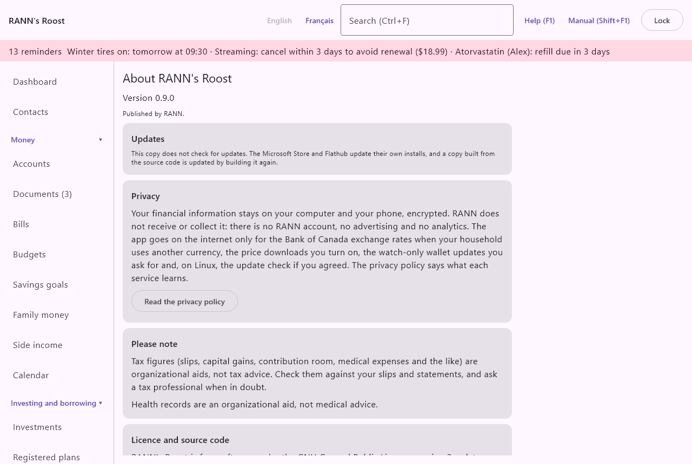

# About

The About screen shows which version of RANN's Roost you have, checks for updates on the copies that do, and gathers the privacy summary, the notices, the licence, support and the third-party software notices. It is the last item of the **Settings** group of the menu, under **About**. Before any household is open, the start screen's **About and privacy** shows the same content, with **Back** to return.

## Version {#version}

@index: version number; which version; release

At the top: "About RANN's Roost", "Version" and the version number of this copy, and "Published by RANN." Give the version number when you ask for help.

## Updates {#updates}

@index: update; upgrade; new version; update check; GitHub Releases; signature; AppImage; deb; rpm

How RANN's Roost is updated depends on how it was installed:

- From the Microsoft Store, or from Flathub on Linux: the store updates the app itself. The Updates card says "This copy does not check for updates." and explains why.
- A copy built from the source code is updated by building it again; it does not check either.
- The Linux .deb, .rpm and AppImage packages from GitHub Releases can check for updates themselves. The rest of this section is about them.

### The first-start question {#update-question}

On a copy that can check, the first start asks "Check for updates?". The app makes no request before you answer.

- **Check once a day**: turns the check on.
- **Don't check**: leaves it off.

The question explains what the check reveals: GitHub sees your computer's internet address and that the app is in use, as for any web page. Nothing about your household is sent. You can change your answer at any time on the Updates card.

### The Updates card {#updates-card}

- **Check for updates once a day**: turns the daily check on or off. The choice is kept on this computer. When it is off, the card says "Update checks are off. Turn them on to hear about new versions."
- **Check now**: checks at once. Shown while checks are on and nothing is running.

While the check is on, the app checks at most once a day while it runs. The card then shows one of:

- "Checking…".
- "RANN's Roost is up to date (checked" with the date and time.
- "Version" and the new number, "is available.", with the release notes in your language and **Download and check**.
- "Downloading…" with a percentage and a progress bar.
- The result of the download (see below).
- A problem, in red: GitHub could not be reached (with the reason), the update was refused because it could not be confirmed as a release signed by RANN, the download did not match RANN's signed release and was deleted, or the download failed.

When a new version is available, a banner at the top of every screen except About says "Version" and its number "of RANN's Roost is available. See About." Click it to come here.

### Download and install {#download}

- **Download and check**: downloads the new version and checks it before keeping it. Every release is signed by RANN; the list of files is checked against RANN's signature, and the file against the size and checksum in that signed list. A file that does not match is deleted and nothing is installed.

What happens next depends on the package:

- AppImage: the checked file replaces the running AppImage. The card says the version is installed and its signature was checked. Restart RANN's Roost to use it.
- .deb or .rpm: the checked file is saved in your Downloads folder. The card says where, and offers:
  - **Open with the software installer**: opens the file with the system's software installer, where you confirm the installation.
  - Or in a terminal: the command to install it, such as sudo apt install followed by the file (or sudo dnf install for an .rpm), which you can select and copy.

Your household is not touched by an update. A new version may update the household's files the first time it opens them; making a backup first is always wise.

## Privacy {#privacy}

The Privacy card sums up what happens to your information: it stays on your computer and your phone, encrypted. RANN does not receive or collect it: there is no RANN account, no advertising and no analytics. The app goes on the internet only for:

- the Bank of Canada exchange rates, when your household uses another currency;
- the price downloads you turn on;
- the watch-only wallet updates you ask for;
- on Linux, the update check if you agreed.

- **Read the privacy policy**: opens RANN's privacy policy in your web browser, in the language in use. It says what each service learns.

See also [Privacy and your data](privacy-data).

## Please note {#notices}

@index: disclaimer; not tax advice; not medical advice

- Tax figures (slips, capital gains, contribution room, medical expenses and the like) are organizational aids, not tax advice. Check them against your slips and statements, and ask a tax professional when in doubt.
- Health records are an organizational aid, not medical advice.

## Licence and source code {#licence}

@index: licence; license; GPL; free software; open source; source code; warranty

RANN's Roost is free software under the GNU General Public License, version 3 or later, and comes with no warranty. You may use it, study it, share it and change it under that licence. Its source code is on GitHub. The names RANN, RANN's Roost and RANN's Roost Mobile and the logo are © Perry Schippers, trading as RANN, and are not covered by the licence.

- **Source code on GitHub**: opens the source code's page in your web browser.

## Support {#support}

@index: help; contact; email; bug report; issue

Questions and problems: info-rann-apps@NorthMail.ca, or an issue on GitHub.

- **GitHub Issues**: opens the project's issue list in your web browser, where you can report a problem or suggest an improvement.

> Important: Never send passwords, recovery keys, backups or financial details, by email or on GitHub. Describe the problem, the version number and the steps that lead to it.

## Third-party software {#third-party}

@index: third-party notices; open source licences; libraries

RANN's Roost is built with other free and open-source software, whose licences require their notices to be shown.

- **Show the notices**: shows the full text of the notices below the button, which you can select and copy.
- **Hide the notices**: hides them again.
