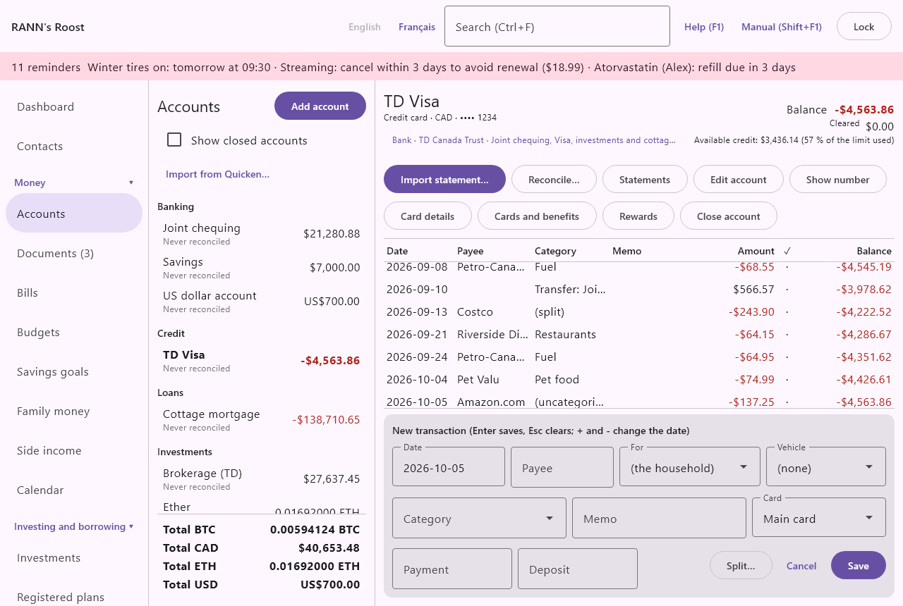
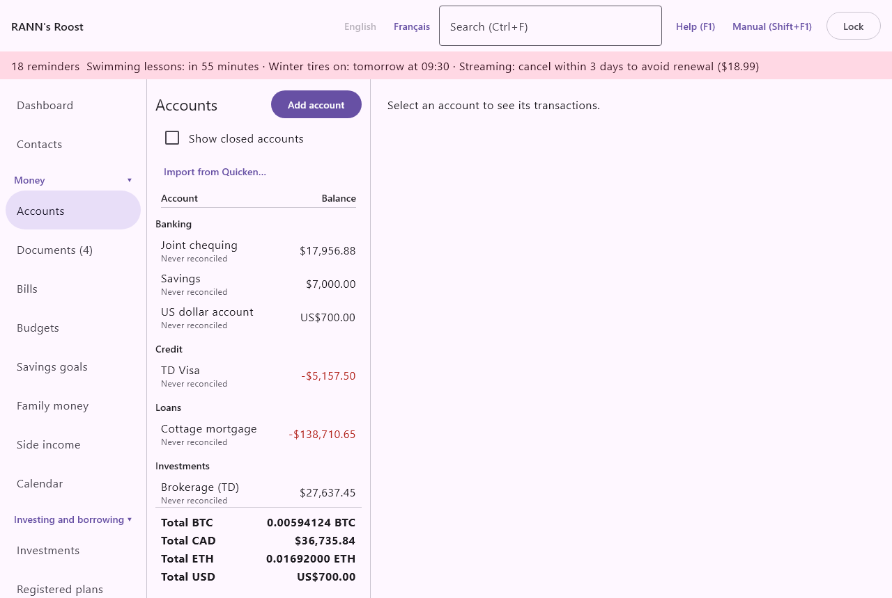
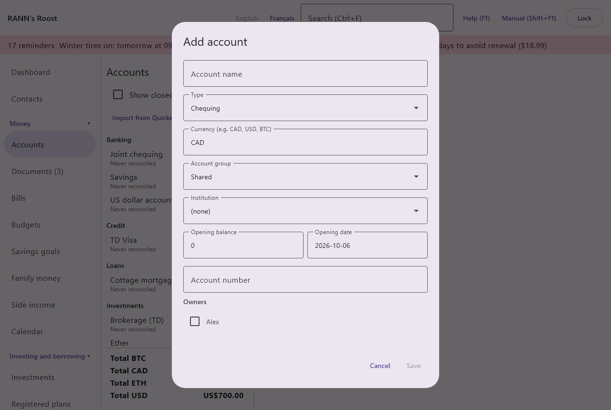
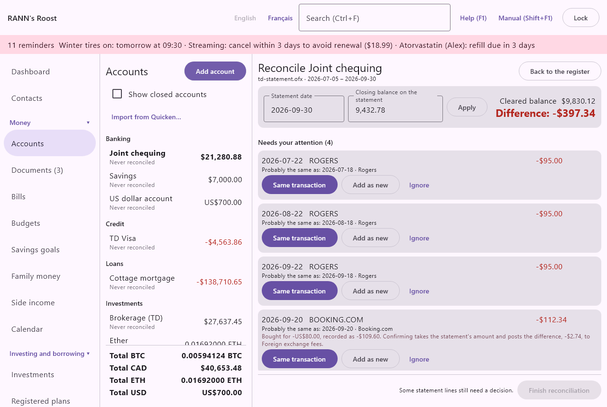

# Accounts

Accounts holds every account of the household (chequing, savings, credit cards, lines of credit, loans, mortgages, investment accounts and assets) with all of their transactions. It is the first screen of the Money group in the menu. From here you add and edit accounts, enter and import transactions, reconcile statements, and keep the details of credit cards: their terms, the cards on the account, their insurance benefits and their rewards.

For a short walk-through of the first steps, see [Getting started with accounts and transactions](start-money).

## The Accounts screen {#accounts-screen}

@index: account list; register; ledger

The screen has two parts:

- On the left, a narrow column with the title Accounts, the **Add account** button, the **Show closed accounts** box, the **Import from Quicken…** button, the list of accounts and, at the bottom, the totals.
- On the right, the register of the account you select. Until you select one, it says Select an account to see its transactions. When you are reconciling a statement, the reconciliation takes the place of the register (see [Reconcile a statement](accounts#reconcile)).

When the household has no account yet, the list says No accounts yet. Add your first account to get started.

### The account list {#account-list}

@index: balances; last reconciled

The accounts are grouped under headings by kind, always in this order: Banking, Credit, Loans, Investments and Assets. Each row shows:

- the account name, in bold when it is the one selected, followed by (Closed) for a closed account;
- under the name, Reconciled to followed by the date of the last reconciled statement, or Never reconciled. The date turns red when the last reconciliation is more than 45 days old (the default, set in [Rates and rules](rates-rules)), as a reminder to reconcile the next statement. The same accounts are listed on the Dashboard under Needs your attention;
- on the right, the balance today: transactions dated after today (a post-dated cheque, a payment entered ahead) are not counted yet. When an account has such transactions, a smaller line under the balance gives the balance once they are counted, such as 1 250,00 $ after post-dated. Negative balances are in red. Credit cards, lines of credit, loans and mortgages normally show a negative balance, since it is money owed.

Investment accounts are shown at their full value: the cash in the account plus the securities at their market value. In the register of an investment account, the balance is the cash only.

Click a row to open that account's register. Choosing another account leaves any reconciliation in progress; it stays open and you can continue it later.

### Totals {#totals}

At the bottom of the column, one line per currency, such as Total CAD and Total USD, adds up today's balances of the accounts listed in that currency (post-dated transactions are not counted). Debts are negative, so each line is what you own less what you owe in that currency. Accounts in different currencies are never added together here; the Dashboard's Net worth gives the household total in the base currency.

### Show closed accounts {#show-closed-accounts}

- **Show closed accounts**: when ticked, closed accounts appear in the list, marked (Closed), and are included in the totals. You can open them and read their history. When the box is clear, closed accounts are hidden everywhere day to day: the list, the totals, the account choices in the register and the Dashboard tiles. The box is not remembered when you leave the screen.

## Account types {#account-types}

@index: account type; chequing; savings; credit card; line of credit; HELOC; mortgage; loan; RRSP; TFSA; FHSA; RESP; RRIF; LIRA; LIF; GIC; pension; crypto; precious metals; real estate

The type is chosen when the account is created and cannot be changed afterwards, because every transaction depends on it. It decides the heading the account is listed under, how the Dashboard counts it, and which extra buttons the register offers.

### Banking accounts {#banking-accounts}

Listed under Banking and counted in the Dashboard's Cash available:

- **Chequing**: an everyday bank account.
- **Savings**: a regular savings account.
- **High-interest savings**: a savings account that pays a better rate.
- **GIC / term deposit**: a guaranteed investment certificate or term deposit held at the bank.
- **Cash**: the money in your wallet or a cash box. There is nothing to import; you enter what you spend.
- **Prepaid or gift card**: a prepaid card or gift card with a balance to spend.

The register of a Banking account also offers **Pay stub…** to enter a pay from its stub (see [Pay from a pay stub](accounts#pay-stub)).

### Credit accounts {#credit-accounts}

Listed under Credit and counted in the Dashboard's Owing on credit and loans:

- **Credit card**: a credit card. Purchases are payments out of the account, and paying the card from chequing is a transfer.
- **Line of credit**: an unsecured line of credit.
- **Home equity line of credit**: a line of credit secured by your home (HELOC).

The register of a Credit account adds **Card details**, **Cards and benefits** and **Rewards**. See [Credit card details](accounts#card-details), [Cards and benefits](accounts#cards-and-benefits) and [Rewards](accounts#rewards).

### Loans {#loan-accounts}

Listed under Loans and counted in Owing on credit and loans:

- **Loan**: a car loan, student loan, personal loan and so on.
- **Mortgage**: a mortgage on a home or cottage.

The register of a loan or mortgage adds **Loan details**, which opens Loans and mortgages, where you enter the rate, payment and term, and follow interest and renewals. See [Loans and mortgages](loans).

### Investment accounts {#investment-accounts}

Listed under Investments. The register holds the cash side of the account: deposits, withdrawals, fees and the cash of each trade. The securities themselves, their prices and their trades are kept under Investments. The register adds **Holdings**, which opens Investments. Lines that belong to an investment transaction (a purchase, a sale, a dividend) cannot be changed or deleted in the register; change them under Investments.

- **Brokerage (non-registered)**: an ordinary taxable investment account.
- **RRSP** and **Spousal RRSP**: registered retirement savings plans.
- **RRIF** and **Spousal RRIF**: registered retirement income funds.
- **LIRA** and **LIF**: locked-in retirement account and life income fund.
- **TFSA**: tax-free savings account.
- **FHSA**: first home savings account.
- **RESP**: registered education savings plan.
- **Pension plan**: an employer pension plan.
- **Crypto wallet**: a wallet or exchange account that holds one crypto-asset. Its currency must be a crypto-asset code such as BTC or ETH.
- **Precious metals**: gold, silver and other metals you hold.

Registered plans and pension plans are tax-sheltered: the app does not count capital gains on what happens inside them. Their contribution room and withdrawal rules are followed under [Registered plans](plans).

### Asset accounts {#asset-accounts}

Listed under Assets and counted in net worth:

- **Real estate**: a home, cottage or rental property, at the value you record.
- **Vehicle**: a car, truck or other vehicle, at the value you record.
- **Other asset**: anything else of value you want counted.

The balance is the value: the opening balance, changed by what you enter in the register. For the upkeep, warranties and insurance of a home or vehicle, see [Home and assets](assets) and [Vehicles](vehicles).

## Add or edit an account {#account-dialog}

@index: new account; create account; open an account

Choose **Add account** at the top of the account list (or **Add an account** in the Dashboard's Getting started guide). To change an existing account, open its register and choose **Edit account**. The same form is used for both: it is titled Add account or Edit account.

**Save** creates or updates the account; it stays greyed out until the name, a known currency, a valid opening balance and a valid opening date are filled in. **Cancel** or Escape closes the form without saving. A new account is selected right away, so its register opens.

### Fields of the account form {#account-fields}

- **Account name**: the name you see everywhere, for example Joint chequing or Visa Infinite. Required. Choose something that tells accounts apart at a glance; the full account number is kept separately.
- **Type**: the kind of account (see [Account types](accounts#account-types)). The default is Chequing. Fixed once the account is created: the field is greyed out when editing.
- **Currency (e.g. CAD, USD, BTC)**: the three-letter code of the currency the account is kept in. The default is CAD. Typing is turned into capitals. An unknown code is marked Unknown currency code. and the form cannot be saved. Every amount in the account is in this currency. A Crypto wallet needs a crypto-asset code. Fixed once the account is created.
- **Account group**: the group the account is stored in, which decides who can see and change it. It appears only when you add an account and you can edit more than one group. For an administrator, the first group is chosen; for another member, their own private group is chosen when they have one, so personal accounts stay private unless they choose a shared group. The group cannot be changed later. See [Users](users).
- **Institution**: the bank, credit union or broker that holds the account, from the list kept under [Institutions](institutions), or (none). It is shown in summaries such as the emergency and estate summary, and it is used to remember CSV import layouts: a layout confirmed for one account is offered again for every account at the same institution.
- **Opening balance**: the balance on the opening date, in the account's currency. The default is 0. For a credit card, line of credit, loan or mortgage, enter what you owe as a negative amount, for example -12500. The field accepts a calculation such as 1200 + 350 (see [Keyboard and calculator](accounts#entry-keyboard)). Every running balance, the cleared balance used to reconcile, the Dashboard and net worth start from this amount.
- **Opening date**: the date of that balance, typed as YYYY-MM-DD; the default is today. The + and - keys move it a day at a time. Choose the day before the first transaction you will enter or import, usually the closing date of the last statement before you start.
- **Account number**: the full account or card number. Optional. Only the last four characters are shown on screen (•••• 1234); the full number is kept encrypted and can be seen again only with your password (see [Show the full account number](accounts#show-number)). The last four digits are also used to pick the right account when a statement file holds several accounts. When editing, the field is empty and says Stored: •••• 1234. Leave empty to keep it.; type a new number only to replace it.
- **Owners**: one box per household member; tick the people who own the account (both spouses for a joint account). It appears once the household has members. Owners are used where ownership matters: the emergency and estate summary, the foreign exchange gains of each person, and the adjusted cost base of investments, which is pooled per owner. Leave all boxes clear for an account that belongs to the household as a whole.
- **Notes**: anything worth keeping with the account, such as the branch, an advisor's name or the interest rate. Several lines are allowed.

When you add a Credit card, Line of credit or Home equity line of credit, a note under the form reminds you that the card's limit, rates and due dates are entered with **Card details** after saving.

### What you can change later {#changing-an-account}

With **Edit account** you can change the name, institution, opening balance, opening date, account number, owners and notes. The type, the currency and the account group cannot change.

> Important: Changing the opening balance or opening date changes every running balance and the cleared balance of the account. If the account was reconciled, it may no longer agree with the statements already reconciled.

### Show the full account number {#show-number}

@index: account number; card number; reveal number

When an account has a stored number, its register shows **Show number**. It opens Show the full account number and asks: Enter your password to see the full account number.

- **Password**: your own login password. **Show number** checks it and displays the full number in large type; **OK** closes the window. A wrong password shows Wrong login name or password. and nothing is revealed. **Cancel** closes without showing anything.

Each time a number is revealed, it is recorded in the household's activity log.

### Close an account {#close-account}

@index: close account; closed accounts; archive account

When an account is no longer used, open its register and choose **Close account**. The app asks Close {account}? Its history is kept, and you can show closed accounts at any time. Choose **Close account** to confirm, or **Cancel**.

A closed account keeps all its transactions, statements and reports. It disappears from the account list (unless **Show closed accounts** is ticked), from the account totals, from the Dashboard's Cash available and Owing on credit and loans, and from the accounts you can transfer to. Reports that cover the past still include its history, and net worth counts its balance, which is normally zero by then.

> Tip: Move any remaining balance out with a transfer before you close an account, so its balance is zero.

> Note: The register of a closed account shows **Reopen account** in place of **Close account** (see [Reopen an account](accounts#reopen-account)).

### Reopen an account {#reopen-account}

@index: reopen account; closed by mistake; use a closed account again

To use a closed account again, tick **Show closed accounts**, open its register and choose **Reopen account**. It happens at once, without a question: the account comes back in the account list, the totals, the Dashboard tiles and the accounts you can transfer to, with all its history. You can close it again at any time.

## The register {#register}

@index: register; transactions; ledger; cheque book

The register is the list of an account's transactions, oldest at the top and newest at the bottom, with a running balance, and below it the form to enter or change a transaction. It opens scrolled to the newest transaction.

### Header and balances {#register-header}

At the top: the account name, then its type, currency and masked number (for example Chequing · CAD · •••• 1234). On the right:

- **Balance**: the balance today, counting every transaction dated today or earlier. When transactions are dated after today, a line under it says After post-dated transactions: with the balance once they are counted. The running balance in the register's last column counts every row, post-dated ones too.
- **Cleared**: the opening balance plus only the transactions marked cleared or reconciled. It should match what the bank shows once everything has gone through. Reconciling compares this amount with the statement.
- Available credit: on a credit card or line of credit that has a credit limit (see [Credit card details](accounts#card-details)), what can still be spent and the share of the limit in use, such as Available credit: 3 800,00 $ (24 % of the limit used). It is in red when the balance is over the limit.

### Buttons above the register {#register-buttons}

Which buttons appear depends on the account:

- **Import statement…**: reads a statement file from the bank. See [Import a statement](accounts#import-statement).
- **Reconcile…**: continues the statement being reconciled, if there is one; otherwise it opens Statements, where you can enter a paper statement. See [Reconcile a statement](accounts#reconcile).
- **Statements**: the statements of the account, past and in progress. See [Statements](accounts#statements).
- **Categories to review (number)**: only when a statement import filled in categories from the payees' habits that you have not checked yet. See [Categories to review](accounts#categories-to-review).
- **Templates…**: the transaction templates of the account's group. See [Transaction templates](accounts#templates).
- **Choose transactions…**: tick several transactions to categorize, tag, move or export them together. See [Change or export several transactions](accounts#bulk-edit).
- **Edit account**: the account form (see [Add or edit an account](accounts#account-dialog)).
- **Show number**: only when an account number is stored (see [Show the full account number](accounts#show-number)).
- **Card details**, **Cards and benefits** and **Rewards**: Credit accounts only.
- **Loan details**: loans and mortgages only; opens Loans and mortgages.
- **Holdings**: investment accounts only; opens Investments.
- **Close account**: only while the account is open (see [Close an account](accounts#close-account)).
- **Reopen account**: only on a closed account (see [Reopen an account](accounts#reopen-account)).

### Columns {#register-columns}

- **Date**: the date of the transaction.
- **Payee**: who was paid or who paid you.
- **Category**: the category; Transfer: followed by the other account for a transfer; (split) when the transaction is split across several categories; (uncategorized) when it has none. "(to review)" follows a category a statement import guessed from the payee (see [Categories to review](accounts#categories-to-review)).
- **Memo**: the note on the transaction.
- **Amount**: negative (in red) for money out, positive for money in.
- **✓**: the cleared mark (see [Cleared and reconciled marks](accounts#cleared-status)).
- **Balance**: the running balance after this transaction, counting every earlier one and the opening balance.

Click a row to load it into the form below for changes; the row is highlighted while you edit it.

### Cleared and reconciled marks {#cleared-status}

@index: cleared; reconciled; uncleared; tick off; outstanding

The ✓ column shows where each transaction stands with the bank:

- a dot (·): uncleared, recorded in the books but not yet seen on a statement;
- c: cleared, the bank shows it, but it is not yet part of a finished reconciliation;
- R: reconciled, part of a finished reconciliation and locked.

Click the mark to switch a transaction between uncleared and cleared, for example while ticking items off a paper statement. Clicking an R makes the transaction uncleared again; the app first asks you to confirm, because it changes a reconciled transaction (see [Changing a reconciled transaction](accounts#reconciled-changes)). Transactions imported from a statement come in already cleared.

### Earlier transactions {#earlier-transactions}

To open quickly however long the history, the register shows the latest 1,000 transactions. Above them, a line says Showing the latest 1000 of 4512 transactions. with **Show earlier transactions**, which adds 2,000 more each time. Running balances are always right, since they count every earlier transaction.

A transaction chosen in the search box at the top of the window opens in its account's register, loaded in the form, with earlier transactions loaded as needed.

## Enter a transaction {#enter-transaction}

@index: add transaction; new transaction; enter expense; record purchase; cheque

The form under the register is titled New transaction (Enter saves, Esc clears; + and - change the date). Fill it in and press Enter or choose **Save**. The transaction appears in the register at its date and the form clears for the next one, keeping the same date, which is handy when entering several receipts from the same day.

### Fields of the entry form {#entry-fields}

- **Date**: the date of the transaction, typed as YYYY-MM-DD (for example 2026-03-05). The default is today. The field turns red when the date is not valid, and saving then shows Enter the date as YYYY-MM-DD. Reports, budgets and statements use this date.
- **Payee**: who you paid or who paid you, such as a store, a person or an employer. As you type, names of payees you already have are offered; pick one with the mouse. A new name creates a new payee, which you can tidy up later under [Payees](payees). Optional.
- **For**: the person or pet the transaction was for, or (the household). The list holds the household members and the pets. It feeds the reports for one person and a pet's costs on the Pets screen. Hidden for a transfer.
- **Vehicle**: the vehicle the expense was for, or (none). Shown only when vehicles are set up under Vehicles. The expense then counts in that vehicle's costs. Hidden for a transfer.
- **Category**: what the money was for, chosen from a list you can type into to filter. The list holds (uncategorized), then all your categories with subcategories indented, then one Transfer: line for each of your other open accounts. Choosing Transfer: makes the transaction a transfer (see [Transfers between accounts](accounts#transfers)). The category decides where the amount counts in budgets, reports and taxes. When the transaction is split, this field is replaced by a button such as 3 split lines, which opens the split (see [Split a transaction](accounts#split-transaction)). See [Categories](categories).
- **Memo**: a free note, such as an invoice number or what was bought. It is shown in the register and found by search.
- **Card**: on a credit card that has more than one card (see [Cards and benefits](accounts#cards-and-benefits)), which card made the purchase: Main card or a supplementary card. It feeds Spending by card. Hidden for a transfer.
- **Payment**: the amount of money going out, typed as a positive number. Typing a payment clears the deposit.
- **Deposit**: the amount of money coming in, typed as a positive number. Typing a deposit clears the payment. One of Payment or Deposit is required, unless the transaction is split (the split then gives the amount); otherwise saving shows Enter a payment or a deposit.
- **Amount in {currency}**: appears only for a transfer to an account in another currency, for example Amount in USD. Enter what arrived in, or left, the other account. Required in that case; the exchange rate of the transfer is worked out from the two amounts.

Above the form, **Use a template** fills it from a template, on a new transaction, when the account has templates (see [Transaction templates](accounts#templates)). When the transaction has tags, or a template gave some, a line Tags: names shows them under the payee; its ✕ (Remove the tags) takes them off before you save.

When you edit a credit card purchase and the card has benefits, a line in colour under the payee says what still covers it, for example Purchase protection until 2026-06-03 · Extended warranty: 12 months added to the manufacturer's.

The buttons at the right of the form:

- **Split…**: shares the transaction across several categories (not offered for a transfer).
- **Pay stub…**: on a Banking account, when entering a new transaction, enters a pay from its stub (see [Pay from a pay stub](accounts#pay-stub)).
- **Sales tax…** and **Refund…**: when editing an existing transaction (see [Sales tax on a purchase](accounts#sales-tax) and [Record a refund](accounts#refund)).
- **Save as template**: when editing an ordinary transaction, keeps it as a template for next time (see [Transaction templates](accounts#templates)).
- **History…**: when editing, the change history of the transaction (see [Change history](accounts#transaction-history)).
- **Delete**: when editing (see [Edit or delete a transaction](accounts#edit-transaction)).
- **Cancel**: clears the form, like Escape.
- **Save**: saves, like Enter.

### Keyboard and calculator {#entry-keyboard}

@index: shortcuts; Enter; Escape; calculator; plus and minus keys

- Enter saves the transaction; Escape clears the form without saving. Both work from any field of the form.
- In any date field, typing + at the end of a valid date moves it one day later, and - one day earlier.
- Every amount field is a calculator: type 12.50 + 3.25, 3 * 4.99 or (100 - 20) / 4, and the result appears under the field (= 15.75 $); the result is what is saved. A field that cannot be read shows ?.
- Amounts follow your display language: 1,234.56 in English, 1 234,56 in French.

### Payee suggestions {#payee-suggestions}

@index: memorized transactions; autofill; auto-complete

When you pick a known payee from the suggestions on a new transaction, with no amount and no category entered yet, the app fills in the rest from that payee's most recent transaction in the same currency: the amount (as a payment or deposit, as last time) and the category, or all the split lines if it was split. When the payee has never been used in that currency, only the payee's default category is filled in. Change anything that is different this time before saving.

Rules under [Category rules](rules) categorize imported statement lines; they do not change what you type in the form.

### Transaction templates {#templates}

@index: template; memorized transaction; recurring entry; quick entry

A template is a transaction you enter often, saved under a name: rent, the weekly Costco run with its split lines, a donation. It fills the entry form in one step; you check the date and amount and press Enter.

- **Use a template**: above the entry form, on a new transaction, when the account has templates. Type a few letters of the name to filter the list (or open it with the arrow), then choose one with the mouse or the arrow keys and Enter. The form takes the template's payee, category (or split lines), memo, For and tags, and its amount as a payment or deposit when it has one in the account's currency. Whatever you had typed in those fields is replaced. The date stays as it was. Nothing is saved until you press Enter or **Save**, so you can change anything first. The payee's own suggestion (see [Payee suggestions](accounts#payee-suggestions)) is not applied on top.
- **Save as template**: click a transaction in the register, then this button. The window asks for the **Template name** (the payee is proposed) and offers **Keep the amount** (ticked: the template has the amount, as a payment or deposit; unticked: you type it each time) and **Only for this account** (unticked: the template is offered in every account of this account group). A split transaction keeps its split lines only with its amount, since each line needs one; the window says so when **Keep the amount** is unticked. Transfers and investment lines cannot be saved as templates.

**Templates…** above the register lists the templates of the account's group, each with its payee, category (or number of split lines), amount, the account it is limited to and its tags, with **Edit** and **Delete**. Delete asks first, "Delete the template "name"? Transactions entered with it stay as they are." **Add a template** opens an empty form. The form:

- **Template name**: required, and unique in the account group (otherwise: A template with this name already exists in this account group.).
- **Payee**: offered from your payees as you type. Optional.
- **Category**, or for a template saved from a split transaction, a line such as 2 split lines, $120.00 in all, with **Use one category instead** to replace them by a single category.
- **Payment** and **Deposit**: the amount, optional: "Leave both empty to type the amount each time."
- **Memo** and **For**.
- **Account**: **Any account in this group** (the default), or one account, in which case the template is offered only in that account's register and its amount must be in that account's currency.
- **Tags**: separated by commas. Tags that do not exist yet are created when a transaction is saved with them.

Templates are kept in the account group's own file, like its transactions, so a template in a private group is seen only by the users who can open that group. Adding, changing and deleting templates needs the right to change that group; anyone who can enter transactions in the account can use them. A template is not a schedule: for something that comes back on fixed dates, use [Bills](bills).

### Edit or delete a transaction {#edit-transaction}

Click a transaction in the register: the form's title becomes Editing transaction and the fields are loaded. Change what you need and save. The transaction keeps its cleared mark and its tags. A transaction recorded in a foreign currency keeps its original amount; when you change the amount, its rate is worked out again.

- **Delete**: asks first, Delete this transaction (...)? This cannot be undone., naming its date, payee and amount; for a transfer it says the transfer is deleted from both accounts. **Delete** confirms; **Cancel** keeps it. A reconciled transaction then asks a second time (see [Changing a reconciled transaction](accounts#reconciled-changes)). Deleting one side of a transfer deletes both sides. Lines of an investment transaction cannot be deleted here.
  In an RESP, deleting the deposit of a grant recorded under Registered plans asks whether to delete the grant too: see [Record a grant received](plans#record-grant).
- **Cancel** or Escape: leaves the transaction unchanged and clears the form.

Changing the category of a transfer to an ordinary category (or the reverse) replaces the transaction: the old one is removed and a new one is saved.

### Change history {#transaction-history}

@index: history; audit trail; who changed it; change log

Every transaction keeps a record of each change: when it was created, each time it was changed, and by whom. Click the transaction in the register, then **History…**. The window Change history lists the changes, oldest first. Each one shows the date and time, the user who made it and what was done (Created or Changed), then the transaction as it stood after the change: date, payee, amount, category (or (split), or Transfer), memo, and c or R when it was cleared or reconciled. Under a change, a grey line, Before:, gives the transaction as it was. Marking a transaction cleared or reconciled is a change too. **Close** closes the window. The history itself cannot be changed.

### Changing a reconciled transaction {#reconciled-changes}

@index: locked transaction; reconciled change

A transaction marked R is part of a finished reconciliation. Saving a change to it, deleting it, or clicking its mark first asks Change a reconciled transaction?, explaining that the account will no longer agree with that statement and that the change is recorded in the history. **Change it** goes ahead; **Cancel** leaves everything as it was. To redo a reconciliation properly, undo it first (see [Undo the last reconciliation](accounts#undo-reconciliation)).

## Change or export several transactions {#bulk-edit}

@index: bulk edit; several transactions; re-categorize; recategorize; tag several; move transactions; export transactions; QIF export; OFX export; CSV export; accountant

**Choose transactions…** (above the register) adds a box in front of each transaction and a bar above the columns. Tick the transactions to change or export, or click their lines; **Choose all shown** ticks every transaction loaded in the register (click **Show earlier transactions** first to include older ones) and **Choose none** clears the boxes. The bar shows how many are chosen. **Done** hides the boxes. While choosing, clicking a line ticks it instead of opening it in the entry form.

The bar's buttons act on the chosen transactions:

- **Categorize…**: one **Category** for all of them, or "(uncategorized)". A split transaction keeps its lines and amounts, and each line takes the category. **Save** changes them.
- **Add a tag…**: a **Tag**, new or existing (existing tags are suggested as you type), added to each one; tags they already have stay. **Save** adds it.
- **Move to…**: moves them to another account, chosen under **To the account**. Only open accounts in the same account group and the same currency are offered, since a transaction cannot leave its group's encrypted file. **Move** moves them; their categories, documents and history go with them, and a card chosen on a card purchase is cleared.
- **Export…**: saves them in a file, for another program or an accountant. Choose the **Format**, then **Save as…** asks where:
  - **CSV (spreadsheet)**: one line per transaction with the date, payee, category (Parent:Child; the categories of a split transaction joined by " | "; a transfer as [Account]), memo, amount, currency, cleared mark (c or R) and tags. In English, columns are separated by commas and decimals use a point; in French, by semicolons with a decimal comma, as French spreadsheets expect. Excel reads the accents.
  - **QIF (Quicken and others)**: for Quicken, GnuCash, Moneydance and most other money programs, with categories, splits, transfers and cleared marks. Dates are written month/day/year.
  - **OFX (bank statement format)**: as a bank download, with the date, amount, payee and memo but no categories. Each transaction carries its own identifier, so importing the same file twice finds the duplicates.

Categories are written in the language the app is in. The exported file is not encrypted: keep it somewhere safe. Each export is listed in the activity log as "Exported data" (see [Users](users)).

What is left as it was, and counted as such in the message after the change:

- transfers, which change from the register like any transfer, and investment cash lines, which change under Investments;
- for a move, transactions matched to a bank statement (undo the reconciliation first, see [Undo the last reconciliation](accounts#undo-reconciliation)) and those in an account of another currency.

When a chosen transaction is reconciled (marked R), the app first asks Change a reconciled transaction?, as for a single change; nothing changes until you confirm. Each changed transaction gets an entry in its change history (see [Change history](accounts#transaction-history)); a move shows as "Moved from (account) to (account)". Changing or moving needs the Edit permission on the account group; exporting only needs to see it.

## Transfers between accounts {#transfers}

@index: transfer; move money; pay credit card; credit card payment; mortgage payment

A transfer moves money between two of your accounts: paying the credit card from chequing, putting money into savings or a TFSA, a mortgage payment. It is recorded once and appears in both registers, so it never counts as spending or income.

1. Open the register of either account.
2. In **Category**, choose Transfer: followed by the other account.
3. Enter the amount as a **Payment** if the money leaves this account, or a **Deposit** if it arrives here.
4. If the other account is in another currency, fill in **Amount in {currency}** with what the other side received or paid.
5. Save.

Editing either side changes both. Changing the other account in Category moves the transfer to the new account. A transfer keeps its date, amount, payee and memo: it has no category, person or vehicle, and it cannot be split. A payee typed for a transfer, such as the name of the bank, is kept as text on both sides; it is not added to the list of payees.

> Tip: When a statement shows the same transfer in both accounts, import both statements: the second import matches the transfer already recorded instead of adding it twice.

## Split a transaction {#split-transaction}

@index: split; several categories; Costco receipt

Use a split when one payment covers several categories, such as groceries and household supplies on one receipt, or a mortgage payment of principal and interest.

Choose **Split…** in the form. The window Split transaction shows one row per part:

- **Category**: the category of this part, or (uncategorized).
- **Memo**: a note for this part.
- **Amount**: the amount of this part, as a positive number; it takes the direction of the transaction (payment or deposit).

When you open it, the first row holds the whole amount (and the category, if one was chosen) and an empty row waits below. **Add line** adds a row already filled with what remains. Under the rows, Remaining: shows what is left to share out, in red until it is zero. **Save** is available once the parts add up exactly to the transaction. Rows with no amount are dropped.

Some split lines carry more than the window shows: the lines of a pay entered from a pay stub are each marked for the person paid, and a line can carry its own tax treatment. These are kept when you change the split and save it again.

If you open the split before typing a payment or deposit, the window shows Total: instead, and the total of the parts becomes the amount of the transaction (as a payment, unless a deposit was typed).

After saving, the form shows a button such as 3 split lines in place of Category; click it to change the split. The register shows (split) in the Category column. Each part counts in its own category in budgets and reports.

## Sales tax on a purchase {#sales-tax}

@index: GST; HST; QST; PST; sales tax; input tax credit; ITC

To note the sales taxes a receipt shows, click the transaction in the register, then **Sales tax…**. The window Sales tax included shows the date, payee and amount of the transaction and explains: The GST, HST, QST or PST the receipt shows, or calculated from the total at the rates in effect. Useful for self-employment (input tax credits) and the year-end package; leave empty otherwise.

- **GST**: the federal goods and services tax on the receipt.
- **HST**: the harmonized sales tax (in the provinces that combine the federal and provincial taxes).
- **QST**: the Quebec sales tax.
- **PST**: a provincial sales tax (the PST of British Columbia or Saskatchewan, or Manitoba's retail sales tax, RST).

Above the amounts, a line shows the sales taxes in effect on the transaction's date in the province that applies, such as "Quebec, in effect on 2026-09-03: GST 5 %, QST 9.975 %". The province is that of the account's owners when they all have the same one, otherwise the household's. The rates come from [Rates and rules](rates-rules), by date, so an older transaction uses the rates of its day.

- **Calculate from the total**: fills **GST**, **HST**, **QST** and **PST** with the taxes included in the transaction's amount at those rates, and empties the others. For example, $114.98 in Quebec in 2026 gives GST $5.00 and QST $9.98. The amounts are only proposed: check them against the receipt (items that are not taxed, such as basic groceries, make the real taxes smaller), change them if needed, then **Save**.

Enter each tax as a positive amount in the account's currency; leave the others empty. The taxes cannot add up to more than the transaction. An empty or zero amount removes that tax. **Save** replaces what was recorded before. The amount and category of the transaction do not change: the tax is noted alongside it, and later edits of the transaction keep it. For self-employment and the tax package, see [Side income](side) and [Taxes](taxes).

## Record a refund {#refund}

@index: refund; return; money back; credit

When a store gives money back for a purchase, click the purchase in the register, then **Refund…** (offered for payments only). The window Record a refund shows the purchase and explains that the refund goes into this account with the purchase's payee and categories, so it lowers spending there, and stays linked to the purchase. If part was already refunded, it says Already refunded: and the amount.

- **Date**: the date of the refund; the default is today.
- **Amount refunded**: what came back, as a positive amount. It starts at what has not been refunded yet. The refunds of a purchase cannot add up to more than was paid.
- **Memo**: an optional note.

**Save** records a deposit in the same account with the purchase's payee, person, vehicle and card. When the purchase was split, the refund is shared across the same categories in proportion. **Save** is greyed out once the whole purchase has been refunded.

## Pay from a pay stub {#pay-stub}

@index: pay stub; paycheque; salary; deductions; income tax; CPP; QPP; EI; QPIP; union dues; T4

On a Banking account, when entering a new transaction (not while editing one), **Pay stub…** opens Pay from a pay stub. It records the pay as one deposit of the net pay, split into the gross pay and each deduction, so the income tax, CPP or QPP, EI or QPIP and union dues taken off your pay are all in the books.

- **Employer**: who paid you. Required. It becomes the payee of the deposit.
- **Pay date**: the date the pay went in; the default is today.
- **For**: the household member who was paid, or (the household). Every line of the deposit is marked for that person.
- **Paid into**: the account the pay went into. Shown only when the window is opened from somewhere other than a register, such as a pay stub filed in Documents; from a register, it is that account.

Earnings, one row per line of the stub (salary, overtime, vacation pay, bonus):

- **Description**: the line as printed, such as Regular pay. A line whose description contains bonus, commission or incentive goes to the Bonuses and commissions category; the others go to Salary and wages. Both are employment income in the tax package.
- **Amount**: the amount of that line.
- **✕**: removes the row (not available when only one row is left). **Add earnings** adds a row.

Deductions, one row per amount taken off; the window starts with Income tax, CPP / QPP and EI / QPIP:

- **Kind**: Income tax, CPP / QPP, EI / QPIP, Union dues, Pension plan, Group insurance, Group RRSP, Charity or Other. Each kind goes to its own category.
- **Description**: optional detail, such as the name of the insurance.
- **Amount**: the amount taken off, without a minus sign. Rows left empty are skipped.
- **✕**: removes the row. **Add a deduction** adds a row of kind Other.

Under the rows, a line shows the result, for example Gross 2 500,00 $ − deductions 742,18 $ = net 1 757,82 $. The net must be more than zero. When the window was filled in from a stub read by AI and the stub's own net pay differs, a red line says so: check the amounts or add the missing line. **Save** records the deposit; **Cancel** records nothing.

## Import a statement {#import-statement}

@index: import; download; OFX; QFX; QBO; CSV; bank statement; Quicken Web Connect; QuickBooks

Most banks and card issuers let you download your transactions. Importing them saves typing, categorizes them and prepares the reconciliation.

1. Download the statement from your bank's website, preferably as OFX, QFX or QBO (Quicken, Microsoft Money or QuickBooks format); otherwise as CSV (spreadsheet).
2. Open the account's register and choose **Import statement…**.
3. In the window Choose a statement file, pick the file. Files ending in .ofx, .qfx, .qbo, .csv and .txt are offered.
4. For a CSV file, confirm the columns (see [CSV files and the column layout](accounts#csv-mapping)).
5. The reconciliation opens with a summary of the import (see [What the import does](accounts#import-results)).

A file of another type is refused with This file type cannot be imported. Use OFX, QFX, QBO or CSV. A file that cannot be read gives The file could not be read: followed by the reason.

### OFX, QFX and QBO files {#ofx-files}

These files carry the dates, amounts, payees, a unique number for each transaction and, usually, the closing balance and statement period, so nothing needs to be set up.

When the file holds more than one account (some banks put chequing and savings in one download), the app chooses the account whose number ends with the same last four digits as the account number stored in the app. When it cannot tell, it asks This file holds several accounts. Which one belongs to this account? and lists each one as Account {number} · {currency} · {count} transactions. Click the right one, or **Cancel**.

The statement must be in the account's currency; otherwise the import stops with The statement is in USD, but the account is in CAD.

### CSV files and the column layout {#csv-mapping}

@index: CSV; spreadsheet; column mapping; Excel

A CSV file has no standard layout, so the app shows the first rows of the file and its best guess of which column is which, in a window titled Import followed by the file name. Header names in English or French are recognized. Check the guess against the preview, correct it, then choose **Import**. The layout you confirm is remembered for the institution of the account (or for the account itself when it has no institution) and offered next time.

- **The first row contains column names**: tick when the first row is headings such as Date, Description, Amount. That row is then shown in bold, used to name the columns in the lists, and not imported.
- **Date column**: the column holding the transaction date. Each column is listed as Column 1, Column 2..., followed by its heading when there is one.
- **Date format**: how the dates are written: yyyy-MM-dd, yyyy/MM/dd, yyyyMMdd, MM/dd/yyyy, dd/MM/yyyy, M/d/yyyy, d/M/yyyy, dd-MM-yyyy or yyyy-M-d. The guess picks a day-first format only when a day above 12 proves it, so check a known date. A date that does not fit stops the import and names the row.
- **Amounts**: how the file shows money in and out:
  - One column, negative for money out: a single amount column.
  - Separate withdrawal and deposit columns: two columns.
- **Amount column**: with one column, the column of the amounts.
- **Withdrawal column** and **Deposit column**: with separate columns, the column of money out and the column of money in. Either can be (none).
- **Description column**: the column with the payee or description. It becomes the payee, cleaned up and matched to your payees.
- **Memo column**: an extra details column, if any, kept as the memo.
- **Balance column**: the running balance column, if any. The balance on the latest row becomes the statement's closing balance, so you do not have to type it when reconciling.
- **Amounts use a decimal comma (1 234,56)**: tick when amounts are written the French way.
- **Purchases are shown as positive numbers (reverse the signs)**: tick when the file shows money out as positive numbers, as many credit card exports do. Every amount is then reversed.

**Import** is greyed out until an amount column, or a withdrawal or deposit column, is chosen. **Cancel** imports nothing.

### What the import does {#import-results}

@index: duplicates; matching; automatic categorization

Importing records the statement and goes through its lines one by one:

- A line already imported from an earlier statement (same bank number, or same date, amount and description) is marked Already imported and skipped, so overlapping downloads never create duplicates.
- A line that matches a transaction you already recorded (for example a receipt sent from the phone, or a transaction typed by hand) is linked to it. A match needs the same amount within 5 days. When the dates are within 3 days and it is the only candidate, or the payee looks the same, the link is made at once (Matched) and the transaction becomes cleared. Otherwise the line is marked To confirm, for you to decide.
- A purchase you recorded in a foreign currency can match a line that differs by up to 3.5 % by default (the conversion fee and the day's rate; set in [Rates and rules](rates-rules)); such a match is always To confirm.
- Every other line becomes a new transaction, already cleared (Added). Its category comes from your [Category rules](rules), or else from the payee's default category, or else from the category the payee had last time. A category from the payee is marked to review (see below); one from a rule is not.

The same file cannot be imported twice into the same account: This statement file has already been imported into this account.

The reconciliation then opens with a line such as Imported: 42 added, 6 matched, 2 to confirm, 3 already imported. The new transactions are in the register right away, even if you leave the reconciliation for later.

### Categories to review {#categories-to-review}

@index: suggested category; review categories; check categories; to review

A category taken from the payee's habits is usually right, but not always (the same store for groceries one week and a gift the next). Such transactions show "(to review)" after their category in the register, and **Categories to review (number)** appears above it. The window lists each one, oldest first, with its date, payee, category and amount:

- **Keep**: the category is right; the mark goes.
- **Change**: closes the window and opens the transaction in the entry form. Choose the right category and save: changing the category removes the mark. Saving with the same category, for example after changing only the memo, leaves it to review.
- **Keep all n** (or **Keep it**): accepts every category listed.

The category counts in budgets and reports from the start, whether or not you review it; the mark only helps you check. Changing the category in any other way, such as [Choose transactions…](accounts#bulk-edit), also removes the mark. Keeping a category needs the right to change the account group.

## Reconcile a statement {#reconcile}

@index: reconcile; reconciliation; balance the chequebook; statement balance; difference

Reconciling proves the books agree with the bank, to the cent, as of the statement date. Once a statement is reconciled, its transactions are locked, so a later mistake cannot silently change a period you checked.

The reconciliation opens after an import, from **Reconcile…** (which continues the statement in progress), or from **Continue** in Statements. It replaces the register. Its title is Reconcile followed by the account name, with the file name and the statement period under it. **Back to the register** leaves it; the statement stays In progress and you can continue later.

### Statement date and closing balance {#reconcile-balance}

The card at the top holds what the statement says and how far the books are from it:

- **Statement date**: the last day the statement covers, as YYYY-MM-DD. It is filled in from the file when the file gives it. Recorded transactions up to this date that are not cleared are listed as outstanding.
- **Closing balance on the statement**: the balance printed at the end of the statement. It is filled in from the file when the file gives it; otherwise type it.
- **Apply**: saves the two fields. Nothing changes until you apply.
- Cleared balance: the opening balance of the account plus every cleared and reconciled transaction.
- Difference: the closing balance less the cleared balance. It is green at zero and red otherwise. Until a closing balance is entered, it says Enter the statement's closing balance.

### Lines that need your attention {#reconcile-attention}

@index: to confirm; no match; unmatched

Under Needs your attention, with the count, each line the import could not settle is shown in a box with its date, description, cheque number and amount. For a line To confirm, a note says Probably the same as: followed by the date and payee of the transaction it seems to match. Choose one action per line:

- **Same transaction**: for a line To confirm: it is the transaction proposed. They are linked and the transaction becomes cleared.
- **Add as new**: it is a transaction you had not recorded: a new cleared transaction is added for it, categorized the same way as on import.
- **Link to a recorded transaction**: for a line with No match, when recorded transactions of the same amount are outstanding: pick the one it is, in a list showing their date and payee.
- **Ignore**: the line is left out, for example an information line that is not a real transaction. No transaction is created for it, and the line can no longer be acted on in this reconciliation.

### Statement lines {#reconcile-lines}

Under Statement lines, with the count, every other line of the statement is listed with its status:

- Matched: linked to a transaction already recorded.
- Added: a new transaction was created for it.
- Already imported: it was in an earlier statement.
- Ignored: you chose to leave it out.

A Matched or Added line has **Undo match**: it puts the line back to No match so you can settle it differently. For an Added line, the transaction that was created is deleted; for a Matched line, the transaction goes back to uncleared.

### Recorded but not on this statement {#reconcile-outstanding}

@index: outstanding cheques; uncleared items

Last comes Recorded but not on this statement, with the number outstanding. It lists the transactions recorded up to the statement date that no statement line accounts for: cheques not yet cashed, deposits in transit, or mistakes. Each has a box:

- Tick the box when the transaction does appear on the statement (for example when reconciling a paper statement); it becomes cleared and the difference changes.
- Leave it clear when it truly has not reached the bank yet; it stays outstanding for the next statement.

### Finish the reconciliation {#reconcile-finish}

At the bottom, **Finish reconciliation** is available once a closing balance is entered, every line is settled, and the difference is zero. Until then, a note says what is missing: Enter the statement's closing balance., Some statement lines still need a decision., or The difference must be zero to finish.

Finishing marks every cleared transaction of the account as reconciled (R) and locks the statement with its report. A message, Reconciliation complete, says how many transactions are now reconciled and locked, how many remain outstanding, and that the account agrees with the statement of that date. **OK** returns to the register. The account list then shows Reconciled to with the new date.

> Tip: If the difference will not go to zero, look for a transaction entered twice, an amount typed wrong, a line ignored by mistake, or a cleared mark set on something not on the statement.

### Foreign currency purchases on a card {#reconcile-fx}

@index: foreign exchange fee; conversion fee; USD purchase

When you recorded a purchase made in another currency (for example from a receipt in US dollars), the card's statement shows what it really cost in the card's currency, conversion fee included. When such a purchase is proposed for a line, the box explains, for example: Bought for 50,00 US$, recorded as 68,10 $. Confirming takes the statement's amount and posts the difference, 1,72 $, to Foreign exchange fees. Choosing **Same transaction** (or linking it) sets the transaction to the statement's amount and adds the difference as a line on the Foreign exchange fees category, so the fee shows in your spending.

## Statements {#statements}

@index: statement history; past statements

**Statements** in the register opens Statements for followed by the account name. Each statement is listed with its date and closing balance, then its status (In progress, Reconciled or Undone), the file it came from and, for an undone one, the reason given.

- **Continue**: for a statement In progress: opens its reconciliation.
- **Undo reconciliation**: for the most recent reconciled statement only (see [Undo the last reconciliation](accounts#undo-reconciliation)).
- **Enter a paper statement**: starts a statement typed in by hand (see [Enter a paper statement](accounts#paper-statement)).
- **Close**: closes the window.

When there are none, it says No statements yet. Import one, or enter a paper statement by hand.

### Enter a paper statement {#paper-statement}

@index: paper statement; manual reconciliation; passbook

For a statement on paper or in a PDF you cannot import, choose **Enter a paper statement**:

- **Statement date**: the last day the statement covers; the default is today.
- **Closing balance on the statement**: the balance printed at the end. Required.

**Save** creates the statement and opens its reconciliation. There are no statement lines: everything recorded up to the statement date is under Recorded but not on this statement. Tick each transaction that appears on the paper statement, add any that are missing in the register, and finish when the difference is zero.

### Undo the last reconciliation {#undo-reconciliation}

@index: undo reconciliation; reopen statement

When a reconciled period turns out to be wrong, choose **Undo reconciliation** on the most recent reconciled statement. Only the most recent one can be undone. The window Undo the last reconciliation explains that the transactions of this reconciliation become cleared again, so they can be changed, and that the statement goes back to In progress, to be reconciled again. The reason is kept with the statement.

- **Reason**: why you are undoing it. Required; the **Undo reconciliation** button stays greyed out until it is filled in.

The statement stays in the list as Undone, with the reason, as a record of what had been reconciled. Beside it, the same statement appears again as In progress, with the same date, closing balance and lines, still matched to their transactions. Fix what was wrong, then choose **Continue** (or **Reconcile…** in the register) and finish the reconciliation again. There is no need to import the file again, and it would be refused: This statement file has already been imported into this account.

## Credit card details {#card-details}

@index: credit limit; interest rate; APR; minimum payment; annual fee; due date

On a Credit account, **Card details** opens Credit card details. Every field is optional. Rates are typed as percentages, such as 19.99.

- **Credit limit**: the card's limit, in the account's currency. With it, the register shows the available credit and the share of the limit used, and the Dashboard's Owing on credit and loans tile gives the credit still available on all the cards that have a limit.
- **Purchase rate (%)**: the yearly interest rate on purchases. It is the rate shown for the card in the Debt summary report.
- **Cash advance rate (%)**: the yearly rate on cash advances. It is shown for the card in the Debt summary report.
- **Statement day (1-31)**: the day of the month the statement is produced. Kept for reference.
- **Payment due day (1-31)**: the day of the month the payment is due. While the card has a balance owing, each due date is on the [Calendar](calendar) as payment due, and it appears among the reminders from 7 days before (the default lead time in [Rates and rules](rates-rules)), leading back to Accounts. In a shorter month, the payment is due on the month's last day. To have the payment itself prepared and marked paid, set it up under [Bills](bills).
- **Minimum payment (% of balance)**: the share of the balance the issuer asks for each month, such as 3.
- **Minimum payment (at least)**: the smallest minimum payment, such as 10. The minimum payment is the larger of the percentage and this amount, but never more than the balance. It is shown for the card in the Debt summary report.
- **Annual fee**: the yearly fee of the card.
- **Fee charged on**: a date the annual fee is charged, as YYYY-MM-DD; it repeats every year. With an annual fee, a reminder appears 30 days before each anniversary (the renewal lead time in [Rates and rules](rates-rules)), among the reminders and on the [Calendar](calendar), leading back to Accounts, so you can decide whether the card is still worth it.

Days must be between 1 and 31, and rates between 0 and 100 %. **Save** keeps the details; **Cancel** leaves them unchanged. The Debt summary report is under [Reports](reports).

## Cards and benefits {#cards-and-benefits}

@index: supplementary card; authorized user; card insurance; purchase protection; extended warranty; price protection

On a Credit account, **Cards and benefits** opens Cards and benefits: followed by the account name. It has up to four parts: the cards on the account, spending by card, the card's benefits, and the purchases they still protect. **Close** closes it.

### Cards on this account {#card-holders}

The main cardholder and supplementary cards share this account and its statement. Each purchase can say which card made it, for spending by cardholder.

Each card is listed with its name, the last four digits (····1234) and main card or supplementary card.

- **Edit**: changes the card (see [Add or edit a card](accounts#card-holder-dialog)).
- **Delete**: removes the card at once. A card that purchases already use is not deleted but retired: it disappears from the lists and the purchases keep it.
- **Add a card**: adds a card.

Once the account has two cards or more, the entry form of the register shows **Card**, and this window shows Spending by card in followed by the year: what each card spent since January 1 (purchases less refunds; payments to the card are left out). Purchases with no card chosen count for the main card.

### Add or edit a card {#card-holder-dialog}

- **Household member**: the person who holds the card, or (none). Choosing a person fills in the name when it is empty.
- **Name on the card**: the name to show, such as Sam. Required.
- **Last four digits**: the last four digits of this card's number, to tell the cards apart. Exactly four digits, or empty; only these are kept.
- **Main cardholder**: tick for the main cardholder. Making a card the main one makes the others supplementary. The first card added is the main one when there is no other.

### Benefits {#card-benefits}

@index: certificate of insurance; travel insurance; rental car insurance; mobile device insurance

Benefits come from the card's certificate of insurance. Purchases made with the card show what still covers them; keep the certificate in [Documents](documents). Each benefit is listed with its kind, description and details (days covered, months added, longest warranty, limit per claim, notes), with **Edit** and **Delete** (immediate). **Add a benefit** adds one.

### Add or edit a benefit {#benefit-dialog}

- **Benefit**: the kind of benefit: Purchase protection, Extended warranty, Price protection, Travel medical insurance, Trip cancellation and interruption, Rental car insurance, Mobile device insurance or Other benefit.
- **Description**: a short description, such as the insurer or plan name.
- **Days covered**: for purchase protection, price protection and mobile device insurance, how many days after the purchase it covers (often 90 to 120). For travel benefits, the length of trip covered. A whole number above zero.
- **Months added**: for an extended warranty, how many months it adds to the manufacturer's warranty (often 12).
- **Longest warranty extended (years)**: for an extended warranty, the longest manufacturer's warranty it will extend.
- **Most paid per claim**: the most the insurer pays for one claim.
- **Notes**: conditions worth remembering, such as how to claim.

What the benefits do in the app: purchase protection, price protection and mobile device insurance protect each purchase made with the card for their number of days; an extended warranty adds its months to the manufacturer's warranty. When you open such a purchase in the register, the form says what still covers it and until when. Travel, trip cancellation, rental car and other benefits depend on the trip rather than a purchase, so they are kept for reference only.

### Purchases still protected {#protected-purchases}

When the card has benefits with days covered, this part lists the purchases made with the card that are still covered today, with their date, payee, coverage (such as Purchase protection until 2026-05-12) and amount. Only purchases of goods are listed: food, fuel, services, bills and fees are left out, since purchase protection covers items.

## Rewards {#rewards}

@index: points; cash back; miles; Aeroplan; rewards program; loyalty

On a Credit account, **Rewards** opens Rewards on followed by the account name: Points, cash back or miles: enter what each statement says you earned, and what you redeemed.

The program:

- **Program**: the name of the rewards program. Required before you can save.
- **Earned as**: Points, Cash back or Miles.
- **Earned per dollar spent**: how many points, miles or dollars of cash back each dollar of spending earns, such as 1.5 or 0.02. Optional; with it, the app estimates this year's earning.
- **Worth of one, in CAD**: what one point or mile is worth when redeemed, in the account's currency, which the label names (CAD, USD...), such as 0.01. Optional; with it, the app shows what the balance is worth. For cash back, enter 1.

Once the program is saved, the window also shows:

- a summary line: Balance (earned and adjustments less redeemed), worth (balance times the worth of one) and about how many were earned this year (this year's spending on the card times the earn rate, as an estimate);
- the latest twelve entries, with their date, kind, worth and number; **✕** asks "Delete this entry (kind, number, date)?" and, once confirmed, deletes the entry.

Under them, A new entry records what a statement shows. It is there from the start, so a new program and its first entry are saved together:

- **Date**: the date of the entry; the default is today.
- **What**: Earned, Redeemed or Adjustment.
- **How many**: the number of points, miles or dollars of cash back, more than zero.
- **Redeemed for (worth)**: for Redeemed only, what you got for them, in the account's currency.

**Save** saves the program and, when How many is filled in, adds the entry. **Close** leaves without saving.

## Import from Quicken {#quicken-import}

@index: Quicken; QIF; GnuCash; Moneydance; convert from Quicken; history

To bring years of history across from Quicken (or another program that exports QIF, such as GnuCash or Moneydance), first export a QIF file from that program with all accounts. Then choose **Import from Quicken…** under the account list and pick the file (Quicken export (QIF)).

The window Import followed by the file name first says what the file holds: the number of transactions and their date range, and, when there are any, how many investment actions (purchases, sales, income, splits) go into the investment accounts with their securities. A file that cannot be read says This file could not be read as a QIF export.

### Choosing where each account goes {#quicken-accounts}

Choose where each Quicken account goes: a new account, or one you already have. Transfers between accounts are imported once. Importing the same file again adds nothing that is already there.

- **Dates in the file**: Month first (03/14/2024) or Day first (14/03/2024). Usually the file tells; when it does not, a note says The file does not say: check a known date after importing.
- **Store in**: the account group the new accounts go into. It lists the groups you can edit, private ones marked (private); the default is your own private group, or else the first shared group.

Then one row per Quicken account, with its name and number of transactions:

- the box in front: tick to import the account; clear to leave it out. Transfers to an account left out become ordinary uncategorized lines, with the other account's name in the memo.
- **Import into**: A new account, or any of your accounts, each listed with its currency, such as Joint chequing (CAD). The app proposes an existing account with the same name. The amounts in the file are taken in the currency of the account chosen.
- **Type**: for a new account, its type. The app proposes one from the Quicken account kind and name (a Quicken account named TFSA or CELI becomes a TFSA, for example); check it, since it cannot be changed later.
- **Currency (e.g. CAD, USD, BTC)**: for a new account, its currency: the household's base currency unless you change it, for example to USD for a US dollar account. Typing is turned into capitals; an unknown code is marked Unknown currency code. It cannot be changed later either.

New accounts are created in the currency chosen, with Quicken's opening balance and the date of their first transaction. **Import** starts; it is greyed out until a date order and a group are chosen and at least one account is ticked. While it runs, it says Importing…

### After the import {#quicken-results}

Import finished is followed by Accounts created, Transactions, Transfers and Categories added, the number of investment actions, how many transactions were already there and not added again, and Notes: things to check, such as a transfer between two currencies imported as two separate lines.

What the import does with the Quicken data:

- Categories are matched with yours by name, in English or French, level by level; missing ones are created.
- Quicken classes become tags.
- Transactions marked reconciled in Quicken come in reconciled (R), those marked cleared come in cleared (c).
- Each transfer is created once, though Quicken writes it in both accounts.
- A transaction already in the account (same date, amount and payee) is skipped, so the import can be repeated safely.
- With investment actions, the QIF file itself is filed in Documents as the record of the import.

**Close** closes the window, before or after importing.

## Who can do what {#permissions}

@index: permissions; read-only; capture only; access

What you can do depends on your access to the account group of each account (see [Users](users)):

- Edit: add accounts in that group, change and close them, enter, change and delete transactions, import and reconcile statements, and keep card details, cards, benefits and rewards.
- Capture only: add new transactions, but not change or delete them.
- View: see the accounts and their registers only.

The **Account group** field offers only the groups you can edit. When you try something your access does not allow, the app says so and nothing changes.

## Precious metals and crypto wallets {#metals-and-crypto}

Precious metals and Crypto wallet accounts are listed under Investments on the Accounts screen and open a register like any account, with a **Holdings** button. Their holdings, the metals and coins themselves, watch-only addresses and exchange imports are managed under Investments. See [Investments](investments).

## Contacts {#linked-contacts}

@index: contact; linked contact; Link a contact

The form of a saved account (**Edit account**) ends with Contacts: the bank, lender, investment firm or advisor for the account, each with its what-for line and first phone. The form scrolls when it is taller than the window. In the register, the same contacts show under the account's name, such as Bank · TD Canada Trust · Joint chequing, Visa and cottage mortgage; click one to open it. The **Institution** chosen on the form stays as it is.

Click a contact to open its page in [Contacts](contacts); **Remove link** takes the link away, and **Link a contact…** picks one, in its role, or creates a **New contact…** and links it. See [Contacts on other screens](contacts#on-other-screens).
