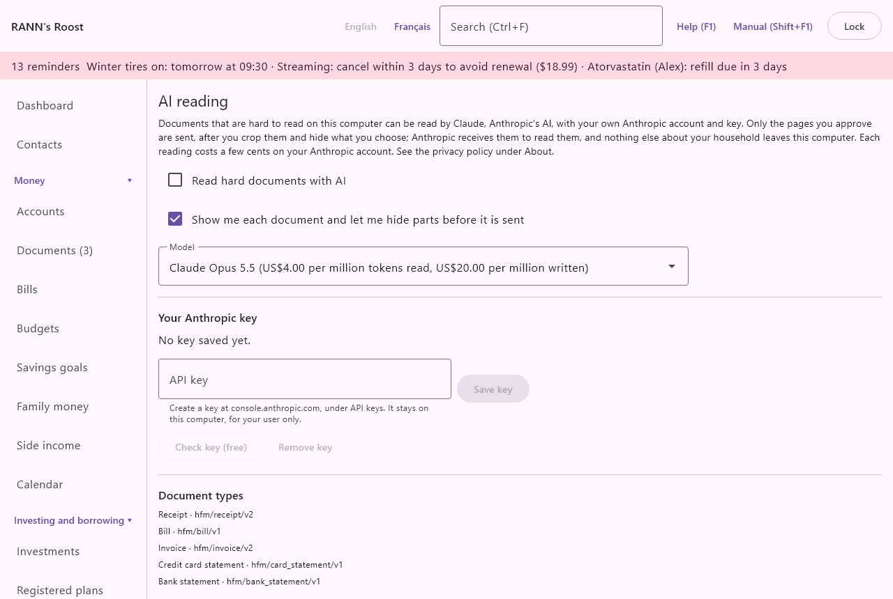

# AI reading

AI reading lets Claude, Anthropic's AI, read documents that are hard to read on this computer, such as a crumpled receipt, a long credit card statement or a pay stub, with your own Anthropic account and key. It is off until you turn it on. The screen is in the **Settings** group of the menu, under **AI reading**.

## How AI reading works {#how-it-works}

@index: artificial intelligence; Claude; Anthropic; cloud reading; OCR; read with AI; API key

Documents you add are first read on this computer, without the internet (see [Documents](documents)). That reading is good for clear receipts, but can miss fields on hard ones. AI reading is a second, optional way:

1. You turn AI reading on and save your own Anthropic key on this screen.
2. In the review of a document, you click **Read with AI**. The review shows "Some fields are uncertain: AI can read this document." when the computer's own reading is unsure.
3. Unless you turned it off, the app first shows you every page that will be sent, so you can hide parts of it (an account number, for example) or keep only part of a page. Nothing is sent before you click **Send**.
4. Claude reads the pages and answers with the fields of that type of document. The app checks the answer on this computer: the fields it expects and the sums (items against the subtotal, taxes against the total, a statement's transactions against its balances, gross pay less deductions against net pay). If the check fails, it asks once more saying what was wrong; if it fails again, you enter the fields by hand.
5. Fields read by AI are marked "read by AI" in the review, and the document shows which model read it and when. A statement read by AI can go straight into an account for reconciliation, a receipt's items can become a split transaction, and a pay stub can become the pay transaction. See [Documents](documents).

What leaves the computer: only the page images you approved, after your cropping and hiding, at most 2,000 pixels on the long side. Hidden areas are replaced by flat blocks before the picture leaves this computer. No text, account data or other household data is sent. Anthropic receives the pages to read them.

What it costs: each reading costs a few cents on your own Anthropic account. RANN receives nothing and charges nothing. The app shows an estimate before sending and keeps a log of every request with its estimated cost.

> Important: AI reading uses your own Anthropic account, billed by Anthropic. Read Anthropic's terms, and see the privacy policy under [About](about).

## Turn AI reading on {#turn-on}

1. Create an API key on console.anthropic.com, under API keys, in your own Anthropic account, and add credit there.
2. On this screen, paste the key into **API key** and click **Save key**.
3. Click **Check key (free)**. The app says "The key works." or why it does not.
4. Tick **Read hard documents with AI**.

### Settings {#settings}

These settings are your own: each user who signs in chooses for themselves, and they follow the household to any computer. A viewer cannot change them: they are greyed out, with the note "As a viewer, you cannot turn AI reading on: its readings are saved with documents, which viewers cannot change."

- **Read hard documents with AI**: off by default. When on, the review of a document offers **Read with AI** (or, if you have no key yet, "To read with AI, add your key under AI reading."). When off, nothing is ever sent, even with a key saved. Text documents are never offered.
- **Show me each document and let me hide parts before it is sent**: on by default. When on, clicking **Read with AI** opens the preview, where you can hide areas and crop pages before clicking **Send**. When off, every page is sent as it is, as soon as you click **Read with AI**.
- **Model**: the Claude model that reads. Each is shown with its list price, in US dollars per million tokens read and per million written. Claude Opus 5.5 (the default) is the most capable; Claude Sonnet 5.5 and Claude Haiku 4.5 cost less. A token is a small piece of text or image; a one-page receipt uses a few thousand.

> Tip: Keep **Show me each document and let me hide parts before it is sent** on. It is the only chance to hide a full account or card number before the page leaves the computer.

## Your Anthropic key {#key}

@index: Anthropic key; API key; credential; Windows Credential Manager; keyring

The key is the password of your Anthropic account for programs. It is kept in the computer's secret store, not in the household:

- On Windows, in the Windows Credential Manager.
- On Linux, in your desktop's keyring.
- On a Linux desktop with no keyring running, only in memory, until the app closes. The screen then says "This computer has no keyring running, so the key is kept only until you close the app."

The key is kept per household and per user. It is never written into the household's files or backups, so it is not on another computer, or in a restored household, until you save it there too. Each user who wants AI reading brings their own key.

The line under **Your Anthropic key** says "A key is saved in" and where, or "No key saved yet."

- **API key**: paste the key here. The text is hidden as you type. Spaces around it are removed.
- **Save key**: saves the key in the secret store and empties the field. The screen says "Key saved.", or "The key could not be saved:" with the reason.
- **Check key (free)**: sends a request that costs nothing to see whether Anthropic accepts the key. Available once a key is saved. The answer is "The key works." or the reason it failed (see [When a reading fails](ai#failures)).
- **Remove key**: deletes the key from this computer's secret store at once. "Key removed from this computer." AI reading then stops working for you on this computer until you save a key again. To cancel the key itself, delete it on console.anthropic.com.

## Document types {#document-types}

@index: schema; document type; custom document type

The **Document types** part lists what the AI can read, each with its version: Receipt, Bill, Invoice, Credit card statement, Bank statement, Investment statement, Pay stub and Explanation of benefits (the names follow the document kinds of the [Documents](documents) screen). The version is recorded with each reading.

For advanced users:

- The line "Your own types go in" gives a folder on this computer: on Windows, the ai-types folder under RANN's Roost in your AppData\Roaming folder; on Linux, ~/.config/ranns-roost/ai-types.
- **Open folder**: creates the folder if needed and opens it.
- A type is two files with the same name: a JSON Schema (name.json) saying exactly which fields to return, and an optional instruction (name.txt). A file with the same name as a shipped type replaces it.
- Types you added show "added" after their version. A file that cannot be used is listed in red as "Not used:" with its name and the reason, such as a schema that is not a closed JSON object.

## Usage {#usage}

@index: cost; tokens; usage log; Anthropic bill

The **Usage** part lists your own requests, newest first. Each user sees only their own, since each pays for their own.

- **Period**: This month, This year or Everything.
- The total for the period: the number of requests and "about" their estimated cost in US dollars.

Each line shows:

- The date and time of the request.
- The document, or "(deleted document)" if it was deleted since.
- The type of document.
- The model that answered. With Claude Opus 5.5, Anthropic may have another model answer a request it declined; the log names the model that actually answered.
- The tokens read and written.
- The estimated cost, from the list price.
- "accepted" if the answer passed the checks, "refused" if it did not. A refused answer is still billed by Anthropic.

The cost is an estimate from list prices; your Anthropic bill is what counts. The screen shows up to 200 lines.

## When a reading fails {#failures}

@index: AI error; key refused; no credit

The review of the document says what went wrong:

- "The key was refused. Check it under AI reading.": the key is wrong, expired or deleted. Save a new key.
- "Anthropic refused for now: too many requests, or no credit left on your account.": wait, or add credit on console.anthropic.com.
- "Anthropic could not be reached. Check the internet connection."
- "Claude declined to read this document."
- "The answer could not be checked, even after asking again; enter the fields by hand."
- "The document is too long to read at once; send fewer pages.": crop or leave out pages in the preview.
- "Anthropic returned an error.", with the service's message.

Nothing is changed in your books by a failed reading.

## Privacy {#privacy}

- Nothing is sent unless AI reading is on, a key is saved, and you click **Read with AI** for a document.
- Only page images are sent, after your cropping and hiding.
- Documents in a private account group stay private: the reading and its log are kept in that group.
- The household's shared activity log records that a document was read by AI and with which model, never what it holds.

See [Privacy and your data](privacy-data).
