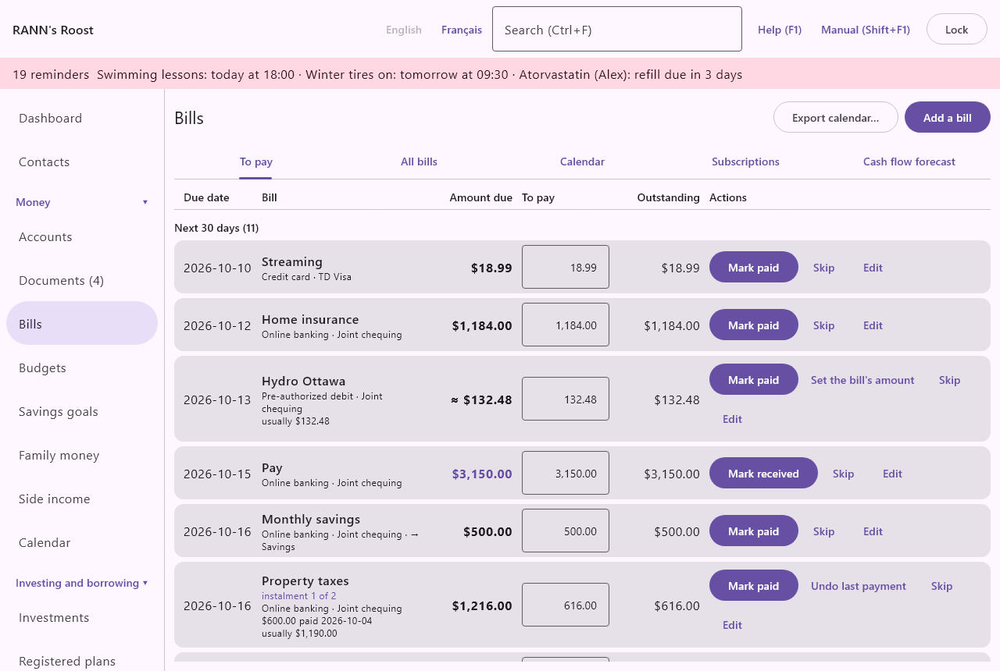
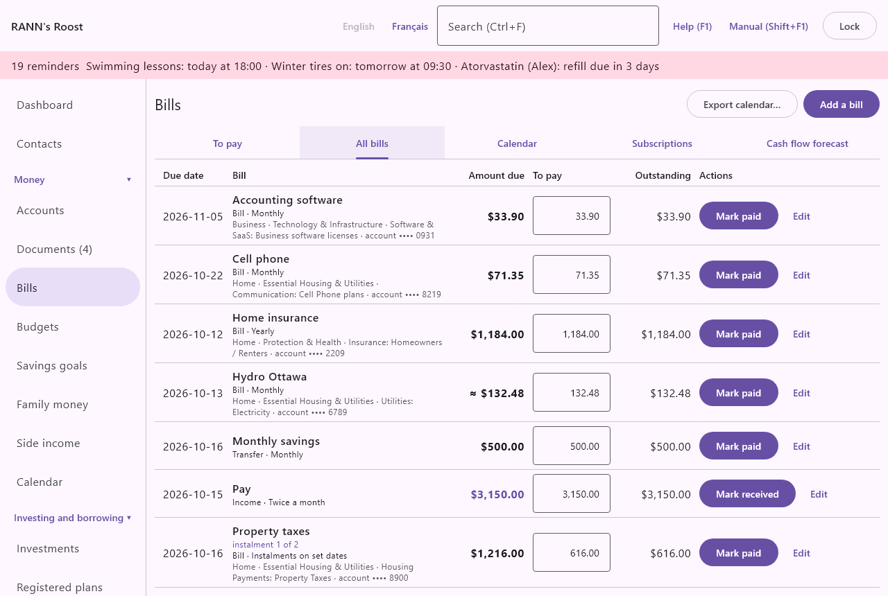
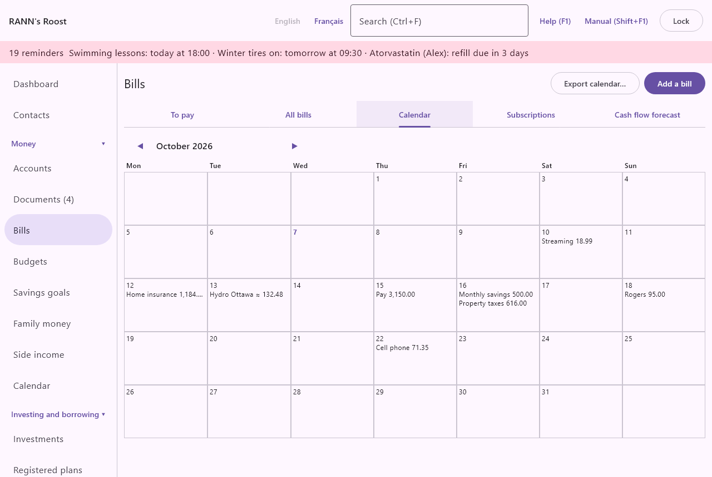
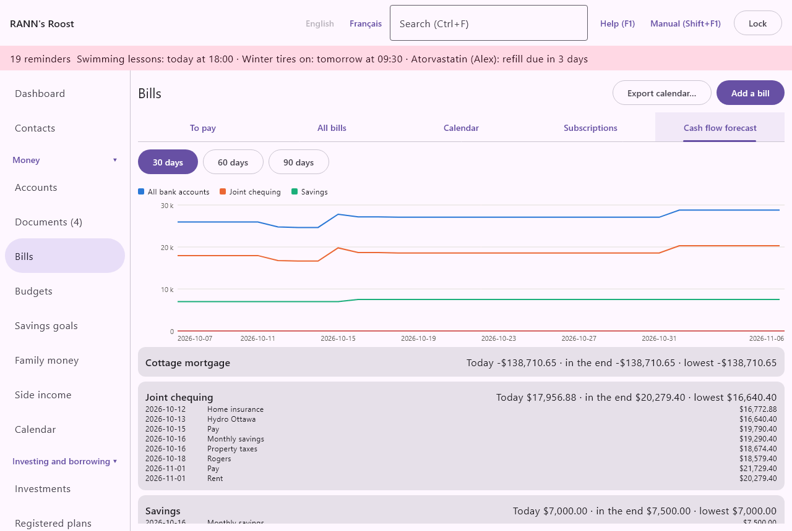
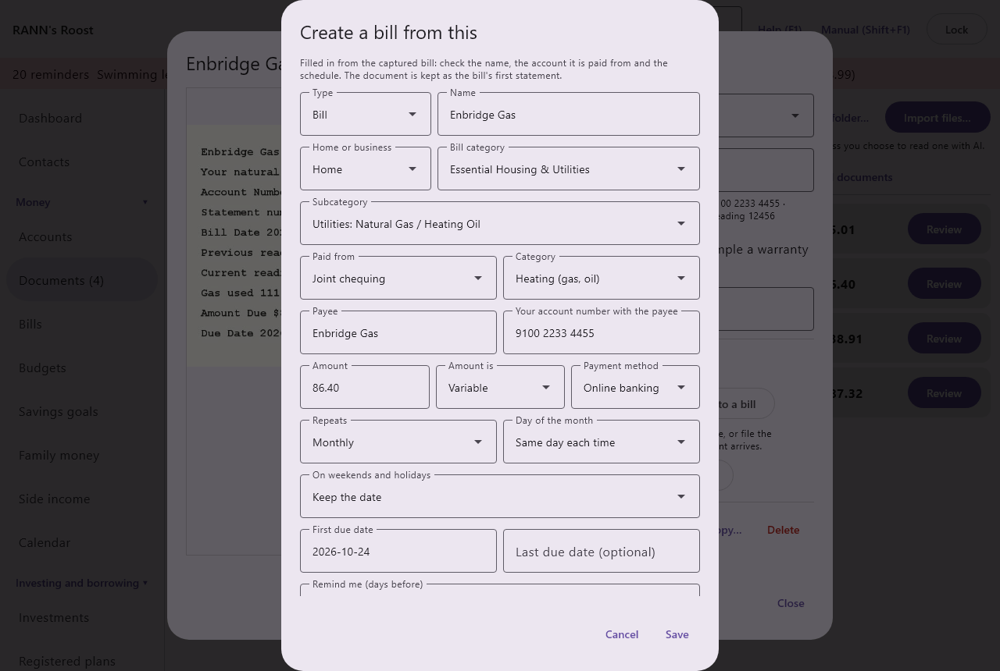

# Bills

Bills keeps track of everything that comes back on a schedule: rent or mortgage, hydro and heating, phone and internet, insurance, property tax, subscriptions, your pay, and regular transfers to savings. It reminds you before each due date, records the payment when you mark it paid, and projects your account balances so you can see a shortfall coming. Bills is in the Money group of the menu.

RANN's Roost does not pay bills for you. You pay through your bank as usual; the app records, reminds and forecasts.

## What the Bills screen does {#overview}
@index: bill payment; recurring payments; scheduled transactions; due dates; reminders

The title bar has two buttons:

- **Export calendar…**: saves your due dates as a calendar file. See [Export calendar](bills#export-calendar).
- **Add a bill**: opens the bill form. See [Add or edit a bill](bills#bill-form).

Under it are five tabs:

- **To pay**: what is overdue, due today and due in the next 30 days (the default window, set in [Rates and rules](rates-rules)), with the amount due, the amount to pay, what is still outstanding, and the buttons to pay, skip or set the bill's amount.
- **All bills**: every bill, income and transfer you set up, each with its next due date.
- **Calendar**: a month view of due dates.
- **Subscriptions**: what each subscription costs a year.
- **Cash flow forecast**: each account's projected balance over 30, 60 or 90 days; 30 by default ([Rates and rules](rates-rules)).

## Bills, income and transfers {#bill-types}
@index: recurring income; pay day; payday; scheduled transfer; automatic savings

One form handles three types of scheduled items:

- **Bill**: money you pay out on a schedule. Marking it paid records money out of the paying account.
- **Income**: money you receive on a schedule, such as your pay, a pension, the Canada Child Benefit or rent from a tenant. Marking it received records money into the account. Its amount is shown in colour.
- **Transfer**: money you move between two of your own accounts on a schedule, such as a monthly transfer to savings or a credit card payment from chequing. Marking it paid records a transfer between the two accounts.

## Add or edit a bill {#bill-form}

**Add a bill** opens an empty form titled "Add a bill"; **Edit** on any line opens the same form titled "Edit bill". **Save** is available once the bill has a name and an account. **Cancel** closes the form without saving.

### Type and name {#type-and-name}

- **Type**: Bill, Income or Transfer. See [Bills, income and transfers](bills#bill-types). The type changes which fields follow. Default: Bill.
- **Name**: how the bill is called in every list, reminder and calendar, for example "Hydro-Québec", "Rent" or "Pay - Marie". Required.

### Home or business, category and subcategory {#classification}
@index: bill type; bill category; bill subcategory; business bill; classify a bill; Home; Business

Shown for a bill (not for income or a transfer). They say what the bill is for, using the bill lists of Settings: see [Bill lists](categories#bill-lists).

- **Home or business**: Home for the household's bills, Business for the bills of someone's business or side work. "Not classified" leaves the bill without a classification. Changing it clears the two fields below.
- **Bill category**: the group the bill belongs to, such as Essential Housing & Utilities, Transportation & Mobility or, for a business, Technology & Infrastructure. Only the categories of the chosen type are offered.
- **Subcategory**: what exactly the bill is, shown under its heading, such as "Utilities: Electricity", "Communication: Cell Phone plans" or "Software & SaaS: Business software licenses". Choosing one fills in **Category** with the subcategory's spending category, unless you chose another category yourself; you can still change it. A utility subcategory (electricity, gas, water) also proposes the meter of that kind when there is only one, and shows the meter readings on the bill's statements.
- **Business of** (Business only): the person whose business the bill belongs to. Required for a Business bill. Its payments count as this person's business expenses in the [year-end package](taxes#year-end-package), with the sales taxes paid on them, whatever category they have.

### Accounts and category {#accounts-and-category}

- **Paid from** (for a bill or transfer) or **Deposited to** (for income): the account the money leaves or arrives in. The bill's amount is in this account's currency. It is used by the forecast and by the overdraft warning, and the payment is recorded in it. It can be chosen only when you create the bill; to change it later, create a new bill. Required.
- **To account** (transfer only): the account the money goes to. It must be a different account.
- **Category** (bill and income only): the category the payment is recorded under, for example Utilities: Electricity or Income: Salary. It decides where the payment counts in budgets, reports and tax figures. "(none)" records the payment without a category.

### Payee {#payee}

Shown for a bill or income, not for a transfer.

- **Payee**: who you pay, or who pays you. It becomes the payee of the recorded transaction. If empty, the bill's name is used. It also helps the app recognize a scanned or downloaded bill as this one.
- **Your account number with the payee**: the account or customer number printed on the bill. Optional. When you scan or import a bill, the app compares the last four digits with this number to find the right bill. Once saved, it is shown masked, with only its last four characters ("•••• 6789"), like account numbers elsewhere: **Show number** asks for your password again and shows it in full, and **Change** lets you type another one (leave it empty and save to remove it). After three wrong passwords, each further try must wait a little longer.

### Amount {#amount}

- **Amount**: the amount of each payment, in the account's currency, as a positive number. For a variable bill, enter a typical amount. You can type a simple sum, such as 45.20+12. If left empty, the amount is zero.
- **Amount is**: how sure the amount is.
  - **Fixed**: the same every time, such as rent or a subscription. The amount is used as is.
  - **Variable**: changes every time, such as hydro or a credit card. Until you enter the actual amount of a due date, the app expects the average of the last three amounts paid (or the amount you entered, before any payment). The amount is shown with "≈".
  - **Estimated**: an amount you guess, such as a yearly property tax bill not yet received. Shown with "≈" until you enter the actual amount.

For Variable and Estimated bills, the **To pay** tab offers **Set the bill's amount** to record the actual amount when the bill arrives. See [Set the bill's amount](bills#set-amount).

### Payment method {#payment-method}

- **Payment method**: how this bill is paid: Pre-authorized debit, Online banking, Credit card, Cheque, Cash or Other. Default: Online banking. It is shown on the **To pay** list as a reminder, for example so you know which bills you must pay yourself and which come out on their own. It does not change how the payment is recorded.

### How the bill repeats {#repeats}
@index: frequency; biweekly; semi-monthly; monthly; quarterly; annual; every two weeks; twice a month

- **Repeats**: how often the bill comes due.
  - **Once**: a single due date.
  - **Weekly**, **Every two weeks**: from the first due date, every 7 or 14 days. Every two weeks suits most pay schedules.
  - **Twice a month**: on the first due date's day and on a second day each month, such as the 1st and the 15th.
  - **Monthly**, **Quarterly**, **Twice a year**, **Yearly**: every 1, 3, 6 or 12 months.
  - **Every … days**, **Every … weeks**, **Every … months**: any other interval; enter the number under **Every**.
  - **Instalments on set dates**: no schedule of its own; the due dates and amounts are the instalments listed on each statement, such as a property tax bill's. Choosing a Property Taxes subcategory (Home or Business) selects it for you. See [Property taxes and other instalments](bills#instalments).
- **Every**: shown for the "Every …" choices. The number of days, weeks or months between due dates, 1 or more.
- **Second day**: shown for Twice a month. The second day of the month, 1 to 31; enter 0 for the last day of the month. The first day is the day of the first due date.
- **Day of the month**: shown for monthly, quarterly, twice-a-year, yearly and every-… -months bills.
  - **Same day each time**: the first due date's day. In a shorter month it moves to the month's last day (a bill due on the 31st falls on the 30th in April and on the 28th or 29th in February).
  - **Last day of the month**.
  - **Last business day**: the last weekday of the month that is not a bank holiday.

### Weekends and holidays {#weekends-holidays}
@index: business day; bank holiday; statutory holiday

- **On weekends and holidays**: what happens when a due date falls on a Saturday, a Sunday or a bank holiday.
  - **Keep the date**: the due date stays as is. Default.
  - **Move to the business day before**: for payments that must arrive on time, such as a pre-authorized debit processed the business day before.
  - **Move to the next business day**: for deposits, such as a pay day that moves to the Monday.

Bank holidays are the federal holidays banks observe, plus the holidays of the household's province or territory (for example the Fête nationale in Quebec, Family Day, or the Civic Holiday). A holiday that falls on a weekend is observed on the following weekday. Which provincial holidays each province or territory observes, and from which year, is kept in [Rates and rules](rates-rules), so a province adding or dropping a holiday can be entered there with its date.

### First and last due dates {#due-dates}

- **First due date**: the first date the bill is due, as YYYY-MM-DD. All later due dates are counted from it. Default: today. Required. To change the schedule of an existing bill from now on, you can set this to the next due date.
- **Last due date (optional)**: the last date the bill comes due, for example the end of a lease or of a loan. Leave empty for no end. It cannot be before the first due date.

### Reminders {#reminders}
@index: bill reminder; notification; due date alert

- **Remind me (days before)**: how many days before each due date you want a reminder, separated by commas, for example 7, 1 (the default for a new bill, set in [Rates and rules](rates-rules)). Each number is 0 to 365. Leave it empty for no advance reminder.

Whatever you enter here, a bill that is due today or overdue is always in the reminders. See [Reminders and notifications](bills#reminder-banner).

### Subscription {#subscription-fields}
@index: subscription; streaming; cancel subscription; free trial; renewal

- **Subscription**: tick it for subscriptions such as streaming, software, magazines or a gym, to follow them on the **Subscriptions** tab with their yearly cost.
- **Cancel by (reminder)**: shown when **Subscription** is ticked. The date by which you must cancel to avoid the next renewal or the end of a free trial, as YYYY-MM-DD. Starting 7 days before that date, a reminder says "cancel within ... days to avoid renewal". It is shown on the Subscriptions tab.

### Meter (Utilities) {#meter}
@index: meter; utility meter; link a meter

Shown for a bill when the household has meters on the [Utilities](utilities) screen. The meter whose readings this bill reports, such as the house's electricity meter. A statement's readings are added to this meter, and the bill's amounts give the meter's cost per unit on the Utilities screen. A meter has one bill; choosing it here takes it from any other bill. "(none)" unlinks it.

### Statements {#statements}
@index: statement; bill statement; statement number; issued date; due date; meter reading; reading; amount used; consumption

When you edit an existing bill, **Statements** lists the statements received for it, latest due date first: each with its due date, amount and number, then when it was issued, the current meter reading and the amount used, and "paid ..." once its due date is paid.

- **Add a statement** opens the statement form; **Edit** on a statement opens it again.
- **Document** shows the scanned bill kept with the statement (statements recorded from [Documents](documents) have one).
- **Mark paid** appears while the statement's due date is unpaid: it is the same as [Mark paid](bills#mark-paid) on the To pay tab.

The statement form:

- **Statement number**: the bill or statement number printed on it. Optional.
- **Amount**: the amount of this statement. It becomes the actual amount of its due date, as **Set the bill's amount** would.
- **Issued on**: the date the statement was issued. Optional.
- **Due date**: the date it must be paid. Required. It becomes the bill's due date for that period: the bill's nearest unpaid due date (less than half a period away) moves to this date, so reminders, the calendar and the forecast follow the statement. When no due date is near, it is added as a due date of its own; when the nearest one is already paid, the statement is kept with it and nothing more is due.
- **Previous reading**, **Previous reading date**, **Current reading**, **Current reading date** (utility bills, or bills with a meter): the meter readings printed on the statement, in kWh or cubic metres as on the bill.
- **Amount used**: the consumption printed on the statement. Leave it empty to use the current reading less the previous one.
- **Instalments**: for a bill paid in instalments on set dates, such as property taxes. **Add an instalment** adds a line with its **Due date** and **Amount**; the button beside a line removes it. Each instalment becomes a due date of the bill, with its amount and its reminders. With instalments, **Due date** is the first instalment's date and cannot be typed, and **Amount**, when left empty, is their total. Leave none for a bill paid at once. A line with only a date or only an amount is refused. See [Property taxes and other instalments](bills#instalments).

A statement with instalments lists each one under it, such as "instalment 2 of 3 · due 2026-06-30 · $1,402.33", with "paid ..." once paid or "Still due: ..." when paid in part, and **Mark paid** while it is due.

Readings with a date are added to the bill's meter, unless the meter already has a reading on that day, so the same reading is never entered twice. **Delete** in the form removes the statement; the due date and amount it set stay, and so do readings added to the meter.

### Active and Delete {#active-and-delete}

These appear only when you edit an existing bill.

- **Active**: untick it to put a bill on hold, for example a seasonal bill or a cancelled service whose history you want to keep. An inactive bill disappears from To pay, the Calendar tab, the Subscriptions tab, the forecast, the reminders and the Calendar screen. It stays on **All bills**, marked "(inactive)", where you can make it active again.
- **Delete**: asks "Delete ... and its payment history? Transactions already recorded are kept." and, on confirmation, deletes the bill and which dates were paid or skipped. The transactions recorded when you marked it paid stay in the accounts. This cannot be undone.

### Payment history {#payment-history}
@index: bill history; average bill; usual amount; unusual amount; same month last year

When you edit an existing bill, **Payment history** at the bottom of the form lists the amounts paid for it, newest first (up to the last twelve). Each line shows the due date and the amount paid, then:

- "usually ...": the average of the payments before it (up to the twelve before);
- "same month last year ...": what was paid for the due date in the same month a year earlier;
- "unusual", in red: the amount is above 125 % of the usual (the default threshold, set in [Rates and rules](rates-rules)), with at least three earlier payments to compare.

"No payments recorded yet." means the bill was never marked paid. The history comes from the due dates marked paid, so it starts with the first payment you mark.

## Property taxes and other instalments {#instalments}
@index: property tax; property taxes; municipal tax; school tax; instalment; instalments; interim tax bill; final tax bill; versement; roll-over; estimated instalment

Some bills come once a year and are paid in instalments on dates printed on the bill: property taxes (Home or Business) are the usual example. Ottawa, for instance, sends an interim bill with two instalments early in the year and a final bill with two more in the spring; Quebec City sends one bill with two or three versements.

1. Add the bill with **Repeats** set to **Instalments on set dates**. Choosing the Property Taxes subcategory selects it for you. Leave **Amount** at the year's total, or a typical amount: it is only shown when nothing else is known.
2. When the tax bill arrives, add it under **Statements** (or capture it on the Documents screen), with each instalment's due date and amount under **Instalments**. Ottawa's interim and final bills are two statements, each with its instalments.
3. Each instalment is then a due date of the bill, shown as "instalment 2 of 3", with the reminders of **Remind me (days before)** like any bill. Pay each one with **Mark paid**, in full or in part.

Until next year's tax bill is entered, next year's instalments are proposed on the same dates, moved to the next business day (or the business day before, when **On weekends and holidays** says so) with the province's holidays, with this year's amounts. They are marked "estimated from last year's" and shown with "≈", so the reminders, the calendar and the forecast already count them. When you add next year's statement, its instalments replace the proposed ones: a payment already made toward a proposed instalment moves to the actual one nearest to it. Instalments later than the ones listed keep being proposed the same way, one year at a time.

> Tip: A statement's instalments can be corrected later with **Edit** on the statement: a changed date moves that due date.

## The To pay tab {#to-pay-tab}
@index: overdue bills; upcoming bills; agenda

**To pay** lists the due dates of all active bills, income and transfers in up to five groups, each with its count:

- **Overdue**: due dates already passed and not yet paid or skipped, looking back up to one year.
- **Due today**.
- **Next 30 days**: the number of days is the bills agenda lead time of [Rates and rules](rates-rules), 30 by default.
- **Paid recently**: due dates of the last 31 days (and any later ones) already marked paid, newest first.
- **Skipped**: due dates you skipped, from up to a year ago to the next 30 days, newest first. Shown only when there are some.

"Nothing due in the next 30 days." means nothing is overdue, due today or due in the next 30 days.

A heading row names the columns:

- **Due date**: in red when it is past and something is still to pay.
- **Bill**: the name; "instalment 2 of 3" for an instalment of a statement (see [Property taxes and other instalments](bills#instalments)), with "estimated from last year's" when it is proposed from last year's; the payment method, the account (and "→ account" for a transfer) and the date it was paid if it was; and each payment made so far toward a due date paid in part ("$600.00 paid 2026-10-04").
- **Amount due**: the amount of this due date ("≈" in front means the amount is expected, not known).
- **To pay**: the amount **Mark paid** will propose. It starts at what is still outstanding; type another amount to pay part of it, or more. It is shown only for due dates still to pay.
- **Outstanding**: the amount due less what has been paid toward it; zero once paid or skipped. Reminders, the calendar, the Dashboard total, the forecast and the phone use this amount.
- **Actions**: the buttons described below. **Edit** opens the bill's form.

The columns keep their places from line to line and grow with the text size (Display and accessibility); when the window is too narrow for them, the list scrolls sideways.

Once a bill has been paid before, its line also compares the amount with its history:

- "usually ...": the average of the payments before this due date (up to the last twelve);
- "same month last year ...": what was paid for the due date in the same month a year earlier;
- "Unusual amount: above 125 % of the usual.", in red: the amount is known (entered or paid, not just expected) and above that share of the usual (125 % unless changed in Rates and rules), with at least three earlier payments to compare. Check the bill before you pay it.

The whole history of a bill is in its form. See [Payment history](bills#payment-history).

### Mark paid or Mark received {#mark-paid}
@index: record payment; pay a bill

**Mark paid** (for a bill or transfer) or **Mark received** (for income) opens a small form. It says when the bill was due, and that a transaction will be added to the account and matched with the bank statement when you import it. When the amount due is known, it also shows "Still due: ...".

- **Date paid**: the date of the payment, as YYYY-MM-DD. Default: today.
- **Amount**: the amount actually paid or received. Default: the line's **To pay** amount, which starts at what is still outstanding. It must be more than zero.

**Save** then:

- for a bill: records money out of the paying account, with the bill's payee (or name) as payee, its category, and its name as memo;
- for income: records money into the account the same way;
- for a transfer: records a transfer from the paying account to the other account;
- marks that due date paid once its payments reach the amount due. It moves to **Paid recently** and the next due date takes its place.

When you later import the bank statement, the import matches the statement line with this transaction instead of adding it twice. The amounts you pay on a variable bill also set its expected amount (the average of the last three).

### Paying a bill in part {#pay-in-part}
@index: partial payment; part payment; pay in part; balance owing; outstanding amount; overpay

You can pay less than the amount due, for example half of a large bill now and the rest on payday. Type the amount under **To pay** (or in the form) and **Mark paid**:

- The payment is recorded as its own transaction, linked to that due date.
- The due date stays in the list with the rest under **Outstanding**, and the payments made so far under its name. It is still reminded about, shown on the calendar and counted in the forecast and the Dashboard for what is still due.
- **Mark paid** again proposes what is left. The due date is paid once its payments reach the amount due; a difference of one cent is ignored.
- Paying more than is still due asks "Pay more than is due?" first: **Record it** records the whole amount and marks the due date paid; **Cancel** goes back to the form.

A variable or estimated bill whose amount was not set is paid in full by the amount you pay, which becomes its amount. To pay part of one, first **Set the bill's amount**.

### Set the bill's amount {#set-amount}
@index: Enter amount; actual amount; variable bill amount

**Set the bill's amount** appears for Variable and Estimated bills. It is the amount printed on the bill itself, not a payment: when the actual bill arrives, enter its amount:

- **Amount of the bill**: the amount of this due date only. Required.

The line then shows the amount without "≈" under **Amount due**, and the forecast and reminders use it. Nothing is recorded in the account until you mark it paid. To record what you pay, use **Mark paid**.

> Tip: When you scan or import a paper or e-bill on the Documents screen, Record the amount on this bill does the same thing and keeps the bill with it. See [Record the amount on a bill](documents#record-on-bill).

### Skip {#skip}

**Skip** passes over this one due date, for example a month with no bill or a payment you will not make. The due date is marked skipped at once and moves to **Skipped**; nothing is recorded in the account, and it no longer counts in the reminders or the forecast. An amount you entered for it is kept.

### Unskip {#unskip}

Under **Skipped**, **Unskip** brings a skipped due date back: it is due again, in **Overdue**, **Due today** or **Next 30 days** depending on its date, with any amount you had entered for it. It counts again in the reminders and the forecast.

### Undo a payment {#undo-payment}

Under **Paid recently**, **Undo** reverses a payment marked by mistake, and on a due date paid in part, **Undo last payment** does the same for its latest payment. One payment is undone at a time: its transaction is deleted from the account, and the due date is due again for what that payment covered; earlier payments stay. The amount due stays as it was. If the transaction was already deleted in the register, only the payment is removed.

If that transaction is part of a completed reconciliation, the app first asks "Change a reconciled transaction?": deleting it means the account no longer agrees with that statement, and the change is recorded in the history. **Change it** deletes it and undoes the payment; **Cancel** changes nothing.

### Overdraft warnings {#shortfall-warning}
@index: overdraft; NSF; insufficient funds; low balance

A red line "The paying account would go below zero." appears on a bill whose payment, according to the forecast for the next 30 days, would take a bank account below zero. See [The Cash flow forecast tab](bills#forecast-tab).

## The All bills tab {#all-bills-tab}

**All bills** lists every bill, income and transfer, including inactive ones (marked "(inactive)"), by name, under the same column headings as **To pay**.

- **Due date**: the bill's next due date still to pay, an overdue one first; "—" when nothing is due (the line then says "nothing due").
- **Bill**: the name, the type and how it repeats ("Instalments on set dates" for a property tax bill, with "instalment 1 of 2" for its next one). A classified bill also shows Home or Business, its category and subcategory, and the account number masked ("account •••• 6789").
- **Amount due**, **To pay** and **Outstanding**: as on the To pay tab, for that next due date.
- **Actions**: **Mark paid** (or **Mark received**) pays the **To pay** amount, as on the To pay tab; **Edit** opens the bill's form.

"No bills yet. Add rent, utilities, insurance, subscriptions, pay and regular transfers." means none are set up.

## The Calendar tab {#calendar-tab}

**Calendar** shows a month, weeks starting on Monday, with each day's due dates and amounts. Use **◀** and **▶** to change month. Today's date is in bold.

- Due dates still to pay are in normal text, with what is still outstanding (less any part payments); overdue ones in red. "≈" marks an expected amount, such as next year's instalments proposed from this year's.
- Paid due dates are greyed; skipped ones are paler still.
- A day shows up to three bills, then "+n" for the others.

The [Calendar](calendar) screen shows the same due dates together with appointments, health and renewal dates.

## The Subscriptions tab {#subscriptions-tab}
@index: subscription cost; yearly cost

**Subscriptions** lists every active bill marked **Subscription**, the most expensive first. Each line shows how it repeats, the amount, the next due date, the "cancel by" date if you set one, and its cost per year, in bold. At the bottom, "All subscriptions: ... a year" adds them up (one total per currency).

The yearly cost is the amount multiplied by the number of payments in a year: 12 for monthly, about 26 for every two weeks, 24 for twice a month, 4 for quarterly, and so on. A one-time item counts for nothing.

"No subscriptions. Tick "Subscription" on a bill to track it here." means none are marked.

## The Cash flow forecast tab {#forecast-tab}
@index: cash flow; forecast; projected balance; will I have enough money

**Cash flow forecast** projects the balance of each account from today, using the bills, income and transfers still to pay.

- **30 days**, **60 days**, **90 days**: how far ahead to look. Default: 30 days.

At the top, a chart shows the bank accounts day by day: a line for all of them together (in the base currency at today's rate) and one for each account in the base currency that has something scheduled, with a red line at zero. Point at a day to read the balances. The same chart, with a table you can export, is the [Cash flow forecast](reports#cash-flow) report.

For each account with something scheduled (or with a balance already below zero), a card shows:

- "Today ... · in the end ... · lowest ...": today's balance, the balance at the end of the period, and the lowest point in between.
- A red warning "n payments would overdraw this account" when payments would take a bank account below zero.
- One line per scheduled item: the date, the bill's name and the balance after it. Balances below zero are in red.

How it is counted:

- Today's balance is the account's current balance in the books, so import or enter recent transactions first.
- Overdue items not yet paid are counted today.
- Variable bills count their expected amount; amounts you entered count as entered.
- A due date paid in part counts only what is still outstanding; the payments made are already in the account's balance.
- Next year's instalments proposed from this year's count at this year's amounts.
- A transfer counts on both accounts. A transfer into an account in another currency is not counted on that account, since the amount it will arrive in is not known.
- Overdraft warnings are given for bank accounts only, not for credit cards or loans.
- Spending you did not schedule as a bill (groceries, gas) is not in the forecast.

## Export calendar {#export-calendar}
@index: iCalendar; ics; Google Calendar; Outlook; calendar file

**Export calendar…** saves the due dates of the next twelve months as a calendar file (bills.ics by default), in the iCalendar format that Google Calendar, Outlook, Apple Calendar and most calendar programs can import.

- Only due dates still to pay are included, as all-day events.
- Each event is named after the bill with its amount, for example "Hydro · ≈ 142.00 $".
- The file is a snapshot: export again after you change your bills or mark them paid.

## Reminders and notifications {#reminder-banner}
@index: reminder banner; notification; alert

Reminders about bills appear in two places:

- A coloured banner at the top of every other screen, such as "3 reminders  Hydro: due in 7 days (≈ 142.00 $) · Rent: due today (1,450.00 $)". The amount is what is still outstanding. Click it to open the screen of the first reminder. The banner also carries reminders for appointments, medication refills, renewals and maintenance.
- A system notification from RANN's Roost, checked every few minutes while the household is open. Each reminder is announced once a day for each household: this computer remembers what it has announced, so closing and opening the app again the same day does not repeat it. The banner still shows every reminder.

A bill is in the reminders:

- on each day that matches one of its **Remind me (days before)** numbers ("due in 7 days", "due tomorrow");
- on its due date ("due today");
- every day it is overdue ("3 days overdue"), until you mark it paid or skip it;
- for a subscription, every day from 7 days before its **Cancel by (reminder)** date.

## Bills from scanned documents {#bills-from-documents}

@index: Create a bill from this; Attach to a bill; captured bill

A paper bill or e-bill imported on the [Documents](documents) screen is recorded as a statement of its bill, with what was read from it: the amount, the due date, the statement number, the issue date and, for a utility, the meter readings.

- When the app recognizes the bill, by your account number with the payee or by the payee's name, **Record it as this bill's statement** records it and keeps the document with it.
- When it matches none of your bills, **Create a bill from this** opens the bill form filled in from the document: the company's name, your account number, the amount (as a variable amount), the due date as the first due date, monthly, and a home or business classification guessed from your earlier bills from the same company, the payee's category or the company's name (Hydro, Énergir, Bell, Rogers...). Check it, choose the account it is paid from, and save: the bill is created and the document becomes its first statement, under **First statement (the captured bill)**.
- **Attach to a bill** records it on a bill you choose instead, with the statement's fields to correct if need be.
- A tax bill's instalments, when printed ("1st Instalment Due June 18, 2026 $1,216.00", "2e versement échéance 2026-06-04", or a row of due dates over a row of amounts), are read too, on this computer and by AI reading. They fill in the statement's **Instalments**, and **Create a bill from this** then proposes **Instalments on set dates**. Check each date and amount before saving.

Fill in **Payee** and **Your account number with the payee** on your bills so they are recognized. See [Documents](documents#record-on-bill).

## Where bills appear elsewhere {#elsewhere}

- The [Dashboard](dashboard) shows the bills overdue or due in the next 7 days and their total, counting what is still outstanding on those paid in part.
- The phone's list of bills due shows what is still outstanding.
- The [Calendar](calendar) shows every due date with appointments and other dates.
- Payments recorded from bills are ordinary transactions: they count in [Budgets](budgets), [Reports](reports) and tax figures under the bill's category.

## Who can do what {#permissions}

- Adding, editing, deleting, skipping and unskipping, setting the bill's amount, adding statements and undoing a payment need **Edit** permission on the account group of the paying account.
- Marking a due date paid or received needs at least **Capture only** permission.
- A bill is visible to everyone who can open the account group of its paying account. See [Users](users).

## Contacts {#linked-contacts}

@index: contact; linked contact; Link a contact

The form of a saved bill shows Contacts: the company that sends the bill (Biller), with its phone and what it is for, such as the utility's customer service.

Click a contact to open its page in [Contacts](contacts); **Remove link** takes the link away, and **Link a contact…** picks one, in its role, or creates a **New contact…** and links it. See [Contacts on other screens](contacts#on-other-screens).
