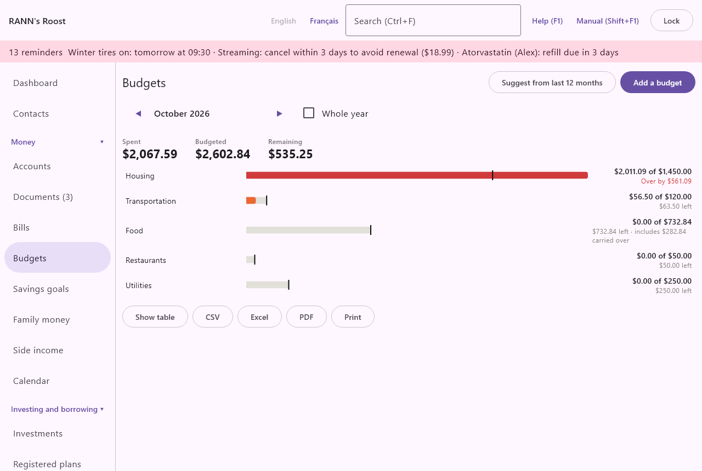

# Budgets

Budgets compares what you plan to spend, or expect to receive, in each category with what actually happened. You set an amount per category, monthly or yearly, and the screen shows at a glance which categories are on track and which are over. Budgets is in the Money group of the menu.

## What budgets do {#overview}
@index: budget; spending plan; budget vs actual; overspending

A budget is an amount for one category, such as Groceries 800 $ a month or Home insurance 1,400 $ a year. The actual amount is the total of your transactions in that category (and its subcategories) for the period. Nothing is blocked or moved when you go over: a budget is a yardstick, not a limit.

Budgets use the categories of your transactions, so they are only as good as your categorizing. See [Categories](categories).

## The Budgets screen {#budgets-screen}

At the top:

- **Suggest from last 12 months**: proposes budgets from your past spending. See [Suggest from last 12 months](budgets#suggest).
- **Add a budget**: sets a budget on a category. See [Add a budget](budgets#add-budget).

When there are no budgets yet the screen says "No budgets yet. Add one, or let the application suggest budgets from your spending."

### Month and year {#month-and-year}

- **◀** and **▶**: move one month back or forward (or one year, with **Whole year** ticked). The month or year shown is between them.
- **Whole year**: shows the whole calendar year instead of one month. Monthly budgets then count twelve times, and yearly budgets once. Carried-over amounts are not shown in this view.

### Totals {#totals}

Expenses and income are shown separately, expenses first. Above each part, three figures add up its lines:

- **Spent** (expenses) or **Received** (income): the actual total.
- **Budgeted**: the total of the budgets, including amounts carried over.
- **Remaining**: budgeted minus actual. Negative means over budget.

### Budget bars {#budget-bars}

Each budgeted category has a bar. The bar's length is the actual amount; a marker shows the budget. The text reads "... of ...", the actual of the budgeted amount, and a note:

- "... left": what remains for the period.
- "Over by ...": for an expense category whose actual is more than its budget. The bar is shown as an alert. It is also shown as an alert once spending passes the budget alert percentage of [Rates and rules](rates-rules): 100 % by default; at a lower percentage a budget is flagged before it is overspent.
- "includes ... carried over": the part of the budget carried from earlier months, when carrying over is on.
- "(yearly)" after the category name: a yearly budget seen in the month view. It compares the year to date with the full year's amount.

Expense bars are sorted with the most used budget (actual divided by budget) first. Click a bar to change that budget.

### The table {#budget-table}

Under the bars, the same figures are available as a table titled "Budget vs actual", with the period and the currency:

- **Show table** and **Hide table**: show or hide the table with the columns Category, Budgeted, Actual and Remaining.
- **CSV**, **Excel**, **PDF**: save the table as a file in that format.
- **Print**: prints the table.

## Add a budget {#add-budget}

### Choose the category {#choose-category}

**Add a budget** first asks for the category:

- **Category**: pick any category, expense or income, at any level. Subcategories are shown indented under their parents. Type to filter the list.

**Continue** opens the budget form for that category. If the category already has a budget, the form shows it, and saving changes it: a category has at most one budget.

### The budget form {#budget-form}

The form is titled "Budget for (category)".

- **Budget is**: **Monthly** or **Yearly**. Default: Monthly. See [Monthly and yearly budgets](budgets#monthly-and-yearly).
- **Amount**: the amount for one month, or for the whole year, in the household's base currency. Required. You can type a simple sum, such as 120*12.
- **Carry unspent or overspent amounts into the next month**: shown for monthly budgets only. See [Carrying amounts over](budgets#carry-over). Default: not ticked.
- **Starting (YYYY-MM-DD, first month used)**: the first month the budget applies to. Any day of the month can be entered; the budget starts on the first of that month. Default: the month shown on the screen. In earlier months the budget is not shown. Carrying over counts from this month.

The note "The budget covers the subcategories too, unless they have a budget of their own." reminds you how the actual amount is counted.

**Save** sets the budget. **Delete** (shown when the category already has a budget) asks "Delete the budget for ...? Your transactions do not change; the category simply has no budget any more." and, on confirmation, removes the budget. Your transactions are not affected. This cannot be undone; set the budget again to get it back.

## Monthly and yearly budgets {#monthly-and-yearly}
@index: annual budget; yearly expenses; irregular expenses; property tax; insurance

- A **Monthly** budget is compared with the month shown. In the whole-year view it counts twelve times.
- A **Yearly** budget is for costs that come once or a few times a year, such as home insurance, property tax, car registration, gifts or vacations. In the month view it compares everything since January 1 up to the end of the month shown with the whole year's amount, so you see how much of the year's budget is already used.

## Subcategories {#subcategories}
@index: parent category; child category

A budget on a category covers its subcategories. For example, a budget on Food covers Groceries and Restaurants.

If a subcategory has its own budget, its spending counts only in its own budget, not in its parent's. For example, with a budget on Food and another on Restaurants, the Food line counts groceries and other food, and the Restaurants line counts restaurants.

## Carrying amounts over {#carry-over}
@index: rollover; envelope budgeting; carry forward

With **Carry unspent or overspent amounts into the next month** ticked, each month's leftover is added to the next month's budget, and each month's overspending is taken off it.

For example, with a Clothing budget of 100 $ a month starting in January: you spend 40 $ in January, so February's budget is 160 $ ("includes 60 $ carried over"). If you then spend 200 $ in February, March's budget is 100 $ − 40 $ = 60 $.

The carry-over counts every month from the budget's starting month up to the month before the one shown. It works for monthly budgets only. To start afresh, change **Starting** to the current month.

## Suggest from last 12 months {#suggest}
@index: automatic budget; budget from history; average spending

**Suggest from last 12 months** looks at your spending in the last 12 full months (not counting the current month) and proposes a monthly budget for each top-level expense category that had spending: the monthly average, rounded up to a whole amount.

- Each category is listed with its suggested amount "per month", largest first.
- Categories without a budget are ticked. Those that already have one are marked "(already has a budget)" and left unticked; ticking one replaces its budget with the suggestion.
- "There is not enough spending history yet." means there is nothing to suggest.

**Create budgets** creates a monthly budget for each ticked category, starting the month shown on the screen, without carrying over. You can then adjust each one: click its bar.

> Tip: Suggestions are averages. Lower the ones you want to cut, and change yearly costs such as insurance to Yearly budgets.

## Change or delete a budget {#change-budget}

Click a category's bar to open its budget form. Change the amount, the period, the carry-over or the starting month and click **Save**, or click **Delete** to remove the budget (it asks first).

## Currencies {#currencies}
@index: foreign currency; exchange rate; base currency

Budgets are in the household's base currency. Transactions in other currencies (a US dollar account, for example) are converted at the exchange rates in the app. When a rate is missing, a red line says "No exchange rate for ...: those amounts are left out. Add a rate under Rates and prices." See [Rates and prices](rates).

## Where budgets appear elsewhere {#elsewhere}

- The [Dashboard](dashboard) shows this month's spending against your expense budgets and how many categories are over budget.
- The [Reports](reports) screen has a budget report with the same bars and table.
