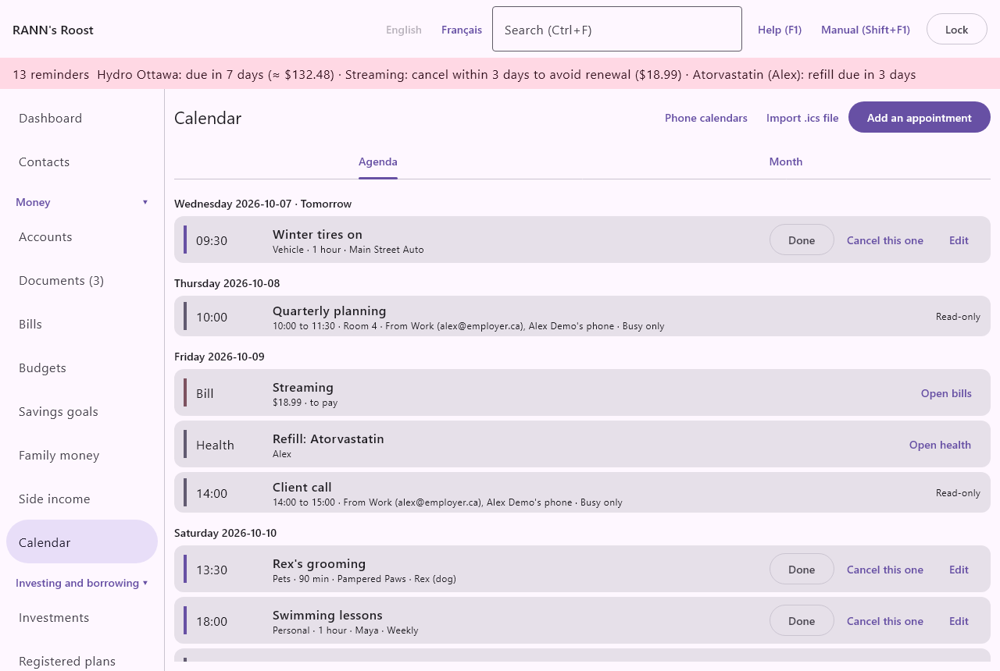
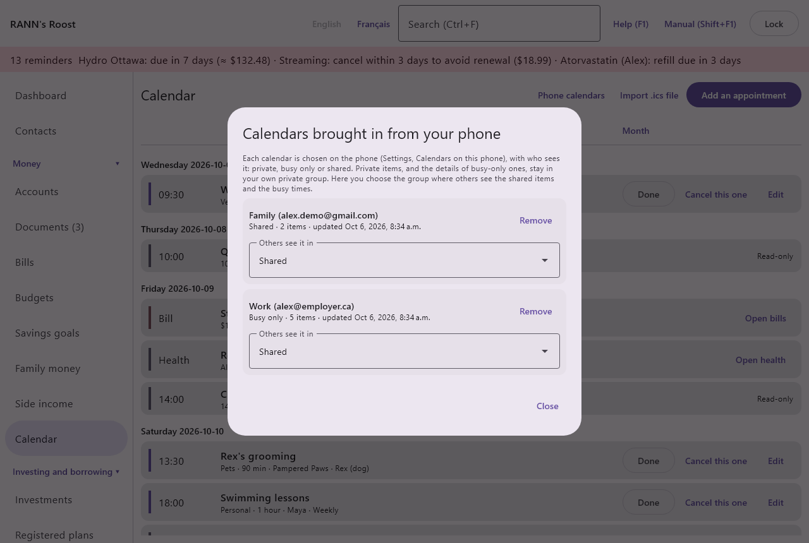
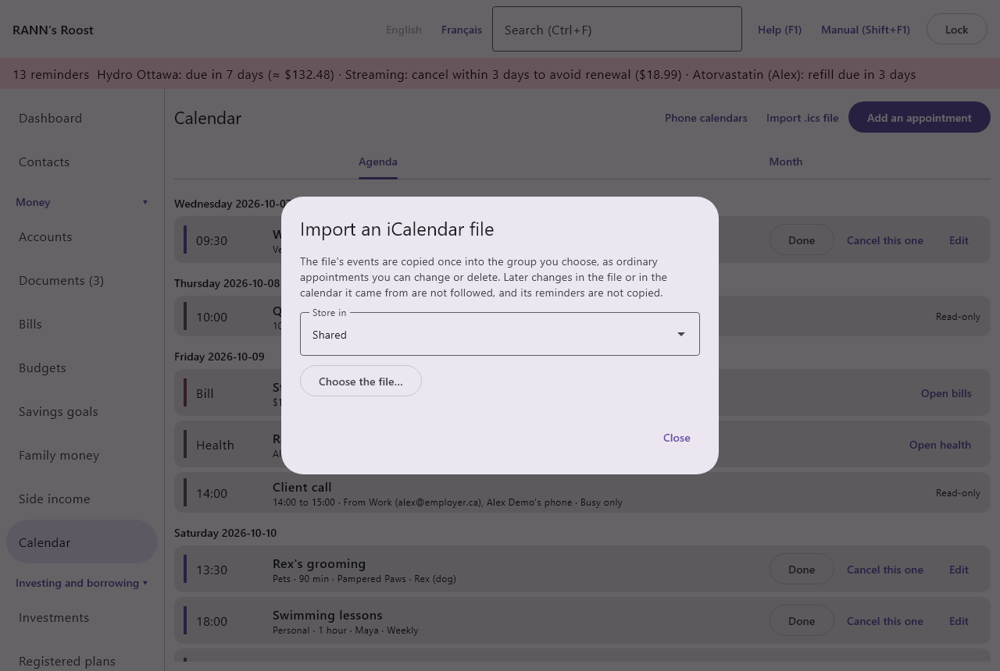

# Calendars from phones and files

Each person can bring the calendars their phone already shows (Google, Outlook or Exchange, Samsung and others) into the household's [Calendar](calendar), and choose who sees them. An iCalendar (.ics) file, sent by a school, a team or another program, can also be copied in once.

RANN's Roost never signs in to a calendar account. The phone app reads the calendars Android already keeps, with your permission, and sends them to the computer with its other transfers, encrypted from end to end.

@index: Google Calendar; Outlook calendar; Exchange; Samsung calendar; sync calendars; brought-in calendars; phone calendars; iCalendar; ics

## How it works {#how-it-works}

1. On the phone, in **Settings**, open **Calendars on this phone** and turn on **Bring calendars to the computer**. Android asks once for calendar access.
2. Tick the calendars to bring in, choose who sees each one on the computer, and how many days ahead are sent.
3. At each transfer (over Wi-Fi, through the transfer folder or in a shared file), the phone sends each calendar that changed since the last time, whole. The computer replaces what it kept of that calendar from that day on: new items appear, changed ones are updated and deleted ones disappear.
4. The items show in the Calendar's **Agenda** and **Month** tabs, read-only, marked with the calendar they come from and the person whose phone sent them.

The phone sends only the calendars you tick, and only for the days chosen: the title, place, start and end of each item. Descriptions, guests, attachments and reminders are not read. Items you or someone else changes in the phone's calendar app change on the computer at the next transfer; nothing is ever written back to your calendars.

> Note: The computer must be open with the phone owner's sign-in when a transfer arrives over Wi-Fi, as for captures. A file left in the transfer folder waits until the owner signs in.

## Who sees what {#visibility}
@index: private calendar; busy only; free busy; shared calendar

Each brought-in calendar is one of three, chosen on the phone; it is **Private** until you change it:

- **Private**: only you see it. Its items are kept in your own private group, which other household users cannot open.
- **Busy only**: you see everything; the others see you busy at those times, shown as "Alex: busy", without the title or place. The titles and places stay in your private group; the group the others see holds only the times.
- **Shared**: the others who can see the chosen group see the items with their title and place.

A single item can be set apart from its calendar on the phone (**Mark single items**): a shared team lunch in a busy-only work calendar, or a private appointment in a shared family calendar. The choice applies to every date of a repeating item.

If you have no private group yet, one named after you is made the first time a calendar arrives, as the Health screen offers.

> Important: Anyone you have given access to your private group can see what it keeps, including your private calendars.

## In the Calendar {#in-the-calendar}

Brought-in items appear among the appointments, bills and due dates:

- In the **Agenda**, the line shows the start time (or **All day**, or **Continues** on the later days of an item over several days), the title, then the times, the place, the calendar it comes from ("From Work") and whose phone sent it, and who sees it. **Read-only** reminds you that it is changed in the calendar it comes from.
- In the **Month**, the day shows the start time and title, or "Alex: busy".

An item over several days shows on each of its days. Brought-in items have no Done or Cancel buttons and no reminders on the computer or in the phone's summary: the calendar they come from already reminds you.

Past items are kept for a year, then forgotten.

## Phone calendars {#phone-calendars}

**Phone calendars**, above the Calendar, lists the calendars you brought in from your phones, with the account they belong to, who sees them, how many items are kept and when they were last updated. Each user sees only their own.

- **Others see it in**: the account group where the shared items and the busy times are kept for the others. The household's shared group is chosen at first. Choose another group to show them to the people who can see that group instead, or your private group (marked "only me") to keep the whole calendar to yourself, whatever it is set to on the phone. What the others saw moves at once.
- **Remove**: deletes this computer's copy of the calendar, after asking. The phone sends it again the next time it changes, unless you stop bringing it in on the phone.

Which calendars are brought in, who sees them and the days ahead are chosen on the phone.

## Import an .ics file {#ics-import}
@index: ics file; iCalendar; import calendar; school calendar; team schedule

**Import .ics file**, above the Calendar, copies the events of an iCalendar file once, as ordinary appointments you can then change or delete like any other. Later changes in the file, or in the calendar it came from, are not followed: import a newer file to add its events again.

1. Choose the group the appointments go in (**Store in**).
2. Click **Choose the file…** and pick the .ics file. Files of up to 5 MB and 5,000 events are read.
3. The dialog says how many appointments were created and lists what was left out or changed.

How the file's events are copied:

- Times are converted to this computer's time zone. All-day events stay all day; one over several days repeats each day to its last one.
- Repeats the calendar can keep (every day, week, month or year, on the start's day, until a date or for a number of times) stay one repeating appointment; dates the file leaves out are marked cancelled. A week repeating on several days becomes one appointment per day.
- Other repeats, such as the second Tuesday of each month, are copied as single appointments for the next two years, up to 250 per event.
- A changed date of a repeating event is copied as its own appointment, and the original date is cancelled.
- Cancelled events are left out. Events whose date or repeat cannot be read are left out and named in the list.
- The file's reminders are not copied: the appointments have none until you add them. Their kind is Other.

## Who can do what {#permissions}

Each person brings in their own calendars, from the phone they paired. To import an .ics file, you need to be able to change the group chosen. Someone who can only view a group sees what is kept there for them, and nothing else.
