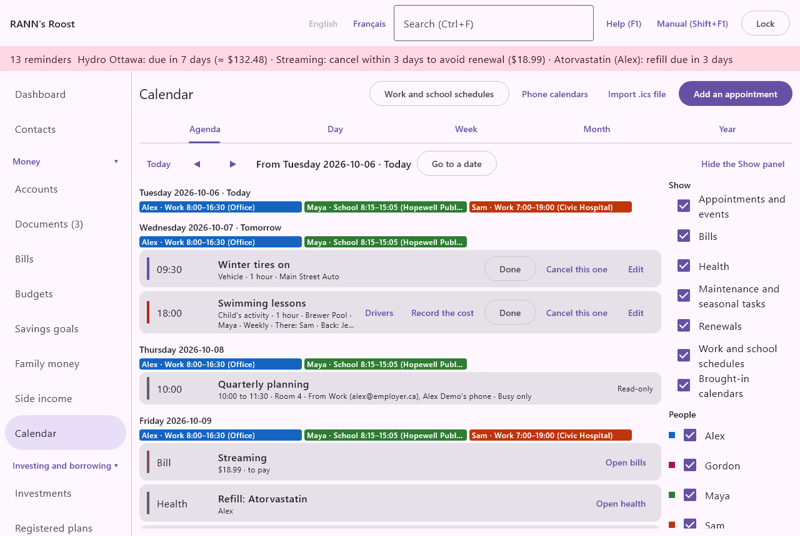
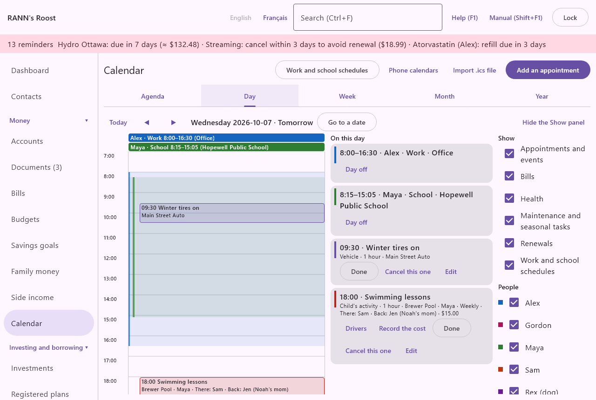
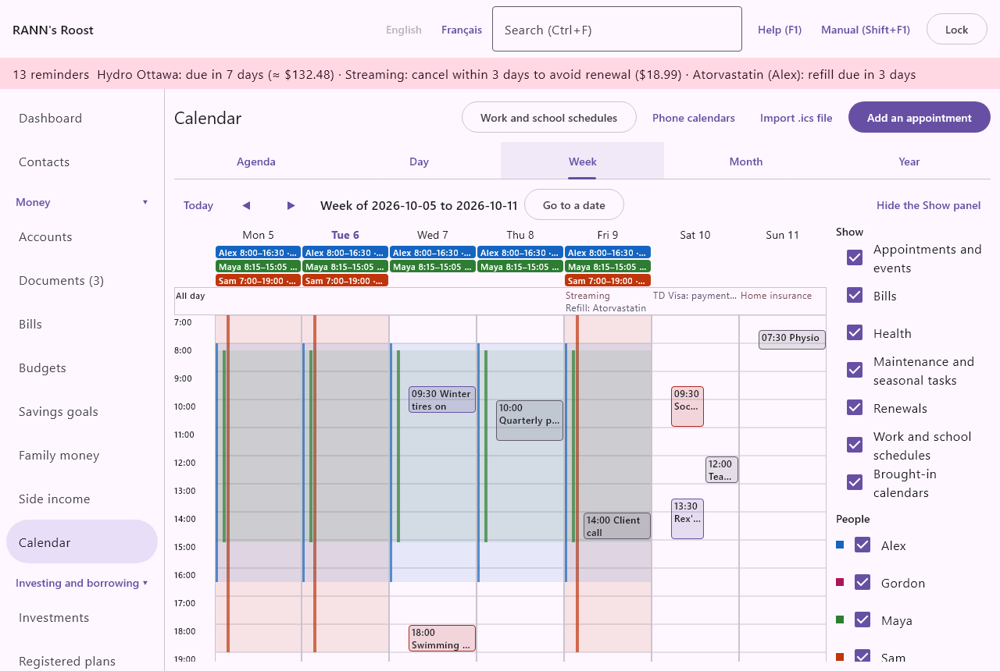
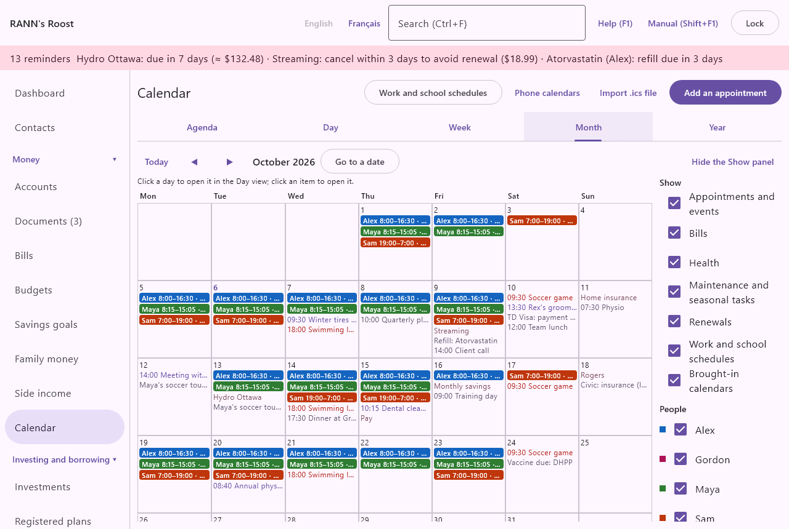
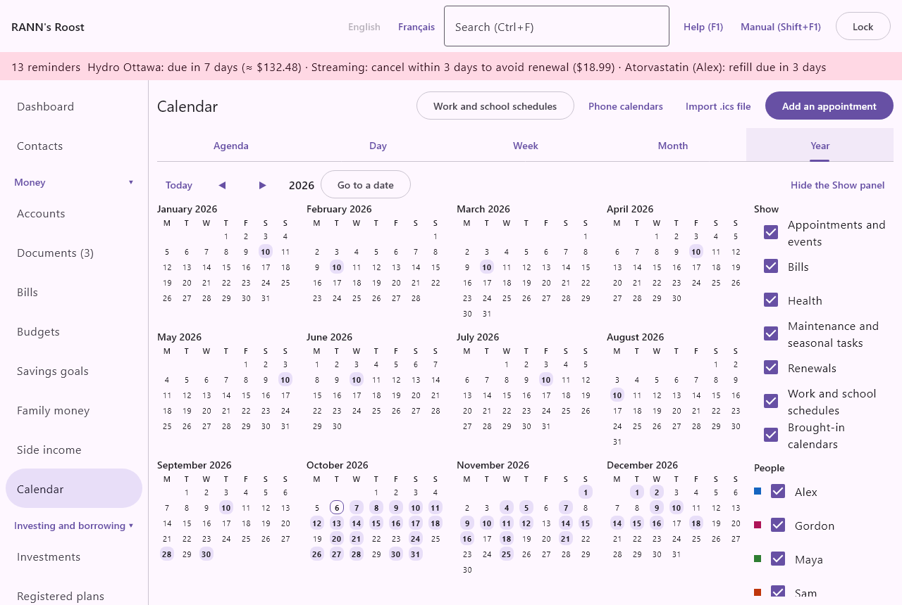
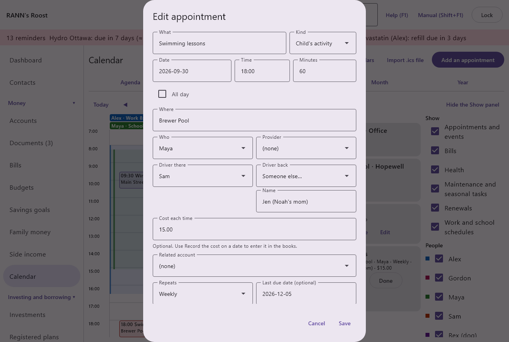
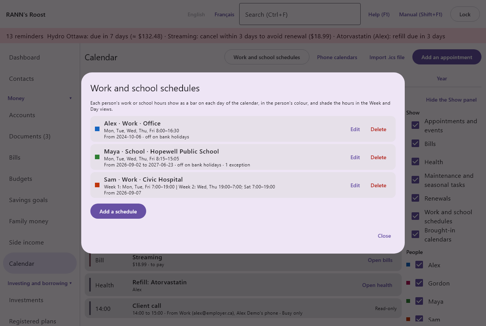
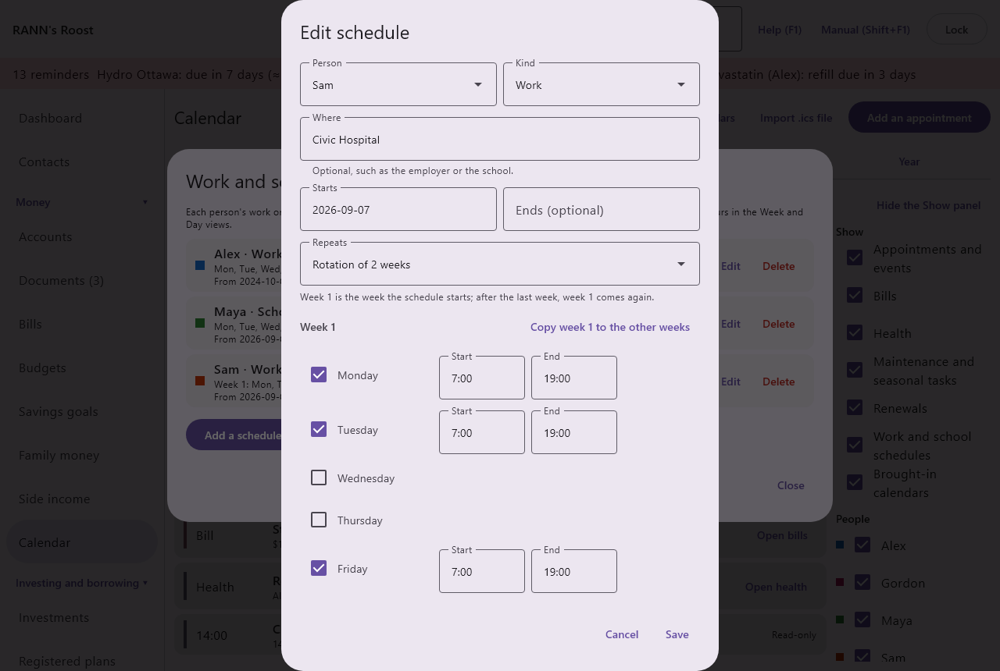

# Calendar

The Calendar brings together your appointments, your children's activities, each person's work and school hours, and every date the rest of the app already knows: bills coming due, prescriptions to refill, vaccines, renewals and maintenance. You can see it as an agenda, or by day, week, month or year, and choose what it shows. Calendar is in the Money group of the menu.

## What the calendar shows {#overview}
@index: agenda; schedule; appointments; due dates; what is coming up

The calendar shows eight kinds of items. Each has a coloured mark on the left of its line, and the items that come from other screens have a button that opens the screen where they are managed.

### Appointments {#appointments}
@index: appointment; event; meeting

Appointments and events are created on the Calendar itself: a doctor's visit, a meeting with your financial planner, a garage appointment, a school event, a reminder to renew a passport. They can repeat and carry reminders. See [Add or edit an appointment](calendar#appointment-form).

Appointments added from the [Health](health) and [Pets](pets) screens are the same appointments and appear here too. A medical appointment started from the Health screen is stored in your private group by default.

### Children's activities {#activities}
@index: activity; practice; game; lesson; carpool; car pool; driver; sports

A child's practices, games and lessons are appointments of the kind **Child's activity**. Besides what every appointment has, an activity says who drives there and who drives back, which may be someone outside the household such as another parent in the carpool, and what it costs each time. On the agenda its line shows the drivers ("There: Sam · Back: Jen"), and the cost, with "cost recorded" once it is in the books. See [Activities: drivers and cost](calendar#activity-fields).

### Work and school schedules {#schedules-on-calendar}
@index: work schedule; school schedule; shift; hours

Each person's work or school hours, entered under **Work and school schedules**, show as a thin bar in the person's colour at the top of each day they work or go to school, such as "Alex · Work 8:00–16:30 (Office)". The Week and Day views also shade those hours. See [Work and school schedules](calendar#schedules).

### Brought-in calendars {#brought-in-on-calendar}

Items from the calendars people bring in from their phones, or copied from an .ics file, read-only, with where they come from and whose they are. They are placed at their hours in the Day and Week tabs. **Phone calendars** and **Import .ics file**, at the top of the screen, manage them. See [Calendars from phones and files](calendar-sync).

### Bills {#bills-on-calendar}

Every due date of your active bills, income and scheduled transfers, from the [Bills](bills) screen, marked **Bill**, with the amount ("≈" when it is only expected) and whether it is to pay, paid or skipped. Paid and skipped dates stay on the calendar so you see the whole picture. **Open bills** goes to the Bills screen, where you mark them paid.

### Health due dates {#health-due}

From the [Health](health) screen, marked **Health**, with the person's name:

- "Refill: ..." when a medication is due to be refilled;
- "Follow-up: ..." when a test has a follow-up date;
- "Vaccine due: ..." when an immunization is due.

**Open health** goes to the Health screen.

### Renewals {#renewals}
@index: renewal; expiry; licence renewal; insurance renewal; warranty expiry; mortgage renewal

Marked **Renewal**, dates when something expires or must be renewed, gathered from other screens:

- a pet's municipal licence or pet insurance ([Pets](pets));
- a vehicle's registration, insurance or warranty end ([Vehicles](vehicles));
- a loan or mortgage term ending ([Loans and mortgages](loans));
- a credit card's annual fee ([Accounts](accounts));
- a credit card's payment due date, every month while the card has a balance owing ([Credit card details](accounts#card-details));
- an insurance claim to send ([Medical claims](medical));
- a warranty ending on a home item, or an insurance policy renewal ([Home and assets](assets));
- a tax instalment ([Taxes](taxes));
- a bond or GIC you hold reaching its maturity, from 30 days before (the default, set in [Rates and rules](rates-rules)) until its redemption is recorded ([Investments](investments#security-dialog)).

The button on the line opens the screen where it is managed, such as **Open vehicles**, **Open loans** or **Open investments**.

### Maintenance {#maintenance}

Marked **Maintenance**, the next due date of each maintenance task on your vehicles and on your home and other assets, such as an oil change or a furnace inspection. The button opens [Vehicles](vehicles) or [Home and assets](assets).

## Views and moving around {#views}
@index: day view; week view; month view; year view; go to date; date picker; today

The tabs under the title choose how the calendar is shown: **Agenda**, **Day**, **Week**, **Month** and **Year**. The view you chose is remembered for your user on this computer, and the date shown stays while you visit other screens.

Above every view:

- **Today**: back to today's date.
- **◀** and **▶** (Previous, Next): the day, week, month or year before or after; on the Agenda, 60 days back or ahead.
- The date or period shown, such as "Week of 2026-10-05 to 2026-10-11".
- **Go to a date**: opens a small calendar. Click a day, or type a date as YYYY-MM-DD and click **Go**. **◀** and **▶** in it change the month. **Cancel** closes it.
- **Hide the Show panel** and **Show and hide…**: hide or show the panel on the right that chooses what the calendar shows.

At the top of the screen, **Work and school schedules** opens the schedules (see [Work and school schedules](calendar#schedules)), **Phone calendars** and **Import .ics file** bring in other calendars (see [Calendars from phones and files](calendar-sync)), and **Add an appointment** opens a new appointment for today (on the Agenda) or for the date shown.

## Show and hide {#show-hide}
@index: filter; hide bills; hide a person; show only

The **Show** panel on the right chooses what every view shows. Untick a box to hide those items; tick it to show them again. Your choices are remembered for your user on this computer: another user, or you on another computer, sees the calendar as they left it.

- Under **Show**, one box per kind: **Appointments and events** (activities included), **Bills**, **Health**, **Maintenance and seasonal tasks**, **Renewals**, **Work and school schedules**, and **Brought-in calendars** (shown only when the calendar has such items).
- Under **People**, one box per household member and pet, with the colour of their schedule bars. Unticking a person hides their appointments, health dates and schedules; items for nobody in particular, such as bills, stay.
- **Show everything**: shown when something is hidden. Ticks every box again.

Hiding changes only what you see: nothing is deleted, and reminders still come.

## The Agenda tab {#agenda-tab}

**Agenda** lists everything from the date shown (today at first) to 60 days ahead, day by day. Each day has a heading with the day of the week and the date, and "Today" or "Tomorrow" when it applies. Under the heading, the day's schedule bars; then one line per item. "Nothing in the next 60 days." means the agenda is empty.

An appointment's line shows:

- its time, or "All day";
- its title, with "(done)" or "(cancelled)" when marked; a cancelled one is struck through;
- its kind, its length, where it is, who it is for, the provider, the related account, how it repeats and, for an activity, its drivers and cost.

### Marking appointments {#marking}
@index: done; cancel one occurrence

The buttons on an appointment's line act on that one date only. For a repeating appointment, the other dates are not touched.

- **Done**: marks it done. It stays on the calendar, greyed, with "(done)", and no more reminders are given for it.
- **Cancel this one**: marks only this date cancelled, for example a weekly class that does not take place one week. It is struck through and no reminders are given for it.
- **Undo**: shown on a date marked done or cancelled. Removes the mark.
- **Edit**: opens the appointment's form, which changes all its dates.
- **Drivers**: shown for an activity. Changes who drives on this date only. See [Drivers for one date](calendar#drivers-dialog).
- **Record the cost**: shown for an activity with a cost not yet recorded on this date. See [Record the cost](calendar#record-cost).

## The Day tab {#day-tab}

**Day** shows one day: its schedule bars at the top, then the items with no time (all-day appointments, bills, renewals...) on the **All day** line, then the day's hours from 0:00 to 23:00, opened at 7:00. Scroll to see the rest of the day.

- Each timed appointment sits at its hours, as tall as it lasts, with where it is, who it is for and, for an activity, its drivers. Appointments at the same time stand side by side. Click one to change it.
- The scheduled hours are shaded in each person's colour, with a stripe per person at the left. A night shift continues into the next morning.
- Click an empty hour to add an appointment starting at that hour.
- **On this day**, on the right, lists every item of the day with the same buttons as the agenda: **Done**, **Cancel this one**, **Edit**, **Drivers**, **Record the cost**, the buttons that open other screens, and for a schedule **Day off** (see [Exceptions](calendar#schedule-exceptions)). "Nothing on this day." when it is empty.

## The Week tab {#week-tab}

**Week** shows Monday to Sunday the same way as the Day tab, one column per day: schedule bars, the **All day** line (up to three items per day, then "+n"), and the hours.

- Click a day's name, such as "Wed 7", to open that day in the Day tab.
- Click an appointment to change it, an item on the All day line to open it, or an empty hour to add an appointment then.

## The Month tab {#month-tab}

**Month** shows a whole month as a grid, weeks starting on Monday. Today's date is in bold.

- Each day shows its schedule bars first, with the times before the kind so they stay visible in a narrow day ("Alex 8:00–16:30 · Work"), then its items, then "+n" for the others. Appointments show their time and title; other items show their name. Done appointments and paid or skipped bills are greyed; cancelled appointments are struck through.
- Click an appointment to change it.
- Click a bill, health item, renewal or maintenance item to open the screen where it is managed.
- Click anywhere else in a day to open it in the Day tab, where you can add an appointment.

"Click a day to open it in the Day view; click an item to open it." reminds you of this at the top.

## The Year tab {#year-tab}

**Year** shows the twelve months of the year. A day with something on it (other than work and school hours, which are on most days) is shaded and in bold; today is outlined. Click a day to open it in the Day tab.

## Add or edit an appointment {#appointment-form}

**Add an appointment** opens the form for today on the Agenda, or for the date shown in the other views; clicking an empty hour in the Day or Week tab opens it at that hour; clicking an appointment, or **Edit**, opens it to change. **Save** is available once **What** is filled in. **Cancel** closes the form without saving.

### What, kind, date and time {#what-and-when}

- **What**: the title, for example "Dentist - Léa" or "Meeting with the bank". It is what the agenda, the views and the reminders show. Required.
- **Kind**: Medical, Bank and finances, Vehicle, Home, Pets, Personal, Child's activity or Other. Default: Other (Medical or Pets when started from the Health or Pets screen). It is shown on the agenda line. The Health screen shows only Medical and Pets appointments. **Child's activity** adds the drivers and the cost to the form (see below) and gives the appointment a red mark.
- **Date**: the date, as YYYY-MM-DD. For a repeating appointment, the first date. Required.
- **Time**: the start time, as HH:MM in 24-hour time, for example 09:30 or 14:00 (14h00 also works). Default: 09:00. The field is marked "HH:MM" when the time cannot be read.
- **Minutes**: how long it lasts, in minutes, for example 30 or 90. Default: 60. Shown on the agenda as "1 hour" or "90 min", and as the height of the appointment in the Day and Week tabs (an hour when empty). Optional.
- **All day**: tick it for an event without a time, such as a birthday or a day off. Time and Minutes are then hidden, and it shows on the All day line. Reminders for an all-day event count from 08:00 that day.

### Where, who, provider and account {#where-and-who}

- **Where**: the place, such as an address or "Video call". Optional.
- **Who**: the household member or pet it is for. Shown on the agenda line. The Health screen lists a person's or a pet's Medical and Pets appointments by this field, and the **People** boxes of the Show panel hide or show it with that person. "(none)" for nobody in particular.
- **Provider**: a health provider from the Health screen (doctor, dentist, physiotherapist...). Shown on the agenda line. Optional.
- **Related account**: an account it is about, for example the mortgage for a renewal meeting at the bank. Shown on the agenda line. Optional.

### Activities: drivers and cost {#activity-fields}
@index: carpool; who drives; activity cost

Shown when **Kind** is **Child's activity**. Put the child under **Who**.

- **Driver there** and **Driver back**: who drives the child each way: **(nobody)**, a household member, or **Someone else…**, which shows a **Name** box for a person outside the household, such as "Jen (Noah's mom)". These are the usual drivers of every date; change a single date with **Drivers** on the agenda or in the Day tab.
- **Cost each time**: what one date costs, such as 15.00 for a lesson, in the household's currency; the calculator works here too ("12 + 3"). Optional. It is shown on the agenda line, and **Record the cost** enters it in the books for a chosen date. For a fee paid once for a whole season, enter it on a one-time activity, or record it on the first date only.

Changing the Kind to something else removes the drivers and the cost from the appointment.

### Drivers for one date {#drivers-dialog}
@index: carpool turn

**Drivers** on an activity's line opens "Drivers: ... on ...", for that date only, such as another family's turn in the carpool. The other dates keep the drivers in the activity's form.

- **Driver there** and **Driver back**: as in the form. **(nobody)** means no one drives that way that day.
- **Usual drivers**: shown when the date already has its own drivers. Gives the date the activity's usual drivers again.
- **Save** keeps the drivers for that date; **Cancel** changes nothing.

### Record the cost {#record-cost}
@index: activity fee; enter activity cost

**Record the cost** on an activity's line asks to enter the cost of that date in the books as spending, for example "Enter $15.00 for Swimming lessons on 2026-10-07 as spending from the account below."

- **Paid from**: the account it was paid from, among those in the cost's currency. Required.
- **Category**: the spending category. Default: Children: Activities and camps. Choose "(none)" to leave it uncategorized.

**Save** creates the transaction on the date of the activity, for the child (the activity's **Who**), with the activity's place (or its title) as the payee and its title as the memo. The date's line then shows "cost recorded" and no longer offers the button. The transaction is an ordinary one: change or delete it in the account's register. See [Accounts](accounts).

### Repeats {#repeats}
@index: recurring appointment; repeating event

- **Repeats**: Once, Weekly, Every two weeks, Twice a month, Monthly, Quarterly, Twice a year, Yearly, Every … days, Every … weeks, or Every … months, the same choices as for bills. Default: Once. A monthly appointment comes back on the same day of the month (in a shorter month, its last day).
- **Every**: shown for the "Every …" choices. The number of days, weeks or months between dates, 1 or more.
- **Second day**: shown for Twice a month. The appointment falls on the day of **Date** and on this day of each month; 0 means the last day of the month.
- **Day of the month**: shown for the choices counted in months. **Same day each time**, **Last day of the month** or **Last business day** (weekends and the province's bank holidays skipped).
- **On weekends and holidays**: shown when the appointment repeats. **Keep the date**, **Move to the business day before** or **Move to the next business day**, when a date falls on a weekend or a bank holiday of the household's province.
- **Last due date (optional)**: shown when the appointment repeats. The last date it can occur, as YYYY-MM-DD. Leave empty for no end. It cannot be before **Date**.

### Remind me {#remind-me}
@index: appointment reminder; alert before appointment

**Remind me** lists the times you can be reminded before the start. Tick as many as you like:

- **When it starts**
- **15 minutes before**
- **1 hour before**
- **2 hours before**
- **1 day before** (ticked by default; the default for a new event is set in [Rates and rules](rates-rules), and a default not in this list is added to it)
- **2 days before**
- **7 days before**

From the earliest reminder you ticked until the appointment starts, it appears in the reminders banner at the top of the other screens, for example "Garage: winter tires: tomorrow at 09:30". A system notification is also shown when each reminder time you ticked comes up. Untick them all for no reminder. See [Reminders](calendar#reminders).

### Notes and Store in {#store-in}
@index: private appointment; privacy

- **Notes**: anything to remember, such as what to bring or questions to ask.
- **Store in**: the account group the appointment is kept in. Choose a shared group so the whole household sees it, or a group marked "(private)" so only you see it, for example for a medical appointment. It can be chosen only when the appointment is created. A new appointment goes to the first shared group you can add to.
- **Create my private group**: shown when you do not have a private group yet, with "You have no private group yet. Records in a shared group can be seen by everyone who can open that group." It creates your private group and chooses it.

### Delete an appointment {#delete-appointment}

**Delete** (shown when editing) asks "Delete ... and all its repeats?" and, on confirmation, deletes the appointment with all its dates, marks, drivers for single dates and the link to recorded costs (the transactions themselves stay in the books). This cannot be undone. To drop just one date of a repeating appointment, use **Cancel this one** on the agenda instead.

## Work and school schedules {#schedules}
@index: work schedule; school schedule; shift work; rotation; timetable; school hours; working hours

**Work and school schedules** (at the top of the Calendar, and on a person's form in [Household members](members#person-fields)) lists each person's schedules. A person can have several, such as a job and evening classes, or a new schedule from a later date.

Each schedule's line shows its colour (the person's), the person, the kind and where, the days and hours ("Mon, Tue, Wed, Thu, Fri 8:00–16:30", week by week for a rotation), from when to when, "off on bank holidays" when chosen, and how many exceptions it has.

- **Edit**: opens the schedule's form.
- **Delete**: asks "Delete Alex's Work schedule? Its hours and exceptions go too." and, on confirmation, deletes it. This cannot be undone.
- **Add a schedule**: opens a new schedule for the person whose form you came from (otherwise the first person), Monday to Friday from 9:00 to 17:00, as a starting point.
- **Close** closes the window.

### Add or edit a schedule {#schedule-form}

- **Person**: the household member it belongs to. Required.
- **Kind**: Work, School or Schedule (anything else, such as daycare or a volunteer shift). It is shown on the bars.
- **Where**: optional, such as the employer or the school. Shown on the bars in brackets.
- **Starts**: the first date it applies, as YYYY-MM-DD. Required. For a rotation, week 1 is the week of this date (counted from its Monday).
- **Ends (optional)**: the last date it applies, such as the last day of the school year. Leave empty for no end. It cannot be before **Starts**.
- **Repeats**: **Every week** for the same hours each week, or **Rotation of 2 weeks** up to 8 weeks for shift work. After the last week, week 1 comes again.
- The days: for each day of the week (and, for a rotation, under **Week 1**, **Week 2**...), tick the day and enter its **Start** and **End** as HH:MM, such as 8:15 and 15:05. A day ticked takes the hours of the first day already ticked. An end earlier than the start ends the next morning (a night shift, such as 19:00 to 7:00). At least one day must be ticked.
- **Copy week 1 to the other weeks**: shown for a rotation. Gives every week the days and hours of week 1, to change from there.
- **Off on the bank holidays of ...**: tick it when the person does not work or go to school on the bank holidays of their province (theirs if set in Household members, otherwise the household's), such as Thanksgiving. Ticked for a new schedule. School and office schedules usually keep it; hospital shifts do not.
- **Notes**: anything to remember.
- **Store in**: the account group the schedule is kept in: a shared group by default, so the household sees it; a private group keeps it to you. It can be chosen only when the schedule is created.

**Save** checks the schedule ("Tick at least one day with its hours.", "Enter a start and an end that differ, as HH:MM.") and saves it; **Cancel** changes nothing.

### Exceptions {#schedule-exceptions}
@index: day off; sick day; vacation; PD day; professional development day; changed hours; holiday

Exceptions are dates that differ from the usual hours: a vacation day, a sick day, a professional development day at school, or a day with other hours. They are listed under **Exceptions** in the form, each with its date, "Day off" or its hours, and why; **✕** (Remove this exception) takes one away.

To add one:

1. Enter the **Date**.
2. Leave **Day off** ticked for a day off, or untick it and enter the **Start** and **End** of that day.
3. If you like, enter **Why**, such as "PD day".
4. Click **Add the exception**, then **Save** the schedule.

An exception wins over the usual hours and over a bank holiday: a day with other hours on a holiday is shown. Hours given on a day the person does not usually work add that day.

On the calendar, a schedule's line in the Day tab's list has a quick button: **Day off** marks that date as a day off, and **Usual hours** (on a date with an exception) removes the exception.

## Reminders {#reminders}
@index: notification; reminder banner

Reminders from the calendar, bills, medication refills, renewals and maintenance all appear together:

- in a coloured banner at the top of every screen except the one the reminder belongs to, such as "2 reminders  Dentist: tomorrow at 10:00 · Hydro: due in 7 days". Click the banner to open the screen of the first reminder;
- as a system notification from RANN's Roost, checked every few minutes while the household is open. Each reminder is announced once a day for each household, remembered on this computer, so opening the app again the same day does not repeat it (for an appointment, once for each reminder time you ticked).

An appointment marked done or cancelled gives no reminder. Work and school schedules give no reminders. For bill reminders, see [Reminders and notifications](bills#reminder-banner).

### On the phone {#phone-reminders}

@index: phone reminder; appointment on the phone

A paired phone receives the appointments of the coming two months with each transfer, with the reminder times you ticked, the medication refills coming up, and each person's work and school hours for today and tomorrow. It reminds you of the appointments and refills at those times even when the computer is off, and lists them under **Coming up** on its Summary tab, the day's hours first. Only appointments, medications and schedules from accounts the phone's user can see are sent: another user's private ones stay off that phone. A change made on the computer reaches the phone at its next transfer. On the phone, a medical appointment's notification says only "Health appointment" and when, and a refill names no medication. See [Notifications](phone-app#notifications).

## Who can do what {#permissions}

- Adding an appointment needs at least **Capture only** permission on the group chosen under **Store in**.
- Changing, marking done or cancelled, changing the drivers of a date, recording a cost and deleting need **Edit** permission on that group. Recording a cost also needs permission to add transactions to the account chosen.
- Adding, changing and deleting a schedule, and its days off, need **Edit** permission on its group.
- An appointment or schedule in a private group is encrypted and seen only by its owner. Bills, health dates and the other items appear for those who can see the records they come from. See [Users](users).
- What the Show panel hides is each user's own choice, on each computer.

## Contacts {#linked-contacts}

@index: contact; linked contact; Link a contact

The form of a saved appointment ends with Contacts: who the appointment is with (With), such as the dentist or the bank advisor.

Click a contact to open its page in [Contacts](contacts); **Remove link** takes the link away, and **Link a contact…** picks one, in its role, or creates a **New contact…** and links it. See [Contacts on other screens](contacts#on-other-screens).
