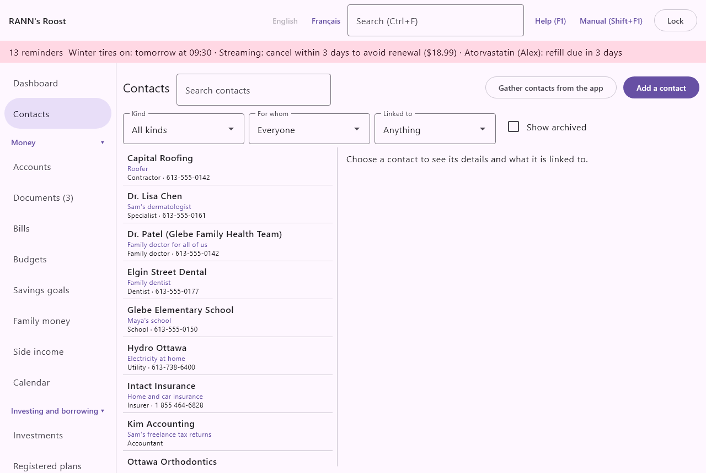

# Contacts

Contacts keeps, in one place, the people and organizations your household deals with: banks and credit unions, investment firms and advisors, insurers and brokers, doctors, dentists, pharmacies, clinics, the vet, lawyers and notaries, the accountant, contractors, the employer, schools, utilities and government offices. The screen stands on its own in the menu, just under the **Dashboard**, outside the groups, whether the menu is on the left or at the top.

A household often deals with several banks, several doctors or two pharmacies. Each contact therefore carries a short "what for" line you write yourself, such as RRSP and TFSA or Sam's dermatologist, and the people it serves. That line follows the contact everywhere it is named or picked, so you always know which one is which.

Contacts are linked to the records they concern: the accounts a bank holds, the policies an insurer covers, the medications a pharmacy fills, the appointments with a doctor, the contractor who did a job on the house, the estate papers an executor needs. A contact's page lists all of them; each record's own screen shows its contacts.

## What a contact holds {#about-contacts}

@index: address book; directory; phone book; contact list; who to call

- A name, and whether it is an organization (a bank, a clinic, a company) or a person (a doctor, an advisor, a notary).
- One or more kinds, such as Bank and Insurer for a bank that also sells insurance.
- What it is for, in your own words.
- Whom it serves: one or more people or pets of the household, or the whole household.
- Phones, emails and account or client numbers, each with its own label.
- Address, website, opening hours and notes.
- Its links to records anywhere in the app.

A person can belong to an organization contact: Jane Roy, financial advisor at RBC, is listed under RBC, and RBC's page lists her among its people.

## The Contacts screen {#screen}

The top of the screen has the title, a search box and, for users who can add records, the buttons **Gather contacts from the app** and **Add a contact**. When contacts added on a phone wait for review, **From the phone** and their number come first (see [Contacts from the phone](#from-phone)). Below them is the row of filters. The rest of the screen is split in two: the list of contacts on the left, and the page of the contact chosen on the right. When nothing is chosen, the right side says "Choose a contact to see its details and what it is linked to."

### The list {#list}

Contacts are listed by name, accents and capitals ignored. A person who works at an organization in the list is shown just under it, indented. Each line shows the name, the what-for line (in colour), then the kinds, the organization of a person shown on their own, and the first phone number. An archived contact shows (Archived) after its name.

Click a contact to show its page on the right.

### Search and filters {#filters}

@index: filter contacts; find a doctor; all my banks; search contacts

- **Search contacts**: finds the contacts whose name, what-for line, job title, organization, address, website, hours, notes, phone numbers or emails contain the text typed. Accents and capitals are ignored: "medecin" finds "Médecin de famille". Digits also find a phone number written with spaces or dashes.
- **Kind**: shows only the contacts of one kind, such as Bank or Pharmacy. All kinds shows them all.
- **For whom**: shows only the contacts that serve one person or pet, such as everyone who looks after Léa. Everyone shows them all. A contact that serves the whole household (no one ticked) is not listed under a person.
- **Linked to**: shows only the contacts linked to a kind of record, such as Account, Insurance policy, Contractor or Contractor's job. Anything shows them all.
- **Show archived**: also lists the contacts marked Archived.
- **Clear filters**: appears when a filter or a search is used; empties them all.

> Tip: Kind Bank with For whom Everyone lists all your banks at a glance; the what-for line under each tells you what it holds.

## A contact's page {#contact-page}

The page shows, from top to bottom:

- the name, with **Edit**, **Merge with…** and **Delete** for users who may change the contact;
- the what-for line, as For: RRSP and TFSA;
- the kinds;
- for a person, the job title and the organization (click the organization to open its page);
- For the whole household, or For: followed by the people and pets it serves;
- each phone, email and number, with its label;
- the address, website, hours and notes, when filled in;
- Kept in: the account group the contact is stored in;
- for an organization, People: the persons who work there, each with their what-for line (click one to open it);
- Linked records, grouped by role.

### Show a number {#show-number}

@index: account number; client number; policy number; masked number; reveal

Account and client numbers are kept in full but shown masked, with only the last four characters visible (•••• 8899), as account numbers are on the [Accounts](accounts) screen. **Show number** beside a number asks for your password, then shows the full number. Each time a number is shown, it is written in the activity log on the [Users](users) screen.

### Linked records {#linked-records}

@index: links; bank for; lender for; insurer for; pharmacy for; executor for; did the job; done by

Each link has a role, such as Bank for, Lender for, Investment firm for, Advisor for, Insurer for, Broker for, Pharmacy for, Prescriber for, Appointments, Biller for, Veterinarian for, Garage for, Service for, Did the job (a contractor's job), Same as (the institution, provider, contractor or payee the contact was made from), the estate roles (Executor for, Notary for...) and Also linked to. Under each role, every record is shown with its kind and name, such as Account · Joint chequing. A contractor's job shows its description, date, cost and contractor, such as Contractor's job · Roof repair · 2026-05-04 · $1,200.00 · Toitures Laval.

- Click a record to open the screen where it is kept: an account opens in Accounts, Loans and mortgages or Investments according to its type; a policy or an asset opens Home and assets; a contractor opens its form on the Contractors tab of Home and assets, and a contractor's job opens that contractor's jobs; a medication opens Health on the person who takes it; an appointment opens the Calendar; and so on.
- **Remove link**: removes that link only. The contact and the record stay.
- **Link to a record…**: opens the link form.

Only records you are allowed to see are listed. A link to a record kept in another user's private group does not show.

### Link to a record {#link-record}

- **Role**: what the contact is to the record, such as Bank for or Pharmacy for. The first role offered follows the contact's kinds.
- **Kind of record**: shown when the role fits several kinds of records, such as Service for an asset, a vehicle or a pet. The kinds of records are Institution, Payee, Account, Insurance policy, Health provider, Medication, Appointment or event, Contractor, Contractor's job, Bill, Pet, Vehicle, Asset and Estate papers. A contact can be linked to a contractor as a whole (Same as, Also linked to) or to one of its jobs (Did the job, Also linked to).
- The record itself: the list of records of that kind that you can see, with a search as you type. "Nothing of this kind yet." when there are none.
- **Link**: saves the link. Linking the same contact to the same record in the same role twice changes nothing.

### Delete a contact {#delete-contact}

**Delete** asks first: "Delete Jane Roy? Its links go with it; the records it was linked to stay as they are." The people who worked at a deleted organization stay, without an organization. This cannot be undone. To keep a contact out of the way without losing it, tick **Archived** instead. If it is the same as another contact, merge them instead (see [Merge two contacts](contacts#merge)).

## Merge two contacts {#merge}

@index: merge contacts; duplicates; combine contacts; same contact twice

When the same bank, doctor or contractor has ended up as two contacts, for example one typed by hand and one gathered from the app, **Merge with…** on a contact's page makes them one. The button is shown to users who may change the contact, and only contacts kept in groups you may change can be merged with it. The contact whose page you came from is the one kept; the other is deleted once its details are moved.

### Choose the other contact {#merge-pick}

The window, titled Merge followed by the contact's name, first lists the other contacts you may change.

- **Search contacts**: narrows the list to the contacts whose name, what-for line, phones or emails contain the text typed, accents and capitals ignored.
- Likely the same contact (same name or phone): the contacts with the same name (accents and capitals ignored) or a phone number in common come first, under this heading.
- Other contacts: everyone else, by name.

Each line shows the name, then the what-for line, the kinds, the first phone and the group the contact is kept in. Click the contact to merge. "There is no other contact you may change." when there is none.

### Choose what to keep {#merge-fields}

For each field the two contacts hold differently, the window shows the two values side by side, the contact you came from on the left; click the value to keep. A field that is the same on both sides is not shown. At first, the left-hand values are chosen, except where only the other contact has a value.

- **Name**: the name of the merged contact.
- **Organization or person**: whether the merged contact is an organization or a person.
- **Works at**: the job title and the organization together, for a person. If the person worked at the contact it is merged with, it no longer belongs to an organization.
- **What for**: the what-for line.
- **Address**, **Website** and **Hours**: each chosen on its own.
- **Notes**: one contact's notes; the other's are not added to them.
- **Store in**: shown only when the two contacts are kept in different groups. The group the merged contact is kept in (see [Contacts kept in different groups](contacts#merge-groups)).

Under Combined from both, the window shows what is put together rather than chosen, as the merged contact will have it:

- Kinds: the kinds of both contacts.
- For the whole household, or For: the people and pets served by either contact.
- Every phone, email and account or client number of both, each with its label. A value found on both is kept once: phones are compared by their digits (613 555-0101 and +1 (613) 555-0101 are the same), emails without regard to capitals, numbers without spaces or dashes. A label missing on one side is taken from the other. Account and client numbers stay masked; their full value moves with them.
- Linked records: every link of both, each with its role, kind of record and name. A link both contacts have (same role and same record) is kept once.
- People who will belong to: the persons who worked at the other organization, who now belong to the merged contact.

The merged contact is archived only if both were.

### Contacts kept in different groups {#merge-groups}

@index: merge a private contact; private group

A contact is kept in the group chosen under **Store in**, and only users who can open that group see it. Merging two contacts from different groups therefore moves one contact's details and links into the other group:

- If the merged contact is kept in the shared group, a contact that was kept in a private group becomes visible there. The window then warns, in red: "A contact kept in a private group will be stored in" the group chosen, and "its details and links become visible to everyone who can open that group." Check the notes and numbers before merging.
- If you choose your private group under **Store in**, the merged contact leaves the shared group: other users no longer see it, nor its links on their screens.

Links move with their contact; the records they point to stay where they are. As always, a link shows only to users who can see both the contact and the record.

### Merge {#merge-confirm}

- **Back**: returns to the list to choose another contact.
- **Merge**: asks first: "Merge" the other contact "into" the merged one, saying that the other contact is deleted, that its details, links and people go to the merged contact, and that this cannot be undone. **Merge** in the question does it; **Cancel** goes back to the window.
- **Cancel**: closes the window without changing anything.

After the merge, the contact you came from stays, with its own links and all of the other contact's; the other contact is gone from the list, from the records' screens and from the search. The merge is written in the activity log on the [Users](users) screen as Merged, with both contacts.

## Add or edit a contact {#contact-form}

**Add a contact** opens the form for a new contact; **Edit** on a contact's page opens it for that contact. A new contact can also be made from a record's screen with **New contact…** (see [Contacts on other screens](contacts#on-other-screens)).

- **Name**: the name as you want to see it, such as Desjardins, Dr. Lisa Chen or Plomberie Roy. Required.
- **What for**: optional, but this is what tells similar contacts apart. A few words, such as RRSP and TFSA, Sam's dermatologist, Near the cottage. Shown on the contact's page, in the list, in every contact picker and beside the contact on the records' screens.
- **Organization** or **Person**: choose one. Organization is the default.
- **Job title**: for a person only, such as Financial advisor or Dermatologist.
- **Works at**: for a person only. The organization contact they belong to, chosen from the household's organizations, or (none). The person is then listed under that organization.
- **Kinds**: tick every kind that fits. The common kinds are shown first; **More kinds…** shows the full list: Bank, Credit union, Investment firm, Financial advisor, Insurer, Insurance broker, Pharmacy, Family doctor, Specialist, Dentist, Optometrist, Clinic, Hospital, Laboratory, Veterinarian, Lawyer, Notary, Accountant, Contractor, Employer, School, Utility, Government and Other. Kinds are used by the **Kind** filter and to put the likely contacts first when you pick one for a record.
- **For whom (none chosen: the whole household)**: tick the people and pets the contact serves. Used by the **For whom** filter.
- **Phones, emails and numbers**: each line has its kind (Phone, Email or Account or client number), a **Label (office, cell…)** and a **Number or address**. **Add a phone**, **Add an email** and **Add an account or client number** add a line; **Remove** takes one away. A saved number is shown masked; leave it as it is to keep it, or type a new number to replace it. A line left empty is not saved.
- **Address**: several lines.
- **Website** and **Hours**: such as Mon-Fri 8-5.
- **Notes**: anything useful. Do not write passwords here.
- **Store in**: the account group the contact is kept in. It defaults to the household's shared group, since most contacts serve everyone. Choose your private group for a contact you want to keep to yourself, such as your own therapist; other users then do not see it at all. It cannot be changed once the contact is saved, except by merging it with a contact kept in another group (see [Merge two contacts](contacts#merge)). If you have no private group yet, **Create my private group** makes one.
- **Archived**: for a saved contact. An archived contact keeps its links but leaves the list unless **Show archived** is ticked.
- **Save**: saves the contact. Nothing is saved until you click it.

> Note: A contact can be changed by anyone who may edit its account group. Viewers see contacts but cannot add, change, link or delete them.

## Contacts on other screens {#on-other-screens}

@index: link a contact; pick a contact; new contact

Many screens now show the contacts linked to their records, with each contact's role, name, what-for line and first phone or email. Click a contact to open its page in Contacts; **Remove link** takes the link away.

- [Accounts](accounts): the account form (Edit account) shows the account's contacts, and the register shows them under the account's name, such as Bank · TD Canada Trust · Joint chequing, Visa and cottage mortgage.
- [Loans and mortgages](loans) and [Investments](investments): under the account's name, with **Link a contact…**.
- [Home and assets](assets): the asset form, the insurance policy form, the contractor form, and each job in a contractor's jobs (Done by). A contact linked to the contractor as a whole is shown on each of its jobs with "through the contractor", without a link of its own (see [A job's contacts](assets#job-contacts)).
- [Health](health): the provider form and the medication form (Pharmacy, Prescriber).
- [Calendar](calendar): the appointment form, once the appointment is saved.
- [Bills](bills): the bill form.
- [Payees](payees) and [Institutions](institutions): the form of the payee or institution chosen.
- [Pets](pets) and [Vehicles](vehicles): the pet and vehicle forms.
- [Emergency and estate](estate): a person's papers, under People to call, once saved; the emergency summary lists these contacts too.

The fields those screens had before (an institution's phone, a policy's insurer and broker typed as text, a provider's phone) stay as they are and keep working.

### Link a contact {#pick-contact}

**Link a contact…** opens a short form:

- **Role**: what the contact is to this record, when more than one fits; for an account, Bank, Lender, Investment firm or Advisor, the most likely first.
- **Search contacts**: narrows the list. The contacts whose kind fits the role come first, each with its what-for line, kinds and first phone. Only contacts in groups you may edit are offered.
- Click a contact, then **Link**.
- **New contact…**: opens the contact form, already filled with the name typed in the search (or the record's name) and the kind that fits the role. Once saved, the new contact is linked. For a record kept in a private group, the new contact goes in that private group too.

## Gather contacts from the app {#gather}

@index: import contacts; duplicates while gathering; gather

Before this screen existed, contact details were spread over several screens: institutions, health providers, contractors, the insurer and broker of each policy, pets' insurers and the people to call in the estate papers. **Gather contacts from the app** turns them into contacts without moving or deleting anything. The first time you open Contacts with no contacts yet, the app offers it by itself; **Not now** closes the offer, and the button stays available.

The window lists what can become a contact, each line with its name, where it comes from (Institution, Health provider, Contractor, Insurance policy, Pet, Estate papers), its phone and, for a contractor, its trade.

- Each line is ticked; untick the ones you do not want.
- Lines that look like the same contact, because they have the same name (accents and capitals ignored) or the same phone number, are shown together under "These look like the same contact (same name or phone):". **Make them one contact** merges the ticked lines into one contact; left unticked, each becomes its own contact.
- When an existing contact seems to match, it is shown as Already a contact, and **Add them to the existing contact** adds the lines to it (its missing phone, email, kinds and people) instead of making a new one.
- **Store in**: the group for the new contacts. Contacts made from records kept in a private group stay in that group.
- **Create the contacts**: makes the contacts.

Each new contact is linked to where it came from, and to more: a bank to the accounts it holds (Bank for, Lender for a loan or mortgage, Investment firm for an investment or registered plan account), a pharmacy and a doctor to the medications they fill or prescribe, an insurer and a broker to their policy, a pet's insurer to the pet, an estate contact to the person's papers in their role. A record already linked is not offered again; when everything has its contact, the window says "Everything in the app already has its contact."

> Tip: Look over the likely duplicates before merging: two people can share a clinic's phone number without being the same contact. Duplicates you leave apart now, or that appear later, can still be made one with **Merge with…** on a contact's page (see [Merge two contacts](contacts#merge)).

## Contacts and the phone {#phone}

@index: phone contacts; RANN's Roost Mobile; contacts on the phone; new contact from the phone

### Contacts sent to the phone {#sent-to-phone}

A paired phone receives the contacts its owner can see here, with each transfer when they changed, and shows them on its Contacts tab (see [The Contacts tab](phone-app#contacts-tab)). For each contact it receives the name, whether it is an organization or a person, a person's job title and organization, the kinds, the what-for line, the names of the people and pets it serves, the phones and emails with their labels, the address, website, hours and notes.

- Account and client numbers are never sent, not even masked. They stay on this computer.
- Archived contacts are not sent.
- Contacts in a private group go only to the phones of the users who can open that group; another user's phone never receives them.
- Links to records are not sent.

On the phone the contacts are read-only. A change made here reaches the phone at its next transfer.

### Contacts from the phone {#from-phone}

@index: review contacts from the phone; From the phone

A contact added on the phone with New contact comes to this computer with the captures and waits for review: nothing is added to your contacts until you choose. While contacts wait, the menu shows their number beside **Contacts**, and the Contacts screen shows **From the phone** with the number at the top. Contacts from a phone wait in the account group where that phone's documents go (see [Phone dialog](phones#phone-dialog)), so a member's stay in their private group; they are listed for the users who can add records to that group.

**From the phone** opens the list. Each contact shows what the phone sent: its name, what for, whether it is a person or an organization (and a person's organization), its kinds, its phones and emails with their labels, its address and notes, and when it was received and from which phone. For each one:

- **Add as a new contact…**: opens the contact form filled in with what the phone sent, to complete or correct (add the people it serves, a website, the hours, account numbers). **Store in** starts with the group where the contact waits, when you can add records there, or else the group most contacts go in. **Save** adds the contact and takes it off the list; **Cancel** leaves it waiting. A person's organization is filled in when a contact of that name exists; otherwise its name is put in the notes ("Organization: ...").
- **Add the details to** a contact: offered under "Perhaps already a contact (same name or phone):" when a contact you can change has the same name (accents and capitals ignored) or a phone number in common. It adds to that contact the phones and emails it does not have yet, the kinds, and the what-for line, address and organization if the contact has none; the phone's notes go after the contact's own. The contact keeps its name and group. The contact leaves the list.
- **Discard**: asks first, then takes the contact off the list without adding anything. The phone is not told; its copy was already deleted when this computer received it.

Each contact from a phone is received once, even if the phone sends it again. A contact without a name is refused, and the phone shows the reason on its Sent tab.

## Privacy {#privacy}

@index: private contact; account group; who sees contacts

Contacts are stored like health records, in the account group chosen under **Store in**. Everyone who can open that group sees the contact; nobody else does, not even in the search. A link can point to a record in another group, in the household's shared lists (institutions, payees) or to a person; it shows only to users who can see both the contact and the record. Merging a contact kept in a private group into another group makes its details visible there; the merge window warns first (see [Contacts kept in different groups](contacts#merge-groups)).

Every contact added, changed, merged, deleted or whose number is shown is written in the activity log on the [Users](users) screen.
