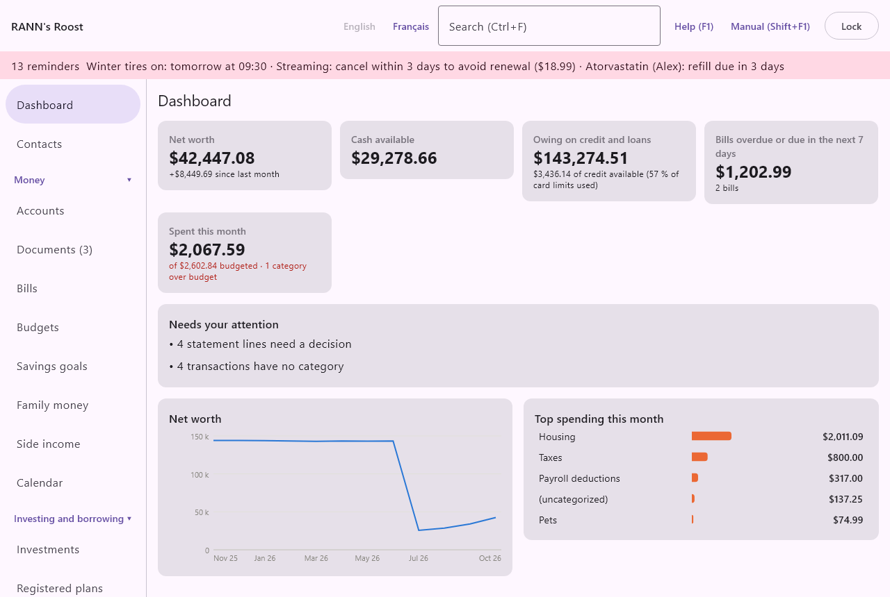

# Dashboard

The Dashboard is the first screen you see after you open the household. In one page it shows where the household stands today and what is waiting for you. It sits at the top of the menu, above the groups, whether the menu is on the left or at the top.

Nothing on the Dashboard is typed in. Every number comes from the rest of the books: accounts, bills, budgets, statements, backups and exchange rates. It is worked out again each time something changes, so it is always current. Almost everything on it can be clicked to open the screen behind it.

## What the Dashboard shows {#overview}

@index: home screen; summary; overview

From top to bottom, the Dashboard has:

- the Getting started guide, in a new household only (see [Getting started guide](dashboard#getting-started-guide));
- a row of tiles with the main numbers (see [The tiles](dashboard#tiles));
- the Needs your attention list (see [Needs your attention](dashboard#needs-attention));
- a net worth chart over the last twelve months, and the top spending categories of the month, side by side (see [Net worth chart](dashboard#net-worth-chart) and [Top spending this month](dashboard#top-spending)).

The page scrolls when the window is too small to show everything.

> Note: The Dashboard counts only what you are allowed to see. A member who cannot open an account group does not see its accounts, bills or spending in these totals. See [Users](users).

## Getting started guide {#getting-started-guide}

@index: onboarding; setup; first steps; Getting started

In a new household, a coloured card at the top of the Dashboard walks you through the first steps of setting up. Its title counts the steps done, for example Getting started: 2 of 6 done. Under the title, a short sentence explains that each step opens the screen that does it. The next line says that the Walk-Me guides of the Help menu go through each of these steps with you; its button **Walk-Me guides** opens them. See [Walk-Me guides](walkme).

Each step shows a ring (to do) or a tick (done). A step that is not done shows a one-line hint and a button. The next step to do is in bold and its button is filled in, so it stands out; the other buttons are outlined. A step is ticked by itself as soon as the books show it is done: you never tick it by hand.

### The six steps {#setup-steps}

- **The people in the household**: done once at least one household member exists. The button **Add people** opens Household members. People let accounts, expenses, health records and taxes belong to someone. See [Household members](members).
- **Your accounts**: done once the household has at least one account. The button **Add an account** opens the Add account form right on the Dashboard, the same form as on the Accounts screen. See [Add or edit an account](accounts#account-dialog).
- **Your bills and pay**: done once at least one bill or pay day is set up. The button **Add bills** opens Bills. See [Bills](bills).
- **A first receipt**: done once the vault holds any document, imported on the Documents screen, dropped there, sent from the phone or saved from an email. The button **Open Documents** opens Documents. See [Getting documents in](documents#adding-documents).
- **A first statement, reconciled**: done once a statement of any account has been reconciled to the end. The button **Open an account** opens Accounts, where you choose the account, use **Import statement…**, then **Reconcile…**. See [Import a statement](accounts#import-statement) and [Reconcile a statement](accounts#reconcile).
- **The phone (optional)**: done once a phone is paired and not revoked. The button **Pair a phone** opens Phones. See [Phones](phones).

The guide disappears by itself once the first five steps are done. The phone is optional, so the guide does not wait for it.

### Hide this guide {#hide-guide}

- **Hide this guide**: removes the guide from your Dashboard right away, even if steps remain. It is remembered for you only: other users of the household still see their own guide until they hide it or finish the steps. To bring it back, choose **Show the Getting started guide again** under [Display and accessibility](display#getting-started-guide); every step it lists can also be done from the menu.

## The tiles {#tiles}

@index: key figures; totals; cards

A row of tiles gives the main numbers. Each tile shows a label, a large amount and, on most tiles, a short line of detail. Click a tile to open the screen behind it. When the window is narrow, the tiles wrap onto a second row.

All tile amounts are in the household's base currency. Balances and bills in other currencies are converted at today's exchange rate; see [Amounts in other currencies](dashboard#currencies).

### Net worth {#net-worth-tile}

@index: net worth; assets minus debts

- **Net worth**: everything the household owns less everything it owes, today. It adds up every account (bank accounts, investments at their market value with their cash, assets, and credit cards and loans as negative amounts) and the assets you marked to count in net worth under Home and assets. Closed accounts count too, at their balance, which is normally zero.
  The detail line, for example +1 250,00 $ since last month, compares today with the end of last month. A plus sign means net worth went up.
  Clicking the tile opens Reports, where the Net worth report gives the detail. See [Reports](reports).

### Cash available {#cash-tile}

@index: cash; bank balance; money available

- **Cash available**: the total balance today of all open accounts in the Banking group: chequing, savings, high-interest savings, GIC or term deposits, cash and prepaid or gift cards. Investments, credit cards and loans are not included. Transactions dated after today (post-dated) count once their day comes. Clicking the tile opens Accounts.

> Note: A GIC counts here because it is a Banking account type, even if the money is locked in until the term ends.

### Owing on credit and loans {#credit-tile}

@index: debt; owing; credit card balance; mortgage balance

- **Owing on credit and loans**: what the household owes today on all open accounts in the Credit and Loans groups: credit cards, lines of credit, home equity lines of credit, loans and mortgages. It is shown as a positive amount. A card with a credit balance (you paid more than you owed) lowers the total. Transactions dated after today are not counted yet.
  When at least one card or line of credit has a credit limit (see [Credit card details](accounts#card-details)), the detail line gives the credit still available on those accounts and the share of their limits in use, for example 3 800,00 $ of credit available (24 % of card limits used). It is in red when the balances are over the limits.
  Clicking the tile opens Accounts.

### Bills overdue or due in the next 7 days {#bills-tile}

@index: upcoming bills; due soon

- **Bills overdue or due in the next 7 days**: the total of bill payments not yet paid that are either overdue (up to a year back) or due within the next seven days, so nothing late is hidden. Pay days and other income are left out.
  The detail line counts them: 1 bill, 3 bills, or nothing due. A bill whose amount varies counts at its expected amount, or at the amount you set for this bill; a bill paid in part counts at what is still owed.
  Clicking the tile opens Bills. See [Bills](bills).

### Spent this month {#budget-tile}

@index: budget; spending this month; over budget

- **Spent this month**: this tile appears only when at least one expense category has a budget. It shows what was spent this month in the budgeted categories (subcategories included), with a detail line giving the total budgeted, for example of 3 200,00 $ budgeted.
  When one or more categories are over budget (past the budget alert percentage of [Rates and rules](rates-rules), 100 % by default), the detail adds 1 category over budget (or the number of categories), in red.
  Clicking the tile opens Budgets. See [Budgets](budgets).

## Needs your attention {#needs-attention}

@index: review; to do; warnings; alerts; reminders

This card gathers everything waiting for a decision. Each line is a link: click it to open the screen where you can deal with it. When there is nothing to do, it says Nothing to review. Everything is up to date.

The lines that can appear, in this order:

- Account alerts, in red, such as Chequing: balance $412.00, below $500.00: the alerts you set on accounts (low balance, card limit, unusual activity). Clicking one opens that account. An unusual transaction has a **Dismiss** button once you have looked at it. See [Account alerts](accounts#account-alerts).
- Overdue bills, such as 1 bill is overdue or 3 bills are overdue: unpaid bills whose due date has passed. Opens Bills, where you record the payment or skip the occurrence. See [Bills](bills).
- Statement lines, such as 2 statement lines need a decision: imported statement lines, in statements still being reconciled, that are marked To confirm or No match. Opens Accounts. Choose the account, then **Reconcile…** to settle them. See [Lines that need your attention](accounts#reconcile-attention).
- Missing categories, such as 5 transactions have no category: transactions with at least one line that has no category. Transfers between your accounts are not counted, since they never need a category. Opens Accounts; the registers show (uncategorized) in the Category column. Uncategorized amounts count in no budget and show as (uncategorized) in reports, so it pays to fix them.
- Accounts behind, such as Joint chequing has not been reconciled in more than 45 days: one line per account whose last reconciled statement is more than 45 days old (the default, set in [Rates and rules](rates-rules)). An account that was never reconciled is not listed here; the Accounts screen marks it Never reconciled instead. Opens Accounts.
- No successful backup in the last 7 days: no backup has worked in the last week, or none was ever made. Opens Backups. See [Backups](backups).
- Missing rates, such as No exchange rate for USD: those amounts are left out: some balances, bills or spending are in a currency the app has no rate for, so they are not in the totals above. Opens Rates and prices, where you add the rate. See [Rates and prices](rates).
- Unusual utility use, such as Cottage hydro: unusual use in September 2026 (+35% on the same month last year): a meter whose last complete month, last month or the month before, used more than usual. Opens Utilities. See [Utilities](utilities#meters).

## Net worth chart {#net-worth-chart}

@index: net worth history; trend

The left card at the bottom draws net worth as a line over the last twelve months: the end of each of the eleven previous months, and today for the current month. The months are labelled along the bottom (for example Mar 26), and the amounts on the left are shortened (12,5 k).

Move the pointer over the chart: a line and a small box show the month and the exact net worth at that point. The chart counts the same things as the Net worth tile. For other periods or a chart by account, use the Net worth report in [Reports](reports).

## Top spending this month {#top-spending}

@index: spending by category; biggest expenses

The right card at the bottom ranks the five largest expense categories of the month, from the first of the month to today, as bars with their amounts. Subcategories are added into their main category (Groceries and Restaurants count under Food, for example). Spending with no category appears as (uncategorized). Refunds lower the category they were recorded in.

Click a bar to open Reports for the detail. When nothing has been spent yet this month, the card says No spending recorded this month.

## Amounts in other currencies {#currencies}

@index: base currency; foreign currency; USD; exchange rate

The Dashboard adds amounts from all currencies into one total in the base currency. Each amount is converted at the exchange rate known for today (or the latest rate before today). When no rate is known for a currency, its amounts are left out of the totals and the Needs your attention list says which currency is missing. Add the rate under [Rates and prices](rates) and the Dashboard updates at once.
