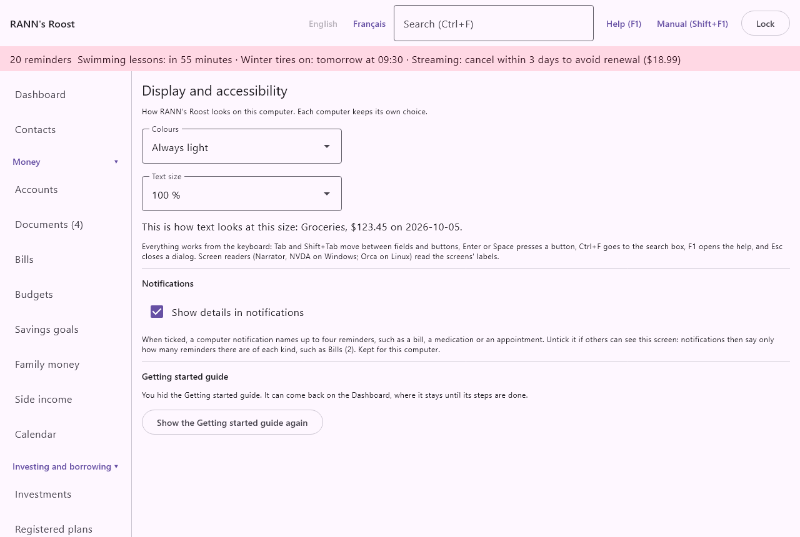
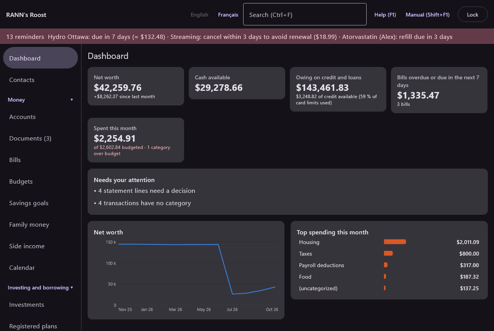
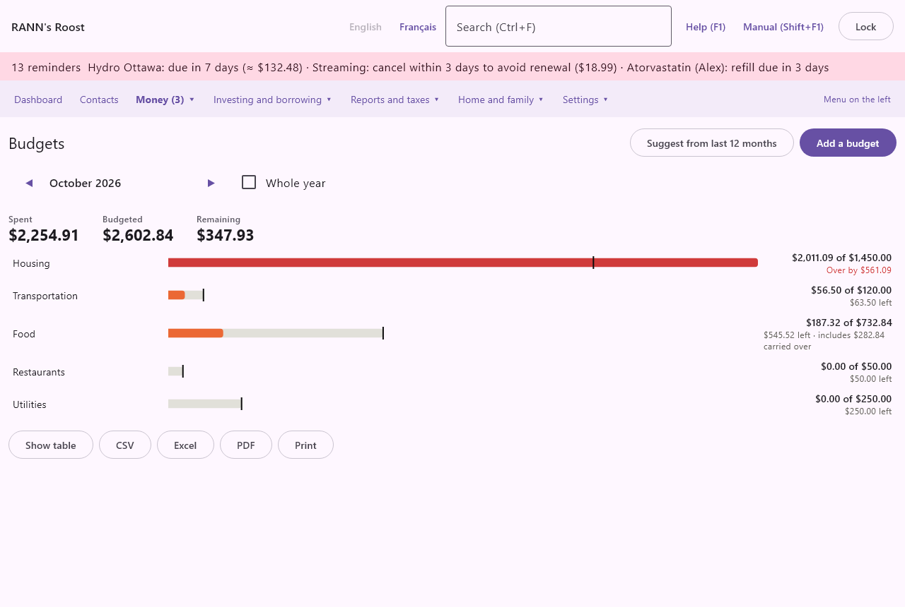

# Display and accessibility

Display and accessibility sets how RANN's Roost looks on this computer: the colours and the size of the text. This chapter also covers the other ways to adjust the app to you: where the menu sits, which menu groups stay open, the language, and the keyboard. The screen is in the **Settings** group of the menu, under **Display and accessibility**.

## Settings for this computer {#per-computer}

@index: preferences; personal settings; per computer

Display settings are kept on this computer, not in the household. A large desktop screen and a small laptop can each have their own, and they are not in backups. The theme, text size, notification details and language apply to every household and user on this computer; the menu choices are kept for each user.

## The Display and accessibility screen {#screen}

### Colours {#colours}

@index: theme; dark mode; light mode; colours; contrast

- **Colours**: how the app is coloured.
  - As the system is (light or dark): follows the light or dark setting of Windows or Linux. This is the default.
  - Always light: dark text on a light background, whatever the system's setting.
  - Always dark: light text on a dark background.

The change applies at once, to the main window and to the manual's window. Charts follow the same choice.

### Text size {#text-size}

@index: font size; larger text; zoom; low vision; magnify

- **Text size**: 90 %, 100 %, 115 %, 130 % or 150 % of the normal size. The default is 100 %.

The change applies at once to every screen, dialog and the manual. With a larger size, the menu on the left widens so its names stay on one line. Under the setting, a sample line ("This is how text looks at this size: Groceries, $123.45 on 2026-10-05.") shows the result.

> Tip: If a screen feels crowded at a large size, maximize the window or put the menu at the top (see [The menu](display#menu)).

### Keyboard and screen readers {#keyboard}

@index: keyboard; accessibility; screen reader; Narrator; NVDA; Orca; shortcuts

Everything works from the keyboard:

- Tab and Shift+Tab move between fields and buttons.
- Enter or Space presses a button.
- Ctrl+F goes to the search box.
- F1 opens the help on the screen shown; Shift+F1 opens this manual at the chapter for that screen.
- Esc closes a dialog.
- In a date field, typing + or - moves the date one day forward or back.

Screen readers (Narrator or NVDA on Windows, Orca on Linux) read the labels of fields and buttons, and say whether a menu group is open or closed. See [Keyboard shortcuts](shortcuts) for the full list.

### Notifications {#notifications}

@index: notification details; shared screen; privacy of notifications

- **Show details in notifications**: ticked (the default), a computer notification names up to four reminders, as the reminder banner does, such as a bill, a medication with the person it is for, or an appointment. Untick it when others can see this screen: notifications then say only how many reminders there are and of which kind, such as "Bills (2)" or "Health (1)", and name nothing. The banner inside the app is not changed.

The choice is kept on this computer, for every household and user. See [Computer notifications and the tray icon](basics#tray).

### Getting started guide {#getting-started-guide}

@index: show the guide again; onboarding; Getting started

When you have hidden the Dashboard's Getting started guide, this screen shows Getting started guide with a button:

- **Show the Getting started guide again**: brings the guide back on your Dashboard and opens the Dashboard. The guide then stays until its first four steps are done, as before; if they are already done, there is nothing left for it to show. See [Getting started guide](dashboard#getting-started-guide).

Unlike the other settings on this screen, this one is kept in the household, for you only. The part is not shown while the guide is not hidden.

## The menu {#menu}

@index: navigation; menu position; side menu; top menu; menu bar

The menu can sit in two places. Each user's choice is remembered on this computer.

- A list on the left (the default): the **Dashboard** at the top, then the groups Money, Investing and borrowing, Reports and taxes, Home and family, and Settings, each with its screens.
- A bar at the top: the **Dashboard** and one button per group, each opening a drop-down list of its screens. The group of the screen shown is in bold.

To switch:

- **Menu at the top**: at the bottom of the list on the left.
- **Menu on the left**: at the right end of the bar at the top.

### Groups that fold {#menu-groups}

In the list on the left, click a group's name to fold it closed or open it. The groups you leave closed are remembered for you on this computer. Settings starts closed. The group of the screen shown always stays open.

Counts in brackets show what waits for you, such as documents to review: after a screen's name, and after a closed group's name for everything in it.

## Language {#language}

@index: French; English; français; bilingual; change language

- **English**: switches the app to English at once.
- **Français**: switches the app to French at once.

Both buttons are at the top of the window, on every screen, including the start screen. The language in use is greyed out.

The choice is remembered on this computer. Until you choose, the app starts in the language of the computer (French if the system is in French, otherwise English).

What the language changes:

- Every label, message, help page and this manual.
- Category names: each category has an English and a French name, and the one for the language in use is shown. See [Categories](categories).
- Text the app writes itself from then on, such as the memo of a generated foreign exchange fee line.
- Amounts are written the English or French Canadian way, such as $1,234.56 or 1 234,56 $. Dates are always written as YYYY-MM-DD in both languages.

Names you typed yourself, such as accounts, payees and notes, stay as you typed them.

## Help and manual {#help}

- **Help (F1)**: at the top of the window. Opens a short help page on the screen shown.
- **Manual (Shift+F1)**: opens this manual, at the chapter for the screen shown.
