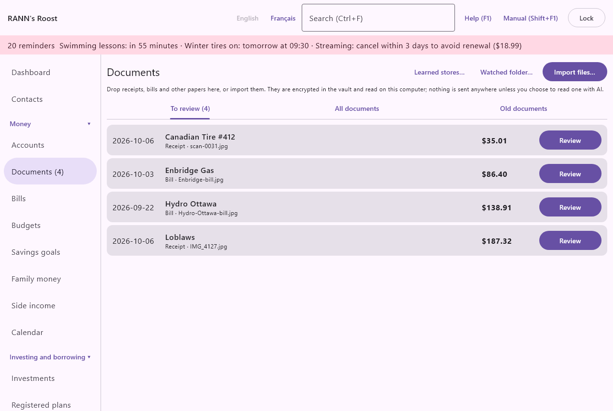
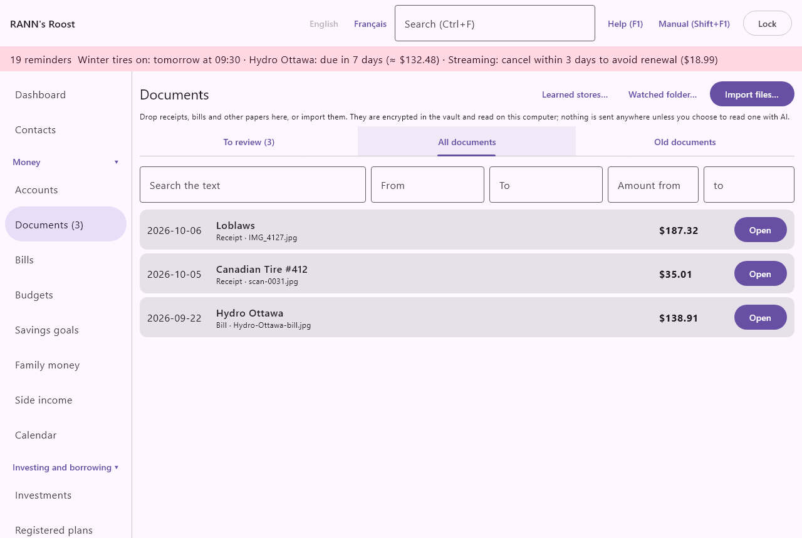

# Documents

The Documents screen is your household's filing cabinet. It keeps receipts, bills, invoices, statements, pay stubs and other papers in an encrypted vault, reads them on this computer, and helps you file each one with the transaction or bill it belongs to. Documents is in the Money group of the menu.

## What the Documents screen does {#overview}
@index: vault; document vault; receipts; scanning; paperless; filing cabinet

Every document goes through the same three stages:

1. It comes in: you import a file, drop it on the screen, save it in a watched folder, or send it from your phone.
2. It is read: the text is recognized on this computer and the store, date, total and other details are picked out. You can also have a hard document read by AI, if you turned that on.
3. You review and file it: you check the details, then attach the document to a transaction, record it on a bill, create a new transaction from it, or simply file it.

Until you file it, a document waits on the **To review** tab. The number of documents waiting is shown on the tab and next to Documents in the menu.

The screen has a title bar with two buttons, a short reminder of how it works, the message from the last import, and three tabs: **To review**, **All documents** and **Old documents**.

- **Watched folder…**: opens the settings of the folder that is imported automatically. See [The watched folder](documents#watched-folder).
- **Import files…**: opens a file window where you choose one or more files to import. While files are being read the button shows **Reading…** and cannot be clicked again.

> Note: Documents are encrypted in the vault and read on this computer. Nothing is sent anywhere unless you choose to read a document with AI.

## Getting documents in {#adding-documents}
@index: import; add a document; upload; scan

### Import files {#import-files}

Click **Import files…**, select one or more files and confirm. The file window shows the types the app accepts: PDF, JPEG, PNG, HEIC and HEIF photos, BMP and GIF pictures, saved emails (.eml) and transfer files from the phone.

Each file can be up to 50 MB. When the import ends, the screen switches to **To review** and a message under the title says what happened, for example "2 documents added to the inbox. 1 was already in the vault."

New documents go to the shared account group you are allowed to add to (or, if you have none, to your private group). Imported documents are visible to the people who can open that group.

### Drag and drop {#drag-and-drop}

You can also drag files from your file manager or desktop and drop them anywhere on the Documents screen. A coloured border appears while you hold files over the screen. Dropped files are imported exactly like files chosen with **Import files…**.

### The watched folder {#watched-folder}
@index: scanner; scan folder; hot folder; e-bills; downloaded bills; automatic import

A watched folder is a folder on this computer that the app checks for new files. Point your scanner's output, or the folder where you save downloaded e-bills, at it, and every new file is imported on its own.

Click **Watched folder…** to open its settings:

- The line at the top shows the folder being watched, or "No folder watched."
- **Choose folder…**: picks the folder to watch.
- **Stop watching**: clears the folder, so nothing more is imported from it. It appears only when a folder is set. Click **Save** to confirm.
- **Store in**: the account group the imported documents go to. Groups marked "(private)" can be seen only by you. The default is the shared group you can add to.

How the watched folder works:

- The app looks in the folder about every 20 seconds while the household is open.
- Only files of the accepted types are taken. Hidden files (names starting with a dot) are left alone.
- A file that changed in the last few seconds is left for the next round, so a scan still being written is not read half finished.
- After import, each file is moved into a folder named "Imported" inside the watched folder, so nothing is imported twice. If a file of the same name is already there, a number is added, such as "receipt (2).pdf".
- Subfolders are not searched.

> Tip: The watched folder is ideal with a document scanner: set the scanner to save PDFs into the folder and your scans appear in To review a moment later.

### E-receipts saved from email {#email-receipts}
@index: email receipt; e-receipt; .eml; electronic receipt

RANN's Roost never signs in to your mailbox. To keep an emailed receipt or bill, save the email from your email program as a file (an .eml file), then import it, drop it on the screen, or save it in the watched folder.

- If the email has PDF or picture attachments, each attachment becomes a document and is read. Small pictures shown inside the email itself, such as the store's logo, are not attachments and are left out.
- If it has none, the email itself is kept as a PDF of its subject, sender, date and text, and the store, date and total are read from that text.

### Captures from the phone {#phone-captures}
@index: phone; mobile; RANN's Roost Mobile; capture; quick expense

Receipts and bills photographed with RANN's Roost Mobile, and quick expenses typed on the phone, arrive on the **To review** tab as soon as the phone sends them. They are never booked automatically: you review each one like any other document. See [Getting started with the phone](start-phone) and [The phone app](phone-app).

- A quick expense entered on the phone without a photo shows "Entered on the phone, without a photo." in place of the picture.
- A capture can carry a voice note recorded on the phone. See [Voice notes](documents#voice-notes).
- A transfer file sent from the phone by email or copied by USB can be imported or dropped here like any other file. Its captures go to the review list, and the import message says what became of them.

### What happens during import {#import-messages}
@index: duplicate file; HEIC; unreadable file

For each file, the app:

1. Checks whether exactly the same file is already in the vault. If so it is not stored twice, and the message counts it as "already in the vault".
2. Stores the file, encrypted, in the vault.
3. Reads its text on this computer and picks out its details (see [Text recognition](documents#text-recognition)).

The message after an import can include:

- "No new documents." or the number of documents added to the inbox.
- How many were already in the vault.
- "Could not be read" with the file names, for files that are not a PDF or a picture the app knows, or that are damaged. These are not stored.
- HEIC photos kept but not read: Apple's HEIC format needs a decoder on the computer. On Windows, install HEIF Image Extensions and HEVC Video Extensions from the Microsoft Store; on Linux, install your distribution's HEIC support (libheif with its HEVC plugin). The photo stays in the vault; once the decoder is installed you can open it again.

A file whose text cannot be recognized still stays in the vault and waits in **To review**, for you to fill in by hand.

## Text recognition on this computer {#text-recognition}
@index: OCR; optical character recognition; text recognition; read a receipt; PaddleOCR

Text recognition (OCR) turns the picture of a receipt into text. In RANN's Roost it runs entirely on this computer. The recognition models load the first time a document is read, so the first import of a session can take a little longer.

- A PDF that already contains text (most e-bills and statements downloaded from a website) is read directly from that text, which is exact.
- A scan or photo is read by text recognition.

From the text, the app picks out what it can:

- the kind of document (receipt, bill, invoice...)
- the store or biller
- the date
- the total
- the subtotal and the sales taxes (GST, HST, QST, PST)
- how it was paid, and the last four digits of the card
- an invoice number, a due date, and your account number with the biller

Each value is given a confidence. A value read with low confidence is marked "Check this: it was hard to read" in the document window, so you know to look at it. Nothing read from a document is booked until you file it.

## The To review tab {#to-review-tab}
@index: inbox; review inbox; to review

**To review** lists the documents waiting to be checked and filed, newest first. The tab title shows how many there are, for example "To review (3)". When there are none, it shows "Nothing to review."

Which documents you see here:

- the documents you imported or captured yourself;
- for an administrator, also those captured by other users into shared groups.

Each line shows:

- the document's date (or the day it was captured, if no date was read);
- its name: the title you gave it, else the store, else the file name;
- the kind, the file name (when different), the number of pages, and how many records it is attached to;
- "Possible duplicate: another document has the same store, date and amount." in red when another document looks like the same one;
- the total;
- **Review**: opens the document window. See [The document window](documents#document-window).

## The All documents tab {#all-documents-tab}
@index: search documents; find a receipt

**All documents** finds any document in the vault, filed or not, newest first (by the document's date). Fill in any of the search fields; the list updates as you type.

- **Search the text**: words to find in the document's text, store, title, notes or file name. Leave empty to list all.
- **From**: the earliest document date, as YYYY-MM-DD. Leave empty for no limit.
- **To**: the latest document date, as YYYY-MM-DD.
- **Amount from**: the smallest total.
- **to**: the largest total.

Up to 500 documents are listed. Click **Open** on a line to open the document window. "No documents found." means nothing matches.

> Tip: The search box at the top of the app (Ctrl+F) also finds documents. Choosing one in its results opens the document window here.

## The Old documents tab {#old-documents-tab}
@index: retention; how long to keep receipts; six years; CRA; Canada Revenue Agency; tax records

The Canada Revenue Agency generally asks that tax records and the papers that support them be kept for six years. **Old documents** lists filed documents whose date is more than six years ago, so you can decide whether to delete them. Six years is the default retention period in [Rates and rules](rates-rules).

- Documents still in **To review** never appear here.
- Documents marked **Keep this document** never appear here.
- Nothing is ever deleted automatically. To delete one, click **Open**, then **Delete** in the document window.

"No documents are old enough to discard." means there is nothing to clean up.

> Important: Some records must be kept longer, for example papers about property you still own, or a document you were asked to keep by the Canada Revenue Agency. Tick Keep this document on those.

## The document window {#document-window}

**Review** or **Open** on a document opens its window. The title is the document's name. The left side shows the document; the right side shows what was read and what you can do with it. **Close** at the bottom closes the window without saving changes you did not save.

### The preview {#preview}

The left side shows the first page of the document as a picture, which you can scroll. While it loads it shows "Loading…". A quick expense typed on the phone shows "Entered on the phone, without a photo.", and a HEIC photo on a computer without a HEIC decoder shows how to install one.

### Details read from the document {#document-details}

These fields start with what was read. Correct anything that is wrong; your changes are saved when you use any filing button or **Save**.

- **Store or biller**: the name of the store, company or biller. It becomes the document's name in the lists, the payee suggested for a new transaction, and what the app uses to recognize the bill it belongs to. If you change it, the app remembers the correction for the next documents read the same way (see [Learning from your corrections](documents#learning)).
- **Kind**: what sort of document it is. See [Kinds of documents](documents#document-kinds). The kind decides which filing choices are offered, as soon as you choose it, and, for AI reading, what the AI is asked to read.
- **Date**: the date printed on the document, as YYYY-MM-DD. It is used to find matching transactions, to place the document in searches, to count the six-year retention period, and as the date of a new transaction. Required: an invalid date stops the save.
- **Total**: the amount paid or owed, in the document's currency. It is used to find transactions of the same amount, as the amount of a new transaction, and as the amount recorded on a bill. You can type a simple sum, such as 12.50+3.25.

Under a field you may see:

- "Check this: it was hard to read": the value was read with low confidence. Compare it with the picture.
- "read by AI": the value comes from an AI reading.

Under the date and total, one line can show other details that were read: the subtotal, each sales tax (GST, HST, QST, PST), how it was paid (cash, debit card, credit card, gift card), "card ending" with the last four digits, the invoice number, the due date, and your account number with the biller. These details are used when filing: the card digits pick the account in a new transaction, the taxes are recorded on it, the due date and account number find the bill.

### Kinds of documents {#document-kinds}
@index: receipt; bill; invoice; statement; pay stub; explanation of benefits; EOB

- **Receipt**: proof of a purchase already paid. Filed with the transaction of the purchase.
- **Bill**: an amount to pay, such as a hydro, phone or tax bill. Can be recorded on one of your bills.
- **Invoice**: a detailed bill from a business, often with items and taxes. Can be recorded on one of your bills.
- **Other**: anything else.
- **Credit card statement** and **Bank statement**: a statement of many transactions. Filed as is; when read by AI it can be reconciled with the account.
- **Investment statement**: a statement from a broker or plan. Filed as is.
- **Pay stub**: a pay statement. It can be recorded as your pay, typed from the stub or filled in by AI reading.
- **Explanation of benefits**: an insurer's statement of what it paid on a claim. Filed as is, and can be attached to a claim on the Medical claims screen.

Statements, pay stubs and explanations of benefits describe many amounts, not one transaction, so the **File it with** section does not appear for them.

The filing choices follow the kind chosen in the window at once, before it is saved: change a receipt to **Bill** and **Record the amount on this bill** appears when the app finds the bill; change it to **Pay stub** and **Record the pay…** appears. The kind itself is saved when you use a filing button or **Save**.

### Learning from your corrections {#learning}
@index: learning; merchant names; auto-categorize receipts

The app learns from what you change, store by store:

- If you change the store name or the kind of a document, the next document read with the same store name gets your name and kind.
- When you create a transaction from a document with a single category, that category is suggested next time for documents from the same store.

The learning is kept in the account group of the document.

**Learned stores…** (at the top of the Documents screen) opens What was learned from your corrections: each store as it was read ("Read as …", simplified: lower case, without digits or punctuation), then the name, kind and category it learned and how many corrections taught it. **Forget** asks first, then forgets that store: its next documents are read as they come, and documents already filed do not change. Forgetting needs the Edit permission on the group.

### Possible duplicates {#duplicates}
@index: duplicate receipt; same receipt twice

The same receipt often arrives twice: photographed on the phone and later downloaded as a PDF, for example. Under the details, a red line "Possible duplicate of ..." names any other document with the same date, the same total and a similar store name. Open both and delete the one you do not need. Exactly identical files are never stored twice in the first place.

### Voice notes {#voice-notes}

When a capture was sent from the phone with a spoken note, the window shows **Play the voice note** and "Recorded on the phone with this capture." Click it to listen; while it plays the button becomes **Stop**.

### Keep this document and Notes {#keep-and-notes}
@index: warranty; proof of purchase; keep forever

- **Keep this document (for example a warranty or a purchase receipt)**: tick it for papers to keep for good. A kept document never appears on the **Old documents** tab. Default: not ticked.
- **Notes**: your own notes about the document. They are kept with it and found by the text search.

### Recognised text {#recognised-text}

At the bottom of the right side, **Recognised text** shows the text that was read from the document (the first 4,000 characters). It is useful to check what the app saw, and it is what **Search the text** looks in.

## Filing a document {#filing}
@index: file a receipt; attach receipt to transaction; match receipt

The **File it with** section offers every way to file the document. Each filing button first saves the details you corrected, then attaches the document and moves it out of **To review**. If a detail is not valid (an impossible date, for example), an error is shown and nothing is filed.

### Attach to an existing transaction {#attach-to-transaction}

The app lists up to four transactions that may be the one the document belongs to: the same amount, in the same currency, dated within five days of the document's date (the default match window, set in [Rates and rules](rates-rules)), closest first. Transfers between your own accounts, investment trades and transactions the document is already attached to are left out. Each line shows the date, the account, the payee and the amount.

- **Attach**: attaches the document to that transaction and files it. The transaction itself is not changed.

This is the usual choice when the transaction was already imported from your bank or card statement.

"No transaction with this amount yet. Create one, or file the document and attach it later when the statement arrives." means no transaction matched. The amount must match exactly, so check the **Total** first.

### Record the amount on a bill {#record-on-bill}
@index: e-bill; utility bill; variable bill amount

For a document of kind **Bill** or **Invoice**, the app looks for one of your bills that it belongs to: first by your account number with the biller (the last four digits), then by the store or biller name compared with the bill's payee and name. When it finds one, it shows "This looks like the bill ..." and:

- **Record the amount on this bill**: records the document's total as the amount of that bill's due date closest to the document's due date (or its date), within 45 days (the default, set in [Rates and rules](rates-rules)), attaches the document to the bill and files it. The bill's To pay list then shows the real amount for that due date. See [Bills](bills).

The bill must have a due date within 45 days of the document; otherwise an error says so. The document needs a total.

### New transaction from this document {#new-transaction}
@index: create transaction from receipt; cash receipt

**New transaction from this document** opens a form to create the transaction the document describes, already attached. Use it for cash purchases, or when you want to record the purchase before the bank statement arrives.

The top line repeats the store, date and total from the document window. Then:

- **Paid with**: the account the money came out of. Only accounts in the document's currency are offered. The default is the account chosen on the phone with the capture; else the card whose number ends with the digits read on the receipt; else your first credit card; else the first account. Required.
- **Category**: the category of the expense. The default is the category chosen on the phone with the capture; else the payee's own default category if the store matches a payee you have; else the category you last used for documents from this store. "(uncategorized)" leaves it without a category.
- **For**: the person or pet the expense is for, which feeds the per-person reports, medical expenses and taxes. The default is the person or pet chosen on the phone with the capture; else "(the household)", which means nobody in particular.

A choice made on the phone is used only if it still exists on the computer (and, for the account, is in the document's currency); otherwise the usual default applies. You can change any of them before saving.
- **Vehicle**: shown only if you have vehicles. Links the expense to a vehicle for its cost reports.
- **Split by items**: see [Split by items](documents#split-by-items).

**Save** creates the transaction and files the document:

- The transaction is money out of the account, for the total, on the document's date.
- The payee is your existing payee whose name matches the store, else the store name as read.
- The sales taxes read on the receipt (GST, HST, QST, PST) are recorded on the transaction when they are in the same currency and do not exceed the total. They feed the sales tax figures in reports.
- The document is attached to the new transaction.

A refund slip is money in: enter it from the account's register instead.

### Split by items {#split-by-items}
@index: itemized receipt; line items; split receipt

When a receipt or invoice was read by AI and has at least two items, the new transaction form offers **Split by items (n items read by AI)**. Tick it to give items different categories, for example groceries and household supplies from the same store.

- Each item shows its description, the taxes marked on it on the receipt, its share of the total, and a **Category** picker. An item left on the default uses the category chosen above.
- Items with the same category become one split of the transaction, whose memo lists the items it covers.
- Taxes are shared over the items: each tax goes to the items the receipt marks with it. The codes are trusted when each tax amount is what the marked items give at a rate that tax has somewhere in Canada on the receipt's date (from [Rates and rules](rates-rules)). If the receipt does not show which items are taxed, or its tax codes do not match its tax amounts, the taxes are shared over every item in proportion, and a note says so; check the categories you track closely.
- A transaction split this way does not teach a single category for the store.

### File without attaching {#file-without-attaching}

**File without attaching** (at the bottom, for a document in **To review**) saves the details and files the document without linking it to anything. It leaves the inbox and can be found on **All documents**. Use it for papers that belong to no transaction, or to attach later, when the statement arrives, from another screen.

For a document that is already filed, the same place shows **Save**, which saves your changes to the details, the kind, **Keep this document** and **Notes**.

### Statements, pay stubs and benefit statements {#summary-documents}

For a credit card statement, bank statement, investment statement, pay stub or explanation of benefits, the **File it with** section is not shown. File it with **File without attaching**, or:

- reconcile a statement read by AI, see [Reconcile a statement read by AI](documents#ai-statement);
- record a pay stub as your pay, see [Record the pay from a pay stub](documents#pay-stub);
- attach an explanation of benefits to the claim it answers, right here (see [Match an explanation of benefits](documents#eob-match)), or on the [Medical claims](medical) screen.

### Match an explanation of benefits {#eob-match}
@index: explanation of benefits; EOB; match claim; reimbursement

For a document of the kind **Explanation of benefits**, the window lists under "Claims this explanation of benefits may answer" the claims still waiting for payment that were claimed at the document's **Total** or more, and submitted on or before its **Date**, closest amount first (at most five). Each line gives the person, the service and its date, the amount claimed and the plan.

- **Attach to this claim**: attaches the document to that claim, files it, and closes the window. Then record what the plan paid with **Record the payment** on the claim, under [Medical claims](medical).
- Without a total, the window asks for the amount paid by the insurer first. When nothing matches, it says so; attach it from the claim instead.

### Attached to {#attached-to}

When the document is already attached, **Attached to** lists the transactions (date, payee, amount) and bills it is attached to. The lines also show "attached to n records" in the lists.

## Other actions {#other-actions}

- **Save a copy…**: saves the original file (PDF or picture) to a place you choose, for example to send it to an insurer. The file in the vault is not changed.
- **Delete**: asks "Delete ... from the vault? The records it is attached to are kept." and, on confirmation, deletes the document and its file for good. Transactions and bills it was attached to stay, without the document. This cannot be undone, except by restoring a backup.

## Reading a document with AI {#read-with-ai}
@index: AI; Claude; Anthropic; cloud reading; artificial intelligence

When text recognition struggles (a crumpled receipt, a long statement, a pay stub), AI can read the document instead. AI reading sends pictures of the pages to Anthropic's Claude, with your own key, which is billed a small amount per document. It is off until you turn it on under [AI reading](ai), in the Settings group of the menu.

### When the button appears {#ai-button}

When AI reading is turned on, the document window shows, under the details:

- **Read with AI**: reads the document. If you have not added your key yet, the window shows "To read with AI, add your key under AI reading." instead.
- A note beside it: "Some fields are uncertain: AI can read this document." when the store, date or total were hard to read or no total was found; "Read by (model) on (date)." once it has been read; "Reading with Claude…" while it is being read.

The AI section does not appear for a quick expense typed on the phone, which has no picture, nor for a user who can only view the document's account group, since the reading could not be saved.

What **Read with AI** does depends on a setting on the AI reading screen, "Show me each document and let me hide parts before it is sent":

- When it is on (the default), the [Read with AI window](documents#ai-read-window) opens, so you can hide parts of the pages before anything is sent.
- When it is off, every page is sent at once as it is, read as the kind chosen in **Kind**.

If the reading fails, an error under the button says why (no network, a refused key, and so on). Nothing is changed on the document.

### The Read with AI window {#ai-read-window}
@index: hide account number; redact; blur; crop

The window shows each page exactly as it will be sent. Nothing leaves the computer before you click **Send**.

- **Document type**: what the AI is asked to read: receipt, bill, invoice, credit card statement, bank statement, investment statement, pay stub or explanation of benefits (plus any custom types added on the AI reading screen). It starts on the document's kind. The type decides which fields come back: items and taxes for a receipt, every transaction for a statement, earnings and deductions for a pay stub.
- **Hide an area**: with this tool chosen, drag a rectangle on the page to hide that part, such as a full account number or a name. Hidden areas are drawn as grey blocks and replaced by flat blocks before the picture leaves the computer. You can hide several areas on each page.
- **Keep only**: with this tool chosen, drag a rectangle around the part of the page to send. The rest is dimmed and is not sent. One area per page; dragging again replaces it.
- **Undo last hidden area**: removes the last grey block on the page shown.
- **Clear this page**: removes all hidden areas and the kept area on the page shown.
- **<** and **>**: move between pages, with "Page n of m". Each page has its own hidden areas.
- **Leave out this page**: shown when the document has several pages. Tick it for a page that is not needed, such as a blank back or the terms and conditions; it is not sent. At least one page must be sent.
- At most 20 pages can be sent. For a longer document, a red line says "This document has more than 20 pages: only the first 20 are shown and can be sent."
- The line "n pages will be sent to Anthropic, read by (model). Estimated cost: about (amount)." gives the estimated cost in US dollars, which shrinks when you keep only part of a page.
- **Send**: sends the pages and reads them. While it works it shows "Reading with Claude…". On success the window closes and the document window shows the new values.
- **Cancel**: closes the window without sending anything.

### After the reading {#after-ai-reading}

The values read by AI replace the document's kind, store, date and total, and are marked "read by AI". Your learned corrections for that store still apply. The recognized text and the file do not change. Check the values, then file the document as usual. Each request and its cost are listed under [AI reading](ai).

### Reconcile a statement read by AI {#ai-statement}
@index: PDF statement; paper statement; import statement from PDF; reconcile

A bank or credit card statement read by AI (with the type **Bank statement** or **Credit card statement**) can be brought into an account like a downloaded statement. The document window then shows:

- **Statement of the account**: the account the statement belongs to. Only open accounts of the right kind are offered (bank accounts for a bank statement, credit accounts for a card statement). The app picks the account whose number ends with the digits printed on the statement, else the first one.
- **Reconcile with this statement**: brings the statement's lines into the account. Lines already in the books are matched, the rest are added, as for a statement downloaded from your bank. The app then opens the account on the Accounts screen to reconcile it. See [Accounts](accounts). The same document cannot be imported twice.

On a card statement, charges are printed as positive amounts; the app records them as money owed on the card.

### Record the pay from a pay stub {#pay-stub}
@index: pay stub; payslip; paycheque; salary; deductions; CPP; QPP; EI; QPIP; union dues; income tax withheld

A document of kind **Pay stub** shows **Record the pay…**, whether or not AI reading is turned on. It opens the **Pay from a pay stub** form: filled in from the AI reading when the stub was read by AI as a pay stub; otherwise empty, with the usual deductions listed, for you to type the amounts printed on the stub.

The pay is recorded as one deposit of the net pay, split into the gross pay and each deduction, so that income tax, CPP or QPP, EI or QPIP, union dues and other deductions are all in the books and in your tax figures.

- **Employer**: the employer's name. It becomes the payee of the deposit. Required.
- **Pay date**: the date the pay was deposited, as YYYY-MM-DD. The deposit's date.
- **For**: the household member who was paid. Each split is marked for that person, which feeds the per-person income and tax figures.
- **Paid into**: the bank account the pay went into. Only bank accounts are offered. Required.

Earnings:

- **Description**: what the earnings line is, such as Regular pay, Overtime or Vacation pay. A line whose description mentions bonus, commission or premium goes to the bonus category; the others to salary.
- **Amount**: the gross amount of the line.
- **Add earnings**: adds a line. **✕** removes a line (one line always stays).

Deductions (a new form starts with Income tax, CPP / QPP and EI / QPIP):

- **Kind**: Income tax, CPP / QPP, EI / QPIP, Union dues, Pension plan, Group insurance, Group RRSP, Charity, Other. Each kind goes to its own category, so income tax withheld, union dues and donations taken from your pay each show separately in your reports.
- **Description**: the name printed on the stub, optional.
- **Amount**: the amount taken off, as a positive number. A line left empty is skipped.
- **Add a deduction**: adds a line. **✕** removes it.

Under the lines, "Gross ... − deductions ... = net ..." shows the deposit that will be recorded. If the stub's printed net pay is known and differs, a red line says "The stub shows a net pay of ... Check the amounts, or add a missing line."

**Save** records the deposit in the account, attaches the stub to it and files the document. It is refused if the employer is empty, the gross pay is not more than zero, or the deductions leave no net pay. **Cancel** closes the form without saving.

You can also enter a pay stub by hand, without a document, with **Pay stub…** in an account's register. See [Accounts](accounts).

## Attaching documents from other screens {#attach-from-other-screens}

Several screens keep their own papers in the same vault: medical expenses and claims, insurance plan booklets, home and asset photos and warranties, insurance policies, estate records, tax slips and donation receipts. On those screens:

- **Attach a file…** imports a file and attaches it to that record at once. It is filed directly and never waits in **To review**.
- **From the review inbox** picks a document already waiting in **To review**, attaches it to that record and files it.

Those documents are also found on **All documents**.

## Who can do what {#permissions}
@index: permissions; capture only

- Adding documents (import, drop, watched folder, phone) needs at least **Capture only** permission on the account group they go to.
- Changing a document's details, filing it and deleting it need **Edit** permission on its group.
- A document is visible to everyone who can open its account group. Put private papers in your private group with the watched folder's **Store in** choice, or attach them from screens that store records privately. See [Users](users).

## Privacy and storage {#privacy}
@index: encryption; where are my documents stored

- Files are stored encrypted inside the household folder, with the rest of your books, and are included in backups. See [Backups](backups).
- Text recognition happens on this computer. Documents leave the computer only when you read one with AI, and then only the pages, with the areas you hid replaced by flat blocks.
- The app never signs in to your email, bank or cloud accounts to fetch documents.

See also [Privacy and your data](privacy-data).
