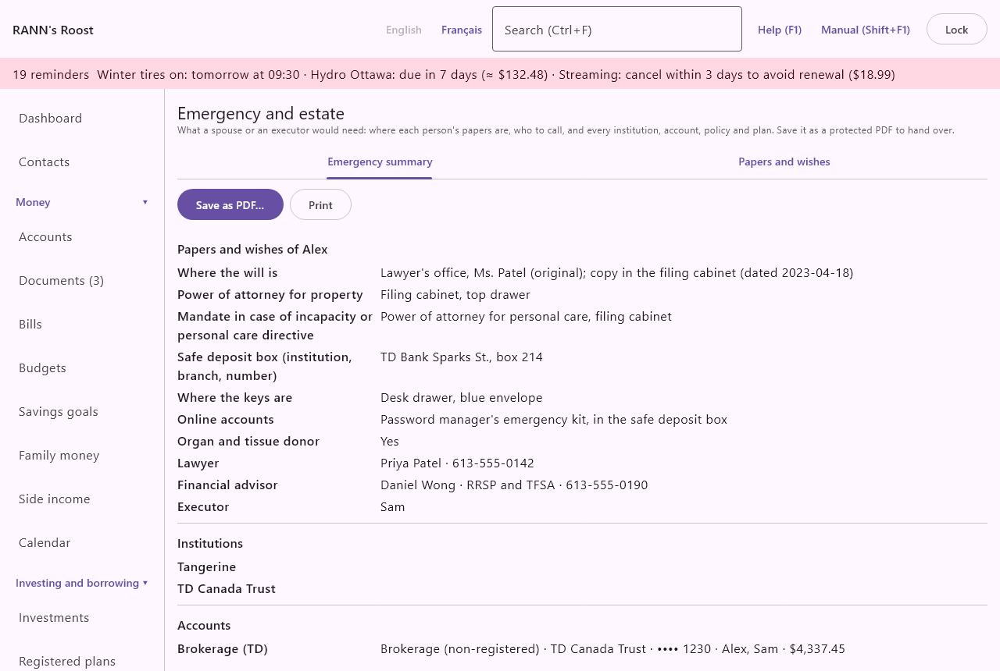

# Emergency and estate

The **Emergency and estate** screen gathers what a spouse or an executor would need if something happened: where each person's papers are, who to call, and every institution, account, policy and plan of the household. You can save it as a password-protected PDF to hand over, or print it. It is in the **Home and family** group of the menu.

> Important: The app does not give legal advice. It records where your papers are; it does not replace a will, a power of attorney or a protection mandate. For those, see a notary or a lawyer.

## The screen at a glance {#overview}
@index: estate planning; executor; liquidator; in case of death; emergency binder

The screen has two tabs:

- **Emergency summary**: everything gathered in one document, ready to save or print. See [Emergency summary tab](estate#summary-tab).
- **Papers and wishes**: for each person, where their papers are, their wishes and the people to call. See [Papers and wishes tab](estate#papers-tab).

Most of the summary fills itself from the rest of the app: institutions, accounts and balances, beneficiaries of registered plans, insurance policies, health and dental plans, pensions and documents kept for good. Only the papers and wishes are typed here.

## Emergency summary tab {#summary-tab}

The tab shows the summary as it would be printed, in sections, with two buttons at the top: **Save as PDF…** and **Print**. A section with nothing in it says "Nothing recorded."

### What the summary contains {#summary-contents}

In this order:

- **Papers and wishes of name**: one section for each person who has a record on the **Papers and wishes** tab: where the will is (with its date), the power of attorney, the mandate or personal care directive, the safe deposit box and its keys, the online accounts, other papers, whether the person is an organ and tissue donor, funeral wishes, notes, then each person to call with their role, firm, phone, email and notes.
- **Institutions**: every institution under **Institutions** in the settings, with its branch, phone and website.
- **Accounts**: every open account, sorted by institution, with its type, institution, masked number, owners, balance, and for a registered plan its beneficiaries and their shares. The section ends with "Balances as of" today's date.
- **Insurance policies**: every active policy from the **Insurance** tab of [Home and assets](assets#insurance-tab): its kind and insurer, policy number, person insured, coverage amount, broker and beneficiaries.
- **Health and dental plans**: every active plan from [Medical claims](medical): its kind and name, insurer, policy and certificate numbers, the plan member, and the people it covers.
- **Pensions**: the pension plans recorded under [Registered plans](plans), with their kind, member, administrator and member number.
- **Documents kept for good**: "Documents marked to keep in the vault of RANN's Roost", with their date and notes. See [Documents](documents).

The summary is always up to date: it is rebuilt each time you open the tab.

### Save as PDF {#save-pdf}
@index: password; protected PDF; encryption; USB key

**Save as PDF…** opens the **Save as PDF** dialog: "A protected PDF opens only with its password, so it can be sent by email or kept on a USB key. Give the password separately, by phone or in person."

- **Protect it with a password**: ticked by default. The file then cannot be opened without the password.
- **Password (8 characters or more)**: "There is no way to open the file without it." Choose one the person receiving it can type, and keep it somewhere safe.
- **Password again**: type it again. "The passwords are not the same." shows until both match.
- **Save as…**: available once the passwords match, or when protection is unticked. It asks where to save; the file is named "In case of emergency.pdf" unless you change it.
- **Cancel**: closes without saving.

The PDF is titled **In case of emergency** and says "Prepared with RANN's Roost on date. Keep it somewhere safe: it lists the household's accounts."

> Important: An unprotected copy lists every account, balance and policy. Keep any copy somewhere safe, and give the password by phone or in person, never in the same email as the file.

### Print {#print}

**Print** sends the summary to the computer's printer. Where printing directly is not possible, the PDF opens instead so you can print it from there. The copy made for printing is not password-protected and is deleted when the app closes.

## Papers and wishes tab {#papers-tab}
@index: will; power of attorney; protection mandate; safe deposit box; funeral

"Where things are, not the papers themselves; scans can be attached once saved. Keep it in a private group to keep it from other household users."

If no household members are recorded, the tab says "Add the household's people first, under Household members." See [Household members](members).

### Choose the person and where it is kept {#person-group}

- **Person**: the household member whose papers you are recording. Each person has one record.
- **Keep it in**: the account group the record is kept in. It is shown only for a person who has no record yet, and only when you can change more than one group. Your private group is proposed when you have one. Whoever can open that group can read the record, so a private group keeps it from other users of the household. It cannot be changed once saved.

### Papers {#papers-fields}

Note where each paper is, not its content:

- **Where the will is**: for example "Notary Gagnon, Sherbrooke; copy in the fireproof box". 
- **Date of the will**: the date of the most recent will. It appears as "dated" after the location.
- **Power of attorney for property**: where it is, and who holds it.
- **Mandate in case of incapacity or personal care directive**: "In Quebec, the protection mandate (mandat de protection); elsewhere, the power of attorney for personal care or health care directive."
- **Safe deposit box (institution, branch, number)**.
- **Where the keys are**: for the safe deposit box.
- **Online accounts**: "Where the password manager's recovery or the list of accounts is kept; never a password itself."
- **Other papers (marriage contract, deeds, birth certificates)**.

> Important: Never type a password, PIN or account access code here. Note only where they are kept.

### Wishes {#wishes}

- **Funeral wishes or prearrangement**: on several lines, for example burial or cremation, the funeral home, a prearrangement contract number.
- **Organ and tissue donor**: tick it if the person wishes to donate. Once ticked and saved, the summary shows "Yes"; if you untick it later, it shows "No". As long as the box was never ticked, the summary shows "Not stated", so whoever reads it knows the wish was not recorded. Register the consent officially as well (with your province or on your health card).
- **Notes**: anything else the family should know.

### People to call {#contacts}
@index: executor; liquidator; mandatary; notary; lawyer; financial advisor

**Add a person** adds a line for someone to call. Each line has:

- **Role**: **Executor** (the default), **Liquidator (Quebec)**, **Attorney (power of attorney)**, **Mandatary (Quebec)**, **Lawyer**, **Notary**, **Financial advisor**, **Accountant**, **Insurance advisor**, **Employer** or **Other**.
- **Name**: required for the line to be kept. A line without a name is dropped when you save.
- **Firm or organization**.
- **Phone**.
- **Email**.
- **✕**: removes the line (it is gone once you save).

### Save and attach scans {#save-scans}

- **Save**: saves the person's record, including the people to call. "Saved." appears beside the button. Nothing is saved until you choose it; changing person before saving loses what you typed.
- **Scans (will, mandate, contracts)**: shown once the record is saved. **Attach a file…** adds a file from the computer, and **From the review inbox** picks a document waiting in the review inbox. The files are kept in the [Documents](documents) vault, in the same group as the record. They are not added to the PDF summary.

## Keeping it up to date {#keep-safe}

- Review the papers and wishes once a year, and after a new will, a move or a change of advisor.
- Mark important documents to keep for good in [Documents](documents) so they are listed.
- Add beneficiaries to registered plans under [Registered plans](plans) and to life policies under [Home and assets](assets#insurance-tab): they appear in the summary.
- Save a new PDF after each change: a saved PDF does not update itself.

## Contacts {#linked-contacts}

@index: contact; linked contact; Link a contact

Once a person's papers are saved, the Papers and wishes tab shows, under the people to call, the contacts linked to these papers in an estate role, such as Executor or Notary. **Link a contact…** picks one from Contacts. The emergency summary lists them with the people to call typed on this tab, which stay as they are.

Click a contact to open its page in [Contacts](contacts); **Remove link** takes the link away, and **Link a contact…** picks one, in its role, or creates a **New contact…** and links it. See [Contacts on other screens](contacts#on-other-screens).
