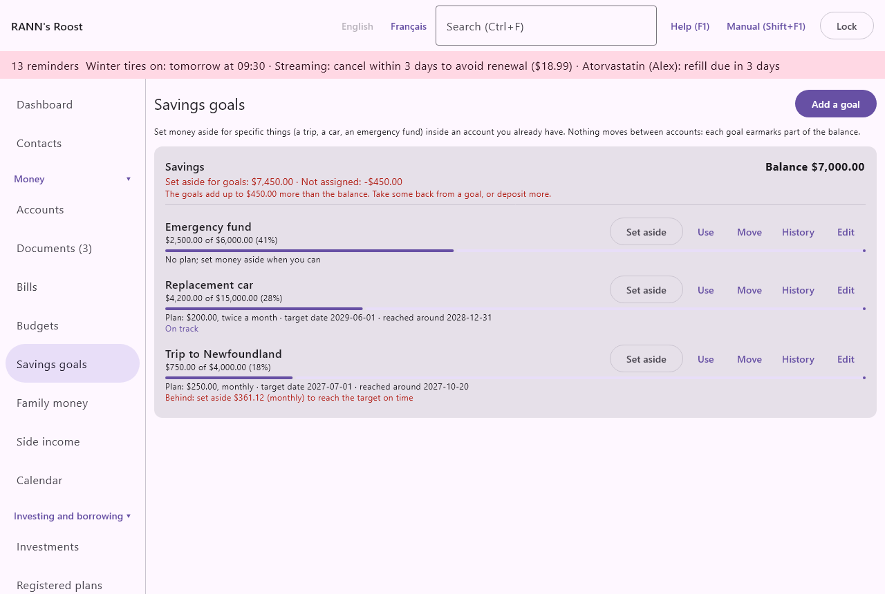

# Savings goals

Savings goals help you set money aside for specific things, such as a trip, a new car, a roof, holiday gifts or an emergency fund, inside an account you already have. Savings goals is in the Money group of the menu.

## How savings goals work {#overview}
@index: savings goal; sinking fund; emergency fund; envelope; earmark; saving for a purchase

A goal earmarks part of an account's balance. Nothing moves between accounts and no transaction is created: the money stays in your savings account, and the app keeps track of how much of it belongs to each goal. What is not given to any goal is "not assigned".

For example, a high-interest savings account holds 9,000 $. You have three goals in it: Emergency fund 5,000 $, Trip 2,500 $ and Car repairs 600 $. The account shows "Set aside for goals: 8,100 $ · Not assigned: 900 $".

You record three kinds of movements on a goal:

- **Set aside**: more of the balance is earmarked for the goal, by hand or automatically on a schedule.
- **Use**: the goal paid for what it was saved for, or money was taken back for something else.
- **Move**: an earmark moves from one goal to another goal in the same account.

The real deposits and purchases are entered in the account as usual, from its register or a statement.

## The Savings goals screen {#goals-screen}

At the top, **Add a goal** opens the goal form, and a short note explains how goals work. "No goals yet. Add one to start setting money aside." means none exist.

### Account cards {#account-cards}

Goals are grouped by account, one card per account that has goals. Each card shows:

- the account's name and "Balance ...": its current balance in the books;
- "Set aside for goals: ... · Not assigned: ...": the total earmarked for its goals, and the rest;
- in red, when the goals add up to more than the balance: "The goals add up to ... more than the balance. Take some back from a goal, or deposit more."

That warning means money was spent from the account without being taken from a goal. Use **Use** on a goal to record it, or deposit more.

### Goal lines {#goal-lines}

Each goal in the account has a line with:

- its name, followed by "(Reached)" when its status is Reached;
- "... of ... (n%)": what is set aside, the target, and the percentage;
- a progress bar;
- the plan, see [Progress and on track](goals#progress);
- the buttons:
  - **Set aside**: earmarks more for the goal. See [Set aside](goals#set-aside).
  - **Use**: records that money left the goal. See [Use or take back](goals#use-or-take-back).
  - **Move**: moves an amount to another goal of the same account. See [Move to another goal](goals#move).
  - **History**: lists every movement of the goal. See [History](goals#history).
  - **Edit**: opens the goal form.

### Progress and on track {#progress}
@index: on track; behind schedule; projected date

Under the bar, one line sums up the plan:

- "Plan: ..., ..." with the amount and the schedule, for example "Plan: 250.00 $, monthly". "(by hand)" is added when the set-asides are not entered automatically.
- "No plan; set money aside when you can" when the goal has no schedule.
- "target date ..." when the goal has a target date.
- "reached around ...": when the planned set-asides would reach the target.
- "needs about ... a month": for a goal with a target date but no plan, the monthly amount that would reach the target on time.
- "Target reached" once the amount set aside is equal to the target or more.

Below it, when the goal has both a plan and a target date:

- "On track": the planned set-asides reach the target by the target date.
- "Behind: set aside ... (monthly) to reach the target on time": they do not; the amount is what each planned set-aside would need to be from now on.

## Add or edit a goal {#goal-form}

**Add a goal** opens the form titled "Add a goal"; **Edit** opens it as "Edit goal". **Save** is available once the goal has a name and an account. **Cancel** closes the form without saving.

- **What are you saving for?**: the goal's name, such as "Trip to Gaspésie" or "Emergency fund". Required.
- **Kept in account**: the account that holds the money. Chequing, savings, high-interest savings, cash, investment and similar accounts are offered; credit cards, lines of credit, home equity lines, loans and mortgages are not. The default is your first savings account. It can be chosen only when the goal is created. The goal's amounts are in this account's currency.
- **Target amount**: how much you want to set aside in total. Required, more than zero.
- **Target date (optional)**: when you want to reach it, as YYYY-MM-DD. With a date, the app tells you whether you are on track and how much is needed. Leave empty for an open-ended goal.
- **Set an amount aside on a schedule**: tick it to plan regular set-asides. Ticked by default for a new goal. See [Planned set-asides](goals#planned-set-asides).
- **Status**: shown when editing. See [Status](goals#status).
- **Notes**: your own notes about the goal.
- **Delete**: shown when editing. See [Delete a goal](goals#delete-goal).

### Planned set-asides {#planned-set-asides}
@index: automatic savings; scheduled contribution; pay yourself first

With **Set an amount aside on a schedule** ticked:

- **Amount each time**: the amount earmarked on each date. Required, more than zero.
- **Repeats**: Weekly, Every two weeks, Twice a month, Monthly, Quarterly, Twice a year or Yearly. Match it to your pay or to the transfer you make to savings. Default: Monthly.
- **First date**: the first date of the schedule, as YYYY-MM-DD. Default: today.
- **Second day**: shown for Twice a month. The second day of the month, 1 to 31, or 0 for the last day. The first day is the first date's day.
- **Enter the set-asides automatically on their dates**: when ticked (the default), each planned set-aside is entered on its date while the app is open, checked when the household opens and every hour after. Days the app was closed are caught up the next time it opens. When unticked, nothing is entered on its own: the plan is used only for the projection, shown "(by hand)", and you click **Set aside** yourself.

Automatic set-asides:

- are entered only for goals whose status is Active;
- stop once the target is reached; the last one is only what is missing to reach the target;
- appear as "Planned set-aside" in the history.

If you change the schedule or its first date, set-asides are entered again from the new first date. Those already entered stay; if the new first date is in the past, delete any doubles from the history.

> Tip: Set the plan to the same amount and dates as the automatic transfer you make from chequing to savings. The goal then grows as the money arrives.

### Status {#status}

- **Active**: the usual state. Planned set-asides are entered.
- **Reached**: you consider the goal done. "(Reached)" is shown after its name and no more planned set-asides are entered.
- **Archived**: the goal is hidden from the screen and its money no longer counts as set aside; the account's "Not assigned" amount goes up by that much. Its history is kept.

## Set aside {#set-aside}

**Set aside** opens a form titled "Set aside · (goal)". It "Earmarks part of the account's balance for this goal. No money moves."

- **Date**: the date of the set-aside, as YYYY-MM-DD. Default: today.
- **Amount**: how much to earmark. Default: the planned amount each time, if any. Required, more than zero.
- **Memo**: an optional note, shown in the history.

## Use or take back {#use-or-take-back}
@index: spend from goal; withdraw from goal

**Use** opens a form to record that money left the goal.

- **Reason**:
  - **Spent on what it was for**: the goal paid for its purpose ("The goal paid for what it was saved for. Enter the purchase itself in the account as usual."). Recorded as "Used".
  - **Taken back for something else**: the money returns to the account's unassigned balance ("Returns money to the account's unassigned balance."). Recorded as "Taken back". Use it to correct a set-aside or to free money for another need.
- **Date**: default today.
- **Amount**: how much leaves the goal. Required, more than zero.
- **Memo**: an optional note.

Both reasons reduce what the goal has set aside. Neither creates a transaction: enter the purchase or the withdrawal in the account as usual, so that the balance and the goals stay in step.

## Move to another goal {#move}

**Move** shifts an earmark from this goal to another goal in the same account, for example from Trip to Emergency fund.

- **Move to**: the other goal. Only goals of the same account are offered. "This is the only goal in this account." means there is none, and the form cannot be saved.
- **Amount**: how much to move. Required, more than zero.

The move is dated today and appears in both histories, as "Moved out" and "Moved in".

## History {#history}

**History** opens "History of (goal)", every movement newest first, with its date, kind (Set aside, Planned set-aside, Used, Moved in, Moved out, Taken back), memo and amount. Amounts that left the goal are negative, in red.

- **Delete** on a line removes that movement, for example a set-aside entered twice. It first asks "Delete this entry: (kind), (amount) on (date)? The goal's balance changes by that amount; nothing moves in the account. This cannot be undone." Deleting one side of a move does not delete the other side.

**Close** closes the history.

## Delete a goal {#delete-goal}

**Delete** in the goal form asks "Delete ... and its history? The money stays in the account." On confirmation the goal and all its movements are deleted. No transaction changes and the account balance stays the same; the amount it held becomes "not assigned". This cannot be undone. To keep the history, set **Status** to Archived instead.

## Who can see and change goals {#permissions}

A goal belongs to the account group of its account: it is visible to those who can open that group, and changing it, setting money aside or deleting it needs **Edit** permission on that group. See [Users](users).
