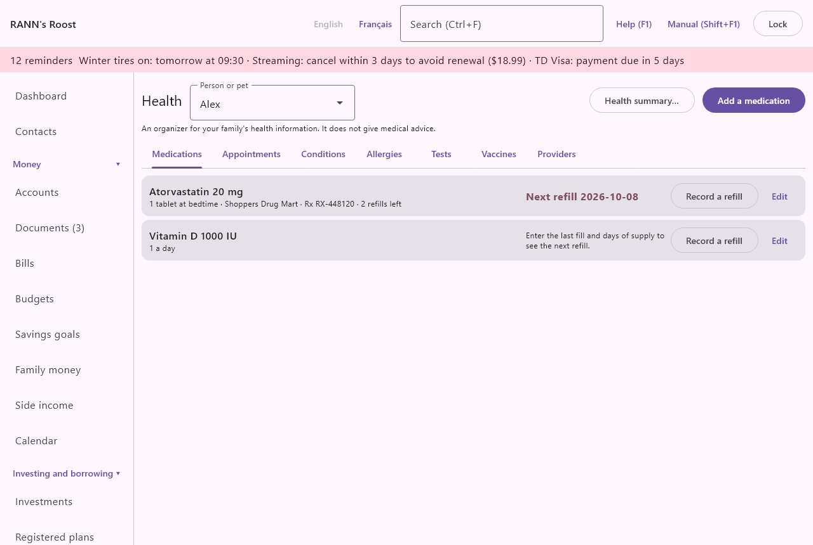
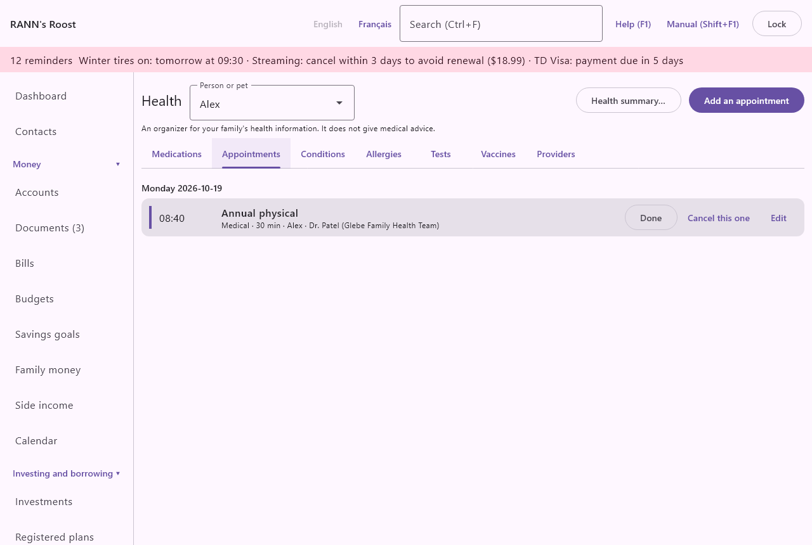

# Health

The **Health** screen is an organizer for your family's health information: medications and refills, appointments, conditions, allergies, tests, vaccines and the people who care for you. It is in the **Home and family** group of the menu. Pets have health records here too.

> Important: The screen says it plainly: it is an organizer for your family's health information and does not give medical advice. Follow what your doctor, pharmacist or veterinarian tells you.

## The Health screen at a glance {#overview}
@index: health records; medical records; dossier

The top of the screen holds:

- **Person or pet**: whose records you are looking at. See [Choose the person or pet](health#choose-person).
- **Health summary…**: saves a printable summary for the person shown. It is not offered for a pet. See [Health summary](health#health-summary).
- The add button of the tab shown: **Add a medication**, **Add an appointment**, **Add a condition**, **Add an allergy**, **Add a test**, **Add a vaccine** or **Add a provider**.

Below are seven tabs: **Medications**, **Appointments**, **Conditions**, **Allergies**, **Tests**, **Vaccines** and **Providers**. Every tab except **Providers** shows the records of the person or pet chosen at the top. **Providers** is one list for the whole household.

Each record in a list has an **Edit** button that opens it again. Records are not shared between people: a vaccine recorded for one child must be recorded again for the other.

## Choose the person or pet {#choose-person}
@index: pet health; family member

The **Person or pet** list holds everyone under **Household members** and every pet on the **Pets** screen. A pet appears with its kind in brackets, for example "Rex (dog)".

If the list is empty, the screen shows "Add the people in your household first." and a **Household members** button that takes you there. See [Household members](members).

When you choose **Health records** on a pet's card in the [Pets](pets) screen, the Health screen opens with that pet already chosen.

## Who can see the records {#privacy-groups}
@index: private group; privacy; store in; account group

Health records are kept in an account group, like accounts are. Whoever can open that group can read them. When you add a record, the form shows:

- **Store in**: the account group the record is kept in. It is chosen once, when the record is created; it cannot be changed afterwards. A group marked "(private)" is yours alone.
  For a person, the app proposes your own private group if you have one, otherwise the first group you can change. For a pet, it proposes the first shared group, since a pet belongs to the whole household.
- **Create my private group**: shown with the note "You have no private group yet. Records in a shared group can be seen by everyone who can open that group." It creates a group named after you, marked private, and chooses it for the record.

To add or change health records you need the **Edit** permission on the group. If you cannot change any group, the app says "You cannot add records to any account group." A user with **Capture only** permission can still record a refill. See [Users](users) for permissions.

## Medications tab {#medications}
@index: prescription; drug; pills; pharmacy

The **Medications** tab lists the person's medications, those still taken first, then those stopped, each in alphabetical order. A stopped medication shows "(stopped)" after its name.

### The medication list {#medication-list}

Each medication shows:

- its name and dose;
- how to take it, the pharmacy, the prescription number ("Rx 123456") and the refills left ("2 refills left", "no refills left");
- for a medication still taken, its refill status on the right:
  - "Next refill" and the date the current supply runs out. The date is red when it has passed, and in bold when it is within the reminder days you chose.
  - "Enter the last fill and days of supply to see the next refill." when either is missing.
  - "Prescription needs renewal", in red, when no refills are left.
- **Record a refill** (only for a medication still taken) and **Edit**.

### Add or edit a medication {#medication-form}

Choose **Add a medication**, or **Edit** on a medication. The form is titled **Add a medication** or **Edit medication**.

- **Medication**: the name, for example "Amoxicillin" or "Ventolin". Required: **Save** stays unavailable until it is filled.
- **Dose**: the strength, for example "500 mg" or "2 puffs". Optional. It appears after the name in the list and in the health summary.
- **How to take it**: the instructions, for example "1 tablet 3 times a day with food". Shown in the list and in the health summary.
- **Prescribed by**: a provider from the **Providers** tab, or "(none)". Pharmacies and laboratories are not offered here, and providers marked as no longer used are hidden. The prescriber appears in the health summary.
- **Pharmacy**: a provider of the kind Pharmacy, or "(none)". Shown in the list. The prescriber and the pharmacy of each medication still taken are listed with their phone numbers in the health summary.
- **Prescription number**: the number on the label, useful when you call the pharmacy.
- **Started**: when the person started taking it. A new medication starts today; clear the date if you do not know it. Dates are entered as year-month-day, for example 2026-03-14.
- **Stopped**: when the person stopped taking it, for your records. To stop the refill reminders, untick **Still taking it** as well.

Under **Refills**:

- **Last filled**: the date the current supply was picked up. A new medication proposes today.
- **Days of supply**: how many days the supply lasts, from 1 to 400. A new medication proposes 30. With **Last filled**, it gives the next refill date: last filled plus the days of supply.
- **Refills remaining**: how many refills the prescription still allows, from 0 to 99. Leave it empty if you do not track it. At 0 the medication shows "Prescription needs renewal".
- **Remind me (days before)**: "How many days before the supply runs out to remind you." From 0 to 60; 5 by default (set in [Rates and rules](rates-rules)), and the same again if left empty.
- **Notes**: anything else, on several lines.
- **Store in**: see [Who can see the records](health#privacy-groups).

When you edit a saved medication, the form also shows:

- **Recent fills**: the last six refills recorded, with their date, days of supply and quantity.
- **Still taking it**: ticked while the medication is taken. Untick it when it is stopped: it moves to the end of the list marked "(stopped)", gets no refill status, no **Record a refill** button, no refill reminders, no calendar entries, and is left out of the health summary.
- **Delete**: asks "Delete "name"?" and, once confirmed, removes the medication and its fills. It cannot be undone. To keep the history, untick **Still taking it** instead.

### Record a refill {#record-refill}
@index: renewal; pick up prescription

When you pick up a refill, choose **Record a refill** on the medication. The dialog is titled with the medication's name.

- **Picked up on**: the date of the refill; today by default.
- **Days of supply**: how long this refill lasts; the medication's current days of supply are proposed. Change it if the pharmacy gave a different quantity: the new number replaces the old one for the next refill date.
- **Quantity**: optional, as written on the label, for example "90 tablets".

Below, the dialog says how many refills will be left after this one, when you track them.

When you choose **Save**:

- the fill is added to **Recent fills**;
- **Last filled** moves to the date entered, unless an even later fill is already recorded;
- **Refills remaining** goes down by one, never below 0;
- the next refill date moves on accordingly.

### Refill reminders and renewals {#refill-reminders}
@index: reminder; notification; refill due

For each medication still taken that has a last fill and days of supply:

- From the number of days set in **Remind me (days before)** ahead of the next refill date, and until you record the refill, the medication appears in the reminders shown at the top of the window and in the system notification. Clicking that reminder brings you to the Health screen.
- The next refill date also appears on the [Calendar](calendar).

When **Refills remaining** reaches 0, the list shows "Prescription needs renewal" so you can ask the doctor for a new prescription before the supply runs out.

## Appointments tab {#appointments}
@index: doctor's appointment; vet appointment; dentist

The **Appointments** tab lists the calendar appointments of the person or pet chosen, from one year ago to one year ahead, of the kind **Medical** (or **Pets** for a pet). They are the same appointments as on the [Calendar](calendar): adding, changing or deleting one here changes the calendar too. When there is none, the tab says "No medical appointments in the past or next year."

**Add an appointment** opens the calendar's appointment form, with today's date, the kind **Medical** (or **Pets** for a pet) and the person or pet already filled in. Its fields, such as **What**, **Date**, **Time**, **Where**, **Who**, **Provider**, **Remind me** and the repeat, are described in the [Calendar](calendar) chapter. The **Provider** list offers the providers of the **Providers** tab.

Click an appointment to open it again.

## Conditions tab {#conditions}
@index: diagnosis; illness; chronic condition

The **Conditions** tab lists the person's health conditions: diabetes, asthma, high blood pressure, an injury. Each line shows the name and status, then the date diagnosed and the notes.

### Add or edit a condition {#condition-form}

Choose **Add a condition**, or **Edit** on a condition (the form is then titled **Edit condition**).

- **Condition**: its name. Required.
- **Diagnosed**: the date of the diagnosis, if you know it. Optional.
- **Status**: **Active** (the default), **Under control** or **Resolved**. A resolved condition stays in the list but is left out of the health summary.
- **Provider**: the doctor or clinic following it, from the **Providers** tab, or "(none)".
- **Notes**: treatment, precautions, anything useful.
- **Store in**: see [Who can see the records](health#privacy-groups).
- **Delete** (when editing): asks first, then removes the condition. It cannot be undone.

## Allergies tab {#allergies}
@index: allergy; anaphylaxis; intolerance

The **Allergies** tab lists what the person or pet is allergic to, with the severity, the reaction and the notes. Allergies come first in the health summary, since they matter most in an emergency.

### Add or edit an allergy {#allergy-form}

- **Allergic to**: the substance, for example "Penicillin", "Peanuts" or "Bee stings". Required.
- **Reaction**: what happens, for example "hives" or "swelling of the throat".
- **Severity**: **Mild**, **Moderate**, **Severe**, or "(none)" if you do not know.
- **Notes**: for example "carries an EpiPen".
- **Store in**: see [Who can see the records](health#privacy-groups).
- **Delete** (when editing): asks first, then removes the allergy.

An allergy has no provider.

## Tests tab {#tests}
@index: blood test; lab results; laboratory; follow-up

The **Tests** tab lists tests and their results, the most recent first. Each line shows the date, the test, the result and units, then the normal range, the follow-up date and the notes.

### Add or edit a test {#test-form}

- **Test**: its name, for example "Cholesterol (LDL)" or "Mammogram". Required.
- **Date**: when the test was done; today for a new test. Required.
- **Result**: the result as written on the report, for example "3.1" or "normal". Text is accepted.
- **Units**: for example "mmol/L".
- **Normal range**: the reference range on the report, for example "under 3.5". Shown as "normal under 3.5".
- **Follow-up date**: when to repeat the test or see the doctor about it. It appears on the [Calendar](calendar) on that date.
- **Provider**: the laboratory, clinic or doctor, from the **Providers** tab.
- **Notes**.
- **Store in**: see [Who can see the records](health#privacy-groups).
- **Delete** (when editing): asks first, then removes the test.

## Vaccines tab {#vaccines}
@index: immunization; vaccination; booster; shots

The **Vaccines** tab lists vaccines received, the most recent first, with the next dose due when there is one.

### Add or edit a vaccine {#vaccine-form}

- **Vaccine**: its name, for example "Tetanus-diphtheria" or "Rabies" for a pet. Required.
- **Date**: when it was given; today for a new vaccine. Required.
- **Next dose due**: the date of the next dose or booster, if any. It appears on the [Calendar](calendar) on that date.
- **Provider**: the clinic, pharmacy or veterinarian who gave it.
- **Notes**: lot number, reaction, anything useful.
- **Store in**: see [Who can see the records](health#privacy-groups).
- **Delete** (when editing): asks first, then removes the vaccine.

The health summary lists each vaccine once, with the date of its most recent dose.

## Providers tab {#providers}
@index: doctor; dentist; pharmacy; clinic; veterinarian; vet; groomer; kennel; specialist

The **Providers** tab is the household's directory of the people and places that provide care: doctors, dentists, pharmacies, clinics, hospitals, specialists, laboratories, and for pets veterinarians, groomers and kennels. Each line shows the name, the kind, the phone and the address. Providers no longer used come last, marked "(No longer used)".

Providers are offered in the medication, condition, test and vaccine forms, in calendar appointments and in medical expenses on the [Medical claims](medical) screen.

### Add or edit a provider {#provider-form}

Choose **Add a provider**, or **Edit** on a provider (the form is then titled **Edit provider**).

- **Name**: for example "Dr. Tremblay" or "Pharmacie du Village". Required.
- **Kind**: **Doctor** (the default), **Dentist**, **Pharmacy**, **Clinic**, **Hospital**, **Specialist**, **Laboratory**, **Other**, **Veterinarian**, **Groomer** or **Kennel or pet sitter**. The kind decides where the provider is offered: only a **Pharmacy** is offered as a medication's **Pharmacy**, and pharmacies and laboratories are not offered under **Prescribed by**.
- **Phone**: shown in the list and in the health summary.
- **Address**.
- **Notes**: office hours, the name of the nurse, anything useful.
- **Store in**: the account group the provider is kept in. A new provider proposes the first shared group, so that everyone can use it. It cannot be changed afterwards.
- **No longer used** (when editing): tick it when you stop seeing this provider. It stays on the records that name it, but is no longer offered for new ones.

Providers cannot be deleted; mark them **No longer used** instead.

## Health summary {#health-summary}
@index: emergency medical information; printable summary; PDF

**Health summary…** saves a one-person summary to take to an appointment, give to a caregiver or keep for an emergency. It is offered for people only, not for pets. The PDF is titled "Health summary · name" and lists:

- **Allergies**: each with its severity, reaction and notes;
- **Conditions**: those not resolved, with their status, the date diagnosed and the notes;
- **Medications**: those still taken, with the dose, how to take them and who prescribed them;
- **Vaccines**: each vaccine once, with the date of the latest dose;
- **Providers**: the prescribers and pharmacies of the medications still taken, with their phone and address.

The PDF also says when and with what it was prepared.

### Save as PDF dialog {#save-pdf}
@index: password; protected PDF; encryption

The dialog is titled **Save as PDF**. It explains: "A protected PDF opens only with its password, so it can be sent by email or kept on a USB key. Give the password separately, by phone or in person."

- **Protect it with a password**: ticked by default. Untick it only for a copy you print right away.
- **Password (8 characters or more)**: the password that will be needed to open the file. "There is no way to open the file without it." Keep it somewhere safe.
- **Password again**: the same password, to make sure there is no typing mistake. "The passwords are not the same." appears until both match.
- **Save as…**: available once the passwords match (or protection is off). It asks where to save the file; the name proposed is the summary's title. The ".pdf" ending is added if you leave it out.
- **Cancel**: closes the dialog without saving.

> Note: The summary is a copy of what is recorded at that moment. Save a new one after a change in medications or allergies.

## Deleting records {#delete}

Medications, conditions, allergies, tests and vaccines each have a **Delete** button in their form, once saved. The app asks "Delete "name"?" first. A deleted record cannot be brought back, except by restoring a backup. Appointments are deleted from their calendar form. Providers are not deleted; mark them **No longer used**.

## Where health records are used {#what-it-feeds}

- **Reminders**: refills coming up within their reminder days, at the top of the window and as a system notification.
- **Calendar**: next refill dates, test follow-up dates and next vaccine doses, as well as the appointments.
- **Medical claims**: a medical expense of the kind "Prescriptions" can name one of the person's medications, and the providers are offered for each expense. See [Medical claims](medical).
- **Pets**: the **Health records** button on a pet's card opens this screen for that pet. See [Pets](pets).
- **Emergency and estate**: the health summary uses the same PDF protection as the emergency summary. See [Emergency and estate](estate).

## Contacts {#linked-contacts}

@index: contact; linked contact; Link a contact

The provider form ends with Contacts: the contact for this provider (Contact), where its people, hours, several phones and file numbers can be kept. The medication form of a saved medication shows its Pharmacy and Prescriber contacts. The Prescriber and Pharmacy chosen from the providers above stay as they are and keep feeding the reminders.

Click a contact to open its page in [Contacts](contacts); **Remove link** takes the link away, and **Link a contact…** picks one, in its role, or creates a **New contact…** and links it. See [Contacts on other screens](contacts#on-other-screens).
