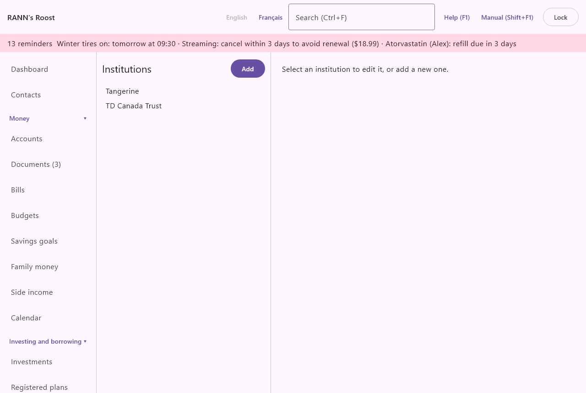

# Institutions

Institutions are the banks, credit unions, caisses, brokerages and other companies that hold your accounts: RBC, Desjardins, Tangerine, Wealthsimple. Recording them keeps their contact details in one place and lets the app remember how each one's statements are laid out. The screen is in the **Settings** group of the menu, under **Institutions**.

## What institutions are for {#about-institutions}

@index: bank; financial institution; credit union; caisse; brokerage; branch

- On the [Accounts](accounts) screen, each account can name its **Institution**. Several accounts at the same bank share one institution.
- When you import a CSV statement, the column layout you choose is remembered for the institution, so every account at that bank reuses it. An account with no institution remembers its own layout.
- The institution's phone number and website are at hand when you need to call about an account or a card.
- The institution and transit numbers identify a branch on a cheque or for a direct deposit form.

Institutions are optional: an account can have none.

## The Institutions screen {#screen}

The left side lists the institutions in alphabetical order, with **Add** above the list. The right side shows the form for the institution selected, or for a new one. When nothing is selected, it says "Select an institution to edit it, or add a new one."

## Add an institution {#add-institution}

1. Click **Add**.
2. Fill in the **Name** and any other fields you want.
3. Click **Save**.

The new institution is selected in the list and can be chosen right away on the account form.

### The institution form {#institution-fields}

@index: institution number; transit number; branch number; routing number; void cheque

- **Name**: the name of the bank or company, as you want to see it in the account form, such as Desjardins or TD Canada Trust. Required.
- **Branch**: optional. The branch name or address, such as Plateau Mont-Royal or 123 Main Street.
- **Institution number (3 digits)**: optional. The three-digit number that identifies the bank in Canada, printed on cheques, such as 815 for Desjardins or 004 for TD. If filled in, it must have exactly 3 digits ("The institution number has 3 digits.").
- **Transit number (5 digits)**: optional. The five-digit number of the branch, printed on cheques before the institution number. If filled in, it must have exactly 5 digits ("The transit number has 5 digits.").
- **Website**: optional. The address of the institution's website or online banking.
- **Phone**: optional. The number to call, such as the customer service or the lost card line.
- **Notes**: optional, several lines. Anything useful: your adviser's name, opening hours, a reference number. Do not write passwords here.
- **Save**: saves the institution. Nothing is saved until you click it. Empty optional fields are saved as empty.

> Tip: The institution and transit numbers, with your account number, are what an employer or a government asks for a direct deposit. A void cheque shows all three.

## Change an institution {#change-institution}

1. Click the institution in the list.
2. Change any field.
3. Click **Save**.

A new name shows at once on every account that uses the institution.

There is no way to delete an institution. To stop an account from naming it, edit the account and choose (none) for **Institution**.

## Shared by the household {#shared}

The institution list is shared by the whole household, whichever account groups use it: everyone who signs in sees the same institutions. Every institution added or changed is recorded in the activity log on the [Users](users) screen.

Administrators and members can add and change institutions. Viewers see the list and the forms greyed out, without **Add** or **Save**.

## Contacts {#linked-contacts}

@index: contact; linked contact; Link a contact

The institution form ends with Contacts: the contact made for this institution (Contact), where you can keep its people, such as your advisor, its hours and several phone numbers, and say what it is for. The fields above stay as they are; the Phone and Website typed here keep working.

Click a contact to open its page in [Contacts](contacts); **Remove link** takes the link away, and **Link a contact…** picks one, in its role, or creates a **New contact…** and links it. See [Contacts on other screens](contacts#on-other-screens).
