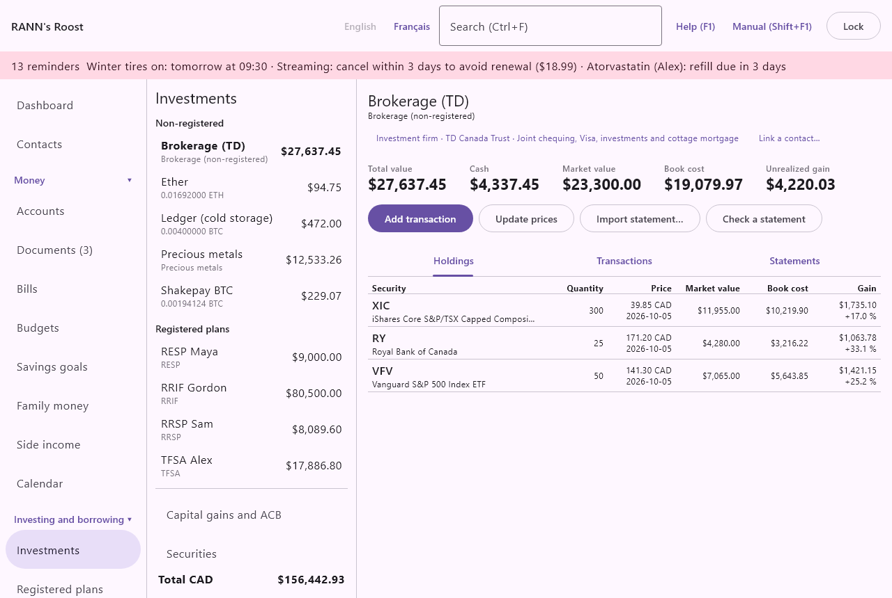

# Investments

Investments shows what you hold in your brokerage accounts, registered plans, crypto wallets and precious metals accounts, what it is worth, what it cost, and the capital gains you made. It is in the Investing and borrowing group of the menu.

The screen has three parts: the list of accounts on the left, the account or view you chose on the right, and the dialogs that open from the buttons. This chapter follows that order, then covers crypto wallets and precious metals, which have their own views.

> Note: The figures on this screen are an organizational aid, not tax advice. Your slips, your brokerage statements and the CRA or Revenu Québec have the final word.

## The Investments screen {#investments-screen}

@index: portfolio; brokerage; holdings; securities; stocks; ETF; mutual fund

Investment accounts are not created here. Create them under [Accounts](accounts) with an investment type: Brokerage (non-registered), RRSP, Spousal RRSP, RRIF, Spousal RRIF, LIRA, LIF, TFSA, FHSA, RESP, Pension plan, Crypto wallet or Precious metals. Set each account's owners there too: the owners decide whose capital gains and whose contribution room the account counts for.

When you open Investments from an account's register, that account is shown first. Otherwise the first account in the list is shown, or the securities list when there are no accounts.

To change anything on this screen you need permission to edit the account group that holds the account. With read-only access you can look but not save.

### The account list {#account-list}

The left column lists every investment account you can see, in two groups:

- **Non-registered**: brokerage accounts, crypto wallets and precious metals accounts. Their sales give taxable capital gains.
- **Registered plans**: RRSP, Spousal RRSP, RRIF, Spousal RRIF, LIRA, LIF, TFSA, FHSA, RESP and pension plans. Gains made inside them are not taxed while the money stays in the plan.

Each line shows the account name, its type underneath and its total value on the right. A crypto wallet shows its balance in coins underneath and, on the right, its value in your base currency.

Below the accounts are three more choices:

- **Capital gains and ACB**: the adjusted cost base of everything you hold outside registered plans, and the gains and losses of each year. See [Capital gains and ACB](investments#capital-gains-acb).
- **Securities**: every stock, ETF, fund, bond, GIC and option known to the books. See [Securities](investments#securities).
- **Import from an exchange…**: reads the history file of a crypto exchange. See [Import from an exchange](investments#exchange-import).

At the bottom, a **Total** line per currency adds up the values shown in the list (for example Total CAD and Total USD). Crypto wallets are counted at their value in your base currency.

### Earlier Quicken history {#kept-quicken-history}

@index: Quicken; QIF

If you imported a Quicken file earlier and it contained investment history, a coloured banner at the top says so: "An earlier Quicken import kept its investment history." Click **Import investment history** to read it into the investment accounts that have the same names as in Quicken. A result window then tells you how many transactions were added, how many securities were created, and lists any notes about lines that could not be read.

## One investment account {#investment-account}

Choose a brokerage account or a registered plan in the list to see it. (Crypto wallets and precious metals accounts have their own views: see [Crypto wallets](investments#crypto-wallets) and [Precious metals](investments#precious-metals).)

The heading shows the account name and its type. For a registered plan it adds "registered: no capital gains while the money stays in the plan", because selling inside an RRSP, TFSA or other plan gives no capital gain or loss to report.

### Account figures {#account-figures}

@index: market value; book cost; unrealized gain; cash balance

- **Total value**: cash plus the market value of every holding. A holding without a price counts at its book cost.
- **Cash**: the money in the account: its opening balance plus every cash line in its register (deposits, withdrawals, purchases, sales, income and fees).
- **Market value**: the holdings at their latest price, without the cash. A holding without a price counts at its book cost here too.
- **Book cost**: what the units still held cost you, commissions included, at their average cost.
- **Unrealized gain**: market value minus book cost: what you would gain or lose if you sold everything at today's prices.

If some securities have no price yet, a red line names them: they are counted at book cost until you enter a price with **Update prices**.

Amounts are in the account's currency. A U.S. dollar account shows U.S. dollars; a security priced in another currency than its account is converted at the exchange rate of the day (see [Rates and prices](rates)).

### Account buttons {#account-buttons}

- **Add transaction**: records a buy, sell, dividend or any other investment event. See [Add or edit a transaction](investments#transaction-dialog).
- **Update prices**: enters today's price of every security held, in one window. Available once the account holds something. See [Update prices](investments#update-prices).
- **Import statement…**: reads a brokerage file (OFX, QFX or CSV). See [Import a brokerage statement](investments#import-statement).
- **Check a statement**: compares the cash and units on a paper or PDF statement with the books. See [Check a statement](investments#check-statement).

### Holdings tab {#holdings-tab}

One line per security held today, sorted by name:

- **Security**: the symbol (or the name when there is no symbol), with the full name underneath. For a bond or GIC, a third line shows its coupon and maturity date when they are entered on the security, for example "coupon 3.25 % · matures 2027-06-01".
- **Quantity**: the number of units held, up to six decimals.
- **Price**: the latest price on or before today, in the security's currency, with its date underneath; "no price" when there is none.
- **Market value**: quantity times price times the security's value multiplier, in the account's currency; a dash when there is no price.
- **Book cost**: the average cost of the units held, commissions included.
- **Gain**: market value minus book cost, with the percentage underneath. A loss shows in red.

### Transactions tab {#transactions-tab}

Every investment transaction of the account, newest first: the date, the kind, the security (for a merger, an arrow to the security received), the quantity with "@ price" or "× ratio", and the effect on the account's cash. When a transaction moves no cash but has an amount (a notional distribution, units moved in), the amount is shown greyed.

Click a line to change or delete it.

### Statements tab {#statements-tab}

@index: reconcile; reconciliation; brokerage statement

The statements saved for the account, imported or entered by hand, newest first. Each line shows the statement date, the cash on it, the number of holdings, and either **Reconciled** (in colour) or **To check** (in red). Click a line to open the comparison with the books. See [Check a statement](investments#check-statement).

## Add or edit a transaction {#transaction-dialog}

@index: buy; sell; dividend; DRIP; return of capital; split; merger; commission

Click **Add transaction** or a line of the Transactions tab. The fields shown change with the kind of transaction. Click **Save** to record it, or **Cancel**.

### Kinds of transaction {#transaction-kinds}

- **Type**: what happened. The options are:
  - Buy: cash pays for the units and the commission; both make up their cost.
  - Sell: the units leave at their average cost; the difference with the proceeds is the capital gain or loss.
  - Income (dividend, interest, distribution): paid in cash. Foreign tax withheld is recorded as an expense.
  - Reinvested income (DRIP): income used to buy more units. It counts as income, and is added to the cost of the new units.
  - Return of capital: cash paid back from your own capital. It lowers the cost of the units and is not income. If the returns of capital ever go above the cost, the excess is a capital gain and the cost stays at zero.
  - Reinvested distribution (notional): a distribution reinvested without new units, as shown on a T3 or RL-16 slip. It raises the cost of the units.
  - Split or consolidation: changes the number of units; their total cost stays the same.
  - Merger or exchange: units of one security exchanged for units of another; the cost moves with them.
  - Units moved in: units brought in from another institution or account, or held before you started using the app. Enter their book cost.
  - Units moved out: units moved to another institution or account; their cost goes with them.
  - Fee: an account or management fee paid in cash.

Under the type, a short sentence repeats what the chosen type does.

### Transaction fields {#transaction-fields}

- **Type**: see the list above. The default for a new transaction is Buy.
- **Date**: the trade date, as year-month-day (for example 2026-03-15). Defaults to today. Holdings, cash, ACB and gains are worked out in date order, so the date matters: a sale dated before the purchase is refused.
- **Kind of income**: for Income and Reinvested income only. Dividend, Interest or Distribution. It chooses the income category (Dividends, Interest or Fund distributions) used in reports, budgets and the investment income report.
- **Security**: the security bought, sold or paid on. Required for every type except Income and Fee, where you can choose (none) for income or fees that belong to the whole account. For a merger the label is **Security exchanged**: the security you gave up. Archived securities are not offered.
- **New security…**: opens the security window to create one without leaving the transaction. Once saved, it is chosen in the Security field.
- **Security received**: for a merger only: the security you received. It must be different from the one exchanged.
- **Quantity**: the number of units, for Buy, Sell, Reinvested income, Units moved in and Units moved out. For a merger it is **Units exchanged**: the old units given up. Required, more than zero. Decimals are allowed (fractional units of a fund).
- **Price**: the price of one unit, in the security's currency (the label shows it, for example Price (USD)). For Buy, Sell and Reinvested income. While you have not typed an amount yourself, the amount is filled in for you as quantity times price times the security's value multiplier.
- **New units per old unit**: for Split or consolidation and Merger or exchange. A 2-for-1 split is 2; a 1-for-4 consolidation is 0.25. For a merger, 1.5 means each old unit became 1.5 new units. Required, more than zero.
- **Amount**: the money involved, in the account's currency. It is not shown for splits, mergers and units moved out, which move no money. Its label depends on the type:
  - Value (before commission), for Buy and Sell: quantity times price, before the commission.
  - Amount, for Income: the gross income before any foreign tax withheld.
  - Amount reinvested, for Reinvested income.
  - Amount returned, for Return of capital.
  - Amount added to the cost, for a notional distribution.
  - Book cost of the units, for Units moved in: what those units cost you originally (from the sending institution's statement), not their market value.
  - Fee, for Fee.
- **Commission and fees**: for Buy, Sell and Reinvested income. On a buy it is added to the cost of the units; on a sale it is taken off the proceeds, so it lowers the gain.
- **Foreign tax withheld**: for Income only. The tax a foreign country kept (for example 15% on U.S. dividends). It cannot be more than the income. It is recorded as an expense in the Foreign tax withheld category and counts on the investment income report, where it supports the foreign tax credit.
- **Note**: free text kept with the transaction and its register lines.
- **Delete**: shown when you edit an existing transaction. See [Delete a transaction](investments#delete-transaction).

> Important: The app refuses a transaction that would leave fewer units than are sold or moved out at some date. If you get that message, look for a missing purchase or a date typed wrong.

### What a transaction writes in the register {#register-lines}

Each investment transaction also writes its cash lines in the account's register, so the account's cash balance stays right:

- Buy: one line for the value plus the commission, out of the cash.
- Sell: one line for the proceeds after the commission, into the cash.
- Income: one line for the income less the tax withheld, split between the income category and the Foreign tax withheld category.
- Reinvested income: the income line as above, and a second line for the purchase of the new units (with any commission).
- Return of capital: one line for the cash received.
- Fee: one line in the Investment fees category.
- Splits, mergers, notional distributions and units moved in or out write no cash line.

Purchases, sales and returns of capital are moves within your own money: reports and budgets leave them out. Income, foreign tax and fees are categorized, so they appear in reports and budgets like any other income or expense.

Changing a transaction rewrites its cash lines. If those lines are already reconciled in the register, the app first asks "Change a reconciled transaction?", as the register does: **Change it** saves the change (the account then no longer agrees with that statement, and the change is kept in the history), **Cancel** leaves everything as it was.

### Delete a transaction {#delete-transaction}

Click **Delete** in the transaction window. The app asks "Delete this transaction?": it is removed with its cash lines in the register. Click **Delete** to confirm or **Cancel**. If its cash lines are reconciled, the app then asks "Change a reconciled transaction?" before deleting. This cannot be undone, except by entering the transaction again. A deletion that would leave more units sold than held at some date is refused.

## Update prices {#update-prices}

@index: quote; price; market price

Click **Update prices** to enter the latest price of every security the account holds, in one window.

- **Date**: the date of the prices, today by default.
- One field per security, labelled with its symbol and currency, for example XIC (CAD). It starts with the last price known; the line under it says "Last price on" and the date. Prices are in each security's currency.

Leave a field as it is to keep the last price. Click **Save** to record the prices that changed (or that were on another date). A security has one price list shared by every account that holds it, so a new price updates them all. Prices you enter by hand are never replaced by a download.

> Tip: Prices can also be downloaded automatically for stocks and ETFs. That is optional and off until you turn it on under [Rates and prices](rates). Canadian mutual funds, bonds and GICs keep manual prices.

## Import a brokerage statement {#import-statement}

@index: OFX; QFX; CSV; download; brokerage file

Click **Import statement…** and choose an OFX, QFX or CSV file downloaded from your brokerage. The window "Import" followed by the file name opens.

- For each account found in the file, a line shows the format, the last four digits of the account number when the file has one, the statement date and the number of actions.
- **Import into**: the investment account that receives it. The app chooses the account whose number ends with the same four digits when exactly one does; otherwise the account you were looking at. Change it if needed.

Click **Import** (available when every statement in the file has an account) or **Cancel**. If the file cannot be read, a red message says so; nothing is imported.

What the import does:

- Securities in the file are matched with the securities you already have by symbol (and currency), or by name; the others are created. A symbol such as XIC.TO is read as XIC on the Toronto exchange.
- Prices in the file are stored as imported prices. They never replace a price you typed.
- Each action becomes an investment transaction: buys, sells, dividends, interest, distributions, reinvested income, returns of capital, splits, units moved in or out, and fees. Cash deposits and withdrawals become ordinary lines in the register, with no category. In a registered plan they count as contributions and withdrawals (see [What counts as a contribution](plans#what-counts)); a deposit already in the register on the same date for the same amount, such as the transfer you recorded from your bank, is not added again.
- Each action is imported once. The file's own identifiers are kept (or, without them, a fingerprint of the line), so importing the same file again adds nothing twice.
- Units moved in are recorded at their market value in the file, with a note: enter their real book cost if it differs, because the ACB depends on it.
- When the file includes the holdings and cash at the statement date, they are saved as a statement under the Statements tab so you can compare them with the books.

CSV files are read by their column headings, in English or French (date, action or type, symbol, description, quantity, price, amount, commission, currency), so most brokerage exports need no setup. Rows whose action is not recognised are skipped and listed as notes rather than guessed.

A row of tax withheld (withholding tax, foreign tax, non-resident tax) is put on the dividend, distribution or interest of the same day, for the same security when the row names one, as its **Foreign tax withheld**: it is then in the Foreign tax withheld category and on the investment income report, for the foreign tax credit. When there is no such income that day, the row is recorded as a fee and a note says so; open the income and move the amount to its Foreign tax withheld field.

### Import results {#import-results}

The "Import finished" window shows:

- Transactions added and New securities.
- How many actions were already there and were not added again.
- Whether the statement's holdings and cash were saved.
- **Notes**: up to 50 remarks about lines skipped or to check.

Click **Close**. Then check the Holdings tab, and the Statements tab if a statement was saved.

## Check a statement {#check-statement}

@index: reconcile; statement check

Checking a statement compares what your brokerage says you hold with what the books say, at the statement date. A difference usually means a missing or duplicated transaction.

Click **Check a statement**. The window starts with the books' figures, so you only change what differs:

- **Statement date**: the date the statement was printed for. Today by default.
- **Cash**: the cash shown on the statement, in the account's currency. Until you type in it, it follows the statement date: it shows the books' cash on the date chosen.
- One field per security held in the books on that date, with the number of units shown on the statement.

Click **Compare** to save the statement and see the comparison, or **Cancel**.

The comparison window, "Statement of" and the date, has two columns: **Statement** and **Books**. Every line that differs is in red and bold. At the bottom:

- "Everything matches." or "Some figures differ: check for missing or duplicated transactions."
- **Mark reconciled**: available only when everything matches. The statement then shows as Reconciled in the Statements tab.
- **Delete**: removes the statement (not the transactions). There is no confirmation.
- **Close**.

Statements imported from a file open in the same comparison window from the Statements tab.

## Securities {#securities}

@index: ticker; symbol; fund; bond; GIC; option

Choose **Securities** at the bottom of the account list. Every security known to the books is listed with its symbol, name ("archived" when archived), kind, asset class and latest price with its date. A security is shared by every account that holds it: its name, kind, class and prices are the same everywhere.

Securities are also created for you when you record a purchase with **New security…** or import a statement. Click **Add security** to create one ahead of time, or click a line to change it.

### Add or edit a security {#security-dialog}

- **Symbol**: the ticker, such as XIC or AAPL. Optional; stored in capitals. It is what the lists show; without it, the name is shown. It is also used to match imported files and, if you turned on price downloads, to look up the price.
- **Exchange**: for example TSX, NYSE, NASDAQ. Optional; stored in capitals. With price downloads, it tells which market to ask (a Toronto listing is looked up differently from a U.S. one).
- **Name**: the full name. Required.
- **Kind**: Stock, ETF, Mutual fund, Bond, GIC, Option or Other. Default ETF. Choosing a kind also sets the value multiplier (100 for an option, 0.01 for a bond, 1 otherwise), and choosing Bond or GIC sets the asset class to Fixed income. You can change them afterwards.
- **Currency (e.g. CAD, USD, BTC)**: the currency the security is priced in, as a three-letter code (CAD, USD, EUR...). Required; an unknown code is flagged. New securities start with the currency of the account you were working in, or your base currency. Prices are entered in this currency and converted to the account's currency for its value.
- **Asset class**: Equity, Fixed income, Cash and equivalents, Balanced, Real estate, Commodities or Other. Used by the asset allocation in the Investment portfolio report. Choose Balanced for a fund that holds both stocks and bonds, then enter its mix (see [Fund mix](investments#fund-mix)).
- **Region**: Canada, United States, International, Emerging markets, Global or Other. Used by the allocation by region. Choose Global for a fund that invests worldwide, then enter its mix.
- **Value multiplier**: quantity times price times multiplier gives the value. 1 for shares and fund units, 100 for option contracts (one contract covers 100 shares), 0.01 for bonds quoted per 100 of face value. Must be more than zero. It changes market values, and the amount filled in for new transactions.
- **Maturity** and **Rate (%)**: for bonds and GICs only. The maturity date and the coupon or interest rate. Both are shown under the security in the Holdings tab. While the security is held, its maturity appears on the [Calendar](calendar#renewals) and as a reminder from 30 days before (the default, set in [Rates and rules](rates-rules)), until the redemption is recorded (as a sale).
- **Price**: under the Price heading, a price and its **Date** (today by default). If you type a price, it is recorded for that date when you save. Leave it empty to record none.
- **Notes**: free text.
- **Archived (no longer used)**: shown when you edit a security. An archived security stays in the books and in past transactions, but is no longer offered when you add a transaction.

Click **Save** (available once there is a name and a valid currency) or **Cancel**.

> Note: Securities cannot be deleted from this window; archive the ones you no longer use.

### Fund mix {#fund-mix}

@index: asset mix; balanced fund; global fund; allocation

When the asset class is Balanced, the window adds **Asset mix of the fund**: one percentage field each for Equity, Fixed income and Cash and equivalents. When the region is Global, it adds **Regions of the fund**: Canada, United States, International and Emerging markets.

Take the percentages from the fund's fact sheet. The line under the fields shows the total; it turns red until it is exactly 100, and the security cannot be saved with a total other than 100. The mix is optional: without it, the whole fund counts as Balanced or Global in the allocation. With it, the fund's value is divided between the parts, so the allocation and the rebalancing suggestions are more precise.

### Price history {#price-history}

When you edit a security, its eight most recent prices are listed under the price fields, with their date. Click **Delete** beside one to remove that price at once (there is no confirmation). The value of every account holding the security then uses the latest remaining price.

## Capital gains and ACB {#capital-gains-acb}

@index: ACB; adjusted cost base; capital gain; capital loss; Schedule 3; TP-21.4.39; taxable capital gain

Choose **Capital gains and ACB** at the bottom of the account list. This view works out, for tax purposes, the adjusted cost base (ACB) of what you hold outside registered plans and the capital gains and losses of each year.

### How the ACB is worked out {#acb-rules}

- The ACB is the average cost the CRA uses: each purchase adds its full cost (commission included), and each sale takes away the average cost of the units sold.
- Units of the same security are pooled across all non-registered accounts that have the same owners. For example, the XIC you hold at two brokerages in your own name form one pool; the XIC held jointly with your spouse forms another. Owners are set on the account under [Accounts](accounts); an account without owners counts for the household.
- Amounts are in your base currency, converted at the Bank of Canada rate on each transaction's date. If a rate is missing, a red line names the currency and those amounts count as zero: add the rate under [Rates and prices](rates).
- Registered plans are left out entirely.
- Crypto-assets are pooled the same way, per coin and owners. Precious metals sold are included in the gains, each item on its own cost.
- If the history cannot be worked out (for example more units sold than held on a date), a red line names the account and date.

### Gains for the year {#gains-for-year}

- **Year**: the tax year to show, from this year back ten years.
- **Net capital gain in** (the year): the gains minus the losses of the year, for all owners together.
- **Taxable half**: the part of that net gain included in income: half, the capital gains inclusion rate of [Rates and rules](rates-rules), applied to each sale at the rate in effect on its date.

The table "Capital gains and losses" for the year lists each disposition: **Date**, **Security**, **Owners**, **Quantity**, **Proceeds** (after commission), **ACB** (the cost of the units sold), **Gain** (a loss is negative), and a flag "possible superficial loss" when it applies. A return of capital that brings the cost below zero also appears here as a gain.

Use **Hide table** or **Show table** to fold it, the **CSV**, **Excel** and **PDF** buttons to export it, and **Print** to print it.

> Note: These figures help prepare a return (Schedule 3, and in Quebec form TP-21.4.39 as well); they are not tax advice. Check them against your slips and statements.

### Superficial losses {#superficial-loss}

@index: superficial loss; wash sale

A loss is marked "possible superficial loss" when units of the same pool were bought within 30 days before or after the sale (the 30 days are a figure of [Rates and rules](rates-rules)). Under the tax rules such a loss may be denied and added to the cost of the new units instead. The app only flags it; it does not change the figures. Check before filing.

### Adjusted cost base today {#acb-today}

The second table lists every pool held today: **Security** (symbol and name), **Owners**, **Quantity**, **ACB** (the total) and **ACB per unit**. It can be folded, exported and printed the same way. The ACB per unit is what your sale proceeds per unit are compared with.

## Crypto wallets {#crypto-wallets}

@index: crypto; bitcoin; BTC; ETH; wallet; crypto-asset; staking; mining

A crypto wallet is an account under [Accounts](accounts) with the type Crypto wallet and the coin as its currency (BTC, ETH and so on). Its balance is kept in coins, to eight decimals. Choose it in the account list to see its view.

The CRA treats crypto-assets as property: buying is an acquisition, and selling, converting to another coin, paying a fee in coins or sending coins to someone else are dispositions that can give a capital gain or loss. Coins moved between your own wallets are not dispositions.

### Wallet figures {#wallet-figures}

The heading shows the wallet's name, the coin's name and "watch-only" when it follows an address. Then:

- **Balance**: the coins held.
- **Market value**: the coins at the latest coin price, in your base currency; "no price" when no price is known for the coin.
- **Price as of**: the date of that price.
- **ACB**: the adjusted cost base of the coins. When several of your wallets hold the same coin for the same owners, they share one pool and the label says "ACB, pooled over" the number of wallets.
- **Unrealized gain**: the value minus the ACB. With a pool of several wallets it is labelled "Unrealized gain, all of them" and compares the pool's ACB with all those wallets together.

Coin prices are kept as each coin's exchange rate to Canadian dollars. Enter them by hand, or turn on the optional coin price download, under [Rates and prices](rates).

Below the buttons, the wallet's transactions are listed newest first: date, note or payee, the other account for a transfer, the amount in the other currency when there is one, and the amount in coins.

### Wallet buttons {#wallet-buttons}

- **Buy**, **Sell**, **Convert**, **Move to my wallet**, **Network fee** and **Reward or income** open the recording window described next.
- **Wallet details**: the cost of the opening coins and the watched address. See [Wallet details](investments#wallet-details).
- **Sync now**: shown for a watch-only Bitcoin wallet. See [Watch-only sync](investments#watch-only-sync).

### Record a crypto transaction {#wallet-dialog}

The window's title is the action and the wallet's name; a sentence under it explains the tax effect. The fields:

- **Paid from** (Buy), **Paid into** (Sell): the bank, cash or credit account the money came from or went to. If there is none, the window says to add a bank or exchange cash account first.
- **Into the wallet** (Convert): another of your wallets, holding a different coin.
- **To the wallet** (Move to my wallet): another of your wallets holding the same coin. If there is none, the window says to add it under Accounts first.
- **Date**: the date of the transaction, today by default.
- The coin amount, labelled by action: **Coins received** (Buy, Reward or income), **Coins sold** (Sell), **Coins given** (Convert), **Coins that arrived** (Move to my wallet), **Fee** (Network fee). Required, more than zero.
- **Paid, fees included** (Buy): the money that left the account, exchange fees included. It is the coins' cost.
- **Received, after fees** (Sell): the money that arrived. The difference with the coins' ACB is the capital gain or loss.
- **Received** (Convert): the coins of the other kind received. The coins given are disposed of at the value of those received.
- **Network fee** (Move to my wallet): the fee paid in coins for the move, if any. It is recorded on its own line as a small disposal.
- **Kind** (Reward or income): Staking, Mining, Interest, Reward or Airdrop. Rewards are income at their value when received, which also becomes their cost. They go to the Crypto-asset income category.
- **Note**: free text; without it, the line gets a standard description.

Buy and Sell are recorded as transfers between the money account and the wallet, Convert and Move as transfers between two wallets, and Network fee and Reward as lines in the wallet (fees go to the Crypto network and trading fees category). Click **Save** or **Cancel**. To change or delete one later, use the wallet's register under [Accounts](accounts).

### Wallet details {#wallet-details}

- **Cost of the opening coins**: shown when the wallet was created with an opening balance of coins. Enter what those coins cost you, in your base currency, so their gain can be worked out. Until you do, the ACB view notes "opening cost not entered" and counts them at zero cost.
- **Address or extended public key**: for Bitcoin wallets only. A Bitcoin address, or the extended public key (xpub, ypub or zpub) your wallet app shows for the account. It makes the wallet watch-only. For other coins the window says that watch-only tracking is available for Bitcoin wallets.

> Important: Never enter a private key or a seed phrase. The app refuses a private key outright, and rejects anything that is not a valid address or public key.

### Watch-only sync {#watch-only-sync}

@index: xpub; mempool.space; watch-only

When a Bitcoin wallet has an address or extended public key, **Sync now** asks mempool.space, a public block explorer, for the confirmed transactions of those addresses (for an extended public key, every used address until 20 unused ones in a row). New transactions are added to the wallet, with each network fee on its own line. A line then says how many new transactions were found on how many addresses, or why the sync failed.

The block explorer learns the addresses you ask about; nothing else about you or your household is sent.

### Link transfers {#link-transfers}

When coins left a wallet without being linked to another of your wallets, a red line says how many such sends there are: they count as disposals at their value. If they went to one of your own wallets, click **Link transfers**. The app looks for a matching receipt of the same coin in another of your wallets within three days, with a difference of at most 1% (the network fee), and records each pair as one move. A line then says how many sends were linked.

### Import from an exchange {#exchange-import}

@index: Kraken; Coinbase; Shakepay; Newton; exchange history

Click **Import from an exchange…** at the bottom of the account list and choose the CSV history file downloaded from Kraken, Coinbase, Shakepay or Newton. Another file gives the message that it is not one of those histories.

The window shows the exchange's name and the number of transactions, then one choice per currency found:

- **Exchange cash in** (each currency, such as CAD): the account that holds the money kept at the exchange. Choose one of your accounts in that currency, or leave "New account:" to create a cash account named after the exchange and the currency.
- **Wallet for** (each coin): the wallet for that coin. Choose one of your crypto wallets for that coin, or leave "New account:" to create one.
- **Store in**: shown when you can edit more than one account group: where new accounts are created.
- **Owners of the accounts created**: shown when a new account will be created: a box per household member. The wallets and exchange cash accounts created belong to the people ticked; the household member linked to your user is ticked to start. With no one ticked, they belong to the household. The owners decide whose capital gains the coins count for; you can change them later under [Accounts](accounts).

Click **Import** or **Cancel**. Importing the same file again adds nothing twice. Afterwards, sends that arrived in another of your wallets are linked automatically. The result window shows the transactions added, the wallets created, the sends linked, and any notes.

## Precious metals {#precious-metals}

@index: gold; silver; platinum; palladium; bullion; coins; bars; Maple Leaf

A precious metals account is an account under [Accounts](accounts) with the type Precious metals. It lists your coins, bars and rounds, valued from the spot price of each metal. Choose it in the account list to see it.

### Metals figures {#metals-figures}

- **Market value**: every item held at the spot price, adjusted by its premium; an item without a spot price counts at its cost.
- **Book cost**: what the items held cost, premiums included.
- **Unrealized gain**: market value minus book cost.
- One figure per metal held: the ounces of pure metal, for example "12.5 oz pure".

If a metal has no spot price yet, a red line says so. Spot prices are entered, or downloaded if you turn that on, under [Rates and prices](rates), in Canadian dollars per troy ounce of pure metal.

The table lists each item: **Item** (quantity × description, with the metal, weight and unit, purity, storage place and "insured"), **Pure metal** (ounces), **Market value**, **Book cost** and **Gain**. Items sold are listed below under **Sold**, with their sale date and proceeds. Click any line to change it. Click **Add coins or bars** to add one.

### Add or edit coins or bars {#metal-item-dialog}

- **Metal**: Gold, Silver, Platinum or Palladium. It chooses the spot price used.
- **Form**: Coin, Bar, Round, Jewellery or Other.
- **Description**: for example Maple Leaf 1 oz, PAMP 100 g bar. Required.
- **Quantity**: how many identical pieces, as a whole number. Default 1.
- **Weight of one**: the weight of one piece. Default 1.
- **Unit**: troy oz, g or kg. A troy ounce is 31.1035 grams.
- **Purity**: the fraction of pure metal, more than 0 and at most 1. 0.9999 for 9999 fine (the default), 0.999 for 999, 0.925 for sterling silver. Quantity × weight × purity gives the pure metal that is valued.
- **Bought on**: the purchase date, today by default. The item counts in the account's value from that date.
- **Paid in all, premium included**: the total cost of the line, in the account's currency. It is the book cost, and the cost used for the capital gain when you sell.
- **Paid from**: the account the cost was paid from: a bank, cash, credit card or other account in the same currency, or **No account** (the default). With an account, the cost leaves it on the **Bought on** date, as a line with the dealer (or the description) as payee; it needs a purchase date and an amount over zero. Changing the cost, date or account later moves that line with it.
- **Premium or discount (%)**: how far above (+) or below (-) the spot value the pieces are worth. A coin that sells for 5% over melt value is 5; a dealer's buy-back at 2% under spot is -2. It adjusts the market value.
- **Dealer**: where you bought them.
- **Serial numbers**: of bars or certificates.
- **Kept in**: Safe at home, Safe deposit box, Vault storage, Held by the dealer or Elsewhere.
- **Where exactly**: for example the bank branch and box number.
- **Insured**: tick if the items are insured. Then **Insurance (insurer, policy, coverage)** appears for the details.
- **Notes**: free text.

When you edit an existing item, the window also shows the sale fields, the documents and **Delete** (see below). Click **Save** (available once there is a description) or **Cancel**.

The lines written in the accounts chosen are moves within your own money, like the purchase of a security: reports and budgets leave them out, and they change only from this window. With **No account**, nothing moves: record the payment yourself if you want it in the books. If a line is already reconciled, the app asks "Change a reconciled transaction?" before changing it.

### Selling coins or bars {#metal-sale}

Open the item and fill in:

- **Sold on**: the date of the sale. From that date the item leaves the holdings and is listed under Sold.
- **Proceeds**: what you received. With a date and proceeds, the capital gain or loss (proceeds minus the item's cost) appears in [Capital gains and ACB](investments#capital-gains-acb).
- **Sale deposited to**: the account the proceeds went into, or **No account** (the default). With an account, the proceeds arrive there on the sale date; it needs a sale date and proceeds.

To sell only part of a line, first reduce its quantity and cost, and add the part sold as its own item. Under the tax rules, identical bullion bought at different times is pooled; recording each purchase as its own item and selling it whole keeps the figures close. With **No account** in Sale deposited to, recording a sale moves no money.

### Certificates and photos {#metal-documents}

For an existing item, **Certificates and photos** lists the documents linked to it. **Attach a certificate or photo…** lets you choose a file (a PDF or a picture); it is stored in the document vault as filed and linked to the item. **Remove** unlinks a document from the item without deleting it from the vault. **Delete** at the bottom removes the item itself at once, without a confirmation, with the lines of its purchase and sale in the accounts chosen (a reconciled line asks first).

## Investment reports {#investment-reports}

@index: returns; rate of return; asset allocation; rebalancing; T5; T3; RL-3; RL-16; investment income

Several reports under [Reports](reports) use what you enter here:

- Investment portfolio: the value over time, the gain from start to end (contributions, withdrawals, income, costs and market change), the time-weighted return and the personal rate of return per account, the holdings, and the asset allocation by asset class, region, currency or account, with targets and rebalancing suggestions. The asset class, region and fund mix of each security decide where its value goes.
- Investment income and capital gains: per person and tax year, the T5 and T3 slips (with RL-3 and RL-16 in Quebec) estimated from your income transactions until you enter the real slips, and the capital gains for Schedule 3.
- Registered plans: contribution room, withdrawals and grants (see [Registered plans](plans)).
- Net worth includes every investment account at market value.

## Contacts {#linked-contacts}

@index: contact; linked contact; Link a contact

Under the name of an investment or registered plan account, the screen shows its contacts, such as Investment firm · TD Canada Trust or Advisor · Daniel Wong · RRSP and TFSA, and **Link a contact…** to add one.

Click a contact to open its page in [Contacts](contacts); **Remove link** takes the link away, and **Link a contact…** picks one, in its role, or creates a **New contact…** and links it. See [Contacts on other screens](contacts#on-other-screens).
