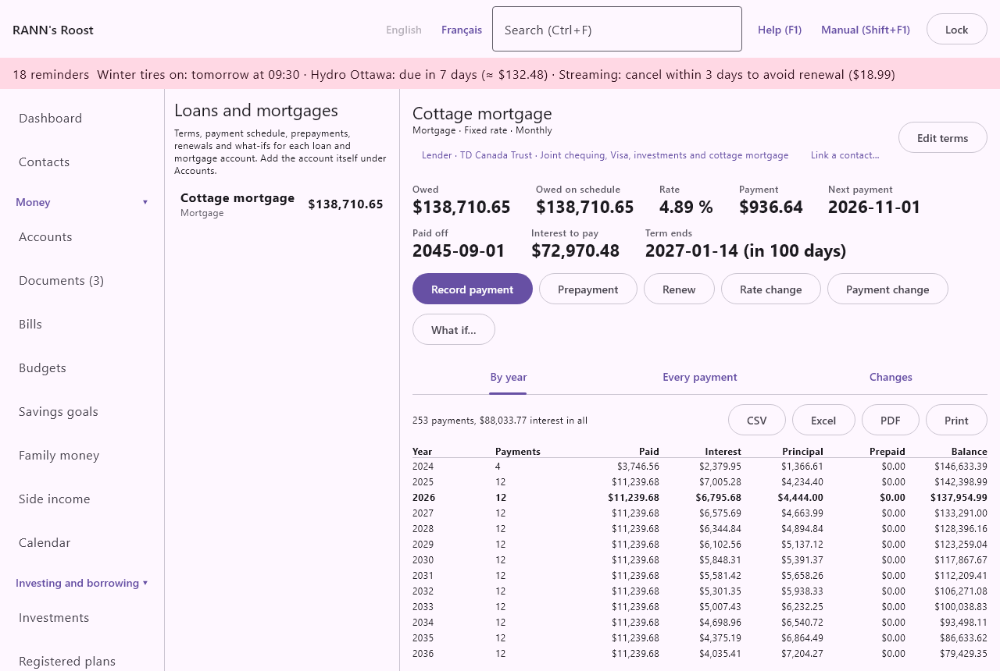

# Loans and mortgages

Loans and mortgages shows the terms of each loan and mortgage, its full payment schedule, what you owe against what was planned, and when it will be paid off. It records payments, prepayments, renewals, rate changes and payment changes, and lets you try what-ifs without changing anything. It is in the Investing and borrowing group of the menu.

> Note: The schedule is worked out from the terms you enter, the way Canadian lenders do. Your lender's statement has the final word; when they differ, adjust the terms or the payment to match it.

## The Loans and mortgages screen {#loans-screen}

@index: loan; mortgage; amortization; car loan; student loan; hypothèque

The left column lists every open loan and mortgage account you can see, under the headings **Loan** and **Balance**, with what you owe on the right. Under the name, the account type is shown, or "Terms not entered" in red for a loan whose terms are still missing. Click a loan to see it on the right. When you open this screen from a loan's register, that loan is shown first.

Lines of credit and credit cards are not listed here: they have no fixed schedule. They appear in the Debt summary report.

To change anything on this screen you need permission to edit the account group that holds the loan.

### Set up a loan account {#set-up-loan-account}

The loan itself is an account. Create it under [Accounts](accounts) with the type Loan or Mortgage, and what you owe as a negative opening balance on the date you start (for example -350,000.00 for a mortgage balance of $350,000). Then choose it here and click **Enter terms**.

> Tip: For a mortgage you have had for years, open the account at the start of the current term with the balance owed then, and enter the terms of that term. The schedule then matches the lender's statements from that date.

### The loan list {#loan-list}

- A loan without terms shows only **Enter terms** and the message that its terms are needed to see its schedule, next payment and payoff date.
- A loan with terms shows its summary, buttons and tabs, described below.
- The heading on the right shows the account name, its type, the rate type and the payment frequency, with **Enter terms** or **Edit terms**.

## A loan's summary {#loan-summary}

@index: balance owed; payoff date; interest remaining

- **Owed**: what you owe now, from the account's balance in the books: the opening balance plus every payment, prepayment and charge recorded.
- **Owed on schedule**: what you should owe today if every payment had been made as planned. A difference with Owed means a payment was missed, made early, or recorded with another amount.
- **Rate**: the annual rate in force, after any rate change or renewal.
- **Payment**: the regular payment in force, without property tax and insurance.
- **Total withdrawn**: shown when it differs from the payment: what leaves the bank account each time, with the extra principal, property tax and insurance.
- **Next payment**: the date of the next payment after the last one recorded.
- **Paid off**: when the loan will be paid off, projected from what you actually owe.
- **Interest to pay**: the interest still to pay until then.
- **Saved by prepayments**: shown once prepayments or extra payments are recorded: the interest they save compared with the loan without them, and how many months sooner it ends.
- **Term ends**: shown when a term end is entered: the renewal date, and in how many days (or how many days overdue).

### Loan buttons {#loan-buttons}

- **Record payment**: records the next payment. Available while something is owed. See [Record payment](loans#record-payment).
- **Prepayment**: records a lump sum paid off the principal. See [Prepayment](loans#prepayment).
- **Renew**: shown when the terms have a term end. See [Renew](loans#renew).
- **Rate change**: a new rate during the term. See [Rate change](loans#rate-change).
- **Payment change**: a new regular payment. See [Payment change](loans#payment-change).
- **What if…**: compares other choices with the loan as it stands. Available while something is owed. See [What if](loans#what-if).

Under the buttons are three tabs: **By year**, **Every payment** and **Changes**.

## Enter or edit the terms {#loan-terms}

@index: loan terms; interest rate; compounding; payment frequency; accelerated bi-weekly

Click **Enter terms** (or **Edit terms**). The window's first line reminds you how to enter a renewed mortgage. Changing the terms recalculates the whole schedule.

- **Principal**: the amount borrowed, or for a renewed mortgage the balance at the start of the current term. Starts with what you owe now. Required, more than zero.
- **Annual rate (%)**: the nominal yearly rate, for example 4.79. From 0 to less than 100.
- **Rate type**: Fixed rate or Variable rate. It is shown in the heading, and it sets the default of Recalculate the payment when you record a rate change.
- **Interest compounded**: Annually, Semi-annually (Canadian mortgages) or Monthly. Canadian fixed-rate mortgages compound semi-annually by law, and that is the default for a mortgage; Monthly is the default for other loans. Many variable-rate mortgages compound monthly: check your agreement. It changes how much of each payment is interest.
- **Amortization (years)** and **and months**: the time to repay the loan in full, 25 years and 0 months by default. For a renewed mortgage, the amortization left at the start of the term. From 1 month to 50 years.
- **Payment frequency**: Monthly, Twice a month, Every two weeks, Accelerated, every two weeks, Weekly or Accelerated weekly. Accelerated payments are the monthly payment divided by 2 every two weeks, or by 4 every week: you pay the equivalent of one extra monthly payment a year, and the loan ends sooner than its amortization.
- **First payment**: the date of the first payment (for a renewed mortgage, the first payment of the current term). Required. Monthly payments keep that day of the month (shortened in short months); twice-a-month payments fall 15 days apart.
- **Lender's payment (if known)**: the payment on your agreement. Under the field, "Calculated:" shows the payment worked out from the terms as you type. If you enter the lender's payment, the schedule uses it; leave it empty to use the calculated one. Lenders round differently, so entering theirs keeps the schedule closest to their statements.
- **Extra principal each payment**: an amount added to every payment that goes entirely to the principal. It shortens the loan and is counted in Saved by prepayments.
- **Term ends (renewal date)**: for a mortgage, the end of the current term. It shows the Term ends figure, enables **Renew**, and gives a renewal reminder.
- **Remind days before**: how long before the term end the reminder starts, 120 days by default (set in [Rates and rules](rates-rules)), from 0 to 365. The reminder appears at least 30 days before in any case (the renewal lead time).
- **Property tax** and **Insurance**: under "Property tax and insurance collected with each payment, if any": the amounts your lender collects with each payment, per payment. They are added to Total withdrawn and charged to their categories when you record a payment.
- **Paid from**: the bank or credit account the payments usually come from, in the loan's currency, or (none). It is the account chosen first when you record a payment or a prepayment.
- **Notes**: free text, such as the lender's contact or the prepayment privileges of your mortgage.

Click **Save** or **Cancel**.

### How the payment is worked out {#payment-calculation}

The rate is turned into a rate per payment that matches the compounding (for a mortgage compounded semi-annually and paid monthly, a little less than the yearly rate divided by 12). The level payment that repays the principal over the amortization at that rate is then rounded to the cent. Interest on each payment is the balance times that rate, rounded to the cent as lenders do; the rest of the payment reduces the balance; the last payment clears what is left.

## Record payment {#record-payment}

@index: mortgage payment; loan payment; interest and principal

Click **Record payment** to record the next payment. The window suggests the date and split from what you actually owe:

- **Paid from**: the bank or credit account the payment leaves, in the loan's currency. Starts with the Paid from account of the terms. Required.
- **Date**: the payment date. Starts with the next payment due after the last one recorded.
- **Principal**: the part that reduces what you owe, including any extra principal.
- **Interest**: worked out from the balance actually owed at the rate per payment. Change it to match the lender's statement if needed.
- **Property tax** and **Insurance**: shown when the terms have them, filled in with their amounts.
- **Total**: the sum, as it will leave the bank account.

Click **Save**. The whole amount moves from the paying account to the loan as one transfer, which matches your bank statement. The interest, property tax and insurance are then charged to the loan under their categories (Mortgage interest, Municipal taxes and Home insurance for a mortgage; Interest charges and Life insurance for other loans), so only the principal reduces what you owe and the costs appear in your reports and budgets. The next suggestion then moves to the following payment.

> Tip: If your payments are already imported from the bank as transfers to the loan, you do not need Record payment for them; Owed follows the account's balance either way.

## Prepayment {#prepayment}

@index: lump sum; prepayment privilege; anniversary payment

A lump sum paid off the principal, outside the regular payments.

- **Date**: when it was paid. Today by default. In the schedule it is applied with the first payment on or after this date.
- **Amount**: more than zero.
- **Paid from**: the account the money came from, to move the money too; or "(already in the register)" when the payment is already recorded there, so only the schedule is changed.
- **Note**: free text.

Click **Save**. The prepayment appears in the Changes tab and in the schedule, and Saved by prepayments shows the interest it saves.

## Renew {#renew}

@index: mortgage renewal; term; new rate

**Renew** is shown when the terms have a term end. At renewal the new rate applies from the renewal date, and the payment is recalculated so the loan is still repaid over the remaining amortization.

- **Renewal date**: starts with the current term end.
- **Annual rate (%)**: the new rate; starts with the rate in force.
- **New term ends**: the end of the new term; starts five years after the current term end. It must be after the renewal date; leave it empty if there is no fixed term.
- **Note**: free text.

Click **Save**. The renewal is recorded as a rate change with the payment recalculated, shown as Renewal in the list of changes, and the term end is replaced by the new one, which moves the renewal reminder. The renewal keeps the term end it replaced, so deleting it puts that date back.

## Rate change {#rate-change}

@index: prime rate; variable rate change

A new rate during the term, for example when the Bank of Canada changes its rate and your variable rate follows.

- **From**: the date the new rate applies, today by default. Payments after it use the new rate.
- **Annual rate (%)**: the new rate; starts with the rate in force.
- **Recalculate the payment**: ticked, the payment is recalculated to repay the balance over the remaining amortization, as most fixed-rate loans do. Unticked, the payment stays the same and the loan takes longer (or shorter) to repay, as most variable-rate mortgages do. Ticked by default for a fixed rate, unticked for a variable rate.
- **Note**: free text.

Click **Save**. If, with the payment kept, it no longer covers the interest, the change is refused: "With this payment the loan would never be repaid".

## Payment change {#payment-change}

A new regular payment, for example after asking the lender to increase it.

- **From**: the date of the first payment at the new amount; starts with the next payment.
- **New payment**: the new regular payment; starts with the current one. More than zero.
- **Note**: free text.

Click **Save**. A payment too small to cover the interest is refused.

## Payment schedule {#schedule}

@index: amortization schedule; amortization table

The **By year** and **Every payment** tabs show the schedule as planned today: the terms with every change recorded. Above the table, a line gives the number of payments and the total interest. The table opens at the current year or the next payment, which is in bold; past payments are dimmed.

### By year {#by-year}

One line per calendar year: **Year**, **Payments** (how many), **Paid**, **Interest**, **Principal**, **Prepaid** and **Balance** at the end of the year. Useful for the mortgage interest of a year, for example for a rental property or a home office.

### Every payment {#every-payment}

One line per payment: **#**, **Date**, **Paid**, **Interest**, **Principal**, **Prepaid** and **Balance** after the payment.

### Export and print {#schedule-export}

The **CSV**, **Excel** and **PDF** buttons save the table shown to a file; **Print** prints it. The title is "Payment schedule" with the loan's name, and the subtitle the date it was planned on.

## Changes tab {#changes-tab}

The prepayments, rate changes, renewals and payment changes recorded, newest first, under the headings **Date**, **Change**, **Details**, **Notes** and **Actions**: the date, the kind, the amount or the new rate (with "payment recalculated" or "same payment"), and the note.

**Delete** beside a change removes it at once, and the schedule is recalculated. Deleting a prepayment does not remove the money moved for it: delete that transfer in the register if needed (a line under the list reminds you). Deleting the latest renewal puts back the term end it replaced, and the renewal reminder with it; deleting an older renewal or a rate change leaves the term end as it is. Renewals recorded before this version of the app did not keep the earlier term end: after deleting one of those, change the term end with **Edit terms** if needed.

## What if {#what-if}

@index: what-if; scenario; extra payment; pay off faster

**What if…** compares the loan as it stands with the same loan after the changes you type. It starts from what you owe today. Nothing in your books changes.

- **Extra each payment**: an amount added to every payment.
- **Lump sum now**: a prepayment made now.
- **Other rate (%)**: another annual rate, for example the rate offered at renewal.
- **Years to repay**: another remaining amortization, in years; decimals are allowed (12.5).

Leave a field empty to keep what the loan has now. Until you type something, the window asks you to. The comparison then shows, under **Now** and **With these changes**: **Payment**, **Paid off**, **Payments** (how many are left) and **Interest to pay**. The last line says how much interest the changes save and how many months sooner the loan ends, or, in red, how much more they cost. A value that cannot work (a rate out of range, a payment that would never repay the loan) shows a message instead. Click **Close** when done.

## Renewal reminders {#renewal-reminders}

@index: renewal reminder

When a loan has a term end, a reminder appears with the other reminders, and as a system notification, from the number of days set in Remind days before (at least 30 days before), until the term is renewed. Clicking it opens this screen.

## Debt summary report {#debt-report}

@index: debt summary

The Debt summary report under [Reports](reports) lists every debt, largest first, with its rate, payment, payoff date and interest left when terms are entered here, and the term end.

## Contacts {#linked-contacts}

@index: contact; linked contact; Link a contact

Under the name of the loan or mortgage, the screen shows its contacts, such as Lender · Desjardins, and **Link a contact…** to add the lender, a mortgage broker or an advisor.

Click a contact to open its page in [Contacts](contacts); **Remove link** takes the link away, and **Link a contact…** picks one, in its role, or creates a **New contact…** and links it. See [Contacts on other screens](contacts#on-other-screens).
