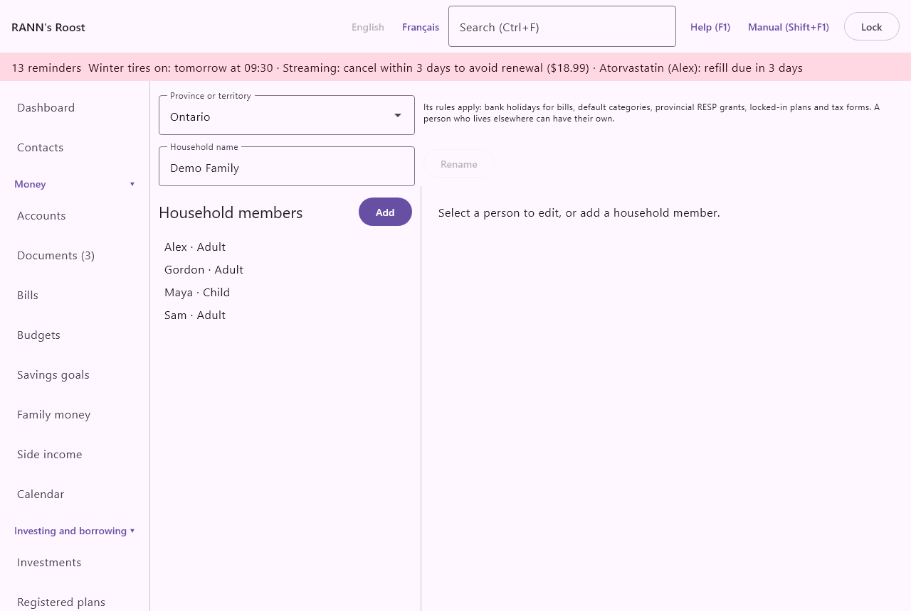

# Household members

Household members are the people your records are about: the adults, the children and anyone else who depends on the household. Accounts belong to them, expenses and medical claims are theirs, registered plans are held for them and tax slips are issued to them. The screen is the first item of the **Settings** group of the menu, under the name **Household members**.

## What a household member is {#about-members}

@index: person; people; family member; spouse; partner; child; dependant

A household member is a person, not a sign-in account. A child can be a member without ever using the app, and a grandparent you help can be a member too.

- A member is someone records are about: whose account, whose prescription, whose RRSP room, whose T4.
- A user is someone who signs in with a login name and password. Users are set up on the [Users](users) screen.
- An adult who signs in is usually both: a member, and a user linked to that member. See [Members and users](members#members-and-users).

> Tip: Add every person first, before the accounts. The account form asks who owns each account, and registered plans, medical claims and tax slips all need the person to exist.

## The Household members screen {#screen}

The screen has three parts:

- At the top, the household's **Province or territory**, with a short note on what it changes.
- On the left, the list of people, with an **Add** button above it for administrators.
- On the right, the form for the person selected, or for a new person.

### Province or territory {#province}

@index: province; territory; Quebec; Ontario; provincial rules; bank holidays

- **Province or territory**: the province or territory the household lives in. It is chosen when the household is created, and can be changed here at any time. Its rules apply to everyone in the household who does not have their own province (see **Lives in** below).

What the province changes:

- Bank holidays for bills: when a bill falls on a weekend or a provincial bank holiday, the business-day rules use this province's holidays. See [Bills](bills).
- Default categories: some default categories exist only in some provinces (for example the Quebec Family Allowance, or Employment Insurance outside Quebec). When you change the province, the default categories meant for the new province are added. Categories already there are never removed. See [Categories](categories).
- Provincial RESP grants: the provincial grant on a child's RESP depends on where the child lives. See [Registered plans](plans).
- Locked-in plans: the provincial rules for a LIF or locked-in account follow the holder's province. See [Registered plans](plans).
- Tax forms: for example, whether Quebec slips such as the RL-24 are expected, and how the tax package presents the year. See [Taxes](taxes).

Only an administrator can change the province. For other users the picker is shown but cannot be changed.

> Note: The change takes effect as soon as you pick a new province. There is no Save button for it. Changing it again later is safe: nothing is deleted.

### The list of people {#list}

Each line shows the person's name, their relationship (Adult, Child or Other dependant) and, when they have their own province, that province. The list is in alphabetical order. People who are archived come after the others, greyed out; they stay in the list so you can bring them back.

Click a person to open their form on the right. When nobody is selected, the right side says "Select a person to edit, or add a household member."

## Add a person {#add-person}

1. Click **Add** above the list.
2. Type the **Name**.
3. Choose the **Relationship**.
4. If you know it, type the **Date of birth (YYYY-MM-DD)**.
5. Leave **Lives in** at **Same as the household**, or choose the person's own province.
6. Click **Save**.

The new person appears in the list and stays selected.

### The person form {#person-fields}

- **Name**: the name shown everywhere the person can be chosen: account owners, transactions, medical claims, registered plans, tax slips, the phone. Required. Use what the family calls the person, such as Alex or Grandma.
- **Relationship**: Adult, Child or Other dependant. The default for a new person is Adult.
  - Adult: someone who can own accounts, hold a pension and have their own RRSP and TFSA room.
  - Child: a child of the household. Children are left out of the lists that only make sense for adults, such as contribution room (TFSA, RRSP) and pensions, and they can be RESP beneficiaries.
  - Other dependant: another person the household supports, such as a parent or an adult child with a disability. For the medical expense credit, the expenses of an other dependant are claimed on their own line (line 33199 of the federal return, for other dependants), not with those of the couple and their children. See [Medical claims](medical).
- **Date of birth (YYYY-MM-DD)**: optional, but several calculations need it. Type it as year, month and day, for example 2015-06-12. The field turns red while the text is not a valid date. Once a date is there, typing + or - moves it one day forward or back. It is used for:
  - TFSA room when no CRA figure has been entered: the room is counted from the year the person turned 18 (or 2009).
  - The RRIF minimum withdrawal, which depends on the holder's age on January 1.
  - The warning to convert an RRSP in the year the owner reaches the last age for an RRSP.
  - RESP grants that depend on the child's age, such as the British Columbia grant. The RESP screen warns when a beneficiary has no date of birth.
  - If the date is not a real date, the app says "Enter the date as YYYY-MM-DD." and nothing is saved.
- **Lives in**: the province or territory whose rules apply to this person. **Same as the household** (the default) means the household's province. Choose another one for someone who lives elsewhere, such as a student away at school or a parent in another province. The person's own province is used for their tax slips and tax package, their medical expense credit, their provincial RESP grant and their locked-in plans.
- **Archived (hidden from lists)**: shown only for a person already saved. Tick it for someone who is no longer part of the household. See [Archive a person](members#archive-person).
- **Save**: saves the person. Nothing is saved until you click it.

## Change a person {#change-person}

1. Click the person in the list.
2. Change any field.
3. Click **Save**.

Changes apply everywhere at once: a new name shows on every screen, on reports and on the phone at its next update. A changed date of birth or province changes the calculations that use them from then on, for past years too, since they are worked out when you look at them.

## Archive a person {#archive-person}

@index: remove a person; delete a person; hide a person

There is no delete button for people: past records about them must keep their name. Instead:

1. Click the person in the list.
2. Tick **Archived (hidden from lists)**.
3. Click **Save**.

An archived person is no longer offered when you pick a person for new records, and is no longer sent to the phone. Their accounts, transactions, claims and slips keep showing their name. To bring them back, clear the box and click **Save**.

## Where household members are used {#where-used}

The people you add here appear across the app:

- [Accounts](accounts): the owners of each account, which decide whose RRSP or TFSA it is and whose slips it produces.
- Transactions: a transaction, or one split of it, can be for a person, which feeds reports by person and the tax package.
- [Medical claims](medical) and [Health](health): whose expense or record it is, and who claims the medical expense credit.
- [Registered plans](plans): contribution room for adults and other dependants, RESP beneficiaries, pensions for adults.
- [Taxes](taxes): expected slips, donations and the year-end package are grouped by person.
- [Family money](family): allowances, shared expenses and family loans.
- [Emergency and estate](estate), [Vehicles](vehicles), [Home and assets](assets) and [Pets](pets): beneficiaries, drivers, owners.
- [Reports](reports): custom reports can be grouped or filtered by person.
- The phone: the people list on RANN's Roost Mobile, to say whose receipt it is. See [Phones](phones).

## Members and users {#members-and-users}

@index: link user to member; this user is the household member

A user who signs in can be linked to the person they are: on the [Users](users) screen, **This user is the household member**. The link tells the app who "you" are. For example, wallets created when you import a crypto exchange file are owned by the person linked to your user.

Linking is optional, and a member never needs a user. Archiving a member does not stop a linked user from signing in; that is done on the Users screen.

## Who can change household members {#permissions}

Only an administrator can add, change or archive household members and change the household's province. Other users can see the list and open each person's form, but its fields are greyed out, there is no **Add** or **Save** button, and the form says "Only an administrator can add or change household members."

Every change is recorded in the activity log on the [Users](users) screen.
