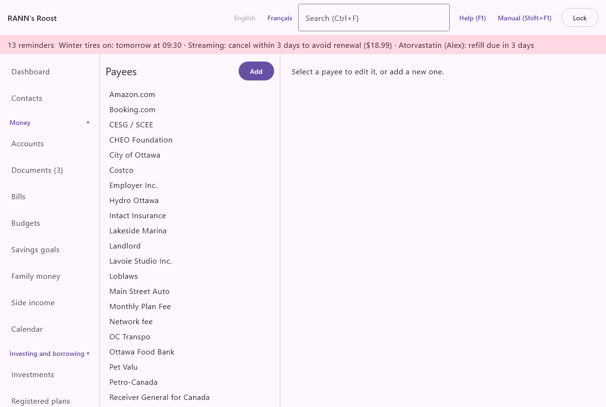

# Payees

Payees are the people and businesses money goes to or comes from: the grocery store, Hydro-Québec, your employer, the landlord. A clean list of payees makes transactions easy to read, search and report on, and lets the app suggest the right category. The screen is in the **Settings** group of the menu, under **Payees**.

## How payees work {#about-payees}

@index: merchant; vendor; store; supplier; payer

- Every transaction can have a payee. When you type a payee name in a transaction that does not match an existing payee, a new payee is created with that name. Most payees are therefore created for you; this screen is for tidying them.
- When a statement is imported, banks often print names in a short or odd form, such as AMZN MKTP CA*2X4 or COSTCO WHOLESALE W512. The app looks for a payee whose alias is in that text; if none matches, it uses a tidier version of the bank's text (store numbers removed, capitals softened: "Costco Wholesale"). The bank's original text is kept on the transaction.
- A payee can have a default category, used when the app has nothing better to go on.

## The Payees screen {#screen}

The left side lists the payees in alphabetical order, with **Add** above the list. Archived payees are greyed out. The right side shows the form for the payee selected, or for a new one. When nothing is selected, it says "Select a payee to edit it, or add a new one."

## Add a payee {#add-payee}

1. Click **Add**.
2. Type the **Payee name**.
3. Pick a **Default category** if you want one.
4. Click **Save**.

Aliases can be added once the payee is saved.

### The payee form {#payee-fields}

- **Payee name**: the clean name shown on transactions, such as Amazon or Hydro-Québec. Required. Typing this name in a transaction, in capitals or not, picks this payee.
- **Default category**: (none), or a category from the tree. Archived categories are not offered. It is used:
  - When you enter a transaction for this payee and it has never been used before in that account group: the category is filled in for you. Once the payee has transactions, the register fills in the amount and category of the most recent one instead.
  - When a statement line is imported and no [category rule](rules) matches: the payee's default category comes next, before the category of the payee's last transaction.
  - When a transaction is made from a receipt or bill in [Documents](documents).
  - On the phone, which receives each payee with its default category.
- **Archived (hidden from lists)**: shown for a payee already saved. See [Archive a payee](payees#archive-payee).
- **Aliases**: shown for a payee already saved: the payee's aliases in alphabetical order, or "No alias yet." Below them, **Alias** and **Add alias** add one. See [Aliases](payees#aliases).
- **Save**: saves the name, default category and archived box. Nothing is saved until you click it.

## Aliases {#aliases}

@index: alias; statement name; bank description; payee matching; rename imported payees

An alias is a piece of text that identifies this payee on statements, such as AMZN MKTP for Amazon or HYDRO-QUE for Hydro-Québec.

1. Select the payee in the list.
2. Type the text in **Alias**.
3. Click **Add alias**. The field empties when the alias is saved, and the alias joins the list above it.

How aliases are matched:

- An alias matches when the bank's text contains it anywhere, ignoring capitals. AMZN matches "AMZN MKTP CA*2X4" and "amzn.com/bill".
- When several aliases match, the longest one wins, so a precise alias beats a general one.
- When no alias matches, a payee whose name is exactly the text, ignoring capitals, is used.
- A payee can have as many aliases as you need. Add one alias for each way the name appears on your statements.

Aliases apply to statement lines imported from then on and to names you type. They do not rename transactions already in the books.

> Note: An alias cannot be removed once added. Choose aliases with care: an alias that is too short, such as "CA", would match far too much.

Administrators and members can add payees, change them and add aliases. Viewers see the list, the forms and the aliases greyed out, with the note "As a viewer, you can see this list but not change it."

> Tip: Aliases give the right name; [Category rules](rules) give the right category. When one store sells very different things, use a rule with amount limits rather than a default category.

## Change a payee {#change-payee}

1. Click the payee in the list.
2. Change the **Payee name** or the **Default category**.
3. Click **Save**.

A new name shows on every transaction filed under this payee, past ones included. There is no way to merge two payees: give the one you keep the other's aliases, and archive the other.

## Archive a payee {#archive-payee}

@index: delete a payee; hide a payee; remove a payee

There is no delete button for payees. To stop seeing one:

1. Click it in the list.
2. Tick **Archived (hidden from lists)**.
3. Click **Save**.

Past transactions keep their payee. An archived payee is no longer sent to the phone. Its aliases still work when statements are imported, so an archived payee can still be picked by an import.

## Where payees are used {#where-used}

- The register of each account: the payee of each transaction, with the amount and category of its last transaction suggested. See [Accounts](accounts).
- Statement imports: aliases give the clean name, and the default category the category when no rule matches.
- [Documents](documents): the merchant read on a receipt becomes the payee of the new transaction.
- [Reports](reports) and search: transactions can be found and grouped by payee.
- The phone: up to 400 payees, with their default categories, to choose from when capturing a receipt. See [Phones](phones).

## Contacts {#linked-contacts}

@index: contact; linked contact; Link a contact

The form of a saved payee ends with Contacts: the contact for this payee, such as the company behind a bill, with its phones and what it is for.

Click a contact to open its page in [Contacts](contacts); **Remove link** takes the link away, and **Link a contact…** picks one, in its role, or creates a **New contact…** and links it. See [Contacts on other screens](contacts#on-other-screens).
