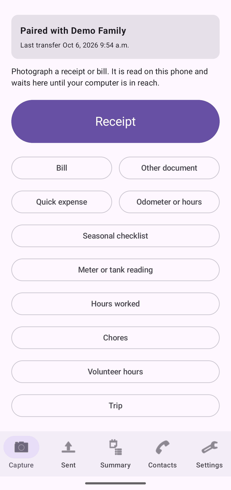
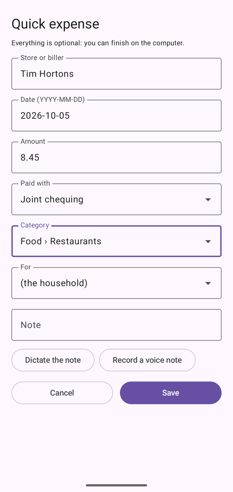
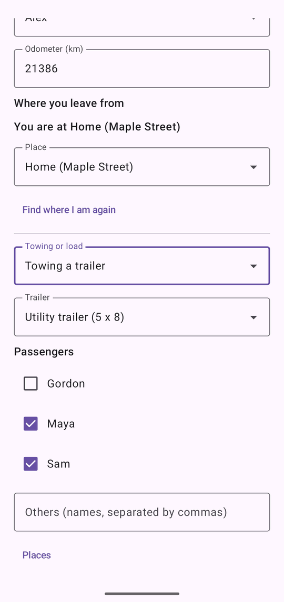
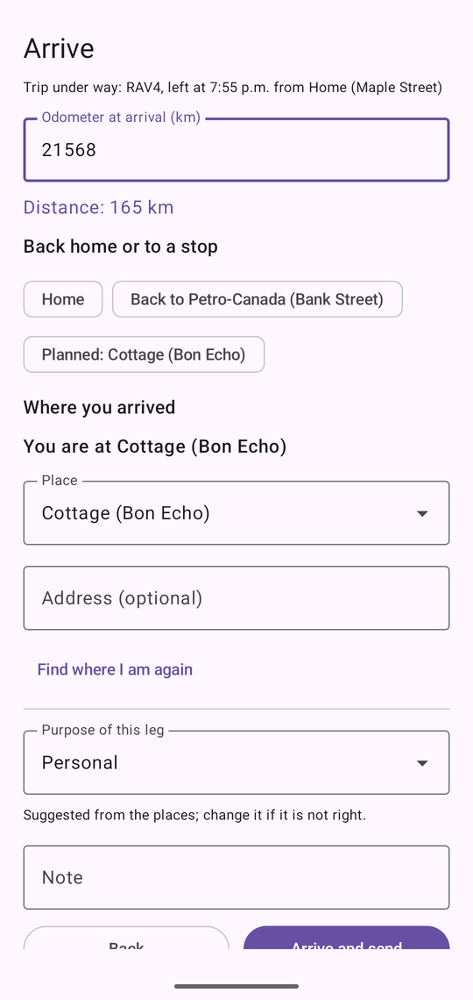
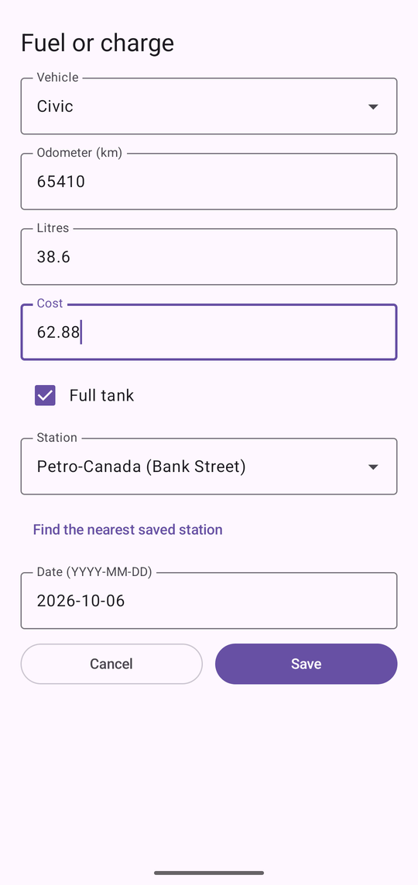
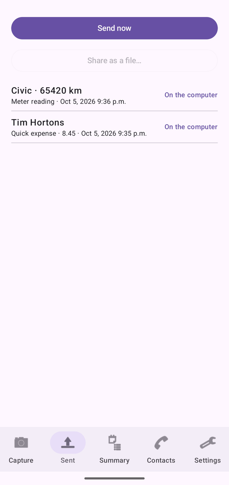
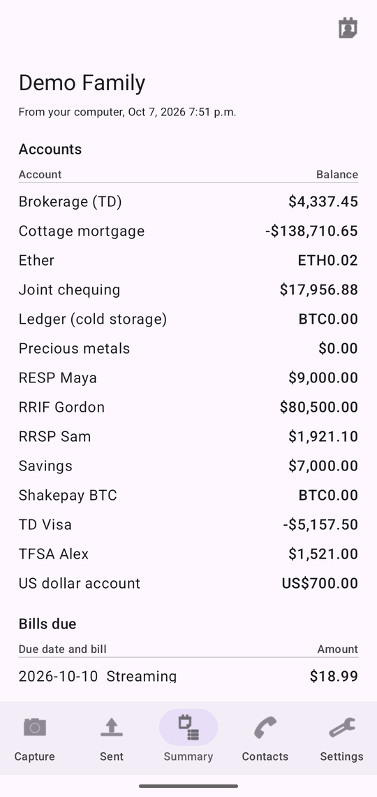
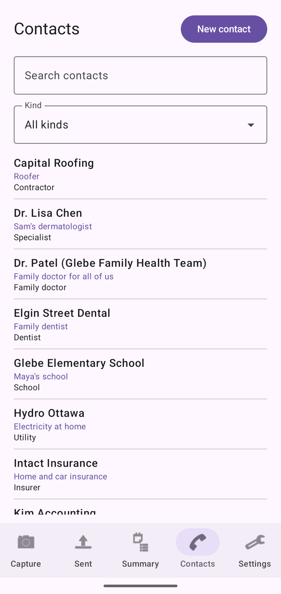
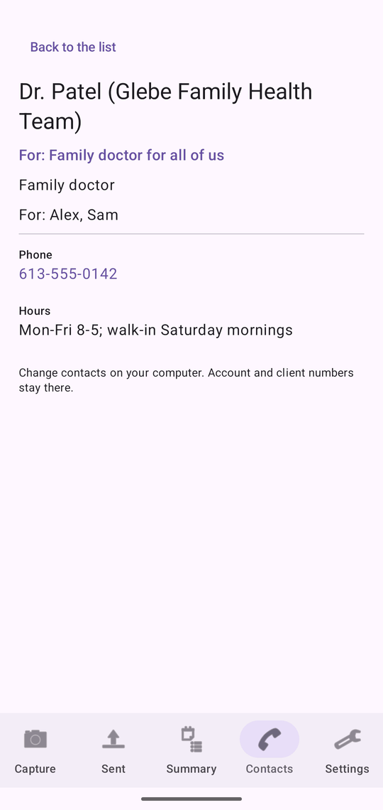

# RANN's Roost Mobile

RANN's Roost Mobile is the companion app for Android phones. It photographs receipts, bills and other documents, records quick expenses, odometer readings, trips, fill-ups and charges, and sends them to RANN's Roost on your computer. In return it shows a summary of your balances, bills due, coming appointments, medication refills, budgets and maintenance and the household's contacts, and reminds you of bills, appointments, refills and budgets. Contacts you meet while out can be added on the phone and sent to the computer for review.

The phone is not a second copy of your books: the computer is the master copy. The phone keeps only what is waiting to be sent and the latest summary and contacts from the computer. Under its icon, the app is called RANN's Roost.

For a short walk-through, see [Getting started with the phone app](start-phone). For the computer side, see [Phones](phones).

@index: Android; mobile app; phone app; companion app; capture; scan receipts; RANN's Roost Mobile

## Two editions {#editions}

@index: Google Play; GitHub; APK

RANN's Roost Mobile comes in two editions that work the same way:

- The Google Play edition, kept up to date by Google Play.
- The GitHub edition, installed from RANN's releases on GitHub. It can check for updates itself and install them after checking RANN's signature (see [Updates](#updates)). Android may ask you to allow RANN's Roost Mobile to install apps the first time.

## Privacy on the phone {#privacy}

@index: encryption; Android Keystore; backup; privacy

- Everything the app keeps (its settings, the captures and new contacts waiting to be sent, the summary and the contacts) is encrypted with a key kept in the phone's secure key store. The key never leaves the phone.
- The app is excluded from Android's cloud backups, so none of it is copied to Google.
- Captures go only to your computer, encrypted with the key made when you paired. Away from home, they may go through a folder of your own cloud storage, still encrypted.
- Calendars are read only if you turn on [Calendars on this phone](phone-app#phone-calendars), only those you tick, and they go only to your computer, encrypted the same way.
- The only other connection is the daily update check of the GitHub edition, if you allow it. It sends nothing about you or your household.
- Location: only if you allow it, the app takes one location fix when you start a trip, when you arrive, and when you save a place or look for the nearest station, never in the background and never at other times. The fix is matched to your saved places on the phone itself; no map service is asked. What travels to your computer, encrypted like the rest, is the place's name, or the coordinates when you leave a place unnamed, and the coordinates of a place you save. See [Location](#location).
- Once your computer confirms it received a capture, the phone deletes its copy of the pictures and details.

## The lock {#lock}

@index: PIN; NIP; fingerprint; face unlock; biometrics; lock

The app is locked by a PIN, and optionally by your fingerprint or face, so receipts and balances stay private even when someone else has your phone.

### Choose a PIN {#choose-pin}

The first time you open the app, it asks you to **Choose a PIN to lock this app**: 4 to 8 digits. Type it and tap **OK**, then **Enter the PIN again** and tap **OK**. If the two are different, the app says so and you start again.

The PIN is not stored on the phone, only a scrambled check of it. A forgotten PIN cannot be recovered: the app can only start over, erasing what it keeps (see [Forgot your PIN](phone-app#forgot-pin)). Choose one you will remember.

### Unlock the app {#unlock}

- **Enter your PIN**, then **OK**. A wrong PIN shows **Wrong PIN** and clears the box.
- **Use fingerprint or face**: shown when the phone supports it and **Unlock with fingerprint or face** is on in Settings. Android's own prompt appears; **Cancel** returns to the PIN.

The app locks again when you come back to it after more than a minute away.

- **Forgot your PIN?**: see [Forgot your PIN](phone-app#forgot-pin).

### Forgot your PIN {#forgot-pin}

@index: forgotten PIN; reset PIN; lost PIN; erase the app

A forgotten PIN cannot be recovered, by you or by the computer. To use the app again, it starts over:

1. On the lock screen, tap **Forgot your PIN?**.
2. Read the warning **Erase this app's data?**. It explains what is erased.
3. Tap **Erase and start over**, or **Cancel** to keep everything and try your PIN again.
4. The app asks you to choose a new PIN, as the first time.
5. Pair the phone with the computer again. See [Pair a phone](phones#pair).

What is erased, on this phone only: captures not yet sent to the computer (photos, receipts, notes, odometer readings), the list of what was sent, the pairing with the computer, the summary received from it, and every setting, including fingerprint unlock and the transfer folder. It cannot be undone.

What stays: everything the computer already received, and the household on the computer. The old pairing can no longer send anything; remove it from the list on the computer's **Phones** screen. See [The list of phones](phones#phone-list).

> Tip: Captures not yet sent cannot be sent without the PIN. Once the phone is paired again, capture them again.

## The first start {#first-start}

- On Android 13 and later, the app asks whether it may show notifications. Allow it to get bill, appointment, refill, budget and maintenance reminders.
- The GitHub edition asks **Check for updates?** once: **Check once a day** or **Don't check**. You can change it later in [Settings](#updates).
- Until the phone is paired, the Capture and Settings tabs show **Not paired yet** and a **Pair with a computer** button.

## The main tabs {#tabs}

Five tabs run along the bottom of the screen:

- **Capture**: photograph or record something new. See [The Capture tab](#capture-tab).
- **Sent**: what you captured and how far it got. See [The Sent tab](#sent-tab).
- **Summary**: balances, bills, maintenance and budgets from your computer. See [The Summary tab](#summary-tab).
- **Contacts**: the household's contacts from your computer, and new contacts to send. See [The Contacts tab](#contacts-tab).
- **Settings**: pairing, the transfer folder, the lock and updates. See [The Settings tab](#settings-tab).

When a newer version is available (GitHub edition), a band at the top of the other tabs says so; tap it to go to Settings.

## Pair with a computer {#pair-screen}

@index: pair; pairing; QR code; scan code; pairing text

Pairing connects this phone to RANN's Roost on your computer. Do it once, at home, on the same Wi-Fi as the computer.

1. On the computer, open the household, go to **Phones** and click **Pair a phone**. A QR code appears.
2. On the phone, tap **Pair with a computer** (on the Capture or Settings tab).
3. Tap **Scan the code** and point the camera at the QR code.

The screen says **Pairing…**, then the app returns to the Capture tab, shows **Paired with** and your household's name, and sends right away anything already waiting.

Other ways to pair:

- Scan the QR code with the phone's own camera app: it opens RANN's Roost Mobile and pairs (after you unlock the app).
- **Or paste the pairing text**: when the camera cannot read the screen, click **Copy as text** on the computer, get the text to the phone, paste it here and tap **OK**.

**Cancel** returns to the tabs without pairing.

Messages:

- **This is not a pairing code from RANN's Roost.**: the code or text is not a pairing code.
- **Cannot reach the computer.**: check that both are on the same Wi-Fi, that the household is open on the computer, and that Windows allows RANN's Roost on private networks.
- **The computer refused.**: the code may have expired (each lasts 10 minutes by default and works once). Show a new one on the computer.

The phone is paired to the user signed in on the computer at that moment. Pairing again, to the same or another computer, replaces the earlier pairing.

## The Capture tab {#capture-tab}

At the top, a card shows the pairing: **Paired with** your household and **Last transfer** with its date and time (or **Nothing sent yet**), or **Not paired yet** with a **Pair with a computer** button. You can capture before pairing: everything waits on the phone.

The buttons:

- **Receipt**: scan a receipt.
- **Bill**: scan a bill or statement.
- **Other document**: scan anything else to keep, such as a warranty or a letter.
- **Quick expense**: record a purchase without a photo.
- **Odometer or hours**: record a vehicle's odometer or an equipment's hours of use.
- **Seasonal checklist**: the season's tasks from the computer, to tick off where they are done. See [Seasonal checklist on the phone](phone-app#seasonal-form).
- **Meter or tank reading**, **Hours worked**, **Chores** and **Volunteer hours**: the [log forms](#log-forms).
- **Trip**: start a trip, or arrive when one is under way. While a trip is under way, a line under the button says so, such as "Trip under way: RAV4, left at 4:30 PM from Home (Maple Street)". See [Trip](#trip-form).
- **Fuel or charge**: record a fill-up or a charge. See [Fuel or charge](#fuel-form).

The kind you choose decides how the capture is filed on the computer: a bill as a bill, a receipt or quick expense as a receipt, another document as whatever the computer reads it to be.

### Scanning {#scanning}

@index: document scanner; multi-page; camera; crop

**Receipt**, **Bill** and **Other document** open Android's document scanner. It finds the edges of the page, crops and straightens it. You can:

- take up to 10 pages for one document (a long receipt, a bill with several pages);
- retake or adjust a page before finishing;
- import a picture from the phone's gallery instead of taking one.

When you finish, the [capture form](#capture-form) opens. Backing out of the scanner captures nothing.

Pages are sent as pictures no larger than 2,400 pixels on their longest side, which keeps them readable and the transfers small. Several pages become one PDF on the computer.

### Sharing from other apps {#share-into}

@index: share; e-receipt; PDF receipt; e-bill

In another app (email, a store's app, your files, the photo gallery), use **Share** and choose RANN's Roost Mobile to send it:

- a PDF, such as an e-receipt or an e-bill, is kept as it is;
- one or more pictures become the pages of one document, as a scan of several pages does;
- text, such as an email shared from your mail app, is kept as a text document named after the email's subject. A text file is kept the same way.

After you unlock the app, the capture form opens as a **Document** capture, with the file's name kept. Shared pictures are read like scanned pages; a PDF is not read on the phone, and the computer reads it instead. Shared text is shown at the top of the form under **Shared text**, and the phone fills in the store, date and amount it finds in it. Save it as usual. On the computer the text is the document, and what you typed in **Note** stays a note.

### Several files at once {#share-several}

@index: share several files; several PDFs

You can select several files in another app and share them together. Pictures are gathered into one document, since they are usually the pages of one receipt or letter. Each PDF and each text file is already a whole document, so each becomes its own capture. The forms then come one after another, each showing its place, such as **1 of 3**: save or cancel each one, and the next opens. After the last, the Sent tab opens.

Files of other kinds (a video, a spreadsheet) are left out, and a message says how many could not be used.

## The capture form {#capture-form}

The form's title is the kind of capture. With several pages it shows how many. For scanned pages, **Reading the document…** shows while the phone reads the first page; it then fills in the store, the date and the total it found, which you can correct. The text is read on the phone itself, in English and French, and goes to the computer with the capture.

**Everything is optional: you can finish on the computer.**

- **Store or biller**: the store, restaurant or company. Filled in from the reading. On the computer it becomes the document's merchant, and in the Sent list it is the capture's name.
- **Date (YYYY-MM-DD)**: the date on the receipt or bill, such as 2026-10-05. Filled in from the reading; today for a quick expense. A date the computer cannot read is ignored and the read date is kept.
- **Amount**: the total, such as 42.17 or 42,17 (a dollar sign is ignored). It is rounded to the cent. Anything that is not a number is left out, and the computer uses what it read.
- **Paid with**: an account from your computer, or **(none)**. On the computer it becomes the account offered first when a transaction is created from the capture.
- **Category**: a spending category from your computer, shown under its parent such as "Food › Groceries", or **(none)**. On the computer it becomes the category offered first for that transaction.
- **For**: a member of the household or a pet, or **(the household)**. On the computer it becomes the person or pet offered first for that transaction.
- **Note**: anything to remember, such as "Lunch with client" or "Return by Nov. 3". On the computer it becomes the document's notes.

**Paid with**, **Category** and **For** appear once the phone has received a summary from the computer, after the first transfer. They are sent with the capture and kept with the document on the computer. When you review it there and choose **New transaction from this document**, the form starts with them; you can still change them. See [New transaction from this document](documents#new-transaction).

The buttons:

- **Cancel**: closes the form; nothing is kept.
- **Save**: puts the capture in the queue and tries to send it at once. The app goes to the **Sent** tab.

The values you type win over what the phone or the computer read.

### Voice notes {#voice-note}

@index: dictation; voice note; speech

Under **Note**:

- **Dictate the note**: speak and Android types your words into the note, in Canadian English or French following the phone's language. Each dictation is added to the end of the note.
- **Record a voice note**: records your voice, up to a minute; the first time, Android asks to allow the microphone. **Recording… (up to a minute)** shows while it records. Tap **Stop recording** to finish; at one minute the recording stops by itself and the minute is kept. It then shows **Voice note kept** and its length, with **Delete** to discard it and record again.

A recorded voice note is sent with the capture and kept with its document on the computer, where you can play it while reviewing. The microphone is used only while you record.

### Quick expense {#quick-expense}

@index: cash purchase; expense without receipt

**Quick expense** opens the same form with no pages and today's date. Use it for a cash purchase or anything without a receipt. On the computer it becomes a short text document with the store, date, amount and note, waiting on the **To review** tab of Documents like the others.

## Odometer or hours {#odometer-form}

@index: odometer; mileage; meter reading; hours of use; kilometres

Records a reading for a vehicle, or for equipment measured in hours of use (a generator, a tractor, a boat motor), so the computer can track maintenance due by distance or hours and the year's kilometres for the [Trip log](trips).

- **Vehicle or equipment**: the vehicles and metered equipment from your computer, each with its latest reading, such as "Civic (84,210 km)". The list fills in after the first transfer.
- **Odometer (km)** or **Hours of use**, following the item chosen: the reading, in whole numbers, up to 7 digits.
- **Date (YYYY-MM-DD)**: today by default.
- **Cancel**: closes without saving.
- **Save**: available once an item and a reading are entered. The reading joins the queue and is sent at once if possible.

On the computer, the reading is added straight to the vehicle on the Vehicles screen, or to the equipment's meter on Home and assets, without review.

## Seasonal checklist on the phone {#seasonal-form}

@index: seasonal checklist; tick a task; maintenance done; pool; yard; winter tires

The current season's checklist from the computer (see [Seasonal checklist tab](assets#seasonal-tab)): every task of the season on the vehicles, home, cottage, pool, yard and other assets your phone's user can see. It comes with the other information from the computer, so it is filled after the first transfer and brought up to date at each one. "The checklist comes from the computer: send once to get it." until then.

At the top, the season and its dates ("Fall 2026, 2026-09-22 to 2026-12-20"), "7 of 12 done" with a bar. The tasks follow, grouped by vehicle or asset, each with a box and a line: "Due date", "Overdue since date" in red, "Done date", or "Done, waiting to be sent" for a tick not yet received by the computer. A task that comes back within the season, such as a weekly pool test, reads "Done date · due again date" and is due again from that date, even before the next transfer; only a tick newer than the one the computer shows waits to be sent.

Tap a task's box to record it as done. A dialog with the task's name asks for:

- **Date (YYYY-MM-DD)**: today by default; not a day in the future.
- **Cost (CAD, optional)**: in the vehicle's or asset's currency, with a point or a comma for the cents.
- **Odometer (km)** or **Hours of use**: optional, for a vehicle or an asset with a meter; whole numbers.
- **Note**: optional.
- **Cancel** closes without recording; **Record as done** puts the tick in the queue and sends it at once if possible. It shows as **Task done** on the [Sent tab](phone-app#sent-tab) until the computer confirms it.

On the computer, the tick becomes a service in the vehicle's or asset's service log, with the task done, the date, cost, reading and note, as if it had been ticked there; the task's schedule starts over. A tick for a task deleted on the computer in the meantime is refused, with the reason on the Sent tab. **Close** returns to the Capture tab.

## Log forms {#log-forms}

@index: meter reading; tank level; propane; timer; hours worked; chores; volunteer hours

Under the capture buttons, four buttons open forms that log facts for the computer. What they pick from (meters, tanks, clients, chores, organizations) comes from the computer with each transfer, so the lists fill in after the first one. Each form has **Cancel**, which closes it, and **Save**, which puts what you entered in the queue and sends it at once if possible; the [Sent tab](#sent-tab) lists it as **Logged**. On the computer it is stored straight away, without review, and marked **from the phone**.

### Meter or tank reading {#log-meter}

- **Meter or tank**: the utility meters and fuel tanks of the [Utilities](utilities) screen, each with its home or cottage.
- **Date (YYYY-MM-DD)**: today by default.
- For a meter: **Reading (kWh)** or **Reading (m³)**, with the last reading shown above it; with time of use, also **On-peak**, **Mid-peak** and **Off-peak** (leave the reading empty to send the total of the three).
- For a tank: **Level (%)**, or **Or litres** of its capacity.

### Hours worked {#log-hours}

- **Client** and **Task**: the clients of **Hours worked** on the [Side income](side#hours) screen, and their tasks.
- **Note**: what you are working on.
- **Start the timer**: starts timing for the client and task chosen. The timer is kept on the phone, so it keeps running when you leave the app or restart the phone; the form shows since when and the time so far. **Stop** fills in the date, the start and the time below, to check and save; **Discard the timer** stops it without keeping anything.
- **Hours to send**: **Date**, **Start (HH:MM)** (optional) and **Time (h:mm)**, as 1:30 or 1.5. **Save** needs a client and a time.

### Chores {#log-chores}

Lists each child's chores from the [Family money](family#chores) screen, with what each is worth and **already ticked that day** when it was. A chore done once a day that was already ticked on the date chosen shows **done that day (once a day)** and cannot be ticked again; one that may be done several times a day can. Choose the **Date** (today by default), tick the chores done and **Save**: each one is sent as done that day. A parent can tick them, or the child on their own phone when they are a user of the household.

### Volunteer hours {#log-volunteer}

- **For**: the household member.
- **Organization from before**: organizations used before, which also bring back their kind; or type the **Organization**.
- **Kind**: **Volunteer firefighter**, **Search and rescue**, **Community hours (school)** or **Other volunteering**.
- **Date**, **Time (h:mm)** and **Activity**. See [Volunteer hours](volunteer).
## Trip {#trip-form}

@index: trip; mileage log; logbook; Start; Arrive; towing; trailer; passengers

**Trip** records a trip from start to arrival: the vehicle, the driver, the odometer and the place at each end, the times, what you towed or carried, the passengers and the purpose. The distance is the difference between the two odometer readings, the way the CRA counts it. The trip goes to the [Trip log](trips#from-phone) on the computer, and its odometers to the vehicle.

The trip under way is kept on the phone, encrypted, until you arrive: closing the app or restarting the phone does not lose it.

### Start a trip {#trip-start}

- **Vehicle**: the vehicles from your computer that count kilometres. The list fills in after the first transfer; with none, the form says "No vehicles yet: add them on the computer."
- **Driver**: the household's people; the person your user is on the computer is proposed.
- **Odometer (km)**: the vehicle's latest reading is proposed: the computer's, or the last one this phone recorded if higher. Check it against the dashboard and correct it. Required.
  A reading lower than that one shows "Lower than the last reading, 61,480 km. Check it; to keep it anyway, tap Start again.", so a typo is caught before the trip starts.
- **Where you leave from**: see [Where you are](#trip-where).
- **Towing or load**: **Normal** (the default), **Towing a trailer** or **Heavy load**. Towing and heavy loads are measured apart in the vehicle's fuel consumption.
- **Trailer**: when towing, the trailers from your computer (assets of the kind trailer).
- **Passengers**: a box for each person in the household other than the driver, and **Others (names, separated by commas)**.
- **Places**: opens [Places](#trip-places).
- **Cancel**: closes without starting.
- **Start**: available once a vehicle and an odometer reading are entered. The trip is kept on the phone and the Capture tab shows it under way. Nothing is sent yet.

### Where you are {#trip-where}

@index: location; GPS; saved place

When the app is allowed to use the location, the form takes one fix as it opens ("Finding where you are…"). Then:

- "You are at name": the fix is within the radius of a saved place, the nearest one.
- "Not a saved place (coordinates)": no saved place is near.
- "No location: pick a saved place or type a name.": location is off, not allowed, or no fix came within 30 seconds.

- **Place**: the saved places, the nearest first; the matched one is chosen. Choose another, or "(not a saved place)".
- **Name this place (optional)**: with no saved place chosen, a name for where you are, such as "Cottage".
- **Kind of place**: once a name is typed: **Home**, **Work**, **Client**, **Store**, **Fuel or charging**, **Garage**, **Medical** or **Other**.
- **Save as a place**: once a name is typed and there is a fix; ticked by default. The place is saved with the fix and a radius of 150 m, kept on the phone and sent to the computer, so the next trip recognizes it. Unticked, the trip keeps the name only.
- **Use my location**: shown until there is a fix. The first time, Android asks whether to allow the location (precise or approximate, only while using the app); see [Location](#location).
- **Find where I am again**: takes another fix, for example after moving to the other end of a parking lot.

With no saved place and no name, the trip keeps the coordinates.

### Arrive {#trip-arrive}

With a trip under way, **Trip** opens **Arrive**:

- A card recalls the trip: the vehicle, when and where it left, the odometer at the start, the towing or load, and the passengers.
- **Odometer at arrival (km)**: required. Once typed, "Distance: 178 km" shows, or "Enter more than 61,500 km, the odometer at the start." when it is not above it. A trip of 10,000 km or more is refused.
- **Where you arrived**: as at the start; see [Where you are](#trip-where).
- **Purpose**: **Business**, **Employment**, **Medical** or **Personal**. "Suggested from the places; change it if it is not right.": to or from a **Client** is **Business**; to a **Medical** place, or home from one, is **Medical**; other trips in a vehicle whose use is commercial are **Business**; everything else is **Personal**, including the drive between home and work, which the CRA counts as personal.
- **Note**: anything to remember, such as the client's name.
- **Later**: back to the Capture tab; the trip stays under way.
- **Arrive and send**: available with a valid odometer. The trip joins the queue, labelled with the vehicle, the places and the distance, and is sent at once if possible.
- **Places**: opens [Places](#trip-places).
- **Discard the trip**: asks "Discard this trip? Nothing about it is sent to the computer." A place saved at the start stays saved.

### Places {#trip-places}

@index: saved places; rename a place

"Saved places name the ends of your trips. They stay on this phone and your computer; no map service is used."

- **Add the place where I am**: takes a fix, then asks for the name and kind of place; **Save** keeps it and queues it for the computer. Not available when the fix is already a saved place.
- The list of places, by name, with their kind and address. **Rename** changes a name; the new name is sent to the computer, which keeps the place's other details.

Places come from the computer's [Places](trips#places) and from those saved on this phone. A place saved or renamed here shows at once and travels with the next transfer, before the trips that use it.

### Location {#location}

@index: location permission; GPS; privacy; ACCESS_FINE_LOCATION

The app asks for permission only when you tap **Use my location**, **Add the place where I am** or **Find the nearest saved station**, never when it starts. Once allowed, it takes one fix as the Start and Arrive forms open, and when you tap those buttons. Android offers **Precise** or **Approximate**, and **While using the app** or **Only this time**: the app never needs more. With approximate location, matches are less sure; use a larger radius on the computer or choose the place yourself.

The app uses Android's own location service (no Google service), takes one fix at a time and stops; it never follows the phone in the background. The fixes stay on the phone: only the place's name, or the coordinates of an unnamed place or of a place you save, go to your computer with the trip. You can refuse or withdraw the permission in Android's settings at any time; trips then work by choosing places or typing names.

## Fuel or charge {#fuel-form}

@index: fill-up; gas; charging; kWh; litres; EV

- **Vehicle**: the vehicles from your computer.
- **Fuel or electricity**: for a plug-in hybrid only.
- **Odometer (km)**: the latest reading is proposed; needed for the consumption.
  A reading lower than the last one is pointed out the same way; tap **Save** again to keep it.
- **Litres** (or **kWh** for a charge): the quantity. Required, above zero.
- **Cost**: what you paid, such as 68.55.
- **Full tank** (or **Charged to full**): ticked by default; untick it for a partial fill. Consumption is measured from one full tank to the next.
- **Where charged**: for a charge, **At home** or **Public charger**.
- **Station**: a saved place, stations first, or "(none)".
- **Find the nearest saved station**: takes one location fix and chooses the saved place you are at, if any.
- **Date (YYYY-MM-DD)**: today by default.
- **Save**: available once a vehicle and a quantity are entered. The entry joins the queue and is sent at once if possible.

On the computer, it goes straight to the vehicle's [Fuel tab](vehicles#fuel-tab), with "from the phone", without review. No payment is entered, and the line says "no payment entered yet": to enter it, click **Edit** on that line and tick **Also enter the payment in an account** (see [Also enter the payment](vehicles#payment)). If the payment reaches the books another way, such as a card statement import, leave it unlinked to the vehicle, or the fill-up's cost counts twice in the vehicle's **Costs** tab.

## The Sent tab {#sent-tab}

@index: queue; outbox; send; transfer status

The Sent tab lists what you captured, newest first, and how far it got.

### Send now {#send-now}

**Send now** sends everything waiting to the computer at once, and fetches a fresh summary even when there is nothing to send. While it works, it shows **Sending…**. The result appears under it:

- **Sent.**: the computer received the items.
- **Nothing new to send. Summary updated.**
- **Pair with your computer first.**
- **Your computer is not in reach. Items wait here and are sent automatically on Wi-Fi.**: the phone is not on the same network, or the household is not open on the computer.
- **Your computer is not in reach: the captures were left, encrypted, in your transfer folder.**: shown instead when a transfer folder is chosen. The computer imports them, and the phone collects the confirmation next time.
- **The transfer folder could not be written to. Choose it again in Settings.**
- **Someone else is signed in on the computer.**: the phone belongs to another user of the household. Your items wait until you open the household there.
- **This phone was removed on the computer. Pair it again to send.**: the phone is no longer paired; its captures stay on the phone.
- **Sending failed. Try again later.**

### Share as a file {#share-file}

**Share as a file…** makes one or more encrypted transfer files of every capture not yet confirmed, then opens Android's share menu so you can send them by email, save them to a USB key or your files, or pass them to another app. Each file holds up to about 15 MB of pictures, so large batches make several files. The button is available when something is still waiting.

The email subject is filled in as "[RANN's Roost] transfer" followed by a short id made of the first characters of the household's and the phone's ids (the same characters as in the file names), such as "[RANN's Roost] transfer 5c1e0a-3f9a1c2e". It names no one and gives no amounts, so the mail provider learns nothing about the household, and a mailbox rule can still sort the files. You can change the subject before sending.

On the computer, import the files with **Import a transfer file…** on the Phones screen, or drop them on the Documents screen. The shared items show **Sent** until they are confirmed: over Wi-Fi, the phone sends them again and the computer confirms them; with a transfer folder, the computer leaves its reply there when you import the file, and every reply the phone collects from the folder in the next 60 days confirms them too.

### The list of captures {#queue}

Each capture shows its name (the store, or the kind of capture, or the vehicle and reading, or the name of a new contact), its kind, the amount if any, and when it was captured. On the right, its status:

- **Waiting**: not yet received by the computer.
- **Sent**: left in the transfer folder or shared as a file, waiting for the computer's confirmation.
- **On the computer**: received. The phone's copy of the pictures and details is deleted; the line stays for 30 days, then disappears.
- **Not accepted**: the computer could not store it; the reason is shown in red. It is tried again at each transfer.

**Delete**, on any capture not yet on the computer, removes it from the phone at once, without asking. It cannot be recovered.

### When the app sends {#sending}

You rarely need **Send now**:

- Saving a capture tries to send at once.
- In the background, the app sends soon after a capture and then every hour while something is waiting, when the phone is on Wi-Fi (or another unmetered network).
- With a transfer folder chosen, the app also checks every hour on any connection: it collects the computer's confirmations and, when the computer is out of reach, leaves new captures in the folder.

Items are sent in small batches, oldest first. A capture already left in the folder is not written there again, but the phone still sends it over Wi-Fi when it can; the computer receives each capture only once.

## The Summary tab {#summary-tab}

@index: balances; bills due; budgets; maintenance due; coming appointments; refills

The Summary shows figures from your computer, as of the last transfer: the household's name, then **From your computer** and the date and time of that transfer. Before the first transfer it asks you to pair.

- **Accounts**: each account and its balance.
- **Bills due**: the bills due in the next 60 days that are not yet paid, up to 15, with the due date and the amount, or **about** an amount when it is estimated.
- **Coming up**: first each person's work and school hours today and tomorrow, such as "Alex · Work · Office" with the date and "08:00–16:30"; then the appointments and events from the computer's calendar in the coming weeks, up to 12, each with who it is for, its date and its time, or **All day**; for a child's activity, who drives there and who drives back that day, carpool turns included. Only events from accounts your user can see on the computer are sent, so another user's private appointments never reach your phone. Events marked done or cancelled are left out.
- **Medication refills**: the active medications whose supply runs out in the next two months, or has already run out, with the date, and **renew** when no refills are left. Like the calendar, only medications your user can see are sent.
- **Maintenance this month**: shown when something is due: each task, such as "Civic: Oil change", with **due now**, **due soon** or its date.
- **Utilities**: shown when a fuel tank is to be ordered soon, with "order by" a date, or a meter used more than usual last month, with "unusual use in" the month and the change on last year. See [Utilities](utilities).
- **Budgets this month**: each spending category with a budget: what was spent of the budget, such as "$412.30 of $600.00".

The figures do not change until the next transfer. Tap **Send now** on the Sent tab to refresh them.

## The Contacts tab {#contacts-tab}

@index: contacts; phone book; call; email; map; directions

The Contacts tab shows the household's contacts from your computer: the banks, advisors, doctors, pharmacies, contractors and others you keep on the Contacts screen there. The phone receives the contacts you can see on the computer, not those kept in someone else's private group, and not archived contacts. Account and client numbers never come to the phone. The contacts are read-only here: change them on the computer, and the phone has the change after the next transfer (tap **Send now** on the Sent tab to fetch it).

Before the first transfer, the tab says **Pair with your computer to see the household's contacts here.** You can still add a new contact; it waits on the phone.

### The list {#contacts-list}

- **New contact**: at the top, opens the [New contact](#new-contact) form.
- **Search contacts**: finds contacts as you type, by name, what for, organization, job title, the people served, phone numbers, emails, address and notes. Accents and capitals are ignored, so "medecin" finds "Médecin". Digits find a phone number however it is written: "6135550101" finds "613 555-0101".
- **Kind**: shows only the contacts of one kind, such as Pharmacy or Bank. The list offers only the kinds your contacts have. **All kinds** shows them all again.

Each line shows the contact's name, its what-for line in colour, and its kinds; a person whose organization is not in the list also shows that organization. People who work at an organization are listed just under it, indented. Tap a line to open the contact's page. When nothing matches, the tab says **No contact matches.**

### A contact's page {#contact-page}

- **Back to the list**: returns to the list (Android's back gesture does the same).
- The name, then **For:** and the what-for line, and the contact's kinds.
- For a person: their job title and the organization they work at. Tap the organization to open its page.
- **For the whole household**, or **For:** and the names of the people and pets it serves.
- Each phone, with its label (such as Office or Cell) or **Phone**: tap it to open the phone's dialer with the number filled in. Nothing is dialled until you press call.
- Each email, with its label or **Email**: tap it to start a message in your email app.
- **Address**: tap it to look up the address in your map app.
- **Website**: tap it to open the site in your browser.
- **Hours** and **Notes**: shown as written on the computer.
- **People**: on an organization's page, the people who work there; tap one to open their page.

## New contact {#new-contact}

@index: add a contact on the phone; new contact

New contact records someone you meet while out, such as a plumber who just left a card. It is sent to your computer, which shows it for review before it becomes a contact: nothing is added to the household's contacts until you choose there. Only the name is required.

- **Name**: the person's or organization's name, as you want to see it.
- **Organization** or **Person**: what the contact is. Organization is chosen at first.
- **Works at**: for a person, the organization they work at, picked from the organizations on the phone. **(none)** when it is not in the list.
- **Organization, if not in the list**: for a person whose organization is not in the list, its name. On the computer, it becomes the person's organization when a contact of that name exists; otherwise it goes into the notes.
- **Kind**: what the contact is, such as Contractor, Pharmacy or Bank. **(none)** leaves it for the computer.
- **What for**: a few words to tell it apart, such as "Water heater" or "Sam's dermatologist".
- **Phone** and its **Label (office, cell…)**: one line to start with. **Add a phone** adds another. Lines left empty are not sent.
- **Email** and its **Label (office, cell…)**: the same for emails; **Add an email** adds another.
- **Address** and **Notes**: free text, several lines if needed.
- **Cancel**: closes without saving.
- **Save**: puts the contact in the queue, with the captures, and sends it at once if the computer is in reach.

A new contact goes the same ways as captures: over your home Wi-Fi, through the transfer folder, or in a file shared with **Share as a file…**. It is listed on the Sent tab as **New contact**, with the same statuses. When the computer has received it, the phone deletes its copy. A new contact does not show on the Contacts tab: once you add it on the computer, it comes back with the other contacts after the next transfer.

> Note: a computer with an older version of RANN's Roost does not take contacts from the phone. They stay **Waiting** on the phone until the computer is updated.

## Notifications {#notifications}

@index: reminders; bill reminder; budget alert; maintenance reminder; notifications; appointment reminder; refill reminder; lock screen

From the latest summary, the phone shows notifications, each once. Appointment reminders come at their time; the others are checked after every transfer and about every 12 hours:

- **Calendar reminders**: at each reminder time chosen for an appointment on the computer, such as a day and an hour before, for example "Winter tires on: Tomorrow at 9:30 a.m. · Main Street Auto" or "In 2 minutes". An all-day event is reminded counting from 8:00 that morning. If the phone was off or had not yet received the appointment, the latest reminder that has come up is shown late, until the appointment starts. Reminders come even when the app is closed and after the phone restarts. See [Reminders on the minute](#exact-reminders).
- **Medication refills**: from a medication's reminder days before its supply runs out, and when it has run out ("Refill due in 3 days · Alex"), with a reminder to ask for a new prescription when no refills are left.

- **Bill reminders**: when a bill is due within its reminder days, as set on the computer ("Hydro is due in 3 days", "due tomorrow", "due today").
- **Budget alerts**: when a category's spending this month reaches 80 % of its budget, and again when the budget is used up. They use only figures from a transfer made this month. The notification names the category but not the amounts, which are in the Summary, behind the PIN.
- **Maintenance reminders**: when a task becomes due soon, and when it is due.
- **Fuel orders**: when a propane or heating oil tank is expected to reach its order level within the reminder's days ("Cottage propane: order within 5 days"), and on the day ("order now"). Only the tank's name: no level or amount.

They appear only if you allowed notifications. Each kind has its own channel in Android's notification settings, where you can turn it off.

### Health and the lock screen {#lock-screen}

Health details never appear in a notification, locked or not: a medical appointment shows only **Health appointment** and when, and a refill reminder names no medication. Open the Summary tab, behind the app's PIN, to see which one.

Other notifications show their title and text. When the phone has a screen lock and is set to hide sensitive notification content on the lock screen (in Android's settings, under notifications on the lock screen), a locked phone shows only **Reminder** for appointments and refills, and only the title for budget alerts.

## The Settings tab {#settings-tab}

The pairing card is at the top, as on the Capture tab.

### Unpair {#unpair}

**Unpair**, shown when paired, makes the phone forget the computer at once. Captures not yet sent stay on the phone until you pair again. The computer still lists the phone: use **Remove** on its Phones screen to stop it there too.

### Away from home {#transfer-folder}

@index: transfer folder; Google Drive; OneDrive; Dropbox; Nextcloud; cloud folder

Shown when paired. When the computer is not in reach, captures can be left, encrypted, in a folder of your own Google Drive, OneDrive, Dropbox or Nextcloud; the service only sees files it cannot read. Choose the same folder in RANN's Roost on the computer (see [Phones](phones#away-from-home)).

- The line shows **Transfer folder:** and the folder, or **No transfer folder chosen.**
- **Choose a folder…** (or **Change the folder…**): opens Android's folder picker. Choose your cloud service in its menu, then the folder, and allow access. The service's app must be installed on the phone.
- **Stop using it**: the phone stops using the folder and gives back its access. Nothing in the folder is deleted.

### Reminders on the minute {#exact-reminders}

@index: exact alarms; alarms and reminders; late reminder

Android lets an app ring at an exact minute only once you allow it. Until then, calendar reminders come within ten minutes after their time. While it is not allowed, and the phone is paired, Settings shows **Reminders on the minute** and the button **Allow on-time reminders**, which opens Android's **Alarms & reminders** page for the app: turn it on and come back. The section then disappears and reminders come on time.

### Calendars on this phone {#phone-calendars}

@index: calendar permission; READ_CALENDAR; Google Calendar; Outlook calendar; bring in calendars

Shown when paired. Brings the calendars this phone already shows (Google, Outlook or Exchange, Samsung and others) to the computer's Calendar, with your other transfers. The app never signs in to a calendar account. The line under the title says **Off**, or how many calendars are brought in and how many days ahead. **Set up** (or **Change**) opens the page where it is chosen:

- **Bring calendars to the computer**: turns it on or off. The first time, the app says why it needs calendar access, then Android asks for it. If you refuse, nothing is read; allow Calendar for the app in Android's settings to change your mind. While it is off, nothing is read, and the calendars brought in before are removed from the computer at the next transfer.
- **Days ahead**: 14, 30, 60 (the default), 90 or 180 days of each calendar are sent, from today.
- **Calendars to bring in, and who sees them on the computer**: every calendar Android shows, with its account. Tick the ones to bring in, and choose for each **Private** (the default: only you see it), **Busy only** (the others see you busy at those times, without details) or **Shared** (the others see the items).
- **Mark single items**: the coming items of the ticked calendars. Each can be **As its calendar**, **Private**, **Busy only** or **Shared**; the choice applies to every date of a repeating item.
- **Done** goes back to Settings.

Only the ticked calendars are read, for the days chosen: each item's title, place, start and end, never its description, guests or reminders. They go only to your paired computer, encrypted like your captures, over Wi-Fi, through the transfer folder or in a shared file. A calendar is sent whole when it changed since the last transfer; nothing is written to your calendars. If the computer could not store one, the reason shows under the title and the phone tries again at the next transfer. See [Calendars from phones and files](calendar-sync).

### Change PIN {#change-pin}

### Language of the app {#language}

@index: language; French; English; français

- **Language of the app**: **As the phone** (the default) follows the phone's language; **English** or **Français** keeps the app in that language whatever the phone's is. The change applies at once, to the screens and to the app's notifications.

> Note: On Android 13 and later the same choice is also in the phone's own settings, under the app's Language. Amounts and dates follow the language chosen (8,45 $ in French).

**Change PIN** asks you to choose a new PIN, 4 to 8 digits, and to enter it again.

### Unlock with fingerprint or face {#biometric}

Shown when the phone has a fingerprint reader or face unlock set up. When on, the lock screen offers **Use fingerprint or face**. The PIN always works too.

### Updates {#updates}

@index: update; new version; signature

Shown in the GitHub edition only; the Google Play edition is updated by Google Play.

- **Check for updates once a day**: when on, the app looks on GitHub at most once a day, while it is open, for a newer version. Only the check goes out: GitHub sees your phone's internet address, as for any web page. Nothing about your captures or household is sent.
- The status: **Update checks are off.**, **Checking…**, **Version … is up to date.**, or **Version … is available.** with what is new.
- **Download, check and install**: downloads the new version, checks it against RANN's signature and its announced size and fingerprint, then hands it to Android, which asks you to confirm the install. A bar shows the download.
- **Check now**: checks at once.

Messages when something goes wrong:

- **The update was refused because it could not be confirmed as a release signed by RANN. Nothing was installed.**
- **The download did not match RANN's signed release, so it was deleted.**
- **GitHub could not be reached to check for updates.**, with the reason.
- **The update could not be installed.**, with the reason.

### About and privacy policy {#about}

A short note reminds you that your data stays on your phone and your computer. **Privacy policy** opens RANN's privacy policy on rann.ca in your browser, in the phone's language.
