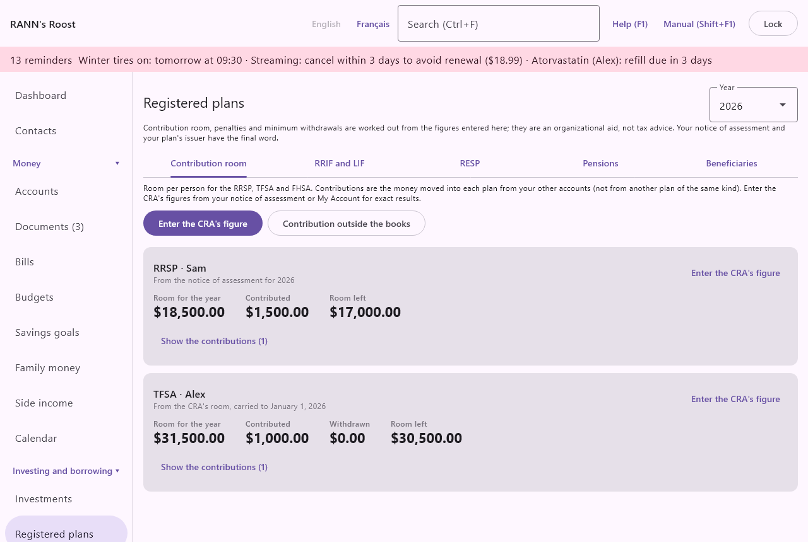

# Registered plans

Registered plans keeps track of the Canadian tax-sheltered plans of each person in the household: contribution room for the RRSP, TFSA and FHSA, minimum and maximum withdrawals from RRIFs and LIFs, RESP contributions and grants, employer and government pensions, and the beneficiaries of each plan. It is in the Investing and borrowing group of the menu.

What the plans hold (their securities, prices and gains) is on the [Investments](investments) screen. This screen is about the rules around them.

> Important: Contribution room, penalties and minimum withdrawals are worked out from the figures entered here; they are an organizational aid, not tax advice. Your notice of assessment and your plan's issuer have the final word.

## The Registered plans screen {#plans-screen}

@index: RRSP; TFSA; FHSA; RRIF; LIF; LIRA; RESP; registered plan; REER; CELI

At the top right, **Year** chooses the year shown, from next year back six years. It applies to the Contribution room, RRIF and LIF, RESP and Pensions tabs. Under the title, the notice reminds you that the figures are an aid, not tax advice.

The screen has five tabs: **Contribution room**, **RRIF and LIF**, **RESP**, **Pensions** and **Beneficiaries**.

To save anything here you need permission to edit the account group concerned. Figures that belong to a person rather than an account (CRA room, outside contributions, pensions) are stored in your own private group when you have one, otherwise in the first group you can edit; when you can edit several groups, a **Store in** choice appears in the window.

### Before you start {#plans-before-you-start}

The rules need a few facts that are entered elsewhere:

- Each plan is an account under [Accounts](accounts), with the right type (RRSP, Spousal RRSP, RRIF, Spousal RRIF, LIRA, LIF, TFSA, FHSA, RESP or Pension plan) and its owner. The owner decides whose room a contribution uses and whose age sets a minimum withdrawal.
- Each person's date of birth, and their province, under [Household members](members). The TFSA estimate starts the year a person turned 18, RRIF and LIF minimums depend on age, RESP grants depend on the child's age and province.
- Money put into a plan is recorded as a transfer from another of your accounts (chequing, savings...), and money taken out as a transfer to another account. That is what the screen counts as contributions and withdrawals, together with deposits and withdrawals in the plan's register that have no transfer and no category, such as cash imported from a brokerage file.

## Contribution room tab {#contribution-room}

@index: contribution room; deduction limit; over-contribution; notice of assessment; My Account

This tab shows, for each person and plan, the room for the chosen year, what was contributed and what is left. A card is shown for every person who owns an RRSP, TFSA or FHSA account (for a spousal RRSP, the contributor), or for whom a CRA figure was entered. If there is none, the tab says so.

At the top:

- **Enter the CRA's figure**: opens the window to record the room from your notice of assessment or CRA My Account. See [Enter the CRA's figure](plans#enter-cra-figure).
- **Contribution outside the books**: records a contribution that is not in the books, or leaves out a transfer that was not a contribution. See [Contribution outside the books](plans#contribution-outside).

### Room cards {#room-cards}

Each card is titled with the plan and the person, for example "TFSA · Marie". Under the title, a line says where the room comes from: from the CRA's figure, estimated from the rules and the books, or unknown (in red, with what to enter). The **Enter the CRA's figure** button on the card opens the window for that person, plan and year.

- **Room for the year**: the room available for the year; a dash when it is not known.
- **Contributed**: the contributions counted for the year.
- **Withdrawn**: TFSA only: the withdrawals of the year. A line under the figures reminds you that withdrawals come back as room on January 1 of the next year.
- **Room left**: the room for the year minus the contributions. When the contributions are higher, it is labelled **Over by** and shows the excess.
- **Lifetime room left**: FHSA only: what is left of the $40,000 lifetime limit.

**Show the contributions** (with their number) unfolds the list of lines counted, under the headings **Date**, **Account** and **Amount**: the date, the plan account (or "Outside the books" and its note) and the amount. **Hide the contributions** folds it again. Under the list, **Contribution outside the books** opens the window for this person and plan.

### How RRSP room is worked out {#rrsp-room}

@index: RRSP deduction limit; unused RRSP contributions; first 60 days

RRSP room is never estimated: enter the RRSP deduction limit for the year, and your unused contributions, from your notice of assessment. Until then the card says to enter it.

- The room for the year is the deduction limit minus the unused contributions already waiting to be deducted.
- Contributions count from the 61st day of the year (early March) to the 60th day of the next year, because contributions made in the first 60 days of a year can be deducted for the year before.
- Money coming from another RRSP, a spousal RRSP, a RRIF, an FHSA, a LIRA, a LIF or a pension plan is a transfer between plans, not a contribution, and is not counted.
- Contributions to a spousal RRSP count against the room of the contributing spouse chosen in [Plan details](plans#plan-details). A spousal RRSP needs its contributor: until one is chosen, a red line at the top of this tab names the plan, with a **Plan details** button to choose it, a reminder asks for it too, and the plan's contributions are counted for no one.

### How TFSA room is worked out {#tfsa-room}

@index: TFSA limit; TFSA withdrawals

- With a CRA figure (the room at January 1 of a year), the app starts from the latest figure entered for that year or before, and carries it forward: each year adds the new yearly limit, takes off the contributions and gives back the withdrawals of the year before.
- Without a CRA figure, the app estimates: every yearly limit since 2009 or the year the person turned 18, whichever is later, minus what the books show. The line under the title says it is an estimate. It cannot know about contributions made before you used the app, or years spent outside Canada, so enter the CRA's figure to be sure.
- Without a CRA figure and without a date of birth, the room is unknown.
- The yearly limits come from [Rates and rules](rates-rules) (TFSA dollar limit), where the CRA's figures are built in: $5,000 for 2009 to 2012, $5,500 for 2013 and 2014, $10,000 for 2015, $5,500 for 2016 to 2018, $6,000 for 2019 to 2022, $6,500 for 2023, and $7,000 from 2024. A year not yet published repeats the last limit known; when the CRA announces a new one, an administrator can add it there from January 1 of its year. The age of 18 is a figure of Rates and rules too (TFSA starting age).
- Money moved in from another TFSA is not counted as a contribution.

### How FHSA room is worked out {#fhsa-room}

@index: first home savings account; FHSA participation room

- Room starts the year the person's first FHSA was opened (the account's opening date), or the earliest year with a CRA figure.
- Each year gives $8,000, plus up to $8,000 left unused the year before, within the $40,000 lifetime limit. Both figures come from [Rates and rules](rates-rules) (FHSA yearly room, FHSA lifetime limit), read for each year, so a new limit added there applies from its year.
- A CRA figure entered for the year replaces the estimate for that year.
- Money moved in from another FHSA is not counted.

### What counts as a contribution {#what-counts}

A contribution is a transfer into a plan account from another of your accounts. A deposit in the plan's register with no transfer and no category also counts: that is how cash deposits imported from a brokerage file arrive. For a TFSA, money out is counted as a withdrawal the same way. A deposit that has a category, such as interest, is not a contribution: to leave an uncategorized deposit out, give it a category. Amounts in another currency are converted to your base currency at the rate of the day.

> Tip: If a contribution is missing from the list, add it with Contribution outside the books, or record the deposit as a transfer from the account it came from.

### Over-contribution warnings {#over-contribution}

@index: penalty; 1% tax; excess contribution

When the contributions are higher than the room, a red warning appears on the card with the tax the CRA charges, 1% a month on the excess, and its amount now:

- RRSP: up to $2,000 over the deduction limit is allowed. Beyond that, 1% a month on the part over $2,000 until it is withdrawn or room opens up.
- TFSA: 1% a month on the excess until it is withdrawn.
- FHSA: 1% a month on the excess until it is withdrawn or designated.

The $2,000 allowance, the 1% a month for each plan and the RRSP's first 60 days are figures of [Rates and rules](rates-rules), built in from the CRA and read for the year shown.

Over-contributions also appear in the reminders. See [Reminders from registered plans](plans#plan-reminders).

### Enter the CRA's figure {#enter-cra-figure}

The window's first line tells you where to find the figure for the plan chosen.

- **Plan**: RRSP, TFSA or FHSA.
- **Person**: an adult of the household (children are not offered).
- **Year**: the year the figure is for. Defaults to the year shown on the screen.
- **RRSP deduction limit** (RRSP): the RRSP deduction limit for the year, from the notice of assessment. For the TFSA the field is **Room at January 1**: the TFSA contribution room at January 1 of the year, from CRA My Account. For the FHSA it is **Participation room**: the FHSA participation room for the year, from CRA My Account. Required, not negative.
- **Unused RRSP contributions (from the notice)**: RRSP only: the contributions made but not yet deducted, shown on the notice. They reduce the room.
- **Store in**: when you can edit several groups.
- **Delete**: shown when a figure already exists for that person, plan and year; removes it at once.

Click **Save**. A new figure replaces any earlier one for the same person, plan and year.

### Contribution outside the books {#contribution-outside}

@index: in-kind contribution; payroll RRSP; group RRSP

Use it for a contribution the books do not show: one made through payroll (a group RRSP), or securities moved into the plan in kind (at their market value). Enter a negative amount to leave out a transfer that was not a contribution (for example money moved back by mistake).

- **Plan**: RRSP, TFSA or FHSA.
- **Person**: whose room it uses.
- **Date**: when it was made. For the RRSP, the date decides which year it counts for (see the first 60 days above).
- **Amount**: in your base currency. Positive adds a contribution, negative takes one away. Cannot be zero.
- **Note**: what it was; it is shown in the list of contributions as "Outside the books" with this note.
- **Store in**: when you can edit several groups.

Below the fields, the adjustments already entered for that plan and person are listed, each with **Delete**, which removes it at once. Click **Save** to add the new one.

## RRIF and LIF tab {#rrif-lif}

@index: RRIF minimum; LIF maximum; minimum withdrawal; locked-in

This tab shows, for each open RRIF, spousal RRIF and LIF, the minimum to withdraw in the chosen year and, for a LIF, the maximum. If there is none, the tab says so.

### Withdrawal cards {#withdrawal-cards}

Each card is titled with the account name, its type and, for a LIF, the law that governs it. **Plan details** opens the window for the plan and year (see [Plan details](plans#plan-details)).

- **Value on January 1** (with the year): the plan's value at the start of the year. Labelled "(statement)" when you entered it from the statement; otherwise it is the books' value at December 31 of the year before.
- **Age**: the age used for the minimum, on January 1 of the year.
- **Minimum**: the year's minimum withdrawal.
- **Maximum (LIF)**: the year's maximum, for a LIF whose law sets one; "none" when the law sets no maximum.
- **Withdrawn this year**: what has left the plan so far this year.
- **Still to withdraw**: the minimum minus what was withdrawn, never below zero.

Messages under the figures: "No minimum in the year the plan is opened."; "Enter the holder's date of birth under Household members to work out the minimum."; "More than the LIF maximum has been withdrawn this year."

### How the minimum and maximum are worked out {#minimum-maximum}

- The minimum is the value on January 1 times a factor that depends on age: 1 divided by (90 minus the age) before 71; the prescribed factors from 71 (5.28% at 71, rising each year); 20% from 95.
- The age is the holder's age on January 1, or the age of the person chosen in Plan details. Choosing a younger spouse's age, as allowed when the plan is set up, lowers the minimum.
- There is no minimum in the year the plan was opened (by the account's opening date).
- A LIF has the same minimum as a RRIF. Its maximum is the value on January 1 divided by the value of an annuity paid until the end of the year the holder turns 90, at the reference rate (6% unless you enter another). It is never less than the minimum. If you enter last year's investment earnings and they are higher, they are the maximum instead.
- The LIF follows the pension law of the governing jurisdiction chosen in Plan details, or of the holder's province by default. Saskatchewan and Prince Edward Island set no maximum.
- The prescribed factors, the ages (71, 90 and 95), the 6% reference rate and which provinces set no LIF maximum come from [Rates and rules](rates-rules), read for January 1 of the year shown. The age of 71 for converting an RRSP is there too.

From November on, a minimum not yet withdrawn appears in the reminders.

### What counts as withdrawn {#what-counts-withdrawn}

A withdrawal is money moved out of the plan to an account other than another RRSP, RRIF, LIRA, LIF or pension plan (a move to a TFSA or a bank account counts), plus tax withheld recorded in the plan's register under a tax category.

## Plan details {#plan-details}

@index: spousal RRSP contributor; RESP subscriber; governing law; reference rate; younger spouse

**Plan details** opens from a RRIF or LIF card, or from the Beneficiaries tab for a spousal RRSP, spousal RRIF, RESP, RRIF, LIF or LIRA. The fields shown depend on the plan:

- **Contributor**: spousal RRSP and spousal RRIF: the spouse who contributes. For a spousal RRSP, its contributions use this person's RRSP room, and the field is required: it shows "Choose the contributor" and **Save** stays unavailable until a person is chosen. For a spousal RRIF it is optional.
- **Subscriber**: RESP: the person who opened the RESP. Kept for reference.
- **Governing law**: LIF and LIRA: the pension law the locked-in money answers to. It is the law of the province where the money was earned, or the federal law for a federally regulated employer (banks, airlines, telecoms...), and can differ from where you live now. "The holder's province" is the default. It decides whether a LIF has a maximum.
- **Value on January 1** (with the year, "(statement)"): RRIF, spousal RRIF and LIF: the value on January 1 from the plan's statement. It shows the value already entered for that year. Left empty, a value entered stays as it is; when none was entered, the books' value at December 31 is used. The year is the one shown on the screen when you opened the window.
- **Use the books' value at December 31 instead**: shown when a value was entered for the year. It forgets that value (and last year's investment earnings kept with it), so the books' value is used again, and closes the window.
- **Age used for the minimum**: RRIF, spousal RRIF and LIF: "The holder", or another household member, such as a younger spouse.
- **Reference rate (%)**: LIF only: the rate for the maximum, 6 unless the rate for the first 15 years is higher. More than 0 and less than 25. Left empty, the LIF reference rate of [Rates and rules](rates-rules) is used (6%).
- **Last year's investment earnings**: LIF only: what the LIF earned last year, which can raise the maximum. It shows the figure already entered; left empty, it stays as it is. It is kept with the value on January 1, so enter that value too, or the app asks for it.

Click **Save** or **Cancel**.

## RESP tab {#resp}

@index: RESP; CESG; QESI; BCTESG; Canada Learning Bond; education savings; grant

This tab follows each RESP beneficiary across all the household's RESPs: contributions, the grants the rules give, and the grants received. Children appear here once they are added as RESP beneficiaries of an RESP account under the [Beneficiaries tab](plans#beneficiaries); until then the tab says to add them.

**Record a grant received** opens the window described below.

### The RESP table {#resp-table}

One line per beneficiary:

- **Beneficiary**: the child.
- **Contributed in** (the year): contributions of the chosen year.
- **Contributed in all**: contributions through the chosen year.
- **CESG expected**: the Canada Education Savings Grant the rules give on those contributions, through the chosen year.
- **CESG received**: the CESG grants recorded.
- **Provincial grant**: QESI in Quebec, BCTESG in British Columbia, or "none in this province", from the child's province.
- **Expected** and **Received**: the provincial grant the rules give, and what was recorded.
- **Left of the $50,000 limit**: the lifetime contribution limit per beneficiary, minus the contributions.

Under the table, a line per child lists the grants still to receive by the rules, and a red line asks for a child's date of birth when it is missing. The table can be folded, exported (CSV, Excel, PDF) and printed.

A contribution is a transfer into an RESP from an account that is not an RESP, or a deposit in the RESP's register with no transfer and no category (such as cash imported from a brokerage file). When the transaction names a household member who is a beneficiary of that RESP, it counts for that child; otherwise it is shared equally among the plan's beneficiaries.

### How grants are worked out {#resp-grants-rules}

- CESG: 20% of the year's contributions. Grant room builds up by $500 a year from the child's birth (or 2007) to the year they turn 17, so unused room carries forward; at most $1,000 a year and $7,200 in all.
- At 16 and 17, the grant is paid only if at least $2,000 was contributed before the end of the year the child turned 15, or at least $100 in each of four years before then.
- QESI (Quebec): 10% of the year's contributions, with room of $250 a year, at most $500 a year and $3,600 in all, under the same age rules.
- BCTESG (British Columbia): $1,200 once, without a contribution, for a child born in 2006 or later, from age 6. The application must be made before the child turns 9.
- Contributions over $50,000 per beneficiary give a reminder.
- Every rate, amount, age and year above, and which provinces have a provincial grant, comes from [Rates and rules](rates-rules), with the official figures built in. Each is read for the year it applies to, so a change the government announces can be added there from its date.

### Record a grant received {#record-grant}

When a grant arrives in the RESP (it is on the RESP statement), record it:

- **RESP**: the RESP account.
- **Beneficiary**: the child, among the RESP beneficiaries of that account. If the RESP has none, a red line asks you to add them under Beneficiaries.
- **Grant**: Canada Education Savings Grant (CESG), Quebec education savings incentive (QESI), B.C. Training and Education Savings Grant (BCTESG), Canada Learning Bond or Other grant.
- **Date**: when it was paid in, today by default.
- **Amount**: more than zero, in the RESP's currency.

Click **Save**. The grant is counted as received in the table, and a deposit is entered in the RESP's register in the RESP grants category, for that child.

Under the fields, **Grants recorded** lists the grants already recorded in the chosen RESP, newest first: the date, the grant, the child and the amount. **Delete** beside a grant removes it and its deposit in the register at once; if the deposit is reconciled, the app asks first. It cannot be undone, except by recording the grant again.

Deleting the deposit from the RESP's register instead asks "Delete an RESP grant deposit": **Delete both** removes the deposit and the grant, **Only the deposit** keeps the grant, which then still counts as received, and **Cancel** changes nothing.

## Pensions tab {#pensions}

@index: pension; defined benefit; defined contribution; CPP; QPP; OAS; pension adjustment

This tab lists employer pension plans, the Quebec or Canada Pension Plan and Old Age Security for each person. **Add a pension** opens the pension window.

Each pension card shows its name and person, its kind, administrator and normal retirement age, with **Statements** and **Edit**. Its figures:

- **Received in** (the year): the pension payments received in the chosen year: deposits in the pension's income category (Employer pension, QPP / CPP or Old Age Security) for that person, plus deposits in that category whose payee contains the name entered in Paid by.
- From the latest statement entered: **Projected pension**, **Accrued pension**, **Pension adjustment** and **Value**, when filled in.

Pensions also appear in the emergency summary (see [Emergency and estate](estate)).

### Add or edit a pension {#pension-dialog}

- **Person**: an adult of the household.
- **Kind**: Defined benefit plan, Defined contribution plan, Quebec Pension Plan (QPP), Canada Pension Plan (CPP), Old Age Security (OAS) or Other pension. For a person living in Quebec the QPP comes before the CPP; elsewhere the CPP comes first. Choosing a kind fills in the name if it is empty, and the payer (Retraite Québec for the QPP, Service Canada for the CPP and OAS).
- **Name**: required. For example the employer's plan name.
- **Administrator**: who runs the plan.
- **Member number**: your number in the plan.
- **Normal retirement age**: 65 by default; between 50 and 75.
- **Survivor pension (%)**: the part of the pension paid to a surviving spouse, for example 60.
- **Indexed to inflation**: tick if payments rise with the cost of living.
- **Paid by**: the payer's name as it appears on the deposits, for example Retraite Québec. It is used to find the payments received.
- **Notes**: free text.
- **Store in**: when you can edit several groups.
- **Delete**: when editing; removes the pension at once.

Click **Save** (available once there is a person and a name) or **Cancel**.

### Pension statements {#pension-statements}

**Statements** opens the yearly figures from the pension statement. Pension amounts are yearly.

- **Year**: the statement year, last year by default.
- **Pension adjustment**: box 52 of the T4. It lowers next year's RRSP room on your notice of assessment.
- **Accrued pension**: the yearly pension earned so far.
- **Projected pension**: the yearly pension projected at retirement.
- **Value**: the commuted or account value.
- **Your contributions**: what you contributed in the year.

Click **Add** to save the line. A second entry for the same year replaces the first. The table below lists every year entered; it can be exported and printed. **Delete** followed by the year removes that year at once. Click **Close** when done.

## Beneficiaries tab {#beneficiaries}

@index: beneficiary; successor holder; designation; estate

This tab lists every registered plan with the people who receive it at death. A plan without one shows "No beneficiary recorded." in red. On each card, **Plan details** (for a spousal RRSP, spousal RRIF, RESP, RRIF, LIF or LIRA) opens [Plan details](plans#plan-details), and **Add** adds a beneficiary. The beneficiaries are listed under the headings **Kind** (Beneficiary, Successor holder or RESP beneficiary), **Beneficiary** (the name, with the relationship) and **Share (%)**. Click a beneficiary to change it.

> Note: This is for reference. The designation made with the institution, or in a will, is what counts.

Beneficiaries are also listed in the emergency summary (see [Emergency and estate](estate)).

### Add or edit a beneficiary {#beneficiary-dialog}

- **Role**: for plans other than an RESP: **Beneficiary** receives the plan, or a share of it, at death; **Successor holder** is a spouse who takes over the plan as it is (TFSA, RRIF, FHSA). For an RESP the role is always RESP beneficiary: the child the plan saves for; grants are paid per beneficiary.
- **Household member**: the person, if they are in the household, or "Someone else". Choosing a member fills in the name. An RESP beneficiary must be a household member.
- **Name**: required when the person is not a household member.
- **Relationship**: for example spouse, son, niece.
- **Share (%)**: for a Beneficiary only: their share, more than 0 and at most 100.
- **Delete**: when editing; removes the beneficiary at once.

Click **Save** or **Cancel**. Adding a child as RESP beneficiary makes them appear on the RESP tab.

## Reminders from registered plans {#plan-reminders}

@index: reminder; RRSP conversion; age 71

The app adds reminders, shown with the other reminders and as a system notification, when:

- a person is over their RRSP deduction limit by more than $2,000, or over their TFSA or FHSA room (from January and February, the RRSP is checked for the year before);
- from November on, a RRIF or LIF still has part of its minimum to withdraw by December 31;
- a person with an open RRSP turns 71 this year: it must be converted to a RRIF or an annuity by December 31;
- a child's RESP contributions are over the $50,000 lifetime limit;
- a spousal RRSP has no contributor chosen in Plan details.

Clicking a reminder opens this screen.

## Registered plans report {#plans-report}

The Registered plans report under [Reports](reports) gathers the room, withdrawals and grants of a year per person, with the same warnings, to print or export.
