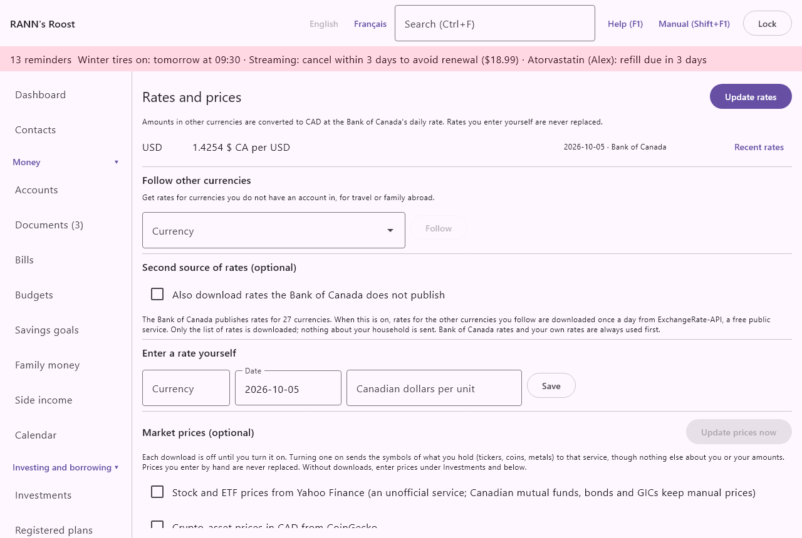

# Rates and prices

Rates and prices holds the exchange rates that convert other currencies into Canadian dollars, and the optional market prices of stocks, crypto-assets and precious metals. The screen is in the **Settings** group of the menu, under **Rates and prices**.

> Note: Tax rates, plan limits, thresholds and other figures set by governments are not here: they are on the next screen, [Rates and rules](rates-rules), with their dates and provinces.

## Why rates matter {#why-rates}

@index: exchange rate; foreign currency; currency conversion; US dollars; USD; base currency; FX

Each account keeps its own currency: a US dollar account holds US dollars. Whenever the app adds amounts together, such as net worth, budgets, reports and the tax package, it converts them to the household's base currency (Canadian dollars in most households) with the rate of the day.

- The rate used is the one for the transaction's date or, on weekends and holidays when there is none, the latest one before it. If there is no earlier rate at all, the first one after it is used.
- When no rate exists for a currency, amounts in it are left out of totals and reports, which say so: "No exchange rate for" the currency, "those amounts are left out." The dashboard also points to this screen.
- Crypto-asset prices are kept as an exchange rate to Canadian dollars, so wallets are converted like a foreign currency.

If all your accounts are in the base currency, no rates are needed and the screen says "All accounts are in the base currency, so no rates are needed."

## Where rates come from {#sources}

@index: Bank of Canada; daily exchange rate; ExchangeRate-API; manual rate

- Bank of Canada: the daily average rates the Bank of Canada publishes for 27 currencies (the US dollar, the euro, the pound, the yen, the peso and others). They are downloaded automatically.
- ExchangeRate-API: an optional second source, for currencies the Bank of Canada does not publish. Off until you turn it on. See [Second source of rates](rates#second-source).
- Entered by hand: rates you type yourself. They are never replaced by a download.
- Market price (CoinGecko): crypto-asset prices, when that download is turned on. See [Market prices](rates#market-prices).

When the household is opened, the app downloads the missing Bank of Canada rates in the background, then the market prices you turned on. Without an internet connection, nothing happens and the app works with the rates it has. Only the list of rates is downloaded; nothing about your household is sent.

## The rates in use {#rates-list}

At the top of the screen:

- **Update rates**: downloads the missing rates now, from the Bank of Canada and, if it is on, the second source. The result shows below it: "Rates are up to date.", the number of rates added, or "The rates could not be downloaded:" with the reason.
- A note: amounts in other currencies are converted to the base currency at the Bank of Canada's daily rate, and rates you enter yourself are never replaced.

Then one line per currency the household needs: the currencies of accounts and investments, and the currencies you follow, under the column headings Currency, Rate, Date and source, and Actions. See [Lists and their columns](basics#lists). Each line shows:

- The currency code, such as USD.
- The latest rate of the last 30 days, in Canadian dollars per unit, such as "1.3642 $ CA per USD". Rates are shown with six significant digits; the full value is kept for conversions.
- If there is none: "No rate yet", or for a currency the Bank of Canada does not publish while the second source is off, "Not published by the Bank of Canada: turn on the second source below or enter a rate yourself."
- The date of that rate and where it came from: Bank of Canada, ExchangeRate-API, Entered by hand or Market price (CoinGecko).
- **Stop following**: shown for a currency you follow. See [Follow other currencies](rates#follow).
- **Recent rates**: opens the list of the currency's rates at the bottom of the screen. See [Recent rates](rates#recent-rates).

The first time a currency is needed, rates are downloaded back to the opening date of the oldest account, but not more than five years back. After that, only the missing days are downloaded.

## Follow other currencies {#follow}

@index: travel currency; family abroad

You can follow a currency no account uses, for a trip or for family abroad, so its rate is kept up to date.

- **Currency**: every currency in the world except the Canadian dollar and those already listed, shown as code and name, such as "EUR · Euro". Type to filter.
- **Follow**: adds the currency to the list above. Its rates are downloaded with the others from then on.

To stop, click **Stop following** on its line. Its rates already downloaded stay. A currency used by an account cannot be unfollowed this way: it stays as long as the account exists.

## Second source of rates (optional) {#second-source}

- **Also download rates the Bank of Canada does not publish**: off by default. When on, the rates of the other currencies the household needs or follows are downloaded once a day from ExchangeRate-API, a free public service, with the credit line "Rates By Exchange Rate API". Bank of Canada rates and your own rates are always used first; the second source only fills the gaps.

Below it, the screen lists the currencies the Bank of Canada does not publish, if the household has any.

## Enter a rate yourself {#manual-rate}

@index: manual exchange rate; override a rate; bank's rate

Enter a rate when a currency has no download, or when you want a day's conversion to match what your bank actually charged.

- **Currency**: the three-letter code, such as USD or ISK. Letters are turned into capitals. An unknown code is refused ("Unknown currency code.").
- **Date**: the day the rate applies to, as YYYY-MM-DD. Today by default. The rate is also used for the following days until a newer rate exists.
- **Canadian dollars per unit**: how many Canadian dollars one unit of the currency is worth, such as 1.3642 for one US dollar. Must be more than zero.
- **Save**: stores the rate, replacing a downloaded rate of the same currency and day. The field empties when it is saved.

A rate entered by hand is never replaced by a download. It is recorded in the activity log as "Entered a rate". To remove it, use **Delete** in [Recent rates](rates#recent-rates).

> Tip: To enter the price of a crypto-asset by hand, enter it here with the coin's code, such as BTC, in Canadian dollars per coin.

## Market prices (optional) {#market-prices}

@index: stock prices; ETF prices; quotes; Yahoo Finance; CoinGecko; crypto prices; gold price; silver price; spot price

Market prices value your investments, crypto-assets and precious metals without typing each price. Each download is off until you turn it on. Turning one on sends the symbols of what you hold (tickers, coins, metals) to that service, but nothing else about you or your amounts. Prices you enter by hand are never replaced.

- **Update prices now**: downloads the prices of every feed that is on. Greyed out while none is on. The result shows below: the number of prices stored, and anything "Not available" with the reason.
- **Stock and ETF prices from Yahoo Finance**: daily closing prices of the stocks and ETFs in your investment accounts. Yahoo Finance is an unofficial service. Canadian mutual funds, bonds, GICs and options are not quoted there and keep the prices you enter under [Investments](investments). Toronto listings are looked up with their usual suffix (.TO for the TSX, .V for the TSX Venture, .NE for Cboe Canada, .CN for the CSE); a price quoted in another currency than the security's is refused. The first download fetches a year of prices, later ones the last month.
- **Crypto-asset prices in CAD from CoinGecko**: daily prices in Canadian dollars of the coins held in your wallets, up to a year back.
- **Gold, silver, platinum and palladium prices from Yahoo Finance**: daily prices of the near-month futures, in US dollars, converted to Canadian dollars at the Bank of Canada rate of each day.

Under the feeds: the credit line for the services and "Last update:" with the date of the last download that stored a price.

When a feed is on, its prices are also downloaded each time the household is opened.

### Crypto-assets held {#coins}

Shown when a wallet holds a crypto-asset, under the column headings Currency, Price, CoinGecko name and Actions. One line per coin:

- The coin's code, its latest price in Canadian dollars with its date and source, or "No rate yet".
- **CoinGecko name**: the name CoinGecko uses for the coin, the one in the coin's address on coingecko.com, such as bitcoin or ethereum. The usual coins are filled in already; enter it for others, or to correct one.
- **Save**: keeps the CoinGecko name. It is saved in lower case.

A coin with no CoinGecko name is listed as not available when prices are downloaded.

### Precious metal spot prices {#metals}

Under the column headings Metal and Spot price, one line per metal (Gold, Silver, Platinum, Palladium) with its latest price per troy ounce in Canadian dollars, its date, and whether it is a market price or entered by hand, or "No rate yet".

To enter a price yourself:

- **Metal**: Gold, Silver, Platinum or Palladium.
- **Date**: the day of the price, as YYYY-MM-DD. Today by default.
- **CAD per troy ounce**: the price of one troy ounce of pure metal, in Canadian dollars. Must be more than zero.
- **Save**: stores the price. Downloads never replace it.

Prices are for one troy ounce (31.1035 g) of pure metal. Coins and bars on the [Investments](investments) screen are valued from them with their weight, purity and premium; without a spot price they count at their cost.

## Recent rates {#recent-rates}

Click **Recent rates** on a currency's line. The bottom of the screen shows "Recent rates for" the currency: every rate of the last 60 days, newest first, under the column headings Date, Rate, Source and Actions.

- **Delete**: shown only for rates entered by hand. Removes that day's rate at once. Downloaded rates cannot be deleted.

## Who can change rates and prices {#permissions}

- Administrators: everything on this screen, including turning on the second source of rates and each market price download, since these send requests to outside services.
- Members: follow currencies, enter and delete rates, set coin names and enter metal prices. The download switches are greyed out.
- Viewers: see the rates and prices; everything else is greyed out.
- Everyone: **Update rates** and **Update prices now**, which only download what is already turned on.

## Privacy {#privacy}

The Bank of Canada and ExchangeRate-API receive only a request for the list of rates. The price services receive the symbols of what you hold, only for the feeds you turned on. See [Privacy and your data](privacy-data).
