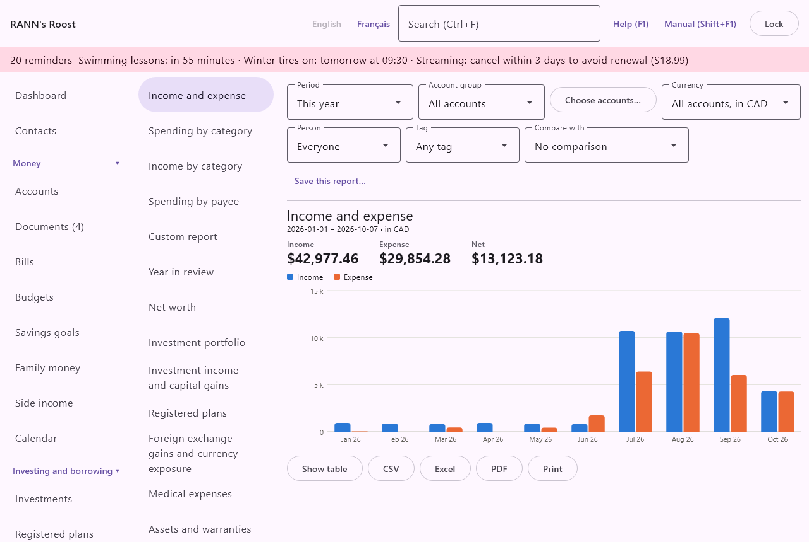
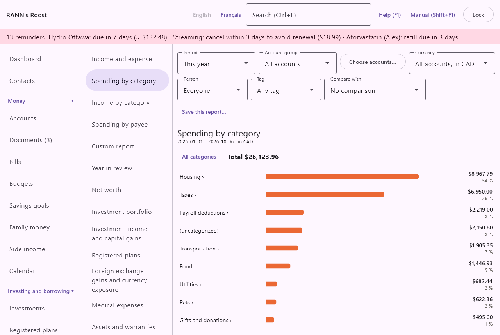
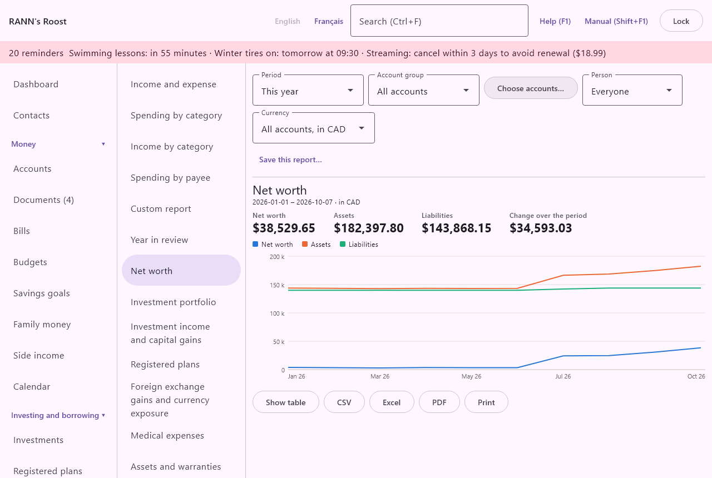
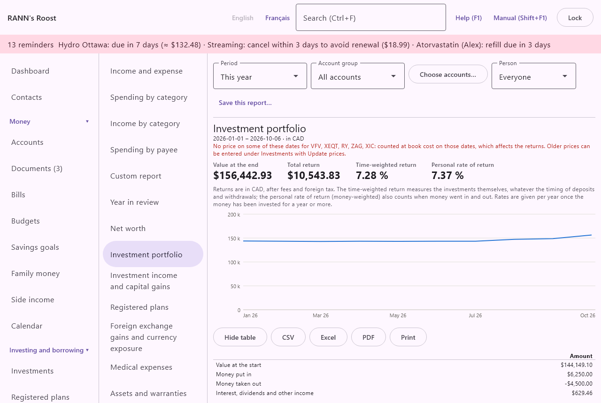

# Reports

Reports turns the books into charts and tables: where the money came from and went, what the household is worth, how the investments did, the figures for a tax return, what the house and the cars cost to own, and what is still owed. Reports is in the **Reports and taxes** group of the menu.

Every report reads the books as they are now. Nothing is stored with a report except your choices, so a report always reflects the latest transactions, prices and exchange rates. A report never changes the books.

> Note: Tax figures in reports (slips, capital gains, contribution room, medical expenses and the like) are organizational aids, not tax advice. Check them against your slips and statements, and ask a tax professional when in doubt.

## The Reports screen {#reports-screen}

@index: report; chart; graph; statement of income

The screen has two parts. On the left is the list of reports, with your saved reports under it. On the right are the filters for the report chosen, a **Save this report…** button, and the report itself: a title, a line giving the dates and currency, a few totals in large type, a chart, and the table with its export buttons.

The choices you make in the filter bar are kept while you move from one report to another and while you visit other screens, until the app is closed. So you can set a period once and look at several reports for it.

### The list of reports {#report-list}

Click a report's name to show it. The reports, in the order listed:

- **Income and expense**: money in and money out for each month, quarter or year. See [Income and expense](reports#income-and-expense).
- **Spending by category**: where the money went, category by category, with drill-down into subcategories. See [Spending by category](reports#spending-by-category).
- **Income by category**: where the money came from. See [Income by category](reports#income-by-category).
- **Spending by payee**: who was paid the most. See [Spending by payee](reports#spending-by-payee).
- **Custom report**: rows and columns of your choice. See [Custom report](reports#custom-report).
- **Year in review**: one year at a glance against the year before. See [Year in review](reports#year-in-review).
- **Net worth**: what the household owns and owes, month by month. See [Net worth](reports#net-worth).
- **Investment portfolio**: returns, allocation and holdings. See [Investment portfolio](reports#portfolio).
- **Investment income and capital gains**: the T5, T3, RL-3 and RL-16 slips and Schedule 3, per person. See [Investment income and capital gains](reports#investment-income).
- **Registered plans**: contribution room, plan values, RRIF and LIF minimums, RESP grants and pensions. See [Registered plans](reports#registered-plans).
- **Foreign exchange gains and currency exposure**: foreign currency held and exchange gains realized. See [Foreign exchange gains and currency exposure](reports#foreign-exchange).
- **Medical expenses**: costs, reimbursements and the medical expense tax credit. See [Medical expenses](reports#medical-expenses).
- **Assets and warranties**: the home inventory, warranties ending soon and what no policy covers. See [Assets and warranties](reports#assets-warranties).
- **Maintenance and cost of ownership**: what vehicles and other assets cost to keep, and what falls due. See [Maintenance and cost of ownership](reports#maintenance).
- **Debt summary**: every loan, mortgage, line of credit and card. See [Debt summary](reports#debt-summary).
- **Budget vs actual**: budgets against what was really spent and received. See [Budget vs actual](reports#budget-vs-actual).
- **Reconciliation status**: when each account was last reconciled. See [Reconciliation status](reports#reconciliation-status).

Under the list, the heading **Saved reports** appears as soon as you have saved one. See [Saved and scheduled reports](reports#saved-reports).

### The filter bar {#filter-bar}

@index: filter; date range; period; compare; comparison; previous period; same period last year; tag; person; currency; account group

The row above the report holds the filters. Each report shows only the filters it uses; each item below says which reports use it.

- **Period**: the dates the report covers. Choose **This month** (the first of the month to today), **Last month** (the whole previous month), **This year** (January 1 to today), **Last year** (January 1 to December 31 of last year), **Last 12 months** (the first day of the month eleven months ago to today) or **Custom dates**. The default is **This year**. Used by Income and expense, Spending by category, Income by category, Spending by payee, Custom report, Net worth, Investment portfolio and Budget vs actual. Periods other than Custom dates move with the calendar: a saved report on **This month** always shows the current month.
- **From**: shown with **Custom dates** only. The first day of the period, as YYYY-MM-DD. If the date cannot be read, the first day of the current month is used.
- **To**: shown with **Custom dates** only. The last day of the period, as YYYY-MM-DD. If the date cannot be read, today is used.
- **Account group**: shown only when the household has more than one account group. **All accounts** covers every account you may see; choosing a group limits the report to the accounts in that group. Used by every report except Investment income and capital gains, Foreign exchange gains, Registered plans, Medical expenses, Assets and warranties, Maintenance and cost of ownership, Year in review, Budget vs actual and Reconciliation status. In the Investment portfolio, the group also chooses whose target allocation is used.
- **Choose accounts…**: opens a list of accounts to pick from, for a report on some accounts only, such as the cottage's. Once accounts are chosen, the button reads, for example, **3 accounts chosen**. When an account group is chosen too, the report covers the accounts that are in both. See [Choose accounts](reports#choose-accounts). Not shown for Investment income, Foreign exchange, Registered plans, Medical expenses, Assets and warranties, Maintenance, Year in review, Budget vs actual and Reconciliation status, which always cover every account.
- **Person**: shown when household members are set up. **Everyone** is the default.
  - In the income and spending reports and the custom report, it keeps only the amounts entered for that person (the **For** field of a transaction or split line).
  - In Net worth and Debt summary, it keeps the accounts that person owns, alone or jointly.
  - In the Investment portfolio, it keeps the investment accounts that person owns, and the allocation uses that person's target.
  - In Investment income, Registered plans and Medical expenses, it shows only that person's part.
- **Tag**: shown when tags exist, for the four income and spending reports and the custom report. **Any tag** is the default; choosing a tag keeps only the transactions with that tag.
- **Currency**: shown for Income and expense, Spending by category, Income by category, Spending by payee and Net worth, when some accounts are in a currency other than the base currency (crypto-assets aside). **All accounts, in CAD** (or your base currency) converts every account to the base currency, at the exchange rate of each transaction's date. Choosing, for example, **USD accounts only** shows only the accounts in that currency, in their own amounts, with no conversion.
- **Compare with**: shown for the four income and spending reports. **No comparison** is the default. **Previous period** compares with the period of the same length just before (for March 1 to 31, the 31 days before it). **Same period last year** compares with the same dates one year earlier. The comparison appears as an extra total in Income and expense, and as a "was" figure and an extra table column in the category reports and Spending by payee.
- **Year**: for Registered plans, Maintenance and cost of ownership, and Year in review. The current year or one of the ten before. The default is the current year (for Year in review, the current year so far).
- **Tax year**: for Investment income and capital gains, Foreign exchange gains and Medical expenses. The current year or one of the ten before. The default is last year, the year usually being filed.

The years chosen with **Year** and **Tax year** are kept while the app is open, and are kept with a saved report too.

### Choose accounts {#choose-accounts}

@index: account set; cottage; some accounts

The **Choose accounts…** window lists every account, closed ones included, with a check box beside each.

- Tick the accounts the report should cover. Ticking none means every account.
- **All accounts**: clears every tick.
- **Save**: applies the choice to this report and to every other report that uses it, until you change it.
- **Cancel**: closes the window and keeps the previous choice.

The choice is kept with a saved report, so a report named "Cottage" can always cover the cottage's accounts.

### Charts and drill-down {#charts-drill-down}

@index: drill down; tooltip; hover; transactions behind a figure

Reports use three kinds of chart.

- Grouped bars (Income and expense, Medical expenses, and the custom report's **Bars**): one group of bars per period or person. Rest the pointer on a group to see its exact values.
- Lines (Net worth, Investment portfolio, and the custom report's **Lines**): a crosshair and the exact values follow the pointer.
- Ranked bars (category, payee, allocation, budget and currency charts): one bar per line, largest first, with its amount written beside it, so you never need the colours to tell bars apart.

The legend above a chart names each colour when there are two series or more.

Where a figure can be opened, clicking it shows the transactions behind it in a window: in Income and expense, click a bar (the income or the expense of that period); in Spending by category and Income by category, click a category with no subcategories; in Spending by payee, click a payee. The window says how many transactions there are and their total, and lists each one with its date, account, payee, category and amount. Click a transaction to open its account's register on the Accounts screen. **Close** closes the window.

### The table, export and print {#table-export}

@index: export; CSV; Excel; spreadsheet; PDF; print; xlsx

Under every chart is a row of buttons for the table behind it. Some reports show the table open from the start.

- **Show table**: shows the figures as a table, with exact amounts; the button then reads **Hide table**. The table is also the way to read a chart without relying on its colours.
- **CSV**: saves the table as a CSV file, after asking where. The file is UTF-8 so Excel reads accents. In English, columns are separated by commas and decimals use a point; in French, columns are separated by semicolons and decimals use a comma, as French spreadsheets expect. Amounts are plain numbers, without a currency sign.
- **Excel**: saves an Excel workbook (.xlsx) with the title, the subtitle, then the table, with real numbers and dates so you can keep calculating.
- **PDF**: saves a printable PDF on letter-size paper with the title, the dates and filters, and the table with amounts aligned on the right. A table with more than five columns is printed in landscape.
- **Print**: makes the same PDF and sends it to the computer's printing; where printing is not offered, the PDF opens in your PDF viewer to print from there.

The file name offered is the report's title; you can change it. When a report holds tax figures (Investment income and capital gains, Registered plans, Foreign exchange gains, Medical expenses), the exports end with the tax notice.

### Missing exchange rates and prices {#missing-rates}

@index: exchange rate missing; no exchange rate; missing price

When an amount is in a currency with no exchange rate for its date, a red line says so, for example "No exchange rate for EUR: those amounts are left out." The totals are then incomplete. Add the rate under **Rates and prices** (see [Rates and prices](rates)) and the report updates.

The Investment portfolio also warns when a security has no price on some dates: it is then counted at its book cost on those dates, which affects the returns.

## Saved and scheduled reports {#saved-reports}

@index: save report; saved report; favourite report; memorized report

A saved report keeps your choices under a name, so you can come back to the same view in one click. Saved reports are your own: other users of the household do not see them.

What is kept: the report, the period (or the custom dates), the account group, the chosen accounts, the person, the tag, the currency (for the reports that have one), the comparison, the **Year** or **Tax year** of the reports that have one and, for a custom report, its rows, columns, measure, chart and category. A report saved before the year was kept opens with the year shown at the time. No amounts are kept: the report is worked out again from the books each time.

### Save the report {#save-dialog}

Click **Save this report…** above the report.

- **Name**: the name in the list. It starts as the report's name, or as the saved report's name if you opened one. Required: **Save** stays unavailable while it is empty.
- **Save as a new report**: shown only when the report on screen was opened from the saved list. Ticked, saving makes a new saved report and leaves the old one as it was. Not ticked, saving updates the one you opened with the current choices.
- **Make it on a schedule**: for a custom report only. **Not on a schedule** (the default), **Each month, for the month just ended**, **Each quarter, for the quarter just ended** or **Each year, for the year just ended**. For any other report, a line says that custom reports can also be made on a schedule.
- **Choose a folder…**: shown when a schedule is chosen. Picks the folder the PDF is written to; the line beside it shows the folder, or "No folder chosen." A scheduled report must have a folder.
- **Save**: saves and closes. **Cancel**: closes without saving.

### Open or remove a saved report {#open-saved}

Saved reports are listed under **Saved reports** below the list of reports. A clock sign (⏱) after a name marks a scheduled report.

- Click a saved report to put its choices back on the screen.
- Click **✕** beside a saved report to remove it. You are asked first; once deleted it cannot be undone. Only the saved choices are lost, never any transaction, and PDFs already made stay where they are.

### Scheduled reports {#scheduled-reports}

@index: schedule report; automatic report; monthly report; quarterly report; yearly report

A scheduled custom report is written as a PDF into its folder after each month, quarter or year ends. It uses the saved filters, with the period just ended in place of the saved period.

- The app checks when the household is opened, and every hour while it is open. A PDF is made for each month, quarter or year that has ended since the last one made, oldest first: periods missed while the household was closed are made then, up to a year back. For anything older, run the report by hand with **Custom dates**.
- The file is named after the report and the period, such as "Cottage 2026-09.pdf", "Cottage 2026-Q3.pdf" or "Cottage 2025.pdf". A file of the same name is replaced.
- When reports are made, a line beside **Save this report…** lists them, such as "Scheduled reports made: Cottage 2026-09.pdf".
- When a schedule is set or changed, it starts with the period that has just ended.
- If the folder no longer exists (an unplugged drive, for example), nothing is written and the report is tried again later.

## Income and spending reports {#income-spending}

@index: cash flow; spending report; income report

These four reports add up the transactions in the period. Transfers between your own accounts are left out, since they are neither income nor spending. An amount with no category counts as income when money came in and as spending when money went out. Amounts in other currencies are converted to the base currency at each transaction's date, unless **Currency** shows one currency's accounts only.

### Income and expense {#income-and-expense}

@index: income vs expense; net income; savings; cash flow by month

Money in and money out for each part of the period, side by side.

- The parts are months for a period up to about 18 months, quarters up to about three years, and years beyond that.
- The totals at the top: **Income**, **Expense** and **Net** (income less expense). With **Compare with**, a fourth total gives the net of the comparison period, labelled **Previous period** or **Same period last year**.
- The chart has an income bar and an expense bar per part. Click a bar to see the transactions behind it.
- The table lists each part with **Income**, **Expense** and **Net**, and a **Total** line.

Income is everything on income categories (and uncategorized money in); expense is everything on expense categories (and uncategorized money out), refunds reducing it.

### Spending by category {#spending-by-category}

@index: category report; where the money went; breakdown

What was spent in each top-level category, each including its subcategories, largest first.

- The line above the chart starts with **All categories**, then the path of categories you went into, each one clickable to go back up, and the **Total** of what is shown.
- Each bar shows the amount, its share of the total in percent and, with **Compare with**, what it "was" in the comparison period.
- A category with subcategories has a › after its name: click it to see its subcategories. Inside a category, an extra line such as "Groceries (directly)" holds what was put on the category itself rather than on one of its subcategories.
- Click a category without subcategories to see its transactions.
- At the top level, a line "(uncategorized)" gathers money out with no category.
- The table lists **Category** and **Amount**, plus the comparison column when one is chosen, and a **Total**.

Spending is shown as positive amounts; a refund on an expense category reduces it.

### Income by category {#income-by-category}

@index: income sources

Works exactly like Spending by category, for income categories (salary, pensions, benefits, investment income and so on), with the same drill-down, percentages, comparison and table. Uncategorized money in appears as "(uncategorized)".

### Spending by payee {#spending-by-payee}

@index: payee report; merchants; stores; vendors

The payees the most money went to in the period, after refunds.

- The chart shows the 30 largest; the table lists every payee with net spending.
- Payees from whom more came in than went out are not shown.
- Payees are grouped by the payee of the transaction, so the other spellings matched to a payee count with it. A transaction with no payee is grouped by the name as typed, ignoring capitals and spaces around it. The custom report groups its **Payee** lines the same way.
- With **Compare with**, each bar shows what was spent with that payee in the comparison period ("was …"), and the table has an extra column for it.
- The table lists **Payee** and **Amount**, plus the comparison column when one is chosen, and a **Total**.
- Click a payee to see its transactions.

## Custom report and year in review {#custom-and-review}

### Custom report {#custom-report}

@index: pivot table; custom report; build a report; cross-tab; report builder

A custom report adds up the transactions in the period any way you choose: categories by month, payees by person, accounts by year and so on. Its own choices are in a second row under the filter bar.

- **Rows**: what each line of the report is: **Category**, **Category group** (the top-level category, its subcategories added in), **Payee**, **Account**, **Person**, **Tag**, **Month**, **Quarter** or **Year**. The default is **Category group**.
- **Columns**: what each column is: **Totals only** (one column), **Month**, **Quarter**, **Year**, **Person**, **Account** or **Category group**. The default is **Month**.
- **Adds up**: **Spending** (shown as positive amounts), **Income**, or **Income less spending**. The default is **Spending**.
- **Chart**: **Bars**, **Lines**, **Ranked bars** or **Table only**. The default is **Bars**.
- **Category**: **All categories** (the default), or one category with its subcategories, for example Food to see groceries and restaurants by month. It is kept with a saved report.

How the figures are worked out:

- Transfers between your own accounts are left out. Uncategorized money out counts as spending and money in as income.
- **Person** is the person a transaction line is for; lines for no one are under "Household".
- **Payee** groups as Spending by payee does: by the transaction's payee, or else by the name as typed, ignoring capitals; lines without one are under "No payee".
- When **Tag** is the rows, a transaction with several tags counts under each of its tags, so the tag lines can add up to more than what was spent. Untagged lines are under "No tag".
- Rows that are not time periods are sorted largest first. When there are more than 12, the eleven largest are kept and the rest are added together in a line "Other".
- Time columns are in date order; other columns are sorted largest first.
- The filters above apply too: period, account group, chosen accounts, person and tag. A custom report is always in the base currency, every account converted at the exchange rate of each transaction's date.

The chart:

- With **Totals only**, the chart is always ranked bars, unless you chose **Table only**.
- **Bars** and **Lines** draw the six largest rows so the chart stays readable; a line under it says how many more are in the table.
- **Table only** draws no chart and opens the table.

The table has a line per row, a column per column, a **Total** column and a **Total** line. "Nothing to show for these choices." means no transaction matched.

A custom report is the only report that can be made on a schedule: see [Scheduled reports](reports#scheduled-reports).

### Year in review {#year-in-review}

@index: annual summary; year end review; savings rate

The year at a glance against the year before, to read, print or share. Choose the **Year**; the current year is titled "so far". It covers every account you may see, in the base currency; the account and person filters do not apply.

- **Income** and **Spending** for the year.
- **Kept**: income less spending, with the share of income kept, in percent, when there was income.
- **Net worth change**: net worth at the end of the year (or today, for the current year) less net worth on December 31 of the year before.
- The year before: its income and spending, to compare.
- Where the money went: the five category groups with the most spending.
- Biggest changes from the year before: the five category groups whose spending changed the most, up or down.
- Largest purchases: the five largest transactions on expense categories, with date, payee and main category.
- Visited most: the five payees with the most purchases, with the number of visits and the amount spent.
- Busiest month: the month with the most spending.

The table holds the same lines with **Section**, **Item** and **Amount**, for export.

## Wealth and investment reports {#wealth-reports}

### Net worth {#net-worth}

@index: net worth; assets and liabilities; balance sheet; what we own

What the household owns (assets) and owes (liabilities) at the end of each month of the period; the last point is the period's end date.

- The totals give, at the end of the period, **Net worth**, **Assets**, **Liabilities** and **Change over the period** (the last net worth less the first).
- The line chart shows the three over time; the table lists them by **Date**.
- Bank and cash accounts count at their balance; investment accounts at their cash plus their securities at market value; loans, mortgages, lines of credit and cards as liabilities. Closed accounts count for the dates they were open.
- Assets marked to count in net worth on the Home and assets screen (a house, a car) are added only when the report covers the whole household in the base currency: no account group, no chosen accounts, no person and no single currency. See [Home and assets](assets).
- **Person** keeps the accounts that person owns, alone or jointly; a joint account counts in full.

### Investment portfolio {#portfolio}

@index: returns; rate of return; performance; time-weighted return; money-weighted return; TWR; MWR; investment report

How the investment accounts did over the period, in the base currency, after fees and foreign tax. **Account group**, **Choose accounts…** and **Person** choose the investment accounts; "No investment accounts in this selection." means none matched.

The totals at the top:

- **Value at the end**: the accounts' cash and holdings at market value on the last day.
- **Total return**: the gain in money: the end value, less the start value, less the money put in net of the money taken out.
- **Time-weighted return**: measures the investments themselves, whatever the timing of deposits and withdrawals. Use it to compare with a fund or an index.
- **Personal rate of return**: money-weighted; it also counts when money went in and out, so it is the return you actually got.

Rates are shown per year ("6.20 % a year") once the money has been invested for a year or more; over a shorter time, they cover that time only. A dash means no rate could be worked out.

The chart shows the accounts' value at each month end. Under it:

- From start to end: **Value at the start**, **Money put in**, **Money taken out**, **Interest, dividends and other income**, **Fees and foreign tax**, **Change in market value** and **Value at the end**, so the gain can be followed line by line. Moves between the accounts chosen are not money put in or taken out.
- Returns by account: per account, **Value at the start**, **Put in, net**, **Income less costs**, **Value at the end**, **Total return** and both rates, with a total line.
- Asset allocation on the end date: see [Asset allocation and rebalancing](reports#asset-allocation).
- Holdings on the end date: per account, each **Security** with its **Quantity**, **Book cost**, **Market value**, **Gain** and the gain in percent of book cost; then the cash, the value of precious metals, and for a crypto-asset wallet its coins and their value in the base currency.

### Asset allocation and rebalancing {#asset-allocation}

@index: asset allocation; asset mix; rebalance; target allocation; drift; equity; fixed income

This part of the Investment portfolio report divides the portfolio on the end date and compares it with a target.

- **Divided by**: **Asset class** (equity, fixed income, cash and equivalents, real estate, commodities, other, and crypto-assets), **Region** (Canada, United States, international, emerging markets, global, other), **Currency** or **Account**.
- **Set a target (household)**, or **Change the target (household)** once one exists: opens the target for the way the portfolio is divided. Whose target it is depends on the filters: the person chosen in **Person**, otherwise the account group chosen in **Account group**, otherwise the household; the button names it. Not offered for **Account**. See [Target allocation](reports#target-allocation).

The ranked bars show each part with its value, its share in percent and its target. With a target, a line says either that every part is within the tolerance, or which parts are further off. The table lists **Part**, **Market value**, **%**, and with a target **Target** and **Off by** (percentage points above or below).

A red line names any balanced or global fund whose mix was not entered: it is counted whole as balanced or global. Enter the fund's mix on the Investments screen to split it (see [Investments](investments)). Cash counts in the region of its currency.

Rebalancing appears once a target is set:

- **New money to invest (CAD)**: an amount you are about to invest, in the base currency. Leave it empty for none.
- **Sell what is above target too**: not ticked, only the new money is placed, in the parts below target. Ticked, the suggestion also sells what is above target to bring every part to its target.

The table lists, per part, how much to **Buy** or **Sell**. "Nothing to buy or sell" means there is no new money and sales are not allowed. The suggestions are by part, not by security, and nothing is bought or sold for you. Selling in a non-registered account can give a taxable capital gain; rebalancing inside RRSPs and TFSAs does not.

### Target allocation {#target-allocation}

The window is titled, for example, "Target allocation: household, by asset class".

- One field per part, in percent: per asset class (balanced excepted) and crypto-assets, per region, or per currency held. The percentages must add up to 100; a line shows the total so far, in red while it is not 100.
- **Tolerance (percentage points)**: how far a part may drift from its target before it is flagged. The default is 5.
- **Save**: available when the total is 100, or when every part is empty. Saving with every part empty removes the target.
- **Cancel**: closes without saving.

The household, each person and each account group can have their own target for each way of dividing. Changing a group's target needs the right to edit that group.

### Investment income and capital gains {#investment-income}

@index: T5; T3; RL-3; RL-16; Relevé 3; Relevé 16; investment slips; capital gains; Schedule 3; dividends; interest income; ACB; adjusted cost base; superficial loss; crypto rewards

Per person and **Tax year** (last year by default), the investment income of non-registered accounts as it appears on the T5 and T3 slips (and on the RL-3 and RL-16 for people who live in Quebec), and the capital gains for Schedule 3. Registered plans (RRSP, TFSA and others) are not included: their income is taxed, if at all, when money comes out. Amounts are in Canadian dollars. **Person** shows one person only.

How the amounts are found:

- Until a slip is entered, the boxes are estimated from the books. Dividends from a Canadian company or fund count as eligible dividends; income from a foreign security, or with foreign tax withheld, as foreign income (with the tax in its own box); and a fund's other distributions as other income, since only the T3 gives their breakdown. Canadian ETFs and mutual funds give a T3 per fund; other securities give one T5 per account.
- Once a slip is entered with **Enter a slip…**, its boxes replace the estimate.
- A joint account's amounts are shared equally between its owners: the source then reads, for example, "estimated · 1/2".
- Accounts with no owner are shown under "Accounts with no owner".

For each person, with their province:

- A table per kind of slip, one line per account (and per fund for a T3), with **Accounts**, **Security**, **Source** ("from the slip" or "estimated") and one column per box that has an amount, and a **Total** line.
- Crypto-asset rewards (staking, mining, other rewards) recorded in the year, which no slip reports, on a line of their own.
- Capital gains: the net gain and the taxable part (half of the net gain), then each sale with its **Date**, **Security**, **Proceeds**, **ACB** (adjusted cost base), **Gain**, and "possible superficial loss" when units of the same security were bought within 30 days before or after a sale at a loss. Such a loss may be denied; check before filing. The ACB is pooled across all the non-registered accounts with the same owners.

These amounts feed the year-end package and the slips expected on the Taxes screen (see [Taxes](taxes)).

### Enter a slip {#enter-slip}

@index: enter T5; enter T3; slip boxes

**Enter a slip…** opens a window to type a slip's boxes when it arrives.

- **Accounts**: the non-registered investment account the slip is for.
- **Slip**: **T5**, **T3**, **RL-3** or **RL-16**. The default is T5.
- **Fund**: for a T3 or RL-16, the fund the slip is for, among the securities of that account.
- **Box 10**, **Box 11** and so on: one field per box of that slip. They are prefilled with the amounts estimated from the books; correct them from the slip. Empty boxes are left out. An amount that is not a number is flagged and blocks saving.
- **Save**: saves the slip. If a slip was already entered for the same account, year, kind and fund, a line says so, and saving replaces it.
- **Remove this slip (the estimate returns)**: shown for a slip entered before. Removes it at once; the estimate is used again.
- **Cancel**: closes without saving.

The slip is entered for the whole account; the report shares it between the owners. Entering slips needs the right to edit the account's group.

### Registered plans {#registered-plans}

@index: RRSP; TFSA; FHSA; RESP; RRIF; LIF; contribution room; CESG; QESI; minimum withdrawal; pension

The registered plans for one **Year** (this year by default), and for one **Person** if chosen. Warnings come first, in red, such as a plan over its contribution room or a RRIF minimum not yet withdrawn; they are worked out as of today.

- Contribution room: per person and plan (RRSP, TFSA, FHSA), **Room for the year**, **Contributed**, **Withdrawn** (TFSA only, since TFSA withdrawals come back as room the next year), **Room left**, **Lifetime room left** (FHSA) and **Room figure**: "from the CRA" when you entered the figure from your notice of assessment or My Account, "estimated" when worked out from the rules, "to enter" when it cannot be estimated, or "Over by" with the amount over.
- Registered plans on today's date: each plan account with its **Type**, **Owners** and **Value** today.
- RRIF and LIF: per plan, **Value on January 1**, **Age**, **Minimum**, **Maximum (LIF)**, **Withdrawn this year** and **Left to withdraw**.
- RESP: per beneficiary, **Contributed in all**, the contributions in the year, **CESG expected** and **CESG received**, the provincial grant **Expected** and **Received**, and **Left of the $50,000 limit**.
- Pensions: per pension, **Person**, **Plan**, **Kind** and the amount received in the year.

The figures are those of the Registered plans screen: see [Registered plans](plans) for how room, minimums and grants are worked out, and where to enter the CRA's figures.

### Foreign exchange gains and currency exposure {#foreign-exchange}

@index: foreign exchange; currency gain; FX gain; US dollars; currency exposure; $200 exemption

Foreign currency held in non-registered bank and investment accounts, and the exchange gains and losses realized in the **Tax year**, in the base currency.

How it works: foreign currency is bought when it comes into an account (at what the other account paid for it, or at the day's rate) and sold when it goes out (at what the other account received, or at the day's rate). Each currency is pooled for the same owners, like shares. Moves between those accounts are neither. Debts in a foreign currency and crypto-assets are not included. Problems found in the history are listed in red.

- Foreign currency held at the end of the year (or today, for the current year): a ranked bar per currency and owners, with its value and its balance, and a table with **Currency**, **Owners**, **Balance**, **ACB**, **Market value** and **Unrealized gain**.
- Exchange gains and losses realized in the year: for each person, the net result and **Reportable after the exemption**; then each disposal with **Date**, **Currency**, **Owners**, **Amount**, **Proceeds**, **ACB** and **Gain**.

An individual leaves out the first $200 of the year's net foreign exchange gain or loss on personal transactions; only the rest is a capital gain or loss for Schedule 3. Gains on currency used in a business, or for investments held for trading, may be treated differently.

## Health, home and debt reports {#home-reports}

### Medical expenses {#medical-expenses}

@index: medical expense tax credit; METC; line 33099; line 33199; line 381; health costs; medical receipts

Medical costs for the **Tax year**, what insurance paid back, and the medical expense tax credit. **Person** shows one person only.

- **Costs**, **Reimbursed** and **Out of pocket**: totals of the expenses paid in the year (the date paid, or the date of service when no payment date was entered), the same date the tax credit uses.
- The chart shows, per person, the reimbursed and out-of-pocket amounts.
- The table lists each expense, in order of payment, with **Date paid**, **Date of service**, **Person treated**, **Kind of care**, **Description**, **Costs**, **Reimbursed** and **Out of pocket**.

The medical expense tax credit:

- Federally (line 33099) and in Quebec (line 381), expenses paid in any 12 consecutive months ending in the tax year can be claimed, once. The household's own expenses (spouses and children) are claimed together, usually by one spouse; an adult dependant's are claimed apart (federal line 33199). Only the part above a threshold counts: 3 % of net income federally (or a fixed amount if lower), 3 % of family income in Quebec.
- Only expenses marked as eligible for the tax credit, with an amount out of pocket, count. Their date is the date paid, or the date of service when no payment date was entered.
- The report finds the best 12-month period ending in the year: "Best 12 months for the household: … to …, … out of pocket." On a tie, the earlier period is chosen, leaving later expenses for next year's claim.
- The table gives, per person, **Province**, **Best 12 months**, **Best total**, **Calendar year** (the January to December total, for comparison) and **Claimed on** (federal 33099, or federal 33199 for an adult dependant, plus Quebec 381 for people in Quebec).
- **Receipts for the household as one PDF…**: asks where to save, then makes one PDF with a cover page listing the expenses of the household's best period (date, person, kind of care, description, out of pocket) and their total, followed by the receipts filed with those expenses. An adult dependant has a **Receipts for … as one PDF…** button of their own. HEIC photos that cannot go into a PDF are mentioned in the PDF.

Expenses already claimed in an earlier year cannot be claimed again. Expenses are entered on the Medical claims screen: see [Medical claims](medical).

### Which spouse should claim {#who-claims}

@index: which spouse claims medical; spouse; net income; line 23600

Under the household's best period, when **Person** is **Everyone** and the household has at least two adults, the report helps choose who claims the household's medical expenses.

- **Net income, …**: one field per adult: the expected net income (line 23600 of the return). Enter the two spouses' incomes and leave anyone else empty. Nothing is saved; the fields are for this comparison only.
- **CRA fixed amount, …**: the fixed amount for the year that caps the 3 % threshold. It is filled in for the years the app knows (2023 to 2026; $2,890 for 2026); otherwise enter it from the CRA.

Once two incomes are entered, a line per spouse says how much would count for the federal credit if they claimed (the expenses less the lower of 3 % of their net income and the fixed amount), followed by a conclusion: who should claim and how much more counts, that either spouse gives the same, or that the expenses are below both thresholds. In Quebec, a note says the provincial threshold uses family income, so it is the same whoever claims.

> Important: This is indicative only, not tax advice. The credit is not refundable: the spouse who claims needs enough tax to pay to use it.

### Assets and warranties {#assets-warranties}

@index: home inventory; insurance inventory; warranty; uninsured; possessions

The household's assets as of today, in the base currency. This report has no filters.

- **Items**, **Paid** (purchase prices added up) and **Worth today** (estimated values added up).
- **Home inventory with photos (PDF)…**: asks where to save, then makes a PDF for an insurer after a loss: a summary line, then each item sorted by location and name, with its kind, make, model, serial number, location or the item it is part of, purchase date, price, value today, and the photos attached to it.
- The table lists each asset with **Name**, **Kind**, **Part of**, **Location (room, garage, cottage)**, **Bought on**, **Price paid**, **Estimated value** and **Covered until** (the latest date an active warranty or protection plan covers it).
- Warranties ending within 90 days, or "None."
- Not covered by any policy: assets and vehicles that no active insurance policy covers, directly or as part of something insured, in red.

Assets are kept on the Home and assets screen: see [Home and assets](assets).

### Maintenance and cost of ownership {#maintenance}

@index: maintenance report; cost of ownership; service log; cost per km

Vehicles and other assets together, for one **Year** (up to today for the current year), in the base currency. Items disposed of before the year are left out; an asset other than a vehicle appears only if it has maintenance tasks, services, costs or insurance of its own.

- **Spent on maintenance**: the costs of the services logged in the year. **Services**: how many. **Overdue now**: the tasks due now.
- Cost of ownership: per item, **Kind**, **Running costs**, **Insurance (share)**, **Use** (distance or hours in the year) and **Per km or hour**. Running costs are the payments linked to the item and the services logged without a payment; the insurance is its share of the premiums of the policies that name it.
- Service log: each service in the year with **Date**, **Item**, **Tasks**, **Done by** (the provider, or "Done myself"), **Parts** and **Cost**.
- Due in the next 12 months: each task with **Item**, **Tasks**, **Due** (a date, a reading, or both, with the expected date for a reading) and **Status**.

See [Vehicles](vehicles) and [Home and assets](assets) for the tasks and services.

### Debt summary {#debt-summary}

@index: debt; what we owe; loans; mortgage; credit card balance; payoff date

Every open loan, mortgage, line of credit and card, as of today (transactions dated after today are not counted), largest first. **Account group**, **Choose accounts…** and **Person** (the accounts that person owns) narrow it.

- **Total owed** per currency, and **Interest to pay on loans** where loan terms are known.
- The table: **Accounts**, **Type**, **Owed**, **Rate**, **Cash advance rate**, **Payment**, **Paid off** (the expected payoff date), **Interest to pay** and **Term ends**.
- For a loan or mortgage, the rate, payment, payoff date and remaining interest come from its terms on the Loans and mortgages screen (see [Loans and mortgages](loans)). For a card or line of credit, the rate is the purchase rate, the cash advance rate is its own column, and the payment is the minimum due, all from the card's terms (see [Credit card details](accounts#card-details)).

"No debts. Well done." appears when nothing is owed.

### Budget vs actual {#budget-vs-actual}

@index: budget report; over budget

The budgets against what was actually spent and received.

- The report covers the **Period** chosen: what was spent and received from its first day to its last.
- A monthly budget counts once for each calendar month the period touches: three times for a quarter, twelve times for a year. When the period is a single month, a monthly budget with rollover adds what was carried over from earlier months.
- A yearly budget is for the calendar year. When the period is within one year, the whole yearly amount is compared with what was spent from January 1 to the period's last day. When the period runs over two years (such as **Last 12 months**), a twelfth of the yearly amount counts for each month.
- For expenses: **Spent**, **Budgeted** and **Remaining**; for income: **Received**, **Budgeted** and **Remaining**.
- A bar per budget shows the actual amount against a marker at the budget, with "… of …", and either "Over by …" (spending over budget, flagged) or "… left", including any amount carried over. Unless the period is a whole calendar year, a yearly budget is marked "(yearly)".
- The table: **Category**, **Budgeted**, **Actual**, **Remaining**.

Budgets cover every account, so the account filters are not shown for this report. Budgets are set on the Budgets screen, where clicking a bar changes the budget: see [Budgets](budgets).

### Reconciliation status {#reconciliation-status}

@index: reconcile; reconciliation; bank statement; uncleared

Every open account with **Last reconciled** (or "Never reconciled"), **Days since**, **Statements in progress** (statements started but not finished) and **Not yet on a statement** (the balance less the cleared balance). Accounts should be reconciled with each statement. An account last reconciled more than 45 days ago (the default, set in [Rates and rules](rates-rules)) stands out: a red line above the table names it, such as "Chequing: last reconciled 52 days ago", and its **Flag** column in the table reads "More than 45 days". The table is open from the start. The report covers every open account, so the account filters are not shown. See [Accounts](accounts) for reconciling.

## Who can see what {#permissions}

@index: permissions; private accounts; read-only

Reports include only the accounts the signed-in user may see: accounts in another user's private group are left out. A read-only user can run, save, export and print reports. Saving a target allocation for an account group, and entering or removing investment slips, need the right to edit that group. Saved reports belong to the user who saved them.
