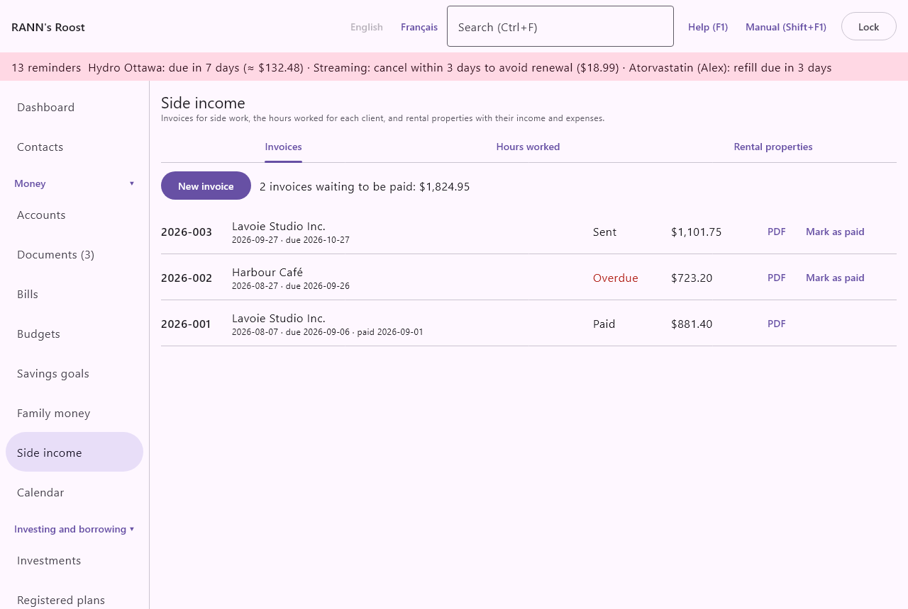
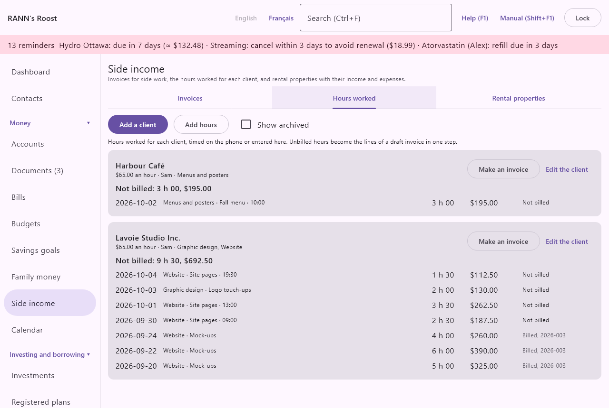

# Side income

Side income is for money the household earns outside a regular job: tutoring, music lessons, crafts sold at a market, small contracts, or a property you rent out. It is in the **Money** group of the menu, under **Side income**.

@index: self-employment; freelance; small business; extra income; gig work

## The Side income screen {#screen}

The screen has a short explanation at the top and three tabs:

- **Invoices**: invoices you send to customers, saved as PDF, and whether they are paid.
- **Hours worked**: the hours worked for each client, and the unbilled hours turned into an invoice (see [Hours worked](#hours)).
- **Rental properties**: each property you rent out, with its income, expenses and net for a year, worked out from your transactions.

The screen opens on **Invoices**.

### Where the records are kept {#where-kept}

New invoices and properties are stored in the shared account group you are allowed to add to (or, if there is none, the first group you can add to), and the lists show those of every group you can see. Saving, changing or deleting needs permission to change records in that group; a user with read-only access sees the tabs but gets an error when saving. See [Users](users).

> Note: RANN's Roost does not prepare a T2125 (business income) or a T776 (rental income) and does not give tax advice. The totals help you, or the person who prepares your return, fill them in.

## Invoices {#invoices}

@index: invoice; bill a customer; receivables; accounts receivable; GST/HST registrant; QST; PST; overdue invoice

An invoice is a request for payment you send to a customer. RANN's Roost numbers it, adds sales taxes if you collect them, makes a PDF you can email or print, and, when the customer pays, can record the deposit in your bank account as self-employment income.

### The list of invoices {#invoice-list}

At the top:

- **New invoice**: opens the [invoice dialog](#invoice-dialog) with the next number of the year already filled in.
- When invoices are waiting to be paid, a line such as "2 invoices waiting to be paid: $1,250.00". It counts the invoices whose status is **Sent** and gives one total per currency, the base currency first, such as "3 invoices waiting to be paid: $1,250.00 + US$400.00".

Each invoice is listed, newest first, with:

- its number;
- the customer, and under it the date issued, "due" and the due date if there is one, and "paid" and the date it was paid;
- its status: **Draft**, **Sent**, **Paid** or **Cancelled**, or **Overdue** in red when it is **Sent** and its due date has passed;
- its total, taxes included;
- **PDF**: saves the invoice as a PDF (see [The invoice PDF](#invoice-pdf));
- **Mark as paid**: shown for a **Draft** or **Sent** invoice; opens the [Mark as paid dialog](#mark-paid).

Click an invoice anywhere else on its line to open it in the invoice dialog.

### New invoice dialog {#invoice-dialog}

The same dialog creates an invoice (**New invoice**) or changes one (**Edit the invoice**).

- **Number**: the invoice number. A new invoice gets the year and the next number, such as 2026-001, then 2026-002: the highest number already used in that form for the year, plus one. You can type any other number, but each number can be used only once.
- **Customer**: who the invoice is for, such as a person or a business name. Required. It is printed under **Bill to** on the PDF and becomes the payee of the deposit.
- **Customer address and details**: the customer's address and anything else to print under their name, such as an email or a purchase order number. Several lines are allowed; each prints on its own line.
- **Issued**: the invoice date, as YYYY-MM-DD. Today by default. For a new invoice, the number follows the year of this date: change it to a day of last year, and the number proposed becomes the next one of last year (such as 2025-014). A number you typed yourself is left as it is.
- **Due**: the date payment is due, optional. It cannot be before **Issued**. A **Sent** invoice past this date shows **Overdue** in the list.
- **Status**:
  - **Draft**: being prepared; not counted as waiting to be paid.
  - **Sent**: sent to the customer; counted in the waiting-to-be-paid line and can become **Overdue**.
  - **Paid**: the customer paid. Usually set with **Mark as paid**, which also records the date and can record the deposit.
  - **Cancelled**: kept for your records, but no longer expected.
- **From**: who the invoice is from: a member of the household, or **Household**. The PDF prints the member's name, or the household's name for **Household**, at the top. The deposit recorded with **Mark as paid** is also assigned to this member.
- **Lines**: what you charge for, one line each:
  - **What it was for**: the description, such as "Math tutoring, 4 sessions". A line without a description is dropped when you save.
  - **Quantity**: a number such as 1, 4 or 2.5 (a comma also works). 1 by default.
  - **Price**: the price of one unit, such as 45.00. Currency signs and spaces are ignored.
  - **✕**: removes the line. The last remaining line cannot be removed.
  Each line's amount is the quantity times the price, rounded to the cent; the subtotal is the sum of the lines. Every line kept needs a description, a quantity and a price.
- **Add a line**: adds an empty line with a quantity of 1.
- **Sales tax**: the federal sales tax you charge, **GST** or **HST**.
- **Rate (%)**, next to it: the rate of that tax in percent, such as 5 for GST or 13 for HST in Ontario. Leave empty if you do not charge it.
- **Provincial tax**: the provincial sales tax you charge: **QST** in Quebec, **PST** in British Columbia and Saskatchewan, **RST** (retail sales tax) in Manitoba. It starts on the tax of the province of the person in **From**.
- **Rate (%)**, next to it: the rate of that tax in percent, such as 9.975 for the QST, 7 for the PST in British Columbia or the RST in Manitoba. Leave empty if you do not charge it. Rates are kept exactly as typed, decimals included: 9.975 stays 9.975.
- The line under the taxes shows the rates in effect on the **Issued** date in the province of the person in **From** (their own province, or the household's when they have none or **Household** is chosen), such as "Ontario, in effect on 2026-10-05: HST 13 %". These rates come from [Rates and rules](rates-rules), where every rate has the date it takes effect, so an invoice dated before a change gets the rate of its day (for example 15 % HST in Nova Scotia until March 31, 2025, and 14 % from April 1, 2025).
- **Use the rates in effect**: fills both taxes and rates with the ones shown. From then on, changing **Issued** or **From** fills them again, until you type a rate yourself. You can always change the rates before saving.

A new invoice starts with the rates in effect when the last invoice of the same person charged sales tax; otherwise the rates start empty. Leave both rates empty unless you are registered to collect sales taxes. Each tax is the rate applied to the subtotal, rounded to the cent, and the total is the subtotal plus the taxes. For an invoice dated in Quebec before 2013, the QST is worked out on the subtotal plus the GST, as it was then.

- **Notes on the invoice**: printed at the bottom of the PDF, such as payment instructions ("Interac e-Transfer to …") or a thank-you.
- **Delete**: shown when changing an invoice. Asks "Delete invoice number to customer?" first. When the deposit recorded with **Mark as paid** is still in the books, the question also offers **Also delete its deposit of amount on date in account**, unticked by default: leave it unticked when the money was really received, and the deposit stays in the account; tick it to remove the deposit too, for example when the invoice was marked paid by mistake. A reconciled deposit is deleted only after you confirm it again. Once confirmed, the delete cannot be undone.
- **Save** saves the invoice; **Cancel** closes without saving.

The invoice's currency is the household's base currency when it is created.

@index: invoice number; small supplier; sales tax on invoices; RST; retail sales tax; rates in effect

> Tip: In Canada, you generally do not have to register for the GST/HST while you are a small supplier (taxable sales of $30,000 or less over four calendar quarters). Check the CRA's rules, and Revenu Québec's for the QST.

### The invoice PDF {#invoice-pdf}

**PDF** on an invoice's line asks where to save the file, suggesting a name such as "Invoice 2026-001.pdf" (".pdf" is added if you leave it out), writes it, then opens it with your PDF viewer. Nothing is saved if you cancel.

The PDF is a letter-size page in the language you are using in RANN's Roost, with:

- "Invoice" and its number as the title, then the name from **From**;
- **Bill to**, the customer and the customer's details;
- the date issued and, if there is one, the due date;
- a table of the lines: description, quantity, price and amount;
- the subtotal, one line per sales tax with its rate and amount (such as "GST (5 %)"), and the total;
- the notes on the invoice.

Make the PDF again after any change; it is not kept in RANN's Roost.

### Mark as paid dialog {#mark-paid}

**Mark as paid** opens a small dialog that shows the invoice's number, customer and total.

- **Paid on**: the day the payment was received, as YYYY-MM-DD. Today by default.
- **Record the deposit**: shown when you have at least one bank account in the invoice's currency; on by default. When on, saving also enters the payment in that account.
- **Paid into**: the bank account the payment went into.

Saving sets the invoice to **Paid** with that date. With **Record the deposit**, it also adds a deposit to the account on that date for the invoice's total:

- the payee is the customer;
- the category is **Self-employment income**, and the invoice number is noted on it;
- the person is the one in **From**;
- the sales taxes collected (GST, HST, QST or PST) are recorded on the deposit, so its **Sales tax…** details in the register show them.

The deposit is an ordinary transaction: it changes the account's balance and appears in the register and in reports like any other. See [Accounts](accounts). If you already entered the payment yourself, turn **Record the deposit** off so it is not entered twice.

## Hours worked {#hours}

@index: timesheet; billable hours; hourly rate; time tracking; timer; clients

The **Hours worked** tab keeps the hours worked for each client, timed on the phone or entered here, and turns the hours not billed yet into the lines of an invoice in one step.

### The list of clients {#hours-list}

- **Add a client**: opens the [client dialog](#client-dialog).
- **Add hours**: opens the [hours dialog](#hours-dialog); shown once there is a client.
- **Show archived**: also lists the clients marked archived.

Each client is a card: its name, its hourly rate, who does the work and its tasks. **Not billed** gives the hours not on an invoice yet and what they come to at their rates, or **Everything is billed.** Below, the client's last hours, newest first: the date, the task, the description, the start time, **from the phone**, the time worked, the amount and **Not billed** or **Billed** with the invoice's number. Click a line to change or delete it. **Make an invoice** opens the [invoice step](#hours-invoice); **Edit the client** opens the client dialog.

Hours whose invoice was deleted count as not billed again.

### Add a client dialog {#client-dialog}

- **Client**: the name, as it should appear on the invoice. Required.
- **Customer address and details**: the address and other details printed on the invoice.
- **Hourly rate**: in the household's base currency; optional, but hours without any rate cannot be billed.
- **Who does the work**: the household member, or **Household**. It becomes the person invoicing.
- **Tasks**: kinds of work for this client, each with a **Task** name and, when it differs from the client's, its own **Rate**. **Add a task** adds a line; ✕ removes it. A task removed after hours were entered for it is kept, archived, so those hours keep their name.
- **Notes**, **Store in** (for a new client, when you may change several account groups), **Archived** and **Delete**. Deleting a client deletes its tasks and hours; invoices already made stay.

### Add hours dialog {#hours-dialog}

- **Client**: for new hours.
- **Task**: one of the client's tasks, or —.
- **Date**, **Start (HH:MM)** (optional) and **Time (h:mm)**: the time as hours and minutes (1:30) or in hours (1.5), from 1 minute to 24 hours.
- **Description**: what was done; it names the invoice line when there is no task.
- **Rate for these hours**: only when these hours have a rate of their own. Empty: the task's rate, or else the client's.
- **Delete**: asks first.

Changing hours already on an invoice does not change the invoice.

### Make an invoice {#hours-invoice}

**Make an invoice** lists the client's hours not billed yet, all ticked; untick those to leave for later. Choose the **Issued** date and click **Make an invoice**. RANN's Roost makes a draft invoice to the client, numbered as the next of that year, with one line per task and rate: the task (or the description) with the dates, the hours as the quantity (to two decimals) and the rate as the price. Its sales taxes follow the person's last invoice. The hours are marked billed on it. Open the invoice on the [Invoices](#invoices) tab to check it, change its taxes and send it.

## Rental properties {#rentals}

@index: rental income; landlord; T776; duplex; rent; rental expenses; co-owned property

This tab adds up the income and expenses of each property you rent out, for a calendar year. It does not ask you to enter the amounts again: it works from the transactions you already have in your accounts, using a tag.

How it works:

1. Add the property here. A tag with the property's name is created.
2. In the account registers, put that tag on the property's rent received and on its expenses (insurance, repairs, property tax, mortgage interest, utilities you pay).
3. Choose the year here: the property's card adds up those transactions by category.

### The list of properties {#rental-list}

- **Tax year**: the calendar year to add up, from this year back six years. From January to March it starts on last year, the one you are filing for; from April on, on this year.
- **Add a property**: opens the [property dialog](#rental-dialog).

Each property has a card, in name order, with:

- its name, its address and "tag:" with the name of its tag;
- **Edit**: opens the property dialog;
- **Income**: the total of the transactions with its tag in income categories, for the year;
- one line per expense category, with the total spent in it, then **Expenses**: the total of all the expense categories;
- **Net**: income less expenses;
- **The household's share (…%)**: shown when the household owns less than all of the property: its share of the net.

The figures follow your categories: a transaction split between categories counts in each one. Transactions without the tag are not counted, even if they concern the property.

### Add a property dialog {#rental-dialog}

- **Name**: the property's name, such as "Duplex on Bank Street". Required. When you add a property, a tag with this name is created for its transactions; if a tag with that name already exists, that tag is used. Renaming the property later renames its tag too ("The property's tag is renamed with it."), so the tagged transactions keep counting. If another tag already has the new name, the app says "Another tag is already named "name". Choose another name." and nothing is saved.
- **Address**: the property's address, shown on its card.
- **The household's share (%)**: the part of the property the household owns, from 0.01 to 100. 100 by default. For a property owned half with someone else, enter 50: the card then shows the household's share of the net.
- **Notes**: anything to remember about the property.
- **Delete**: shown when changing a property. Asks "Delete name? Its transactions are kept." with a box **Also remove the tag "tag" from the tags and from the transactions that have it**, unticked by default. Unticked, the tag stays on the transactions and in the tag list. Ticked, the tag is removed from the list and from every transaction that had it, unless another property uses the same tag; the transactions themselves stay. It cannot be undone.

> Tip: When you own a property with someone outside the household, record only the household's own payments and receipts in your accounts and leave the share at 100, or record the whole property's amounts and enter your share. Choose one way and keep to it.
