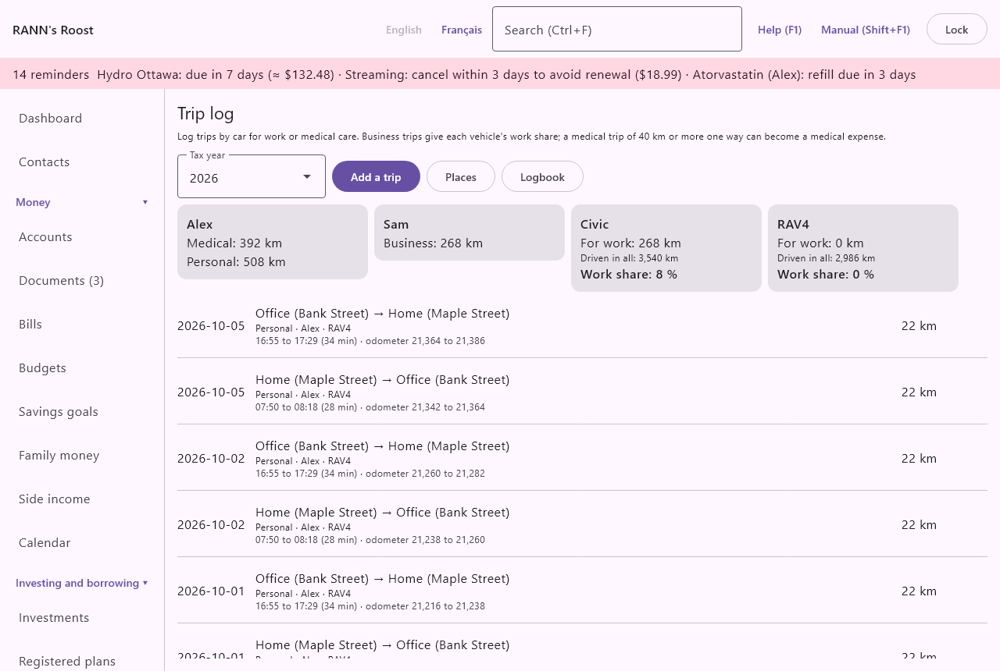
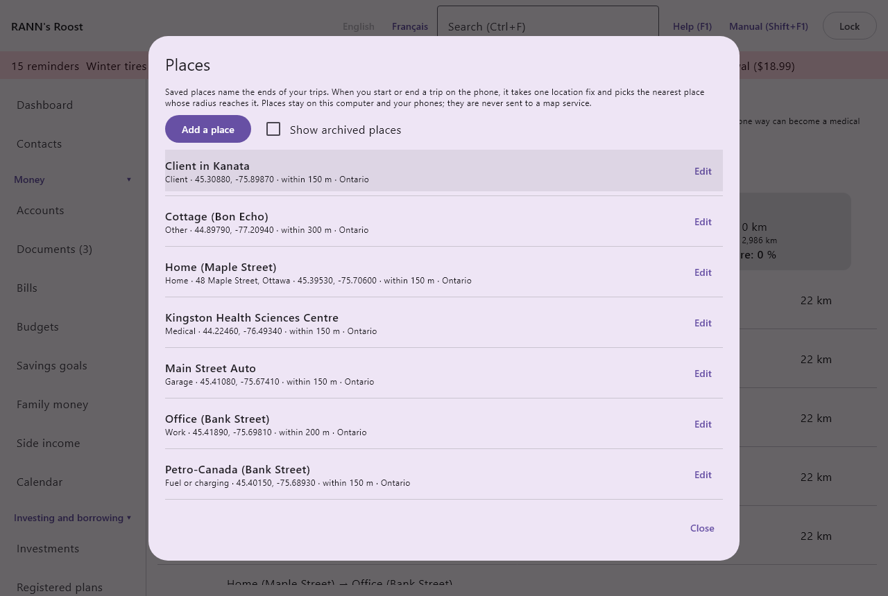
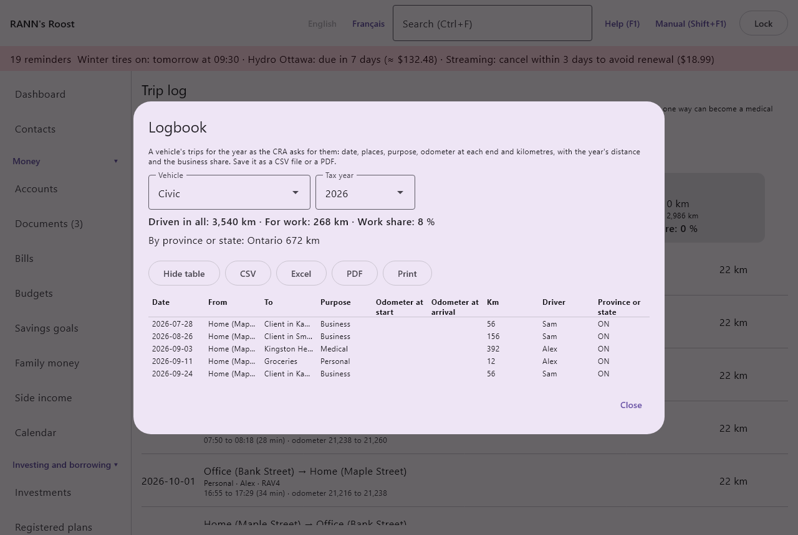

# Trip log

The trip log keeps the trips you make by car: for work, for medical care, or any trip you start and end on the phone. From it, RANN's Roost adds up each person's kilometres by purpose, works out the share of each vehicle's driving that was for work, prints the logbook the CRA asks for, counts the kilometres in each province or state, and turns a long medical trip into a medical expense. Trips driven with the phone also give the vehicle its odometer readings and show how towing changes fuel use. It is in the **Home and family** group of the menu, under **Trip log**.

@index: mileage log; logbook; kilometres; business use of a vehicle; work kilometres; vehicle expenses

> Note: The CRA expects a logbook of business or employment driving (date, destination, purpose and distance) to support a claim for vehicle expenses, along with the total kilometres driven in the year. RANN's Roost does not give tax advice; check the CRA's rules before claiming.

## The Trip log screen {#screen}

At the top of the screen:

- **Tax year**: the calendar year shown, from this year back six years. The cards and the list show only the trips dated in that year.
- **Add a trip**: opens the [trip dialog](#trip-dialog) for a new trip.
- **Places**: opens the saved [places](#places).
- **Logbook**: opens a vehicle's [logbook](#logbook) for the year, to save as CSV or PDF.

New trips are stored in the shared account group you are allowed to add to (or the first group you can add to). Saving, changing or deleting needs permission to change records there.

### The summary cards {#cards}

When the year has trips or vehicle readings, cards appear above the list.

One card per person (or **Household** for trips not tied to anyone) lists their kilometres for the year by purpose, such as "Business: 1,240 km" and "Medical: 392 km". Round trips count twice their one-way distance.

One card per vehicle that has work trips or odometer readings in the year shows:

- **For work**: the kilometres of the year's **Business** and **Employment** trips with this vehicle.
- **Driven in all**: the kilometres driven in the year, from the vehicle's odometer readings: the last reading of the year less the first. It needs at least two readings in the year; otherwise the card asks you to add odometer readings at the start and end of the year.
- **Work share**: the work kilometres as a percentage of all the kilometres driven, rounded and never above 100 %. This is the business-use share asked for when claiming vehicle expenses.

Odometer readings are entered on the [Vehicles](vehicles) screen, or sent from the phone with **Odometer or hours** (see [RANN's Roost Mobile](phone-app#odometer-form)); trips with odometer readings count as readings too. Inactive vehicles keep their cards for the years they were used.

When the year's trips were driven in more than one province or state, a card **By province or state** lists the kilometres in each, such as "Ontario: 1,240 km" and "QC: 64 km": the figures fuel tax reports such as IFTA ask for. Each trip counts where it was driven, as chosen on the trip (see **Province or state** below); by default, where it started.

@index: work share; odometer; business-use percentage

### The list of trips {#trip-list}

The year's trips are listed newest first. Each line shows:

- the date;
- where from and where to ("Home → Client office"), with **↺** for a round trip;
- the purpose, the person, the vehicle and the notes;
- when known, a second line: the times ("16:30 to 18:45 (2 h 15)"), the odometer at each end, what was towed or carried ("towing: Utility trailer (5 x 8)" or "Heavy load"), the passengers, and "from the phone" with the phone's name for a trip driven with the phone;
- **Add to medical expenses**, for a **Medical** trip of 40 km or more one way (see [Medical travel](#medical-travel)); once the trip is added, it reads **Added to medical expenses** and can no longer be clicked;
- the distance, doubled for a round trip.

Click a trip to change or delete it. With no trips in the year, the list says so.

## Add a trip dialog {#trip-dialog}

The same dialog adds a trip (**Add a trip**) or changes one (**Edit the trip**).

- **Date**: the day of the trip, as YYYY-MM-DD. Today by default. It decides which year the trip counts in.
- **Left at** and **Arrived at**: the times, as HH:MM, such as 07:50. Optional. An arrival earlier than the departure is taken as the next day. The list shows the time travelled.
- **Purpose**: why you drove. It decides which totals the trip counts in:
  - **Business**: driving for a business you run, such as visiting clients for your side work. Counts as work kilometres for the vehicle.
  - **Employment**: driving your employer requires, other than getting to and from work. Counts as work kilometres for the vehicle.
  - **Medical**: driving to medical care. Can become a medical expense when it is 40 km or more one way.
  - **Personal**: anything else. Counted in the person's totals only.
  A new trip starts as **Business**.
- **From the place** and **To the place**: a saved [place](#places), or "(no saved place)". Choosing one fills in **From** or **To** with its name. A trip starting at a place counts in that place's province or state.
- **From**: where you left from, such as "Home". Optional.
- **To**: where you went, such as a client's address or a hospital. Required, unless **To the place** is chosen.
- **Odometer at start** and **Odometer at arrival**: the readings, in whole kilometres. With both, the distance is their difference, shown beside them, and the trip is one way: "With both odometer readings, the distance is their difference, one way; the readings also count as the vehicle's odometer readings." The arrival must be higher than the start, by less than 10,000 km.
  A new trip proposes the vehicle's latest reading at the start. A start below the vehicle's last reading on or before the trip's date shows "Lower than the vehicle's last reading, 61,480 km. Check it; to keep it anyway, choose Save again.": a typo is caught, and a reading you know is right is kept with a second **Save**.
- **Kilometres one way**: shown without both odometer readings: the distance one way, such as 23.5 (a comma also works). Required, more than zero and under 10,000. It is kept to one decimal.
- **Round trip**: shown without both odometer readings: on when you came back the same way; the trip then counts twice the distance. On by default.
- **Person**: who made the trip, or **Household**. It decides which person's card the trip counts in and is suggested as the patient when adding it to medical expenses.
- **Vehicle**: the vehicle used, or **No vehicle**. Only trips with a vehicle count towards that vehicle's work share. A new trip proposes the first vehicle in use. A saved trip keeps its own choice: **No vehicle** stays **No vehicle**, and a vehicle sold or retired since stays in the list for that trip.
- **Towing or load**: **Normal**, **Towing a trailer** or **Heavy load**. It decides which kind of driving the trip's kilometres count for in the fuel consumption of the [Vehicles](vehicles#consumption) screen and in its [forecast](vehicles#forecast-tab).
- **Trailer**: when towing, the trailer, among the assets of the kind trailer in [Home and assets](assets), or "(none)".
- **Passengers**: who rode along, as you like to write it, such as "Sam, Maya".
- **Province or state**: two letters, such as ON, QC or NY. Empty: the province of the place the trip started from, otherwise the person's (or the household's).
- **Notes**: anything to remember, such as the client or the reason for the visit.
- "from the phone": for a trip driven with the phone, the phone it came from.
- When **Medical** is chosen, a reminder explains that a medical trip counts as a medical expense when the care is 40 km or more away, one way, and not available closer to home. The 40 km is a figure of [Rates and rules](rates-rules) (Medical travel: minimum distance), read for the trip's date.
- **Delete**: shown when changing a trip. Asks "Delete the trip of date to destination?" and, once confirmed, deletes it. It cannot be undone. A medical expense made from the trip stays on the Medical claims screen.

## Trips from the phone {#from-phone}
@index: GPS; location; trip on the phone; Start; Arrive

On the phone, **Trip** on the Capture tab starts a trip and, later, ends it (see [RANN's Roost Mobile](phone-app#trip-form)). The phone takes one location fix when you start and one when you arrive, never in between, and names each end after the nearest saved place within its radius. When you arrive, it sends the trip like a capture; the computer adds it to the trip log with:

- the date and times, the vehicle, the driver and the passengers;
- the places at both ends, or the name you typed, or the coordinates when the place was not named;
- the odometer at both ends, the distance being their difference;
- the purpose you confirmed, what was towed or carried, and the notes;
- the province of the place it started from (or the household's);
- the phone it came from.

The trip goes to the account group the phone sends to (see [Phones](phones)), its odometers become readings of the vehicle, and places saved on the phone are added to the places. A trip received twice is kept once. A trip whose arrival odometer is not above the start is refused, and the phone shows why.

## Places {#places}
@index: saved places; location; home; work; client; geofence; radius

**Places** lists the saved places: name, kind, address, coordinates and radius, province or state, and "saved on the phone" for a place made there. Click one, or **Edit**, to change it. **Add a place** adds one. **Show archived places** includes the ones archived.

The phone receives the places of every account group you can see, matches its location fix at the start and end of a trip to them, and lets you add the place where you are or rename one. Places stay on this computer and your phones, inside the household's encrypted files; they are never sent to a map service, and the app never looks up an address.

### Add or edit a place {#place-dialog}

- **Name**: such as "Home", "Office (Bank Street)" or "Kingston Health Sciences Centre". Required. It is what the trip log and the phone show.
- **Kind of place**: **Home**, **Work**, **Client**, **Store**, **Fuel or charging**, **Garage**, **Medical** or **Other**. On the phone, the purpose of a trip is suggested from it: to or from a **Client** is **Business**; to a **Medical** place, or home from one, is **Medical**; other trips in a commercial vehicle are **Business**, and everything else is **Personal**. The drive between home and your usual workplace is personal for the CRA.
- **Address**: for your reference.
- **Latitude** and **Longitude**: "The latitude and longitude come from the phone when a place is saved there. To enter them here, copy them from a map app you trust, such as 45.42153 and -75.69719. Without them, the phone cannot recognize the place." Both or neither.
- **Radius (m)**: how close a location fix must be to count as this place, from 10 to 5,000 metres; 150 by default. Use a larger radius for a big site such as a hospital or a cottage lot.
- **Province or state**: two letters. Trips starting here count in that province or state.
- **Notes**.
- **Store in**: the account group the place is kept in, chosen when it is added.
- **Archived (no longer offered on the phone)**: when editing; the place stays on the trips that used it.
- **Delete**: when editing; asks "Delete the place name? Trips keep its name." and cannot be undone.

## Logbook {#logbook}
@index: CRA logbook; mileage log export; business-use logbook; IFTA; kilometres per province; CSV; PDF

"A vehicle's trips for the year as the CRA asks for them: date, places, purpose, odometer at each end and kilometres, with the year's distance and the business share. Save it as a CSV file or a PDF."

- **Vehicle** and **Tax year**: the logbook shown. The first vehicle whose use is not personal is proposed.
- A line with the kilometres driven in the year from the odometer, the work kilometres and the work share, as on the vehicle's card.
- **By province or state**: the year's kilometres with this vehicle in each province or state.
- **CSV**, **Excel** and **PDF**, above the table: ask where to save the file, in that format. The file has the table and, under it, the year's distance and work share. **Print** prints it; **Hide table** folds the table away.
- The table: **Date**, **From**, **To**, **Purpose**, **Odometer at start**, **Odometer at arrival**, **Km**, **Driver** and **Province or state**, oldest first.

> Note: The CRA asks that a logbook show, for each business trip, the date, the destination, the purpose and the kilometres, and the odometer at the start and end of the year. Trips driven with the phone give all of these. Keep the files with your tax records.

## Medical travel {#medical-travel}

@index: medical travel; travel expenses for medical care; 40 km; 80 km; medical expense tax credit; METC; rate per kilometre

When medical care is not available near home and you travel 40 km or more one way to get it, the cost of the trip can count as a medical expense for the medical expense tax credit. The CRA's simplified method lets you claim a set rate per kilometre instead of keeping every receipt; the CRA publishes the rate for each province every year. (Trips of 80 km or more one way can also allow other costs, such as meals and lodging; record those on the [Medical claims](medical) screen.)

A **Medical** trip whose one-way distance is 40 km or more shows **Add to medical expenses** in the list.

### Add to medical expenses dialog {#to-medical-dialog}

- The first line shows the trip's date and destination, followed by a reminder that the CRA publishes a rate per kilometre for each province and territory every year, and that the rate shown comes from [Rates and rules](rates-rules).
- **Person**: the patient, whose medical expense it becomes. The trip's person by default, or else the first member of the household. The rate follows this person's province or territory (the household's, unless the person has their own), as the travel begins where they live.
- Under the person, a line says where the rate comes from: the rate for the province in effect from a date, built in (with the CRA source) or the household's own; or that there is no rate for the province yet.
- **Rate per kilometre**: in dollars, such as 0.62 or 0.605 (the CRA's rates can have a half cent). It is filled in with the Medical travel: rate per kilometre of Rates and rules for the trip's date and the person's province: the CRA publishes each year's rates early in the next year, so until then the last year's rate is shown. You can change it for this trip. A rate typed for a year in an earlier version of the app is still used for that year.
- **Keep this rate for province from January 1, year, in Rates and rules**: for an administrator only. When checked and the rate was changed, the rate is also added to Rates and rules as the household's own for that province from January 1 of the trip's year, so it is filled in for the next trips.

**Save** is available once a person and a rate are chosen. It:

1. keeps the rate in Rates and rules, when the box above is checked;
2. adds a medical expense for the person on the [Medical claims](medical) screen, of the type **Travel for medical care**, dated and paid on the trip's date, for the rate times the trip's kilometres (doubled for a round trip), described as the destination and the distance.

The expense then counts in the medical claim like any other. A trip is added only once: its button then reads **Added to medical expenses**. To add it again, for example at another rate, delete the expense on the Medical claims screen first; the button comes back.
