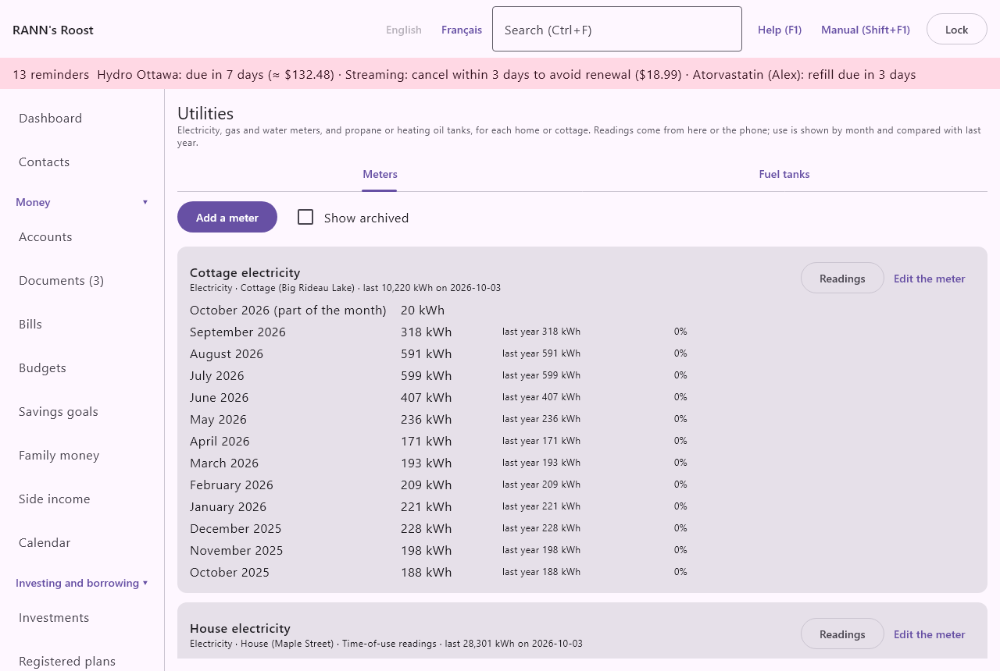
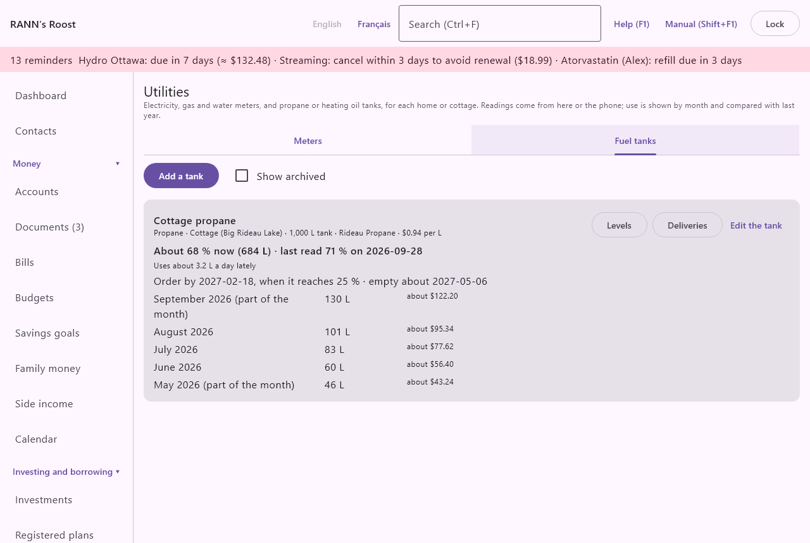

# Utilities

Utilities follows the electricity, natural gas and water meters and the propane or heating oil tanks of each home or cottage, or of the household as a whole. From the readings, RANN's Roost works out the use of each month, compares it with the same month last year, flags a month that used much more than usual, estimates what a unit costs, and tells you when a tank should be ordered. It is in the **Home and family** group of the menu, under **Utilities**.

@index: hydro; electricity; natural gas; water meter; kWh; cubic metres; propane; heating oil; fuel oil; meter reading; consumption

## The Utilities screen {#screen}

The screen has two tabs: [Meters](#meters) and [Fuel tanks](#tanks). On each:

- **Show archived**: also lists the meters or tanks marked archived, such as the meter of a house you sold.

New meters and tanks are kept in the first shared account group you may change; when you may change more than one, the dialog asks where (**Store in**). Their readings and deliveries stay with them. Adding or changing a meter or tank needs permission to change records in its group; adding a reading needs only permission to add records, so someone who captures receipts can also send readings from the phone. Buttons the books would refuse are greyed out or hidden: **Add a meter** and **Add a tank** for someone who may change no group, **Edit** on a meter or tank of a group they may only view, and the ✕ on readings and deliveries for someone who may not change them.

## Meters {#meters}

Each meter is a card. Its first line names it; under it come what it measures, the home or cottage (or **Household**), **Time-of-use readings** when on, the last reading with its date and, when the meter has a bill, the cost per unit, such as "$0.1342 per kWh".

Under it, one line per month, newest first, for the last thirteen months that have readings:

- the month, with **(part of the month)** when the readings do not cover all of its days (the first and the current month);
- the use, in kWh for electricity and in cubic metres (m³) for gas and water;
- **last year**: the same month a year before, when it was complete, and the change in percent;
- **about**: the cost of the month at the cost per unit, when there is one;
- **Unusual**, in red, for a complete month that used more than 130% of the same month last year or, when there is no such month, of the average of the three complete months before (at least two of them). The percentage is **Unusual utility use (percent)** in [Rates and rules](rates-rules).

The latest complete month, when it is unusual and is last month or the month before, also appears with the other reminders, on the [Dashboard](dashboard#needs-attention) under **Needs your attention**, in the computer's notification and on the phone's Summary, such as "Cottage hydro: unusual use in September 2026 (+35% on the same month last year)", or "above the months before" when there is no month last year to compare with. Clicking it opens Utilities. An older unusual month shows only here.

@index: unusual use; same month last year; month over month; unusual use reminder

### How the use is worked out {#use}

A meter counts up. The use between two readings is the difference, spread evenly over the days between them: a reading on January 21 and the next on March 2 give January 11 days of it, February 28 and March 1. Several readings on the same day count as the last one. A reading lower than the one before is taken as a new or reset meter: that period counts nothing, and counting starts again from it.

The cost per unit is what the meter's bill came to over the last 12 months (the amounts paid, and the estimates of the bills not paid yet) divided by the use of the 12 months before this one. It is an average that includes the fixed charges, delivery and taxes; it is not the rate printed on the bill.

### Add a meter dialog {#meter-dialog}

**Add a meter** opens it; **Edit the meter** on a card opens it for that meter.

- **Name**: required; for example "House electricity".
- **Measures**: **Electricity** (kWh), **Natural gas** (m³) or **Water** (m³). It sets the unit shown.
- **Home or cottage**: the home or cottage among your [assets](assets) (houses and cottages only), or **Household** when it belongs to none.
- **Time-of-use readings**: for electricity only. Tick it when the meter keeps on-peak, mid-peak and off-peak totals, as in Ontario; each reading can then give the three registers.
- **Bill for the cost per unit**: one of your [bills](bills), such as the electricity bill, or **None**. Without a bill, no cost is shown.
- **Notes**: anything to remember, such as where the meter is.
- **Store in**: for a new meter, when you may change several account groups.
- **Archived (no longer read)**: on an existing meter; it leaves the list unless **Show archived** is ticked, and the phone no longer offers it. Its readings stay.
- **Delete**: asks first, then deletes the meter and all its readings. It cannot be undone.

### Readings window {#readings}

**Readings** on a card lists the meter's readings, newest first: the date, the reading, the three registers for time of use, **from the phone** when sent from it, and the notes. The ✕ on a line deletes that reading, after asking.

Under the list, **New reading**:

- **Date**: the day the meter was read, as 2026-10-05.
- **Reading (kWh)** or **Reading (m³)**: the number on the meter, with or without decimals.
- **On-peak**, **Mid-peak**, **Off-peak**: with time of use only. Leave **Reading** empty to use the total of the three.
- **Notes**: optional.

**Add the reading** saves it; **Close** leaves without adding.

@index: time-of-use; on-peak; off-peak; mid-peak

## Fuel tanks {#tanks}

Each tank is a card: its name, the fuel, the home or cottage, its capacity, the supplier and, when deliveries have a cost, the price of a litre over the last 12 months. Then:

- **About 64 % now (640 L)**: the level estimated for today, from the last level reading, the deliveries since and the use per day, and the last reading itself.
- **Uses about 4.8 L a day lately**: the average use per day over the readings of the last 90 days.
- **Order by** a date, **when it reaches 25 %**, and when it would be empty at that pace. The date is in red when it is within the reminder's days.
- one line per month with the litres used, and their cost at the recent price.

Two level readings are needed before any use or date can be shown.

@index: propane order; fuel delivery; tank level; gauge

### How the use and the order date are worked out {#tank-use}

The use between two level readings is the level at the first, plus what was delivered after it up to the second, less the level at the second. A reading on the day of a delivery is taken as made after the delivery. When the gauge reads more than that would give, the period counts nothing.

The level today is the last reading plus the deliveries since, less the use per day for each day since, never below empty or above the capacity. The order date is when it is expected to reach the order level; fourteen days before (**Fuel order reminder (days ahead)** in [Rates and rules](rates-rules)), a reminder "time to order fuel" appears with the other reminders on the [dashboard](dashboard) and among the renewals in the [calendar](calendar), and the phone shows a notification and the tank under **Utilities** on its Summary. Until two readings show a use per day, there is no order date, except that a reading at or below the order level reminds at once. Use changes with the seasons, so the date is an estimate: read the gauge every few weeks.

### Add a tank dialog {#tank-dialog}

- **Name**: required; for example "Cottage propane".
- **Fuel**: **Propane** or **Heating oil**.
- **Home or cottage**: as for a meter.
- **Capacity (litres)**: required, more than zero. Levels typed in litres are kept as a percentage of it.
- **Order at (%)**: from 1 to 90. Empty uses **Order fuel at (percent of the tank)** of Rates and rules, 25 % unless changed.
- **Supplier**: who delivers; it becomes the payee of the payments recorded with deliveries.
- **Notes**, **Store in**, **Archived (no longer read)** and **Delete** as for a meter. Deleting a tank deletes its readings and deliveries; payments recorded stay in the accounts.

### Levels window {#tank-readings}

**Levels** lists the gauge readings, newest first, in percent and in litres. Under **New level reading**, enter the **Date** and either **Level (%)** (0 to 100) or **Litres** (up to the capacity), and the notes. **Add the reading** saves it.

### Deliveries window {#deliveries}

**Deliveries** lists the deliveries, newest first: litres, cost and **payment recorded** when a payment was recorded with it. Under **New delivery**:

- **Date** and **Litres**: required.
- **Cost**: optional; it gives the price of a litre.
- **Record the payment in an account**: with a cost, also records the payment in the account you choose (bank and credit card accounts), to the supplier, in the **Heating (gas, oil)** category, with the litres as memo.
- **Notes**: optional.

Deleting a delivery asks first and offers to delete the payment recorded with it too.

## On the phone {#phone}

**Meter or tank reading** on the phone's Capture tab sends a meter reading (with the registers for time of use) or a tank level, in percent or in litres; see [RANN's Roost Mobile](phone-app#log-forms). Readings from the phone show **from the phone**.

The phone also hears of the tanks to order: a notification "Time to order fuel" naming the tank (no level or amount, since a locked phone may show it), once when the order date comes within the reminder's days and once on the day, and the tank with "order by" a date under **Utilities** on its Summary. Meters with an unusual month are listed there too. See [Notifications](phone-app#notifications).
