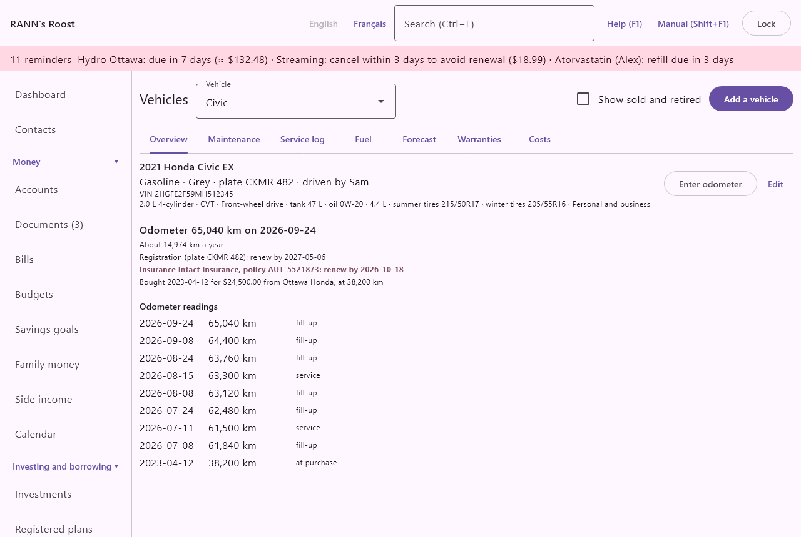
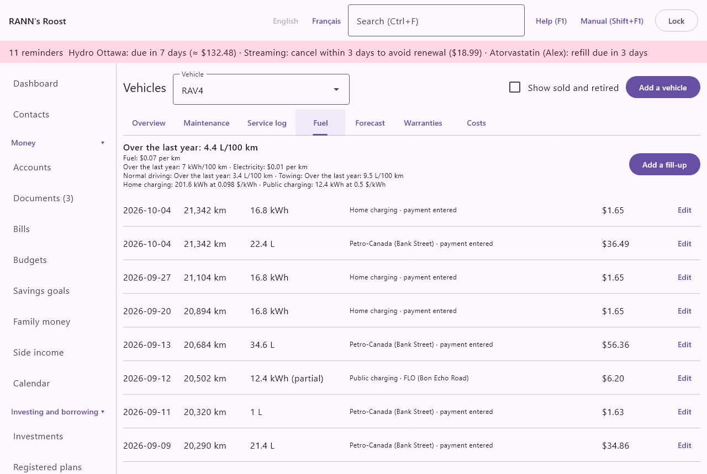
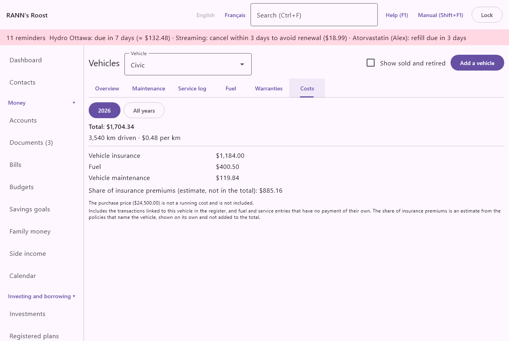

# Vehicles

The **Vehicles** screen follows each car, truck, motorcycle or other road vehicle: its papers, odometer, maintenance schedule, service log, fuel or charging, warranties, and what it costs to run. It is in the **Home and family** group of the menu. Other things with an engine, such as a boat, an RV or a trailer, go in [Home and assets](assets).

## The screen at a glance {#overview}
@index: car; truck; automobile; motorcycle

At the top:

- **Vehicle**: the vehicle shown. A vehicle sold or retired shows its status in brackets.
- **Show sold and retired**: unticked by default. Tick it to include vehicles no longer in use in the **Vehicle** list.
- **Add a vehicle**: opens a blank vehicle form. See [Add or edit a vehicle](vehicles#vehicle-form).

When there is no vehicle, the screen says "No vehicles yet." Otherwise seven tabs show the chosen vehicle: **Overview**, **Maintenance**, **Service log**, **Fuel**, **Forecast**, **Warranties** and **Costs**.

## Add or edit a vehicle {#vehicle-form}

**Add a vehicle**, or **Edit** on the **Overview** tab, opens the form, titled **Add a vehicle** or **Edit vehicle**. Only the name is required; **Save** stays unavailable until it is filled. After saving a new vehicle, the screen shows it.

### Details {#details}

- **Name**: "What you call it, for example "Civic" or "Sam's car"". Required. It is how the vehicle appears everywhere: lists, reminders, the register.
- **Make**, **Model** and **Year**: for example Honda, Civic, 2021. The year must be between 1900 and 2100. The overview's title is made of the year, make, model and trim.
- **Trim**: for example "EX" or "Sport".
- **Colour**.
- **Energy**: **Gasoline** (the default), **Diesel**, **Hybrid**, **Plug-in hybrid**, **Electric** or **Other**. **Electric** changes the **Fuel** tab to charges in kWh and leaves out the engine tasks (oil change, engine air filter) when adding the usual tasks.
- **Licence plate**: saved in capital letters. Shown on the overview and with the registration reminder.
- **Vehicle identification number (VIN)**: the 17-character number on the registration and the dashboard; saved in capital letters. It can be searched on the **Is it covered?** tab of [Home and assets](assets#covered-tab).
- **Main driver**: a household member, or "(none)". For your reference; shown on the overview.
- **Use**: **Personal** (the default), **Commercial** or **Personal and business**. It is shown on the overview when not personal. On the phone, a trip in a commercial vehicle is suggested as **Business**. The [logbook](trips#logbook) proposes the first vehicle that is not personal, and the **CVOR or NSC renewal** date is offered for a vehicle that is not personal.

### Technical details {#technical}
@index: engine; transmission; tire size; oil type; towing capacity; GVWR; gross vehicle weight rating; battery capacity

Under **Technical details**, all optional, for your reference when buying tires or oil, booking a service or hitching a trailer. What you enter shows on one line under the title on the **Overview** tab.

- **Engine**: as you describe it, such as "2.0 L 4-cylinder".
- **Transmission**: **Automatic**, **Manual**, **CVT**, **Dual-clutch** or **Single-speed (electric)**, or "(none)".
- **Drive**: **Front-wheel drive**, **Rear-wheel drive**, **All-wheel drive** or **Four-wheel drive**, or "(none)".
- **Fuel tank (L)**: the tank's capacity in litres, such as 47. Not shown for an electric vehicle.
- **Battery (kWh)**: the usable battery capacity, shown for a hybrid, a plug-in hybrid or an electric vehicle.
- **Summer tires** and **Winter tires**: the sizes on the sidewall, such as 215/50R17.
- **Engine oil** and **Oil capacity (L)**: the grade and how much an oil change takes, such as 0W-20 and 4.4. Not shown for an electric vehicle.
- **Towing capacity (kg)** and **GVWR (kg)**: the most the vehicle may tow, and its gross vehicle weight rating (the most it may weigh loaded), from the owner's manual or the sticker in the door frame. Whole kilograms, from 1 to 100,000.

Capacities accept a decimal comma or point and must be above zero.

### Purchase {#purchase}

Under **Purchase**:

- **Date**: when the vehicle was bought. If a maintenance task has never been done, its schedule counts from this date.
- **Price**: the purchase price, in the vehicle's currency (the household's base currency when the vehicle was created). It is shown on the overview but is not counted in the running costs.
- **Odometer (km)**: the reading at purchase. With the date, it counts as the first odometer reading, and as the starting point of distance-based tasks never done.
- **Seller**: the dealer or person.

### Registration and insurance {#registration-insurance}
@index: registration renewal; SAAQ; ServiceOntario; plate renewal; car insurance

Under **Registration and insurance**:

- **Registration renewal**: when the registration (plate) must be renewed.
- **Insurance renewal**: when the auto policy renews.
- **Insurer** and **Policy number**: shown on the overview with the insurance renewal.

- **Safety inspection due**: when the next safety inspection is due, such as the annual inspection of a commercial vehicle or a vehicle that must be inspected in your province.
- **CVOR or NSC renewal**: shown when the vehicle's **Use** is not personal: when the operator's registration must be renewed (the Commercial Vehicle Operator's Registration in Ontario, the National Safety Code certificate elsewhere).

Each date gives a line on the overview, in bold within 30 days and red once passed, and a reminder from 30 days before (the default renewal lead time, set in [Rates and rules](rates-rules)). See [Reminders and calendar](vehicles#reminders).

> Tip: To see whether the vehicle is covered by a policy, and to keep the policy's premiums and claims, add the auto policy on the **Insurance** tab of [Home and assets](assets#insurance-tab) and tick the vehicle under **What it covers**.

### Status, sale and retirement {#status}

When editing a saved vehicle:

- **Status**: **In use** (the default), **Sold** or **Retired**. A vehicle sold or retired is hidden from the **Vehicle** list (unless **Show sold and retired** is ticked), from reminders, from the maintenance lists and from the **Is it covered?** search. Its records are kept.
- **Date** and **Sale price**: shown when the status is not **In use**: when it was sold or retired, and for how much. The overview then shows a line such as "Sold on date for price" and, for a sale with a purchase price, the gain or loss on the sale (the sale price less the purchase price), for your information. The same line shows in the form while you edit.
- The sale in the books, shown when **Sold**: type a few letters of the buyer or the memo, or the amount, in **Find the sale**, then choose the deposit under **Matching deposits**. The line then reads "Sale: date · buyer · amount", the buyer being the deposit's payee; the date and sale price are filled in when empty. **Unlink** removes the link; the deposit itself stays. The overview shows the same line. Changing the status back to **In use** or **Retired** drops the link when you save.

### Store in and delete {#store-delete}

- **Notes**: anything about the vehicle.
- **Store in**: the account group the vehicle and all its records are kept in. For a new vehicle the first shared group is proposed. It cannot be changed afterwards.
- **Delete** (when editing): asks "Delete name with its maintenance, service and fuel records? Transactions linked to it are kept." Once confirmed, it cannot be undone. Changing the status to **Sold** or **Retired** is usually better, since it keeps the history.

Adding or changing a vehicle needs the **Edit** permission on its group. A user with **Capture only** permission can still enter odometer readings, services and fill-ups.

## Overview tab {#overview-tab}

The **Overview** tab shows:

- the title (year, make, model, trim), the energy, colour, plate and main driver, and the VIN;
- the technical details entered, and the use when it is not personal;
- **Enter odometer** and **Edit** buttons;
- "Odometer distance on date": the highest reading recorded, or "No odometer reading yet.";
- "About distance a year": your usual distance, from the readings of the last year, once there are readings at least two weeks apart;
- the registration and insurance lines, and the safety inspection and CVOR or NSC lines when they have a date, coloured as their dates approach;
- the purchase line, "Bought date for price from seller, at distance", when a purchase date or price is entered;
- for a vehicle no longer in use, its status, date and sale price, and for a sold one the gain or loss and the linked sale with its buyer;
- the notes;
- **Odometer readings**: the last 12 readings.

### Odometer readings {#odometer}
@index: mileage; kilometres; odometer

The app gathers readings from five places, shown in the list with their source:

- **at purchase**: the purchase date and odometer;
- **entered**: readings typed with **Enter odometer**;
- **fill-up**: the odometer of a fill-up or charge;
- **service**: the odometer of a service;
- **Trip**: the odometer at the start and at the arrival of a trip in the [Trip log](trips), such as one driven with the phone.

Only readings entered with **Enter odometer** have a **Delete** button, which asks "Delete the reading of 52,300 km on date?" first; the others are changed in their own record.

The readings are used for:

- the current odometer, which decides when distance-based maintenance is due;
- the usual distance per day, which forecasts when a distance will be reached;
- the distance driven and cost per kilometre on the **Costs** tab;
- the warranties limited by distance;
- the work share of the vehicle in the [Trip log](trips), which needs a reading near the start and near the end of the year.

### Enter odometer {#enter-odometer}

**Enter odometer** opens a small dialog titled with the vehicle's name:

- **Date**: today by default.
- **Odometer (km)**: the reading, in whole kilometres. Spaces and thousands separators are ignored. Required.

Enter a reading every month or two, or let fill-ups and services do it, so that forecasts stay right.

## Maintenance tab {#maintenance-tab}
@index: maintenance schedule; oil change; tire rotation; winter tires

"Each task repeats after a number of months, a distance, or whichever comes first. The forecast uses your usual distance per day."

Each active task shows a card with:

- its name, its interval ("every 6 months or every 8,000 km") and when it was last done, with the odometer;
- its state: **Next**, **Due soon** (in bold) or **Due now** (in red), with the due date and distance;
- "at your usual distance, around date": when the due distance should be reached, for a task with a distance;
- **Record as done** and **Edit**.

Tasks are sorted by their next date. Paused tasks follow, marked "(paused)", with **Edit**. When there are no tasks: "No maintenance tasks. Add the usual ones to start."

### Usual tasks {#usual-tasks}

**Add usual tasks** adds a common schedule, skipping the ones the vehicle already has:

- **Oil and filter change**: every 6 months or 8,000 km (not for an electric vehicle).
- **Tire rotation**: every 12 months or 10,000 km.
- **Install winter tires**: every year, due November 15, or December 1 in Quebec (the driver's province, or the household's).
- **Remove winter tires**: every year, due April 15.
- **Brake inspection**: every 12 months or 20,000 km.
- **Cabin air filter**: every 12 months or 20,000 km.
- **Engine air filter**: every 24 months or 30,000 km (not for an electric vehicle).
- **Yearly inspection**: every 12 months.

They count from today and the current odometer, except the winter tires, which fall due on their date. Edit any task to match your owner's manual, or pause the ones you do not need.

> Note: In Quebec, winter tires are required from December 1 to March 15 (from December 15 before 2019). Elsewhere the dates are suggestions. Both dates, by province, are in [Rates and rules](rates-rules).

### Add or edit a task {#task-form}

**Add a task** opens the form titled **Add a task**; **Edit** opens **Edit task**.

- **Task**: its name, for example "Transmission fluid". Required.
- "Fill in one or both: the task falls due at whichever comes first."
- **Every (months)**: from 1 to 240. A new task proposes 12.
- **Every (km)**: from 1 to 1,000,000. At least one of the two intervals is required.
- **Last done on**: when the task was last done before you started recording services, or the date to count from. A new task proposes today. Once a service records the task, the latest such service is used instead.
- **Last done at (km)**: the odometer when it was last done. A new task proposes the current odometer. It is only used for a task with a distance.
- **Remind me (days before)**: how many days before the due date the task becomes **Due soon**; 14 by default for a new task ([Rates and rules](rates-rules)).
- **Remind me (km before)**: how many kilometres before the due distance the task becomes **Due soon**; 500 by default.
- **Notes**: the part number, the oil type, anything useful.
- **Active** (when editing): untick it to pause a task you do not need now. A paused task is not due and gives no reminder. Tick it again to resume.
- **Delete** (when editing): asks "Delete the task "name"? Services already logged are kept." and, once confirmed, deletes the task. Services that recorded it are kept.

### When a task is due {#task-due}

For each task, the app takes when it was last done: the latest service that ticked it, otherwise **Last done on** and **Last done at (km)**, otherwise the purchase date and odometer. Then:

- the due date is that date plus **Every (months)**;
- the due distance is that odometer plus **Every (km)**;
- **Due now**: the due date has come, or the latest odometer has reached the due distance;
- **Due soon**: within **Remind me (days before)** of the due date, within **Remind me (km before)** of the due distance, or when the forecast date for the distance is within the reminder days;
- **Next**: otherwise.

The forecast divides the kilometres left by your usual distance per day, from the readings of the last year.

Tasks **Due soon** or **Due now** appear in the reminders at the top of the window and in the system notification, for example "Civic: Oil and filter change due soon: 2026-11-03 or 55,700 km", and lead to this screen. They also appear on the **Maintenance** tab of [Home and assets](assets#maintenance-tab), which lists vehicles and other assets together, and the next due dates appear on the [Calendar](calendar).

### Record as done {#record-done}

**Record as done** opens **Add a service** with today's date, the current odometer, and the task already ticked. Complete it and save: the task's schedule starts over from that service. See [Add or edit a service](vehicles#service-form).

## Service log tab {#service-tab}
@index: service history; repairs; garage

The **Service log** tab lists every service, the most recent first: the date, the odometer, the tasks done (or the notes, or "Service"), the garage or "Done myself", "payment entered" when a payment is linked, and the cost. **Add a service** adds one; **Edit** opens one. When empty: "No services recorded."

### Add or edit a service {#service-form}

The form is titled **Add a service** or **Edit service**, with the vehicle's name.

- **Date**: when the work was done. Required; today by default.
- **Odometer (km)**: the reading at the service; the current odometer is proposed. It counts as an odometer reading.
- **Tasks done**: one box per active task. Tick each task this service did: its schedule starts over from this date and odometer.
- **Garage or provider**: who did the work. Unavailable when **Done myself** is ticked.
- **Done myself**: tick it for work you did yourself.
- **Cost**: what it cost, in the vehicle's currency.
- **Notes**: the work done, the parts, the invoice number.
- Payment: see [Also enter the payment](vehicles#payment).
- **Delete** (when editing): asks "Delete the service of date? A payment entered with it stays in its account." and, once confirmed, deletes the service. The payment stays in its account.

### Also enter the payment {#payment}
@index: link transaction; pay from account

When the service has no payment linked yet, the form offers:

- **Also enter the payment in an account**: tick it to record the payment in the register at the same time.
- **Paid from**: the account it was paid from, among accounts in the vehicle's currency; a credit card is proposed first.
- **Category**: the category of the payment; the vehicle maintenance category is proposed (fuel or EV charging for a fill-up or charge).

On **Save**, a payment of the **Cost** is entered in that account on the service date, with the garage (or the vehicle's name) as payee and the notes as memo, linked to the vehicle. The **Cost** must then be above zero. Afterwards the form shows "payment entered" instead, and the service counts in the costs through that payment.

Without a payment, the service's cost still counts in the **Costs** tab on its own. If you enter the payment separately in the register and choose the vehicle there, leave the cost empty here, or do not tick the payment, to avoid counting it twice.

## Fuel tab {#fuel-tab}
@index: gas; fill-up; charging; consumption; L/100 km; kWh

At the top, the consumption over the last year and what a kilometre costs, with **Add a fill-up** (or **Add a charge** for an electric vehicle). Below, every fill-up, the most recent first: date, odometer, quantity in L or kWh ("partial" when the tank was not filled), home or public charging, station, "from the phone" for an entry made on the phone, "payment entered", cost, and **Edit**.

### Add a fill-up or charge {#fuel-form}

- **Fuel or electricity**: for a plug-in hybrid only, which it took: **Fuel** (litres) or **Electricity** (kWh). The two are measured apart.
- **Date**: required; today by default.
- **Odometer (km)**: the current odometer is proposed. Needed for the consumption; it counts as an odometer reading.
- **Litres** (or **kWh** for a charge): the quantity, above zero. Required.
- **Cost**: what you paid.
- **Filled the tank** (or **Charged to full**): ticked by default. "Consumption is measured from one full tank to the next." Untick it for a partial fill.
- **Where charged**: for a charge, **Home charging** (the default) or **Public charging**. The **Fuel** tab shows the price of a kWh at each.
- **Station (saved place)**: one of the saved [places](trips#places), or "(no saved place)". Choosing one fills in **Station** with its name.
- **Station**: the station's name, typed or filled in from the place.
- Payment: as for a service, with the fuel or EV charging category proposed. See [Also enter the payment](vehicles#payment).
- **Delete** (when editing): asks "Delete the entry of date? A payment entered with it stays in its account." and, once confirmed, deletes the entry.

### Consumption {#consumption}

"Over the last year: 7.4 L/100 km" (or kWh/100 km) is measured from one full tank to the next, from the first day of the same month last year: the fuel bought after a full tank, up to and including the next full tank, was used over the distance between them. Until there are two full tanks with odometer readings, it says "Consumption appears after two full tanks with odometer readings." "Fuel: amount per km" (or "Electricity: amount per km") is shown when every fill-up in those intervals has a cost.

The lines under it, when they apply:

- For a plug-in hybrid, the other energy: its consumption and cost per km, measured on its own fill-ups or charges. Both are spread over all the kilometres driven, so each is lower than for a vehicle running on one energy.
- By kind of driving, such as "Normal driving: 6.6 L/100 km · Towing: 12.1 L/100 km". Each interval between two full tanks counts as towing when at least half its kilometres were driven towing a trailer, as a heavy load likewise, and otherwise as normal driving. The kilometres come from the [trips](trips) logged with both odometer readings. To measure towing well, fill the tank before leaving with the trailer and again on return; the phone's trips do the rest.
- Charging: "Home charging: 201.6 kWh at 0.098 $/kWh · Public charging: 12.4 kWh at 0.5 $/kWh", from the charges with a cost.
- "Your other vehicles, Fuel: amount per km" (or Electricity): what the other energy costs a kilometre in the household's other vehicles, to compare an electric vehicle with a gasoline one, or the other way round.

@index: towing consumption; EV cost per km; electricity versus gasoline; home charging; public charging

## Forecast tab {#forecast-tab}
@index: vehicle budget; fuel budget; forecast; maintenance cost forecast

The **Forecast** tab looks at the next 3, 6 and 12 months:

- "About distance a month": the pace of the last 90 days, from every odometer reading of those days (entered readings, fill-ups, services and trips). With fewer than two readings two weeks apart in the 90 days, the pace of the last year is used; with none at all, the tab says "The forecast needs odometer readings: at least two, two weeks apart."
- The share of the distance driven towing and with a heavy load, from the trips of the last 90 days.
- The consumption used for each kind of driving: the vehicle's own by kind, from the last year (see [Consumption](vehicles#consumption)); a kind with no full-tank interval of its own uses normal driving's.
- "Recent price": the average price of a litre (or kWh) paid over the last 90 days, else over the last year.
- The table **Forecast**, one row for the next 3, 6 and 12 months: **Distance**, **Quantity** (litres or kWh), the cost of the fuel or electricity, **Maintenance** and **Total**. It can be exported or printed like any table.
- "Maintenance due in the next 12 months": each task falling due and how many times, from its next date (today if overdue) and then every interval, the interval in kilometres turned into days at the pace above. A task costs what it cost the last time a service with a cost recorded it (a service's cost shared evenly between its tasks). Tasks never done at a cost are named apart and left out of the amounts.

For a plug-in hybrid, the forecast counts fuel; charging costs are not added.

### Suggest for the budget {#forecast-budget}

**Suggest for the budget** (not for a viewer) opens a list of monthly amounts for the Transport categories, from the next 12 months of every vehicle in use kept in a shared account group and in the base currency: fuel (or EV charging for an electric vehicle) and vehicle maintenance, each rounded up to the dollar, beside the budget the category has now. A vehicle in a private group is left out, since budgets are the whole household's. **Use these amounts** sets each as a monthly budget from this month, keeping the category's rollover choice; other budgets do not change. See [Budgets](budgets).

## Warranties tab {#warranties-tab}
@index: vehicle warranty; powertrain; extended warranty; corrosion; battery warranty

"You are reminded 60 days before a warranty ends, so problems can be reported while still covered." A warranty ends on its end date, or, when it has a distance limit, on the day the odometer should reach it at the usual distance per day (from readings at least two weeks apart over the last year), whichever comes first. A warranty limited only by kilometres reminds this way too.

Each warranty shows its kind and provider, its end date, its distance limit and its phone, with **Still covered** or **Ended**. A warranty is still covered while today is on or before its end date and the odometer has not passed its distance limit. **Add a warranty** adds one; **Edit** opens one.

### Add or edit a warranty {#warranty-form}

- **Kind**: **Manufacturer (bumper to bumper)** (the default), **Powertrain**, **Extended warranty**, **Corrosion**, **Battery** or **Other**.
- **Garage or provider**: who honours it; the make is proposed.
- **Starts**: the purchase date is proposed.
- **Ends**: the end date.
- **Up to (km)**: the distance limit, for example 100,000. Once the odometer passes it, the warranty is **Ended** and no longer reminds.
- At least one of **Ends** and **Up to (km)** is required, and the end cannot be before the start.
- **Claims phone number**.
- **Notes**: what it covers, the deductible.
- **Delete** (when editing): asks "Delete this warranty (kind) with its claims?" and, once confirmed, deletes it with its claims.

### Warranty claims {#vehicle-warranty-claims}
@index: warranty claim; claim log

A new warranty says "Save the warranty to keep a log of claims under it." Once it is saved, the dialog shows its **Claims**, newest first, each with the date, problem and outcome, the amount covered and the amount you paid, and a **Delete**, which asks "Delete the claim "problem" of date?" first. To add one:

- **Date**: when the problem was reported; today is proposed.
- **Problem**: what went wrong, for example "Transmission slipping". Required.
- **Outcome**: for example "repaired under warranty" or "refused: wear".
- **Covered**: what the warranty paid for, in the vehicle's currency.
- **You paid**: what you paid yourself (a deductible, parts not covered), in the vehicle's currency.
- **Add a claim**: records it at once; **Save** or **Cancel** at the bottom only concern the warranty's own fields.

The claims are for your records: what you paid is not added to the **Costs** tab; enter the payment in the [Service log](vehicles#service-tab) with **Also enter the payment** for that.

The reminder comes from 60 days before the **Ends** date until that date; a warranty limited only by distance gives no reminder, so watch the odometer.

## Costs tab {#costs-tab}
@index: cost of ownership; cost per km; running costs

Two buttons choose the period: this year, or **All years**. The tab shows:

- **Total**: the running costs of the period;
- "distance driven" and "amount per km", from the odometer readings of the period (at least two are needed);
- the total of each category, largest first;
- "Share of insurance premiums (estimate, not in the total)": when an insurance policy names the vehicle (see [Home and assets](assets)), its yearly premium split evenly between the things the policy names, for the days of the period the vehicle was owned (from its purchase date, or its first odometer reading) and the policy was in force. It is an estimate shown beside the running costs, not added to them, since the premium payments may also be linked to the vehicle in the register;
- with **All years**, costs by year and category: a bar chart with a group of bars per year, one bar for each of the four largest categories and one for the others together, then the table **Year**, **Category**, **Amount**, with each year's total and its insurance share, which you can export or print;
- "The purchase price (price) is not a running cost and is not included.";
- a note when amounts in another currency have no exchange rate;
- "Includes the transactions linked to this vehicle in the register, and fuel and service entries that have no payment of their own. The share of insurance premiums is an estimate from the policies that name the vehicle, shown on its own and not added to the total."

A transaction is linked to the vehicle when it was entered from a service or fill-up with **Also enter the payment in an account**, or when the vehicle is chosen in its "Vehicle" field in the register: insurance, registration, parking, tolls, repairs. Amounts are converted to the base currency at the rate of their date.

The **Maintenance and cost of ownership** report under [Reports](reports) brings the vehicles and other assets together, with each one's insurance share.

## Reminders and calendar {#reminders}
@index: reminder; renewal; notification

For each vehicle in use:

- **Registration renewal** and **Insurance renewal**: a reminder from 30 days before the date (the default), which stays once the date has passed until you enter the new date, for example "Civic: registration (ABC 123) in 12 days".
- **Safety inspection due** and **CVOR or NSC renewal**: reminded the same way, for example "Transit: Safety inspection (AB 123) in 20 days".
- Warranties: a reminder from 60 days before the end date (the default, set in [Rates and rules](rates-rules)), or before the day the odometer should reach the distance limit, whichever is first, for example "Civic: warranty ends (Honda · 100000 km) in 40 days". A warranty already past its date or distance is not a reminder.
- Maintenance: tasks **Due soon** and **Due now**.

Reminders appear at the top of the window and as a system notification, and lead to this screen. The renewal dates, warranty ends and maintenance due dates also appear on the [Calendar](calendar).

## Contacts {#linked-contacts}

@index: contact; linked contact; Link a contact

The form of a saved vehicle ends with Contacts: the garage, other services and the insurer.

Click a contact to open its page in [Contacts](contacts); **Remove link** takes the link away, and **Link a contact…** picks one, in its role, or creates a **New contact…** and links it. See [Contacts on other screens](contacts#on-other-screens).
