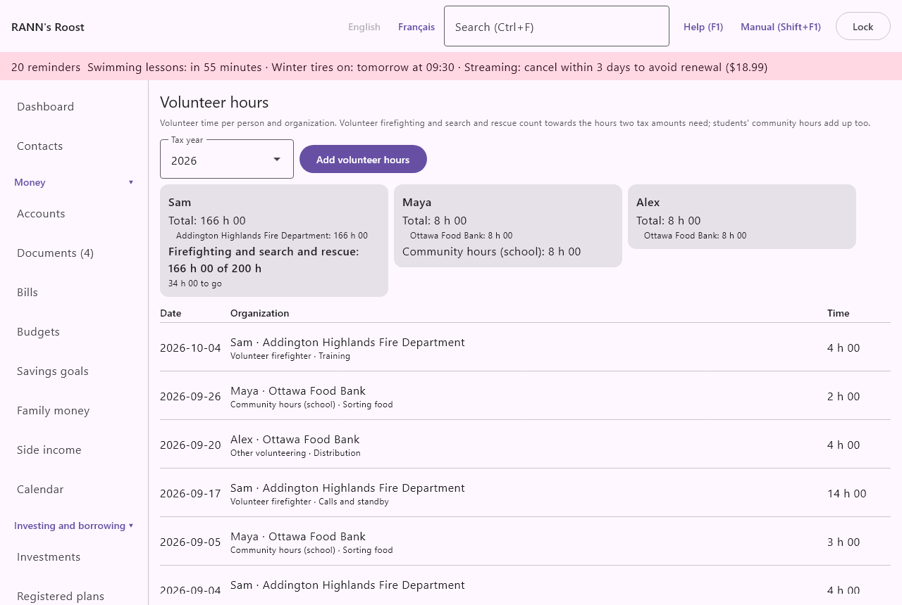

# Volunteer hours

Volunteer hours keeps the time each person gives to an organization, and adds it up by year. It checks the hours of volunteer firefighting and search and rescue against the 200 hours two tax amounts need, keeps students' community hours apart, and shows the totals on the year-end tax package. It is in the **Home and family** group of the menu, under **Volunteer hours**.

@index: volunteering; volunteer firefighter; search and rescue; VFA; SRVA; line 31220; line 31240; community service hours; community involvement hours; bénévolat

> Note: The volunteer firefighters amount (line 31220) and the search and rescue volunteers amount (line 31240) need at least 200 hours of eligible volunteer service in the year; the two services count together. Other conditions apply, such as an honorarium of more than $1,000 from the same service. RANN's Roost only adds up the hours and does not give tax advice.

## The Volunteer hours screen {#screen}

- **Tax year**: the calendar year shown, from this year back six years.
- **Add volunteer hours**: opens the [dialog](#dialog) for new hours.

New hours are kept with the person's earlier volunteer hours, so a person's year stays together in one account group; a person's first hours go to your own private group if you have one, otherwise to the first shared group. Hours sent from the phone follow the same rule, whichever group the phone sends to. When you may change more than one group, the dialog still lets you choose (**Store in**). Adding hours needs permission to add records in that group; changing or deleting them needs permission to change records. **Add volunteer hours** is hidden for someone who may add to no group, and a line cannot be opened by someone who may only view its group.

### The cards {#cards}

One card per person with hours in the year shows:

- **Total**: all the person's hours in the year, as hours and minutes (3 h 05).
- one line per organization with its hours, the largest first.
- **Firefighting and search and rescue**: the hours of **Volunteer firefighter** and **Search and rescue** together, out of the 200 hours (**Volunteer firefighter and search and rescue hours** in [Rates and rules](rates-rules)), then either **The 200 hours are reached.** or how many hours are left.
- **Community hours (school)**: the hours of that kind, for a student who must give a number of hours to graduate (40 hours in Ontario, for example).

### The list {#list}

The year's hours are listed newest first: the date, the person and the organization, the kind, the activity, **from the phone** when sent from it, and the time. Click a line to change or delete it.

## Add volunteer hours dialog {#dialog}

- **Person**: the household member who volunteered. Required.
- **Organization**: required. As you type, organizations used before are proposed; picking one also brings back its kind and contact.
- **Contact**: one of your [contacts](contacts) that is an organization, or **None**. Picking one with **Organization** empty fills in its name.
- **Kind**: **Volunteer firefighter**, **Search and rescue**, **Community hours (school)** or **Other volunteering**. Only the first two count towards the 200 hours.
- **Date**: the day, as 2026-10-05.
- **Time (h:mm)**: as hours and minutes (1:30) or in hours (1.5); from 1 minute to 24 hours. A longer shift is entered as one line per day.
- **Activity** and **Notes**: optional.
- **Delete**: on existing hours; asks first.

## On the tax package {#tax-package}

The **Year-end package** tab of the [Taxes](taxes#year-end-package) screen adds, in the notes of a person's package, their volunteer hours of the year and, when they have firefighting or search and rescue hours, whether these reach the 200 hours. It is information for you and your preparer; no amount is added.

## On the phone {#phone}

**Volunteer hours** on the phone's Capture tab sends hours for a person; see [RANN's Roost Mobile](phone-app#log-forms).
