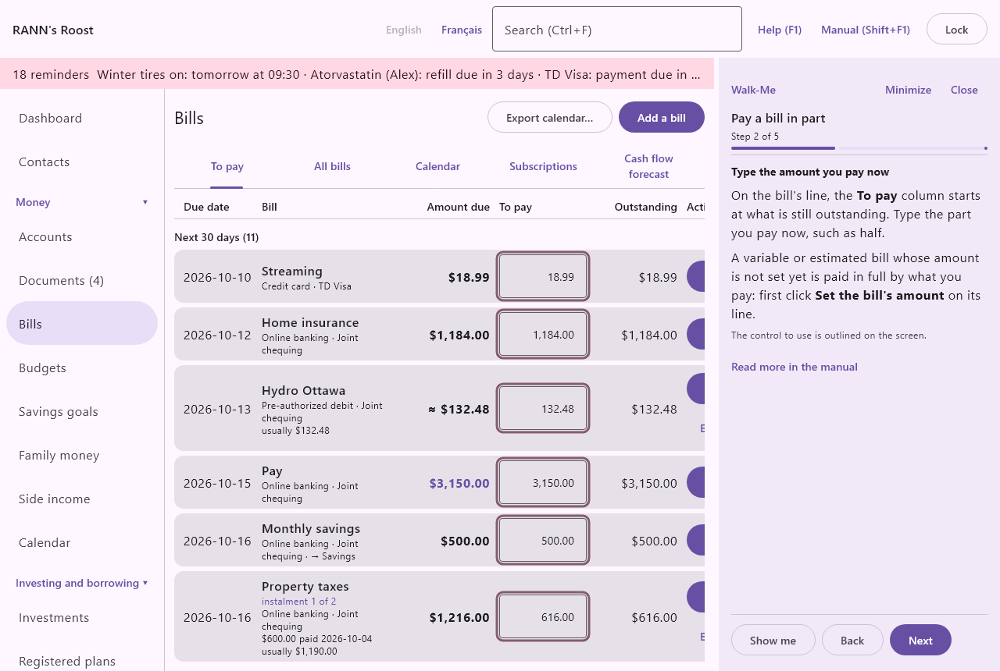

# Walk-Me guides

A Walk-Me guide takes you through a common task one step at a time, in a panel on the right of the window that never blocks the app. Each step says where to go, what to choose and what to type. **Show me** opens the right screen, the control to use is outlined on the screen, and many steps move on by themselves as soon as the app sees them done. There are guides for setting up the household, bills and budgets, documents and the phone, borrowing and investing, the home and family, and taxes and reports.

## The Help menu {#help-menu}

@index: Help menu; menu Aide; Walk-Me; guides; tutorial; step by step

The Help group is the last group of the menu: at the bottom of the list on the left, or, with the menu at the top, the **Help** menu at the right of the bar. It has:

- **Manual (Shift+F1)**: opens this manual in its own window, on the chapter for the screen shown.
- **Help (F1)**: opens the short Help panel on the topic for the screen shown. See [Help (F1) and the Manual](welcome#help-and-manual).
- **Walk-Me guides**: the list of guides (below).
- **About**: the version, updates, what's new, privacy, licence and support. See [About](about).

The **Help (F1)** and **Manual (Shift+F1)** buttons at the top of the window and the F1 and Shift+F1 keys work as before, on every screen.

## The Walk-Me guides screen {#guides-screen}

@index: list of guides; start a guide; resume a guide

The guides are listed by group: Getting started; Bills and budgets; Documents and the phone; Borrowing and investing; Home, family and vehicles; Taxes and reports. Each guide shows its name in bold, a line saying what it does, and its number of steps.

- **Start**: opens the guide at its first step.
- **Resume at step**: shown for a guide you closed before its end; it opens the guide where you left it.
- **Start over**: beside **Resume at step**, opens it at the first step again.
- "followed to the end": shown after the number of steps once you have finished a guide on this computer.

Before any household is open, the welcome screen's **Walk-Me guides** button shows the same list, with **Back** to return. The first guide, Create your household, starts there.

## The guide panel {#panel}

@index: Show me; Next; Back; Finish; Minimize; highlighted control

The panel opens on the right of the window, beside whatever screen is shown, and stays while you move from screen to screen. From top to bottom:

- **Walk-Me**, with **Minimize** and **Close**.
- The guide's name, "Step" and its number "of" the number of steps, and a bar showing how far along you are.
- The step's title and what to do. Labels of buttons and fields are in bold, exactly as on the screen.
- "The control to use is outlined on the screen.": shown when the control the step is about is on screen. It is framed in a pulsing colour and scrolled into view.
- "Press Show me to open the screen this step is about.": shown when you are elsewhere.
- "This step moves on by itself once it is done.": shown for a step the app can see done, such as a dialog opening, a screen shown or a record added. Only what happens while the step is shown counts, so going back to a step never skips it.
- **Read more in the manual**: opens the manual on the section about this step.
- **Show me**: opens the step's screen and tab. It is shown only for a step about a screen: not for steps done on the phone or inside a dialog already open, nor for the steps on the welcome screen while a household is open.
- **Back** and **Next**: the step before and the step after. On the last step, **Finish** closes the guide.

You can use the app normally while the panel is open: type, click, open dialogs. Drag the panel's left edge to make it wider or narrower; the width is kept on this computer. **Minimize** shrinks it to a narrow strip showing the step number; its ◂ button opens it again.

Everything in the panel works from the keyboard: Tab moves to its buttons and Enter presses them. Screen readers announce each new step as it appears, and the panel as a region named after the guide.

## Steps done on the phone {#phone-steps}

Pairing a phone, capturing receipts and bills, recording trips and ticking the seasonal checklist are done on the phone. The computer cannot point at the phone's screen, so those steps begin with "On the phone" and say in words what to tap, with the phone's own labels. They have no **Show me**; press **Next** when you are done.

## Progress {#progress}

Each guide's step is remembered on this computer, for whoever uses it, so a guide you close halfway opens at the same step next time from **Resume at step**. A guide followed to the end with **Finish** starts again from the beginning. Nothing about the guides is kept in the household or its backups, and nothing is sent anywhere.

## The guides {#guide-list}

@index: guides list

Getting started:

- Create your household; Institutions and accounts; Members and users; Import a statement or a Quicken file; Reconcile a statement; Backups.

Bills and budgets:

- Bills; Municipal property taxes; Pay a bill in part; Budgets; Savings goals.

Documents and the phone:

- Pair a phone; Capture and process a receipt; Capture and process a bill; Itemize a receipt; AI reading.

Borrowing and investing:

- Mortgages; Loans and lines of credit; Investment accounts and holdings; Registered plans.

Home, family and vehicles:

- Vehicles and maintenance; Trips on the phone; The seasonal checklist; Utilities and meters; Medical expenses and claims; Insurance; Contacts; Family money and allowances.

Taxes and reports:

- The year-end tax package; The income tax estimate; Custom reports; The emergency and estate summary.
