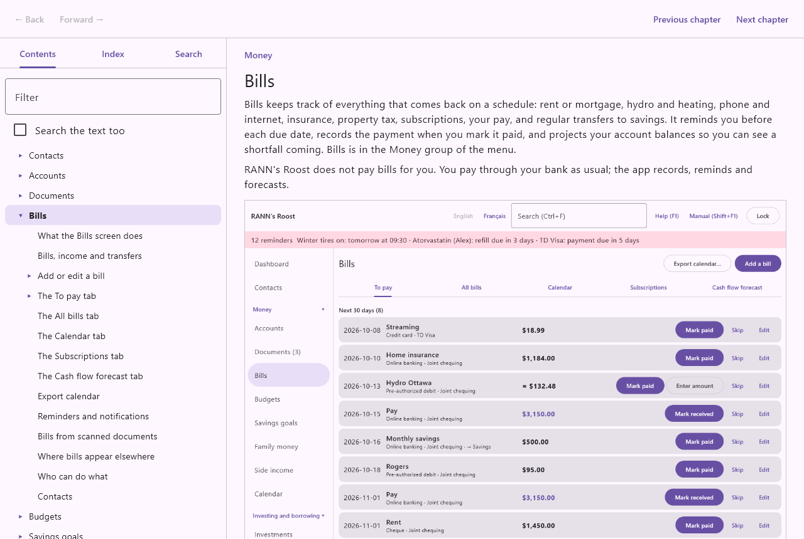
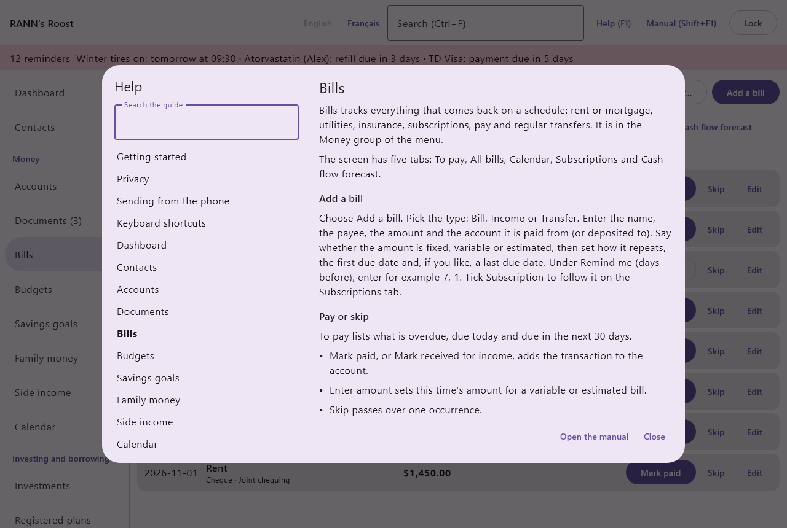

# Welcome to RANN's Roost

This manual is the complete book about RANN's Roost. It describes every screen, every field and every option, and explains what each one changes elsewhere in the app. This first chapter explains what the app is, how the manual is organized and how to find your way around it.

## What RANN's Roost is {#what-it-is}

@index: RANN's Roost; Household Finance Manager; about the app

RANN's Roost keeps a Canadian household's books on your own computer. It works in every province and territory, in English and in French. It is published by RANN, and was called Household Finance Manager until October 2026.

### The desktop app {#desktop-app}

@index: desktop; Windows; Linux

The desktop app, RANN's Roost, runs on Windows and Linux. It holds the household's books:

- bank accounts, credit cards, cash and their transactions, with statement import and reconciliation;
- bills, pay and subscriptions, budgets and savings goals;
- investments, registered plans (RRSP, TFSA, FHSA, RESP and others), pensions, loans and mortgages;
- taxes: the slips to expect, donations, instalments, pay stubs, sales taxes and a year-end package for your accountant;
- health records, medical plans and claims, pets, vehicles, the home and other assets, warranties and insurance;
- family money (shared expenses, family loans, allowances), a trip log, home projects, side income and card rewards;
- an emergency and estate summary, a calendar, documents and reports.

Several people can use the same household, each with their own login name and password, and each seeing only what they are allowed to see.

### RANN's Roost Mobile {#mobile-app}

@index: phone; Android; companion app; RANN's Roost Mobile

RANN's Roost Mobile is the companion app for Android phones. It photographs receipts and bills, records quick expenses and odometer readings, and sends them to the desktop over your home Wi-Fi, or through a folder of your own cloud storage when you are away. Nothing it sends goes straight into the books: each capture waits on the Documents screen until you review it. See [RANN's Roost Mobile](phone-app) and [Getting started with the phone](start-phone).

### Your data stays yours {#your-data}

@index: privacy; encryption; no account; no advertising

Your financial information stays on your computer and your phone, encrypted. There is no RANN account, no advertising and no analytics, and RANN never receives your data. The app goes on the internet only for a few things you can see and mostly choose, such as exchange rates or price downloads. [Privacy, data and security](privacy-data) explains all of it.

## How this manual is organized {#organization}

@index: parts; chapters; table of contents

The manual is divided into parts, each made of chapters. Each chapter is divided into sections and subsections, one for each screen, tab, form and window.

- Part one, Getting started: this welcome, the [Quick Start](quick-start) that takes you from installation to a working household, and [Finding your way](basics), which describes the start screens, the main window, the menu, search and the controls used everywhere.
- Part two, Getting started with each part of the app: one short chapter per area, such as [settings](start-settings), [contacts](start-contacts), [money](start-money), [bills and budgets](start-bills-budgets), [documents](start-documents), [the calendar](start-calendar), [investing](start-investing), [reports](start-reports), [taxes](start-taxes), [home and family](start-home-family) and [the phone](start-phone). Read the one for an area before you start using it.
- The parts Money, Investing and borrowing, Reports and taxes, Home and family, and Settings: the reference chapters, one per screen, in the same order and with the same names as the app's menu. They describe every field and option.
- The Appendices: [RANN's Roost Mobile](phone-app), [Keyboard shortcuts and accessibility](shortcuts), [Privacy, data and security](privacy-data), [Troubleshooting](troubleshooting) and the [Glossary](glossary) of Canadian finance and app terms.

You do not need to read the manual from start to finish. The Quick Start and the getting-started chapters are meant to be read; the reference chapters are meant to be looked up when you need them.

## Using the Manual window {#manual-window}

@index: Manual window; reading the manual

The manual opens in its own window, beside the app. You can keep it open while you work and move between the two.

### Opening the manual {#opening}

@index: Shift+F1; Manual button; open the manual

- **Manual**: the button in the top bar of the main window, beside **Help (F1)**. It opens the manual.
- **Shift+F1**: opens the manual on the chapter about the screen you are looking at. For example, pressing Shift+F1 on the Bills screen opens the Bills chapter.

### Contents {#contents-tab}

@index: table of contents; Contents tab; filter

The left side of the Manual window has three tabs. The first, **Contents**, shows the table of contents as a tree: the parts, their chapters, and under each chapter its sections and subsections. Click the arrow beside an entry to open or close its branch, and click a title to read it.

- **Filter**: the box at the top of the tab. Type a few letters to keep only the entries whose titles contain them. Clear the box to see the whole tree again.
- **Search the text too**: when ticked, the filter also keeps the entries whose text, not only their title, contains the words typed.

### Index {#index-tab}

@index: Index tab; index entries

The **Index** tab lists the manual's index terms in alphabetical order, accents ignored. The index holds the name of every field and option described in the manual, exactly as it appears on screen, plus extra terms such as abbreviations and synonyms (RRSP, T4, cheque and so on). When a term appears in several places, each place is listed under it, with its path (chapter, section, subsection). Click a place to go there.

- **Filter**: type part of a term to keep only the matching ones.
- **Search the text too**: when ticked, the filter also looks in the text of the places, not only in the terms.

### Search {#search-tab}

@index: Search tab; full-text search

The **Search** tab searches the whole manual. Type one or more words in its box. A section is found when it contains every word typed, whatever their order; capitals and accents do not matter, and words of one letter are ignored. Sections whose title holds the words come first. Each result shows where it is and the line that matched; click it to read the section.

### Moving around {#navigation}

@index: Back; Forward; Previous chapter; Next chapter; links

- **Back** and **Forward**: return to the place you were reading before, or go forward again, like in a web browser.
- **Previous chapter** and **Next chapter**: read the manual in order, one chapter after another.
- Links: words shown as links lead to another chapter or section. Click one to follow it; **Back** brings you back.

### Text size and language {#text-size-language}

@index: text size; language; French manual

The manual uses the same text size as the app, chosen under [Display and accessibility](display), and the same language. When you switch the app between English and Français, the manual switches too. Both languages have the same chapters and sections.

## Conventions used in this manual {#conventions}

@index: conventions; how to read this manual

- Names in bold, such as **Save** or **Add a bill**, are the labels of buttons, tabs, menus and fields exactly as the app shows them.
- Lists of fields describe a form one field at a time. Each starts with the field's name in bold, then what it means, what to enter, whether it is required, its default and, above all, what it changes elsewhere.
- Numbered steps describe a task to follow in order.
- Dates are written as the app shows and expects them: year, month, day, such as 2026-10-05.
- Amounts are written in the Canadian way for each language: $1,234.56 in English, 1 234,56 $ in French.
- Callouts stand out from the text:

> Tip: a tip is a shortcut or a good habit.

> Note: a note explains a detail or a limit.

> Important: an important note warns about something that cannot be undone or that could cost you data or money.

## Help (F1) and the Manual {#help-and-manual}

@index: Help; F1; help panel; guide

The app has two kinds of help:

- **Help (F1)** opens a short guide beside the screen, on the topic for the screen shown. It answers the quick question: what is this screen for and how do I do the usual thing.
- The **Manual** is this book: every field and option, what each changes, and the Canadian rules the app applies.

### The Help panel {#help-panel}

@index: Search the guide; help topics

Press F1, or click **Help (F1)** in the top bar, to open the Help panel. It shows the topic for the screen you are on, and a list of every other topic on the left: first the general ones (getting started, privacy, sending from the phone, keyboard shortcuts), then one per screen in menu order.

- **Search the guide**: type words to list only the topics that contain them, each with the line that matched. If nothing is found, the panel says so; try other words.
- **Close**: closes the panel. Escape or F1 closes it too.

When a topic does not answer your question, open the manual with **Manual** or Shift+F1 for the full story.

## A word of caution {#caution}

@index: tax advice; medical advice; disclaimer

Tax figures in the app (slips, capital gains, contribution room, medical expenses and the like) are organizational aids, not tax advice. Check them against your slips and statements, and ask a tax professional when in doubt. Health records are an organizational aid, not medical advice. This manual explains the Canadian rules the app applies in a sentence or two; it is not legal or tax advice either.
