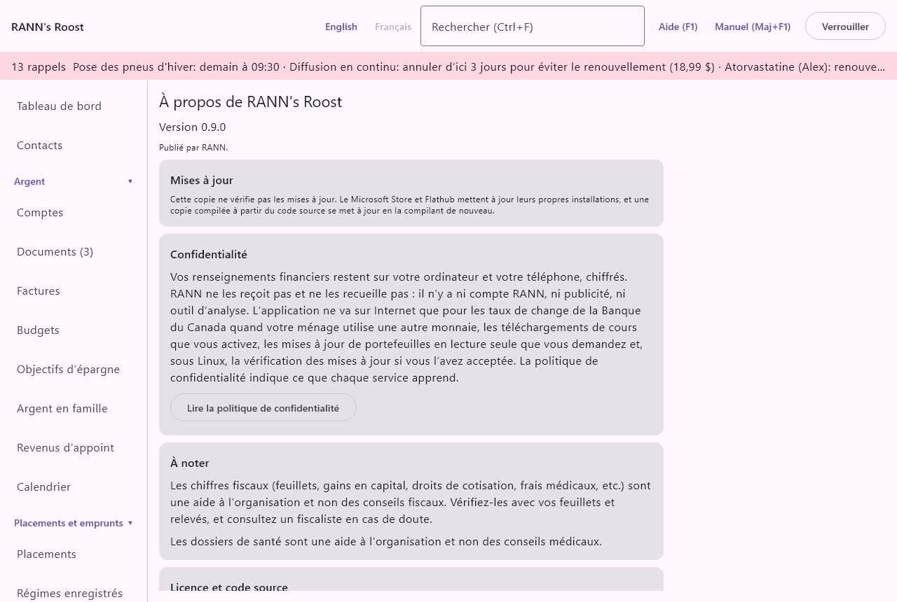

# À propos

L'écran À propos montre la version de RANN's Roost que vous avez, vérifie les mises à jour sur les copies qui le font, et rassemble le résumé de confidentialité, les avis, la licence, le soutien et les avis des logiciels de tiers. C'est le dernier élément du groupe **Réglages** du menu, sous **À propos**. Avant qu'un ménage soit ouvert, **À propos et confidentialité** à l'écran de départ montre le même contenu, avec **Retour** pour revenir.

## Version {#version}

@index: numéro de version; quelle version; parution

En haut : « À propos de RANN's Roost », « Version » et le numéro de version de cette copie, et « Publié par RANN. » Donnez le numéro de version quand vous demandez de l'aide.

## Mises à jour {#updates}

@index: mise à jour; mise à niveau; nouvelle version; vérification des mises à jour; GitHub Releases; signature; AppImage; deb; rpm

La façon dont RANN's Roost est mis à jour dépend de la façon dont il a été installé :

- À partir du Microsoft Store, ou de Flathub sous Linux : le magasin met lui-même l'application à jour. La carte Mises à jour indique « Cette copie ne vérifie pas les mises à jour. » et explique pourquoi.
- Une copie compilée à partir du code source se met à jour en la compilant de nouveau ; elle ne vérifie pas non plus.
- Les paquets Linux .deb, .rpm et AppImage de GitHub Releases peuvent vérifier eux-mêmes les mises à jour. Le reste de cette section les concerne.

### La question du premier démarrage {#update-question}

Sur une copie qui peut vérifier, le premier démarrage demande « Vérifier les mises à jour? ». L'application ne fait aucune demande avant votre réponse.

- **Vérifier une fois par jour** : active la vérification.
- **Ne pas vérifier** : la laisse désactivée.

La question explique ce que la vérification révèle : GitHub voit l'adresse Internet de votre ordinateur et le fait que l'application est utilisée, comme pour toute page Web. Rien sur votre ménage n'est envoyé. Vous pouvez changer votre réponse en tout temps dans la carte Mises à jour.

### La carte Mises à jour {#updates-card}

- **Vérifier les mises à jour une fois par jour** : active ou désactive la vérification quotidienne. Le choix est gardé sur cet ordinateur. Quand elle est désactivée, la carte indique « La vérification des mises à jour est désactivée. Activez-la pour être averti des nouvelles versions. »
- **Vérifier maintenant** : vérifie tout de suite. Affiché pendant que la vérification est activée et que rien n'est en cours.

Pendant que la vérification est activée, l'application vérifie au plus une fois par jour pendant qu'elle fonctionne. La carte montre alors l'un de ces messages :

- « Vérification… ».
- « RANN's Roost est à jour (vérifié » avec la date et l'heure.
- « La version » et le nouveau numéro, « est disponible. », avec les notes de version dans votre langue et **Télécharger et vérifier**.
- « Téléchargement… » avec un pourcentage et une barre de progression.
- Le résultat du téléchargement (voir plus bas).
- Un problème, en rouge : impossible de joindre GitHub (avec la raison), la mise à jour a été refusée parce qu'on n'a pas pu confirmer qu'elle est une version signée par RANN, le téléchargement ne correspondait pas à la version signée par RANN et a été supprimé, ou le téléchargement a échoué.

Quand une nouvelle version est disponible, une bannière en haut de chaque écran sauf À propos indique « La version » et son numéro « de RANN's Roost est disponible. Voir À propos. » Cliquez dessus pour venir ici.

### Télécharger et installer {#download}

- **Télécharger et vérifier** : télécharge la nouvelle version et la vérifie avant de la garder. Chaque version est signée par RANN ; la liste des fichiers est vérifiée avec la signature de RANN, et le fichier avec la taille et la somme de contrôle de cette liste signée. Un fichier qui ne correspond pas est supprimé et rien n'est installé.

La suite dépend du paquet :

- AppImage : le fichier vérifié remplace l'AppImage en cours. La carte indique que la version est installée et que sa signature a été vérifiée. Redémarrez RANN's Roost pour l'utiliser.
- .deb ou .rpm : le fichier vérifié est enregistré dans votre dossier Téléchargements. La carte indique où, et offre :
  - **Ouvrir avec l'installateur de logiciels** : ouvre le fichier avec l'installateur de logiciels du système, où vous confirmez l'installation.
  - Ou dans un terminal : la commande pour l'installer, comme sudo apt install suivi du fichier (ou sudo dnf install pour un .rpm), que vous pouvez sélectionner et copier.

Votre ménage n'est pas touché par une mise à jour. Une nouvelle version peut mettre à jour les fichiers du ménage la première fois qu'elle les ouvre ; faire une sauvegarde avant est toujours sage.

## Confidentialité {#privacy}

La carte Confidentialité résume ce qui arrive à vos renseignements : ils restent sur votre ordinateur et votre téléphone, chiffrés. RANN ne les reçoit pas et ne les recueille pas : il n'y a ni compte RANN, ni publicité, ni outil d'analyse. L'application ne va sur Internet que pour :

- les taux de change de la Banque du Canada, quand votre ménage utilise une autre monnaie ;
- les téléchargements de cours que vous activez ;
- les mises à jour de portefeuilles en lecture seule que vous demandez ;
- sous Linux, la vérification des mises à jour si vous l'avez acceptée.

- **Lire la politique de confidentialité** : ouvre la politique de confidentialité de RANN dans votre navigateur Web, dans la langue utilisée. Elle indique ce que chaque service apprend.

Voir aussi [Confidentialité et vos données](privacy-data).

## À noter {#notices}

@index: avis de non-responsabilité; pas un conseil fiscal; pas un conseil médical

- Les chiffres fiscaux (feuillets, gains en capital, droits de cotisation, frais médicaux, etc.) sont une aide à l'organisation et non des conseils fiscaux. Vérifiez-les avec vos feuillets et relevés, et consultez un fiscaliste en cas de doute.
- Les dossiers de santé sont une aide à l'organisation et non des conseils médicaux.

## Licence et code source {#licence}

@index: licence; GPL; logiciel libre; code source ouvert; code source; garantie

RANN's Roost est un logiciel libre distribué sous la licence publique générale GNU, version 3 ou ultérieure, sans aucune garantie. Vous pouvez l'utiliser, l'étudier, le partager et le modifier selon cette licence. Son code source est sur GitHub. Les noms RANN, RANN's Roost et RANN's Roost Mobile ainsi que le logo sont © Perry Schippers, faisant affaire sous le nom de RANN, et ne sont pas visés par la licence.

- **Code source sur GitHub** : ouvre la page du code source dans votre navigateur Web.

## Soutien {#support}

@index: aide; contact; courriel; signaler un problème; billet

Questions et problèmes : info-rann-apps@NorthMail.ca, ou un billet sur GitHub.

- **Billets GitHub** : ouvre la liste des billets du projet dans votre navigateur Web, où vous pouvez signaler un problème ou suggérer une amélioration.

> Important : N'envoyez jamais de mots de passe, de clés de récupération, de sauvegardes ni de détails financiers, ni par courriel ni sur GitHub. Décrivez le problème, le numéro de version et les étapes qui y mènent.

## Logiciels de tiers {#third-party}

@index: avis de tiers; licences de logiciels libres; bibliothèques

RANN's Roost est construit avec d'autres logiciels libres et ouverts, dont les licences exigent que leurs avis soient affichés.

- **Afficher les avis** : affiche le texte complet des avis sous le bouton, que vous pouvez sélectionner et copier.
- **Masquer les avis** : les masque de nouveau.
