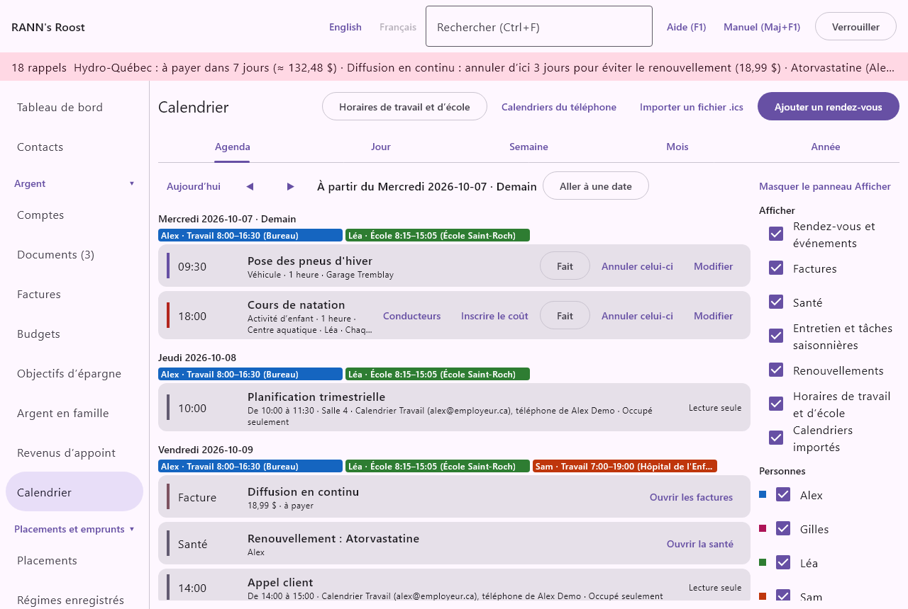
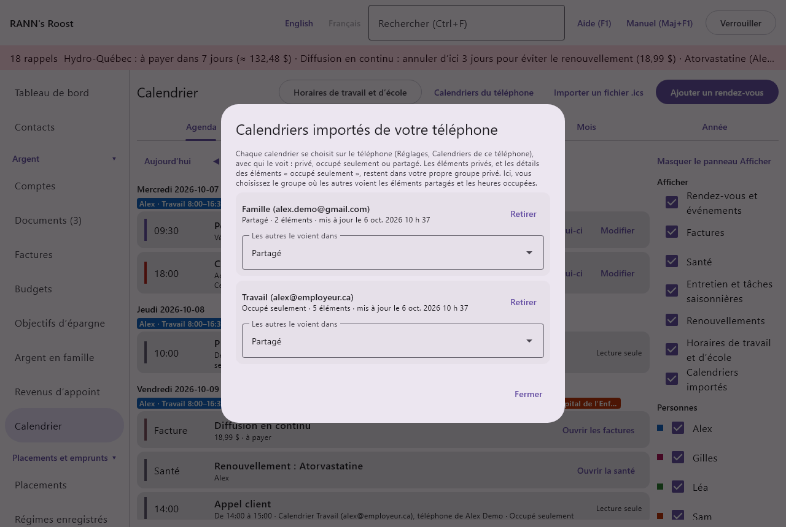
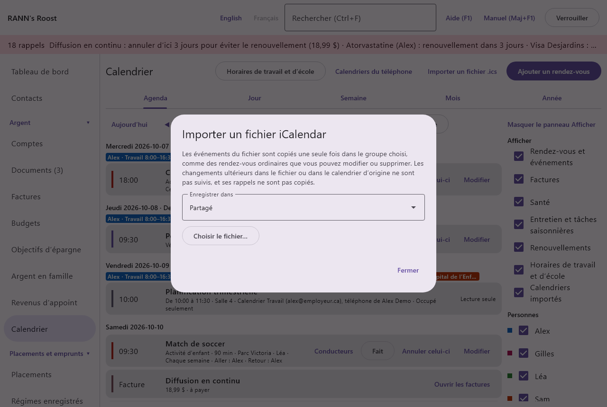

# Calendriers des téléphones et des fichiers

Chaque personne peut importer dans le [Calendrier](calendar) du ménage les calendriers que son téléphone affiche déjà (Google, Outlook ou Exchange, Samsung et autres), et choisir qui les voit. Un fichier iCalendar (.ics), envoyé par une école, une équipe ou un autre programme, peut aussi y être copié une fois.

RANN's Roost ne se connecte jamais à un compte de calendrier. L’application du téléphone lit les calendriers qu’Android garde déjà, avec votre permission, et les envoie à l’ordinateur avec ses autres transferts, chiffrés de bout en bout. Si vous le choisissez, elle écrit aussi les prochains rendez-vous, horaires et factures du ménage dans un calendrier du téléphone (voir [Écrire dans un calendrier du téléphone](#both-ways)).

@index: Google Agenda; calendrier Outlook; Exchange; calendrier Samsung; synchroniser les calendriers; calendriers importés; calendriers du téléphone; iCalendar; ics

## Comment ça fonctionne {#how-it-works}

1. Sur le téléphone, dans **Réglages**, ouvrez **Calendriers de ce téléphone** et choisissez **Importer seulement** (par défaut) ou **Dans les deux sens**, puis **Autoriser l’accès au calendrier**. Android le demande une fois.
2. Cochez les calendriers à importer, choisissez qui voit chacun sur l’ordinateur et combien de jours à l’avance sont envoyés.
3. À chaque transfert (par Wi-Fi, par le dossier de transfert ou dans un fichier partagé), le téléphone envoie en entier chaque calendrier qui a changé depuis la dernière fois. L’ordinateur remplace ce qu’il gardait de ce calendrier à partir de ce jour : les nouveaux éléments apparaissent, ceux qui ont changé sont mis à jour et ceux qui ont été supprimés disparaissent.
4. Les éléments paraissent dans toutes les vues du Calendrier (**Agenda**, **Jour**, **Semaine**, **Mois**, et leurs jours ombrés dans **Année**), en lecture seule, marqués du calendrier d’où ils viennent et de la personne dont le téléphone les a envoyés.

Le téléphone n’envoie que les calendriers que vous cochez, et seulement pour les jours choisis : le titre, le lieu, le début et la fin de chaque élément. Les descriptions, les invités, les pièces jointes et les rappels ne sont pas lus. Ce que vous ou quelqu’un d’autre changez dans l’application de calendrier du téléphone change sur l’ordinateur au prochain transfert. Rien n’est écrit dans vos calendriers, sauf si vous choisissez **Dans les deux sens**.

> Remarque : L’ordinateur doit être ouvert avec la connexion du propriétaire du téléphone quand un transfert arrive par Wi-Fi, comme pour les captures. Un fichier laissé dans le dossier de transfert attend que le propriétaire se connecte.

## Écrire dans un calendrier du téléphone {#both-ways}
@index: dans les deux sens; synchronisation dans les deux sens; écrire dans Google Agenda; calendrier RANN's Roost

Avec **Dans les deux sens** choisi sur le téléphone, le téléphone écrit les 60 prochains jours du ménage dans un calendrier : les rendez-vous et événements, les heures de travail et d’école de chaque personne et les factures à payer. Il n’écrit que ce que l’utilisateur de ce téléphone peut voir sur l’ordinateur. Chaque personne choisit sur son propre téléphone où cela va :

- **Calendrier RANN's Roost sur ce téléphone seulement** : un calendrier à l’application, qui n’appartient à aucun compte et n’est jamais synchronisé avec Google, Outlook ni ailleurs.
- Un calendrier d’un des comptes du téléphone, comme un calendrier Google ou Outlook. Il se synchronise alors avec ce fournisseur, et il est visible partout où ce compte est utilisé et par les personnes avec qui il est partagé.

Dans l’un ou l’autre, un rendez-vous médical est écrit seulement comme « Rendez-vous santé », sans lieu ni détails, et une facture comme « Facture à payer : nom », jamais son montant. Les changements faits sur l’ordinateur arrivent dans le calendrier au prochain transfert ; les éléments retirés ou payés y sont supprimés. Ce que l’application a écrit n’est jamais réimporté comme élément importé. Désactiver l’option, choisir un autre calendrier ou annuler le jumelage du téléphone retire tout ce qu’elle a écrit. Voir [Dans les deux sens](phone-app#calendar-both-ways) dans le chapitre du téléphone.

## Qui voit quoi {#visibility}
@index: calendrier privé; occupé seulement; disponibilités; calendrier partagé

Chaque calendrier importé est de l’une de trois sortes, choisie sur le téléphone ; il est **Privé** tant que vous ne le changez pas :

- **Privé** : vous seul le voyez. Ses éléments sont gardés dans votre propre groupe privé, que les autres utilisateurs du ménage ne peuvent pas ouvrir.
- **Occupé seulement** : vous voyez tout ; les autres vous voient occupé à ces heures, affiché « Alex : occupé(e) », sans le titre ni le lieu. Les titres et les lieux restent dans votre groupe privé ; le groupe que les autres voient ne garde que les heures.
- **Partagé** : les autres qui voient le groupe choisi voient les éléments avec leur titre et leur lieu.

Un élément peut être réglé à part de son calendrier sur le téléphone (**Marquer des éléments**) : un dîner d’équipe partagé dans un calendrier de travail « occupé seulement », ou un rendez-vous privé dans un calendrier familial partagé. Le choix vaut pour toutes les dates d’un élément qui se répète.

Si vous n’avez pas encore de groupe privé, un groupe à votre nom est créé la première fois qu’un calendrier arrive, comme l’offre l’écran Santé.

> Important : Toute personne à qui vous avez donné accès à votre groupe privé voit ce qu’il garde, y compris vos calendriers privés.

## Dans le Calendrier {#in-the-calendar}

Les éléments importés paraissent parmi les rendez-vous, les factures et les échéances :

- Dans l’**Agenda**, la ligne montre l’heure de début (ou **Toute la journée**, ou **Suite** les jours suivants d’un élément sur plusieurs jours), le titre, puis les heures, le lieu, le calendrier et le téléphone dont il vient, et qui le voit. **Lecture seule** rappelle qu’il se modifie dans le calendrier d’où il vient.
- Dans le **Jour** et la **Semaine**, un élément avec une heure se place à ses heures et un élément d’une journée entière sur la ligne **Toute la journée**, comme les rendez-vous ; en lecture seule, il n’ouvre aucun formulaire quand on clique dessus. Un élément sur plusieurs jours remplit chacun de ses jours.
- Dans le **Mois**, le jour montre l’heure de début et le titre, ou « Alex : occupé(e) ».

Un élément sur plusieurs jours paraît chacun de ses jours. Les éléments importés n’ont pas de boutons Fait ou Annuler, ni de rappels sur l’ordinateur ou dans le résumé du téléphone : le calendrier d’où ils viennent vous les rappelle déjà.

Les éléments passés sont gardés un an, puis oubliés.

## Calendriers du téléphone {#phone-calendars}

**Calendriers du téléphone**, au-dessus du Calendrier, liste les calendriers que vous avez importés de vos téléphones, avec le compte auquel ils appartiennent, qui les voit, combien d’éléments sont gardés et quand ils ont été mis à jour. Chaque utilisateur ne voit que les siens.

- **Les autres le voient dans** : le groupe de comptes où les éléments partagés et les heures occupées sont gardés pour les autres. Le groupe partagé du ménage est choisi au départ. Choisissez un autre groupe pour les montrer plutôt aux personnes qui voient ce groupe, ou votre groupe privé (marqué « moi seulement ») pour garder tout le calendrier pour vous, peu importe son réglage sur le téléphone. Ce que les autres voyaient est déplacé aussitôt.
- **Retirer** : supprime la copie du calendrier sur cet ordinateur, après confirmation. Le téléphone l’enverra de nouveau la prochaine fois qu’il changera, sauf si vous cessez de l’importer sur le téléphone.

Les calendriers importés, qui les voit et les jours à l’avance se choisissent sur le téléphone.

## Importer un fichier .ics {#ics-import}
@index: fichier ics; iCalendar; importer un calendrier; calendrier scolaire; horaire d’équipe

**Importer un fichier .ics**, au-dessus du Calendrier, copie une fois les événements d’un fichier iCalendar, comme des rendez-vous ordinaires que vous pouvez ensuite modifier ou supprimer comme les autres. Les changements ultérieurs dans le fichier, ou dans le calendrier d’origine, ne sont pas suivis : importez un fichier plus récent pour ajouter de nouveau ses événements.

1. Choisissez le groupe où vont les rendez-vous (**Enregistrer dans**).
2. Cliquez sur **Choisir le fichier…** et choisissez le fichier .ics. Les fichiers d’au plus 5 Mo et 5 000 événements sont lus.
3. La fenêtre indique combien de rendez-vous ont été créés et combien de dates uniques ont été copiées (voir plus bas), et liste ce qui a été laissé de côté ou modifié, jusqu’à 30 lignes (« Et … de plus. » pour le reste). **Fermer** la ferme.

Comment les événements du fichier sont copiés :

- Les heures sont converties au fuseau horaire de cet ordinateur. Les événements d’une journée entière le restent ; celui qui dure plusieurs jours se répète chaque jour jusqu’au dernier.
- Les répétitions que le calendrier peut garder (chaque jour, semaine, mois ou année, le jour du début, jusqu’à une date ou un certain nombre de fois) restent un seul rendez-vous qui se répète ; les dates que le fichier exclut sont marquées annulées. Une semaine qui se répète sur plusieurs jours devient un rendez-vous par jour.
- Les autres répétitions, comme le deuxième mardi de chaque mois, sont copiées comme rendez-vous isolés pour les deux prochaines années, jusqu’à 250 par événement.
- Une date modifiée d’un événement qui se répète est copiée comme son propre rendez-vous, et la date d’origine est annulée.
- Les événements annulés sont laissés de côté. Ceux dont la date ou la répétition ne peut pas être lue sont laissés de côté et nommés dans la liste.
- Les rappels du fichier ne sont pas copiés : les rendez-vous n’en ont pas tant que vous n’en ajoutez pas. Leur sorte est Autre.

## Qui peut faire quoi {#permissions}

Chaque personne importe ses propres calendriers, du téléphone qu’elle a jumelé. Pour importer un fichier .ics, il faut pouvoir modifier le groupe choisi. Une personne qui peut seulement consulter un groupe voit ce qui y est gardé pour elle, et rien d’autre.
