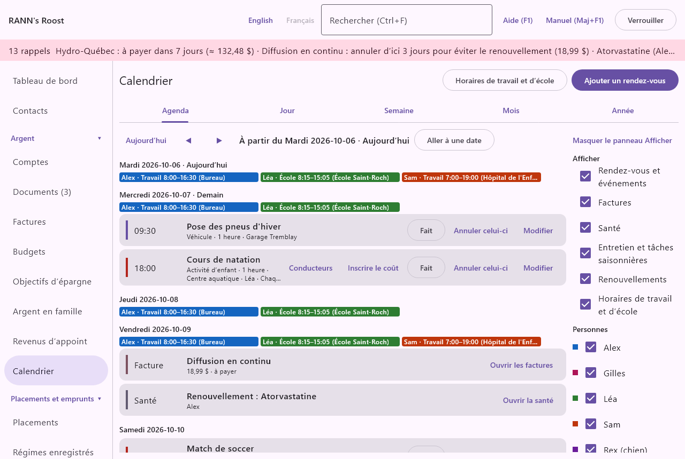
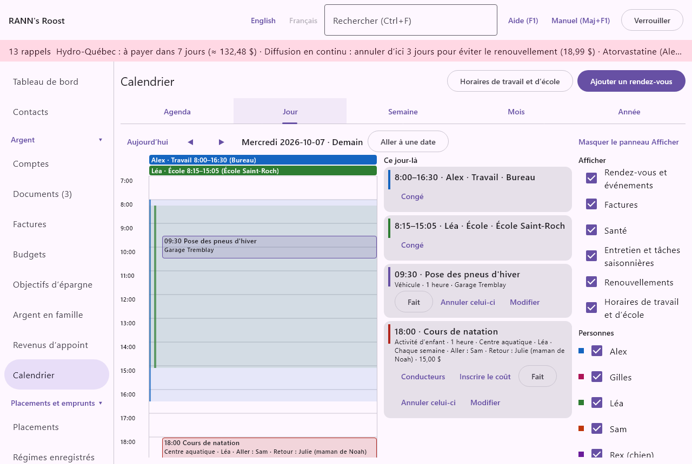
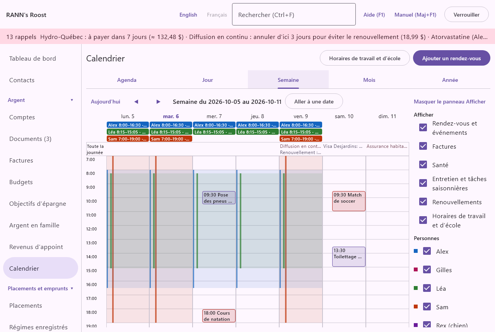
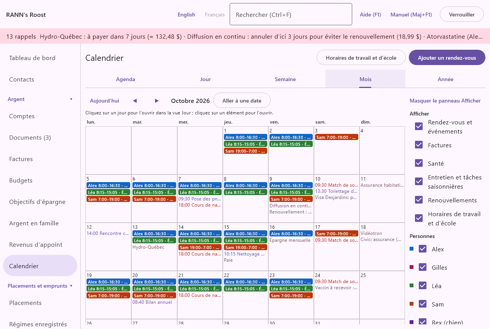
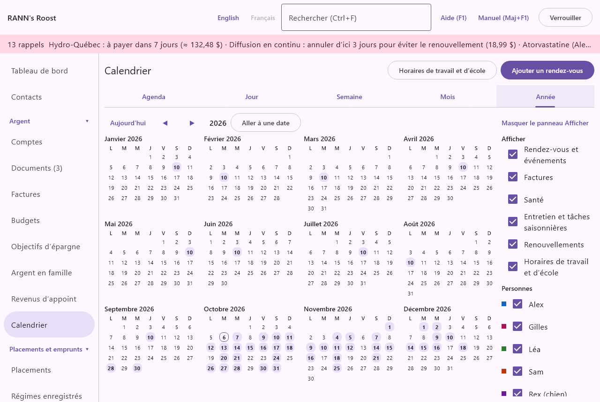
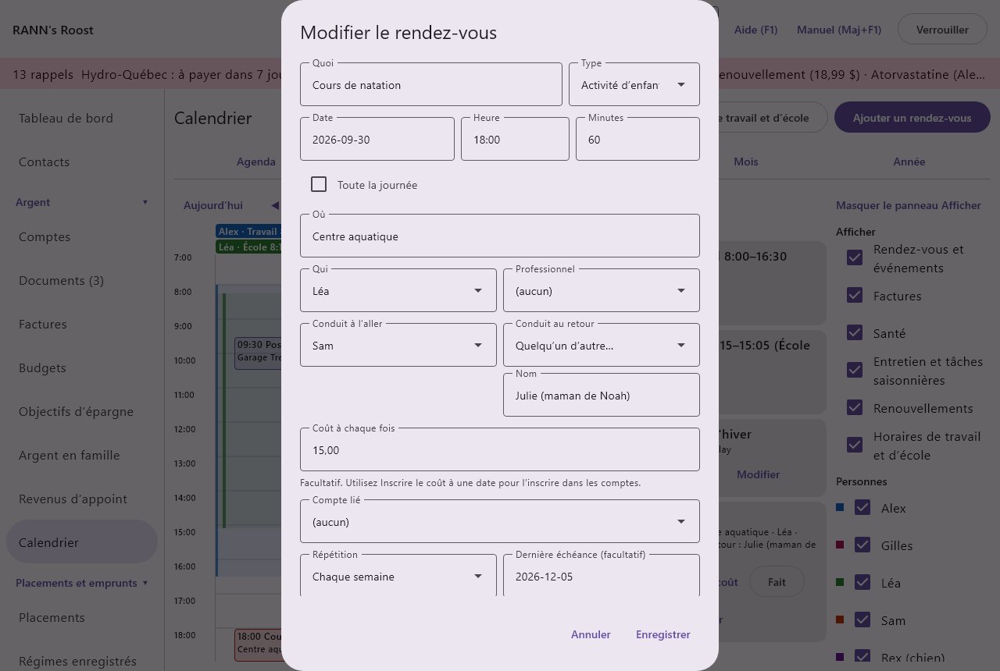
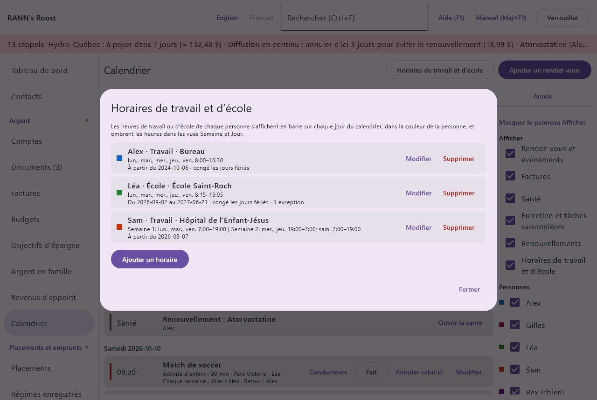
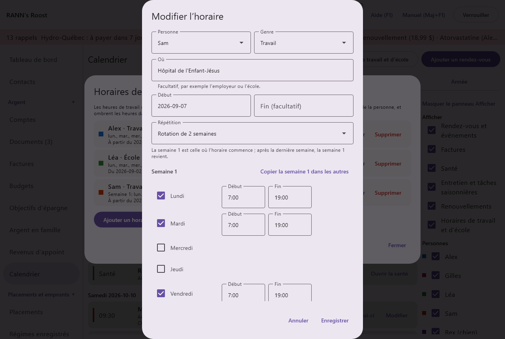

# Calendrier

Le Calendrier réunit vos rendez-vous, les activités de vos enfants, les heures de travail et d’école de chaque personne, et toutes les dates que le reste de l’application connaît déjà : les factures à payer, les médicaments à renouveler, les vaccins, les renouvellements et l’entretien. Vous pouvez le voir comme un agenda, ou par jour, semaine, mois ou année, et choisir ce qu’il montre. Calendrier se trouve dans le groupe Argent du menu.

## Ce que montre le calendrier {#overview}
@index: agenda; horaire; rendez-vous; échéances; ce qui s’en vient

Le calendrier montre sept sortes d’éléments. Chacun a une marque de couleur à gauche de sa ligne, et les éléments qui viennent d’autres écrans ont un bouton qui ouvre l’écran où ils sont gérés.

### Les rendez-vous {#appointments}
@index: rendez-vous; événement; réunion

Les rendez-vous et événements sont créés dans le Calendrier lui-même : une visite chez le médecin, une rencontre avec votre planificateur financier, un rendez-vous au garage, une activité à l’école, un rappel pour renouveler un passeport. Ils peuvent se répéter et comporter des rappels. Voir [Ajouter ou modifier un rendez-vous](calendar#appointment-form).

Les rendez-vous ajoutés depuis les écrans [Santé](health) et [Animaux](pets) sont les mêmes rendez-vous et apparaissent ici aussi. Un rendez-vous médical commencé depuis l’écran Santé est enregistré par défaut dans votre groupe privé.

### Les activités des enfants {#activities}
@index: activité; entraînement; match; cours; covoiturage; conducteur; sports

Les entraînements, matchs et cours d’un enfant sont des rendez-vous du type **Activité d’enfant**. En plus de ce que tout rendez-vous comporte, une activité indique qui conduit à l’aller et qui conduit au retour, ce qui peut être une personne hors du ménage comme un autre parent du covoiturage, et ce qu’elle coûte chaque fois. Dans l’agenda, sa ligne montre les conducteurs (« Aller : Sam · Retour : Julie ») et le coût, avec « coût inscrit » une fois qu’il est dans les comptes. Voir [Activités : conducteurs et coût](calendar#activity-fields).

### Les horaires de travail et d’école {#schedules-on-calendar}
@index: horaire de travail; horaire d’école; quart de travail; heures

Les heures de travail ou d’école de chaque personne, entrées dans **Horaires de travail et d’école**, s’affichent en mince barre de la couleur de la personne en haut de chaque jour où elle travaille ou va à l’école, comme « Alex · Travail 8:00–16:30 (Bureau) ». Les vues Semaine et Jour ombrent aussi ces heures. Voir [Horaires de travail et d’école](calendar#schedules).

### Les factures {#bills-on-calendar}

Chaque échéance de vos factures, revenus et virements prévus actifs, tirée de l’écran [Factures](bills), marquée **Facture**, avec le montant (« ≈ » quand il n’est que prévu) et son état : à payer, payée ou sautée. Les échéances payées et sautées restent sur le calendrier pour que vous ayez le portrait complet. **Ouvrir les factures** mène à l’écran Factures, où vous les marquez payées.

### Les dates de santé {#health-due}

Tirées de l’écran [Santé](health), marquées **Santé**, avec le nom de la personne :

- « Renouvellement : … » quand un médicament doit être renouvelé ;
- « Suivi : … » quand un examen a une date de suivi ;
- « Vaccin à recevoir : … » quand une vaccination est due.

**Ouvrir la santé** mène à l’écran Santé.

### Les renouvellements {#renewals}
@index: renouvellement; expiration; renouvellement de licence; renouvellement d’assurance; fin de garantie; renouvellement hypothécaire

Marquées **Renouvellement**, les dates où quelque chose expire ou doit être renouvelé, réunies à partir d’autres écrans :

- la licence municipale ou l’assurance d’un animal ([Animaux](pets)) ;
- l’immatriculation, l’assurance ou la fin de garantie d’un véhicule ([Véhicules](vehicles)) ;
- la fin du terme d’un prêt ou d’une hypothèque ([Prêts et hypothèques](loans)) ;
- les frais annuels d’une carte de crédit ([Comptes](accounts)) ;
- l’échéance du paiement d’une carte de crédit, chaque mois tant que la carte a un solde dû ([Détails de la carte de crédit](accounts#card-details)) ;
- une réclamation d’assurance à envoyer ([Réclamations médicales](medical)) ;
- la fin de la garantie d’un bien de la maison, ou le renouvellement d’une police d’assurance ([Maison et biens](assets)) ;
- un acompte provisionnel d’impôt ([Impôts](taxes)) ;
- l’échéance d’une obligation ou d’un CPG que vous détenez, à partir de 30 jours avant (par défaut, réglable dans [Taux et règles](rates-rules)) et jusqu’à ce que son remboursement soit inscrit ([Placements](investments#security-dialog)).

Le bouton de la ligne ouvre l’écran où l’élément est géré, comme **Ouvrir les véhicules**, **Ouvrir les prêts** ou **Ouvrir les placements**.

### L’entretien {#maintenance}

Marquée **Entretien**, la prochaine échéance de chaque tâche d’entretien de vos véhicules, de votre maison et de vos autres biens, comme une vidange d’huile ou l’inspection de la fournaise. Le bouton ouvre [Véhicules](vehicles) ou [Maison et biens](assets).

## Les vues et les déplacements {#views}
@index: vue Jour; vue Semaine; vue Mois; vue Année; aller à une date; sélecteur de date; aujourd’hui

Les onglets sous le titre choisissent comment le calendrier est affiché : **Agenda**, **Jour**, **Semaine**, **Mois** et **Année**. La vue choisie est retenue pour votre utilisateur sur cet ordinateur, et la date affichée reste quand vous visitez d’autres écrans.

Au-dessus de chaque vue :

- **Aujourd’hui** : revient à la date du jour.
- **◀** et **▶** (Précédent, Suivant) : le jour, la semaine, le mois ou l’année d’avant ou d’après ; dans l’Agenda, 60 jours plus tôt ou plus tard.
- La date ou la période affichée, comme « Semaine du 2026-10-05 au 2026-10-11 ».
- **Aller à une date** : ouvre un petit calendrier. Cliquez sur un jour, ou tapez une date au format AAAA-MM-JJ et cliquez sur **Aller**. Les boutons **◀** et **▶** qu’il contient changent de mois. **Annuler** le ferme.
- **Masquer le panneau Afficher** et **Afficher et masquer…** : masquent ou affichent le panneau de droite qui choisit ce que montre le calendrier.

En haut de l’écran, **Horaires de travail et d’école** ouvre les horaires (voir [Horaires de travail et d’école](calendar#schedules)), et **Ajouter un rendez-vous** ouvre un nouveau rendez-vous pour aujourd’hui (dans l’Agenda) ou pour la date affichée.

## Afficher et masquer {#show-hide}
@index: filtre; masquer les factures; masquer une personne; afficher seulement

Le panneau **Afficher**, à droite, choisit ce que montrent toutes les vues. Décochez une case pour masquer ces éléments ; cochez-la pour les afficher de nouveau. Vos choix sont retenus pour votre utilisateur sur cet ordinateur : un autre utilisateur, ou vous sur un autre ordinateur, voit le calendrier tel qu’il l’a laissé.

- Sous **Afficher**, une case par sorte d’élément : **Rendez-vous et événements** (activités comprises), **Factures**, **Santé**, **Entretien et tâches saisonnières**, **Renouvellements**, **Horaires de travail et d’école**, et **Calendriers importés** (affichée seulement quand le calendrier contient de tels éléments).
- Sous **Personnes**, une case par membre du ménage et par animal, avec la couleur de ses barres d’horaire. Décocher une personne masque ses rendez-vous, ses dates de santé et ses horaires ; les éléments qui ne visent personne en particulier, comme les factures, restent.
- **Tout afficher** : affiché quand quelque chose est masqué. Coche de nouveau toutes les cases.

Masquer ne change que ce que vous voyez : rien n’est supprimé, et les rappels arrivent quand même.

## L’onglet Agenda {#agenda-tab}

**Agenda** énumère tout ce qui s’en vient de la date affichée (aujourd’hui au départ) à 60 jours, jour par jour. Chaque jour a un titre avec le jour de la semaine et la date, et « Aujourd’hui » ou « Demain » s’il y a lieu. Sous le titre, les barres d’horaire du jour ; puis une ligne par élément. « Rien dans les 60 prochains jours. » signifie que l’agenda est vide.

La ligne d’un rendez-vous montre :

- son heure, ou « Toute la journée » ;
- son titre, avec « (fait) » ou « (annulé) » quand il est marqué ; un rendez-vous annulé est barré ;
- son type, sa durée, le lieu, la personne visée, le professionnel, le compte lié, sa répétition et, pour une activité, ses conducteurs et son coût.

### Marquer les rendez-vous {#marking}
@index: fait; annuler une seule fois

Les boutons de la ligne d’un rendez-vous n’agissent que sur cette date. Pour un rendez-vous qui se répète, les autres dates ne sont pas touchées.

- **Fait** : le marque comme fait. Il reste sur le calendrier, grisé, avec « (fait) », et ne donne plus de rappel.
- **Annuler celui-ci** : marque seulement cette date comme annulée, par exemple un cours hebdomadaire qui n’a pas lieu une semaine. Elle est barrée et ne donne pas de rappel.
- **Annuler** : affiché sur une date marquée faite ou annulée. Retire la marque.
- **Modifier** : ouvre le formulaire du rendez-vous, qui change toutes ses dates.
- **Conducteurs** : affiché pour une activité. Change qui conduit à cette date seulement. Voir [Les conducteurs d’une date](calendar#drivers-dialog).
- **Inscrire le coût** : affiché pour une activité dont le coût n’est pas encore inscrit à cette date. Voir [Inscrire le coût](calendar#record-cost).

## L’onglet Jour {#day-tab}

**Jour** montre une journée : ses barres d’horaire en haut, puis les éléments sans heure (rendez-vous d’une journée entière, factures, renouvellements…) sur la ligne **Toute la journée**, puis les heures de la journée de 0:00 à 23:00, ouvertes à 7:00. Faites défiler pour voir le reste de la journée.

- Chaque rendez-vous avec une heure est placé à ses heures, aussi haut qu’il dure, avec le lieu, la personne visée et, pour une activité, ses conducteurs. Les rendez-vous à la même heure sont côte à côte. Cliquez sur l’un d’eux pour le modifier.
- Les heures prévues à l’horaire sont ombrées de la couleur de chaque personne, avec une bande par personne à gauche. Un quart de nuit se poursuit le lendemain matin.
- Cliquez sur une heure libre pour ajouter un rendez-vous commençant à cette heure.
- **Ce jour-là**, à droite, énumère chaque élément de la journée avec les mêmes boutons que l’agenda : **Fait**, **Annuler celui-ci**, **Modifier**, **Conducteurs**, **Inscrire le coût**, les boutons qui ouvrent d’autres écrans et, pour un horaire, **Congé** (voir [Les exceptions](calendar#schedule-exceptions)). « Rien ce jour-là. » quand la journée est vide.

## L’onglet Semaine {#week-tab}

**Semaine** montre du lundi au dimanche de la même façon que l’onglet Jour, une colonne par jour : barres d’horaire, ligne **Toute la journée** (jusqu’à trois éléments par jour, puis « +n ») et heures.

- Cliquez sur le nom d’un jour, comme « mer. 7 », pour ouvrir ce jour dans l’onglet Jour.
- Cliquez sur un rendez-vous pour le modifier, sur un élément de la ligne Toute la journée pour l’ouvrir, ou sur une heure libre pour y ajouter un rendez-vous.

## L’onglet Mois {#month-tab}

**Mois** montre un mois entier sous forme de grille, les semaines commençant le lundi. La date du jour est en gras.

- Chaque jour montre d’abord ses barres d’horaire, les heures avant le genre pour qu’elles restent visibles dans un jour étroit (« Alex 8:00–16:30 · Travail »), puis ses éléments, puis « +n » pour les autres. Les rendez-vous montrent leur heure et leur titre ; les autres éléments, leur nom. Les rendez-vous faits et les factures payées ou sautées sont grisés ; les rendez-vous annulés sont barrés.
- Cliquez sur un rendez-vous pour le modifier.
- Cliquez sur une facture, une date de santé, un renouvellement ou un entretien pour ouvrir l’écran où il est géré.
- Cliquez ailleurs dans un jour pour l’ouvrir dans l’onglet Jour, où vous pouvez ajouter un rendez-vous.

« Cliquez sur un jour pour l’ouvrir dans la vue Jour ; cliquez sur un élément pour l’ouvrir. » vous le rappelle en haut.

## L’onglet Année {#year-tab}

**Année** montre les douze mois de l’année. Un jour où il y a quelque chose (autre que les heures de travail et d’école, présentes presque chaque jour) est ombré et en gras ; la date du jour est encadrée. Cliquez sur un jour pour l’ouvrir dans l’onglet Jour.

## Ajouter ou modifier un rendez-vous {#appointment-form}

**Ajouter un rendez-vous** ouvre le formulaire pour aujourd’hui dans l’Agenda, ou pour la date affichée dans les autres vues ; cliquer sur une heure libre dans l’onglet Jour ou Semaine l’ouvre à cette heure ; cliquer sur un rendez-vous, ou sur **Modifier**, l’ouvre pour le changer. **Enregistrer** est offert dès que **Quoi** est rempli. **Annuler** ferme le formulaire sans enregistrer.

### Quoi, type, date et heure {#what-and-when}

- **Quoi** : le titre, par exemple « Dentiste - Léa » ou « Rencontre à la banque ». C’est ce que montrent l’agenda, les vues et les rappels. Obligatoire.
- **Type** : Médical, Banque et finances, Véhicule, Maison, Animaux, Personnel, Activité d’enfant ou Autre. Par défaut : Autre (Médical ou Animaux quand le rendez-vous est commencé depuis l’écran Santé ou Animaux). Il est affiché sur la ligne de l’agenda. L’écran Santé ne montre que les rendez-vous de type Médical et Animaux. **Activité d’enfant** ajoute les conducteurs et le coût au formulaire (voir plus bas) et donne au rendez-vous une marque rouge.
- **Date** : la date, au format AAAA-MM-JJ. Pour un rendez-vous qui se répète, la première date. Obligatoire.
- **Heure** : l’heure de début, au format HH:MM sur 24 heures, par exemple 09:30 ou 14:00 (14h00 fonctionne aussi). Par défaut : 09:00. Le champ est marqué « HH:MM » quand l’heure ne peut pas être lue.
- **Minutes** : la durée, en minutes, par exemple 30 ou 90. Par défaut : 60. Affichée dans l’agenda sous la forme « 1 heure » ou « 90 min », et comme la hauteur du rendez-vous dans les onglets Jour et Semaine (une heure si vide). Facultatif.
- **Toute la journée** : cochez-la pour un événement sans heure, comme un anniversaire ou un jour de congé. Heure et Minutes sont alors cachés, et il s’affiche sur la ligne Toute la journée. Les rappels d’un événement d’une journée entière comptent à partir de 8 h ce jour-là.

### Où, qui, professionnel et compte {#where-and-who}

- **Où** : le lieu, comme une adresse ou « Appel vidéo ». Facultatif.
- **Qui** : le membre du ménage ou l’animal visé. Affiché sur la ligne de l’agenda. L’écran Santé énumère les rendez-vous de type Médical et Animaux d’une personne ou d’un animal selon ce champ, et les cases **Personnes** du panneau Afficher le masquent ou l’affichent avec cette personne. « (aucun) » pour personne en particulier.
- **Professionnel** : un professionnel de la santé de l’écran Santé (médecin, dentiste, physiothérapeute…). Affiché sur la ligne de l’agenda. Facultatif.
- **Compte lié** : un compte qui est concerné, par exemple l’hypothèque pour une rencontre de renouvellement à la banque. Affiché sur la ligne de l’agenda. Facultatif.

### Activités : conducteurs et coût {#activity-fields}
@index: covoiturage; qui conduit; coût d’une activité

Affichés quand le **Type** est **Activité d’enfant**. Mettez l’enfant dans **Qui**.

- **Conduit à l’aller** et **Conduit au retour** : qui conduit l’enfant dans chaque sens : **(personne)**, un membre du ménage, ou **Quelqu’un d’autre…**, qui affiche une case **Nom** pour une personne hors du ménage, comme « Julie (maman de Noah) ». Ce sont les conducteurs habituels de chaque date ; changez une seule date avec **Conducteurs** dans l’agenda ou dans l’onglet Jour.
- **Coût à chaque fois** : ce que coûte une date, comme 15,00 pour un cours, dans la devise du ménage ; la calculatrice fonctionne ici aussi (« 12 + 3 »). Facultatif. Il est affiché sur la ligne de l’agenda, et **Inscrire le coût** l’inscrit dans les comptes pour une date choisie. Pour des frais payés une fois pour toute une saison, entrez-les dans une activité d’une seule fois, ou inscrivez-les à la première date seulement.

Changer le Type pour un autre retire les conducteurs et le coût du rendez-vous.

### Les conducteurs d’une date {#drivers-dialog}
@index: tour de covoiturage

**Conducteurs** sur la ligne d’une activité ouvre « Conducteurs : … le … », pour cette date seulement, par exemple le tour d’une autre famille dans le covoiturage. Les autres dates gardent les conducteurs inscrits dans la fiche de l’activité.

- **Conduit à l’aller** et **Conduit au retour** : comme dans le formulaire. **(personne)** veut dire que personne ne conduit dans ce sens ce jour-là.
- **Conducteurs habituels** : affiché quand la date a déjà ses propres conducteurs. Redonne à la date les conducteurs habituels de l’activité.
- **Enregistrer** garde les conducteurs de cette date ; **Annuler** ne change rien.

### Inscrire le coût {#record-cost}
@index: frais d’activité; inscrire le coût d’une activité

**Inscrire le coût** sur la ligne d’une activité propose d’inscrire le coût de cette date dans les comptes comme dépense, par exemple « Inscrire 15,00 $ pour Cours de natation le 2026-10-07 comme dépense du compte ci-dessous. »

- **Payée à partir de** : le compte d’où elle a été payée, parmi ceux dans la devise du coût. Obligatoire.
- **Catégorie** : la catégorie de dépense. Par défaut : Enfants : Activités et camps. Choisissez « (aucun) » pour la laisser sans catégorie.

**Enregistrer** crée l’opération à la date de l’activité, pour l’enfant (le **Qui** de l’activité), avec le lieu de l’activité (ou son titre) comme bénéficiaire et son titre comme note. La ligne de cette date montre ensuite « coût inscrit » et n’offre plus le bouton. L’opération est une opération ordinaire : modifiez-la ou supprimez-la dans le registre du compte. Voir [Comptes](accounts).

### La répétition {#repeats}
@index: rendez-vous récurrent; événement qui se répète

- **Répétition** : Une seule fois, Chaque semaine, Aux deux semaines, Deux fois par mois, Chaque mois, Chaque trimestre, Deux fois par année, Chaque année, Tous les … jours, Toutes les … semaines ou Tous les … mois, les mêmes choix que pour les factures. Par défaut : Une seule fois. Un rendez-vous mensuel revient le même jour du mois (dans un mois plus court, le dernier jour).
- **Tous les** : affiché pour les choix « Tous les … ». Le nombre de jours, de semaines ou de mois entre deux dates, 1 ou plus.
- **Deuxième jour** : affiché pour Deux fois par mois. Le rendez-vous tombe le jour de la **Date** et ce jour-ci de chaque mois ; 0 veut dire le dernier jour du mois.
- **Jour du mois** : affiché pour les choix comptés en mois. **Même jour chaque fois**, **Dernier jour du mois** ou **Dernier jour ouvrable** (fins de semaine et jours fériés de la province exclus).
- **Les fins de semaine et jours fériés** : affiché quand le rendez-vous se répète. **Garder la date**, **Avancer au jour ouvrable précédent** ou **Reporter au jour ouvrable suivant**, quand une date tombe une fin de semaine ou un jour férié de la province du ménage.
- **Dernière échéance (facultatif)** : affiché quand le rendez-vous se répète. La dernière date où il peut avoir lieu, au format AAAA-MM-JJ. Laissez vide pour qu’il n’ait pas de fin. Elle ne peut pas précéder la **Date**.

### Me le rappeler {#remind-me}
@index: rappel de rendez-vous; alerte avant un rendez-vous

**Me le rappeler** énumère les moments où vous pouvez recevoir un rappel avant le début. Cochez-en autant que vous voulez :

- **Au début**
- **15 minutes avant**
- **1 heure avant**
- **2 heures avant**
- **1 jour avant** (cochée par défaut ; la valeur par défaut d’un nouvel événement est réglée dans [Taux et règles](rates-rules), et une valeur absente de cette liste y est ajoutée)
- **2 jours avant**
- **7 jours avant**

Du plus tôt des rappels cochés jusqu’au début du rendez-vous, celui-ci figure dans le bandeau de rappels en haut des autres écrans, par exemple « Garage : pneus d’hiver : demain à 09:30 ». Une notification du système est aussi affichée chaque fois qu’un des moments de rappel cochés arrive. Décochez-les tous pour n’avoir aucun rappel. Voir [Les rappels](calendar#reminders).

### Notes et Enregistrer dans {#store-in}
@index: rendez-vous privé; confidentialité

- **Notes** : tout ce qu’il faut retenir, comme quoi apporter ou les questions à poser.
- **Enregistrer dans** : le groupe de comptes où le rendez-vous est conservé. Choisissez un groupe partagé pour que tout le ménage le voie, ou un groupe marqué « (privé) » pour que vous seul le voyiez, par exemple pour un rendez-vous médical. Ce choix ne peut se faire qu’à la création du rendez-vous. Un nouveau rendez-vous va dans le premier groupe partagé où vous pouvez ajouter des données.
- **Créer mon groupe privé** : affiché quand vous n’avez pas encore de groupe privé, avec « Vous n’avez pas encore de groupe privé. Ce qui est dans un groupe partagé est visible par tous ceux qui peuvent ouvrir ce groupe. » Il crée votre groupe privé et le choisit.

### Supprimer un rendez-vous {#delete-appointment}

**Supprimer** (affiché en modification) demande « Supprimer « … » et toutes ses répétitions? » et, après confirmation, supprime le rendez-vous avec toutes ses dates, ses marques, les conducteurs propres à certaines dates et le lien vers les coûts inscrits (les opérations elles-mêmes restent dans les comptes). Cette action ne peut pas être annulée. Pour retirer une seule date d’un rendez-vous qui se répète, utilisez plutôt **Annuler celui-ci** dans l’agenda.

## Horaires de travail et d’école {#schedules}
@index: horaire de travail; horaire d’école; travail par quarts; rotation; heures d’école; heures de travail

**Horaires de travail et d’école** (en haut du Calendrier, et dans le formulaire d’une personne dans [Membres du ménage](members#person-fields)) énumère les horaires de chaque personne. Une personne peut en avoir plusieurs, comme un emploi et des cours du soir, ou un nouvel horaire à partir d’une date ultérieure.

La ligne de chaque horaire montre sa couleur (celle de la personne), la personne, le genre et le lieu, les jours et les heures (« lun., mar., mer., jeu., ven. 8:00–16:30 », semaine par semaine pour une rotation), de quand à quand, « congé les jours fériés » s’il y a lieu, et combien d’exceptions il compte.

- **Modifier** : ouvre le formulaire de l’horaire.
- **Supprimer** : demande « Supprimer l’horaire « Travail » de Sam? Ses heures et ses exceptions seront supprimées aussi. » et, après confirmation, le supprime. Cette action ne peut pas être annulée.
- **Ajouter un horaire** : ouvre un nouvel horaire pour la personne dont vous venez (sinon la première personne), du lundi au vendredi de 9:00 à 17:00, comme point de départ.
- **Fermer** ferme la fenêtre.

### Ajouter ou modifier un horaire {#schedule-form}

- **Personne** : le membre du ménage à qui il appartient. Obligatoire.
- **Genre** : Travail, École ou Horaire (tout le reste, comme la garderie ou un quart de bénévolat). Il est affiché sur les barres.
- **Où** : facultatif, par exemple l’employeur ou l’école. Affiché entre parenthèses sur les barres.
- **Début** : la première date où il s’applique, au format AAAA-MM-JJ. Obligatoire. Pour une rotation, la semaine 1 est la semaine de cette date (comptée à partir de son lundi).
- **Fin (facultatif)** : la dernière date où il s’applique, comme le dernier jour de l’année scolaire. Laissez vide pour qu’il n’ait pas de fin. Elle ne peut pas précéder le **Début**.
- **Répétition** : **Chaque semaine** pour les mêmes heures chaque semaine, ou **Rotation de 2 semaines** jusqu’à 8 semaines pour le travail par quarts. Après la dernière semaine, la semaine 1 revient.
- Les jours : pour chaque jour de la semaine (et, pour une rotation, sous **Semaine 1**, **Semaine 2**…), cochez le jour et entrez son **Début** et sa **Fin** au format HH:MM, comme 8:15 et 15:05. Un jour coché prend les heures du premier jour déjà coché. Une fin plus tôt que le début se termine le lendemain matin (un quart de nuit, comme 19:00 à 7:00). Au moins un jour doit être coché.
- **Copier la semaine 1 dans les autres** : affiché pour une rotation. Donne à chaque semaine les jours et les heures de la semaine 1, à modifier ensuite.
- **Congé les jours fériés : …** : cochez-la quand la personne ne travaille pas ou ne va pas à l’école les jours fériés de sa province (la sienne si elle est indiquée dans Membres du ménage, sinon celle du ménage), comme l’Action de grâce. Cochée pour un nouvel horaire. Les horaires d’école et de bureau la gardent habituellement ; les quarts à l’hôpital, non.
- **Notes** : tout ce qu’il faut retenir.
- **Enregistrer dans** : le groupe de comptes où l’horaire est conservé : un groupe partagé par défaut, pour que le ménage le voie ; un groupe privé le garde pour vous. Ce choix ne peut se faire qu’à la création de l’horaire.

**Enregistrer** vérifie l’horaire (« Cochez au moins un jour avec ses heures. », « Entrez un début et une fin différents, au format HH:MM. ») et l’enregistre ; **Annuler** ne change rien.

### Les exceptions {#schedule-exceptions}
@index: congé; journée de maladie; vacances; journée pédagogique; heures changées; jour férié

Les exceptions sont les dates qui diffèrent des heures habituelles : un jour de vacances, une journée de maladie, une journée pédagogique à l’école, ou une journée avec d’autres heures. Elles sont énumérées sous **Exceptions** dans le formulaire, chacune avec sa date, « Congé » ou ses heures, et pourquoi ; **✕** (Retirer cette exception) en retire une.

Pour en ajouter une :

1. Entrez la **Date**.
2. Laissez **Congé** coché pour une journée de congé, ou décochez-le et entrez le **Début** et la **Fin** de cette journée.
3. Si vous voulez, entrez **Pourquoi**, comme « Journée pédagogique ».
4. Cliquez sur **Ajouter l’exception**, puis **Enregistrer** l’horaire.

Une exception l’emporte sur les heures habituelles et sur un jour férié : une journée avec d’autres heures un jour férié est affichée. Des heures données un jour où la personne ne travaille pas d’habitude ajoutent ce jour.

Dans le calendrier, la ligne d’un horaire dans la liste de l’onglet Jour a un bouton rapide : **Congé** marque cette date comme jour de congé, et **Heures habituelles** (à une date qui a une exception) retire l’exception.

## Les rappels {#reminders}
@index: notification; bandeau de rappels

Les rappels du calendrier, des factures, des renouvellements de médicaments, des renouvellements et de l’entretien apparaissent tous ensemble :

- dans un bandeau de couleur en haut de chaque écran, sauf celui auquel le rappel appartient, comme « 2 rappels  Dentiste : demain à 10:00 · Hydro : à payer dans 7 jours ». Cliquez sur le bandeau pour ouvrir l’écran du premier rappel ;
- dans une notification du système de RANN's Roost, vérifiée toutes les quelques minutes tant que le ménage est ouvert. Chaque rappel est annoncé une fois par jour pour chaque ménage, retenu par cet ordinateur : rouvrir l’application le même jour ne le répète pas (pour un rendez-vous, une fois pour chaque moment de rappel coché).

Un rendez-vous marqué fait ou annulé ne donne aucun rappel. Les horaires de travail et d’école ne donnent pas de rappels. Pour les rappels de factures, voir [Rappels et notifications](bills#reminder-banner).

### Sur le téléphone {#phone-reminders}

@index: rappel sur le téléphone; rendez-vous sur le téléphone

Un téléphone jumelé reçoit à chaque transfert les rendez-vous des deux prochains mois, avec les moments de rappel que vous avez cochés, les renouvellements de médicaments à venir, et les heures de travail et d’école de chaque personne pour aujourd’hui et demain. Il vous rappelle les rendez-vous et les renouvellements à ces moments même quand l’ordinateur est éteint, et les liste sous **À venir** dans son onglet Résumé, les heures de la journée en premier. Seuls les rendez-vous, les médicaments et les horaires des comptes que l’utilisateur du téléphone peut voir sont envoyés : ceux, privés, d’un autre utilisateur restent hors de ce téléphone. Une modification faite sur l’ordinateur arrive sur le téléphone à son prochain transfert. Sur le téléphone, la notification d’un rendez-vous médical ne dit que « Rendez-vous santé » et le moment, et un renouvellement ne nomme aucun médicament. Voir [Notifications](phone-app#notifications).

## Qui peut faire quoi {#permissions}

- Ajouter un rendez-vous demande au moins la permission **Saisie seulement** sur le groupe choisi dans **Enregistrer dans**.
- Le modifier, le marquer fait ou annulé, changer les conducteurs d’une date, inscrire un coût et le supprimer demandent la permission **Modification** sur ce groupe. Inscrire un coût demande aussi la permission d’ajouter des opérations au compte choisi.
- Ajouter, modifier et supprimer un horaire, et ses jours de congé, demandent la permission **Modification** sur son groupe.
- Un rendez-vous ou un horaire dans un groupe privé est chiffré et visible seulement par son propriétaire. Les factures, les dates de santé et les autres éléments apparaissent pour ceux qui peuvent voir les fiches d’où ils viennent. Voir [Utilisateurs](users).
- Ce que masque le panneau Afficher est le choix de chaque utilisateur, sur chaque ordinateur.

## Contacts {#linked-contacts}

@index: contact; contact lié; Lier un contact

Le formulaire d’un rendez-vous enregistré se termine par Contacts : avec qui est le rendez-vous (Avec), comme la dentiste ou le conseiller de la caisse.

Cliquez sur un contact pour ouvrir sa page dans [Contacts](contacts) ; **Retirer le lien** enlève le lien, et **Lier un contact…** en choisit un, dans son rôle, ou crée un **Nouveau contact…** et le lie. Voir [Les contacts dans les autres écrans](contacts#on-other-screens).
