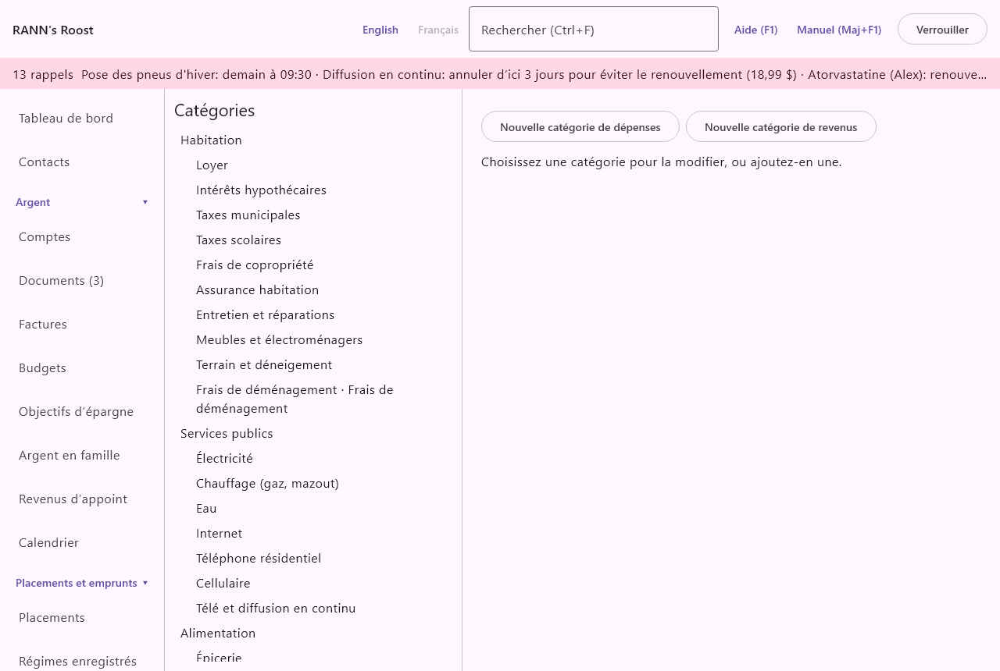

# Catégories

Les catégories classent l'argent qui entre et qui sort : Épicerie, Électricité, Salaire. Chaque opération, ou chaque ventilation d'une opération, peut avoir une catégorie, et les budgets, les rapports et la trousse fiscale additionnent les montants par catégorie. L'écran se trouve dans le groupe **Réglages** du menu, sous **Catégories**.

## Comment fonctionnent les catégories {#about-categories}

@index: arbre des catégories; sous-catégorie; catégorie de dépenses; catégorie de revenus; classement

- Il y a deux types : les catégories de dépenses (l'argent qui sort) et les catégories de revenus (l'argent qui entre). Une sous-catégorie a toujours le même type que sa catégorie parente.
- Les catégories forment un arbre : Alimentation, puis Épicerie, Restaurants et Café et collations en dessous. Une sous-catégorie peut avoir ses propres sous-catégories.
- Chaque catégorie a un nom en anglais et un nom en français. L'application affiche le nom dans la langue utilisée, pour qu'un ménage bilingue puisse changer de langue en tout temps.
- Une catégorie peut porter un traitement fiscal, comme Frais médicaux ou Dons de bienfaisance, qui rassemble ses montants pour la période des impôts.

## Les catégories par défaut {#default-categories}

@index: catégories de départ; catégories intégrées; catégories prédéfinies

Un nouveau ménage commence avec un ensemble complet de catégories canadiennes, dans les deux langues : Habitation, Services publics, Alimentation, Transport, Santé, Assurances, Enfants, Dépenses personnelles, Animaux de compagnie, Loisirs, Voyages, Cadeaux et dons, Éducation, Frais financiers, Impôts, Retenues sur la paie, Dépenses d'emploi, Dépenses de travail autonome et Divers pour les dépenses ; Revenus d'emploi, Revenus de travail autonome, Revenus de location, Rentes et pensions, Prestations gouvernementales, Revenus de placement, Cadeaux reçus, Remboursements, Remboursements d'impôt et Autres revenus pour les revenus.

- Certaines catégories par défaut dépendent de la province du ménage : par exemple l'Allocation famille (Québec) et le Crédit d'impôt pour solidarité, ou l'assurance-emploi hors Québec. Quand la province est changée à l'écran [Membres du ménage](members), les catégories par défaut de la nouvelle province sont ajoutées ; rien n'est retiré.
- Quand une nouvelle version de l'application apporte de nouvelles catégories par défaut, elles sont ajoutées une fois aux ménages existants. Une catégorie par défaut que vous avez archivée n'est pas ramenée.
- Certaines catégories par défaut ont un sens particulier pour l'application, quel que soit le nom que vous leur donnez. Par exemple Salaire compte comme revenu d'emploi dans la trousse fiscale, et les catégories de retenues sur la paie (Cotisations au RPC / RRQ, Cotisations d'AE / RQAP, Cotisations au régime de retraite, Cotisations au REER collectif, Cotisations syndicales et professionnelles) vont à leurs propres lignes de celle-ci. Les talons de paie et les frais de change utilisent aussi leurs catégories par défaut. Renommer une telle catégorie est sans risque ; elle garde son sens.

> Conseil : Plutôt que de bâtir votre propre arbre, partez des catégories par défaut et archivez celles dont vous n'avez pas besoin. L'archivage garde les sens particuliers intacts.

## L'écran Catégories {#screen}

La gauche liste toutes les catégories dans l'ordre de l'arbre : les catégories de dépenses d'abord, puis les catégories de revenus, chaque sous-catégorie en retrait sous sa catégorie parente. Une catégorie qui a un traitement fiscal l'affiche après son nom, comme « Frais de garde · Frais de garde d'enfants ». Les catégories archivées sont en gris.

La droite a trois boutons en haut et le formulaire en dessous :

- **Nouvelle catégorie de dépenses** : commence une nouvelle catégorie de dépenses de premier niveau.
- **Nouvelle catégorie de revenus** : commence une nouvelle catégorie de revenus de premier niveau.
- **Nouvelle sous-catégorie** : affiché quand une catégorie est choisie. Commence une nouvelle catégorie sous celle qui est choisie, du même type.

Quand rien n'est choisi, la zone du formulaire indique « Choisissez une catégorie pour la modifier, ou ajoutez-en une. »

## Ajouter une catégorie {#add-category}

1. Pour ajouter une catégorie de premier niveau, cliquez sur **Nouvelle catégorie de dépenses** ou **Nouvelle catégorie de revenus**. Pour en ajouter une dans une autre, cliquez sur la catégorie parente dans la liste, puis sur **Nouvelle sous-catégorie**.
2. Le titre du formulaire dit ce que vous créez : « Nouvelle catégorie de dépenses », « Nouvelle catégorie de revenus » ou « Nouvelle sous-catégorie de » suivi du nom de la catégorie parente.
3. Tapez le **Nom en anglais** et le **Nom en français**.
4. Choisissez un **Traitement fiscal** s'il y a lieu.
5. Cliquez sur **Enregistrer**. La nouvelle catégorie est choisie dans la liste.

### Le formulaire de catégorie {#category-fields}

- **Nom en anglais** : le nom affiché quand l'application est en anglais. Obligatoire, à moins que le nom français soit rempli : si vous laissez un nom vide, l'autre sert pour les deux. **Enregistrer** reste grisé tant que les deux sont vides.
- **Nom en français** : le nom affiché quand l'application est en français.
- **Dans** : affiché pour une catégorie déjà enregistrée. La catégorie sous laquelle elle se trouve, ou (premier niveau). Seules les catégories du même type sont offertes, jamais la catégorie elle-même ni une catégorie qu'elle contient. Voir [Modifier une catégorie](categories#change-category).
- **Traitement fiscal** : (aucun), ou l'une des lignes fiscales ci-dessous. Une nouvelle sous-catégorie commence avec le traitement de sa catégorie parente, que vous pouvez changer. Voir [Traitement fiscal](categories#tax-treatment).
- **Archivé (masqué des listes)** : affiché pour une catégorie déjà enregistrée. Voir [Archiver une catégorie](categories#archive-category).
- **Enregistrer** : enregistre la catégorie. Rien n'est enregistré avant que vous cliquiez.

## Traitement fiscal {#tax-treatment}

@index: indicateur fiscal; catégorie fiscale; déductible; crédit d'impôt; dons; frais de garde; frais de scolarité; frais de déménagement; dépenses d'emploi; travail autonome; frais médicaux

Le traitement fiscal relie une catégorie à une partie de l'année fiscale. Chaque montant de cette catégorie, dans n'importe quel compte, est alors rassemblé à cette fin, pour la personne à qui l'opération ou la ventilation s'applique (ou pour le titulaire du compte).

- Frais médicaux : marque les dépenses de soins de santé. Le crédit pour frais médicaux lui-même est calculé à partir des réclamations de l'écran [Réclamations médicales](medical).
- Dons de bienfaisance : les paiements apparaissent dans l'onglet **Dons** de [Impôts](taxes), par personne, avec leurs reçus officiels.
- Contributions politiques : de même, comme contributions politiques.
- Frais de garde d'enfants : rassemblés dans la trousse fiscale de fin d'année comme frais de garde d'enfants.
- Frais de scolarité : rassemblés dans la trousse fiscale comme frais de scolarité.
- Travail autonome : dans la trousse fiscale, l'argent qui entre compte comme revenu d'entreprise et l'argent qui sort comme dépenses d'entreprise.
- Dépenses d'emploi : rassemblées dans la trousse fiscale comme dépenses d'emploi.
- Frais de déménagement : rassemblés dans la trousse fiscale comme frais de déménagement.

Une seule ventilation d'une opération peut aussi porter son propre traitement fiscal, qui l'emporte alors sur celui de sa catégorie. Changer le traitement fiscal d'une catégorie change les totaux de toutes les années, y compris les années passées, la prochaine fois que vous les consultez.

> Remarque : Le traitement fiscal est une aide pour rassembler les montants, pas un conseil fiscal. Vérifiez ce que vous pouvez demander auprès de l'ARC ou de Revenu Québec.

## Modifier une catégorie {#change-category}

1. Cliquez sur la catégorie dans la liste.
2. Changez ses noms, son emplacement (**Dans**), son traitement fiscal ou sa case Archivé.
3. Cliquez sur **Enregistrer**.

Un nouveau nom s'affiche tout de suite sur chaque opération, budget et rapport qui utilise la catégorie, y compris les anciens, et sur le téléphone à sa prochaine mise à jour.

Pour déplacer une catégorie, choisissez une autre catégorie du même type dans **Dans**, ou (premier niveau). Ses sous-catégories la suivent, et elle va en dernier parmi ses nouvelles voisines. Les opérations, les budgets et les rapports continuent de l'utiliser ; les rapports la comptent maintenant sous sa nouvelle catégorie parente. Une catégorie de dépenses ne peut pas devenir une catégorie de revenus, ni l'inverse : pour changer son type, créez une nouvelle catégorie et archivez l'ancienne.

## Archiver une catégorie {#archive-category}

@index: supprimer une catégorie; masquer une catégorie; retirer une catégorie

Il n'y a pas de bouton pour supprimer une catégorie : les opérations passées doivent garder la leur. Pour cesser d'en utiliser une :

1. Cliquez dessus dans la liste.
2. Cochez **Archivé (masqué des listes)**.
3. Cliquez sur **Enregistrer**.

Une catégorie archivée n'est plus offerte dans les listes de catégories (opérations, factures, budgets, règles, bénéficiaires, téléphone). Les opérations qui l'utilisent déjà la gardent, et les rapports les comptent toujours sous elle. Pour l'utiliser de nouveau, décochez la case et cliquez sur **Enregistrer**.

## Où les catégories servent {#where-used}

- Le registre de chaque compte : la catégorie d'une opération ou de chaque ventilation. Voir [Comptes](accounts).
- Les importations de relevés : les [Règles de catégorie](rules) et la catégorie par défaut de chaque bénéficiaire choisissent la catégorie des nouvelles lignes.
- [Bénéficiaires](payees) : une catégorie par défaut par bénéficiaire.
- [Factures](bills) : la catégorie dans laquelle une facture est inscrite quand elle est payée.
- [Budgets](budgets) : un budget est fixé par catégorie et comparé aux montants réels.
- [Rapports](reports) : dépenses et revenus par catégorie, et rapports personnalisés.
- [Impôts](taxes) : les dons et la trousse fiscale, par le traitement fiscal.
- [Documents](documents) : la catégorie d'une opération créée à partir d'un reçu.
- Le téléphone : les catégories des reçus saisis dans RANN's Roost Mobile. Voir [Téléphones](phones).

## Qui peut modifier les catégories {#permissions}

Les administrateurs et les membres peuvent ajouter et modifier des catégories. Les lecteurs voient la liste et le formulaire de chaque catégorie en gris, sans les boutons pour ajouter ou enregistrer, avec la remarque « À titre de lecteur, vous pouvez voir cette liste, mais pas la modifier. »
