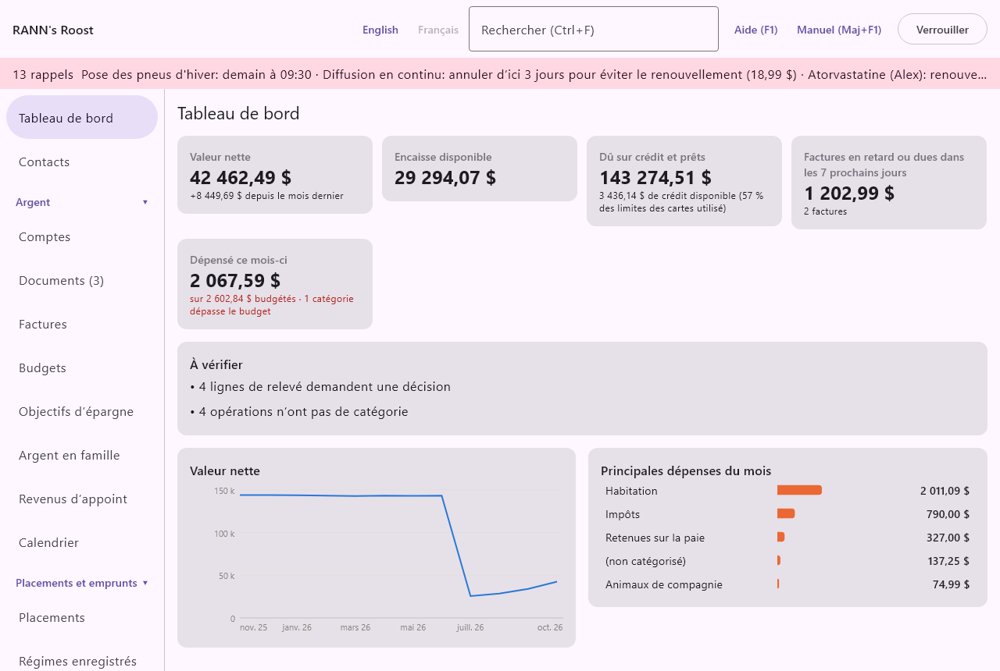

# Tableau de bord

Le tableau de bord est le premier écran qui s’affiche à l’ouverture du ménage. En une page, il montre où en est le ménage aujourd’hui et ce qui vous attend. Il se trouve en haut du menu, au-dessus des groupes, que le menu soit à gauche ou en haut.

Rien ne se saisit dans le tableau de bord. Chaque chiffre vient du reste des livres : comptes, factures, budgets, relevés, sauvegardes et taux de change. Il est recalculé chaque fois que quelque chose change ; il est donc toujours à jour. Presque tout s’y clique pour ouvrir l’écran correspondant.

## Ce que montre le tableau de bord {#overview}

@index: écran d’accueil; sommaire; vue d’ensemble

De haut en bas, le tableau de bord contient :

- le guide Premiers pas, dans un nouveau ménage seulement (voir [Guide Premiers pas](dashboard#getting-started-guide)) ;
- une rangée de tuiles avec les chiffres principaux (voir [Les tuiles](dashboard#tiles)) ;
- la liste À vérifier (voir [À vérifier](dashboard#needs-attention)) ;
- côte à côte, un graphique de la valeur nette des douze derniers mois et les principales catégories de dépenses du mois (voir [Graphique de la valeur nette](dashboard#net-worth-chart) et [Principales dépenses du mois](dashboard#top-spending)).

La page défile quand la fenêtre est trop petite pour tout afficher.

> Remarque : Le tableau de bord ne compte que ce que vous avez le droit de voir. Un membre qui ne peut pas ouvrir un groupe de comptes ne voit pas ses comptes, ses factures ni ses dépenses dans ces totaux. Voir [Utilisateurs](users).

## Guide Premiers pas {#getting-started-guide}

@index: démarrage; configuration; premières étapes; Premiers pas

Dans un nouveau ménage, une carte en couleur en haut du tableau de bord vous guide dans les premières étapes. Son titre compte les étapes faites, par exemple Premiers pas : 2 sur 6 faits. Sous le titre, une courte phrase explique que chaque étape ouvre l’écran qui s’en charge.

Chaque étape affiche un cercle (à faire) ou un crochet (fait). Une étape à faire affiche une ligne d’aide et un bouton. La prochaine étape à faire est en gras et son bouton est plein, pour qu’elle ressorte ; les autres boutons sont simplement encadrés. Une étape se coche d’elle-même dès que les livres montrent qu’elle est faite : vous ne la cochez jamais à la main.

### Les six étapes {#setup-steps}

- **Les personnes du ménage** : faite dès qu’il existe au moins un membre du ménage. Le bouton **Ajouter des personnes** ouvre Membres du ménage. Les personnes permettent que comptes, dépenses, dossiers de santé et impôts appartiennent à quelqu’un. Voir [Membres du ménage](members).
- **Vos comptes** : faite dès que le ménage a au moins un compte. Le bouton **Ajouter un compte** ouvre le formulaire Ajouter un compte directement sur le tableau de bord, le même que dans l’écran Comptes. Voir [Ajouter ou modifier un compte](accounts#account-dialog).
- **Vos factures et votre paie** : faite dès qu’au moins une facture ou un jour de paie est inscrit. Le bouton **Ajouter des factures** ouvre Factures. Voir [Factures](bills).
- **Un premier reçu** : faite dès que le coffre contient un document, importé dans l’écran Documents, déposé là, envoyé du téléphone ou enregistré d’un courriel. Le bouton **Ouvrir Documents** ouvre Documents. Voir [Faire entrer des documents](documents#adding-documents).
- **Un premier relevé, rapproché** : faite dès qu’un relevé d’un compte a été rapproché jusqu’au bout. Le bouton **Ouvrir un compte** ouvre Comptes, où vous choisissez le compte, puis **Importer un relevé…** et **Rapprocher…**. Voir [Importer un relevé](accounts#import-statement) et [Rapprocher un relevé](accounts#reconcile).
- **Le téléphone (facultatif)** : faite dès qu’un téléphone est jumelé et non révoqué. Le bouton **Jumeler un téléphone** ouvre Téléphones. Voir [Téléphones](phones).

Le guide disparaît de lui-même une fois les cinq premières étapes faites. Le téléphone étant facultatif, le guide ne l’attend pas.

### Masquer ce guide {#hide-guide}

- **Masquer ce guide** : retire aussitôt le guide de votre tableau de bord, même s’il reste des étapes. C’est mémorisé pour vous seulement : les autres utilisateurs du ménage voient leur propre guide jusqu’à ce qu’ils le masquent ou terminent les étapes. Pour le faire revenir, choisissez **Afficher de nouveau le guide Premiers pas** dans [Affichage et accessibilité](display#getting-started-guide) ; chaque étape qu’il propose est aussi faisable à partir du menu.

## Les tuiles {#tiles}

@index: chiffres clés; totaux; cartes

Une rangée de tuiles donne les chiffres principaux. Chaque tuile affiche un libellé, un grand montant et, pour la plupart, une courte ligne de détail. Cliquez sur une tuile pour ouvrir l’écran correspondant. Quand la fenêtre est étroite, les tuiles passent sur une deuxième rangée.

Tous les montants des tuiles sont dans la devise de base du ménage. Les soldes et factures dans d’autres devises sont convertis au taux de change du jour ; voir [Montants dans d’autres devises](dashboard#currencies).

### Valeur nette {#net-worth-tile}

@index: valeur nette; actif moins passif; avoir net

- **Valeur nette** : tout ce que le ménage possède moins tout ce qu’il doit, aujourd’hui. Elle additionne tous les comptes (comptes bancaires, placements à leur valeur marchande avec leurs liquidités, biens, et cartes de crédit et prêts en montants négatifs) et les biens que vous avez marqués comme comptant dans la valeur nette dans Maison et biens. Les comptes fermés comptent aussi, à leur solde, qui est normalement nul.
  La ligne de détail, par exemple +1 250,00 $ depuis le mois dernier, compare aujourd’hui avec la fin du mois dernier. Un signe plus veut dire que la valeur nette a augmenté.
  Un clic sur la tuile ouvre Rapports, où le rapport Valeur nette donne le détail. Voir [Rapports](reports).

### Encaisse disponible {#cash-tile}

@index: encaisse; solde bancaire; argent disponible

- **Encaisse disponible** : le solde total d’aujourd’hui de tous les comptes ouverts du groupe Comptes bancaires : compte chèques, épargne, épargne à intérêt élevé, CPG ou dépôts à terme, argent comptant et cartes prépayées ou cartes-cadeaux. Les placements, cartes de crédit et prêts n’y sont pas. Les opérations datées après aujourd’hui (postdatées) comptent une fois leur jour venu. Un clic sur la tuile ouvre Comptes.

> Remarque : Un CPG compte ici parce que c’est un type de compte bancaire, même si l’argent est bloqué jusqu’à l’échéance.

### Dû sur crédit et prêts {#credit-tile}

@index: dettes; montant dû; solde de carte de crédit; solde hypothécaire

- **Dû sur crédit et prêts** : ce que le ménage doit aujourd’hui sur tous les comptes ouverts des groupes Crédit et Prêts : cartes de crédit, marges de crédit, marges de crédit hypothécaires, prêts et prêts hypothécaires. Le montant est affiché en positif. Une carte en solde créditeur (vous avez payé plus que le dû) réduit le total. Les opérations datées après aujourd’hui ne comptent pas encore.
  Quand au moins une carte ou marge de crédit a une limite de crédit (voir [Détails de la carte de crédit](accounts#card-details)), la ligne de détail donne le crédit encore disponible sur ces comptes et la part de leurs limites utilisée, par exemple 3 800,00 $ de crédit disponible (24 % des limites des cartes utilisé). Elle est en rouge quand les soldes dépassent les limites.
  Un clic sur la tuile ouvre Comptes.

### Factures en retard ou dues dans les 7 prochains jours {#bills-tile}

@index: factures à venir; échéances proches

- **Factures en retard ou dues dans les 7 prochains jours** : le total des paiements de factures pas encore payés qui sont soit en retard (jusqu’à un an en arrière), soit dus dans les sept prochains jours, pour que rien de tardif ne soit caché. Les jours de paie et autres revenus sont exclus.
  La ligne de détail les compte : 1 facture, 3 factures, ou rien à payer. Une facture dont le montant varie compte pour son montant estimé.
  Un clic sur la tuile ouvre Factures. Voir [Factures](bills).

### Dépensé ce mois-ci {#budget-tile}

@index: budget; dépenses du mois; dépassement de budget

- **Dépensé ce mois-ci** : cette tuile n’apparaît que si au moins une catégorie de dépenses a un budget. Elle montre ce qui a été dépensé ce mois-ci dans les catégories budgétées (sous-catégories comprises), avec une ligne de détail donnant le total budgété, par exemple sur 3 200,00 $ budgétés.
  Quand une ou plusieurs catégories dépassent leur budget (au-delà du pourcentage d’alerte de budget de [Taux et règles](rates-rules), 100 % par défaut), le détail ajoute 1 catégorie dépasse le budget (ou le nombre de catégories), en rouge.
  Un clic sur la tuile ouvre Budgets. Voir [Budgets](budgets).

## À vérifier {#needs-attention}

@index: vérification; à faire; avertissements; alertes; rappels

Cette carte rassemble tout ce qui attend une décision. Chaque ligne est un lien : cliquez dessus pour ouvrir l’écran où la régler. Quand il n’y a rien à faire, elle affiche Rien à vérifier. Tout est à jour.

Les lignes possibles, dans cet ordre :

- Factures en retard, par exemple 1 facture est en retard ou 3 factures sont en retard : des factures impayées dont l’échéance est passée. Ouvre Factures, où vous inscrivez le paiement ou sautez l’échéance. Voir [Factures](bills).
- Lignes de relevé, par exemple 2 lignes de relevé demandent une décision : des lignes importées, dans des relevés en cours de rapprochement, marquées À confirmer ou Aucune correspondance. Ouvre Comptes. Choisissez le compte, puis **Rapprocher…** pour les régler. Voir [Lignes à vérifier](accounts#reconcile-attention).
- Catégories manquantes, par exemple 5 opérations n’ont pas de catégorie : des opérations dont au moins une ligne n’a pas de catégorie. Les virements entre vos comptes ne sont pas comptés, puisqu’ils n’ont jamais besoin de catégorie. Ouvre Comptes ; les registres affichent (non catégorisé) dans la colonne Catégorie. Les montants non catégorisés ne comptent dans aucun budget et paraissent comme (non catégorisé) dans les rapports : il vaut la peine de les corriger.
- Comptes en retard, par exemple Compte chèques conjoint n’a pas été rapproché depuis plus de 45 jours : une ligne par compte dont le dernier relevé rapproché date de plus de 45 jours (par défaut, réglable dans [Taux et règles](rates-rules)). Un compte jamais rapproché n’est pas listé ici ; l’écran Comptes l’indique plutôt par Jamais rapproché. Ouvre Comptes.
- Aucune sauvegarde réussie dans les 7 derniers jours : aucune sauvegarde n’a réussi depuis une semaine, ou aucune n’a jamais été faite. Ouvre Sauvegardes. Voir [Sauvegardes](backups).
- Alertes de compte, en rouge, par exemple Compte chèques : solde de 412,00 $, sous 500,00 $ : les alertes réglées sur les comptes (solde bas, limite de carte, activité inhabituelle). Un clic ouvre ce compte. Une opération inhabituelle a un bouton **Écarter** une fois vérifiée. Voir [Alertes de compte](accounts#account-alerts).
- Consommation inhabituelle, par exemple Chalet électricité : consommation inhabituelle en septembre 2026 (+35 % par rapport au même mois l’an dernier) : un compteur dont le dernier mois complet, le mois dernier ou celui d’avant, a consommé plus que d’habitude. Ouvre Services publics. Voir [Services publics](utilities#meters).
- Taux manquants, par exemple Aucun taux de change pour USD : ces montants sont exclus : des soldes, factures ou dépenses sont dans une devise sans taux connu, et ne sont donc pas dans les totaux ci-dessus. Ouvre Taux et cours, où vous ajoutez le taux. Voir [Taux et cours](rates).

## Graphique de la valeur nette {#net-worth-chart}

@index: historique de la valeur nette; tendance

La carte du bas, à gauche, trace la valeur nette en ligne sur les douze derniers mois : la fin de chacun des onze mois précédents, et aujourd’hui pour le mois en cours. Les mois sont indiqués en bas (par exemple mars 26) et les montants à gauche sont abrégés (12,5 k).

Passez le pointeur sur le graphique : une ligne et une petite bulle montrent le mois et la valeur nette exacte à ce point. Le graphique compte les mêmes éléments que la tuile Valeur nette. Pour d’autres périodes ou un graphique par compte, utilisez le rapport Valeur nette dans [Rapports](reports).

## Principales dépenses du mois {#top-spending}

@index: dépenses par catégorie; plus grosses dépenses

La carte du bas, à droite, classe les cinq plus grandes catégories de dépenses du mois, du premier du mois à aujourd’hui, en barres avec leur montant. Les sous-catégories s’additionnent à leur catégorie principale (Épicerie et Restaurants comptent dans Alimentation, par exemple). Les dépenses sans catégorie paraissent comme (non catégorisé). Les remboursements réduisent la catégorie où ils sont inscrits.

Cliquez sur une barre pour ouvrir Rapports et voir le détail. Quand rien n’a encore été dépensé ce mois-ci, la carte affiche Aucune dépense inscrite ce mois-ci.

## Montants dans d’autres devises {#currencies}

@index: devise de base; devise étrangère; USD; taux de change

Le tableau de bord additionne les montants de toutes les devises en un seul total dans la devise de base. Chaque montant est converti au taux de change connu pour aujourd’hui (ou au dernier taux connu avant aujourd’hui). Quand aucun taux n’est connu pour une devise, ses montants sont exclus des totaux et la liste À vérifier indique la devise manquante. Ajoutez le taux dans [Taux et cours](rates) et le tableau de bord se met à jour aussitôt.
