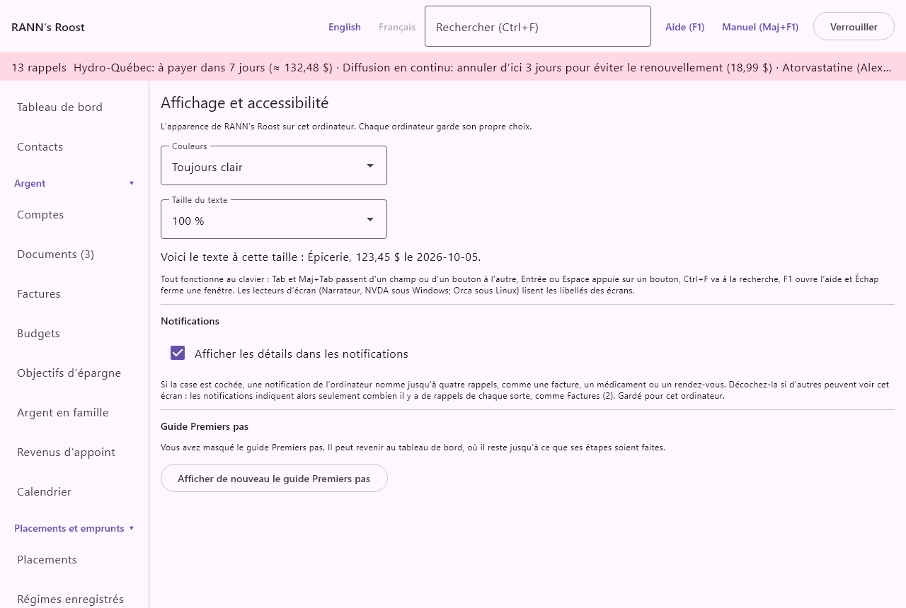
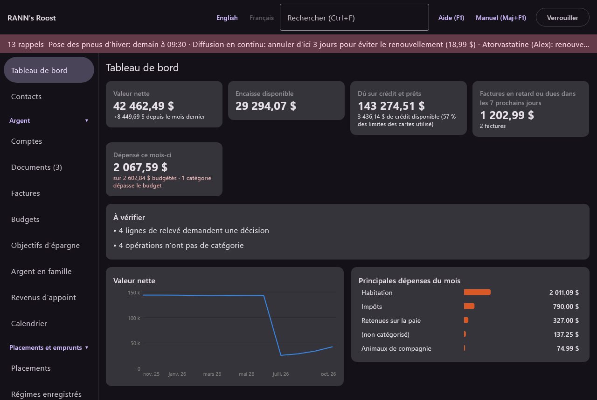
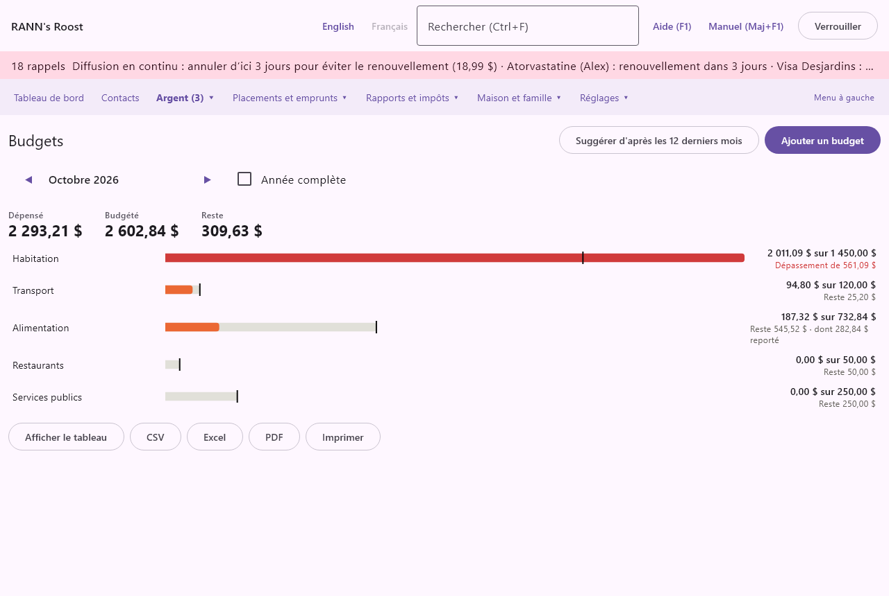

# Affichage et accessibilité

Affichage et accessibilité règle l'apparence de RANN's Roost sur cet ordinateur : les couleurs et la taille du texte. Ce chapitre couvre aussi les autres façons d'adapter l'application à vous : la place du menu, les groupes du menu qui restent ouverts, la langue et le clavier. L'écran se trouve dans le groupe **Réglages** du menu, sous **Affichage et accessibilité**.

## Des réglages pour cet ordinateur {#per-computer}

@index: préférences; réglages personnels; par ordinateur

Les réglages d'affichage sont gardés sur cet ordinateur, pas dans le ménage. Un grand écran de bureau et un petit portable peuvent chacun avoir les leurs, et ils ne sont pas dans les sauvegardes. Les couleurs, la taille du texte, les détails des notifications et la langue s'appliquent à chaque ménage et à chaque utilisateur de cet ordinateur ; les choix de menu sont gardés pour chaque utilisateur.

## L'écran Affichage et accessibilité {#screen}

### Couleurs {#colours}

@index: thème; mode sombre; mode clair; couleurs; contraste

- **Couleurs** : comment l'application est colorée.
  - Comme le système (clair ou sombre) : suit le réglage clair ou sombre de Windows ou de Linux. C'est la valeur par défaut.
  - Toujours clair : texte foncé sur fond clair, quel que soit le réglage du système.
  - Toujours sombre : texte clair sur fond foncé.

Le changement s'applique tout de suite, à la fenêtre principale et à la fenêtre du manuel. Les graphiques suivent le même choix.

### Taille du texte {#text-size}

@index: taille de police; texte plus grand; zoom; basse vision; agrandir

- **Taille du texte** : 90 %, 100 %, 115 %, 130 % ou 150 % de la taille normale. La valeur par défaut est 100 %.

Le changement s'applique tout de suite à chaque écran, à chaque fenêtre et au manuel. Avec une taille plus grande, le menu de gauche s'élargit pour que ses noms restent sur une ligne. Sous le réglage, une ligne d'exemple (« Voici le texte à cette taille : Épicerie, 123,45 $ le 2026-10-05. ») montre le résultat.

> Conseil : Si un écran semble chargé à une grande taille, agrandissez la fenêtre ou placez le menu en haut (voir [Le menu](display#menu)).

### Clavier et lecteurs d'écran {#keyboard}

@index: clavier; accessibilité; lecteur d'écran; Narrateur; NVDA; Orca; raccourcis

Tout fonctionne au clavier :

- Tab et Maj+Tab passent d'un champ ou d'un bouton à l'autre.
- Entrée ou Espace appuie sur un bouton.
- Ctrl+F va à la boîte de recherche.
- F1 ouvre l'aide sur l'écran affiché ; Maj+F1 ouvre ce manuel au chapitre de cet écran.
- Échap ferme une fenêtre.
- Dans un champ de date, taper + ou - avance ou recule la date d'un jour.

Les lecteurs d'écran (Narrateur ou NVDA sous Windows, Orca sous Linux) lisent les libellés des champs et des boutons, et disent si un groupe du menu est ouvert ou fermé. Voir [Raccourcis clavier](shortcuts) pour la liste complète.

### Notifications {#notifications}

@index: détails des notifications; écran partagé; confidentialité des notifications

- **Afficher les détails dans les notifications** : si la case est cochée (par défaut), une notification de l'ordinateur nomme jusqu'à quatre rappels, comme le fait le bandeau des rappels : une facture, un médicament avec la personne à qui il est destiné, ou un rendez-vous. Décochez-la quand d'autres peuvent voir cet écran : les notifications indiquent alors seulement combien il y a de rappels et de quelle sorte, comme « Factures (2) » ou « Santé (1) », sans rien nommer. Le bandeau dans l'application ne change pas.

Le choix est gardé sur cet ordinateur, pour chaque ménage et chaque utilisateur. Voir [Les notifications de l'ordinateur et l'icône de la zone de notification](basics#tray).

### Guide Premiers pas {#getting-started-guide}

@index: réafficher le guide; démarrage; Premiers pas

Quand vous avez masqué le guide Premiers pas du tableau de bord, cet écran affiche Guide Premiers pas avec un bouton :

- **Afficher de nouveau le guide Premiers pas** : fait revenir le guide sur votre tableau de bord et ouvre le tableau de bord. Le guide reste ensuite jusqu’à ce que ses quatre premières étapes soient faites, comme avant ; si elles le sont déjà, il n’a plus rien à afficher. Voir [Guide Premiers pas](dashboard#getting-started-guide).

Contrairement aux autres réglages de cet écran, celui-ci est conservé dans le ménage, pour vous seulement. Cette partie n’est pas affichée tant que le guide n’est pas masqué.

## Le menu {#menu}

@index: navigation; position du menu; menu latéral; menu du haut; barre de menu

Le menu peut se placer à deux endroits. Le choix de chaque utilisateur est retenu sur cet ordinateur.

- Une liste à gauche (par défaut) : le **Tableau de bord** en haut, puis les groupes Argent, Placements et emprunts, Rapports et impôts, Maison et famille, et Réglages, chacun avec ses écrans.
- Une barre en haut : le **Tableau de bord** et un bouton par groupe, qui ouvre chacun une liste déroulante de ses écrans. Le groupe de l'écran affiché est en gras.

Pour passer de l'un à l'autre :

- **Menu en haut** : au bas de la liste de gauche.
- **Menu à gauche** : à l'extrémité droite de la barre du haut.

### Des groupes qui se replient {#menu-groups}

Dans la liste de gauche, cliquez sur le nom d'un groupe pour le replier ou l'ouvrir. Les groupes que vous laissez fermés sont retenus pour vous sur cet ordinateur. Réglages commence fermé. Le groupe de l'écran affiché reste toujours ouvert.

Des nombres entre parenthèses montrent ce qui vous attend, comme des documents à réviser : après le nom d'un écran, et après le nom d'un groupe fermé pour tout ce qu'il contient.

## Langue {#language}

@index: français; anglais; English; bilingue; changer de langue

- **English** : passe tout de suite l'application en anglais.
- **Français** : passe tout de suite l'application en français.

Les deux boutons sont en haut de la fenêtre, sur chaque écran, y compris l'écran de départ. La langue utilisée est en gris.

Le choix est retenu sur cet ordinateur. Tant que vous n'avez pas choisi, l'application démarre dans la langue de l'ordinateur (le français si le système est en français, sinon l'anglais).

Ce que la langue change :

- Chaque libellé, message, page d'aide et ce manuel.
- Les noms des catégories : chaque catégorie a un nom anglais et un nom français, et celui de la langue utilisée est affiché. Voir [Catégories](categories).
- Le texte que l'application écrit elle-même à partir de ce moment, comme la note d'une ligne de frais de change générée.
- Les montants sont écrits à l'anglaise ou à la française canadienne, comme $1,234.56 ou 1 234,56 $. Les dates sont toujours écrites au format AAAA-MM-JJ dans les deux langues.

Les noms que vous avez tapés vous-même, comme les comptes, les bénéficiaires et les notes, restent tels que vous les avez tapés.

## Aide et manuel {#help}

- **Aide (F1)** : en haut de la fenêtre. Ouvre une courte page d'aide sur l'écran affiché.
- **Manuel (Maj+F1)** : ouvre ce manuel, au chapitre de l'écran affiché.
