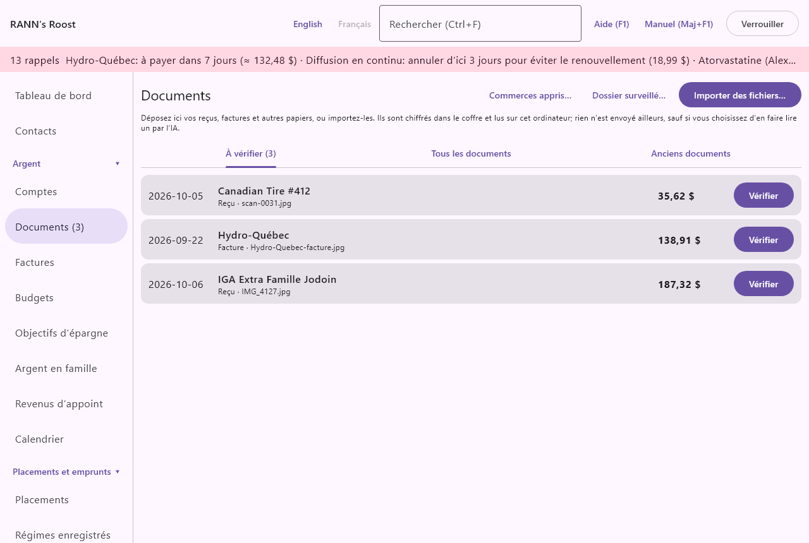
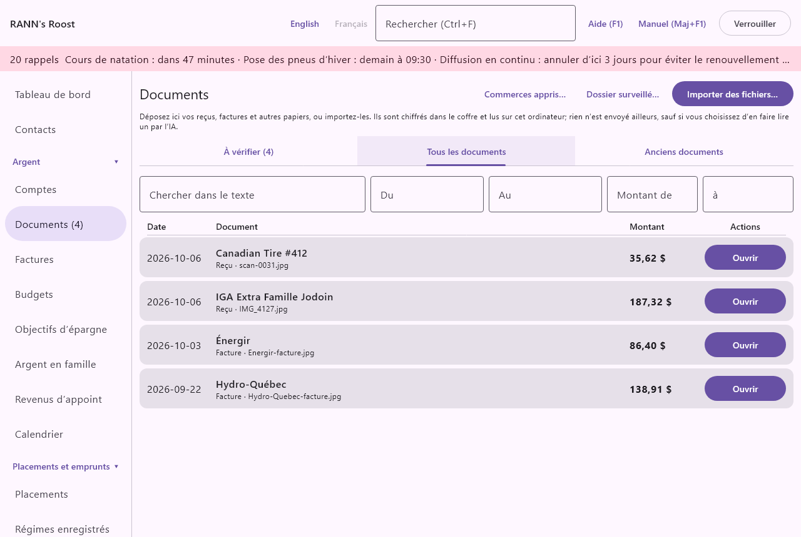

# Documents

L’écran Documents est le classeur de votre ménage. Il conserve les reçus, factures, relevés, talons de paie et autres papiers dans un coffre chiffré, les lit sur cet ordinateur et vous aide à classer chacun avec l’opération ou la facture à laquelle il se rapporte. Documents se trouve dans le groupe Argent du menu.

## Ce que fait l’écran Documents {#overview}
@index: coffre; coffre de documents; reçus; numérisation; sans papier; classeur

Chaque document passe par les trois mêmes étapes :

1. Il arrive : vous importez un fichier, le déposez sur l’écran, l’enregistrez dans un dossier surveillé ou l’envoyez de votre téléphone.
2. Il est lu : le texte est reconnu sur cet ordinateur, et le commerce, la date, le total et d’autres détails en sont extraits. Vous pouvez aussi faire lire un document difficile par l’IA, si vous l’avez activée.
3. Vous le vérifiez et le classez : vous contrôlez les détails, puis vous joignez le document à une opération, inscrivez son montant sur une facture, créez une nouvelle opération à partir de lui, ou le classez simplement.

Tant que vous ne l’avez pas classé, un document attend dans l’onglet **À vérifier**. Le nombre de documents en attente est affiché sur l’onglet et à côté de Documents dans le menu.

L’écran comprend une barre de titre avec deux boutons, un court rappel de son fonctionnement, le message de la dernière importation et trois onglets : **À vérifier**, **Tous les documents** et **Anciens documents**.

- **Dossier surveillé…** : ouvre les réglages du dossier importé automatiquement. Voir [Le dossier surveillé](documents#watched-folder).
- **Importer des fichiers…** : ouvre une fenêtre où vous choisissez un ou plusieurs fichiers à importer. Pendant la lecture, le bouton affiche **Lecture…** et ne peut pas être cliqué de nouveau.

> Remarque : Les documents sont chiffrés dans le coffre et lus sur cet ordinateur. Rien n’est envoyé ailleurs, sauf si vous choisissez de faire lire un document par l’IA.

## Faire entrer des documents {#adding-documents}
@index: importer; ajouter un document; téléverser; numériser

### Importer des fichiers {#import-files}

Cliquez sur **Importer des fichiers…**, choisissez un ou plusieurs fichiers et confirmez. La fenêtre indique les types acceptés : PDF, photos JPEG, PNG, HEIC et HEIF, images BMP et GIF, courriels enregistrés (.eml) et fichiers de transfert du téléphone.

Chaque fichier peut peser jusqu’à 50 Mo. À la fin de l’importation, l’écran passe à l’onglet **À vérifier** et un message sous le titre indique ce qui s’est passé, par exemple « 2 documents ajoutés à la boîte de réception. 1 était déjà dans le coffre. »

Les nouveaux documents vont dans le groupe de comptes partagé où vous pouvez ajouter des données (ou, si vous n’en avez aucun, dans votre groupe privé). Les documents importés sont visibles par les personnes qui peuvent ouvrir ce groupe.

### Glisser-déposer {#drag-and-drop}

Vous pouvez aussi faire glisser des fichiers depuis votre gestionnaire de fichiers ou votre bureau et les déposer n’importe où sur l’écran Documents. Une bordure de couleur apparaît pendant que vous tenez les fichiers au-dessus de l’écran. Les fichiers déposés sont importés exactement comme ceux choisis avec **Importer des fichiers…**.

### Le dossier surveillé {#watched-folder}
@index: numériseur; scanneur; dossier de numérisation; factures électroniques; factures téléchargées; importation automatique

Un dossier surveillé est un dossier de cet ordinateur que l’application vérifie régulièrement. Faites-y enregistrer les fichiers de votre numériseur, ou vos factures électroniques téléchargées, et chaque nouveau fichier est importé tout seul.

Cliquez sur **Dossier surveillé…** pour ouvrir ses réglages :

- La ligne du haut indique le dossier surveillé, ou « Aucun dossier surveillé. »
- **Choisir le dossier…** : choisit le dossier à surveiller.
- **Arrêter la surveillance** : retire le dossier, pour que plus rien n’en soit importé. Ce bouton n’apparaît que si un dossier est choisi. Cliquez ensuite sur **Enregistrer** pour confirmer.
- **Enregistrer dans** : le groupe de comptes où vont les documents importés. Les groupes marqués « (privé) » ne sont visibles que par vous. Par défaut, le groupe partagé où vous pouvez ajouter des données.

Fonctionnement du dossier surveillé :

- L’application examine le dossier environ toutes les 20 secondes tant que le ménage est ouvert.
- Seuls les fichiers des types acceptés sont pris. Les fichiers cachés (dont le nom commence par un point) sont ignorés.
- Un fichier modifié dans les dernières secondes est laissé pour le tour suivant, pour qu’une numérisation en cours d’écriture ne soit pas lue à moitié.
- Après l’importation, chaque fichier est déplacé dans un dossier nommé « Imported » à l’intérieur du dossier surveillé, pour que rien ne soit importé deux fois. Si un fichier du même nom s’y trouve déjà, un numéro est ajouté, comme « recu (2).pdf ».
- Les sous-dossiers ne sont pas examinés.

> Conseil : Le dossier surveillé est idéal avec un numériseur de documents : réglez le numériseur pour qu’il enregistre ses PDF dans ce dossier, et vos numérisations apparaissent dans À vérifier un instant plus tard.

### Reçus électroniques enregistrés d’un courriel {#email-receipts}
@index: reçu par courriel; reçu électronique; .eml; facture électronique

RANN's Roost ne se connecte jamais à votre boîte de courriel. Pour garder un reçu ou une facture reçus par courriel, enregistrez le courriel comme fichier (un fichier .eml) à partir de votre logiciel de courriel, puis importez-le, déposez-le sur l’écran ou enregistrez-le dans le dossier surveillé.

- Si le courriel contient des pièces jointes PDF ou images, chaque pièce jointe devient un document et est lue. Les petites images affichées dans le courriel lui-même, comme le logo du commerce, ne sont pas des pièces jointes et sont laissées de côté.
- S’il n’en contient pas, le courriel lui-même est conservé sous forme de PDF de son objet, de son expéditeur, de sa date et de son texte, et le commerce, la date et le total sont lus dans ce texte.

### Captures du téléphone {#phone-captures}
@index: téléphone; mobile; RANN's Roost Mobile; capture; dépense rapide

Les reçus et factures photographiés avec RANN's Roost Mobile, ainsi que les dépenses rapides saisies sur le téléphone, arrivent dans l’onglet **À vérifier** dès que le téléphone les envoie. Ils ne sont jamais inscrits automatiquement : vous vérifiez chacun comme tout autre document. Voir [Premiers pas avec le téléphone](start-phone) et [L’application pour téléphone](phone-app).

- Une dépense rapide saisie sur le téléphone sans photo affiche « Saisi sur le téléphone, sans photo. » à la place de l’image.
- Une capture peut être accompagnée d’une note vocale enregistrée sur le téléphone. Voir [Notes vocales](documents#voice-notes).
- Un fichier de transfert envoyé du téléphone par courriel ou copié par USB peut être importé ou déposé ici comme tout autre fichier. Ses captures vont dans la liste à vérifier, et le message d’importation indique ce qu’il en est advenu.

### Ce qui se passe à l’importation {#import-messages}
@index: fichier en double; HEIC; fichier illisible

Pour chaque fichier, l’application :

1. Vérifie si exactement le même fichier est déjà dans le coffre. Si oui, il n’est pas conservé deux fois, et le message le compte comme « déjà dans le coffre ».
2. Conserve le fichier, chiffré, dans le coffre.
3. Lit son texte sur cet ordinateur et en extrait les détails (voir [Reconnaissance du texte](documents#text-recognition)).

Le message après une importation peut indiquer :

- « Aucun nouveau document. » ou le nombre de documents ajoutés à la boîte de réception.
- Combien étaient déjà dans le coffre.
- « Illisible » avec le nom des fichiers qui ne sont ni un PDF ni une image connue de l’application, ou qui sont endommagés. Ceux-ci ne sont pas conservés.
- Les photos HEIC gardées mais non lues : le format HEIC d’Apple demande un décodeur sur l’ordinateur. Sous Windows, installez Extensions d’images HEIF et Extensions vidéo HEVC à partir du Microsoft Store ; sous Linux, installez la prise en charge HEIC de votre distribution (libheif avec son module HEVC). La photo reste dans le coffre ; une fois le décodeur installé, vous pouvez l’ouvrir de nouveau.

Un fichier dont le texte ne peut pas être reconnu reste quand même dans le coffre et attend dans **À vérifier**, pour que vous le remplissiez à la main.

## Reconnaissance du texte sur cet ordinateur {#text-recognition}
@index: ROC; OCR; reconnaissance optique de caractères; reconnaissance du texte; lire un reçu; PaddleOCR

La reconnaissance du texte (ROC, ou OCR en anglais) transforme l’image d’un reçu en texte. Dans RANN's Roost, elle se fait entièrement sur cet ordinateur. Les modèles de reconnaissance se chargent à la première lecture d’un document, si bien que la première importation d’une session peut prendre un peu plus de temps.

- Un PDF qui contient déjà du texte (la plupart des factures électroniques et des relevés téléchargés d’un site Web) est lu directement à partir de ce texte, ce qui est exact.
- Une numérisation ou une photo est lue par reconnaissance du texte.

À partir du texte, l’application extrait ce qu’elle peut :

- le type de document (reçu, facture, facture détaillée…)
- le commerce ou le fournisseur
- la date
- le total
- le sous-total et les taxes de vente (TPS, TVH, TVQ, TVP)
- le mode de paiement et les quatre derniers chiffres de la carte
- un numéro de facture, une date d’échéance et votre numéro de compte chez le fournisseur

Chaque valeur reçoit un degré de confiance. Une valeur lue avec une faible confiance est marquée « À vérifier : difficile à lire » dans la fenêtre du document, pour que vous sachiez qu’il faut la regarder. Rien de ce qui est lu sur un document n’est inscrit avant que vous le classiez.

## L’onglet À vérifier {#to-review-tab}
@index: boîte de réception; boîte de révision; à vérifier

**À vérifier** énumère les documents qui attendent d’être vérifiés et classés, du plus récent au plus ancien. Le titre de l’onglet indique leur nombre, par exemple « À vérifier (3) ». S’il n’y en a aucun, l’onglet affiche « Rien à vérifier. »

Les documents que vous voyez ici :

- ceux que vous avez importés ou capturés vous-même ;
- pour un administrateur, aussi ceux que d’autres utilisateurs ont capturés dans des groupes partagés.

Chaque ligne montre :

- la date du document (ou le jour de la capture, si aucune date n’a été lue) ;
- son nom : le titre que vous lui avez donné, sinon le commerce, sinon le nom du fichier ;
- le type, le nom du fichier (s’il est différent), le nombre de pages et le nombre de fiches auxquelles il est joint ;
- « Doublon possible : un autre document a le même commerce, la même date et le même montant. » en rouge quand un autre document semble être le même ;
- le total ;
- **Vérifier** : ouvre la fenêtre du document. Voir [La fenêtre du document](documents#document-window).

## L’onglet Tous les documents {#all-documents-tab}
@index: chercher des documents; trouver un reçu

**Tous les documents** trouve n’importe quel document du coffre, classé ou non, du plus récent au plus ancien (selon la date du document). Remplissez l’un ou l’autre des champs de recherche ; la liste se met à jour pendant que vous tapez.

- **Chercher dans le texte** : des mots à trouver dans le texte du document, son commerce, son titre, ses notes ou son nom de fichier. Laissez vide pour tout afficher.
- **Du** : la date de document la plus ancienne, au format AAAA-MM-JJ. Laissez vide pour ne pas limiter.
- **Au** : la date de document la plus récente, au format AAAA-MM-JJ.
- **Montant de** : le plus petit total.
- **à** : le plus grand total.

Jusqu’à 500 documents sont affichés. Cliquez sur **Ouvrir** sur une ligne pour ouvrir la fenêtre du document. « Aucun document trouvé. » signifie que rien ne correspond.

> Conseil : La boîte de recherche en haut de l’application (Ctrl+F) trouve aussi les documents. Choisir un document dans ses résultats ouvre sa fenêtre ici.

## L’onglet Anciens documents {#old-documents-tab}
@index: conservation; combien de temps garder les reçus; six ans; ARC; Agence du revenu du Canada; documents fiscaux

L’Agence du revenu du Canada demande en général de conserver les documents fiscaux et les pièces qui les appuient pendant six ans. **Anciens documents** énumère les documents classés dont la date remonte à plus de six ans, pour que vous décidiez s’il faut les supprimer. Six ans est la durée de conservation par défaut dans [Taux et règles](rates-rules).

- Les documents encore dans **À vérifier** n’apparaissent jamais ici.
- Les documents marqués **Conserver ce document** n’apparaissent jamais ici.
- Rien n’est jamais supprimé automatiquement. Pour en supprimer un, cliquez sur **Ouvrir**, puis sur **Supprimer** dans la fenêtre du document.

« Aucun document n’est assez ancien pour être supprimé. » signifie qu’il n’y a rien à faire.

> Important : Certains documents doivent être gardés plus longtemps, par exemple les papiers d’un bien que vous possédez encore, ou un document que l’Agence du revenu du Canada vous a demandé de garder. Cochez Conserver ce document sur ceux-là.

## La fenêtre du document {#document-window}

**Vérifier** ou **Ouvrir** sur un document ouvre sa fenêtre. Le titre est le nom du document. La partie gauche montre le document ; la partie droite montre ce qui a été lu et ce que vous pouvez en faire. **Fermer** au bas ferme la fenêtre sans enregistrer les changements que vous n’avez pas enregistrés.

### L’aperçu {#preview}

La partie gauche montre la première page du document sous forme d’image, que vous pouvez faire défiler. Pendant le chargement, elle affiche « Chargement… ». Une dépense rapide saisie sur le téléphone affiche « Saisi sur le téléphone, sans photo. », et une photo HEIC sur un ordinateur sans décodeur HEIC indique comment en installer un.

### Les détails lus sur le document {#document-details}

Ces champs commencent avec ce qui a été lu. Corrigez ce qui est faux ; vos changements sont enregistrés quand vous utilisez un bouton de classement ou **Enregistrer**.

- **Commerce ou fournisseur** : le nom du commerce, de l’entreprise ou du fournisseur. Il devient le nom du document dans les listes, le bénéficiaire proposé pour une nouvelle opération, et ce dont l’application se sert pour reconnaître la facture à laquelle il se rapporte. Si vous le changez, l’application retient la correction pour les prochains documents lus de la même façon (voir [Ce que l’application apprend de vos corrections](documents#learning)).
- **Type** : la sorte de document. Voir [Les types de documents](documents#document-kinds). Le type détermine les choix de classement offerts, dès que vous le choisissez, et, pour la lecture par l’IA, ce qu’on demande à l’IA de lire.
- **Date** : la date imprimée sur le document, au format AAAA-MM-JJ. Elle sert à trouver les opérations correspondantes, à placer le document dans les recherches, à calculer la période de conservation de six ans et comme date d’une nouvelle opération. Obligatoire : une date invalide empêche l’enregistrement.
- **Total** : le montant payé ou dû, dans la devise du document. Il sert à trouver les opérations du même montant, comme montant d’une nouvelle opération et comme montant inscrit sur une facture. Vous pouvez taper une addition simple, comme 12,50+3,25.

Sous un champ, vous pouvez voir :

- « À vérifier : difficile à lire » : la valeur a été lue avec une faible confiance. Comparez-la avec l’image.
- « lu par l’IA » : la valeur vient d’une lecture par l’IA.

Sous la date et le total, une ligne peut montrer d’autres détails lus : le sous-total, chaque taxe de vente (TPS, TVH, TVQ, TVP), le mode de paiement (comptant, carte de débit, carte de crédit, carte-cadeau), « carte se terminant par » avec les quatre derniers chiffres, le numéro de facture, la date d’échéance et votre numéro de compte chez le fournisseur. Ces détails servent au classement : les chiffres de la carte choisissent le compte d’une nouvelle opération, les taxes y sont inscrites, la date d’échéance et le numéro de compte permettent de trouver la facture.

### Les types de documents {#document-kinds}
@index: reçu; facture; facture détaillée; relevé; talon de paie; relevé de prestations

- **Reçu** : la preuve d’un achat déjà payé. Classé avec l’opération de l’achat.
- **Facture** : un montant à payer, comme une facture d’électricité, de téléphone ou de taxes. Peut être inscrite sur l’une de vos factures.
- **Facture détaillée** : une facture d’entreprise, souvent avec des articles et des taxes. Peut être inscrite sur l’une de vos factures.
- **Autre** : tout le reste.
- **Relevé de carte de crédit** et **Relevé bancaire** : le relevé de nombreuses opérations. Classé tel quel ; lu par l’IA, il peut être rapproché avec le compte.
- **Relevé de placements** : un relevé d’un courtier ou d’un régime. Classé tel quel ; lu par l’IA, ses mouvements peuvent être importés et ses titres vérifiés.
- **Avis d’exécution** : la confirmation d’un achat ou d’une vente par un courtier. Classé tel quel ; lu par l’IA, ses opérations peuvent être ajoutées à un compte de placement.
- **Talon de paie** : un relevé de paie. Il peut être inscrit comme votre paie, tapé à partir du talon ou rempli par la lecture par IA.
- **Relevé de prestations** : le relevé d’un assureur indiquant ce qu’il a payé sur une réclamation. Classé tel quel, et peut être joint à une réclamation dans l’écran Réclamations médicales.

Les relevés, les talons de paie et les relevés de prestations décrivent de nombreux montants, pas une seule opération ; la section **Classer avec** n’apparaît donc pas pour eux.

Les choix de classement suivent tout de suite le type choisi dans la fenêtre, avant même qu’il soit enregistré : changez un reçu pour **Facture** et **Inscrire le montant sur cette facture** apparaît quand l’application trouve la facture ; changez-le pour **Talon de paie** et **Inscrire la paie…** apparaît. Le type lui-même est enregistré quand vous utilisez un bouton de classement ou **Enregistrer**.

### Ce que l’application apprend de vos corrections {#learning}
@index: apprentissage; noms de commerces; catégorisation automatique des reçus

L’application apprend de ce que vous changez, commerce par commerce :

- Si vous changez le nom du commerce ou le type d’un document, le prochain document lu avec le même nom de commerce reçoit votre nom et votre type.
- Quand vous créez une opération à partir d’un document avec une seule catégorie, cette catégorie est proposée la prochaine fois pour les documents du même commerce.

Cet apprentissage est conservé dans le groupe de comptes du document.

**Commerces appris…** (en haut de l’écran Documents) ouvre Ce qui a été appris de vos corrections : chaque commerce tel qu’il a été lu (« Lu comme … », simplifié : en minuscules, sans chiffres ni ponctuation), puis le nom, le type et la catégorie appris et le nombre de corrections qui les ont appris. **Oublier** demande d’abord, puis oublie ce commerce : ses prochains documents sont lus tels quels, et les documents déjà classés ne changent pas. Oublier demande la permission Modifier sur le groupe.

### Doublons possibles {#duplicates}
@index: reçu en double; même reçu deux fois

Le même reçu arrive souvent deux fois : photographié sur le téléphone puis téléchargé plus tard en PDF, par exemple. Sous les détails, une ligne rouge « Doublon possible de … » nomme tout autre document qui a la même date, le même total et un nom de commerce semblable. Ouvrez les deux et supprimez celui dont vous n’avez pas besoin. Les fichiers exactement identiques ne sont jamais conservés deux fois.

### Notes vocales {#voice-notes}

Quand une capture a été envoyée du téléphone avec une note parlée, la fenêtre affiche **Écouter la note vocale** et « Enregistrée sur le téléphone avec cette capture. » Cliquez pour l’écouter ; pendant la lecture, le bouton devient **Arrêter**.

### Conserver ce document et Notes {#keep-and-notes}
@index: garantie; preuve d’achat; conserver pour toujours

- **Conserver ce document (par exemple une garantie ou une preuve d’achat)** : cochez-la pour les papiers à garder pour de bon. Un document conservé n’apparaît jamais dans l’onglet **Anciens documents**. Par défaut : non cochée.
- **Notes** : vos propres notes sur le document. Elles sont gardées avec lui et trouvées par la recherche dans le texte.

### Texte reconnu {#recognised-text}

Au bas de la partie droite, **Texte reconnu** montre le texte lu sur le document (les 4 000 premiers caractères). Il permet de vérifier ce que l’application a vu, et c’est là que cherche **Chercher dans le texte**.

## Classer un document {#filing}
@index: classer un reçu; joindre un reçu à une opération; jumeler un reçu

La section **Classer avec** offre toutes les façons de classer le document. Chaque bouton de classement enregistre d’abord les détails que vous avez corrigés, puis joint le document et le retire de **À vérifier**. Si un détail n’est pas valide (une date impossible, par exemple), une erreur s’affiche et rien n’est classé.

### Joindre à une opération existante {#attach-to-transaction}

L’application propose jusqu’à quatre opérations qui pourraient être celle du document : le même montant, dans la même devise, datée à cinq jours ou moins de la date du document (par défaut, réglable dans [Taux et règles](rates-rules)), la plus proche d’abord. Les virements entre vos propres comptes, les opérations de placement et les opérations auxquelles le document est déjà joint sont écartés. Chaque ligne montre la date, le compte, le bénéficiaire et le montant.

- **Joindre** : joint le document à cette opération et le classe. L’opération elle-même n’est pas modifiée.

C’est le choix habituel quand l’opération a déjà été importée de votre relevé bancaire ou de carte.

« Aucune opération de ce montant pour l’instant. Créez-en une, ou classez le document et joignez-le plus tard à l’arrivée du relevé. » signifie qu’aucune opération ne correspond. Le montant doit correspondre exactement : vérifiez d’abord le **Total**.

### Inscrire le montant sur une facture {#record-on-bill}
@index: facture électronique; facture de services publics; montant variable

Pour un document de type **Facture** ou **Facture détaillée**, l’application cherche l’une de vos factures à laquelle il se rapporte : d’abord par votre numéro de compte chez le fournisseur (les quatre derniers chiffres), puis en comparant le nom du commerce ou du fournisseur avec le bénéficiaire et le nom de la facture. Si elle en trouve une, elle affiche « Cela ressemble à la facture … » et :

- **Inscrire le montant sur cette facture** : inscrit le total du document comme montant de l’échéance de cette facture la plus proche de la date d’échéance du document (ou de sa date), à 45 jours ou moins (par défaut, réglable dans [Taux et règles](rates-rules)), joint le document à la facture et le classe. La liste À payer de la facture montre alors le montant réel de cette échéance. Voir [Factures](bills).

La facture doit avoir une échéance à 45 jours ou moins du document ; sinon, une erreur l’indique. Le document doit avoir un total.

### Nouvelle opération à partir de ce document {#new-transaction}
@index: créer une opération à partir d’un reçu; reçu d’achat comptant

**Nouvelle opération à partir de ce document** ouvre un formulaire pour créer l’opération que décrit le document, déjà jointe. Utilisez-le pour les achats payés comptant, ou pour inscrire l’achat avant l’arrivée du relevé bancaire.

La ligne du haut reprend le commerce, la date et le total de la fenêtre du document. Ensuite :

- **Payé avec** : le compte d’où l’argent est sorti. Seuls les comptes dans la devise du document sont offerts. Par défaut, le compte choisi sur le téléphone avec la capture ; sinon la carte dont le numéro se termine par les chiffres lus sur le reçu ; sinon votre première carte de crédit ; sinon le premier compte. Obligatoire.
- **Catégorie** : la catégorie de la dépense. Par défaut, la catégorie choisie sur le téléphone avec la capture ; sinon la catégorie habituelle du bénéficiaire si le commerce correspond à l’un de vos bénéficiaires ; sinon la catégorie utilisée la dernière fois pour les documents de ce commerce. « (non catégorisé) » la laisse sans catégorie.
- **Pour** : la personne ou l’animal à qui la dépense est destinée, ce qui alimente les rapports par personne, les frais médicaux et l’impôt. Par défaut, la personne ou l’animal choisi sur le téléphone avec la capture ; sinon « (le ménage) », qui signifie personne en particulier.

Un choix fait sur le téléphone n’est utilisé que s’il existe toujours sur l’ordinateur (et, pour le compte, s’il est dans la devise du document) ; sinon, le choix habituel s’applique. Vous pouvez tous les changer avant d’enregistrer.
- **Véhicule** : affiché seulement si vous avez des véhicules. Associe la dépense à un véhicule pour ses rapports de coûts.
- **Ventiler par article** : voir [Ventiler par article](documents#split-by-items).

**Enregistrer** crée l’opération et classe le document :

- L’opération est une sortie d’argent du compte, du montant du total, à la date du document.
- Le bénéficiaire est votre bénéficiaire existant dont le nom correspond au commerce, sinon le nom du commerce tel que lu.
- Les taxes de vente lues sur le reçu (TPS, TVH, TVQ, TVP) sont inscrites sur l’opération quand elles sont dans la même devise et ne dépassent pas le total. Elles alimentent les chiffres de taxes de vente des rapports.
- Le document est joint à la nouvelle opération.

Un reçu de remboursement est une entrée d’argent : inscrivez-le plutôt à partir du registre du compte.

### Ventiler par article {#split-by-items}
@index: reçu détaillé; articles; ventiler un reçu

Quand un reçu ou une facture détaillée a été lu par l’IA et compte au moins deux articles, le formulaire de nouvelle opération offre **Ventiler par article (n articles lus par l’IA)**. Cochez-la pour donner des catégories différentes aux articles, par exemple l’épicerie et les produits ménagers achetés au même endroit.

- Chaque article montre sa description, les taxes qui lui sont associées sur le reçu, sa part du total et un choix de **Catégorie**. Un article laissé par défaut prend la catégorie choisie plus haut.
- Les articles de la même catégorie forment une seule ventilation de l’opération, dont la note énumère les articles qu’elle couvre.
- Les taxes sont réparties sur les articles : chaque taxe va aux articles que le reçu marque de son code. Les codes sont retenus quand chaque montant de taxe correspond à ce que donnent les articles marqués à un taux que cette taxe a quelque part au Canada à la date du reçu (tiré de [Taux et règles](rates-rules)). Si le reçu n’indique pas quels articles sont taxés, ou si ses codes de taxe ne correspondent pas à ses montants de taxe, les taxes sont réparties sur tous les articles en proportion, et une note le signale ; vérifiez les catégories que vous suivez de près.
- Une opération ventilée ainsi n’enseigne pas de catégorie unique pour le commerce.

### Classer sans joindre {#file-without-attaching}

**Classer sans joindre** (au bas, pour un document à vérifier) enregistre les détails et classe le document sans le lier à rien. Il quitte la boîte de réception et se retrouve dans **Tous les documents**. Utilisez-le pour les papiers qui ne se rapportent à aucune opération, ou pour les joindre plus tard, à l’arrivée du relevé, depuis un autre écran.

Pour un document déjà classé, le même endroit affiche **Enregistrer**, qui enregistre vos changements aux détails, au type, à **Conserver ce document** et aux **Notes**.

### Relevés, talons de paie et relevés de prestations {#summary-documents}

Pour un relevé de carte de crédit, un relevé bancaire, un relevé de placements, un avis d’exécution, un talon de paie ou un relevé de prestations, la section **Classer avec** n’est pas affichée. Classez-le avec **Classer sans joindre**, ou :

- rapprochez un relevé lu par l’IA, voir [Rapprocher un relevé lu par l’IA](documents#ai-statement) ;
- faites entrer un avis d’exécution ou un relevé de placements lu par l’IA dans un compte de placement, voir [Inscrire un avis d’exécution ou un relevé de placements](documents#ai-investments) ;
- inscrivez un talon de paie comme votre paie, voir [Inscrire la paie à partir d’un talon de paie](documents#pay-stub) ;
- joignez un relevé de prestations à la réclamation à laquelle il répond, ici même (voir [Associer un relevé de prestations](documents#eob-match)), ou dans l’écran [Réclamations médicales](medical).

### Associer un relevé de prestations {#eob-match}
@index: relevé de prestations; EOB; associer une réclamation; remboursement

Pour un document de la sorte **Relevé de prestations**, la fenêtre énumère sous « Réclamations auxquelles ce relevé de prestations peut répondre » les réclamations encore en attente de paiement faites pour le **Total** du document ou plus, et soumises à sa **Date** ou avant, le montant le plus proche d’abord (au plus cinq). Chaque ligne donne la personne, le service et sa date, le montant réclamé et le régime.

- **Joindre à cette réclamation** : joint le document à cette réclamation, le classe et ferme la fenêtre. Inscrivez ensuite ce que le régime a payé avec **Inscrire le paiement** sur la réclamation, sous [Réclamations médicales](medical).
- Sans total, la fenêtre demande d’abord le montant payé par l’assureur. Quand rien ne correspond, elle l’indique ; joignez-le alors à partir de la réclamation.

### Joint à {#attached-to}

Quand le document est déjà joint, **Joint à** énumère les opérations (date, bénéficiaire, montant) et les factures auxquelles il est joint. Les listes indiquent aussi « joint à n fiches ».

## Autres actions {#other-actions}

- **Enregistrer une copie…** : enregistre le fichier original (PDF ou image) à l’endroit de votre choix, par exemple pour l’envoyer à un assureur. Le fichier du coffre n’est pas modifié.
- **Supprimer** : demande « Supprimer … du coffre? Les fiches auxquelles il est joint sont conservées. » et, après confirmation, supprime définitivement le document et son fichier. Les opérations et factures auxquelles il était joint restent, sans le document. Cette action ne peut pas être annulée, sauf en restaurant une sauvegarde.

## Lire un document avec l’IA {#read-with-ai}
@index: IA; Claude; Anthropic; lecture infonuagique; intelligence artificielle

Quand la reconnaissance du texte a du mal (un reçu froissé, un long relevé, un talon de paie), l’IA peut lire le document à sa place. La lecture par IA envoie des images des pages à Claude, d’Anthropic, avec votre propre clé, à laquelle un petit montant est facturé par document. Elle est désactivée tant que vous ne l’activez pas dans [Lecture par IA](ai), dans le groupe Réglages du menu.

### Quand le bouton apparaît {#ai-button}

Quand la lecture par IA est activée, la fenêtre du document affiche, sous les détails :

- **Lire avec l’IA** : fait lire le document. Si vous n’avez pas encore ajouté votre clé, la fenêtre affiche plutôt « Pour lire avec l’IA, ajoutez votre clé sous Lecture par IA. »
- Une note à côté : « Certains champs sont incertains : l’IA peut lire ce document. » quand le commerce, la date ou le total étaient difficiles à lire ou qu’aucun total n’a été trouvé ; « Lu par (modèle) le (date). » une fois le document lu ; « Lecture par Claude… » pendant la lecture.

La section IA n’apparaît pas pour une dépense rapide saisie sur le téléphone, qui n’a pas d’image, ni pour un utilisateur qui peut seulement consulter le groupe de comptes du document, puisque la lecture ne pourrait pas être enregistrée.

Ce que fait **Lire avec l’IA** dépend d’un réglage de l’écran Lecture par IA, « Me montrer chaque document et me laisser en masquer des parties avant l’envoi » :

- Quand il est activé (par défaut), la [fenêtre Lire avec l’IA](documents#ai-read-window) s’ouvre, pour que vous puissiez masquer des parties des pages avant tout envoi.
- Quand il est désactivé, toutes les pages sont envoyées immédiatement telles quelles, lues selon le type choisi dans **Type**.

Si la lecture échoue, une erreur sous le bouton en donne la raison (pas de réseau, clé refusée, etc.). Rien n’est changé au document.

### La fenêtre Lire avec l’IA {#ai-read-window}
@index: masquer un numéro de compte; caviarder; flouter; rogner

La fenêtre montre chaque page exactement comme elle sera envoyée. Rien ne quitte l’ordinateur avant que vous cliquiez sur **Envoyer**.

- **Type de document** : ce qu’on demande à l’IA de lire : reçu, facture, facture détaillée, relevé de carte de crédit, relevé bancaire, relevé de placements, avis d’exécution, talon de paie ou relevé de prestations (plus les types personnalisés ajoutés dans l’écran Lecture par IA). Il commence au type du document. Le type détermine les champs obtenus : articles et taxes pour un reçu, chaque opération pour un relevé, gains et retenues pour un talon de paie.
- **Masquer une zone** : avec cet outil, faites glisser un rectangle sur la page pour en masquer une partie, comme un numéro de compte complet ou un nom. Les zones masquées sont dessinées en blocs gris et remplacées par des blocs unis avant que l’image quitte l’ordinateur. Vous pouvez masquer plusieurs zones sur chaque page.
- **Garder seulement** : avec cet outil, faites glisser un rectangle autour de la partie de la page à envoyer. Le reste est assombri et n’est pas envoyé. Une zone par page ; glisser de nouveau la remplace.
- **Annuler la dernière zone masquée** : retire le dernier bloc gris de la page affichée.
- **Effacer cette page** : retire toutes les zones masquées et la zone gardée de la page affichée.
- **<** et **>** : passent d’une page à l’autre, avec « Page n de m ». Chaque page a ses propres zones masquées.
- **Ne pas envoyer cette page** : affiché quand le document a plusieurs pages. Cochez-le pour une page inutile, comme un verso blanc ou les conditions générales ; elle n’est pas envoyée. Au moins une page doit être envoyée.
- Au plus 20 pages peuvent être envoyées. Pour un document plus long, une ligne rouge indique « Ce document a plus de 20 pages : seules les 20 premières sont affichées et peuvent être envoyées. »
- La ligne « n pages seront envoyées à Anthropic et lues par (modèle). Coût estimé : environ (montant). » donne le coût estimé en dollars américains, qui diminue quand vous ne gardez qu’une partie d’une page.
- **Envoyer** : envoie les pages et les fait lire. Pendant ce temps, il affiche « Lecture par Claude… ». En cas de réussite, la fenêtre se ferme et la fenêtre du document montre les nouvelles valeurs.
- **Annuler** : ferme la fenêtre sans rien envoyer.

### Après la lecture {#after-ai-reading}

Les valeurs lues par l’IA remplacent le type, le commerce, la date et le total du document, et sont marquées « lu par l’IA ». Vos corrections apprises pour ce commerce s’appliquent toujours. Le texte reconnu et le fichier ne changent pas. Vérifiez les valeurs, puis classez le document comme d’habitude. Chaque demande et son coût sont énumérés dans [Lecture par IA](ai).

### Rapprocher un relevé lu par l’IA {#ai-statement}
@index: relevé PDF; relevé papier; importer un relevé PDF; rapprochement

Un relevé bancaire ou de carte de crédit lu par l’IA (avec le type **Relevé bancaire** ou **Relevé de carte de crédit**) peut entrer dans un compte comme un relevé téléchargé. La fenêtre du document affiche alors :

- **Relevé du compte** : le compte auquel appartient le relevé. Seuls les comptes ouverts du bon genre sont offerts (comptes bancaires pour un relevé bancaire, comptes de crédit pour un relevé de carte). L’application choisit le compte dont le numéro se termine par les chiffres imprimés sur le relevé, sinon le premier.
- **Rapprocher avec ce relevé** : fait entrer les lignes du relevé dans le compte. Les lignes déjà dans les livres sont jumelées, les autres sont ajoutées, comme pour un relevé téléchargé de votre banque. L’application ouvre ensuite le compte dans l’écran Comptes pour le rapprocher. Voir [Comptes](accounts). Le même document ne peut pas être importé deux fois.

Sur un relevé de carte, les achats sont imprimés en montants positifs ; l’application les inscrit comme montants dus sur la carte.

### Inscrire un avis d’exécution ou un relevé de placements {#ai-investments}
@index: avis d’exécution; confirmation d’opération; relevé de placements PDF; relevé de courtage PDF; importer des opérations; date de règlement

Un avis d’exécution ou un relevé de placements lu par l’IA (avec le type **Avis d’exécution** ou **Relevé de placements**) peut entrer dans un compte de placement. La fenêtre du document affiche alors :

- **Compte de placement** : le compte auquel appartient le document. L’application choisit le compte dans la devise du document dont le numéro se termine par les chiffres imprimés, sinon le seul compte dans cette devise, sinon le premier. Si vous n’avez aucun compte de placement, la fenêtre indique « Ajoutez un compte de placement pour inscrire ce document dans les livres. »
- **Ajouter les opérations à ce compte** (avis d’exécution) ou **Importer et vérifier ce relevé** (relevé de placements) : fait entrer le document dans le compte, comme un fichier de courtage importé (voir [Importer un relevé de courtage](investments#import-statement)).

Ce que cela fait :

- Chaque opération d’un avis d’exécution devient un achat ou une vente à sa date d’opération, avec ses unités, son prix, sa commission et ses autres frais. La date de règlement et le numéro de l’avis vont dans la note.
- Les mouvements d’un relevé de placements deviennent des opérations de placement : achats, ventes, dividendes, intérêts, distributions (avec l’impôt retenu, s’il y en a), revenus réinvestis, remboursements de capital et frais ; les cotisations et les retraits deviennent des lignes du registre. Les lignes qui ne peuvent pas être placées, comme des unités transférées d’un autre courtier, sont énumérées en notes pour que vous les saisissiez à la main.
- Une opération ou un revenu déjà dans le compte est laissé tel quel : qu’il vienne du même document, ait été saisi à la main ou vienne d’un autre document, comme l’avis d’exécution d’une opération que le relevé énumère. Ils sont jumelés par genre, titre, unités (ou montant pour les revenus et les frais) et une date à trois jours près, si bien qu’une opération saisie à sa date de règlement est quand même jumelée.
- Les titres sont jumelés aux vôtres par symbole ou par nom ; les autres sont créés.
- Les titres détenus et l’encaisse d’un relevé à la fin de la période sont enregistrés pour le compte ; **Vérifier le relevé** ouvre ensuite la comparaison avec les livres dans l’écran Placements (voir [Vérifier un relevé](investments#check-statement)). Après un avis d’exécution, **Ouvrir le compte** l’ouvre.

La fenêtre indique combien d’opérations ont été ajoutées, combien y étaient déjà, et jusqu’à dix notes. Des montants dans une autre devise que celle du compte sont refusés : « Les montants de ce document sont en USD et le compte est en CAD. Choisissez un compte en USD. »

### Champs lus avec votre propre type {#ai-custom-fields}
@index: type de document personnalisé; propre type de document; champs lus

Un document lu avec un type ajouté dans le dossier de la lecture par IA (voir [Types de documents](ai#document-types)) énumère, sous « Champs lus » et le nom du type, chaque valeur rendue par l’IA, dans l’ordre du schéma du type. Une liste dans la réponse donne une ligne par élément. La liste reste même si vous désactivez ensuite la lecture par IA. Les champs sont aussi gardés avec le texte du document, pour qu’une recherche dans l’écran Documents trouve le document par n’importe lequel d’entre eux. Lire de nouveau le document avec un type fourni les retire.

### Inscrire la paie à partir d’un talon de paie {#pay-stub}
@index: talon de paie; bulletin de paie; chèque de paie; salaire; retenues; RPC; RRQ; AE; RQAP; cotisations syndicales; impôt retenu

Un document de type **Talon de paie** affiche **Inscrire la paie…**, que la lecture par IA soit activée ou non. Ce bouton ouvre le formulaire **Paie selon le talon de paie** : rempli à partir de la lecture par l’IA quand le talon a été lu par l’IA comme talon de paie ; sinon vide, avec les retenues habituelles, pour que vous tapiez les montants imprimés sur le talon.

La paie est inscrite comme un seul dépôt de la paie nette, ventilé entre la paie brute et chaque retenue, pour que l’impôt sur le revenu, le RPC ou le RRQ, l’AE ou le RQAP, les cotisations syndicales et les autres retenues soient tous dans les livres et dans vos chiffres d’impôt.

- **Employeur** : le nom de l’employeur. Il devient le bénéficiaire du dépôt. Obligatoire.
- **Date de paie** : la date du dépôt de la paie, au format AAAA-MM-JJ. C’est la date du dépôt.
- **Pour** : le membre du ménage qui a été payé. Chaque ventilation est marquée pour cette personne, ce qui alimente les revenus et l’impôt par personne.
- **Déposée dans** : le compte bancaire où la paie a été déposée. Seuls les comptes bancaires sont offerts. Obligatoire.

Gains :

- **Description** : ce qu’est la ligne de gains, comme Salaire régulier, Heures supplémentaires ou Paie de vacances. Une ligne dont la description mentionne une prime, une gratification ou une commission va dans la catégorie des primes ; les autres, dans le salaire.
- **Montant** : le montant brut de la ligne.
- **Ajouter un gain** : ajoute une ligne. **✕** retire une ligne (il en reste toujours une).

Retenues (un nouveau formulaire commence avec Impôt sur le revenu, RPC / RRQ et AE / RQAP) :

- **Type** : Impôt sur le revenu, RPC / RRQ, AE / RQAP, Cotisations syndicales, Régime de retraite, Assurance collective, REER collectif, Don de bienfaisance, Autre. Chaque type va dans sa propre catégorie, pour que l’impôt retenu, les cotisations syndicales et les dons prélevés sur votre paie apparaissent chacun à part dans vos rapports.
- **Description** : le nom imprimé sur le talon, facultatif.
- **Montant** : le montant retenu, en nombre positif. Une ligne laissée vide est ignorée.
- **Ajouter une retenue** : ajoute une ligne. **✕** la retire.

Sous les lignes, « Brut … − retenues … = net … » montre le dépôt qui sera inscrit. Si la paie nette imprimée sur le talon est connue et diffère, une ligne rouge indique « Le talon indique une paie nette de … Vérifiez les montants ou ajoutez une ligne manquante. »

**Enregistrer** inscrit le dépôt dans le compte, y joint le talon et classe le document. L’enregistrement est refusé si l’employeur est vide, si la paie brute n’est pas supérieure à zéro, ou si les retenues ne laissent aucune paie nette. **Annuler** ferme le formulaire sans enregistrer.

Vous pouvez aussi inscrire un talon de paie à la main, sans document, avec **Talon de paie…** dans le registre d’un compte. Voir [Comptes](accounts).

## Joindre des documents depuis d’autres écrans {#attach-from-other-screens}

Plusieurs écrans gardent leurs propres papiers dans le même coffre : les frais médicaux et les réclamations, les livrets des régimes d’assurance, les photos et garanties des biens de la maison, les polices d’assurance, les documents de succession, les feuillets fiscaux et les reçus de dons. Dans ces écrans :

- **Joindre un fichier…** importe un fichier et le joint aussitôt à cette fiche. Il est classé directement et n’attend jamais dans **À vérifier**.
- **Depuis la boîte de révision** choisit un document qui attend déjà dans **À vérifier**, le joint à cette fiche et le classe.

Ces documents se retrouvent aussi dans **Tous les documents**.

## Qui peut faire quoi {#permissions}
@index: permissions; saisie seulement

- Ajouter des documents (importation, dépôt, dossier surveillé, téléphone) demande au moins la permission **Saisie seulement** sur le groupe de comptes où ils vont.
- Changer les détails d’un document, le classer et le supprimer demandent la permission **Modification** sur son groupe.
- Un document est visible par tous ceux qui peuvent ouvrir son groupe de comptes. Mettez les papiers privés dans votre groupe privé avec le choix **Enregistrer dans** du dossier surveillé, ou joignez-les depuis les écrans qui gardent leurs fiches en privé. Voir [Utilisateurs](users).

## Confidentialité et stockage {#privacy}
@index: chiffrement; où sont stockés mes documents

- Les fichiers sont conservés chiffrés dans le dossier du ménage, avec le reste de vos livres, et sont inclus dans les sauvegardes. Voir [Sauvegardes](backups).
- La reconnaissance du texte se fait sur cet ordinateur. Les documents ne quittent l’ordinateur que lorsque vous en faites lire un par l’IA, et alors seulement les pages, avec les zones masquées remplacées par des blocs unis.
- L’application ne se connecte jamais à votre courriel, à votre banque ni à vos comptes infonuagiques pour aller chercher des documents.

Voir aussi [Confidentialité et données](privacy-data).
