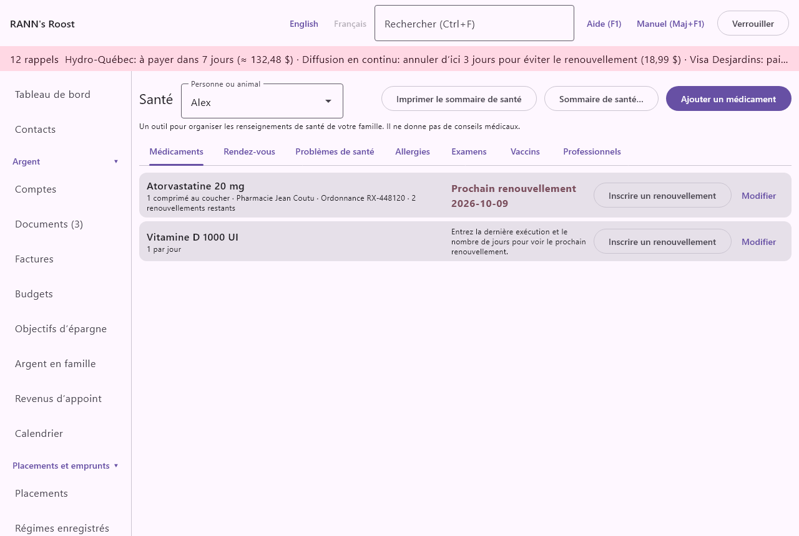
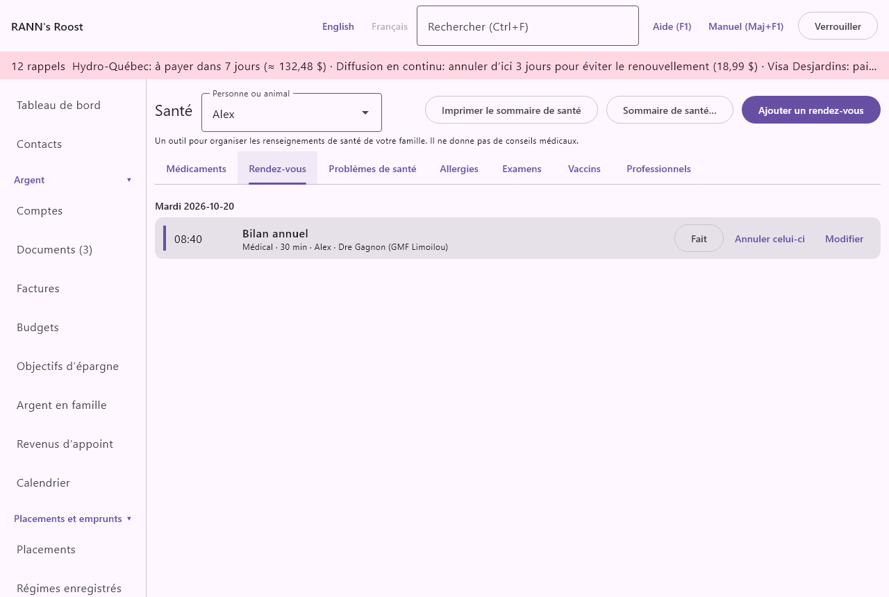

# Santé

L’écran **Santé** sert à organiser les renseignements de santé de votre famille : médicaments et renouvellements, rendez-vous, problèmes de santé, allergies, examens, vaccins et les personnes qui vous soignent. Il se trouve dans le groupe **Maison et famille** du menu. Les animaux y ont aussi leur dossier de santé.

> Important : L’écran le dit clairement : c’est un outil pour organiser les renseignements de santé de votre famille, et il ne donne pas de conseils médicaux. Suivez ce que vous disent votre médecin, votre pharmacien ou votre vétérinaire.

## L’écran Santé en bref {#overview}
@index: dossier de santé; dossier médical; renseignements médicaux

Le haut de l’écran contient :

- **Personne ou animal** : la personne ou l’animal dont vous consultez le dossier. Voir [Choisir la personne ou l’animal](health#choose-person).
- **Sommaire de santé…** : enregistre un sommaire imprimable pour la personne affichée. Il n’est pas offert pour un animal. Voir [Sommaire de santé](health#health-summary).
- Le bouton d’ajout de l’onglet affiché : **Ajouter un médicament**, **Ajouter un rendez-vous**, **Ajouter un problème de santé**, **Ajouter une allergie**, **Ajouter un examen**, **Ajouter un vaccin** ou **Ajouter un professionnel**.

En dessous se trouvent sept onglets : **Médicaments**, **Rendez-vous**, **Problèmes de santé**, **Allergies**, **Examens**, **Vaccins** et **Professionnels**. Tous les onglets sauf **Professionnels** montrent le dossier de la personne ou de l’animal choisi en haut. **Professionnels** est une seule liste pour tout le ménage.

Chaque élément d’une liste a un bouton **Modifier** qui le rouvre. Les dossiers ne sont pas partagés entre les personnes : un vaccin inscrit pour un enfant doit être inscrit de nouveau pour l’autre.

## Choisir la personne ou l’animal {#choose-person}
@index: santé des animaux; membre de la famille

La liste **Personne ou animal** contient toutes les personnes inscrites sous **Membres du ménage** et tous les animaux de l’écran **Animaux**. Un animal y paraît avec son espèce entre parenthèses, par exemple « Rex (chien) ».

Si la liste est vide, l’écran affiche « Ajoutez d’abord les personnes du ménage. » et un bouton **Membres du ménage** qui vous y amène. Voir [Membres du ménage](members).

Quand vous choisissez **Dossier de santé** sur la fiche d’un animal dans l’écran [Animaux](pets), l’écran Santé s’ouvre avec cet animal déjà choisi.

## Qui peut voir les dossiers {#privacy-groups}
@index: groupe privé; confidentialité; enregistrer dans; groupe de comptes

Les dossiers de santé sont gardés dans un groupe de comptes, comme les comptes. Quiconque peut ouvrir ce groupe peut les lire. Quand vous ajoutez un élément, le formulaire affiche :

- **Enregistrer dans** : le groupe de comptes où l’élément est gardé. Il se choisit une seule fois, à la création ; il ne peut pas être changé ensuite. Un groupe marqué « (privé) » n’appartient qu’à vous.
  Pour une personne, l’application propose votre propre groupe privé si vous en avez un, sinon le premier groupe que vous pouvez modifier. Pour un animal, elle propose le premier groupe partagé, puisqu’un animal appartient à tout le ménage.
- **Créer mon groupe privé** : affiché avec la remarque « Vous n’avez pas encore de groupe privé. Ce qui est dans un groupe partagé est visible par tous ceux qui peuvent ouvrir ce groupe. » Il crée un groupe à votre nom, marqué privé, et le choisit pour l’élément.

Pour ajouter ou changer un dossier de santé, il faut la permission **Modification** sur le groupe. Si vous ne pouvez modifier aucun groupe, l’application affiche « Vous ne pouvez ajouter de données dans aucun groupe de comptes. » Un utilisateur avec la permission **Saisie seulement** peut tout de même inscrire un renouvellement. Voir [Utilisateurs](users) pour les permissions.

## Onglet Médicaments {#medications}
@index: ordonnance; médicament; pilules; pharmacie

L’onglet **Médicaments** liste les médicaments de la personne : ceux encore pris d’abord, puis ceux arrêtés, chacun en ordre alphabétique. Un médicament arrêté affiche « (arrêté) » après son nom.

### La liste des médicaments {#medication-list}

Chaque médicament affiche :

- son nom et sa dose ;
- comment le prendre, la pharmacie, le numéro d’ordonnance (« Ordonnance 123456 ») et les renouvellements restants (« 2 renouvellements restants », « plus aucun renouvellement ») ;
- pour un médicament encore pris, l’état du renouvellement à droite :
  - « Prochain renouvellement » et la date où la provision s’épuise. La date est en rouge une fois passée, et en gras quand elle tombe dans les jours de rappel choisis.
  - « Entrez la dernière exécution et le nombre de jours pour voir le prochain renouvellement. » quand l’un des deux manque.
  - « Ordonnance à renouveler », en rouge, quand il ne reste plus de renouvellement.
- **Inscrire un renouvellement** (seulement pour un médicament encore pris) et **Modifier**.

### Ajouter ou modifier un médicament {#medication-form}

Choisissez **Ajouter un médicament**, ou **Modifier** sur un médicament. Le formulaire s’intitule **Ajouter un médicament** ou **Modifier le médicament**.

- **Médicament** : le nom, par exemple « Amoxicilline » ou « Ventolin ». Obligatoire : **Enregistrer** reste inaccessible tant qu’il est vide.
- **Dose** : la concentration, par exemple « 500 mg » ou « 2 inhalations ». Facultative. Elle paraît après le nom dans la liste et dans le sommaire de santé.
- **Comment le prendre** : la posologie, par exemple « 1 comprimé 3 fois par jour en mangeant ». Affichée dans la liste et dans le sommaire de santé.
- **Prescrit par** : un professionnel de l’onglet **Professionnels**, ou « (aucun) ». Les pharmacies et les laboratoires ne sont pas offerts ici, et les professionnels qui ne sont plus utilisés sont cachés. Le prescripteur paraît dans le sommaire de santé.
- **Pharmacie** : un professionnel du type Pharmacie, ou « (aucun) ». Affichée dans la liste. Le prescripteur et la pharmacie de chaque médicament encore pris sont énumérés avec leur téléphone dans le sommaire de santé.
- **Numéro d’ordonnance** : le numéro inscrit sur l’étiquette, utile quand vous appelez la pharmacie.
- **Commencé** : quand la personne a commencé à le prendre. Un nouveau médicament propose aujourd’hui ; effacez la date si vous ne la connaissez pas. Les dates s’écrivent année-mois-jour, par exemple 2026-03-14.
- **Arrêté** : quand la personne a cessé de le prendre, pour mémoire. Pour arrêter les rappels de renouvellement, décochez aussi **Toujours pris**.

Sous **Renouvellements** :

- **Dernière exécution** : la date où la provision actuelle a été récupérée. Un nouveau médicament propose aujourd’hui.
- **Nombre de jours** : combien de jours dure la provision, de 1 à 400. Un nouveau médicament propose 30. Avec **Dernière exécution**, il donne la date du prochain renouvellement : dernière exécution plus le nombre de jours.
- **Renouvellements restants** : combien de renouvellements l’ordonnance permet encore, de 0 à 99. Laissez vide si vous ne les suivez pas. À 0, le médicament affiche « Ordonnance à renouveler ».
- **Me le rappeler (jours avant)** : « Combien de jours avant la fin des médicaments vous voulez un rappel. » De 0 à 60 ; 5 par défaut (réglable dans [Taux et règles](rates-rules)), et la même valeur de nouveau si laissé vide.
- **Notes** : tout le reste, sur plusieurs lignes.
- **Enregistrer dans** : voir [Qui peut voir les dossiers](health#privacy-groups).

Quand vous modifiez un médicament déjà enregistré, le formulaire affiche aussi :

- **Exécutions récentes** : les six derniers renouvellements inscrits, avec leur date, leur nombre de jours et leur quantité.
- **Toujours pris** : coché tant que le médicament est pris. Décochez-le quand il est arrêté : il passe à la fin de la liste avec la mention « (arrêté) », n’a plus d’état de renouvellement, ni de bouton **Inscrire un renouvellement**, ni de rappels, ni d’inscriptions au calendrier, et il est exclu du sommaire de santé.
- **Supprimer** : demande « Supprimer « nom »? » puis, une fois confirmé, supprime le médicament et ses exécutions. C’est définitif. Pour garder l’historique, décochez plutôt **Toujours pris**.

### Inscrire un renouvellement {#record-refill}
@index: renouvellement d’ordonnance; récupérer une ordonnance

Quand vous récupérez un renouvellement, choisissez **Inscrire un renouvellement** sur le médicament. La boîte de dialogue porte le nom du médicament.

- **Récupéré le** : la date du renouvellement ; aujourd’hui par défaut.
- **Nombre de jours** : combien de temps dure ce renouvellement ; le nombre de jours actuel du médicament est proposé. Changez-le si la pharmacie a remis une autre quantité : le nouveau nombre remplace l’ancien pour la date du prochain renouvellement.
- **Quantité** : facultative, telle qu’inscrite sur l’étiquette, par exemple « 90 comprimés ».

En dessous, la boîte indique combien de renouvellements resteront après celui-ci, si vous les suivez.

Quand vous choisissez **Enregistrer** :

- l’exécution s’ajoute aux **Exécutions récentes** ;
- **Dernière exécution** passe à la date entrée, sauf si une exécution encore plus récente est déjà inscrite ;
- **Renouvellements restants** diminue de un, sans descendre sous 0 ;
- la date du prochain renouvellement avance en conséquence.

### Rappels de renouvellement et ordonnances à renouveler {#refill-reminders}
@index: rappel; notification; renouvellement à faire

Pour chaque médicament encore pris qui a une dernière exécution et un nombre de jours :

- À partir du nombre de jours fixé dans **Me le rappeler (jours avant)** avant la date du prochain renouvellement, et jusqu’à ce que vous inscriviez le renouvellement, le médicament paraît dans les rappels affichés en haut de la fenêtre et dans la notification du système. Un clic sur ce rappel vous amène à l’écran Santé.
- La date du prochain renouvellement paraît aussi au [Calendrier](calendar).

Quand **Renouvellements restants** atteint 0, la liste affiche « Ordonnance à renouveler » pour que vous demandiez une nouvelle ordonnance au médecin avant la fin de la provision.

## Onglet Rendez-vous {#appointments}
@index: rendez-vous chez le médecin; rendez-vous chez le vétérinaire; dentiste

L’onglet **Rendez-vous** liste les rendez-vous du calendrier de la personne ou de l’animal choisi, d’il y a un an jusqu’à dans un an, du genre **Médical** (ou **Animaux** pour un animal). Ce sont les mêmes rendez-vous qu’au [Calendrier](calendar) : en ajouter, en changer ou en supprimer un ici change aussi le calendrier. S’il n’y en a aucun, l’onglet dit « Aucun rendez-vous médical dans la dernière ou la prochaine année. »

**Ajouter un rendez-vous** ouvre le formulaire de rendez-vous du calendrier, avec la date d’aujourd’hui, le type **Médical** (ou **Animaux** pour un animal) et la personne ou l’animal déjà remplis. Ses champs, comme **Quoi**, **Date**, **Heure**, **Où**, **Qui**, **Professionnel**, **Me le rappeler** et la répétition, sont décrits au chapitre [Calendrier](calendar). La liste **Professionnel** offre les professionnels de l’onglet **Professionnels**.

Cliquez sur un rendez-vous pour le rouvrir.

## Onglet Problèmes de santé {#conditions}
@index: diagnostic; maladie; maladie chronique

L’onglet **Problèmes de santé** liste les problèmes de santé de la personne : diabète, asthme, hypertension, une blessure. Chaque ligne affiche le nom et l’état, puis la date du diagnostic et les notes.

### Ajouter ou modifier un problème de santé {#condition-form}

Choisissez **Ajouter un problème de santé**, ou **Modifier** sur un problème (le formulaire s’intitule alors **Modifier le problème de santé**).

- **Problème de santé** : son nom. Obligatoire.
- **Diagnostiqué le** : la date du diagnostic, si vous la connaissez. Facultative.
- **État** : **Actif** (par défaut), **Maîtrisé** ou **Résolu**. Un problème résolu reste dans la liste mais est exclu du sommaire de santé.
- **Professionnel** : le médecin ou la clinique qui en assure le suivi, pris dans l’onglet **Professionnels**, ou « (aucun) ».
- **Notes** : traitement, précautions, tout ce qui est utile.
- **Enregistrer dans** : voir [Qui peut voir les dossiers](health#privacy-groups).
- **Supprimer** (en modification) : demande une confirmation, puis supprime le problème. C’est définitif.

## Onglet Allergies {#allergies}
@index: allergie; anaphylaxie; intolérance

L’onglet **Allergies** liste ce à quoi la personne ou l’animal est allergique, avec la gravité, la réaction et les notes. Les allergies viennent en premier dans le sommaire de santé, puisqu’elles comptent le plus en cas d’urgence.

### Ajouter ou modifier une allergie {#allergy-form}

- **Allergique à** : la substance, par exemple « Pénicilline », « Arachides » ou « Piqûres d’abeille ». Obligatoire.
- **Réaction** : ce qui se produit, par exemple « urticaire » ou « gonflement de la gorge ».
- **Gravité** : **Légère**, **Modérée**, **Grave**, ou « (aucun) » si vous ne savez pas.
- **Notes** : par exemple « porte un EpiPen ».
- **Enregistrer dans** : voir [Qui peut voir les dossiers](health#privacy-groups).
- **Supprimer** (en modification) : demande une confirmation, puis supprime l’allergie.

Une allergie n’a pas de professionnel.

## Onglet Examens {#tests}
@index: prise de sang; résultats de laboratoire; laboratoire; suivi

L’onglet **Examens** liste les examens et leurs résultats, les plus récents d’abord. Chaque ligne affiche la date, l’examen, le résultat et les unités, puis les valeurs normales, la date de suivi et les notes.

### Ajouter ou modifier un examen {#test-form}

- **Examen** : son nom, par exemple « Cholestérol (LDL) » ou « Mammographie ». Obligatoire.
- **Date** : quand l’examen a été fait ; aujourd’hui pour un nouvel examen. Obligatoire.
- **Résultat** : le résultat tel qu’inscrit au rapport, par exemple « 3,1 » ou « normal ». Le texte est accepté.
- **Unités** : par exemple « mmol/L ».
- **Valeurs normales** : l’intervalle de référence du rapport, par exemple « moins de 3,5 ». Affiché comme « normal moins de 3,5 ».
- **Date de suivi** : quand refaire l’examen ou en parler au médecin. Elle paraît au [Calendrier](calendar) à cette date.
- **Professionnel** : le laboratoire, la clinique ou le médecin, pris dans l’onglet **Professionnels**.
- **Notes**.
- **Enregistrer dans** : voir [Qui peut voir les dossiers](health#privacy-groups).
- **Supprimer** (en modification) : demande une confirmation, puis supprime l’examen.

## Onglet Vaccins {#vaccines}
@index: immunisation; vaccination; rappel de vaccin

L’onglet **Vaccins** liste les vaccins reçus, les plus récents d’abord, avec la prochaine dose s’il y en a une.

### Ajouter ou modifier un vaccin {#vaccine-form}

- **Vaccin** : son nom, par exemple « Diphtérie-tétanos » ou « Rage » pour un animal. Obligatoire.
- **Date** : quand il a été donné ; aujourd’hui pour un nouveau vaccin. Obligatoire.
- **Prochaine dose** : la date de la prochaine dose ou du rappel, s’il y a lieu. Elle paraît au [Calendrier](calendar) à cette date.
- **Professionnel** : la clinique, la pharmacie ou le vétérinaire qui l’a donné.
- **Notes** : numéro de lot, réaction, tout ce qui est utile.
- **Enregistrer dans** : voir [Qui peut voir les dossiers](health#privacy-groups).
- **Supprimer** (en modification) : demande une confirmation, puis supprime le vaccin.

Le sommaire de santé énumère chaque vaccin une seule fois, avec la date de la dose la plus récente.

## Onglet Professionnels {#providers}
@index: médecin; dentiste; pharmacie; clinique; vétérinaire; toiletteur; pension pour animaux; spécialiste

L’onglet **Professionnels** est le répertoire du ménage des personnes et des endroits qui soignent : médecins, dentistes, pharmacies, cliniques, hôpitaux, spécialistes, laboratoires et, pour les animaux, vétérinaires, toiletteurs et pensions. Chaque ligne affiche le nom, le type, le téléphone et l’adresse. Les professionnels qui ne sont plus utilisés viennent à la fin, marqués « (N’est plus utilisé) ».

Les professionnels sont offerts dans les formulaires de médicament, de problème de santé, d’examen et de vaccin, dans les rendez-vous du calendrier et dans les dépenses médicales de l’écran [Réclamations médicales](medical).

### Ajouter ou modifier un professionnel {#provider-form}

Choisissez **Ajouter un professionnel**, ou **Modifier** sur un professionnel (le formulaire s’intitule alors **Modifier le professionnel**).

- **Nom** : par exemple « Dre Tremblay » ou « Pharmacie du Village ». Obligatoire.
- **Type** : **Médecin** (par défaut), **Dentiste**, **Pharmacie**, **Clinique**, **Hôpital**, **Spécialiste**, **Laboratoire**, **Autre**, **Vétérinaire**, **Toiletteur** ou **Pension ou gardien d’animaux**. Le type décide où le professionnel est offert : seule une **Pharmacie** est offerte comme **Pharmacie** d’un médicament, et les pharmacies et laboratoires ne sont pas offerts sous **Prescrit par**.
- **Téléphone** : affiché dans la liste et dans le sommaire de santé.
- **Adresse**.
- **Notes** : heures d’ouverture, nom de l’infirmière, tout ce qui est utile.
- **Enregistrer dans** : le groupe de comptes où le professionnel est gardé. Un nouveau professionnel propose le premier groupe partagé, pour que tous puissent s’en servir. Il ne peut pas être changé ensuite.
- **N’est plus utilisé** (en modification) : cochez-le quand vous ne consultez plus ce professionnel. Il reste sur les éléments qui le nomment, mais n’est plus offert pour les nouveaux.

Les professionnels ne peuvent pas être supprimés ; marquez-les plutôt **N’est plus utilisé**.

## Sommaire de santé {#health-summary}
@index: renseignements médicaux d’urgence; sommaire imprimable; PDF

**Sommaire de santé…** enregistre le sommaire d’une personne, à apporter à un rendez-vous, à remettre à un proche aidant ou à garder pour une urgence. Il est offert pour les personnes seulement, pas pour les animaux. Le PDF s’intitule « Sommaire de santé · nom » et énumère :

- **Allergies** : chacune avec sa gravité, sa réaction et ses notes ;
- **Problèmes de santé** : ceux qui ne sont pas résolus, avec leur état, la date du diagnostic et les notes ;
- **Médicaments** : ceux encore pris, avec la dose, comment les prendre et qui les a prescrits ;
- **Vaccins** : chaque vaccin une fois, avec la date de la dernière dose ;
- **Professionnels** : les prescripteurs et pharmacies des médicaments encore pris, avec leur téléphone et leur adresse.

Le PDF indique aussi quand et avec quoi il a été préparé, et qu’il doit rester confidentiel puisqu’il contient des renseignements de santé.

**Imprimer le sommaire de santé** envoie le même sommaire directement à l’imprimante (ou l’ouvre dans votre lecteur PDF quand l’ordinateur n’offre pas l’impression). La copie faite pour l’impression est un fichier temporaire, supprimé à la fermeture de RANN's Roost.

### La boîte Enregistrer en PDF {#save-pdf}
@index: mot de passe; PDF protégé; chiffrement

La boîte s’intitule **Enregistrer en PDF**. Elle explique : « Un PDF protégé ne s’ouvre qu’avec son mot de passe ; il peut donc être envoyé par courriel ou gardé sur une clé USB. Donnez le mot de passe séparément, par téléphone ou en personne. »

- **Le protéger par un mot de passe** : coché par défaut. Décochez-le seulement pour une copie que vous imprimez tout de suite.
- **Mot de passe (8 caractères ou plus)** : le mot de passe qu’il faudra pour ouvrir le fichier. « Il est impossible d’ouvrir le fichier sans lui. » Gardez-le en lieu sûr.
- **Mot de passe de nouveau** : le même mot de passe, pour éviter une faute de frappe. « Les mots de passe diffèrent. » s’affiche tant qu’ils ne concordent pas.
- **Enregistrer sous…** : accessible une fois les mots de passe identiques (ou la protection décochée). Il demande où enregistrer le fichier ; le nom proposé est le titre du sommaire. L’extension « .pdf » est ajoutée si vous l’omettez.
- **Annuler** : ferme la boîte sans enregistrer.

> Remarque : Le sommaire est une copie de ce qui est inscrit à ce moment-là. Enregistrez-en un nouveau après un changement de médicaments ou d’allergies.

## Supprimer des éléments {#delete}

Les médicaments, problèmes de santé, allergies, examens et vaccins ont chacun un bouton **Supprimer** dans leur formulaire, une fois enregistrés. L’application demande d’abord « Supprimer « nom »? ». Un élément supprimé ne peut pas être récupéré, sauf en restaurant une sauvegarde. Les rendez-vous se suppriment depuis leur formulaire de calendrier. Les professionnels ne se suppriment pas ; marquez-les **N’est plus utilisé**.

## Où servent les dossiers de santé {#what-it-feeds}

- **Rappels** : les renouvellements qui arrivent dans leurs jours de rappel, en haut de la fenêtre et dans la notification du système.
- **Calendrier** : les dates de prochain renouvellement, les dates de suivi des examens et les prochaines doses de vaccin, en plus des rendez-vous.
- **Réclamations médicales** : une dépense médicale du type « Médicaments sur ordonnance » peut nommer un des médicaments de la personne, et les professionnels sont offerts pour chaque dépense. Voir [Réclamations médicales](medical).
- **Animaux** : le bouton **Dossier de santé** de la fiche d’un animal ouvre cet écran pour cet animal. Voir [Animaux](pets).
- **Urgence et succession** : le sommaire de santé utilise la même protection PDF que le sommaire d’urgence. Voir [Urgence et succession](estate).

## Contacts {#linked-contacts}

@index: contact; contact lié; Lier un contact

Le formulaire d’un professionnel se termine par Contacts : le contact de ce professionnel (Contact), où ses personnes, ses heures, plusieurs téléphones et des numéros de dossier peuvent être gardés. Le formulaire d’un médicament enregistré montre ses contacts Pharmacie et Prescripteur. Le Prescripteur et la Pharmacie choisis parmi les professionnels ci-dessus restent tels quels et continuent d’alimenter les rappels.

Cliquez sur un contact pour ouvrir sa page dans [Contacts](contacts) ; **Retirer le lien** enlève le lien, et **Lier un contact…** en choisit un, dans son rôle, ou crée un **Nouveau contact…** et le lie. Voir [Les contacts dans les autres écrans](contacts#on-other-screens).
