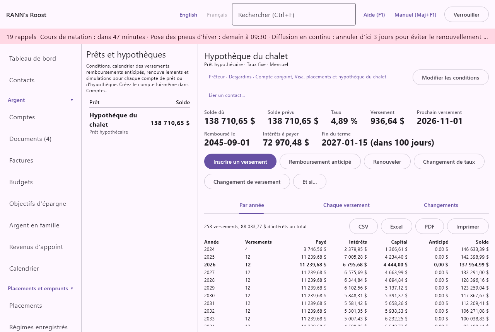

# Prêts et hypothèques

Prêts et hypothèques montre les conditions de chaque prêt et de chaque hypothèque, son calendrier complet de versements, ce que vous devez par rapport à ce qui était prévu, et la date à laquelle il sera remboursé. L’écran inscrit les versements, les remboursements anticipés, les renouvellements, les changements de taux et de versement, et permet d’essayer des simulations sans rien changer. Il se trouve dans le groupe Placements et emprunts du menu.

> Remarque : Le calendrier est calculé à partir des conditions saisies, comme le font les prêteurs canadiens. Le relevé du prêteur a le dernier mot ; s’ils diffèrent, rajustez les conditions ou le versement pour qu’ils concordent.

## L’écran Prêts et hypothèques {#loans-screen}

@index: prêt; hypothèque; amortissement; prêt auto; prêt étudiant; mortgage

La colonne de gauche énumère chaque compte de prêt et d’hypothèque ouvert que vous pouvez voir, sous les en-têtes **Prêt** et **Solde**, avec le montant dû à droite. Sous le nom, le type de compte est indiqué, ou « Conditions à saisir » en rouge pour un prêt dont les conditions manquent encore. Cliquez sur un prêt pour l’afficher à droite. Quand vous ouvrez cet écran à partir du registre d’un prêt, ce prêt s’affiche d’abord.

Les marges de crédit et les cartes de crédit ne sont pas énumérées ici : elles n’ont pas de calendrier fixe. Elles paraissent dans le rapport Sommaire des dettes.

Pour modifier quoi que ce soit dans cet écran, il faut la permission de modifier le groupe de comptes qui contient le prêt.

### Créer le compte du prêt {#set-up-loan-account}

Le prêt lui-même est un compte. Créez-le dans [Comptes](accounts) avec le type Prêt ou Prêt hypothécaire, et le montant dû comme solde d’ouverture négatif à la date où vous commencez (par exemple -350 000,00 pour un solde hypothécaire de 350 000 $). Choisissez-le ensuite ici et cliquez sur **Saisir les conditions**.

> Conseil : Pour une hypothèque que vous avez depuis des années, ouvrez le compte au début du terme en cours avec le solde dû à ce moment, et saisissez les conditions de ce terme. Le calendrier concorde alors avec les relevés du prêteur à partir de cette date.

### La liste des prêts {#loan-list}

- Un prêt sans conditions ne montre que **Saisir les conditions** et le message indiquant que ses conditions sont nécessaires pour voir son calendrier, son prochain versement et sa date de remboursement.
- Un prêt avec conditions montre son résumé, ses boutons et ses onglets, décrits ci-dessous.
- L’en-tête de droite montre le nom du compte, son type, le type de taux et la fréquence des versements, avec **Saisir les conditions** ou **Modifier les conditions**.

## Le résumé d’un prêt {#loan-summary}

@index: solde dû; date de remboursement; intérêts restants

- **Solde dû** : ce que vous devez maintenant, d’après le solde du compte dans les livres : le solde d’ouverture plus chaque versement, remboursement anticipé et frais inscrit.
- **Solde prévu** : ce que vous devriez devoir aujourd’hui si chaque versement avait été fait comme prévu. Un écart avec le Solde dû signifie qu’un versement a été manqué, fait d’avance, ou inscrit avec un autre montant.
- **Taux** : le taux annuel en vigueur, après les changements de taux ou renouvellements.
- **Versement** : le versement régulier en vigueur, sans les taxes foncières ni l’assurance.
- **Total prélevé** : affiché quand il diffère du versement : ce qui sort du compte bancaire chaque fois, avec le capital supplémentaire, les taxes foncières et l’assurance.
- **Prochain versement** : la date du prochain versement après le dernier inscrit.
- **Remboursé le** : quand le prêt sera remboursé, projeté à partir de ce que vous devez réellement.
- **Intérêts à payer** : les intérêts qui restent à payer d’ici là.
- **Économisé par les remboursements anticipés** : affiché dès que des remboursements anticipés ou des versements supplémentaires sont inscrits : les intérêts qu’ils économisent par rapport au prêt sans eux, et combien de mois plus tôt il prend fin.
- **Fin du terme** : affiché quand une fin de terme est saisie : la date de renouvellement, et dans combien de jours (ou de combien de jours elle est dépassée).

### Boutons du prêt {#loan-buttons}

- **Inscrire un versement** : inscrit le prochain versement. Offert tant qu’un montant est dû. Voir [Inscrire un versement](loans#record-payment).
- **Remboursement anticipé** : inscrit une somme forfaitaire versée sur le capital. Voir [Remboursement anticipé](loans#prepayment).
- **Renouveler** : affiché quand les conditions ont une fin de terme. Voir [Renouveler](loans#renew).
- **Changement de taux** : un nouveau taux en cours de terme. Voir [Changement de taux](loans#rate-change).
- **Changement de versement** : un nouveau versement régulier. Voir [Changement de versement](loans#payment-change).
- **Et si…** : compare d’autres choix avec le prêt tel qu’il est. Offert tant qu’un montant est dû. Voir [Et si](loans#what-if).

Sous les boutons se trouvent trois onglets : **Par année**, **Chaque versement** et **Changements**.

## Saisir ou modifier les conditions {#loan-terms}

@index: conditions du prêt; taux d’intérêt; capitalisation; fréquence des versements; accéléré aux deux semaines

Cliquez sur **Saisir les conditions** (ou **Modifier les conditions**). La première ligne de la fenêtre rappelle comment saisir une hypothèque renouvelée. Changer les conditions recalcule tout le calendrier.

- **Capital** : le montant emprunté, ou pour une hypothèque renouvelée, le solde au début du terme en cours. Commence avec ce que vous devez maintenant. Obligatoire, plus que zéro.
- **Taux annuel (%)** : le taux annuel nominal, par exemple 4,79. De 0 à moins de 100.
- **Type de taux** : Taux fixe ou Taux variable. Il paraît dans l’en-tête, et règle le choix par défaut de Recalculer le versement quand vous inscrivez un changement de taux.
- **Intérêts composés** : Annuellement, Semestriellement (hypothèques canadiennes) ou Mensuellement. Les hypothèques canadiennes à taux fixe sont composées semestriellement selon la loi, et c’est le choix par défaut pour une hypothèque ; Mensuellement est le choix par défaut pour les autres prêts. Beaucoup d’hypothèques à taux variable sont composées mensuellement : vérifiez votre contrat. Ce choix change la part de chaque versement qui va aux intérêts.
- **Amortissement (années)** et **et mois** : le temps pour rembourser tout le prêt, 25 ans et 0 mois par défaut. Pour une hypothèque renouvelée, l’amortissement restant au début du terme. De 1 mois à 50 ans.
- **Fréquence des versements** : Mensuel, Deux fois par mois, Aux deux semaines, Accéléré aux deux semaines, Hebdomadaire ou Hebdomadaire accéléré. Les versements accélérés sont le versement mensuel divisé par 2 aux deux semaines, ou par 4 chaque semaine : vous payez l’équivalent d’un versement mensuel de plus par année, et le prêt se termine avant la fin de son amortissement.
- **Premier versement** : la date du premier versement (pour une hypothèque renouvelée, le premier versement du terme en cours). Obligatoire. Les versements mensuels gardent ce jour du mois (raccourci dans les mois courts) ; les versements deux fois par mois tombent à 15 jours d’intervalle.
- **Versement du prêteur (s’il est connu)** : le versement indiqué au contrat. Sous le champ, « Calculé : » montre le versement calculé d’après les conditions, à mesure que vous tapez. Si vous saisissez le versement du prêteur, le calendrier l’utilise ; laissez vide pour utiliser le versement calculé. Les prêteurs arrondissent différemment ; saisir le leur garde le calendrier au plus près de leurs relevés.
- **Capital supplémentaire à chaque versement** : un montant ajouté à chaque versement, qui va entièrement au capital. Il raccourcit le prêt et compte dans Économisé par les remboursements anticipés.
- **Fin du terme (renouvellement)** : pour une hypothèque, la fin du terme en cours. Elle affiche le chiffre Fin du terme, active **Renouveler** et donne un rappel de renouvellement.
- **Rappel, jours avant** : combien de temps avant la fin du terme le rappel commence, 120 jours par défaut (réglable dans [Taux et règles](rates-rules)), de 0 à 365. Le rappel paraît de toute façon au moins 30 jours avant (le délai de renouvellement).
- **Taxes foncières** et **Assurance** : sous « Taxes foncières et assurance perçues avec chaque versement, s’il y a lieu » : les montants que votre prêteur perçoit avec chaque versement, par versement. Ils s’ajoutent au Total prélevé et sont imputés à leurs catégories quand vous inscrivez un versement.
- **Payé depuis** : le compte bancaire ou de crédit d’où viennent habituellement les versements, dans la devise du prêt, ou (aucun). C’est le compte choisi d’abord quand vous inscrivez un versement ou un remboursement anticipé.
- **Notes** : un texte libre, comme les coordonnées du prêteur ou les privilèges de remboursement anticipé de votre hypothèque.

Cliquez sur **Enregistrer** ou sur **Annuler**.

### Comment le versement est calculé {#payment-calculation}

Le taux est converti en un taux par versement qui tient compte de la capitalisation (pour une hypothèque composée semestriellement et payée mensuellement, un peu moins que le taux annuel divisé par 12). Le versement constant qui rembourse le capital sur l’amortissement à ce taux est ensuite arrondi au cent. Les intérêts de chaque versement sont le solde multiplié par ce taux, arrondis au cent comme le font les prêteurs ; le reste du versement réduit le solde ; le dernier versement solde ce qui reste.

## Inscrire un versement {#record-payment}

@index: versement hypothécaire; versement de prêt; intérêts et capital

Cliquez sur **Inscrire un versement** pour inscrire le prochain versement. La fenêtre propose la date et la répartition d’après ce que vous devez réellement :

- **Payé depuis** : le compte bancaire ou de crédit d’où sort le versement, dans la devise du prêt. Commence avec le compte Payé depuis des conditions. Obligatoire.
- **Date** : la date du versement. Commence avec le prochain versement dû après le dernier inscrit.
- **Capital** : la partie qui réduit ce que vous devez, y compris le capital supplémentaire.
- **Intérêts** : calculés sur le solde réellement dû, au taux par versement. Modifiez-les au besoin pour qu’ils correspondent au relevé du prêteur.
- **Taxes foncières** et **Assurance** : affichées quand les conditions en ont, remplies avec leurs montants.
- **Total** : la somme, telle qu’elle sortira du compte bancaire.

Cliquez sur **Enregistrer**. Le montant total passe du compte payeur au prêt en un seul virement, qui concorde avec votre relevé bancaire. Les intérêts, les taxes foncières et l’assurance sont ensuite imputés au prêt dans leurs catégories (Intérêts hypothécaires, Taxes municipales et Assurance habitation pour une hypothèque ; Frais d’intérêts et Assurance vie pour les autres prêts), de sorte que seul le capital réduit ce que vous devez et que les frais paraissent dans vos rapports et budgets. La proposition suivante passe ensuite au versement d’après.

> Conseil : Si vos versements sont déjà importés de la banque comme virements vers le prêt, vous n’avez pas besoin d’Inscrire un versement pour eux ; le Solde dû suit le solde du compte dans les deux cas.

## Remboursement anticipé {#prepayment}

@index: somme forfaitaire; privilège de remboursement anticipé; versement à l’anniversaire

Une somme forfaitaire versée sur le capital, en dehors des versements réguliers.

- **Date** : quand elle a été versée. Aujourd’hui par défaut. Dans le calendrier, elle s’applique avec le premier versement à cette date ou après.
- **Montant** : plus que zéro.
- **Payé depuis** : le compte d’où vient l’argent, pour transférer aussi l’argent ; ou « (déjà dans le registre) » quand le paiement y est déjà inscrit, pour ne changer que le calendrier.
- **Note** : un texte libre.

Cliquez sur **Enregistrer**. Le remboursement anticipé paraît dans l’onglet Changements et dans le calendrier, et Économisé par les remboursements anticipés montre les intérêts qu’il économise.

## Renouveler {#renew}

@index: renouvellement hypothécaire; terme; nouveau taux

**Renouveler** est affiché quand les conditions ont une fin de terme. Au renouvellement, le nouveau taux s’applique à partir de la date de renouvellement, et le versement est recalculé pour que le prêt soit toujours remboursé sur l’amortissement restant.

- **Date de renouvellement** : commence avec la fin du terme en cours.
- **Taux annuel (%)** : le nouveau taux ; commence avec le taux en vigueur.
- **Fin du nouveau terme** : la fin du nouveau terme ; commence cinq ans après la fin du terme en cours. Elle doit être après la date de renouvellement ; laissez vide s’il n’y a pas de terme fixe.
- **Note** : un texte libre.

Cliquez sur **Enregistrer**. Le renouvellement est inscrit comme un changement de taux avec versement recalculé, affiché comme Renouvellement dans la liste des changements, et la fin du terme est remplacée par la nouvelle, ce qui déplace le rappel de renouvellement. Le renouvellement garde la fin de terme qu’il remplace : le supprimer remet donc cette date.

## Changement de taux {#rate-change}

@index: taux préférentiel; changement de taux variable

Un nouveau taux en cours de terme, par exemple quand la Banque du Canada change son taux et que votre taux variable suit.

- **À partir du** : la date où le nouveau taux s’applique, aujourd’hui par défaut. Les versements suivants utilisent le nouveau taux.
- **Taux annuel (%)** : le nouveau taux ; commence avec le taux en vigueur.
- **Recalculer le versement** : coché, le versement est recalculé pour rembourser le solde sur l’amortissement restant, comme le font la plupart des prêts à taux fixe. Décoché, le versement reste le même et le prêt prend plus (ou moins) de temps à rembourser, comme la plupart des hypothèques à taux variable. Coché par défaut pour un taux fixe, décoché pour un taux variable.
- **Note** : un texte libre.

Cliquez sur **Enregistrer**. Si, avec le versement gardé, celui-ci ne couvre plus les intérêts, le changement est refusé : « Avec ce versement, le prêt ne serait jamais remboursé ».

## Changement de versement {#payment-change}

Un nouveau versement régulier, par exemple après avoir demandé au prêteur de l’augmenter.

- **À partir du** : la date du premier versement au nouveau montant ; commence avec le prochain versement.
- **Nouveau versement** : le nouveau versement régulier ; commence avec le versement actuel. Plus que zéro.
- **Note** : un texte libre.

Cliquez sur **Enregistrer**. Un versement trop petit pour couvrir les intérêts est refusé.

## Calendrier des versements {#schedule}

@index: tableau d’amortissement; calendrier d’amortissement

Les onglets **Par année** et **Chaque versement** montrent le calendrier tel qu’il est prévu aujourd’hui : les conditions avec chaque changement inscrit. Au-dessus du tableau, une ligne donne le nombre de versements et le total des intérêts. Le tableau s’ouvre à l’année en cours ou au prochain versement, qui est en gras ; les versements passés sont en gris.

### Par année {#by-year}

Une ligne par année civile : **Année**, **Versements** (combien), **Payé**, **Intérêts**, **Capital**, **Anticipé** et **Solde** à la fin de l’année. Utile pour connaître les intérêts hypothécaires d’une année, par exemple pour un immeuble locatif ou un bureau à domicile.

### Chaque versement {#every-payment}

Une ligne par versement : **#**, **Date**, **Payé**, **Intérêts**, **Capital**, **Anticipé** et **Solde** après le versement.

### Exporter et imprimer {#schedule-export}

Les boutons **CSV**, **Excel** et **PDF** enregistrent le tableau affiché dans un fichier ; **Imprimer** l’imprime. Le titre est « Calendrier des versements » avec le nom du prêt, et le sous-titre la date à laquelle il a été prévu.

## Onglet Changements {#changes-tab}

Les remboursements anticipés, les changements de taux, les renouvellements et les changements de versement inscrits, des plus récents aux plus anciens, sous les en-têtes **Date**, **Changement**, **Détails**, **Notes** et **Actions** : la date, le genre, le montant ou le nouveau taux (avec « versement recalculé » ou « même versement »), et la note.

**Supprimer** à côté d’un changement le retire aussitôt, et le calendrier est recalculé. Supprimer un remboursement anticipé ne retire pas l’argent transféré pour celui-ci : supprimez ce virement dans le registre au besoin (une ligne sous la liste le rappelle). Supprimer le dernier renouvellement remet la fin de terme qu’il remplaçait, et le rappel de renouvellement avec elle ; supprimer un renouvellement plus ancien ou un changement de taux laisse la fin de terme telle quelle. Les renouvellements inscrits avant cette version de l’application n’ont pas gardé la fin de terme précédente : après en avoir supprimé un, changez la fin de terme avec **Modifier les conditions** au besoin.

## Et si {#what-if}

@index: simulation; scénario; versement supplémentaire; rembourser plus vite

**Et si…** compare le prêt tel qu’il est avec le même prêt après les changements que vous tapez. La comparaison part de ce que vous devez aujourd’hui. Rien ne change dans vos livres.

- **Supplément à chaque versement** : un montant ajouté à chaque versement.
- **Somme forfaitaire maintenant** : un remboursement anticipé fait maintenant.
- **Autre taux (%)** : un autre taux annuel, par exemple le taux offert au renouvellement.
- **Années pour rembourser** : un autre amortissement restant, en années ; les décimales sont permises (12,5).

Laissez un champ vide pour garder ce que le prêt a maintenant. Tant que vous n’avez rien tapé, la fenêtre vous invite à le faire. La comparaison montre ensuite, sous **Maintenant** et **Avec ces changements** : **Versement**, **Remboursé le**, **Versements** (combien il en reste) et **Intérêts à payer**. La dernière ligne indique combien d’intérêts les changements économisent et combien de mois plus tôt le prêt prend fin, ou, en rouge, combien ils coûtent de plus. Une valeur impossible (un taux hors limites, un versement qui ne rembourserait jamais le prêt) affiche plutôt un message. Cliquez sur **Fermer** quand vous avez terminé.

## Rappels de renouvellement {#renewal-reminders}

@index: rappel de renouvellement

Quand un prêt a une fin de terme, un rappel paraît avec les autres rappels, et comme notification du système, à partir du nombre de jours réglé dans Rappel, jours avant (au moins 30 jours avant), jusqu’au renouvellement du terme. Cliquer sur le rappel ouvre cet écran.

## Rapport Sommaire des dettes {#debt-report}

@index: sommaire des dettes

Le rapport Sommaire des dettes dans [Rapports](reports) énumère chaque dette, de la plus grosse à la plus petite, avec son taux, son versement, sa date de remboursement et les intérêts restants quand les conditions sont saisies ici, ainsi que la fin du terme.

## Contacts {#linked-contacts}

@index: contact; contact lié; Lier un contact

Sous le nom du prêt ou de l’hypothèque, l’écran montre ses contacts, comme Prêteur · Desjardins, et **Lier un contact…** pour ajouter le prêteur, un courtier hypothécaire ou un conseiller.

Cliquez sur un contact pour ouvrir sa page dans [Contacts](contacts) ; **Retirer le lien** enlève le lien, et **Lier un contact…** en choisit un, dans son rôle, ou crée un **Nouveau contact…** et le lie. Voir [Les contacts dans les autres écrans](contacts#on-other-screens).
