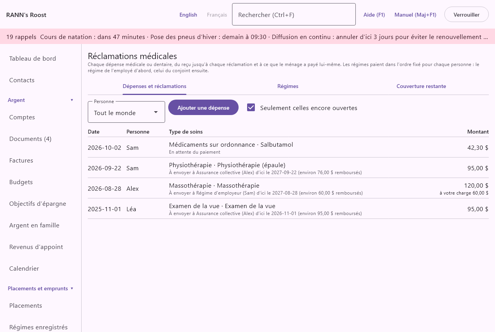
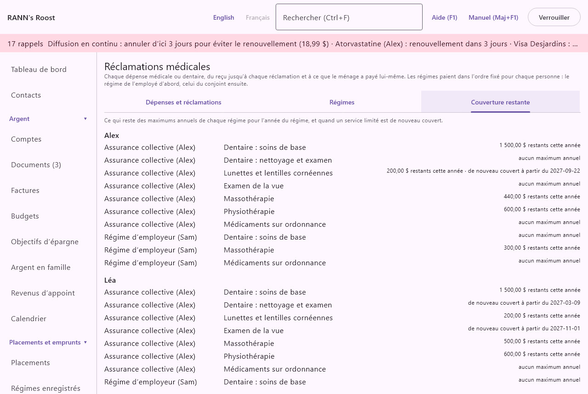

# Réclamations médicales

L’écran **Réclamations médicales** suit chaque dépense médicale ou dentaire, du reçu jusqu’à chaque réclamation à un régime d’assurance, et jusqu’à ce que le ménage a payé lui-même. Il sait ce que couvre chaque régime, envoie chaque réclamation au bon régime dans le bon ordre, avertit avant l’échéance pour réclamer, montre ce qui reste des maximums annuels de chaque régime et alimente le crédit d’impôt pour frais médicaux. Il se trouve dans le groupe **Maison et famille** du menu.

> Important : L’application ne donne pas de conseils médicaux ni fiscaux. Les montants qu’elle s’attend à recevoir d’un régime sont des estimations tirées de ce que vous avez entré d’après votre brochure ; c’est le régime qui décide. Vérifiez les règles de l’ARC ou de Revenu Québec avant de demander le crédit d’impôt.

## L’écran en bref {#overview}
@index: assurance santé; assurance dentaire; assurance collective; avantages sociaux; réclamations

L’écran a trois onglets :

- **Dépenses et réclamations** : chaque dépense et où en sont ses réclamations. Voir [Onglet Dépenses et réclamations](medical#expenses-tab).
- **Régimes** : les régimes du ménage, qui ils couvrent et ce qu’ils paient. Voir [Onglet Régimes](medical#plans-tab).
- **Couverture restante** : ce qui reste des maximums annuels de chaque régime, par personne. Voir [Onglet Couverture restante](medical#coverage-left).

Les montants de cet écran sont en dollars canadiens.

Les régimes et les dépenses sont gardés dans un groupe de comptes, comme les dossiers de santé : quiconque peut ouvrir ce groupe peut les lire. Chaque nouveau régime ou nouvelle dépense affiche **Enregistrer dans** pour choisir le groupe ; un groupe privé peut ainsi les garder des autres utilisateurs du ménage. Voir [Qui peut voir les dossiers](health#privacy-groups).

Un bon ordre pour commencer : ajoutez d’abord vos régimes, avec leur couverture, puis inscrivez les dépenses. Sans régime, chaque dépense est simplement fermée sans rien à réclamer, mais elle compte quand même pour le crédit d’impôt.

## Comment fonctionnent les réclamations {#how-claims-work}
@index: coordination des prestations; régime principal; régime secondaire; régime du conjoint

Au Canada, quand une personne est couverte par plus d’un régime, les régimes paient à tour de rôle : habituellement, le régime dont la personne est l’employée paie d’abord, puis le régime du conjoint paie une partie de ce qui reste. Les enfants sont habituellement réclamés d’abord au régime du parent dont l’anniversaire arrive le premier dans l’année ; vérifiez les règles de vos régimes.

L’application suit cet ordre. Pour chaque dépense, elle regarde les régimes actifs qui couvrent la personne, garde ceux qui couvrent ce type de soins (un compte gestion-santé couvre tout) et les trie selon l’ordre fixé pour cette personne dans chaque régime. Elle propose ensuite le premier régime pas encore réclamé : « À envoyer à Sun Life d’ici le 2027-03-01 (environ 60,00 $ remboursés) ». Quand ce régime a payé, elle propose le régime suivant pour ce qui reste à payer, et ainsi de suite, jusqu’à ce qu’il ne reste plus de régime ou plus rien à payer.

## Onglet Dépenses et réclamations {#expenses-tab}

### La liste des dépenses {#expense-list}

En haut de l’onglet :

- **Personne** : n’affiche que les dépenses d’une personne, ou **Tout le monde**. Une nouvelle dépense est proposée pour la personne choisie ici.
- **Ajouter une dépense** : ouvre une dépense vierge. Voir [Ajouter ou modifier une dépense](medical#expense-form).
- **Depuis les livres (3)** : affiché quand des paiements dans une catégorie de santé ne sont pas encore inscrits ici ; le nombre indique combien. Voir [Depuis les livres](medical#from-books).
- **Seulement celles encore ouvertes** : coché par défaut, il cache les dépenses fermées. Décochez-le pour les voir toutes.

Chaque ligne affiche la date du service, la personne, le type de soins et la description, et où en est la dépense :

- « À envoyer à régime d’ici le date (environ montant remboursés) » : un régime reste à réclamer ; la date est l’échéance et le montant, ce que le régime devrait payer selon ses règles.
- « En attente du paiement » : une réclamation a été envoyée et n’a pas encore de réponse.
- « Fermée » : plus rien à réclamer, parce que vous l’avez fermée, qu’aucun régime ne la couvre ou qu’il ne reste rien à payer.

À droite se trouvent le coût et, une fois un remboursement reçu, « à votre charge » et ce que le ménage a payé lui-même. Cliquez sur une ligne pour ouvrir la dépense.

### Ajouter ou modifier une dépense {#expense-form}
@index: reçu; facture du dentiste; physiothérapie; lunettes; reçu de pharmacie

La boîte s’intitule **Ajouter une dépense** ou **Dépense médicale**.

- **Personne soignée** : le membre du ménage qui a reçu les soins. Obligatoire. Seuls les membres du ménage sont offerts, pas les animaux.
- **Type de soins** : le type de service, comme **Médicaments sur ordonnance**, **Dentaire : nettoyage et examen**, **Physiothérapie** ou **Examen de la vue**. Il décide quelle couverture de chaque régime s’applique ; il vaut donc la peine de bien le choisir. La liste complète est dans [Types de soins](medical#kinds-of-care).
- **Date du service** : le jour où les soins ont été reçus. Obligatoire. Elle décide l’année du régime où tombe la dépense, et l’échéance pour réclamer (voir [Échéances et rappels](medical#deadlines)).
- **Date du paiement** : « Si ce n’est pas la date du service ». La date où la facture a été payée, qui est la date qui compte pour le crédit d’impôt. Laissez-la vide si c’est le même jour. Elle ne peut pas précéder la date du service de plus d’un an.
- **Coût** : ce qu’ont coûté les soins, en dollars. Obligatoire et plus grand que zéro.
- **Description** : par exemple « Nettoyage et radiographies » ou le nom de la clinique. Affichée dans la liste et dans le rapport des frais médicaux.
- **Professionnel** : le professionnel de l’onglet **Professionnels** de l’écran [Santé](health), ou « (aucun) ».
- **Médicament** : affiché quand le type de soins est **Médicaments sur ordonnance** et que la personne a des médicaments à l’écran Santé. Il lie la dépense à ce médicament.
- **Compte pour le crédit d’impôt pour frais médicaux** : coché par défaut. Décochez-le pour une dépense que l’ARC n’accepte pas (par exemple une intervention esthétique ou un produit sans ordonnance). Seules les dépenses cochées comptent dans les montants du crédit d’impôt et vont dans le PDF des reçus.
- **Notes**.
- **Enregistrer dans** : le groupe de comptes où la dépense et ses réclamations sont gardées. Le premier groupe partagé où vous pouvez ajouter est proposé ; un groupe marqué « (privé) » n’appartient qu’à vous. Il se choisit à l’ajout de la dépense et ne peut plus être changé une fois enregistré. Si vous n’avez pas encore de groupe privé, **Créer mon groupe privé** en crée un et le choisit. Vous ne voyez pas les dépenses du groupe privé d’un autre utilisateur, et elles ne comptent pas dans vos montants du crédit d’impôt.

Boutons :

- **Enregistrer** : enregistre la dépense. Une nouvelle dépense doit être enregistrée avant qu’on puisse y ajouter des réclamations et des reçus ; la partie des réclamations paraît alors en dessous.
- **Fermer : plus rien à réclamer** (une fois enregistrée) : marque la dépense fermée, même si un régime pourrait encore être réclamé. Servez-vous-en quand vous décidez de ne pas réclamer, ou quand la réponse d’un régime a tout réglé. Il devient **Rouvrir**, qui enlève la marque.
- **Supprimer** (une fois enregistrée) : demande « Supprimer cette dépense (genre de soins, date) avec ses réclamations? Ses reçus restent dans Documents. » et, une fois confirmé, supprime la dépense avec ses réclamations. C’est définitif.
- **Fermer** (en bas) : ferme la boîte. Les changements non enregistrés avec **Enregistrer** sont perdus.

### Les réclamations d’une dépense {#claims}

Une fois la dépense enregistrée, la partie **Réclamations** liste chaque réclamation : le régime et son statut (**envoyée**, **payée** ou **refusée**), la date d’envoi et le montant réclamé, la date et le montant payés, et le numéro de réclamation. Une réclamation en attente a deux boutons :

- **Inscrire le paiement** : voir [Inscrire le paiement](medical#record-payment).
- **Refusée** : marque la réclamation refusée aujourd’hui, sans rien de payé. Le régime suivant dans l’ordre est alors proposé.

Chaque réclamation a aussi **Supprimer**, par exemple si elle a été entrée par erreur. Il demande « Supprimer la réclamation à régime soumise le date? » et, une fois confirmé, la supprime. La dépense propose alors de nouveau ce régime.

Sous les réclamations :

- « À votre charge : montant (remboursé montant) » : le coût moins tous les paiements reçus. C’est ce qui compte pour le crédit d’impôt.
- Où en est la dépense, comme dans la liste.
- **Envoyer à régime** quand un régime reste à réclamer. Voir [Envoyer à un régime](medical#send-claim).

### Envoyer à un régime {#send-claim}

Choisissez **Envoyer à régime** une fois la réclamation envoyée, sur papier, en ligne ou par la pharmacie. La boîte indique « Selon les règles du régime, environ montant devraient être remboursés. »

- **Date d’envoi** : aujourd’hui par défaut.
- **Montant réclamé** : ce que vous avez demandé au régime. Il propose ce qui reste à votre charge. Il doit être plus grand que zéro et ne pas dépasser le coût.
- **Numéro de réclamation** : la référence du régime, s’il en a donné une.

**Enregistrer** inscrit la réclamation comme envoyée. La dépense affiche alors « En attente du paiement » et le rappel d’échéance cesse. Un régime ne peut être réclamé qu’une fois par dépense.

### Inscrire le paiement {#record-payment}
@index: relevé de prestations; remboursement

Quand le régime répond, choisissez **Inscrire le paiement** sur la réclamation. La boîte indique « D’après le relevé de prestations ou le dépôt. Inscrivez 0 si la réclamation a été refusée. »

- **Date du paiement** : aujourd’hui par défaut.
- **Montant payé** : ce que le régime a payé ; le montant réclamé est proposé. Il ne peut pas être négatif ni dépasser le coût.

**Enregistrer** marque la réclamation **payée**, ou **refusée** si le montant est 0. Le montant à votre charge diminue de ce qui a été payé. Si un autre régime couvre la personne, il est proposé ensuite pour ce qui reste. Inscrire le paiement ici n’inscrit pas le dépôt dans un compte ; le dépôt s’inscrit dans le compte comme n’importe quel autre.

### Reçus et relevés de prestations {#receipts}
@index: joindre un reçu; numérisation; boîte de révision

Sous les réclamations, la boîte énumère les documents joints :

- **Reçus (2)** : les reçus de la dépense. Ce sont les fichiers mis dans le PDF des reçus pour le crédit d’impôt.
- **Relevé de prestations : régime (1)** : une ligne par réclamation, pour le relevé du régime.

Chaque ligne a :

- **Joindre un fichier…** : choisissez un fichier sur l’ordinateur (un PDF ou une image). Il est ajouté au coffre [Documents](documents), classé et joint ici. Un fichier d’un type que l’application ne sait pas lire est refusé.
- **Depuis la boîte de révision** : affiché quand des documents attendent dans la boîte de révision, par exemple un reçu photographié avec le téléphone. Choisissez-en un pour le joindre ; il est marqué comme classé.

Les fichiers joints sont énumérés en dessous avec leur titre et leur date.

### Fermer ou rouvrir une dépense {#close-expense}

Une dépense se ferme d’elle-même quand il ne reste plus de régime à réclamer ou plus rien à payer. **Fermer : plus rien à réclamer** la ferme à la main ; **Rouvrir** la rouvre. Une dépense fermée compte toujours pour le crédit d’impôt. Avec **Seulement celles encore ouvertes** coché, les dépenses fermées sont cachées de la liste.

### Depuis les livres {#from-books}
@index: importer des opérations; paiements de santé non inscrits

Si vous payez des frais médicaux avec des comptes inscrits dans l’application, vous n’avez pas à les taper deux fois. **Depuis les livres (nombre)** ouvre **Paiements de santé pas encore inscrits** : « Paiements dans une catégorie de santé depuis un an qui ne sont pas encore des dépenses médicales. Choisissez la personne et le type de soins, puis ajoutez-les. »

Elle énumère chaque paiement de la dernière année dont la catégorie est la catégorie Santé ou une de ses sous-catégories, sauf les achats en vente libre, et qui n’est pas encore lié à une dépense médicale. Chaque ligne affiche la date et le bénéficiaire, le compte et le montant, avec :

- **Personne soignée** : le premier membre du ménage est proposé.
- **Type de soins** : **Autres soins** est proposé.
- **Ajouter** : crée la dépense, avec la date de l’opération comme date du service, son montant comme coût (converti en dollars canadiens au taux du jour pour un compte dans une autre devise) et le bénéficiaire comme description. La dépense est liée au paiement, qui n’est donc plus offert.

Quand tout est inscrit, la boîte indique « Tous les paiements de santé sont inscrits. » Ouvrez ensuite chaque nouvelle dépense pour corriger la date du service ou joindre le reçu.

## Onglet Régimes {#plans-tab}
@index: régime de l’employeur; assurance collective; RAMQ; Régime canadien de soins dentaires; RCSD; compte gestion-santé

L’onglet **Régimes** liste les régimes du ménage : leur nom (avec « inactif » pour un régime qui n’est plus en vigueur), leur type, l’assureur et les personnes couvertes avec leur ordre, par exemple « Alex (paie en premier), Sam (paie en second) ». Cliquez sur un régime pour l’ouvrir, ou choisissez **Ajouter un régime**.

Quand il n’y en a aucun : « Aucun régime pour l’instant : ajoutez les régimes de santé et dentaire de l’employeur, un compte gestion-santé, la RAMQ ou le Régime canadien de soins dentaires. »

### Ajouter ou modifier un régime {#plan-form}

La boîte s’intitule **Ajouter un régime** ou **Régime**.

- **Type de régime** : **Assurance collective (employeur)**, **Soins dentaires**, **Soins de la vue**, **Assurance santé privée**, **Assurance voyage**, **Compte gestion-santé**, **Régime public d’assurance médicaments (RAMQ)**, **Régime canadien de soins dentaires** ou **Autre régime**. Choisir un type remplit **Nom** s’il est encore vide. Un **Compte gestion-santé** fonctionne autrement : voir [Compte gestion-santé](medical#hsa).
- **Nom** : comment vous appelez le régime, par exemple « Sun Life (travail d’Alex) ». Obligatoire. Il paraît dans « Envoyer à … » et dans les rappels.
- **Assureur** : la compagnie qui paie les réclamations.
- **Numéro de police ou de groupe** et **Numéro de certificat ou d’adhérent** : d’après la carte du régime, pour vos réclamations.
- **Adhérent** : le membre du ménage qui détient le régime, habituellement l’employé, ou « (aucun) ». Pour mémoire.
- Qui est couvert et dans quel ordre : voir [Qui est couvert et dans quel ordre](medical#coverage-order).
- **Début de l’année du régime (mois)** et **Début de l’année du régime (jour)** : quand commence l’année du régime, par exemple 1 et 1 pour l’année civile, ou 7 et 1 pour un régime qui se renouvelle le 1er juillet. Le mois va de 1 à 12 et le jour de 1 à 28. Les maximums annuels et les franchises repartent à zéro à cette date.
- **Échéance comptée à partir de** : comment votre assureur fixe le délai pour réclamer, selon votre brochure d’assurance. **La date du service** (par défaut) : chaque dépense a sa propre échéance, tant de jours après les soins, souvent 365. **La fin de l’année du régime** : toutes les dépenses d’une année du régime ont la même échéance, tant de jours après la fin de cette année du régime ; bien des régimes collectifs acceptent les réclamations jusqu’à 90 jours après la fin de l’année du régime. Ce choix remplace 365 par 0 dans **Jours pour envoyer une réclamation** quand ce champ a encore la valeur par défaut.
- **Jours pour envoyer une réclamation** : avec **La date du service**, « Après la date du service ; souvent 365. », de 1 à 3650, 365 par défaut pour un nouveau régime (réglable dans [Taux et règles](rates-rules)). Avec **La fin de l’année du régime**, « Après la fin de l’année du régime ; 0 veut dire au plus tard son dernier jour. », de 0 à 3650. Changer l’un ou l’autre champ déplace l’échéance de chaque dépense encore à envoyer à ce régime, et son rappel.
- **Crédit annuel** : seulement pour un compte gestion-santé. Voir [Compte gestion-santé](medical#hsa).
- **Actif** : coché tant que le régime est en vigueur. Décochez-le quand le régime prend fin : il n’est plus proposé pour les nouvelles réclamations, n’est plus compté dans **Couverture restante** et affiche « inactif » dans la liste. Ses réclamations passées sont conservées.
- **Notes**.
- **Enregistrer dans** : le groupe de comptes où le régime et sa couverture sont gardés, choisi à l’ajout du régime, comme pour une dépense. Un régime dans un groupe privé n’est réclamé que pour les dépenses des utilisateurs qui peuvent ouvrir ce groupe.

Boutons :

- **Enregistrer** : enregistre le régime. Un nouveau régime doit être enregistré avant qu’on puisse y ajouter une couverture et des brochures.
- **Supprimer** (une fois enregistré) : demande « Supprimer le régime « nom » avec sa couverture? » et, une fois confirmé, le supprime. Un régime qui a déjà des réclamations ne peut pas être supprimé ; décochez plutôt **Actif**.
- **Fermer** : ferme la boîte ; les changements non enregistrés sont perdus.

### Qui est couvert et dans quel ordre {#coverage-order}

« Qui le régime couvre, et dans quel ordre il paie pour chacun : en premier pour l’adhérent et ses enfants, en second pour un conjoint qui a son propre régime. »

Le formulaire offre un choix par membre du ménage :

- **Non couvert** : le régime ne couvre pas cette personne (par défaut).
- **paie en premier** : ce régime est réclamé en premier pour cette personne.
- **paie en second** : réclamé après le régime qui paie en premier.
- **paie en troisième** : réclamé après les deux premiers.

Exemple : Alex et Sam ont chacun un régime au travail et se couvrent l’un l’autre. Dans le régime d’Alex, mettez Alex et les enfants à **paie en premier** et Sam à **paie en second**. Dans le régime de Sam, mettez Sam à **paie en premier** et Alex et les enfants à **paie en second** (ou suivez la règle de l’anniversaire pour les enfants, selon ce qu’exigent vos régimes).

Quand deux régimes ont le même ordre pour une personne, un compte gestion-santé est réclamé après l’autre.

### Couverture par type de soins {#coverage-form}
@index: franchise; pourcentage; maximum annuel; maximum par visite; limite de fréquence

Une fois le régime enregistré (et s’il n’est pas un compte gestion-santé), la partie **Couverture** énumère « Ce que le régime paie pour chaque type de soins, d’après la brochure. » Chaque ligne affiche le type de soins et sa règle, par exemple « 80 % · franchise 25,00 $ · jusqu’à 500,00 $ par année · une fois tous les 24 mois ». Cliquez sur une ligne pour la changer, ou choisissez **Ajouter une couverture**.

Un régime ne couvre un type de soins que s’il a une ligne de couverture pour ce type. Sans ligne, le régime est sauté pour ce type de soins.

La boîte **Couverture** :

- **Type de soins** : le type de service visé par la règle ; **Médicaments sur ordonnance** par défaut. Ajoutez une ligne par type énuméré dans votre brochure.
- **Pourcentage payé** : la part que paie le régime, de 0 à 100 ; 80 est proposé. Le signe « % » peut être tapé.
- **Franchise** : le montant que la personne paie d’abord chaque année du régime avant que le régime paie, pour ce type de soins. Facultative.
- **Maximum par visite** : le plus que le régime paie pour une dépense, par exemple 30 $ par massage. Facultatif.
- **Maximum par année** : le plus que le régime paie dans une année du régime pour cette personne et ce type de soins, par exemple 500 $ de physiothérapie. Facultatif. Ce qui en reste paraît à l’onglet **Couverture restante**.
- **Une fois tous les (mois)** : « Par exemple 24 pour un examen de la vue aux deux ans, 9 pour un rappel dentaire. » De 1 à 120. Facultatif. L’onglet **Couverture restante** montre alors quand le service est de nouveau couvert.
- **Enregistrer**, **Annuler**, et **Supprimer** pour une ligne enregistrée : il demande « Supprimer la couverture pour genre de soins? Le régime ne paie plus ce genre de soins. » et, une fois confirmé, supprime la ligne.

### Compte gestion-santé {#hsa}
@index: compte de dépenses en soins de santé; compte mieux-être; CGS

Un compte gestion-santé est un montant annuel que l’employeur met de côté pour rembourser les frais de santé et dentaires, souvent ce que les autres régimes n’ont pas payé.

Pour un régime du type **Compte gestion-santé** :

- **Crédit annuel** : le montant disponible chaque année du régime, en dollars.
- Il n’a pas de lignes de couverture : il paie 100 % de ce qui reste de toute dépense, jusqu’à ce qui reste du crédit annuel.
- Le crédit est partagé par tous ceux que le compte couvre : ce qui sert pour une personne n’est plus là pour les autres.
- Placez-le en dernier dans l’ordre (par exemple **paie en second** après le régime collectif), pour qu’il paie ce que les autres régimes laissent.

### Brochures du régime {#booklets}

Une fois le régime enregistré, **Brochures du régime** permet de joindre la brochure ou la carte du régime, avec **Joindre un fichier…** ou **Depuis la boîte de révision**, comme pour les reçus. Elles sont gardées dans le coffre [Documents](documents).

## Onglet Couverture restante {#coverage-left}
@index: couverture restante; maximum restant; de nouveau admissible

« Ce qui reste des maximums annuels de chaque régime pour l’année du régime, et quand un service limité est de nouveau couvert. »

Pour chaque membre du ménage couvert par un régime actif, l’onglet énumère chaque régime et type de soins :

- « 350,00 $ restants cette année » : le maximum annuel moins ce que le régime a payé ou ce qui lui a été réclamé pour cette personne et ce type de soins depuis le début de l’année du régime en cours. Une réclamation en attente compte au montant réclamé ; une réclamation refusée ne compte pas.
- « de nouveau couvert à partir du date » : pour un type de soins avec **Une fois tous les (mois)**, la date du dernier service de ce type pour la personne plus ce nombre de mois, si cette date est encore à venir.
- « aucun maximum annuel » quand ni l’un ni l’autre ne s’applique.
- Pour un compte gestion-santé, la ligne se lit **Crédit du compte gestion-santé** et montre ce qui reste du crédit annuel pour tout le compte.

## Ce qu’un régime devrait payer {#expected-payment}

Le montant de « environ … remboursés » et de « Selon les règles du régime, environ … devraient être remboursés » se calcule d’après la couverture que vous avez entrée :

1. Partir du coût, moins ce que les régimes plus haut dans l’ordre ont payé (ou ce qui leur a été réclamé, pendant l’attente).
2. Retirer ce qui reste de la franchise pour cette personne et ce type de soins dans l’année du régime.
3. Appliquer le **Pourcentage payé**.
4. Le limiter au **Maximum par visite**, puis à ce qui reste du **Maximum par année**.

Les dépenses plus tôt dans la même année du régime épuisent d’abord la franchise et le maximum. Ce n’est qu’une estimation : la réponse du régime est ce que vous inscrivez avec **Inscrire le paiement**.

## Échéances et rappels {#deadlines}
@index: échéance de réclamation; rappel; délai

L’échéance pour envoyer une dépense au régime suivant dépend de l’**Échéance comptée à partir de** de ce régime : sa date du service plus les **Jours pour envoyer une réclamation** du régime, ou le dernier jour de l’année du régime où tombent les soins plus ces jours. Par exemple, avec une année du régime commençant le 1er janvier et 90 jours, des soins reçus le 3 mars 2026 ou le 20 décembre 2026 doivent être réclamés au plus tard le 31 mars 2027 (l’année du régime finit le 31 décembre 2026, plus 90 jours). À partir de 30 jours avant l’échéance, et jusqu’à 30 jours après (par défaut, réglable dans [Taux et règles](rates-rules)), une dépense à envoyer paraît dans les rappels en haut de la fenêtre et dans la notification du système, comme « réclamation à envoyer » avec la personne, la description et le régime. Un clic sur le rappel ouvre l’écran Réclamations médicales. L’échéance paraît aussi au [Calendrier](calendar).

Envoyer la réclamation, fermer la dépense ou inscrire le paiement du dernier régime met fin au rappel.

## Le crédit d’impôt pour frais médicaux {#tax-credit}
@index: CIFM; ligne 33099; ligne 33199; ligne 381; crédit pour frais médicaux; ARC; Revenu Québec

Le rapport **Frais médicaux** sous [Rapports](reports) rassemble les montants de l’année pour le crédit d’impôt non remboursable pour frais médicaux. Il montre les coûts, les remboursements et les montants à votre charge des frais payés dans l’année, par personne, un tableau de chaque dépense avec sa date de paiement et sa date de service, puis le crédit. La trousse de fin d’année de l’écran Impôts utilise les mêmes montants (voir [Trousse de fin d’année](taxes#year-end-package)).

En bref, comme l’explique le rapport : au fédéral (ligne 33099) et au Québec (ligne 381), les frais payés pendant n’importe quelle période de 12 mois consécutifs se terminant dans l’année peuvent être demandés, une seule fois. Les frais du ménage (conjoints et enfants de moins de 18 ans) sont demandés ensemble, habituellement par un conjoint ; ceux d’une personne à charge adulte sont demandés à part (ligne fédérale 33199). Seule la partie au-delà d’un seuil compte : 3 % du revenu net au fédéral (ou un montant fixe s’il est moindre), 3 % du revenu familial au Québec.

Ce que l’application compte :

- seulement les dépenses où **Compte pour le crédit d’impôt pour frais médicaux** est coché ;
- seulement ce qui est à votre charge : le coût moins ce que les régimes ont payé ;
- à la date du paiement, ou à la date du service quand il n’y a pas de date du paiement.

Les personnes dont le type sous **Membres du ménage** est **Autre personne à charge** sont traitées comme des personnes à charge adultes et demandées sur leur propre ligne ; les adultes et les enfants font partie de la demande du ménage. Voir [Membres du ménage](members).

### La meilleure période de 12 mois {#best-period}
@index: période de 12 mois; meilleure période; n’importe quels 12 mois

Le rapport trouve, pour le ménage et pour chaque personne, la période de 12 mois se terminant dans l’année choisie qui contient le plus de frais admissibles à votre charge : « Meilleure période de 12 mois pour le ménage : du date au date, montant à votre charge. » Le tableau montre, pour chaque personne, la province, la meilleure période, son total, le total de l’année civile pour comparer, et la ligne où la demander.

La meilleure période se termine toujours à la date d’une dépense de l’année. Quand deux périodes donnent le même total, la plus ancienne est retenue, ce qui laisse les dépenses plus récentes pour la demande de l’an prochain.

> Important : Une dépense ne peut être demandée qu’une seule fois. Si la déclaration de l’an dernier a déjà utilisé certains de ces mois, choisissez votre période pour qu’elles ne se chevauchent pas.

### Quel conjoint devrait demander le crédit {#which-spouse}
@index: conjoint; conjoint au revenu le plus bas; revenu net ligne 23600

Quand le rapport porte sur **Tout le monde** et que le ménage compte au moins deux adultes, **Quel conjoint devrait demander le crédit ?** compare les deux :

- **Revenu net, nom** : le revenu net prévu de chaque conjoint pour l’année (ligne 23600 de la déclaration). Laissez les autres adultes vides. Les livres ne contiennent pas le revenu net ; vous le tapez donc, et il n’est pas enregistré.
- **Montant fixe de l’ARC, année** : le montant fixe que l’ARC établit chaque année. Il est rempli d’après [Taux et règles](rates-rules) (Frais médicaux : montant fixe de l’ARC), où les montants de l’ARC de 2023 à 2026 sont intégrés (2 890 $ pour 2026). Il est indexé chaque année : une année sans son propre montant reste vide. Saisissez-le ici d’après le site de l’ARC, ou demandez à un administrateur de l’ajouter dans Taux et règles à partir du 1er janvier de son année pour qu’il soit rempli dès lors. Le 3 % est aussi un chiffre de Taux et règles (Frais médicaux : part du revenu net).

Avec deux revenus entrés, le rapport affiche pour chaque conjoint « Demandé par nom : montant compte pour le crédit fédéral » : le total de la meilleure période moins 3 % du revenu net de ce conjoint, ou moins le montant fixe s’il est plus bas. Puis l’un de ces messages :

- « nom devrait le demander : montant de plus compte pour le crédit. » Habituellement le conjoint au revenu net le plus bas.
- « L’un ou l’autre conjoint : le même montant compte. »
- « Ni l’un ni l’autre : les frais sont sous les deux seuils cette fois-ci. »

« À titre indicatif seulement, pas un conseil fiscal. Le crédit n’est pas remboursable : le conjoint qui le demande doit avoir assez d’impôt à payer pour l’utiliser. » Au Québec, le seuil provincial se calcule sur le revenu familial ; il est donc le même, peu importe qui le demande.

### Les reçus en un seul PDF {#receipts-pdf}
@index: liasse de reçus; vérification de l’ARC; pièces justificatives

Sous la meilleure période, **Reçus du ménage en un seul PDF…** enregistre un seul PDF avec une page couverture qui énumère chaque dépense admissible de la période (date, personne, type de soins, description, montant à votre charge et total), suivie de chaque reçu joint à ces dépenses. Les personnes à charge adultes ont leur propre bouton, **Reçus de nom en un seul PDF…**. Gardez le fichier au cas où l’ARC ou Revenu Québec demanderait les reçus.

## Types de soins {#kinds-of-care}
@index: services; dentaire; vue; paramédical

La liste **Type de soins**, utilisée pour les dépenses et la couverture :

- **Médicaments sur ordonnance**
- **Dentaire : nettoyage et examen**, **Dentaire : soins de base**, **Dentaire : soins majeurs**, **Orthodontie**
- **Examen de la vue**, **Lunettes et lentilles cornéennes**
- **Physiothérapie**, **Massothérapie**, **Chiropratique**, **Psychologie**, **Ostéopathie**, **Naturopathie**, **Podiatrie**, **Acupuncture**, **Orthophonie**
- **Appareils auditifs**, **Équipement et fournitures médicales**
- **Hôpital**, **Ambulance**, **Analyses de laboratoire**
- **Soins en voyage**, **Déplacements pour des soins**
- **Primes du régime** : les primes que vous payez vous-même pour un régime de santé privé, qui peuvent compter pour le crédit d’impôt.
- **Autres soins**

Un déplacement médical inscrit dans les [Déplacements](trips) peut être ajouté ici comme **Déplacements pour des soins**.
