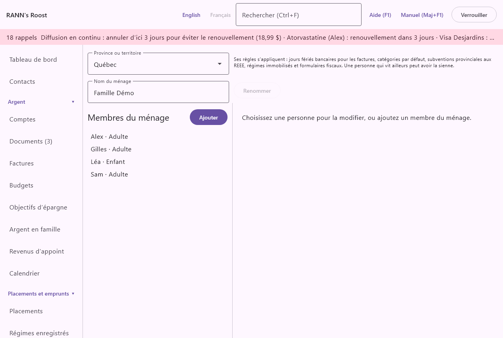

# Membres du ménage

Les membres du ménage sont les personnes que vos dossiers concernent : les adultes, les enfants et toute autre personne à la charge du ménage. Les comptes leur appartiennent, les dépenses et les réclamations médicales sont les leurs, les régimes enregistrés sont détenus pour eux et les feuillets fiscaux leur sont émis. L’écran est le premier élément du groupe **Réglages** du menu, sous le nom **Membres du ménage**.

## Ce qu’est un membre du ménage {#about-members}

@index: personne; famille; membre de la famille; conjoint; conjointe; enfant; personne à charge

Un membre du ménage est une personne, pas un compte de connexion. Un enfant peut être membre sans jamais utiliser l’application, et un grand-parent que vous aidez peut aussi être membre.

- Un membre est une personne que les dossiers concernent : à qui est le compte, l’ordonnance, les droits de cotisation REER, le feuillet T4.
- Un utilisateur est une personne qui se connecte avec un nom d’utilisateur et un mot de passe. Les utilisateurs se règlent à l’écran [Utilisateurs](users).
- Un adulte qui se connecte est habituellement les deux : un membre, et un utilisateur lié à ce membre. Voir [Membres et utilisateurs](members#members-and-users).

> Conseil : Ajoutez toutes les personnes d’abord, avant les comptes. Le formulaire de compte demande à qui appartient chaque compte, et les régimes enregistrés, les réclamations médicales et les feuillets fiscaux ont tous besoin que la personne existe.

## L’écran Membres du ménage {#screen}

L’écran a trois parties :

- En haut, la **Province ou territoire** du ménage, avec une courte note sur ce qu’elle change.
- À gauche, la liste des personnes, avec un bouton **Ajouter** au-dessus pour les administrateurs.
- À droite, le formulaire de la personne choisie, ou d’une nouvelle personne.

### Province ou territoire {#province}

@index: province; territoire; Québec; Ontario; règles provinciales; jours fériés bancaires

- **Province ou territoire** : la province ou le territoire où vit le ménage. Elle est choisie à la création du ménage et peut être changée ici en tout temps. Ses règles s’appliquent à toutes les personnes du ménage qui n’ont pas leur propre province (voir **Habite au ou en** plus bas).

Ce que la province change :

- Les jours fériés bancaires pour les factures : quand une facture tombe une fin de semaine ou un jour férié bancaire provincial, les règles de jours ouvrables utilisent les jours fériés de cette province. Voir [Factures](bills).
- Les catégories par défaut : certaines catégories par défaut n’existent que dans certaines provinces (par exemple l’Allocation famille du Québec, ou l’assurance-emploi hors Québec). Quand vous changez la province, les catégories par défaut prévues pour la nouvelle province sont ajoutées. Les catégories déjà présentes ne sont jamais retirées. Voir [Catégories](categories).
- Les subventions provinciales aux REEE : la subvention provinciale au REEE d’un enfant dépend de l’endroit où il vit. Voir [Régimes enregistrés](plans).
- Les régimes immobilisés : les règles provinciales d’un FRV ou d’un compte immobilisé suivent la province du titulaire. Voir [Régimes enregistrés](plans).
- Les formulaires fiscaux : par exemple, si des relevés du Québec comme le RL-24 sont attendus, et comment la trousse fiscale présente l’année. Voir [Impôts](taxes).

Seul un administrateur peut changer la province. Pour les autres utilisateurs, la liste est affichée mais ne peut pas être changée.

> Remarque : Le changement s’applique dès que vous choisissez une nouvelle province. Il n’y a pas de bouton Enregistrer pour ce réglage. La changer de nouveau plus tard est sans risque : rien n’est supprimé.

### La liste des personnes {#list}

Chaque ligne montre le nom de la personne, son lien (Adulte, Enfant ou Autre personne à charge) et, si elle a sa propre province, cette province. La liste est en ordre alphabétique. Les personnes archivées viennent après les autres, en gris ; elles restent dans la liste pour que vous puissiez les ramener.

Cliquez sur une personne pour ouvrir son formulaire à droite. Quand personne n’est choisi, la droite indique « Choisissez une personne pour la modifier, ou ajoutez un membre du ménage. »

## Ajouter une personne {#add-person}

1. Cliquez sur **Ajouter** au-dessus de la liste.
2. Tapez le **Nom**.
3. Choisissez le **Lien**.
4. Si vous la connaissez, tapez la **Date de naissance (AAAA-MM-JJ)**.
5. Laissez **Habite au ou en** à **Comme le ménage**, ou choisissez la province de la personne.
6. Cliquez sur **Enregistrer**.

La nouvelle personne apparaît dans la liste et reste choisie.

### Le formulaire de la personne {#person-fields}

- **Nom** : le nom affiché partout où la personne peut être choisie : propriétaires des comptes, opérations, réclamations médicales, régimes enregistrés, feuillets fiscaux, téléphone. Obligatoire. Utilisez le nom que la famille emploie, comme Alex ou Grand-maman.
- **Lien** : Adulte, Enfant ou Autre personne à charge. La valeur par défaut d’une nouvelle personne est Adulte.
  - Adulte : une personne qui peut détenir des comptes, avoir une pension et ses propres droits de cotisation REER et CELI.
  - Enfant : un enfant du ménage. Les enfants sont exclus des listes qui n’ont de sens que pour les adultes, comme les droits de cotisation (CELI, REER) et les pensions, et ils peuvent être bénéficiaires d’un REEE.
  - Autre personne à charge : une autre personne que le ménage soutient, comme un parent ou un enfant adulte ayant une incapacité. Pour le crédit pour frais médicaux, les frais d’une autre personne à charge sont demandés sur leur propre ligne (ligne 33199 de la déclaration fédérale, pour les autres personnes à charge), et non avec ceux du couple et de ses enfants. Le crédit du Québec (ligne 381) les demande avec le ménage. Voir [Réclamations médicales](medical).
- **Date de naissance (AAAA-MM-JJ)** : facultative, mais plusieurs calculs en ont besoin. Tapez l’année, le mois et le jour, par exemple 2015-06-12. Le champ devient rouge tant que le texte n’est pas une date valide. Une fois une date inscrite, taper + ou - l’avance ou la recule d’un jour. Elle sert :
  - Aux droits de cotisation CELI quand aucun chiffre de l’ARC n’a été entré : les droits sont comptés à partir de l’année des 18 ans de la personne (ou de 2009).
  - Au retrait minimum d’un FERR, qui dépend de l’âge du titulaire au 1er janvier.
  - À l’avertissement de convertir un REER l’année où le titulaire atteint l’âge limite pour un REER.
  - Aux subventions REEE qui dépendent de l’âge de l’enfant, comme la subvention de la Colombie-Britannique. L’écran des REEE avertit quand un bénéficiaire n’a pas de date de naissance.
  - Si la date n’est pas une vraie date, l’application indique « Entrez la date au format AAAA-MM-JJ. » et rien n’est enregistré.
- **Habite au ou en** : la province ou le territoire dont les règles s’appliquent à cette personne. **Comme le ménage** (la valeur par défaut) signifie la province du ménage. Choisissez-en une autre pour une personne qui vit ailleurs, comme un étudiant aux études dans une autre ville ou un parent dans une autre province. La province de la personne sert pour ses feuillets et sa trousse fiscale, son crédit pour frais médicaux, sa subvention provinciale au REEE et ses régimes immobilisés.
- **Archivé (masqué des listes)** : affiché seulement pour une personne déjà enregistrée. Cochez-le pour une personne qui ne fait plus partie du ménage. Voir [Archiver une personne](members#archive-person).
- **Horaires de travail et d’école** : affiché pour une personne déjà enregistrée. Ouvre les heures de travail et d’école de cette personne, montrées dans le calendrier. Voir [Horaires de travail et d’école](calendar#schedules).
- **Enregistrer** : enregistre la personne. Rien n’est enregistré avant que vous cliquiez.

## Modifier une personne {#change-person}

1. Cliquez sur la personne dans la liste.
2. Changez n’importe quel champ.
3. Cliquez sur **Enregistrer**.

Les changements s’appliquent partout à la fois : un nouveau nom s’affiche sur tous les écrans, dans les rapports et sur le téléphone à sa prochaine mise à jour. Une date de naissance ou une province modifiée change les calculs qui les utilisent à partir de ce moment, y compris pour les années passées, puisqu’ils sont faits au moment où vous les consultez.

## Archiver une personne {#archive-person}

@index: retirer une personne; supprimer une personne; masquer une personne

Il n’y a pas de bouton pour supprimer une personne : les dossiers passés doivent garder son nom. À la place :

1. Cliquez sur la personne dans la liste.
2. Cochez **Archivé (masqué des listes)**.
3. Cliquez sur **Enregistrer**.

Une personne archivée n’est plus offerte quand vous choisissez une personne pour un nouveau dossier, et n’est plus envoyée au téléphone. Ses comptes, opérations, réclamations et feuillets continuent d’afficher son nom. Pour la ramener, décochez la case et cliquez sur **Enregistrer**.

## Où les membres du ménage servent {#where-used}

Les personnes ajoutées ici apparaissent dans toute l’application :

- [Comptes](accounts) : les propriétaires de chaque compte, qui déterminent à qui est le REER ou le CELI et à qui vont ses feuillets.
- Les opérations : une opération, ou une ventilation de celle-ci, peut être pour une personne, ce qui alimente les rapports par personne et la trousse fiscale.
- [Réclamations médicales](medical) et [Santé](health) : à qui est la dépense ou le dossier, et qui demande le crédit pour frais médicaux.
- [Régimes enregistrés](plans) : les droits de cotisation des adultes et des autres personnes à charge, les bénéficiaires de REEE, les pensions des adultes.
- [Impôts](taxes) : les feuillets attendus, les dons et la trousse de fin d’année sont regroupés par personne.
- [Argent en famille](family) : allocations, dépenses partagées et prêts familiaux.
- [Urgence et succession](estate), [Véhicules](vehicles), [Maison et biens](assets) et [Animaux](pets) : bénéficiaires, conducteurs, propriétaires.
- [Rapports](reports) : les rapports personnalisés peuvent être regroupés ou filtrés par personne.
- Le téléphone : la liste des personnes dans RANN's Roost Mobile, pour dire à qui est un reçu. Voir [Téléphones](phones).

## Membres et utilisateurs {#members-and-users}

@index: lier un utilisateur à un membre; cet utilisateur est le membre du ménage

Un utilisateur qui se connecte peut être lié à la personne qu’il est : à l’écran [Utilisateurs](users), **Cet utilisateur est le membre du ménage**. Ce lien dit à l’application qui « vous » êtes. Par exemple, les portefeuilles créés quand vous importez le fichier d’une plateforme de cryptoactifs appartiennent à la personne liée à votre utilisateur.

Le lien est facultatif, et un membre n’a jamais besoin d’un utilisateur. Archiver un membre n’empêche pas un utilisateur lié de se connecter ; cela se fait à l’écran Utilisateurs.

## Qui peut modifier les membres du ménage {#permissions}

Seul un administrateur peut ajouter, modifier ou archiver des membres du ménage et changer la province du ménage. Les autres utilisateurs peuvent voir la liste et ouvrir le formulaire de chaque personne, mais ses champs sont grisés, il n’y a pas de bouton **Ajouter** ni **Enregistrer**, et le formulaire indique « Seul un administrateur peut ajouter ou modifier les membres du ménage. »

Chaque changement est inscrit dans le journal d’activité à l’écran [Utilisateurs](users).
