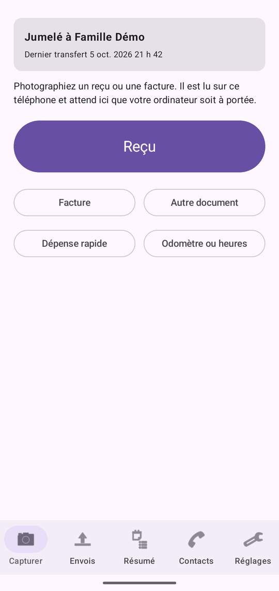
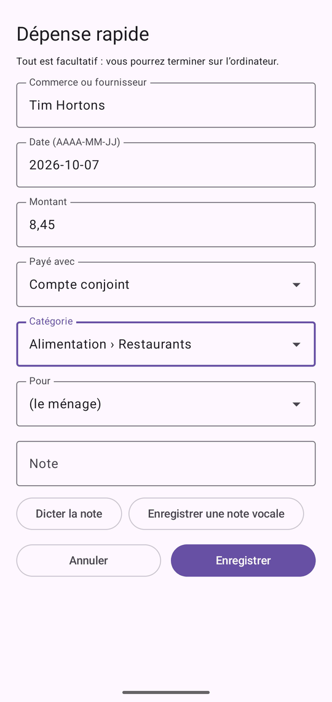
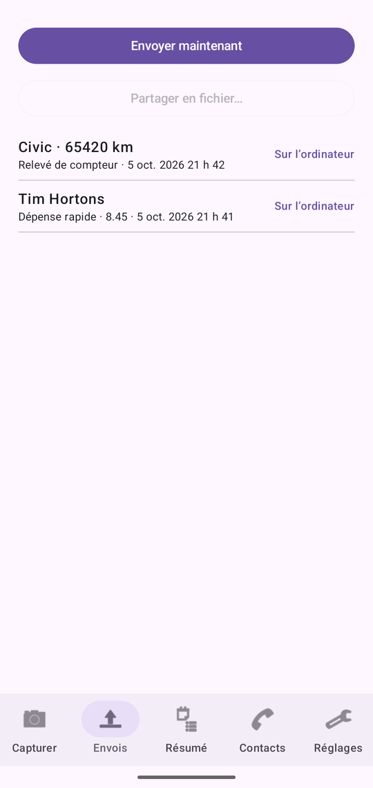
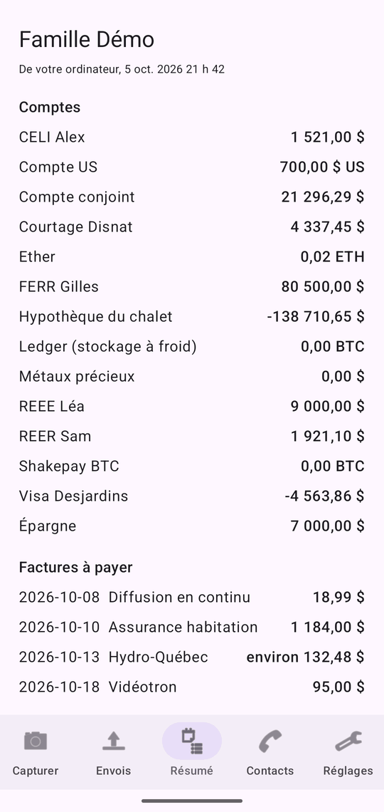
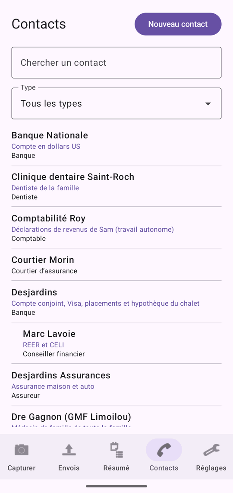
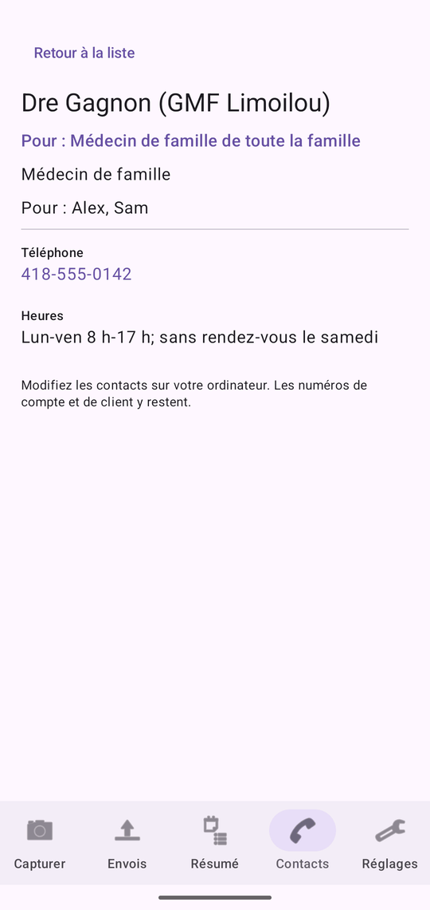

# RANN’s Roost Mobile

RANN’s Roost Mobile est l’application compagnon pour téléphones Android. Elle photographie les reçus, les factures et d’autres documents, inscrit des dépenses rapides et des lectures d’odomètre, et les envoie à RANN’s Roost sur votre ordinateur. En retour, elle affiche un résumé de vos soldes, des factures à payer, des rendez-vous à venir, des renouvellements de médicaments, des budgets et de l’entretien ainsi que les contacts du ménage, et vous rappelle les factures, les rendez-vous, les renouvellements et les budgets. Les contacts rencontrés en chemin peuvent être ajoutés sur le téléphone et envoyés à l’ordinateur pour vérification.

Le téléphone n’est pas une deuxième copie de vos livres : l’ordinateur garde l’exemplaire de référence. Le téléphone ne garde que ce qui attend d’être envoyé et le dernier résumé et les contacts venus de l’ordinateur. Sous son icône, l’application s’appelle RANN’s Roost.

Pour un parcours rapide, voir [Premiers pas avec l’application mobile](start-phone). Pour le côté ordinateur, voir [Téléphones](phones).

@index: Android; application mobile; application du téléphone; application compagnon; capture; numériser des reçus; RANN’s Roost Mobile

## Deux éditions {#editions}

@index: Google Play; GitHub; APK

RANN’s Roost Mobile existe en deux éditions qui fonctionnent de la même façon :

- L’édition Google Play, tenue à jour par Google Play.
- L’édition GitHub, installée à partir des versions publiées par RANN sur GitHub. Elle peut vérifier elle-même les mises à jour et les installer après avoir vérifié la signature de RANN (voir [Mises à jour](#updates)). Android peut vous demander, la première fois, d’autoriser RANN’s Roost Mobile à installer des applications.

## Confidentialité sur le téléphone {#privacy}

@index: chiffrement; magasin de clés Android; sauvegarde; confidentialité

- Tout ce que l’application garde (ses réglages, les captures et nouveaux contacts en attente, le résumé et les contacts) est chiffré avec une clé conservée dans le magasin de clés sécurisé du téléphone. La clé ne quitte jamais le téléphone.
- L’application est exclue des sauvegardes infonuagiques d’Android : rien n’en est copié chez Google.
- Les captures ne vont qu’à votre ordinateur, chiffrées avec la clé créée au jumelage. Loin de la maison, elles peuvent passer par un dossier de votre propre stockage infonuagique, toujours chiffrées.
- Les calendriers ne sont lus que si vous activez [Calendriers de ce téléphone](phone-app#phone-calendars), seulement ceux que vous cochez, et ne vont qu’à votre ordinateur, chiffrés de la même façon.
- La seule autre connexion est la vérification quotidienne des mises à jour de l’édition GitHub, si vous l’autorisez. Elle n’envoie rien sur vous ni sur votre ménage.
- Dès que votre ordinateur confirme avoir reçu une capture, le téléphone supprime sa copie des images et des détails.

## Le verrou {#lock}

@index: NIP; PIN; empreinte digitale; reconnaissance faciale; biométrie; verrouillage

L’application est verrouillée par un NIP, et au besoin par votre empreinte ou votre visage, pour que reçus et soldes restent privés même si quelqu’un d’autre a votre téléphone.

### Choisir un NIP {#choose-pin}

La première fois que vous ouvrez l’application, elle affiche **Choisissez un NIP pour verrouiller l’application** : de 4 à 8 chiffres. Saisissez-le et touchez **OK**, puis **Entrez le NIP de nouveau** et touchez **OK**. Si les deux sont différents, l’application le dit et vous recommencez.

Le NIP n’est pas gardé sur le téléphone, seulement une empreinte brouillée qui sert à le vérifier. Un NIP oublié ne peut pas être récupéré : l’application peut seulement recommencer à zéro, en effaçant ce qu’elle garde (voir [NIP oublié](phone-app#forgot-pin)). Choisissez-en un dont vous vous souviendrez.

### Déverrouiller l’application {#unlock}

- **Entrez votre NIP**, puis **OK**. Un NIP erroné affiche **NIP incorrect** et vide la case.
- **Utiliser l’empreinte ou le visage** : affiché quand le téléphone le permet et que **Déverrouiller avec l’empreinte ou le visage** est activé dans Réglages. La fenêtre d’Android apparaît ; **Annuler** revient au NIP.

L’application se verrouille de nouveau quand vous y revenez après plus d’une minute d’absence.

- **NIP oublié?** : voir [NIP oublié](phone-app#forgot-pin).

### NIP oublié {#forgot-pin}

@index: NIP oublié; réinitialiser le NIP; NIP perdu; effacer l’application

Un NIP oublié ne peut pas être récupéré, ni par vous ni par l’ordinateur. Pour utiliser l’application de nouveau, elle recommence à zéro :

1. À l’écran de verrouillage, touchez **NIP oublié?**.
2. Lisez l’avertissement **Effacer les données de l’application?**. Il explique ce qui est effacé.
3. Touchez **Effacer et recommencer**, ou **Annuler** pour tout garder et essayer votre NIP de nouveau.
4. L’application vous demande de choisir un nouveau NIP, comme la première fois.
5. Jumelez de nouveau le téléphone avec l’ordinateur. Voir [Jumeler un téléphone](phones#pair).

Ce qui est effacé, sur ce téléphone seulement : les saisies pas encore envoyées à l’ordinateur (photos, reçus, notes, lectures d’odomètre), la liste de ce qui a été envoyé, le jumelage avec l’ordinateur, le résumé reçu de lui, et tous les réglages, y compris le déverrouillage par empreinte et le dossier de transfert. Cela ne peut pas être annulé.

Ce qui reste : tout ce que l’ordinateur a déjà reçu, et le ménage sur l’ordinateur. L’ancien jumelage ne peut plus rien envoyer ; retirez-le de la liste à l’écran **Téléphones** de l’ordinateur. Voir [La liste des téléphones](phones#phone-list).

> Conseil : Les saisies pas encore envoyées ne peuvent pas l’être sans le NIP. Une fois le téléphone jumelé de nouveau, saisissez-les de nouveau.

## Le premier démarrage {#first-start}

- Sur Android 13 et plus, l’application demande si elle peut afficher des notifications. Autorisez-la pour recevoir les rappels de factures, de rendez-vous, de renouvellements, de budgets et d’entretien.
- L’édition GitHub demande une seule fois **Vérifier les mises à jour?** : **Vérifier une fois par jour** ou **Ne pas vérifier**. Vous pourrez changer ce choix plus tard dans [Réglages](#updates).
- Tant que le téléphone n’est pas jumelé, les onglets Capturer et Réglages affichent **Pas encore jumelé** et un bouton **Jumeler à un ordinateur**.

## Les onglets principaux {#tabs}

Cinq onglets s’alignent au bas de l’écran :

- **Capturer** : photographier ou inscrire quelque chose de nouveau. Voir [L’onglet Capturer](#capture-tab).
- **Envois** : ce que vous avez capturé et où il en est. Voir [L’onglet Envois](#sent-tab).
- **Résumé** : les soldes, les factures, l’entretien et les budgets venus de votre ordinateur. Voir [L’onglet Résumé](#summary-tab).
- **Contacts** : les contacts du ménage venus de votre ordinateur, et les nouveaux contacts à envoyer. Voir [L’onglet Contacts](#contacts-tab).
- **Réglages** : le jumelage, le dossier de transfert, le verrou et les mises à jour. Voir [L’onglet Réglages](#settings-tab).

Quand une version plus récente est offerte (édition GitHub), une bande en haut des autres onglets l’indique ; touchez-la pour aller aux Réglages.

## Jumeler à un ordinateur {#pair-screen}

@index: jumeler; jumelage; code QR; numériser le code; texte de jumelage

Le jumelage relie ce téléphone à RANN’s Roost sur votre ordinateur. Faites-le une fois, à la maison, sur le même Wi-Fi que l’ordinateur.

1. Sur l’ordinateur, ouvrez le ménage, allez à **Téléphones** et cliquez sur **Jumeler un téléphone**. Un code QR apparaît.
2. Sur le téléphone, touchez **Jumeler à un ordinateur** (dans l’onglet Capturer ou Réglages).
3. Touchez **Numériser le code** et pointez l’appareil photo vers le code QR.

L’écran affiche **Jumelage…**, puis l’application revient à l’onglet Capturer, affiche **Jumelé à** et le nom de votre ménage, et envoie aussitôt ce qui attendait déjà.

Autres façons de jumeler :

- Numérisez le code QR avec l’appareil photo du téléphone : il ouvre RANN’s Roost Mobile et jumelle (après que vous avez déverrouillé l’application).
- **Ou collez le texte de jumelage** : quand l’appareil photo ne peut pas lire l’écran, cliquez sur **Copier en texte** sur l’ordinateur, faites parvenir le texte au téléphone, collez-le ici et touchez **OK**.

**Annuler** revient aux onglets sans jumeler.

Messages :

- **Ce n’est pas un code de jumelage de RANN’s Roost.** : le code ou le texte n’est pas un code de jumelage.
- **Impossible de joindre l’ordinateur.** : vérifiez que les deux sont sur le même Wi-Fi, que le ménage est ouvert sur l’ordinateur et que Windows autorise RANN’s Roost sur les réseaux privés.
- **L’ordinateur a refusé.** : le code a peut-être expiré (chacun dure 10 minutes par défaut et ne sert qu’une fois). Affichez-en un nouveau sur l’ordinateur.

Le téléphone est jumelé à l’utilisateur connecté sur l’ordinateur à ce moment-là. Jumeler de nouveau, au même ordinateur ou à un autre, remplace le jumelage précédent.

## L’onglet Capturer {#capture-tab}

En haut, une carte montre le jumelage : **Jumelé à** votre ménage et **Dernier transfert** avec sa date et son heure (ou **Rien d’envoyé pour l’instant**), ou **Pas encore jumelé** avec un bouton **Jumeler à un ordinateur**. Vous pouvez capturer avant de jumeler : tout attend sur le téléphone.

Les boutons :

- **Reçu** : numériser un reçu.
- **Facture** : numériser une facture ou un relevé.
- **Autre document** : numériser tout autre document à garder, comme une garantie ou une lettre.
- **Dépense rapide** : inscrire un achat sans photo.
- **Odomètre ou heures** : inscrire l’odomètre d’un véhicule ou les heures d’utilisation d’un équipement.

Le genre choisi décide du classement de la capture sur l’ordinateur : une facture comme facture, un reçu ou une dépense rapide comme reçu, un autre document selon ce que l’ordinateur y lit.

### Numériser {#scanning}

@index: numériseur de documents; plusieurs pages; appareil photo; recadrer

**Reçu**, **Facture** et **Autre document** ouvrent le numériseur de documents d’Android. Il trouve les bords de la page, la recadre et la redresse. Vous pouvez :

- prendre jusqu’à 10 pages pour un même document (un long reçu, une facture de plusieurs pages) ;
- reprendre ou ajuster une page avant de terminer ;
- importer une image de la galerie du téléphone au lieu d’en prendre une.

Quand vous terminez, le [formulaire de capture](#capture-form) s’ouvre. Quitter le numériseur ne capture rien.

Les pages sont envoyées en images d’au plus 2 400 pixels sur leur plus grand côté, ce qui les garde lisibles et les transferts légers. Plusieurs pages deviennent un seul PDF sur l’ordinateur.

### Partager depuis d’autres applications {#share-into}

@index: partager; reçu électronique; reçu PDF; facture électronique

Dans une autre application (courriel, l’application d’un magasin, vos fichiers, la galerie de photos), utilisez **Partager** et choisissez RANN’s Roost Mobile pour l’envoyer :

- un PDF, comme un reçu ou une facture électronique, est gardé tel quel ;
- une ou plusieurs images deviennent les pages d’un même document, comme une numérisation de plusieurs pages ;
- du texte, comme un courriel partagé depuis votre application de courriel, est gardé comme document texte nommé d’après l’objet du courriel. Un fichier texte est gardé de la même façon.

Après que vous avez déverrouillé l’application, le formulaire de capture s’ouvre comme une capture **Document**, avec le nom du fichier conservé. Les images partagées sont lues comme des pages numérisées ; un PDF n’est pas lu sur le téléphone, c’est l’ordinateur qui le lit. Le texte partagé est affiché en haut du formulaire sous **Texte partagé**, et le téléphone remplit le commerce, la date et le montant qu’il y trouve. Enregistrez-le comme d’habitude. Sur l’ordinateur, le texte est le document, et ce que vous avez tapé dans **Note** reste une note.

### Plusieurs fichiers à la fois {#share-several}

@index: partager plusieurs fichiers; plusieurs PDF

Vous pouvez choisir plusieurs fichiers dans une autre application et les partager ensemble. Les images sont réunies en un seul document, car ce sont d’habitude les pages d’un même reçu ou d’une même lettre. Chaque PDF et chaque fichier texte est déjà un document complet ; chacun devient donc sa propre capture. Les formulaires s’ouvrent alors l’un après l’autre, chacun indiquant sa place, comme **1 sur 3** : enregistrez ou annulez chacun, et le suivant s’ouvre. Après le dernier, l’onglet Envois s’ouvre.

Les fichiers d’autres genres (une vidéo, un tableur) sont laissés de côté, et un message dit combien n’ont pas pu être utilisés.

## Le formulaire de capture {#capture-form}

Le titre du formulaire est le genre de capture. S’il y a plusieurs pages, il en indique le nombre. Pour des pages numérisées, **Lecture du document…** s’affiche pendant que le téléphone lit la première page ; il remplit ensuite le commerce, la date et le total qu’il a trouvés, que vous pouvez corriger. Le texte est lu sur le téléphone même, en français et en anglais, et accompagne la capture vers l’ordinateur.

**Tout est facultatif : vous pourrez terminer sur l’ordinateur.**

- **Commerce ou fournisseur** : le magasin, le restaurant ou l’entreprise. Rempli à partir de la lecture. Sur l’ordinateur, il devient le commerçant du document, et dans la liste des envois c’est le nom de la capture.
- **Date (AAAA-MM-JJ)** : la date du reçu ou de la facture, par exemple 2026-10-05. Remplie à partir de la lecture ; aujourd’hui pour une dépense rapide. Une date que l’ordinateur ne peut pas lire est ignorée et la date lue est gardée.
- **Montant** : le total, par exemple 42,17 ou 42.17 (un signe de dollar est ignoré). Il est arrondi au cent. Ce qui n’est pas un nombre est laissé de côté, et l’ordinateur utilise ce qu’il a lu.
- **Payé avec** : un compte de votre ordinateur, ou **(aucun)**. Sur l’ordinateur, il devient le compte proposé en premier quand une opération est créée à partir de la capture.
- **Catégorie** : une catégorie de dépenses de votre ordinateur, affichée sous sa catégorie parente, comme « Alimentation › Épicerie », ou **(aucun)**. Sur l’ordinateur, elle devient la catégorie proposée en premier pour cette opération.
- **Pour** : un membre du ménage ou un animal, ou **(le ménage)**. Sur l’ordinateur, il devient la personne ou l’animal proposé en premier pour cette opération.
- **Note** : ce qu’il faut retenir, comme « Dîner avec un client » ou « À retourner avant le 3 nov. ». Sur l’ordinateur, elle devient les notes du document.

**Payé avec**, **Catégorie** et **Pour** apparaissent une fois que le téléphone a reçu un résumé de l’ordinateur, après le premier transfert. Ils sont envoyés avec la capture et gardés avec le document sur l’ordinateur. Quand vous la vérifiez sur l’ordinateur et choisissez **Nouvelle opération à partir de ce document**, le formulaire commence avec ces choix ; vous pouvez encore les changer. Voir [Nouvelle opération à partir de ce document](documents#new-transaction).

Les boutons :

- **Annuler** : ferme le formulaire ; rien n’est gardé.
- **Enregistrer** : met la capture dans la file d’attente et tente de l’envoyer aussitôt. L’application passe à l’onglet **Envois**.

Les valeurs que vous saisissez l’emportent sur ce que le téléphone ou l’ordinateur a lu.

### Notes vocales {#voice-note}

@index: dictée; note vocale; parole

Sous **Note** :

- **Dicter la note** : parlez et Android écrit vos mots dans la note, en français ou en anglais canadien selon la langue du téléphone. Chaque dictée s’ajoute à la fin de la note.
- **Enregistrer une note vocale** : enregistre votre voix, jusqu’à une minute ; la première fois, Android demande d’autoriser le microphone. **Enregistrement… (jusqu’à une minute)** s’affiche pendant l’enregistrement. Touchez **Arrêter l’enregistrement** pour terminer ; à une minute, l’enregistrement s’arrête de lui-même et la minute est gardée. L’application affiche alors **Note vocale gardée** et sa durée, avec **Supprimer** pour l’effacer et en enregistrer une autre.

Une note vocale enregistrée est envoyée avec la capture et gardée avec son document sur l’ordinateur, où vous pouvez l’écouter en vérifiant. Le microphone ne sert que pendant que vous enregistrez.

### Dépense rapide {#quick-expense}

@index: achat comptant; dépense sans reçu

**Dépense rapide** ouvre le même formulaire, sans page et avec la date du jour. Utilisez-la pour un achat comptant ou tout ce qui n’a pas de reçu. Sur l’ordinateur, elle devient un court document texte avec le commerce, la date, le montant et la note, qui attend dans l’onglet **À vérifier** de Documents comme les autres.

## Odomètre ou heures {#odometer-form}

@index: odomètre; kilométrage; relevé de compteur; heures d’utilisation; kilomètres

Inscrit une lecture pour un véhicule, ou pour un équipement mesuré en heures d’utilisation (une génératrice, un tracteur, un moteur de bateau), pour que l’ordinateur suive l’entretien dû selon la distance ou les heures et les kilomètres de l’année dans les [Déplacements](trips).

- **Véhicule ou équipement** : les véhicules et équipements à compteur de votre ordinateur, chacun avec sa dernière lecture, par exemple « Civic (84 210 km) ». La liste se remplit après le premier transfert.
- **Odomètre (km)** ou **Heures d’utilisation**, selon l’élément choisi : la lecture, en nombre entier, jusqu’à 7 chiffres.
- **Date (AAAA-MM-JJ)** : aujourd’hui par défaut.
- **Annuler** : ferme sans enregistrer.
- **Enregistrer** : offert dès qu’un élément et une lecture sont saisis. La lecture rejoint la file d’attente et est envoyée aussitôt si possible.

Sur l’ordinateur, la lecture est ajoutée directement au véhicule dans l’écran Véhicules, ou au compteur de l’équipement dans Maison et biens, sans vérification.

## L’onglet Envois {#sent-tab}

@index: file d’attente; boîte d’envoi; envoyer; état du transfert

L’onglet Envois liste ce que vous avez capturé, du plus récent au plus ancien, et où chaque élément en est.

### Envoyer maintenant {#send-now}

**Envoyer maintenant** envoie aussitôt tout ce qui attend à l’ordinateur, et va chercher un résumé à jour même quand il n’y a rien à envoyer. Pendant l’envoi, le bouton affiche **Envoi…**. Le résultat s’affiche dessous :

- **Envoyé.** : l’ordinateur a reçu les éléments.
- **Rien de nouveau à envoyer. Résumé mis à jour.**
- **Jumelez d’abord votre ordinateur.**
- **Votre ordinateur n’est pas à portée. Les éléments attendent ici et seront envoyés automatiquement par Wi-Fi.** : le téléphone n’est pas sur le même réseau, ou le ménage n’est pas ouvert sur l’ordinateur.
- **Votre ordinateur n’est pas à portée : les captures ont été déposées, chiffrées, dans votre dossier de transfert.** : affiché à la place quand un dossier de transfert est choisi. L’ordinateur les importera, et le téléphone récupérera la confirmation la prochaine fois.
- **Le dossier de transfert n’a pas pu être écrit. Choisissez-le de nouveau dans Réglages.**
- **Quelqu’un d’autre est connecté sur l’ordinateur.** : le téléphone appartient à un autre utilisateur du ménage. Vos éléments attendent jusqu’à ce que vous y ouvriez le ménage.
- **Ce téléphone a été retiré sur l’ordinateur. Jumelez-le de nouveau pour envoyer.** : le téléphone n’est plus jumelé ; ses captures restent sur le téléphone.
- **L’envoi a échoué. Réessayez plus tard.**

### Partager en fichier {#share-file}

**Partager en fichier…** crée un ou plusieurs fichiers de transfert chiffrés avec toutes les captures pas encore confirmées, puis ouvre le menu de partage d’Android pour les envoyer par courriel, les enregistrer sur une clé USB ou dans vos fichiers, ou les passer à une autre application. Chaque fichier contient au plus environ 15 Mo d’images ; un gros envoi donne donc plusieurs fichiers. Le bouton est offert quand quelque chose attend encore.

L’objet du courriel est rempli avec « [RANN's Roost] transfert » suivi d’un court identifiant fait des premiers caractères de l’identifiant du ménage et de celui du téléphone (les mêmes caractères que dans les noms de fichiers), comme « [RANN's Roost] transfert 5c1e0a-3f9a1c2e ». Il ne nomme personne et ne donne aucun montant : le fournisseur de courriel n’apprend rien sur le ménage, et une règle de la boîte de courriel peut quand même trier les fichiers. Vous pouvez changer l’objet avant d’envoyer.

Sur l’ordinateur, importez les fichiers avec **Importer un fichier de transfert…** dans l’écran Téléphones, ou déposez-les dans l’écran Documents. Les éléments partagés affichent **Envoyé** jusqu’à leur confirmation : par Wi-Fi, le téléphone les renvoie et l’ordinateur les confirme ; avec un dossier de transfert, l’ordinateur y laisse sa réponse quand vous importez le fichier, et chaque réponse que le téléphone récupère dans le dossier au cours des 60 jours suivants les confirme aussi.

### La liste des captures {#queue}

Chaque capture affiche son nom (le commerce, ou le genre de capture, ou le véhicule et la lecture, ou le nom d’un nouveau contact), son genre, le montant s’il y en a un, et le moment de la capture. À droite, son état :

- **En attente** : pas encore reçue par l’ordinateur.
- **Envoyé** : déposée dans le dossier de transfert ou partagée en fichier, en attente de la confirmation de l’ordinateur.
- **Sur l’ordinateur** : reçue. La copie des images et des détails sur le téléphone est supprimée ; la ligne reste 30 jours, puis disparaît.
- **Refusé** : l’ordinateur n’a pas pu la garder ; la raison s’affiche en rouge. Elle est retentée à chaque transfert.

**Supprimer**, sur toute capture qui n’est pas encore sur l’ordinateur, la retire aussitôt du téléphone, sans demander. Elle ne peut pas être récupérée.

### Quand l’application envoie {#sending}

Vous avez rarement besoin d’**Envoyer maintenant** :

- Enregistrer une capture tente de l’envoyer aussitôt.
- En arrière-plan, l’application envoie peu après une capture, puis toutes les heures tant que quelque chose attend, quand le téléphone est sur un Wi-Fi (ou un autre réseau non facturé à l’usage).
- Avec un dossier de transfert choisi, l’application vérifie aussi toutes les heures, sur toute connexion : elle récupère les confirmations de l’ordinateur et, quand l’ordinateur est hors de portée, dépose les nouvelles captures dans le dossier.

Les éléments sont envoyés par petits lots, les plus anciens d’abord. Une capture déjà déposée dans le dossier n’y est pas écrite de nouveau, mais le téléphone l’envoie quand même par Wi-Fi dès qu’il le peut ; l’ordinateur ne reçoit chaque capture qu’une fois.

## L’onglet Résumé {#summary-tab}

@index: soldes; factures à payer; budgets; entretien à faire; rendez-vous à venir; renouvellements

Le Résumé affiche les chiffres de votre ordinateur au dernier transfert : le nom du ménage, puis **De votre ordinateur** et la date et l’heure de ce transfert. Avant le premier transfert, il vous invite à jumeler.

- **Comptes** : chaque compte et son solde.
- **Factures à payer** : les factures dues dans les 60 prochains jours et pas encore payées, jusqu’à 15, avec la date d’échéance et le montant, ou **environ** un montant quand il est estimé.
- **À venir** : les rendez-vous et événements du calendrier de l’ordinateur dans les prochaines semaines, jusqu’à 12, chacun avec la personne concernée, sa date et son heure, ou **Toute la journée**. Seuls les événements des comptes que votre utilisateur peut voir sur l’ordinateur sont envoyés : les rendez-vous privés d’un autre utilisateur n’arrivent jamais sur votre téléphone. Les événements marqués faits ou annulés sont laissés de côté.
- **Renouvellements de médicaments** : les médicaments actifs dont la provision se termine dans les deux prochains mois, ou est déjà terminée, avec la date, et **à renouveler** quand il ne reste plus de renouvellements. Comme pour le calendrier, seuls les médicaments que votre utilisateur peut voir sont envoyés.
- **Entretien du mois** : affiché quand quelque chose est prévu : chaque tâche, comme « Civic : Vidange d’huile », avec **à faire**, **bientôt** ou sa date.
- **Budgets du mois** : chaque catégorie de dépenses qui a un budget : ce qui a été dépensé sur le budget, par exemple « 412,30 $ sur 600,00 $ ».

Les chiffres ne changent pas avant le prochain transfert. Touchez **Envoyer maintenant** dans l’onglet Envois pour les mettre à jour.

## L’onglet Contacts {#contacts-tab}

@index: contacts; carnet d’adresses; appeler; courriel; carte; itinéraire

L’onglet Contacts affiche les contacts du ménage venus de votre ordinateur : les banques, conseillers, médecins, pharmacies, entrepreneurs et autres que vous gardez à l’écran Contacts. Le téléphone reçoit les contacts que vous pouvez voir sur l’ordinateur, pas ceux gardés dans le groupe privé de quelqu’un d’autre, ni les contacts archivés. Les numéros de compte et de client ne viennent jamais sur le téléphone. Les contacts y sont en lecture seule : modifiez-les sur l’ordinateur, et le téléphone a la modification après le prochain transfert (touchez **Envoyer maintenant** dans l’onglet Envois pour l’obtenir).

Avant le premier transfert, l’onglet indique **Jumelez avec votre ordinateur pour voir ici les contacts du ménage.** Vous pouvez quand même ajouter un nouveau contact ; il attend sur le téléphone.

### La liste {#contacts-list}

- **Nouveau contact** : en haut, ouvre le formulaire [Nouveau contact](#new-contact).
- **Chercher un contact** : trouve les contacts à mesure que vous tapez, par le nom, le « pour quoi », l’organisation, le poste, les personnes servies, les numéros de téléphone, les courriels, l’adresse et les notes. Les accents et les majuscules sont ignorés : « medecin » trouve « Médecin ». Des chiffres trouvent un numéro de téléphone peu importe comment il est écrit : « 6135550101 » trouve « 613 555-0101 ».
- **Type** : n’affiche que les contacts d’un type, comme Pharmacie ou Banque. La liste n’offre que les types de vos contacts. **Tous les types** les affiche tous de nouveau.

Chaque ligne affiche le nom du contact, son « pour quoi » en couleur et ses types ; une personne dont l’organisation n’est pas dans la liste affiche aussi cette organisation. Les personnes qui travaillent dans une organisation sont listées juste sous elle, en retrait. Touchez une ligne pour ouvrir la page du contact. Quand rien ne correspond, l’onglet indique **Aucun contact ne correspond.**

### La page d’un contact {#contact-page}

- **Retour à la liste** : revient à la liste (le geste de retour d’Android fait de même).
- Le nom, puis **Pour :** et le « pour quoi », et les types du contact.
- Pour une personne : son poste et l’organisation où elle travaille. Touchez l’organisation pour ouvrir sa page.
- **Pour tout le ménage**, ou **Pour :** et les noms des personnes et des animaux qu’il sert.
- Chaque téléphone, avec son étiquette (comme Bureau ou Cellulaire) ou **Téléphone** : touchez-le pour ouvrir le composeur du téléphone avec le numéro inscrit. Rien n’est composé avant que vous touchiez appeler.
- Chaque courriel, avec son étiquette ou **Courriel** : touchez-le pour commencer un message dans votre application de courriel.
- **Adresse** : touchez-la pour chercher l’adresse dans votre application de cartes.
- **Site Web** : touchez-le pour ouvrir le site dans votre navigateur.
- **Heures** et **Notes** : affichées comme elles sont écrites sur l’ordinateur.
- **Personnes** : sur la page d’une organisation, les personnes qui y travaillent ; touchez-en une pour ouvrir sa page.

## Nouveau contact {#new-contact}

@index: ajouter un contact sur le téléphone; nouveau contact

Nouveau contact inscrit quelqu’un que vous rencontrez en chemin, comme un plombier qui vient de laisser sa carte. Il est envoyé à votre ordinateur, qui le présente pour vérification avant qu’il devienne un contact : rien n’est ajouté aux contacts du ménage avant votre choix sur l’ordinateur. Seul le nom est obligatoire.

- **Nom** : le nom de la personne ou de l’organisation, comme vous voulez le voir.
- **Organisation** ou **Personne** : ce qu’est le contact. Organisation est choisi au départ.
- **Travaille chez** : pour une personne, l’organisation où elle travaille, choisie parmi les organisations du téléphone. **(aucun)** quand elle n’est pas dans la liste.
- **Organisation, si elle n’est pas dans la liste** : pour une personne dont l’organisation n’est pas dans la liste, son nom. Sur l’ordinateur, elle devient l’organisation de la personne si un contact de ce nom existe ; sinon, elle va dans les notes.
- **Type** : ce qu’est le contact, comme Entrepreneur, Pharmacie ou Banque. **(aucun)** le laisse à l’ordinateur.
- **Pour quoi** : quelques mots pour le reconnaître, comme « Chauffe-eau » ou « dermatologue de Sam ».
- **Téléphone** et son **Étiquette (bureau, cellulaire…)** : une ligne pour commencer. **Ajouter un téléphone** en ajoute une autre. Les lignes laissées vides ne sont pas envoyées.
- **Courriel** et son **Étiquette (bureau, cellulaire…)** : de même pour les courriels ; **Ajouter un courriel** en ajoute un autre.
- **Adresse** et **Notes** : texte libre, sur plusieurs lignes au besoin.
- **Annuler** : ferme sans enregistrer.
- **Enregistrer** : met le contact dans la file, avec les captures, et l’envoie aussitôt si l’ordinateur est à portée.

Un nouveau contact prend les mêmes chemins que les captures : par votre Wi-Fi, par le dossier de transfert, ou dans un fichier partagé avec **Partager en fichier…**. Il figure dans l’onglet Envois comme **Nouveau contact**, avec les mêmes états. Quand l’ordinateur l’a reçu, le téléphone supprime sa copie. Un nouveau contact n’apparaît pas dans l’onglet Contacts : une fois ajouté sur l’ordinateur, il revient avec les autres contacts après le prochain transfert.

> Remarque : un ordinateur qui a une version plus ancienne de RANN’s Roost ne prend pas les contacts du téléphone. Ils restent **En attente** sur le téléphone jusqu’à la mise à jour de l’ordinateur.

## Notifications {#notifications}

@index: rappels; rappel de facture; alerte de budget; rappel d’entretien; notifications; rappel de rendez-vous; rappel de renouvellement; écran de verrouillage

À partir du dernier résumé, le téléphone affiche des notifications, chacune une seule fois. Les rappels de rendez-vous arrivent à leur heure ; les autres sont vérifiés après chaque transfert et environ toutes les 12 heures :

- **Rappels du calendrier** : à chaque moment de rappel choisi pour un rendez-vous sur l’ordinateur, par exemple un jour et une heure avant, comme « Pose des pneus d’hiver : Demain à 09 h 30 · Garage Tremblay » ou « Dans 2 minutes ». Un événement d’une journée entière est rappelé en comptant à partir de 8 h ce matin-là. Si le téléphone était éteint ou n’avait pas encore reçu le rendez-vous, le dernier rappel arrivé est affiché en retard, jusqu’au début du rendez-vous. Les rappels arrivent même quand l’application est fermée et après un redémarrage du téléphone. Voir [Rappels à la minute près](#exact-reminders).
- **Renouvellements de médicaments** : à partir des jours de rappel d’un médicament avant la fin de sa provision, et quand elle est terminée (« Renouvellement dans 3 jours. · Alex »), avec un rappel de demander une nouvelle ordonnance quand il ne reste plus de renouvellements.

- **Rappels de factures** : quand une facture est due dans ses jours de rappel, tels que réglés sur l’ordinateur (« Hydro est à payer dans 3 jours », « à payer demain », « à payer aujourd’hui »).
- **Alertes de budget** : quand les dépenses du mois d’une catégorie atteignent 80 % de son budget, et de nouveau quand le budget est épuisé. Elles n’utilisent que les chiffres d’un transfert fait ce mois-ci. La notification nomme la catégorie, mais pas les montants, qui sont dans le Résumé, derrière le NIP.
- **Rappels d’entretien** : quand une tâche sera bientôt à faire, et quand elle est à faire.

Elles n’apparaissent que si vous avez autorisé les notifications. Chaque genre a son propre canal dans les réglages de notification d’Android, où vous pouvez le désactiver.

### La santé et l’écran de verrouillage {#lock-screen}

Les détails de santé n’apparaissent jamais dans une notification, verrouillé ou non : un rendez-vous médical n’affiche que **Rendez-vous santé** et le moment, et un rappel de renouvellement ne nomme aucun médicament. Ouvrez l’onglet Résumé, derrière le NIP de l’application, pour savoir lequel.

Les autres notifications affichent leur titre et leur texte. Quand le téléphone a un verrouillage d’écran et est réglé pour masquer le contenu sensible des notifications sur l’écran de verrouillage (dans les réglages d’Android, sous les notifications sur l’écran de verrouillage), un téléphone verrouillé n’affiche que **Rappel** pour les rendez-vous et les renouvellements, et seulement le titre pour les alertes de budget.

## L’onglet Réglages {#settings-tab}

La carte du jumelage est en haut, comme dans l’onglet Capturer.

### Annuler le jumelage {#unpair}

**Annuler le jumelage**, affiché quand le téléphone est jumelé, fait oublier l’ordinateur au téléphone aussitôt. Les captures non envoyées restent sur le téléphone jusqu’au prochain jumelage. L’ordinateur liste toujours le téléphone : utilisez **Retirer** dans son écran Téléphones pour l’arrêter là aussi.

### Loin de la maison {#transfer-folder}

@index: dossier de transfert; Google Drive; OneDrive; Dropbox; Nextcloud; dossier infonuagique

Affiché quand le téléphone est jumelé. Quand l’ordinateur n’est pas à portée, les captures peuvent être déposées, chiffrées, dans un dossier de votre propre Google Drive, OneDrive, Dropbox ou Nextcloud ; le service ne voit que des fichiers illisibles. Choisissez le même dossier dans RANN’s Roost sur l’ordinateur (voir [Téléphones](phones#away-from-home)).

- La ligne affiche **Dossier de transfert :** et le dossier, ou **Aucun dossier de transfert choisi.**
- **Choisir un dossier…** (ou **Changer de dossier…**) : ouvre le sélecteur de dossiers d’Android. Choisissez votre service infonuagique dans son menu, puis le dossier, et autorisez l’accès. L’application du service doit être installée sur le téléphone.
- **Ne plus l’utiliser** : le téléphone cesse d’utiliser le dossier et rend son accès. Rien n’est supprimé dans le dossier.

### Rappels à la minute près {#exact-reminders}

@index: alarmes exactes; alarmes et rappels; rappel en retard

Android ne laisse une application sonner à la minute exacte qu’une fois que vous l’avez autorisé. D’ici là, les rappels du calendrier arrivent dans les dix minutes après leur heure. Tant que ce n’est pas autorisé, et que le téléphone est jumelé, Réglages affiche **Rappels à la minute près** et le bouton **Autoriser les rappels à l’heure**, qui ouvre la page **Alarmes et rappels** d’Android pour l’application : activez-la et revenez. La section disparaît alors et les rappels arrivent à l’heure.

### Calendriers de ce téléphone {#phone-calendars}

@index: permission du calendrier; READ_CALENDAR; Google Agenda; calendrier Outlook; importer des calendriers

Affiché une fois jumelé. Envoie au Calendrier de l’ordinateur les calendriers que ce téléphone affiche déjà (Google, Outlook ou Exchange, Samsung et autres), avec vos autres transferts. L’application ne se connecte jamais à un compte de calendrier. La ligne sous le titre indique **Désactivé**, ou combien de calendriers sont importés et combien de jours à l’avance. **Configurer** (ou **Modifier**) ouvre la page où cela se choisit :

- **Envoyer les calendriers à l’ordinateur** : l’active ou le désactive. La première fois, l’application explique pourquoi elle a besoin d’accéder au calendrier, puis Android le demande. Si vous refusez, rien n’est lu ; autorisez Agenda pour l’application dans les paramètres d’Android pour changer d’idée. Tant que c’est désactivé, rien n’est lu, et les calendriers importés auparavant sont retirés de l’ordinateur au prochain transfert.
- **Jours à l’avance** : 14, 30, 60 (par défaut), 90 ou 180 jours de chaque calendrier sont envoyés, à partir d’aujourd’hui.
- **Calendriers à importer, et qui les voit sur l’ordinateur** : chaque calendrier qu’Android affiche, avec son compte. Cochez ceux à importer, et choisissez pour chacun **Privé** (par défaut : vous seul le voyez), **Occupé seulement** (les autres vous voient occupé à ces heures, sans détails) ou **Partagé** (les autres voient les éléments).
- **Marquer des éléments** : les éléments à venir des calendriers cochés. Chacun peut être **Comme son calendrier**, **Privé**, **Occupé seulement** ou **Partagé** ; le choix vaut pour toutes les dates d’un élément qui se répète.
- **Terminé** revient aux Réglages.

Seuls les calendriers cochés sont lus, pour les jours choisis : le titre, le lieu, le début et la fin de chaque élément, jamais sa description, ses invités ou ses rappels. Ils ne vont qu’à votre ordinateur jumelé, chiffrés comme vos captures, par Wi-Fi, par le dossier de transfert ou dans un fichier partagé. Un calendrier est envoyé en entier quand il a changé depuis le dernier transfert ; rien n’est écrit dans vos calendriers. Si l’ordinateur n’a pas pu en enregistrer un, la raison paraît sous le titre et le téléphone réessaie au prochain transfert. Voir [Calendriers des téléphones et des fichiers](calendar-sync).

### Changer le NIP {#change-pin}

**Changer le NIP** vous demande de choisir un nouveau NIP, de 4 à 8 chiffres, et de le saisir de nouveau.

### Déverrouiller avec l’empreinte ou le visage {#biometric}

Affiché quand le téléphone a un lecteur d’empreintes ou la reconnaissance faciale configurés. Activé, l’écran de verrouillage offre **Utiliser l’empreinte ou le visage**. Le NIP fonctionne toujours aussi.

### Mises à jour {#updates}

@index: mise à jour; nouvelle version; signature

Affiché seulement dans l’édition GitHub ; l’édition Google Play est mise à jour par Google Play.

- **Vérifier les mises à jour une fois par jour** : activé, l’application cherche sur GitHub au plus une fois par jour, pendant qu’elle est ouverte, une version plus récente. Seule la vérification sort du téléphone : GitHub voit l’adresse Internet de votre téléphone, comme pour toute page Web. Rien de vos captures ni de votre ménage n’est envoyé.
- L’état : **La vérification des mises à jour est désactivée.**, **Vérification…**, **La version … est à jour.**, ou **La version … est disponible.** avec ses nouveautés.
- **Télécharger, vérifier et installer** : télécharge la nouvelle version, la vérifie avec la signature de RANN, sa taille et son empreinte annoncées, puis la remet à Android, qui vous demande de confirmer l’installation. Une barre montre le téléchargement.
- **Vérifier maintenant** : vérifie aussitôt.

Messages quand quelque chose ne va pas :

- **La mise à jour a été refusée parce qu’on n’a pas pu confirmer qu’elle est une version signée par RANN. Rien n’a été installé.**
- **Le téléchargement ne correspondait pas à la version signée par RANN ; il a été supprimé.**
- **Impossible de joindre GitHub pour vérifier les mises à jour.**, avec la raison.
- **La mise à jour n’a pas pu être installée.**, avec la raison.

### À propos et politique de confidentialité {#about}

Une courte note rappelle que vos données restent sur votre téléphone et votre ordinateur. **Politique de confidentialité** ouvre la politique de confidentialité de RANN sur rann.ca dans votre navigateur, dans la langue du téléphone.
