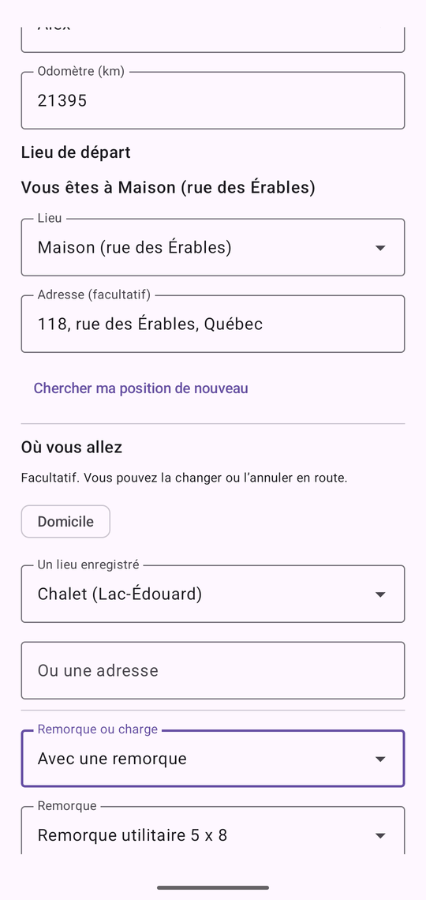
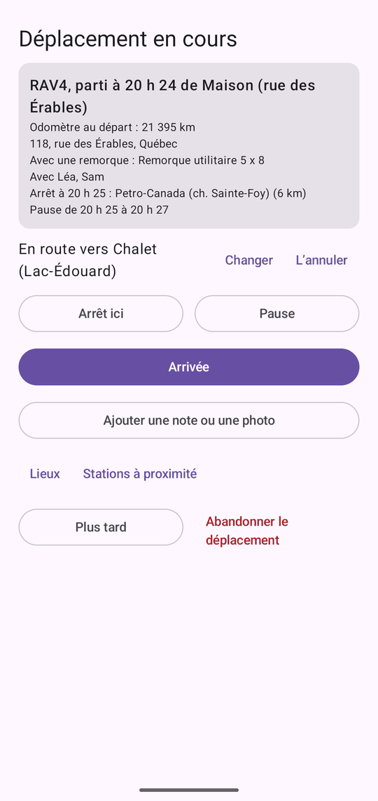
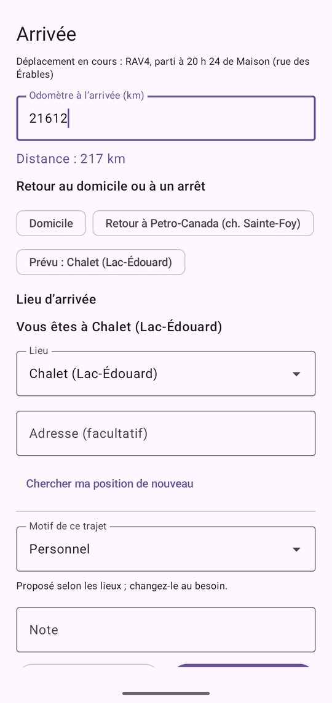
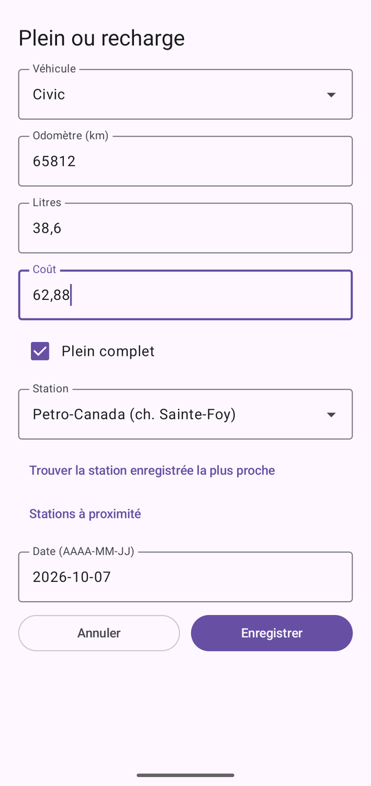
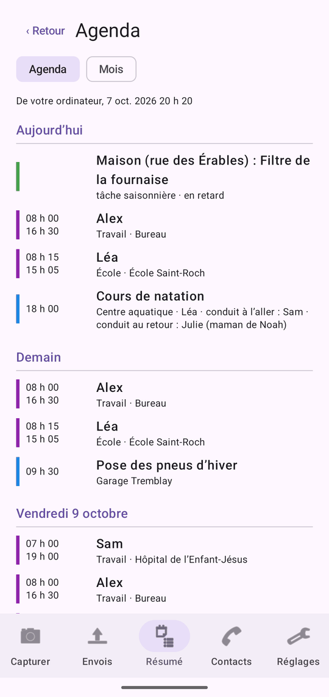

# RANN's Roost Mobile

RANN's Roost Mobile est l’application compagnon pour téléphones Android. Elle photographie les reçus, les factures et d’autres documents, inscrit des dépenses rapides, des lectures d’odomètre, des déplacements, des pleins et des recharges, et les envoie à RANN's Roost sur votre ordinateur. En retour, elle affiche un résumé de vos soldes, des factures à payer, des rendez-vous à venir, des renouvellements de médicaments, des budgets et de l’entretien ainsi que les contacts du ménage, et vous rappelle les factures, les rendez-vous, les renouvellements et les budgets. Les contacts rencontrés en chemin peuvent être ajoutés sur le téléphone et envoyés à l’ordinateur pour vérification.

Le téléphone n’est pas une deuxième copie de vos livres : l’ordinateur garde l’exemplaire de référence. Le téléphone ne garde que ce qui attend d’être envoyé et le dernier résumé et les contacts venus de l’ordinateur. Sous son icône, l’application s’appelle RANN's Roost.

Pour un parcours rapide, voir [Premiers pas avec l’application mobile](start-phone). Pour le côté ordinateur, voir [Téléphones](phones).

@index: Android; application mobile; application du téléphone; application compagnon; capture; numériser des reçus; RANN's Roost Mobile

## Deux éditions {#editions}

@index: Google Play; GitHub; APK

RANN's Roost Mobile existe en deux éditions qui fonctionnent de la même façon :

- L’édition Google Play, tenue à jour par Google Play.
- L’édition GitHub, installée à partir des versions publiées par RANN sur GitHub. Elle peut vérifier elle-même les mises à jour et les installer après avoir vérifié la signature de RANN (voir [Mises à jour](#updates)). Android peut vous demander, la première fois, d’autoriser RANN's Roost Mobile à installer des applications.

## Confidentialité sur le téléphone {#privacy}

@index: chiffrement; magasin de clés Android; sauvegarde; confidentialité

- Tout ce que l’application garde (ses réglages, les captures et nouveaux contacts en attente, le résumé et les contacts) est chiffré avec une clé conservée dans le magasin de clés sécurisé du téléphone. La clé ne quitte jamais le téléphone.
- L’application est exclue des sauvegardes infonuagiques d’Android : rien n’en est copié chez Google.
- Les captures ne vont qu’à votre ordinateur, chiffrées avec la clé créée au jumelage. Loin de la maison, elles peuvent passer par un dossier de votre propre stockage infonuagique, toujours chiffrées.
- Les calendriers ne sont lus que si vous activez [Calendriers de ce téléphone](phone-app#phone-calendars), seulement ceux que vous cochez, et ne vont qu’à votre ordinateur, chiffrés de la même façon. [L’agenda](#agenda) les affiche aussi, lus sur le téléphone pendant qu’il est ouvert ; rien de plus n’est envoyé. Seulement si vous choisissez **Dans les deux sens**, l’application écrit aussi les prochains rendez-vous, horaires et factures du ménage dans le calendrier que vous choisissez : un calendrier gardé seulement sur ce téléphone, ou un calendrier d’un de vos comptes, qui se synchronise alors avec ce compte. Voir [Dans les deux sens](phone-app#calendar-both-ways).
- La seule autre connexion est la vérification quotidienne des mises à jour de l’édition GitHub, si vous l’autorisez. Elle n’envoie rien sur vous ni sur votre ménage.
- Position : seulement si vous l’autorisez, l’application prend une seule position au départ d’un déplacement, à l’arrivée, et quand vous enregistrez un lieu ou cherchez la station la plus proche, jamais en arrière-plan ni à d’autres moments. La position est comparée à vos lieux enregistrés sur le téléphone même ; aucun service de cartes n’est consulté. Ce qui va à votre ordinateur, chiffré comme le reste, c’est le nom du lieu, ou les coordonnées quand vous laissez un lieu sans nom, et les coordonnées d’un lieu que vous enregistrez. Voir [Position](#location).
- Dès que votre ordinateur confirme avoir reçu une capture, le téléphone supprime sa copie des images et des détails.

## Le verrou {#lock}

@index: NIP; PIN; empreinte digitale; reconnaissance faciale; biométrie; verrouillage

L’application est verrouillée par un NIP, et au besoin par votre empreinte ou votre visage, pour que reçus et soldes restent privés même si quelqu’un d’autre a votre téléphone.

### Choisir un NIP {#choose-pin}

La première fois que vous ouvrez l’application, elle affiche **Choisissez un NIP pour verrouiller l’application** : de 4 à 8 chiffres. Saisissez-le et touchez **OK**, puis **Entrez le NIP de nouveau** et touchez **OK**. Si les deux sont différents, l’application le dit et vous recommencez.

Le NIP n’est pas gardé sur le téléphone, seulement une empreinte brouillée qui sert à le vérifier. Un NIP oublié ne peut pas être récupéré : l’application peut seulement recommencer à zéro, en effaçant ce qu’elle garde (voir [NIP oublié](phone-app#forgot-pin)). Choisissez-en un dont vous vous souviendrez.

### Déverrouiller l’application {#unlock}

- **Entrez votre NIP**, puis **OK**. Un NIP erroné affiche **NIP incorrect** et vide la case.
- **Utiliser l’empreinte ou le visage** : affiché quand le téléphone le permet et que **Déverrouiller avec l’empreinte ou le visage** est activé dans Réglages. La fenêtre d’Android apparaît ; **Annuler** revient au NIP.

L’application se verrouille de nouveau quand vous y revenez après le délai choisi dans les Réglages sous [Redemander le NIP](phone-app#lock-time) : une minute, sauf si vous le changez.

- **NIP oublié?** : voir [NIP oublié](phone-app#forgot-pin).

### NIP oublié {#forgot-pin}

@index: NIP oublié; réinitialiser le NIP; NIP perdu; effacer l’application

Un NIP oublié ne peut pas être récupéré, ni par vous ni par l’ordinateur. Pour utiliser l’application de nouveau, elle recommence à zéro :

1. À l’écran de verrouillage, touchez **NIP oublié?**.
2. Lisez l’avertissement **Effacer les données de l’application?**. Il explique ce qui est effacé.
3. Touchez **Effacer et recommencer**, ou **Annuler** pour tout garder et essayer votre NIP de nouveau.
4. L’application vous demande de choisir un nouveau NIP, comme la première fois.
5. Jumelez de nouveau le téléphone avec l’ordinateur. Voir [Jumeler un téléphone](phones#pair).

Ce qui est effacé, sur ce téléphone seulement : les saisies pas encore envoyées à l’ordinateur (photos, reçus, notes, lectures d’odomètre), la liste de ce qui a été envoyé, le jumelage avec l’ordinateur, le résumé reçu de lui, et tous les réglages, y compris le déverrouillage par empreinte et le dossier de transfert. Ce que l’application a écrit dans un calendrier avec **Dans les deux sens** est retiré aussi. Cela ne peut pas être annulé.

Ce qui reste : tout ce que l’ordinateur a déjà reçu, et le ménage sur l’ordinateur. L’ancien jumelage ne peut plus rien envoyer ; retirez-le de la liste à l’écran **Téléphones** de l’ordinateur. Voir [La liste des téléphones](phones#phone-list).

> Conseil : Les saisies pas encore envoyées ne peuvent pas l’être sans le NIP. Une fois le téléphone jumelé de nouveau, saisissez-les de nouveau.

## Le premier démarrage {#first-start}

- Sur Android 13 et plus, l’application demande si elle peut afficher des notifications. Autorisez-la pour recevoir les rappels de factures, de rendez-vous, de renouvellements, de budgets et d’entretien.
- L’édition GitHub demande une seule fois **Vérifier les mises à jour?** : **Vérifier une fois par jour** ou **Ne pas vérifier**. Vous pourrez changer ce choix plus tard dans [Réglages](#updates).
- Tant que le téléphone n’est pas jumelé, les onglets Capturer et Réglages affichent **Pas encore jumelé** et un bouton **Jumeler à un ordinateur**.

## Les onglets principaux {#tabs}

Cinq onglets s’alignent au bas de l’écran :

- **Capturer** : photographier ou inscrire quelque chose de nouveau. Voir [L’onglet Capturer](#capture-tab).
- **Envois** : ce que vous avez capturé et où il en est. Voir [L’onglet Envois](#sent-tab).
- **Résumé** : les soldes, les factures, l’entretien et les budgets venus de votre ordinateur, et l’agenda des 60 prochains jours. Voir [L’onglet Résumé](#summary-tab) et [L’agenda](#agenda).
- **Contacts** : les contacts du ménage venus de votre ordinateur, et les nouveaux contacts à envoyer. Voir [L’onglet Contacts](#contacts-tab).
- **Réglages** : le jumelage, le dossier de transfert, les rappels à la minute près, les calendriers, les recherches pour les déplacements, la langue, le verrou et les mises à jour. Voir [L’onglet Réglages](#settings-tab).

Dans les onglets **Capturer** et **Résumé**, l’icône de calendrier en haut à droite ouvre [l’agenda](#agenda) ; les lecteurs d’écran la nomment **Ouvrir l’agenda**.

Quand une version plus récente est offerte (édition GitHub), une bande en haut des autres onglets l’indique ; touchez-la pour aller aux Réglages.

## Jumeler à un ordinateur {#pair-screen}

@index: jumeler; jumelage; code QR; numériser le code; texte de jumelage

Le jumelage relie ce téléphone à RANN's Roost sur votre ordinateur. Faites-le une fois, à la maison, sur le même Wi-Fi que l’ordinateur.

1. Sur l’ordinateur, ouvrez le ménage, allez à **Téléphones** et cliquez sur **Jumeler un téléphone**. Un code QR apparaît.
2. Sur le téléphone, touchez **Jumeler à un ordinateur** (dans l’onglet Capturer ou Réglages).
3. Touchez **Numériser le code** et pointez l’appareil photo vers le code QR.

L’écran affiche **Jumelage…**, puis l’application revient à l’onglet Capturer, affiche **Jumelé à** et le nom de votre ménage, et envoie aussitôt ce qui attendait déjà.

Autres façons de jumeler :

- Numérisez le code QR avec l’appareil photo du téléphone : il ouvre RANN's Roost Mobile et jumelle (après que vous avez déverrouillé l’application).
- **Ou collez le texte de jumelage** : quand l’appareil photo ne peut pas lire l’écran, cliquez sur **Copier en texte** sur l’ordinateur, faites parvenir le texte au téléphone, collez-le ici et touchez **OK**.

**Annuler** revient aux onglets sans jumeler.

Messages :

- **Ce n’est pas un code de jumelage de RANN's Roost.** : le code ou le texte n’est pas un code de jumelage.
- **Impossible de joindre l’ordinateur.** : vérifiez que les deux sont sur le même Wi-Fi, que le ménage est ouvert sur l’ordinateur et que Windows autorise RANN's Roost sur les réseaux privés.
- **L’ordinateur a refusé.** : le code a peut-être expiré (chacun dure 10 minutes par défaut et ne sert qu’une fois). Affichez-en un nouveau sur l’ordinateur.

Le téléphone est jumelé à l’utilisateur connecté sur l’ordinateur à ce moment-là. Jumeler de nouveau, au même ordinateur ou à un autre, remplace le jumelage précédent.

## L’onglet Capturer {#capture-tab}

En haut, une carte montre le jumelage : **Jumelé à** votre ménage et **Dernier transfert** avec sa date et son heure (ou **Rien d’envoyé pour l’instant**), ou **Pas encore jumelé** avec un bouton **Jumeler à un ordinateur**. Vous pouvez capturer avant de jumeler : tout attend sur le téléphone.

Les boutons :

- **Reçu** : numériser un reçu.
- **Facture** : numériser une facture ou un relevé.
- **Autre document** : numériser tout autre document à garder, comme une garantie ou une lettre.
- **Dépense rapide** : inscrire un achat sans photo.
- **Odomètre ou heures** : inscrire l’odomètre d’un véhicule ou les heures d’utilisation d’un équipement.
- **Liste saisonnière** : les tâches de la saison venues de l’ordinateur, à cocher là où elles sont faites. Voir [Liste saisonnière sur le téléphone](phone-app#seasonal-form).
- **Relevé de compteur ou de réservoir**, **Heures travaillées**, **Tâches ménagères** et **Bénévolat** : les [formulaires d’inscription](#log-forms).
- **Déplacement** : commencer un déplacement, ou arriver quand un déplacement est en cours. Pendant un déplacement, une ligne sous le bouton l’indique, par exemple « Déplacement en cours : RAV4, parti à 16 h 30 de Maison (rue des Érables) ». Voir [Déplacement](#trip-form).
- **Plein ou recharge** : inscrire un plein ou une recharge. Voir [Plein ou recharge](#fuel-form).
- **Stations à proximité** : les stations-service et les bornes de recharge autour de vous, pour en enregistrer une comme lieu. Voir [Stations à proximité](#stations).

Après l’enregistrement d’une capture ou d’un formulaire d’inscription, l’application passe à l’onglet **Envois** ; fermer un formulaire sans enregistrer ramène à l’onglet Capturer.

Le genre choisi décide du classement de la capture sur l’ordinateur : une facture comme facture, un reçu ou une dépense rapide comme reçu, un autre document selon ce que l’ordinateur y lit.

### Numériser {#scanning}

@index: numériseur de documents; plusieurs pages; appareil photo; recadrer

**Reçu**, **Facture** et **Autre document** ouvrent le numériseur de documents d’Android. Il trouve les bords de la page, la recadre et la redresse. Vous pouvez :

- prendre jusqu’à 10 pages pour un même document (un long reçu, une facture de plusieurs pages) ;
- reprendre ou ajuster une page avant de terminer ;
- importer une image de la galerie du téléphone au lieu d’en prendre une.

Quand vous terminez, le [formulaire de capture](#capture-form) s’ouvre. Quitter le numériseur ne capture rien.

Les pages sont envoyées en images d’au plus 2 400 pixels sur leur plus grand côté, ce qui les garde lisibles et les transferts légers. Plusieurs pages deviennent un seul PDF sur l’ordinateur.

### Partager depuis d’autres applications {#share-into}

@index: partager; reçu électronique; reçu PDF; facture électronique

Dans une autre application (courriel, l’application d’un magasin, vos fichiers, la galerie de photos), utilisez **Partager** et choisissez RANN's Roost Mobile pour l’envoyer :

- un PDF, comme un reçu ou une facture électronique, est gardé tel quel ;
- une ou plusieurs images deviennent les pages d’un même document, comme une numérisation de plusieurs pages ;
- du texte, comme un courriel partagé depuis votre application de courriel, est gardé comme document texte nommé d’après l’objet du courriel. Un fichier texte est gardé de la même façon.

Après que vous avez déverrouillé l’application, le formulaire de capture s’ouvre comme une capture **Document**, avec le nom du fichier conservé. Les images partagées sont lues comme des pages numérisées ; un PDF n’est pas lu sur le téléphone, c’est l’ordinateur qui le lit. Le texte partagé est affiché en haut du formulaire sous **Texte partagé**, et le téléphone remplit le commerce, la date et le montant qu’il y trouve. Enregistrez-le comme d’habitude. Sur l’ordinateur, le texte est le document, et ce que vous avez tapé dans **Note** reste une note.

### Plusieurs fichiers à la fois {#share-several}

@index: partager plusieurs fichiers; plusieurs PDF

Vous pouvez choisir plusieurs fichiers dans une autre application et les partager ensemble. Les images sont réunies en un seul document, car ce sont d’habitude les pages d’un même reçu ou d’une même lettre. Chaque PDF et chaque fichier texte est déjà un document complet ; chacun devient donc sa propre capture. Les formulaires s’ouvrent alors l’un après l’autre, chacun indiquant sa place, comme **1 sur 3** : enregistrez ou annulez chacun, et le suivant s’ouvre. Après le dernier, l’onglet Envois s’ouvre.

Les fichiers d’autres genres (une vidéo, un tableur) sont laissés de côté, et un message dit combien n’ont pas pu être utilisés.

## Le formulaire de capture {#capture-form}

Le titre du formulaire est le genre de capture. S’il y a plusieurs pages, il en indique le nombre. Pour des pages numérisées, **Lecture du document…** s’affiche pendant que le téléphone lit la première page ; il remplit ensuite le commerce, la date et le total qu’il a trouvés, que vous pouvez corriger. Le texte est lu sur le téléphone même, en français et en anglais, et accompagne la capture vers l’ordinateur.

**Tout est facultatif : vous pourrez terminer sur l’ordinateur.**

- **Commerce ou fournisseur** : le magasin, le restaurant ou l’entreprise. Rempli à partir de la lecture. Sur l’ordinateur, il devient le commerçant du document, et dans la liste des envois c’est le nom de la capture.
- **Date (AAAA-MM-JJ)** : la date du reçu ou de la facture, par exemple 2026-10-05. Remplie à partir de la lecture ; aujourd’hui pour une dépense rapide. Une date que l’ordinateur ne peut pas lire est ignorée et la date lue est gardée.
- **Montant** : le total, par exemple 42,17 ou 42.17 (un signe de dollar est ignoré). Il est arrondi au cent. Ce qui n’est pas un nombre est laissé de côté, et l’ordinateur utilise ce qu’il a lu.
- **Payé avec** : un compte de votre ordinateur, ou **(aucun)**. Sur l’ordinateur, il devient le compte proposé en premier quand une opération est créée à partir de la capture.
- **Catégorie** : une catégorie de dépenses de votre ordinateur, affichée sous sa catégorie parente, comme « Alimentation › Épicerie », ou **(aucun)**. Sur l’ordinateur, elle devient la catégorie proposée en premier pour cette opération.
- **Pour** : un membre du ménage ou un animal, ou **(le ménage)**. Sur l’ordinateur, il devient la personne ou l’animal proposé en premier pour cette opération.
- **Note** : ce qu’il faut retenir, comme « Dîner avec un client » ou « À retourner avant le 3 nov. ». Sur l’ordinateur, elle devient les notes du document.

**Payé avec**, **Catégorie** et **Pour** apparaissent une fois que le téléphone a reçu un résumé de l’ordinateur, après le premier transfert. Ils sont envoyés avec la capture et gardés avec le document sur l’ordinateur. Quand vous la vérifiez sur l’ordinateur et choisissez **Nouvelle opération à partir de ce document**, le formulaire commence avec ces choix ; vous pouvez encore les changer. Voir [Nouvelle opération à partir de ce document](documents#new-transaction).

Les boutons :

- **Annuler** : ferme le formulaire ; rien n’est gardé.
- **Enregistrer** : met la capture dans la file d’attente et tente de l’envoyer aussitôt. L’application passe à l’onglet **Envois**.

Les valeurs que vous saisissez l’emportent sur ce que le téléphone ou l’ordinateur a lu.

### Notes vocales {#voice-note}

@index: dictée; note vocale; parole

Sous **Note** :

- **Dicter la note** : parlez et Android écrit vos mots dans la note, en français ou en anglais canadien selon la langue du téléphone. Chaque dictée s’ajoute à la fin de la note.
- **Enregistrer une note vocale** : enregistre votre voix, jusqu’à une minute ; la première fois, Android demande d’autoriser le microphone. **Enregistrement… (jusqu’à une minute)** s’affiche pendant l’enregistrement. Touchez **Arrêter l’enregistrement** pour terminer ; à une minute, l’enregistrement s’arrête de lui-même et la minute est gardée. L’application affiche alors **Note vocale gardée** et sa durée, avec **Supprimer** pour l’effacer et en enregistrer une autre.

Une note vocale enregistrée est envoyée avec la capture et gardée avec son document sur l’ordinateur, où vous pouvez l’écouter en vérifiant. Le microphone ne sert que pendant que vous enregistrez.

### Dépense rapide {#quick-expense}

@index: achat comptant; dépense sans reçu

**Dépense rapide** ouvre le même formulaire, sans page et avec la date du jour. Utilisez-la pour un achat comptant ou tout ce qui n’a pas de reçu. Sur l’ordinateur, elle devient un court document texte avec le commerce, la date, le montant et la note, qui attend dans l’onglet **À vérifier** de Documents comme les autres.

## Odomètre ou heures {#odometer-form}

@index: odomètre; kilométrage; relevé de compteur; heures d’utilisation; kilomètres

Inscrit une lecture pour un véhicule, ou pour un équipement mesuré en heures d’utilisation (une génératrice, un tracteur, un moteur de bateau), pour que l’ordinateur suive l’entretien dû selon la distance ou les heures et les kilomètres de l’année dans les [Déplacements](trips).

- **Véhicule ou équipement** : les véhicules et équipements à compteur de votre ordinateur, chacun avec sa dernière lecture, par exemple « Civic (84 210 km) ». La liste se remplit après le premier transfert.
- **Odomètre (km)** ou **Heures d’utilisation**, selon l’élément choisi : la lecture, en nombre entier, jusqu’à 7 chiffres.
- **Date (AAAA-MM-JJ)** : aujourd’hui par défaut.
- **Annuler** : ferme sans enregistrer.
- **Enregistrer** : offert dès qu’un élément et une lecture sont saisis. La lecture rejoint la file d’attente et est envoyée aussitôt si possible.

Sur l’ordinateur, la lecture est ajoutée directement au véhicule dans l’écran Véhicules, ou au compteur de l’équipement dans Maison et biens, sans vérification.

## Liste saisonnière sur le téléphone {#seasonal-form}

@index: liste saisonnière; cocher une tâche; entretien fait; piscine; terrain; pneus d’hiver

La liste de la saison en cours, venue de l’ordinateur (voir [Onglet Liste saisonnière](assets#seasonal-tab)) : toutes les tâches de la saison sur les véhicules, la maison, le chalet, la piscine, le terrain et les autres biens que l’utilisateur du téléphone peut voir. Elle arrive avec les autres renseignements de l’ordinateur, donc elle se remplit après le premier transfert et se met à jour à chacun. D’ici là : « La liste vient de l’ordinateur : envoyez une fois pour la recevoir. »

En haut, la saison et ses dates (« Automne 2026, du 2026-09-22 au 2026-12-20 »), « 7 sur 12 faites » avec une barre. Les tâches suivent, regroupées par véhicule ou par bien, chacune avec une case et une ligne : « Prévue le date », « En retard depuis le date » en rouge, « Faite le date », ou « Faite, en attente d’envoi » pour une coche que l’ordinateur n’a pas encore reçue. Une tâche qui revient pendant la saison, comme un test hebdomadaire de la piscine, indique « Faite le date · à refaire le date » et redevient à faire à partir de cette date, même avant le prochain transfert ; seule une coche plus récente que celle que montre l’ordinateur attend d’être envoyée.

Touchez la case d’une tâche pour l’inscrire comme faite. Une fenêtre au nom de la tâche demande :

- **Date (AAAA-MM-JJ)** : aujourd’hui par défaut ; pas un jour à venir.
- **Coût (CAD, facultatif)** : dans la devise du véhicule ou du bien, avec un point ou une virgule pour les cents.
- **Odomètre (km)** ou **Heures d’utilisation** : facultatif, pour un véhicule ou un bien qui a un compteur ; en nombres entiers.
- **Note** : facultatif.
- **Annuler** ferme sans rien inscrire ; **Inscrire comme faite** met la coche dans la file et l’envoie tout de suite si possible. Elle paraît comme **Tâche faite** dans l’[onglet Envois](phone-app#sent-tab) jusqu’à ce que l’ordinateur la confirme.

Sur l’ordinateur, la coche devient un entretien dans le carnet du véhicule ou du bien, avec la tâche faite, la date, le coût, le relevé et la note, comme si elle avait été cochée là ; le calendrier de la tâche repart. Une coche pour une tâche supprimée entre-temps sur l’ordinateur est refusée, avec la raison dans l’onglet Envois. **Fermer** revient à l’onglet Capture.

## Formulaires d’inscription {#log-forms}

@index: relevé de compteur; niveau du réservoir; propane; chronomètre; heures travaillées; tâches ménagères; bénévolat

Sous les boutons de capture, quatre boutons ouvrent des formulaires qui inscrivent des faits pour l’ordinateur. Ce qu’ils proposent (compteurs, réservoirs, clients, tâches, organismes) vient de l’ordinateur à chaque transfert ; les listes se remplissent donc après le premier. Chaque formulaire a **Annuler**, qui le ferme, et **Enregistrer**, qui met ce que vous avez entré dans la file d’attente et l’envoie aussitôt si possible ; l’[onglet Envois](#sent-tab) le liste comme **Inscrit**. Sur l’ordinateur, il est enregistré tout de suite, sans vérification, et marqué **du téléphone**.

### Relevé de compteur ou de réservoir {#log-meter}

- **Compteur ou réservoir** : les compteurs et réservoirs de l’écran [Services publics](utilities), chacun avec sa maison ou son chalet.
- **Date (AAAA-MM-JJ)** : aujourd’hui par défaut.
- Pour un compteur : **Relevé (kWh)** ou **Relevé (m³)**, avec le dernier relevé affiché au-dessus ; selon l’heure, aussi **Pointe**, **Intermédiaire** et **Creuse** (laissez le relevé vide pour envoyer le total des trois).
- Pour un réservoir : **Niveau (%)**, ou **Ou litres** de sa capacité, avec le dernier niveau affiché au-dessus.

Quand l’ordinateur n’a encore ni compteur ni réservoir, le formulaire invite à les ajouter dans l’écran Services publics ; ils viennent avec le prochain transfert. Les autres formulaires d’inscription disent de même pour les clients et les tâches.

### Heures travaillées {#log-hours}

- **Client** et **Tâche** : les clients de **Heures travaillées** de l’écran [Revenus d’appoint](side#hours), et leurs tâches.
- **Note** : ce sur quoi vous travaillez.
- **Démarrer le chronomètre** : commence à chronométrer pour le client et la tâche choisis. Le chronomètre est gardé sur le téléphone ; il continue donc quand vous quittez l’application ou redémarrez le téléphone, et le formulaire montre depuis quand et la durée jusqu’ici. **Arrêter** remplit la date, le début et la durée plus bas, à vérifier et enregistrer ; **Abandonner le chronomètre** l’arrête sans rien garder.
- **Heures à envoyer** : **Date**, **Début (HH:MM)** (facultatif) et **Durée (h:mm)**, comme 1:30 ou 1,5. **Enregistrer** exige un client et une durée.

### Tâches ménagères {#log-chores}

Liste les tâches de chaque enfant de l’écran [Argent en famille](family#chores), avec ce que chacune vaut et **déjà cochée ce jour-là** s’il y a lieu. Une tâche faite une fois par jour déjà cochée à la date choisie affiche **faite ce jour-là (une fois par jour)** et ne peut pas être cochée de nouveau ; une tâche qui peut être faite plusieurs fois par jour le peut. Choisissez la **Date** (aujourd’hui par défaut), cochez les tâches faites et **Enregistrer** : chacune est envoyée comme faite ce jour-là. Un parent peut les cocher, ou l’enfant sur son propre téléphone s’il est un utilisateur du ménage.

### Bénévolat {#log-volunteer}

- **Pour** : le membre du ménage.
- **Organisme déjà utilisé** : les organismes déjà utilisés, qui ramènent aussi leur genre ; ou tapez l’**Organisme**.
- **Genre** : **Pompier volontaire**, **Recherche et sauvetage**, **Heures communautaires (école)** ou **Autre bénévolat**.
- **Date**, **Durée (h:mm)** et **Activité**. Voyez [Bénévolat](volunteer).

## Déplacement {#trip-form}

@index: déplacement; registre de kilométrage; carnet de route; Partir; Arrivée; remorque; passagers; arrêts; déplacement à plusieurs arrêts

**Déplacement** inscrit un déplacement du départ à l’arrivée : le véhicule, le conducteur, l’odomètre, le lieu, son adresse et sa position à chaque bout, les heures, ce que vous avez remorqué ou transporté, les passagers et le motif. En route, vous pouvez vous arrêter à plusieurs endroits, prendre des pauses et ajouter des notes et des photos. La distance est la différence entre les lectures de l’odomètre, comme l’ARC la compte. Le déplacement va dans les [Déplacements](trips#from-phone) de l’ordinateur, et ses lectures d’odomètre au véhicule.

Le déplacement en cours est gardé sur le téléphone, chiffré, jusqu’à l’arrivée : fermer l’application ou redémarrer le téléphone ne le perd pas. Un déplacement vers un seul lieu reste aussi rapide : **Partir**, puis **Arrivée**.

### Commencer un déplacement {#trip-start}

- **Véhicule** : les véhicules de votre ordinateur qui comptent des kilomètres. La liste se remplit après le premier transfert ; sans véhicule, le formulaire indique « Aucun véhicule : ajoutez-les sur l’ordinateur. »
- **Conducteur** : les personnes du ménage ; la personne qu’est votre utilisateur sur l’ordinateur est proposée.
- **Odomètre (km)** : la dernière lecture du véhicule est proposée : celle de l’ordinateur, ou la dernière inscrite sur ce téléphone si elle est plus haute. Vérifiez-la au tableau de bord et corrigez-la. Obligatoire.
  Une lecture inférieure affiche « Inférieur au dernier relevé, 61 480 km. Vérifiez-le ; pour le garder quand même, touchez de nouveau Partir. », pour repérer une faute de frappe avant le départ.
- **Lieu de départ** : voir [Où vous êtes](#trip-where).
- **Remorque ou charge** : **Normal** (par défaut), **Avec une remorque** ou **Charge lourde**. Le remorquage et les charges lourdes se mesurent à part dans la consommation du véhicule.
- **Remorque** : avec une remorque, les remorques de votre ordinateur (biens du type remorque).
- **Où vous allez** : facultatif ; vous pouvez la changer ou l’annuler en route. Touchez **Domicile** (votre lieu enregistré du type Domicile) ou **Retour à** suivi de l’endroit d’où venait le dernier déplacement, choisissez **Un lieu enregistré**, ou tapez une adresse dans **Ou une adresse**. Le déplacement en cours affiche « En route vers … », les formulaires d’arrêt et d’arrivée la proposent, et elle tombe dès que vous vous y arrêtez. Elle reste sur le téléphone ; seuls les endroits où vous vous arrêtez et arrivez sont envoyés.
- **Passagers** : une case pour chaque personne du ménage autre que le conducteur, et **Autres (noms, séparés par des virgules)**.
- **Lieux** : ouvre [Lieux](#trip-places).
- **Stations à proximité** (ou **Stations**) : ouvre [Stations à proximité](#stations).
- **Annuler** : ferme sans partir.
- **Partir** : offert dès qu’un véhicule et une lecture de l’odomètre sont saisis. Le déplacement est gardé sur le téléphone et l’onglet Capturer l’affiche en cours. Rien n’est encore envoyé.

### Où vous êtes {#trip-where}

@index: position; GPS; lieu enregistré

Quand l’application peut utiliser la position, le formulaire en prend une à l’ouverture (« Recherche de votre position… »). Ensuite :

- « Vous êtes à nom » : la position est dans le rayon d’un lieu enregistré, le plus proche.
- « Pas un lieu enregistré (coordonnées) » : aucun lieu enregistré n’est proche.
- « Aucune position : choisissez un lieu enregistré ou tapez un nom. » : la localisation est désactivée, pas autorisée, ou aucune position n’est venue en 30 secondes.

- **Lieu** : les lieux enregistrés, les plus proches d’abord ; celui qui correspond est choisi. Choisissez-en un autre, ou « (pas un lieu enregistré) ».
- **Nom de ce lieu (facultatif)** : sans lieu enregistré choisi, un nom pour l’endroit où vous êtes, par exemple « Chalet ».
- **Type de lieu** : une fois un nom tapé : **Domicile**, **Travail**, **Client**, **Commerce**, **Station-service**, **Borne de recharge**, **Garage**, **Médical** ou **Autre**.
- **Enregistrer comme lieu** : une fois un nom tapé et une position prise ; coché par défaut. Le lieu est enregistré avec la position et un rayon de 150 m, gardé sur le téléphone et envoyé à l’ordinateur, pour que le prochain déplacement le reconnaisse. Décoché, le déplacement garde le nom seulement.
- **Adresse (facultatif)** : l’adresse du lieu enregistré, inscrite quand il est choisi ; ou tapez-en une. Elle est gardée avec le déplacement et, pour un nouveau lieu, avec le lieu.
- **Trouver l’adresse** : affiché quand il y a une position et que **Trouver les adresses** est activé dans les [Réglages](#trip-lookups). Il demande au géocodeur d’Android, un service de Google qui reçoit la position, l’adresse à cet endroit et l’inscrit (« Recherche de l’adresse… »). Quand rien ne revient : « Aucune adresse trouvée pour cette position : tapez-la au besoin. »
- **Utiliser ma position** : affiché tant qu’il n’y a pas de position. La première fois, Android demande s’il faut autoriser la position (précise ou approximative, seulement pendant l’utilisation de l’application) ; voir [Position](#location).
- **Chercher ma position de nouveau** : prend une autre position, par exemple après avoir changé de bout de stationnement.

Sans lieu enregistré ni nom, le déplacement garde l’adresse, sinon les coordonnées. Chaque bout du déplacement, et chaque arrêt, garde la position prise, qui va à votre ordinateur avec le déplacement.

### Déplacement en cours {#trip-under-way}

@index: arrêt; pause; destination

Avec un déplacement en cours, **Déplacement** ouvre **Déplacement en cours** :

- Une carte rappelle le déplacement : le véhicule, quand et d’où il est parti, l’odomètre au départ et l’adresse, la remorque ou la charge, les passagers, puis chaque arrêt (« Arrêt à 10 h 40 : Client à Lévis (22 km) ») et chaque pause (« Pause de 9 h 26 à 9 h 41 »), et combien de notes et de photos ont été envoyées.
- « En route vers … » ou « Aucune destination prévue », avec **Prévoir** ou **Changer** (domicile, retour à un arrêt, un lieu enregistré ou une adresse) et **L’annuler**.
- **Arrêt ici** : ouvre [Arrêt ici](#trip-stop).
- **Pause** : un seul toucher commence une pause, avec son heure et, quand l’application peut utiliser la position, l’endroit où vous êtes. L’écran affiche alors « En pause depuis … » et **Reprendre la route**, qui la termine. Les pauses sont exclues du temps de conduite ; une pause encore en cours à l’arrivée se termine alors.
- **Arrivée** : ouvre [Arrivée](#trip-arrive).
- **Ajouter une note ou une photo** : ouvre [Notes et photos](#trip-attach).
- **Lieux** et **Stations à proximité** : ouvrent [Lieux](#trip-places) et [Stations à proximité](#stations).
- **Plus tard** : retour à l’onglet Capturer ; le déplacement reste en cours.
- **Abandonner le déplacement** : demande « Abandonner ce déplacement? Rien n’en est envoyé à l’ordinateur. » Un lieu enregistré en route reste enregistré. Les notes et photos déjà envoyées attendent sur l’ordinateur dans les documents à revoir, et la question le dit.

### Arrêt ici {#trip-stop}

« L’arrêt est gardé avec son heure, son odomètre et son lieu, et le déplacement continue vers le suivant. Arrivée termine le déplacement. »

- **Odomètre ici (km)** : obligatoire ; il doit dépasser la dernière lecture du déplacement (le départ ou l’arrêt précédent). « Distance : 22 km » montre le trajet.
- **Prévu : …** : quand une destination est prévue, un toucher la choisit comme lieu.
- **Lieu de l’arrêt** : comme au départ ; voir [Où vous êtes](#trip-where).
- **Motif de ce trajet** : le motif du trajet qui finit ici, proposé selon les lieux comme à l’arrivée. Sur l’ordinateur, chaque trajet compte avec son propre motif : un arrêt d’affaires pendant un déplacement personnel compte comme affaires.
- **Note** : ce qu’il faut retenir de l’arrêt.
- **Enregistrer l’arrêt** : le garde et revient au déplacement ; s’arrêter à la destination prévue retire celle-ci.

### Notes et photos {#trip-attach}

@index: photo de déplacement; note vocale de déplacement; dicter

« Des photos prises avec l’appareil photo et une note tapée, dictée ou enregistrée. Elles sont envoyées maintenant et gardées avec le déplacement sur l’ordinateur. »

- **À l’arrêt : …** : affiché après un arrêt ; coché, la note et les photos sont gardées avec cet arrêt, sinon avec le déplacement.
- **Prendre une photo** : ouvre l’appareil photo du téléphone ; chaque photo prise est comptée (« Photos prises : 2 »), et **Supprimer** retire la dernière.
- **Note**, **Dicter la note** et **Enregistrer une note vocale** : comme dans le [formulaire de capture](#voice-note).
- **Enregistrer** : chaque photo part comme un document distinct, la note et la note vocale avec la première (ou seules quand il n’y a pas de photo). Elles attendent dans la file et sont envoyées aussitôt si possible. L’ordinateur les garde avec le déplacement dès qu’il arrive ; d’ici là, elles attendent dans les documents à revoir.

### Arrivée {#trip-arrive}

**Arrivée** termine le déplacement :

- **Odomètre à l’arrivée (km)** : obligatoire. Une fois tapé, « Distance : 178 km » (depuis le départ) s’affiche, ou « Entrez plus de 61 500 km, le dernier relevé de ce déplacement. » quand il ne dépasse pas le départ ou le dernier arrêt. Un déplacement de 10 000 km ou plus est refusé.
- **Retour au domicile ou à un arrêt** : des choix rapides : **Domicile**, **Retour à** suivi du dernier arrêt (ou du point de départ), et **Prévu : …** quand une destination est prévue. Un toucher choisit ce lieu ; sinon, utilisez **Lieu d’arrivée** plus bas pour un nouveau lieu.
- **Lieu d’arrivée** : comme au départ ; voir [Où vous êtes](#trip-where).
- **Motif** (**Motif de ce trajet** après des arrêts) : **Affaires**, **Emploi**, **Médical** ou **Personnel**. « Proposé selon les lieux ; changez-le au besoin. » : vers ou depuis un **Client**, c’est **Affaires** ; vers un lieu **Médical**, ou le retour à la maison depuis un tel lieu, c’est **Médical** ; les autres déplacements dans un véhicule à usage commercial sont **Affaires** ; tout le reste est **Personnel**, y compris le trajet entre la maison et le travail, que l’ARC compte comme personnel.
- **Note** : ce qu’il faut retenir, comme le nom du client.
- **Retour** : revient au déplacement en cours.
- **Arriver et envoyer** : offert avec un odomètre valide. Le déplacement, avec ses arrêts et ses pauses, rejoint la file d’attente, nommé d’après le véhicule, les lieux et la distance, et est envoyé aussitôt si possible.

### Lieux {#trip-places}

@index: lieux enregistrés; renommer un lieu

« Les lieux enregistrés nomment les extrémités de vos déplacements. Ils restent sur ce téléphone et votre ordinateur ; aucun service de cartes n’est utilisé. »

- **Ajouter le lieu où je suis** : prend une position, puis demande le nom et le type de lieu ; **Enregistrer** le garde et le met en file pour l’ordinateur. Pas offert quand la position est déjà un lieu enregistré.
- La liste des lieux, par nom, avec leur type et leur adresse. **Renommer** change un nom ; le nouveau nom est envoyé à l’ordinateur, qui garde les autres renseignements du lieu.

Les lieux viennent des [Lieux](trips#places) de l’ordinateur et de ceux enregistrés sur ce téléphone. Un lieu enregistré ou renommé ici paraît tout de suite et part avec le prochain transfert, avant les déplacements qui l’utilisent.

### Position {#location}

@index: autorisation de position; GPS; confidentialité; ACCESS_FINE_LOCATION

L’application demande l’autorisation seulement quand vous touchez **Utiliser ma position**, **Ajouter le lieu où je suis** ou **Trouver la station enregistrée la plus proche**, ou ouvrez **Stations à proximité** ou **Ajouter une station à la main**, jamais au démarrage. Une fois autorisée, elle prend une position à l’ouverture des formulaires de départ, d’arrêt et d’arrivée, au début d’une pause, et quand vous touchez ces boutons. Android offre **Précise** ou **Approximative**, et **Lorsque vous utilisez l’appli** ou **Uniquement cette fois-ci** : l’application n’a jamais besoin de plus. Avec la position approximative, les correspondances sont moins sûres ; prenez un plus grand rayon sur l’ordinateur ou choisissez le lieu vous-même.

L’application utilise le service de localisation d’Android même (aucun service de Google), prend une position à la fois et s’arrête ; elle ne suit jamais le téléphone en arrière-plan. Les positions ne vont qu’à votre ordinateur, avec le déplacement, ses arrêts et ses pauses, et les lieux que vous enregistrez. Deux recherches peuvent les utiliser, toutes deux désactivées tant que vous ne les activez pas dans les [Réglages](#trip-lookups) : **Trouver l’adresse** envoie une position à Google par le géocodeur d’Android, et **Stations à proximité** envoie une position approximative, à un kilomètre près, à OpenStreetMap ; chacune seulement quand vous la touchez. Vous pouvez refuser ou retirer l’autorisation dans les réglages d’Android en tout temps ; les déplacements fonctionnent alors en choisissant les lieux ou en tapant les noms.

## Plein ou recharge {#fuel-form}

@index: plein; essence; recharge; kWh; litres; VÉ

- **Véhicule** : les véhicules de votre ordinateur.
- **Carburant ou électricité** : pour un hybride rechargeable seulement.
- **Odomètre (km)** : la dernière lecture est proposée ; nécessaire pour la consommation.
  Une lecture inférieure à la dernière est signalée de la même façon ; touchez de nouveau **Enregistrer** pour la garder.
- **Litres** (ou **kWh** pour une recharge) : la quantité. Obligatoire, plus grande que zéro.
- **Coût** : ce que vous avez payé, par exemple 68,55.
- **Plein complet** (ou **Recharge complète**) : coché par défaut ; décochez-le pour un plein partiel. La consommation se mesure d’un plein à l’autre.
- **Lieu de recharge** : pour une recharge, **À domicile** ou **Borne publique**.
- **Station** : un lieu enregistré, les stations-service et les bornes de recharge d’abord, ou « (aucun) ». Une station choisie dans **Stations à proximité** et non enregistrée paraît ici par son nom.
- **Trouver la station enregistrée la plus proche** : prend une seule position et choisit le lieu enregistré où vous êtes, s’il y en a un.
- **Stations à proximité** : ouvre [Stations à proximité](#stations) pour en choisir une ; **Utiliser pour ce plein** remplit **Station** (une borne met aussi **Lieu de recharge** à **Borne publique**).
- **Date (AAAA-MM-JJ)** : aujourd’hui par défaut.
- **Enregistrer** : offert dès qu’un véhicule et une quantité sont saisis. L’inscription rejoint la file d’attente et est envoyée aussitôt si possible.

Sur l’ordinateur, elle va directement à l’[onglet Carburant](vehicles#fuel-tab) du véhicule, avec « du téléphone », sans vérification. Aucun paiement n’est inscrit, et la ligne indique « paiement pas encore inscrit » : pour l’inscrire, cliquez sur **Modifier** sur cette ligne et cochez **Inscrire aussi le paiement dans un compte** (voir [Inscrire aussi le paiement](vehicles#payment)). Si le paiement arrive dans les comptes autrement, comme par l’importation d’un relevé de carte, ne le liez pas au véhicule, sinon le coût du plein compte deux fois dans l’onglet **Coûts** du véhicule.

## Stations à proximité {#stations}

@index: station-service; poste d’essence; borne de recharge; OpenStreetMap; Overpass

Depuis **Stations à proximité** de l’onglet Capturer, depuis un déplacement ou depuis le formulaire de plein. La liste montre les stations-service et les bornes de recharge autour de vous, les plus proches d’abord, d’après OpenStreetMap, la carte libre faite par des bénévoles (aucun compte).

- Tant que l’option est désactivée, l’écran dit ce qui serait envoyé : « Pour trouver les stations-service et les bornes de recharge autour de vous, l’appli interroge OpenStreetMap en envoyant une position approximative (à un kilomètre près), seulement quand vous ouvrez cette liste. » **Activer les stations à proximité** l’active, comme dans les [Réglages](#trip-lookups).
- Une fois activée, l’application prend une position (« Recherche de votre position… »), puis interroge OpenStreetMap (« Interrogation d’OpenStreetMap… ») pour celles à environ 5 km, ou 15 km quand moins de trois sont aussi proches. Seule la position arrondie à deux décimales est envoyée ; les distances sont calculées sur le téléphone.
- Chaque station affiche son nom (ou sa marque), la distance, son type (**Station-service** ou **Borne de recharge**), sa marque et son adresse quand OpenStreetMap les a. Touchez-en une pour la choisir : **Enregistrer comme lieu** la garde comme lieu enregistré, avec son adresse et sa position, envoyé à votre ordinateur (« Enregistrée comme lieu ») ; depuis le formulaire de plein, **Utiliser pour ce plein** remplit le formulaire, avec **Enregistrer comme lieu** coché pour la garder aussi.
- « Aucune station trouvée dans un rayon de 15 km. », « Aucune position : … » ou « OpenStreetMap est occupé ou injoignable. Cherchez de nouveau dans un moment. » quand rien n’est venu ; **Chercher de nouveau** interroge de nouveau.
- « © OpenStreetMap contributors » : la source des données, comme sa licence le demande.
- **Ajouter une station à la main** : voir plus bas. **Retour** ferme la liste.

### Ajouter une station à la main {#add-station}

- **Nom de la station** : obligatoire.
- **Type de lieu** : **Station-service** ou **Borne de recharge**.
- **Adresse (facultatif)** : tapée, ou inscrite d’après la position quand **Trouver les adresses** est activé.
- « Position : … » : la position prise à l’ouverture du formulaire ; **Chercher ma position de nouveau** en prend une autre. Sans position, la station est enregistrée sans, et ne peut pas être reconnue par la position.
- **Enregistrer** : la garde comme lieu enregistré, envoyé à l’ordinateur ; depuis le formulaire de plein, elle devient aussi la station du plein.

## L’onglet Envois {#sent-tab}

@index: file d’attente; boîte d’envoi; envoyer; état du transfert

L’onglet Envois liste ce que vous avez capturé, du plus récent au plus ancien, et où chaque élément en est.

### Envoyer maintenant {#send-now}

**Envoyer maintenant** envoie aussitôt tout ce qui attend à l’ordinateur, et va chercher un résumé à jour même quand il n’y a rien à envoyer. Pendant l’envoi, le bouton affiche **Envoi…**. Le résultat s’affiche dessous :

- **Envoyé.** : l’ordinateur a reçu les éléments.
- **Rien de nouveau à envoyer. Résumé mis à jour.**
- **Jumelez d’abord votre ordinateur.**
- **Votre ordinateur n’est pas à portée. Les éléments attendent ici et seront envoyés automatiquement par Wi-Fi.** : le téléphone n’est pas sur le même réseau, ou le ménage n’est pas ouvert sur l’ordinateur.
- **Votre ordinateur n’est pas à portée : les captures ont été déposées, chiffrées, dans votre dossier de transfert.** : affiché à la place quand un dossier de transfert est choisi. L’ordinateur les importera, et le téléphone récupérera la confirmation la prochaine fois.
- **Le dossier de transfert n’a pas pu être écrit. Choisissez-le de nouveau dans Réglages.**
- **Quelqu’un d’autre est connecté sur l’ordinateur.** : le téléphone appartient à un autre utilisateur du ménage. Vos éléments attendent jusqu’à ce que vous y ouvriez le ménage.
- **Ce téléphone a été retiré sur l’ordinateur. Jumelez-le de nouveau pour envoyer.** : le téléphone n’est plus jumelé ; ses captures restent sur le téléphone.
- **L’envoi a échoué. Réessayez plus tard.**

### Partager en fichier {#share-file}

**Partager en fichier…** crée un ou plusieurs fichiers de transfert chiffrés avec toutes les captures pas encore confirmées, puis ouvre le menu de partage d’Android pour les envoyer par courriel, les enregistrer sur une clé USB ou dans vos fichiers, ou les passer à une autre application. Chaque fichier contient au plus environ 15 Mo d’images ; un gros envoi donne donc plusieurs fichiers. Le bouton est offert quand quelque chose attend encore.

L’objet du courriel est rempli avec « [RANN's Roost] transfert » suivi d’un court identifiant fait des premiers caractères de l’identifiant du ménage et de celui du téléphone (les mêmes caractères que dans les noms de fichiers), comme « [RANN's Roost] transfert 5c1e0a-3f9a1c2e ». Il ne nomme personne et ne donne aucun montant : le fournisseur de courriel n’apprend rien sur le ménage, et une règle de la boîte de courriel peut quand même trier les fichiers. Vous pouvez changer l’objet avant d’envoyer.

Sur l’ordinateur, importez les fichiers avec **Importer un fichier de transfert…** dans l’écran Téléphones, ou déposez-les dans l’écran Documents. Les éléments partagés affichent **Envoyé** jusqu’à leur confirmation : par Wi-Fi, le téléphone les renvoie et l’ordinateur les confirme ; avec un dossier de transfert, l’ordinateur y laisse sa réponse quand vous importez le fichier, et chaque réponse que le téléphone récupère dans le dossier au cours des 60 jours suivants les confirme aussi.

### La liste des captures {#queue}

Chaque capture affiche son nom (le commerce, ou le genre de capture, ou le véhicule et la lecture, ou le nom d’un nouveau contact), son genre, le montant s’il y en a un, et le moment de la capture. À droite, son état :

- **En attente** : pas encore reçue par l’ordinateur.
- **Envoyé** : déposée dans le dossier de transfert ou partagée en fichier, en attente de la confirmation de l’ordinateur.
- **Sur l’ordinateur** : reçue. La copie des images et des détails sur le téléphone est supprimée ; la ligne reste 30 jours, puis disparaît.
- **Refusé** : l’ordinateur n’a pas pu la garder ; la raison s’affiche en rouge. Elle est retentée à chaque transfert.

**Supprimer**, sur toute capture qui n’est pas encore sur l’ordinateur, la retire aussitôt du téléphone, sans demander. Elle ne peut pas être récupérée.

### Quand l’application envoie {#sending}

Vous avez rarement besoin d’**Envoyer maintenant** :

- Enregistrer une capture tente de l’envoyer aussitôt.
- En arrière-plan, l’application envoie peu après une capture, puis toutes les heures tant que quelque chose attend, quand le téléphone est sur un Wi-Fi (ou un autre réseau non facturé à l’usage).
- Avec un dossier de transfert choisi, l’application vérifie aussi toutes les heures, sur toute connexion : elle récupère les confirmations de l’ordinateur et, quand l’ordinateur est hors de portée, dépose les nouvelles captures dans le dossier.

Les éléments sont envoyés par petits lots, les plus anciens d’abord. Une capture déjà déposée dans le dossier n’y est pas écrite de nouveau, mais le téléphone l’envoie quand même par Wi-Fi dès qu’il le peut ; l’ordinateur ne reçoit chaque capture qu’une fois.

## L’onglet Résumé {#summary-tab}

@index: soldes; factures à payer; budgets; entretien à faire; rendez-vous à venir; renouvellements

Le Résumé affiche les chiffres de votre ordinateur au dernier transfert : le nom du ménage, puis **De votre ordinateur** et la date et l’heure de ce transfert. Avant le premier transfert, il vous invite à jumeler.

Les listes à deux colonnes ont des en-têtes, que les lecteurs d’écran annoncent comme tels : **Compte** et **Solde**, **Échéance et facture** et **Montant**, **Catégorie** et **Dépensé sur le budget**.

- **Comptes** : chaque compte et son solde.
- **Factures à payer** : les factures dues dans les 60 prochains jours et pas encore payées, jusqu’à 15, avec la date d’échéance et le montant, ou **environ** un montant quand il est estimé.
- **À venir** : le bouton **Voir l’agenda** ouvre [l’agenda](#agenda), les 60 prochains jours jour par jour ou par mois. En dessous, d’abord les heures de travail et d’école de chaque personne aujourd’hui et demain, comme « Alex · Travail · Bureau » avec la date et « 08:00–16:30 » ; puis les rendez-vous et événements du calendrier de l’ordinateur dans les prochaines semaines, jusqu’à 12, chacun avec la personne concernée, sa date et son heure, ou **Toute la journée** ; pour l’activité d’un enfant, qui conduit à l’aller et au retour ce jour-là, tours de covoiturage compris. Seuls les événements des comptes que votre utilisateur peut voir sur l’ordinateur sont envoyés : les rendez-vous privés d’un autre utilisateur n’arrivent jamais sur votre téléphone. Les événements marqués faits ou annulés sont laissés de côté.
- **Renouvellements de médicaments** : les médicaments actifs dont la provision se termine dans les deux prochains mois, ou est déjà terminée, avec la date, et **à renouveler** quand il ne reste plus de renouvellements. Comme pour le calendrier, seuls les médicaments que votre utilisateur peut voir sont envoyés.
- **Entretien du mois** : affiché quand quelque chose est prévu : chaque tâche, comme « Civic : Vidange d’huile », avec **à faire**, **bientôt** ou sa date.
- **Services publics** : affiché quand un réservoir de combustible est à commander bientôt, avec « à commander d’ici le » une date, ou qu’un compteur a consommé plus que d’habitude le mois dernier, avec « consommation inhabituelle en » le mois et l’écart par rapport à l’an dernier. Voir [Services publics](utilities).
- **Budgets du mois** : chaque catégorie de dépenses qui a un budget : ce qui a été dépensé sur le budget, par exemple « 412,30 $ sur 600,00 $ ».

Les chiffres ne changent pas avant le prochain transfert. Touchez **Envoyer maintenant** dans l’onglet Envois pour les mettre à jour.

## L’agenda {#agenda}

@index: agenda; vue du mois; calendrier sur le téléphone; ce qui s’en vient; échéances

L’icône de calendrier en haut à droite des onglets **Capturer** et **Résumé**, ou **Voir l’agenda** sous **À venir** dans l’onglet Résumé, ouvre en un seul endroit tout ce qui s’en vient dans les 60 prochains jours, aujourd’hui compris. Il ne fait qu’afficher : rien ne peut y être modifié. **Retour** ou le geste de retour d’Android ramène à l’onglet d’où vous venez ; toucher un onglet mène à cet onglet. Sous le titre, **De votre ordinateur** donne la date et l’heure du dernier transfert, comme dans le Résumé. Avant le premier transfert, l’agenda affiche **Jumelez votre ordinateur pour voir ici ses rendez-vous, factures et rappels.**

Deux puces en haut choisissent la vue : **Agenda**, jour par jour, ou **Mois**.

### Jour par jour {#agenda-days}

Chaque jour où il y a quelque chose a son titre : **Aujourd’hui**, **Demain**, puis la date, comme « Vendredi 9 octobre ». Les jours vides sont sautés ; quand les 60 jours sont vides, l’agenda indique **Rien dans les 60 prochains jours.**

Dans chaque jour, les éléments sans heure viennent d’abord (factures, médicaments, renouvellements et autres échéances), puis les autres par heure. Une barre de couleur devant chaque élément en indique le genre, avec les mêmes couleurs que les points de la vue du mois. L’agenda affiche :

- **Événements** : les rendez-vous et événements du calendrier de l’ordinateur, avec l’heure ou **Toute la journée**, le lieu, la personne concernée et, pour l’activité d’un enfant, qui conduit à l’aller et au retour. Les événements marqués faits ou annulés sont laissés de côté.
- **Travail et école** : les heures de chaque personne ce jour-là, comme « 08:00–16:30 », avec **Travail**, **École** ou **Horaire** et le lieu s’il est indiqué.
- **Factures** : les factures dues ce jour-là et pas encore payées, avec le montant, ou **environ** un montant quand il est estimé.
- **Médicaments** : un médicament à renouveler, avec la personne concernée, et **demander une nouvelle ordonnance** quand il ne reste plus de renouvellements.
- **Entretien** : une tâche sur un véhicule ou un autre bien, comme « Civic : Vidange d’huile », à sa prochaine échéance.
- **Tâches saisonnières** : les tâches de la liste de la saison à leur échéance, et une tâche qui revient, déjà faite, à la date où elle est à refaire.
- **Renouvellements** : licences, polices, immatriculations, garanties, fins de terme de prêt, frais annuels et dates de paiement des cartes, réclamations à envoyer, acomptes provisionnels, échéances de placements et inspections, chacun avec ce qu’il y a à faire, comme « immatriculation » ou « paiement dû ». Les numéros de police et les plaques ne sont pas envoyés au téléphone.
- **Combustible** : la date pour commander du combustible pour un réservoir, d’après son niveau prévu.
- **Agendas de votre téléphone** : les éléments des calendriers que vous importez (voir plus bas), avec le nom de leur calendrier et la barre à la couleur de ce calendrier.

Ce qui est en retard (un médicament, une tâche d’entretien, une tâche saisonnière ou une commande de combustible dont la date est passée) paraît sous **Aujourd’hui**, marqué **en retard** ; une tâche d’entretien due selon la distance ou les heures plutôt qu’à une date y paraît aussi, avec **à faire** ou **bientôt**. Les factures et les événements des jours passés sont laissés de côté.

Comme le Résumé, l’agenda n’affiche que ce que votre utilisateur peut voir sur l’ordinateur : les rendez-vous, horaires, véhicules et factures privés d’un autre utilisateur n’arrivent jamais sur votre téléphone. Il change au prochain transfert.

### La vue du mois {#agenda-month}

**Mois** affiche le mois en cours comme un calendrier, les semaines commençant le jour habituel pour la langue et la région. Chaque jour des 60 jours montre jusqu’à quatre points de couleur, un pour chaque genre d’élément qu’il contient ; les couleurs sont expliquées sous le calendrier. Aujourd’hui est encerclé. Les jours avant aujourd’hui et après le 60e jour sont grisés.

- **‹** et **›** : le mois précédent et le mois suivant, du mois en cours au mois du 60e jour.
- Touchez un jour pour y aller dans la vue jour par jour ; un jour vide mène au jour suivant où il y a quelque chose.

### Les calendriers de votre téléphone dans l’agenda {#agenda-phone-calendars}

@index: calendrier du téléphone dans l’agenda; Google Agenda dans l’agenda

Tant que [Calendriers de ce téléphone](#phone-calendars) est activé et que l’accès au calendrier est autorisé, l’agenda affiche aussi les éléments des calendriers que vous y avez cochés, pour les 60 prochains jours, quel que soit le nombre de jours choisi pour l’envoi. Ils sont lus dans les calendriers du téléphone chaque fois que l’agenda s’ouvre, seulement pour les afficher ici : l’agenda n’envoie rien à l’ordinateur et n’écrit rien dans vos calendriers. Un élément d’une journée entière qui couvre plusieurs jours paraît à chacun d’eux ; un élément commencé la veille et toujours en cours paraît sous **Aujourd’hui** avec **suite**. Les éléments que l’application a écrits elle-même dans un calendrier coché (avec **Dans les deux sens**) ne paraissent pas une deuxième fois.

## L’onglet Contacts {#contacts-tab}

@index: contacts; carnet d’adresses; appeler; courriel; carte; itinéraire

L’onglet Contacts affiche les contacts du ménage venus de votre ordinateur : les banques, conseillers, médecins, pharmacies, entrepreneurs et autres que vous gardez à l’écran Contacts. Le téléphone reçoit les contacts que vous pouvez voir sur l’ordinateur, pas ceux gardés dans le groupe privé de quelqu’un d’autre, ni les contacts archivés. Les numéros de compte et de client ne viennent jamais sur le téléphone. Les contacts y sont en lecture seule : modifiez-les sur l’ordinateur, et le téléphone a la modification après le prochain transfert (touchez **Envoyer maintenant** dans l’onglet Envois pour l’obtenir).

Avant le premier transfert, l’onglet indique **Jumelez avec votre ordinateur pour voir ici les contacts du ménage.** Vous pouvez quand même ajouter un nouveau contact ; il attend sur le téléphone.

### La liste {#contacts-list}

- **Nouveau contact** : en haut, ouvre le formulaire [Nouveau contact](#new-contact).
- **Chercher un contact** : trouve les contacts à mesure que vous tapez, par le nom, le « pour quoi », l’organisation, le poste, les personnes servies, les numéros de téléphone, les courriels, l’adresse et les notes. Les accents et les majuscules sont ignorés : « medecin » trouve « Médecin ». Des chiffres trouvent un numéro de téléphone peu importe comment il est écrit : « 6135550101 » trouve « 613 555-0101 ».
- **Type** : n’affiche que les contacts d’un type, comme Pharmacie ou Banque. La liste n’offre que les types de vos contacts. **Tous les types** les affiche tous de nouveau.

Chaque ligne affiche le nom du contact, son « pour quoi » en couleur et ses types ; une personne dont l’organisation n’est pas dans la liste affiche aussi cette organisation. Les personnes qui travaillent dans une organisation sont listées juste sous elle, en retrait. Touchez une ligne pour ouvrir la page du contact. Quand rien ne correspond, l’onglet indique **Aucun contact ne correspond.**

### La page d’un contact {#contact-page}

- **Retour à la liste** : revient à la liste (le geste de retour d’Android fait de même).
- Le nom, puis **Pour :** et le « pour quoi », et les types du contact.
- Pour une personne : son poste et l’organisation où elle travaille. Touchez l’organisation pour ouvrir sa page.
- **Pour tout le ménage**, ou **Pour :** et les noms des personnes et des animaux qu’il sert.
- Chaque téléphone, avec son étiquette (comme Bureau ou Cellulaire) ou **Téléphone** : touchez-le pour ouvrir le composeur du téléphone avec le numéro inscrit. Rien n’est composé avant que vous touchiez appeler.
- Chaque courriel, avec son étiquette ou **Courriel** : touchez-le pour commencer un message dans votre application de courriel.
- **Adresse** : touchez-la pour chercher l’adresse dans votre application de cartes.
- **Site Web** : touchez-le pour ouvrir le site dans votre navigateur.
- **Heures** et **Notes** : affichées comme elles sont écrites sur l’ordinateur.
- **Personnes** : sur la page d’une organisation, les personnes qui y travaillent ; touchez-en une pour ouvrir sa page.

## Nouveau contact {#new-contact}

@index: ajouter un contact sur le téléphone; nouveau contact

Nouveau contact inscrit quelqu’un que vous rencontrez en chemin, comme un plombier qui vient de laisser sa carte. Il est envoyé à votre ordinateur, qui le présente pour vérification avant qu’il devienne un contact : rien n’est ajouté aux contacts du ménage avant votre choix sur l’ordinateur. Seul le nom est obligatoire.

- **Nom** : le nom de la personne ou de l’organisation, comme vous voulez le voir.
- **Organisation** ou **Personne** : ce qu’est le contact. Organisation est choisi au départ.
- **Travaille chez** : pour une personne, l’organisation où elle travaille, choisie parmi les organisations du téléphone. **(aucun)** quand elle n’est pas dans la liste.
- **Organisation, si elle n’est pas dans la liste** : pour une personne dont l’organisation n’est pas dans la liste, son nom. Sur l’ordinateur, elle devient l’organisation de la personne si un contact de ce nom existe ; sinon, elle va dans les notes.
- **Type** : ce qu’est le contact, comme Entrepreneur, Pharmacie ou Banque. **(aucun)** le laisse à l’ordinateur.
- **Pour quoi** : quelques mots pour le reconnaître, comme « Chauffe-eau » ou « dermatologue de Sam ».
- **Téléphone** et son **Étiquette (bureau, cellulaire…)** : une ligne pour commencer. **Ajouter un téléphone** en ajoute une autre. Les lignes laissées vides ne sont pas envoyées.
- **Courriel** et son **Étiquette (bureau, cellulaire…)** : de même pour les courriels ; **Ajouter un courriel** en ajoute un autre.
- **Adresse** et **Notes** : texte libre, sur plusieurs lignes au besoin.
- **Annuler** : ferme sans enregistrer.
- **Enregistrer** : met le contact dans la file, avec les captures, et l’envoie aussitôt si l’ordinateur est à portée.

Un nouveau contact prend les mêmes chemins que les captures : par votre Wi-Fi, par le dossier de transfert, ou dans un fichier partagé avec **Partager en fichier…**. Il figure dans l’onglet Envois comme **Nouveau contact**, avec les mêmes états. Quand l’ordinateur l’a reçu, le téléphone supprime sa copie. Un nouveau contact n’apparaît pas dans l’onglet Contacts : une fois ajouté sur l’ordinateur, il revient avec les autres contacts après le prochain transfert.

> Remarque : un ordinateur qui a une version plus ancienne de RANN's Roost ne prend pas les contacts du téléphone. Ils restent **En attente** sur le téléphone jusqu’à la mise à jour de l’ordinateur.

## Notifications {#notifications}

@index: rappels; rappel de facture; alerte de budget; rappel d’entretien; notifications; rappel de rendez-vous; rappel de renouvellement; écran de verrouillage

À partir du dernier résumé, le téléphone affiche des notifications, chacune une seule fois. Les rappels de rendez-vous arrivent à leur heure ; les autres sont vérifiés après chaque transfert et environ toutes les 12 heures :

- **Rappels du calendrier** : à chaque moment de rappel choisi pour un rendez-vous sur l’ordinateur, par exemple un jour et une heure avant, comme « Pose des pneus d’hiver : Demain à 09 h 30 · Garage Tremblay » ou « Dans 2 minutes ». Un événement d’une journée entière est rappelé en comptant à partir de 8 h ce matin-là. Si le téléphone était éteint ou n’avait pas encore reçu le rendez-vous, le dernier rappel arrivé est affiché en retard, jusqu’au début du rendez-vous. Les rappels arrivent même quand l’application est fermée et après un redémarrage du téléphone. Voir [Rappels à la minute près](#exact-reminders).
- **Renouvellements de médicaments** : à partir des jours de rappel d’un médicament avant la fin de sa provision, et quand elle est terminée (« Renouvellement dans 3 jours. · Alex »), avec un rappel de demander une nouvelle ordonnance quand il ne reste plus de renouvellements.

- **Rappels de factures** : quand une facture est due dans ses jours de rappel, tels que réglés sur l’ordinateur (« Hydro est à payer dans 3 jours », « à payer demain », « à payer aujourd’hui »).
- **Alertes de budget** : quand les dépenses du mois d’une catégorie atteignent 80 % de son budget, et de nouveau quand le budget est épuisé. Elles n’utilisent que les chiffres d’un transfert fait ce mois-ci. La notification nomme la catégorie, mais pas les montants, qui sont dans le Résumé, derrière le NIP.
- **Rappels d’entretien** : quand une tâche sera bientôt à faire, et quand elle est à faire.
- **Commandes de combustible** : quand un réservoir de propane ou de mazout devrait atteindre son niveau de commande dans les jours du rappel (« Chalet propane : à commander d’ici 5 jours »), et le jour même (« à commander maintenant »). Seulement le nom du réservoir : ni niveau ni montant.

Elles n’apparaissent que si vous avez autorisé les notifications. Chaque genre a son propre canal dans les réglages de notification d’Android, où vous pouvez le désactiver.

### La santé et l’écran de verrouillage {#lock-screen}

Les détails de santé n’apparaissent jamais dans une notification, verrouillé ou non : un rendez-vous médical n’affiche que **Rendez-vous santé** et le moment, et un rappel de renouvellement ne nomme aucun médicament. Ouvrez l’onglet Résumé, derrière le NIP de l’application, pour savoir lequel.

Les autres notifications affichent leur titre et leur texte. Quand le téléphone a un verrouillage d’écran et est réglé pour masquer le contenu sensible des notifications sur l’écran de verrouillage (dans les réglages d’Android, sous les notifications sur l’écran de verrouillage), un téléphone verrouillé n’affiche que **Rappel** pour les rendez-vous et les renouvellements, et seulement le titre pour les alertes de budget.

## L’onglet Réglages {#settings-tab}

La carte du jumelage est en haut, comme dans l’onglet Capturer.

### Annuler le jumelage {#unpair}

**Annuler le jumelage**, affiché quand le téléphone est jumelé, fait oublier l’ordinateur au téléphone aussitôt. Les captures non envoyées restent sur le téléphone jusqu’au prochain jumelage. Ce que l’application a écrit dans un calendrier avec [Dans les deux sens](#calendar-both-ways) en est retiré, et le calendrier RANN's Roost du téléphone est supprimé. L’ordinateur liste toujours le téléphone : utilisez **Retirer** dans son écran Téléphones pour l’arrêter là aussi.

### Loin de la maison {#transfer-folder}

@index: dossier de transfert; Google Drive; OneDrive; Dropbox; Nextcloud; dossier infonuagique

Affiché quand le téléphone est jumelé. Quand l’ordinateur n’est pas à portée, les captures peuvent être déposées, chiffrées, dans un dossier de votre propre Google Drive, OneDrive, Dropbox ou Nextcloud ; le service ne voit que des fichiers illisibles. Choisissez le même dossier dans RANN's Roost sur l’ordinateur (voir [Téléphones](phones#away-from-home)).

- La ligne affiche **Dossier de transfert :** et le dossier, ou **Aucun dossier de transfert choisi.**
- **Choisir un dossier…** (ou **Changer de dossier…**) : ouvre le sélecteur de dossiers d’Android. Choisissez votre service infonuagique dans son menu, puis le dossier, et autorisez l’accès. L’application du service doit être installée sur le téléphone.
- **Ne plus l’utiliser** : le téléphone cesse d’utiliser le dossier et rend son accès. Rien n’est supprimé dans le dossier.

### Rappels à la minute près {#exact-reminders}

@index: alarmes exactes; alarmes et rappels; rappel en retard

Android ne laisse une application sonner à la minute exacte qu’une fois que vous l’avez autorisé. D’ici là, les rappels du calendrier arrivent dans les dix minutes après leur heure. Tant que ce n’est pas autorisé, et que le téléphone est jumelé, Réglages affiche **Rappels à la minute près** et le bouton **Autoriser les rappels à l’heure**, qui ouvre la page **Alarmes et rappels** d’Android pour l’application : activez-la et revenez. La section disparaît alors et les rappels arrivent à l’heure.

### Calendriers de ce téléphone {#phone-calendars}

@index: permission du calendrier; READ_CALENDAR; Google Agenda; calendrier Outlook; importer des calendriers; synchronisation des calendriers

Affiché une fois jumelé. Envoie au Calendrier de l’ordinateur les calendriers que ce téléphone affiche déjà (Google, Outlook ou Exchange, Samsung et autres), avec vos autres transferts, et, si vous le choisissez, écrit les prochains éléments du ménage dans un calendrier. L’application ne se connecte jamais à un compte de calendrier. La ligne sous le titre indique **Désactivé**, ou combien de calendriers sont importés et combien de jours à l’avance, et avec **Dans les deux sens** où l’application écrit (**Écrit dans :**). **Configurer** (ou **Modifier**) ouvre la page où cela se choisit. En haut, choisissez l’un des trois :

- **Désactivé** : rien n’est lu dans vos calendriers ni écrit dedans. Les calendriers importés auparavant sont retirés de l’ordinateur au prochain transfert, et ce que l’application a écrit est retiré de votre calendrier.
- **Importer seulement** (par défaut) : les calendriers que vous cochez vont à l’ordinateur ; rien n’est écrit dans vos calendriers.
- **Dans les deux sens** : comme **Importer seulement**, et l’application écrit aussi les rendez-vous du ménage, les heures de travail et d’école et les factures à payer dans un calendrier de votre choix. Voir [Dans les deux sens](#calendar-both-ways).

La première fois que vous importez des calendriers, la page affiche **Autoriser l’accès au calendrier** : l’application explique pourquoi elle doit lire vos calendriers, puis Android le demande. Si vous refusez, rien n’est lu ; autorisez Agenda pour l’application dans les paramètres d’Android pour changer d’idée. Une fois l’accès autorisé :

- **Jours à l’avance** : 14, 30, 60 (par défaut), 90 ou 180 jours de chaque calendrier sont envoyés, à partir d’aujourd’hui.
- **Calendriers à importer, et qui les voit sur l’ordinateur** : chaque calendrier qu’Android affiche, avec son compte. Cochez ceux à importer, et choisissez pour chacun **Privé** (par défaut : vous seul le voyez), **Occupé seulement** (les autres vous voient occupé à ces heures, sans détails) ou **Partagé** (les autres voient les éléments).
- **Marquer des éléments** : les éléments à venir des calendriers cochés. Chacun peut être **Comme son calendrier**, **Privé**, **Occupé seulement** ou **Partagé** ; le choix vaut pour toutes les dates d’un élément qui se répète.
- **Terminé** revient aux Réglages.

Seuls les calendriers cochés sont lus, pour les jours choisis : le titre, le lieu, le début et la fin de chaque élément, jamais sa description, ses invités ou ses rappels. Ils ne vont qu’à votre ordinateur jumelé, chiffrés comme vos captures, par Wi-Fi, par le dossier de transfert ou dans un fichier partagé. Un calendrier est envoyé en entier quand il a changé depuis le dernier transfert ; rien n’est écrit dans vos calendriers, sauf si vous choisissez **Dans les deux sens**. Si l’ordinateur n’a pas pu en enregistrer un, la raison paraît sous le titre et le téléphone réessaie au prochain transfert. Voir [Calendriers des téléphones et des fichiers](calendar-sync). Les calendriers cochés paraissent aussi dans [l’agenda](#agenda-phone-calendars), lus sur le téléphone seulement.

### Dans les deux sens {#calendar-both-ways}

@index: écrire dans le calendrier; WRITE_CALENDAR; calendrier RANN's Roost; calendrier sur ce téléphone seulement; calendrier dans les deux sens

Avec **Dans les deux sens**, l’application écrit dans un calendrier les rendez-vous et événements du ménage, les heures de travail et d’école de chaque personne et les factures à payer, pour les 60 prochains jours. Elle n’écrit que ce que votre utilisateur peut voir sur l’ordinateur, tel qu’envoyé à ce téléphone. La première fois que vous le choisissez, l’application explique pourquoi, puis Android demande d’autoriser l’écriture dans vos calendriers ; si vous refusez, le choix reste comme avant.

- **Où RANN's Roost écrit** : choisissez-en un.
  - **Calendrier RANN's Roost sur ce téléphone seulement** (choisi au départ) : un calendrier à l’application, gardé seulement sur ce téléphone. Il n’appartient à aucun compte, donc il n’est jamais synchronisé avec Google, Outlook ni ailleurs. Votre application de calendrier l’affiche parmi les autres.
  - Un calendrier d’un de vos comptes : chaque calendrier où vous pouvez écrire, avec sa couleur et son compte. Ce calendrier se synchronise avec son fournisseur, donc ce que l’application y écrit est visible partout où ce compte est utilisé, et par les personnes avec qui le calendrier est partagé.

Ce qui est écrit, dans l’un ou l’autre calendrier :

- Les rendez-vous et événements à leur date et heure (d’une durée d’une heure), ou toute la journée, avec leur lieu et, dans les notes, pour qui ils sont et qui conduit à l’aller et au retour.
- Les heures de travail et d’école, comme « Alex : travail » ou « Sam : école », avec le lieu ; un quart de nuit finit le lendemain matin.
- Les factures à payer, toute la journée, comme « Facture à payer : Hydro ».

La même règle de confidentialité vaut dans les deux calendriers, puisque d’autres applications du téléphone peuvent aussi lire le calendrier du téléphone : un rendez-vous médical est écrit seulement comme **Rendez-vous santé**, sans lieu, conducteurs ni détails, et une facture ne montre jamais son montant. Les notes de chaque élément finissent par « Écrit par RANN's Roost : modifiez-le sur l’ordinateur. »

L’application suit chaque élément écrit. Quand quelque chose change sur l’ordinateur, son élément est mis à jour au prochain transfert ; quand il est retiré ou payé, son élément est supprimé. Les éléments déjà passés restent comme ils étaient. Si vous modifiez ou supprimez un élément vous-même, l’application ne le change de nouveau que quand il change sur l’ordinateur. Les éléments écrits par l’application ne sont jamais renvoyés à l’ordinateur, même si vous cochez aussi ce calendrier pour l’importer.

Désactiver **Dans les deux sens** (pour **Importer seulement** ou **Désactivé**), choisir un autre calendrier ou annuler le jumelage retire tous les éléments que l’application a écrits et supprime le calendrier du téléphone. Si l’accès au calendrier a été retiré dans les paramètres d’Android, ils sont retirés une fois l’accès autorisé de nouveau.

### Déplacements : adresses et stations {#trip-lookups}

@index: géocodeur; recherche d’adresse; Google; OpenStreetMap; confidentialité

Deux recherches pour les déplacements, toutes deux désactivées par défaut :

- **Trouver les adresses** : « Une fois activé, Trouver l’adresse envoie la position de ce relevé à Google, par le géocodeur d’Android, et inscrit l’adresse reçue. Seulement quand vous le touchez ; sinon, tapez les adresses ou utilisez les lieux enregistrés. » Sur un téléphone sans les services de Google : « Ce téléphone ne permet pas de trouver les adresses. »
- **Stations à proximité** : « Une fois activé, Stations à proximité envoie une position approximative (à un kilomètre près) à OpenStreetMap, seulement quand vous le demandez, pour trouver les stations-service et les bornes de recharge autour de vous. Aucun compte ; rien d’autre n’est envoyé. »

En désactiver une l’arrête aussitôt ; l’application n’a rien gardé chez Google ni chez OpenStreetMap.

### Langue de l’application {#language}

@index: langue; français; anglais; English

- **Langue de l’application** : **Comme le téléphone** (par défaut) suit la langue du téléphone ; **English** ou **Français** garde l’application dans cette langue, quelle que soit celle du téléphone. Le changement s’applique aussitôt, aux écrans et aux notifications de l’application.

> Remarque : Sur Android 13 et plus récent, le même choix se trouve aussi dans les réglages du téléphone, sous la langue de l’application. Les montants et les dates suivent la langue choisie (8,45 $ en français).

### Changer le NIP {#change-pin}

**Changer le NIP** vous demande de choisir un nouveau NIP, de 4 à 8 chiffres, et de le saisir de nouveau.

### Déverrouiller avec l’empreinte ou le visage {#biometric}

Affiché quand le téléphone a un lecteur d’empreintes ou la reconnaissance faciale configurés. Activé, l’écran de verrouillage offre **Utiliser l’empreinte ou le visage**. Le NIP fonctionne toujours aussi.

### Redemander le NIP {#lock-time}

@index: délai de verrouillage; verrouillage automatique; reverrouiller

- **Redemander le NIP** : combien de temps l’application peut rester en arrière-plan avant de redemander le NIP (ou votre empreinte ou votre visage) : **Immédiatement**, **Après 1 minute** (par défaut), **Après 5 minutes** ou **Après 15 minutes**. Le retour d’un écran que l’application a ouvert elle-même, comme le numériseur de documents ou un sélecteur de fichiers, compte pour au moins une minute, pour qu’une numérisation ne vous verrouille pas en cours de route.

### Mises à jour {#updates}

@index: mise à jour; nouvelle version; signature

Affiché seulement dans l’édition GitHub ; l’édition Google Play est mise à jour par Google Play.

- **Vérifier les mises à jour une fois par jour** : activé, l’application cherche sur GitHub au plus une fois par jour, pendant qu’elle est ouverte, une version plus récente. Seule la vérification sort du téléphone : GitHub voit l’adresse Internet de votre téléphone, comme pour toute page Web. Rien de vos captures ni de votre ménage n’est envoyé.
- L’état : **La vérification des mises à jour est désactivée.**, **Vérification…**, **La version … est à jour.**, ou **La version … est disponible.** avec ses nouveautés.
- **Télécharger, vérifier et installer** : télécharge la nouvelle version, la vérifie avec la signature de RANN, sa taille et son empreinte annoncées, puis la remet à Android, qui vous demande de confirmer l’installation. Une barre montre le téléchargement ; une fois la vérification faite, l’application affiche **La version … a été vérifiée avec la signature de RANN. Confirmez l’installation quand Android le demande.**
- **Vérifier maintenant** : affiché quand la vérification quotidienne est activée. Vérifie aussitôt.

Messages quand quelque chose ne va pas :

- **La mise à jour a été refusée parce qu’on n’a pas pu confirmer qu’elle est une version signée par RANN. Rien n’a été installé.**
- **Le téléchargement ne correspondait pas à la version signée par RANN ; il a été supprimé.**
- **Impossible de joindre GitHub pour vérifier les mises à jour.**, avec la raison.
- **La mise à jour n’a pas pu être installée.**, avec la raison.

### À propos et politique de confidentialité {#about}

Une courte note rappelle que vos données restent sur votre téléphone et votre ordinateur. **Politique de confidentialité** ouvre la politique de confidentialité de RANN sur rann.ca dans votre navigateur, dans la langue de l’application.
