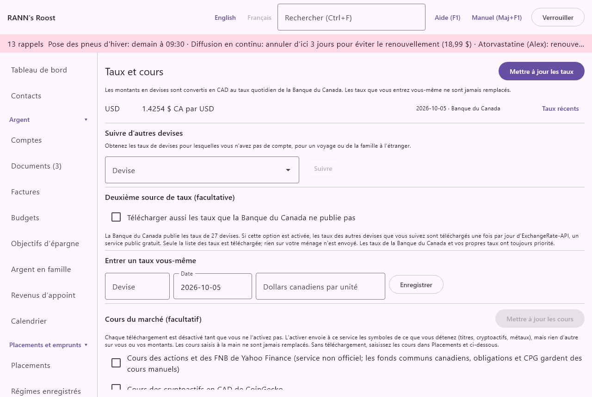

# Taux et cours

Taux et cours contient les taux de change qui convertissent les autres devises en dollars canadiens, et les cours du marché facultatifs des actions, des cryptoactifs et des métaux précieux. L'écran se trouve dans le groupe **Réglages** du menu, sous **Taux et cours**.

> Remarque : Les taux d'imposition, plafonds de régimes, seuils et autres chiffres fixés par les gouvernements ne sont pas ici : ils sont à l'écran suivant, [Taux et règles](rates-rules), avec leurs dates et leurs provinces.

## Pourquoi les taux comptent {#why-rates}

@index: taux de change; devise étrangère; conversion de devises; dollars américains; USD; devise de base; change

Chaque compte garde sa propre devise : un compte en dollars américains contient des dollars américains. Chaque fois que l'application additionne des montants, comme la valeur nette, les budgets, les rapports et la trousse fiscale, elle les convertit dans la devise de base du ménage (le dollar canadien dans la plupart des ménages) au taux du jour.

- Le taux utilisé est celui de la date de l'opération ou, les fins de semaine et jours fériés où il n'y en a pas, le dernier taux avant cette date. S'il n'existe aucun taux antérieur, le premier taux après est utilisé.
- Quand aucun taux n'existe pour une devise, les montants dans cette devise sont exclus des totaux et des rapports, qui le disent : « Aucun taux de change pour » la devise, « ces montants sont exclus. » Le tableau de bord renvoie aussi à cet écran.
- Les cours des cryptoactifs sont gardés comme un taux de change en dollars canadiens, de sorte que les portefeuilles sont convertis comme une devise étrangère.

Si tous vos comptes sont dans la devise de base, aucun taux n'est nécessaire et l'écran indique « Tous les comptes sont dans la devise de base ; aucun taux n'est nécessaire. »

## D'où viennent les taux {#sources}

@index: Banque du Canada; taux de change quotidien; ExchangeRate-API; taux manuel

- Banque du Canada : les taux moyens quotidiens que la Banque du Canada publie pour 27 devises (le dollar américain, l'euro, la livre, le yen, le peso et d'autres). Ils sont téléchargés automatiquement.
- ExchangeRate-API : une deuxième source facultative, pour les devises que la Banque du Canada ne publie pas. Désactivée tant que vous ne l'activez pas. Voir [Deuxième source de taux](rates#second-source).
- Entré à la main : les taux que vous tapez vous-même. Ils ne sont jamais remplacés par un téléchargement.
- Cours du marché (CoinGecko) : les cours des cryptoactifs, quand ce téléchargement est activé. Voir [Cours du marché](rates#market-prices).

À l'ouverture du ménage, l'application télécharge en arrière-plan les taux manquants de la Banque du Canada, puis les cours du marché que vous avez activés. Sans connexion Internet, rien ne se passe et l'application fonctionne avec les taux qu'elle a. Seule la liste des taux est téléchargée ; rien sur votre ménage n'est envoyé.

## Les taux utilisés {#rates-list}

En haut de l'écran :

- **Mettre à jour les taux** : télécharge maintenant les taux manquants, de la Banque du Canada et, si elle est activée, de la deuxième source. Le résultat s'affiche en dessous : « Les taux sont à jour. », le nombre de taux ajoutés, ou « Les taux n'ont pas pu être téléchargés : » avec la raison.
- Une note : les montants en devises sont convertis dans la devise de base au taux quotidien de la Banque du Canada, et les taux que vous entrez vous-même ne sont jamais remplacés.

Puis une ligne par devise dont le ménage a besoin : les devises des comptes et des placements, et les devises que vous suivez. Chaque ligne montre :

- Le code de la devise, comme USD.
- Le dernier taux des 30 derniers jours, en dollars canadiens par unité, comme « 1,3642 $ CA par USD ». Les taux sont affichés avec six chiffres significatifs ; la valeur complète est gardée pour les conversions.
- S'il n'y en a pas : « Aucun taux pour l'instant », ou, pour une devise que la Banque du Canada ne publie pas pendant que la deuxième source est désactivée, « Non publié par la Banque du Canada : activez la deuxième source ci-dessous ou entrez un taux vous-même. »
- La date de ce taux et sa provenance : Banque du Canada, ExchangeRate-API, Entré à la main ou Cours du marché (CoinGecko).
- **Ne plus suivre** : affiché pour une devise que vous suivez. Voir [Suivre d'autres devises](rates#follow).
- **Taux récents** : ouvre la liste des taux de la devise au bas de l'écran. Voir [Taux récents](rates#recent-rates).

La première fois qu'une devise est nécessaire, les taux sont téléchargés jusqu'à la date d'ouverture du plus ancien compte, mais sans remonter plus de cinq ans. Par la suite, seuls les jours manquants sont téléchargés.

## Suivre d'autres devises {#follow}

@index: devise de voyage; famille à l'étranger

Vous pouvez suivre une devise qu'aucun compte n'utilise, pour un voyage ou pour de la famille à l'étranger, afin que son taux reste à jour.

- **Devise** : toutes les devises du monde sauf le dollar canadien et celles déjà listées, affichées avec leur code et leur nom, comme « EUR · euro ». Tapez pour filtrer.
- **Suivre** : ajoute la devise à la liste au-dessus. Ses taux sont téléchargés avec les autres à partir de ce moment.

Pour arrêter, cliquez sur **Ne plus suivre** sur sa ligne. Les taux déjà téléchargés restent. Une devise utilisée par un compte ne peut pas être retirée de cette façon : elle reste tant que le compte existe.

## Deuxième source de taux (facultative) {#second-source}

- **Télécharger aussi les taux que la Banque du Canada ne publie pas** : désactivé par défaut. Une fois activé, les taux des autres devises dont le ménage a besoin ou qu'il suit sont téléchargés une fois par jour d'ExchangeRate-API, un service public gratuit, avec la mention « Rates By Exchange Rate API ». Les taux de la Banque du Canada et vos propres taux ont toujours priorité ; la deuxième source ne fait que combler les trous.

En dessous, l'écran liste les devises que la Banque du Canada ne publie pas, si le ménage en a.

## Entrer un taux vous-même {#manual-rate}

@index: taux de change manuel; remplacer un taux; taux de la banque

Entrez un taux quand une devise n'a pas de téléchargement, ou quand vous voulez que la conversion d'une journée corresponde à ce que votre banque a vraiment facturé.

- **Devise** : le code à trois lettres, comme USD ou ISK. Les lettres sont mises en majuscules. Un code inconnu est refusé (« Code de devise inconnu. »).
- **Date** : le jour auquel le taux s'applique, au format AAAA-MM-JJ. Aujourd'hui par défaut. Le taux sert aussi pour les jours suivants, jusqu'à ce qu'un taux plus récent existe.
- **Dollars canadiens par unité** : combien de dollars canadiens vaut une unité de la devise, comme 1,3642 pour un dollar américain. Doit être plus grand que zéro.
- **Enregistrer** : enregistre le taux, en remplaçant un taux téléchargé de la même devise et du même jour. Le champ se vide une fois le taux enregistré.

Un taux entré à la main n'est jamais remplacé par un téléchargement. Il est inscrit dans le journal d'activité comme « Taux saisi ». Pour le retirer, utilisez **Supprimer** dans [Taux récents](rates#recent-rates).

> Conseil : Pour entrer à la main le cours d'un cryptoactif, entrez-le ici avec le code du cryptoactif, comme BTC, en dollars canadiens par unité.

## Cours du marché (facultatif) {#market-prices}

@index: cours des actions; cours des FNB; cotes; Yahoo Finance; CoinGecko; cours des cryptoactifs; cours de l'or; cours de l'argent; cours au comptant

Les cours du marché évaluent vos placements, vos cryptoactifs et vos métaux précieux sans que vous tapiez chaque cours. Chaque téléchargement est désactivé tant que vous ne l'activez pas. L'activer envoie à ce service les symboles de ce que vous détenez (titres, cryptoactifs, métaux), mais rien d'autre sur vous ou vos montants. Les cours saisis à la main ne sont jamais remplacés.

- **Mettre à jour les cours** : télécharge les cours de chaque source activée. Grisé tant qu'aucune n'est activée. Le résultat s'affiche en dessous : le nombre de cours enregistrés, et ce qui est « Non disponibles » avec la raison.
- **Cours des actions et des FNB de Yahoo Finance** : les cours de clôture quotidiens des actions et des FNB de vos comptes de placement. Yahoo Finance est un service non officiel. Les fonds communs canadiens, les obligations, les CPG et les options n'y sont pas cotés et gardent les cours que vous entrez sous [Placements](investments). Les titres inscrits à Toronto sont cherchés avec leur suffixe habituel (.TO pour la TSX, .V pour la Bourse de croissance TSX, .NE pour Cboe Canada, .CN pour la CSE) ; un cours coté dans une autre devise que celle du titre est refusé. Le premier téléchargement va chercher un an de cours, les suivants le dernier mois.
- **Cours des cryptoactifs en CAD de CoinGecko** : les cours quotidiens en dollars canadiens des cryptoactifs détenus dans vos portefeuilles, jusqu'à un an en arrière.
- **Cours de l'or, de l'argent, du platine et du palladium de Yahoo Finance** : les cours quotidiens des contrats à terme du mois rapproché, en dollars américains, convertis en dollars canadiens au taux de la Banque du Canada de chaque jour.

Sous les sources : la mention des services et « Dernière mise à jour : » avec la date du dernier téléchargement qui a enregistré un cours.

Quand une source est activée, ses cours sont aussi téléchargés chaque fois que le ménage est ouvert.

### Cryptoactifs détenus {#coins}

Affiché quand un portefeuille détient un cryptoactif. Une ligne par cryptoactif :

- Le code du cryptoactif, son dernier cours en dollars canadiens avec sa date et sa provenance, ou « Aucun taux pour l'instant ».
- **Nom CoinGecko** : le nom que CoinGecko donne au cryptoactif, celui qui figure dans l'adresse de sa page sur coingecko.com, comme bitcoin ou ethereum. Les cryptoactifs courants sont déjà remplis ; entrez-le pour les autres, ou pour en corriger un.
- **Enregistrer** : garde le nom CoinGecko. Il est enregistré en minuscules.

Un cryptoactif sans nom CoinGecko est indiqué comme non disponible lors du téléchargement des cours.

### Cours au comptant des métaux précieux {#metals}

Une ligne par métal (Or, Argent, Platine, Palladium) avec son dernier cours par once troy en dollars canadiens, sa date, et s'il s'agit d'un cours du marché ou d'un cours entré à la main, ou « Aucun taux pour l'instant ».

Pour entrer un cours vous-même :

- **Métal** : Or, Argent, Platine ou Palladium.
- **Date** : le jour du cours, au format AAAA-MM-JJ. Aujourd'hui par défaut.
- **CAD l'once troy** : le cours d'une once troy de métal pur, en dollars canadiens. Doit être plus grand que zéro.
- **Enregistrer** : enregistre le cours. Les téléchargements ne le remplacent jamais.

Les cours sont pour une once troy (31,1035 g) de métal pur. Les pièces et lingots de l'écran [Placements](investments) sont évalués à partir de ceux-ci avec leur poids, leur pureté et leur prime ; sans cours au comptant, ils comptent à leur coût.

## Taux récents {#recent-rates}

Cliquez sur **Taux récents** sur la ligne d'une devise. Le bas de l'écran montre « Taux récents pour » la devise : chaque taux des 60 derniers jours, les plus récents en premier, avec sa date, sa valeur et sa provenance.

- **Supprimer** : affiché seulement pour les taux entrés à la main. Retire tout de suite le taux de ce jour. Les taux téléchargés ne peuvent pas être supprimés.

## Qui peut changer les taux et les cours {#permissions}

- Les administrateurs : tout cet écran, y compris activer la deuxième source de taux et chaque téléchargement de cours, puisque ceux-ci envoient des demandes à des services externes.
- Les membres : suivre des devises, entrer et supprimer des taux, fixer les noms des cryptoactifs et entrer les prix des métaux. Les interrupteurs de téléchargement sont grisés.
- Les lecteurs : voir les taux et les cours ; tout le reste est grisé.
- Tout le monde : **Mettre à jour les taux** et **Mettre à jour les cours**, qui téléchargent seulement ce qui est déjà activé.

## Confidentialité {#privacy}

La Banque du Canada et ExchangeRate-API ne reçoivent qu'une demande pour la liste des taux. Les services de cours reçoivent les symboles de ce que vous détenez, seulement pour les sources que vous avez activées. Voir [Confidentialité et vos données](privacy-data).
