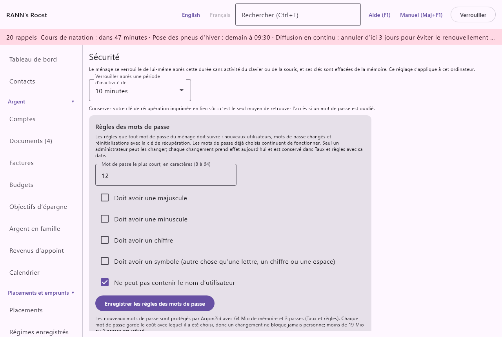

# Sécurité

Votre ménage est gardé chiffré sur cet ordinateur et ne s’ouvre qu’avec le mot de passe ou la clé de récupération d’un utilisateur. Ce chapitre couvre l’écran **Sécurité** (le délai de verrouillage automatique et les règles des mots de passe du ménage), le verrouillage, les mots de passe et la clé de récupération. L’écran se trouve dans le groupe **Réglages** du menu, sous **Sécurité**.

## Comment votre ménage est protégé {#protection}

@index: chiffrement; chiffré; mot de passe principal; protection des données; modèle de sécurité

- Tout est chiffré sur le disque : comptes, opérations, documents, réglages. Une copie du dossier du ménage, ou d’une sauvegarde, est illisible sans le mot de passe ou la clé de récupération d’un utilisateur.
- Chaque utilisateur a son propre mot de passe. Chaque groupe de comptes a sa propre clé, que seuls les utilisateurs qui y ont accès détiennent. Voir [Utilisateurs](users).
- Il n’y a ni compte RANN ni serveur. Personne, pas même RANN, ne peut réinitialiser un mot de passe oublié. La clé de récupération est le moyen de revenir.
- Pendant que le ménage est ouvert, ses clés sont dans la mémoire de l’ordinateur. Le verrouillage ferme le ménage et les efface de la mémoire.

## L’écran Sécurité {#screen}

L’écran a un réglage propre à cet ordinateur, un rappel et les [règles des mots de passe](security#password-rules) du ménage.

### Verrouiller après une période d’inactivité {#auto-lock}

@index: verrouillage automatique; verrou automatique; inactivité; délai; veille; verrouillage d’écran

- **Verrouiller après une période d’inactivité de** : 1 minute, 5, 10, 15, 30 ou 60 minutes, ou Jamais. La valeur par défaut est 10 minutes. Après cette durée sans activité du clavier ou de la souris dans la fenêtre de l’application, le ménage se verrouille de lui-même et ses clés sont effacées de la mémoire. S’applique dès que vous choisissez.

Ce qui se passe au verrouillage :

- L’écran de déverrouillage apparaît, avec le dossier du ménage. Reconnectez-vous avec votre nom d’utilisateur et votre mot de passe pour continuer.
- Ce qui n’était pas encore enregistré dans un formulaire ou une fenêtre ouverte est perdu.
- Les téléphones ne peuvent plus envoyer de saisies tant que le ménage n’est pas déverrouillé de nouveau. Voir [Téléphones](phones).
- Les sauvegardes prévues et les autres tâches de fond attendent que le ménage soit ouvert de nouveau.

Le délai est vérifié environ toutes les 15 secondes, de sorte que le verrouillage peut venir quelques secondes après le délai. Avec Jamais, le ménage reste ouvert jusqu’à ce que vous le verrouilliez ou fermiez l’application.

Ce réglage s’applique à cet ordinateur, pour chaque ménage ouvert sur celui-ci et chaque utilisateur. Il n’est pas gardé dans le ménage ni dans ses sauvegardes.

> Conseil : Sur un ordinateur que d’autres peuvent utiliser, choisissez un délai court, comme 5 minutes. Sur votre propre ordinateur dans une pièce fermée à clé, un délai plus long est plus confortable.

### Le rappel de récupération {#recovery-reminder}

Sous le réglage, un rappel : conservez votre clé de récupération imprimée en lieu sûr ; c’est le seul moyen de retrouver l’accès si un mot de passe est oublié. Voir [La clé de récupération](security#recovery-key).

## Verrouiller maintenant {#lock-now}

@index: verrouiller; se déconnecter; déconnexion; s’absenter

- **Verrouiller** : en haut à droite de la fenêtre, affiché pendant qu’un ménage est ouvert. Verrouille le ménage immédiatement, comme le ferait le verrouillage automatique.

Fermer la fenêtre verrouille aussi le ménage avant que l’application quitte.

## Déverrouiller le ménage {#unlock}

L’écran de déverrouillage (« Déverrouiller le ménage ») apparaît quand vous ouvrez un ménage à partir de l’écran de départ, après un verrouillage et après une restauration.

- **Nom d’utilisateur** : votre nom d’utilisateur, tel qu’il a été fixé quand votre utilisateur a été ajouté. Les majuscules n’importent pas.
- **Mot de passe** : votre mot de passe. Le texte est masqué.
- **Déverrouiller** : ouvre le ménage. Disponible une fois les deux champs remplis. Un nom d’utilisateur ou un mot de passe erroné donne « Nom d’utilisateur ou mot de passe incorrect. » et rien d’autre, de sorte que personne ne peut savoir lequel était erroné.
- **Retour** : revient à l’écran de départ.
- **Mot de passe oublié?** : ouvre la réinitialisation avec la clé de récupération. Voir [Mot de passe oublié](security#forgot-password).

Un utilisateur qu’on a empêché de se connecter à l’écran [Utilisateurs](users) ne peut pas déverrouiller le ménage, même avec le bon mot de passe.

## Mots de passe {#passwords}

@index: longueur du mot de passe; phrase de passe; mot de passe fort

- Le premier administrateur choisit le mot de passe principal à la création du ménage, tapé deux fois (**Mot de passe principal**, **Confirmer le mot de passe principal**). Aucun ménage n’existe encore, donc les règles intégrées s’appliquent : au moins 12 caractères, sans le nom d’utilisateur.
- Les utilisateurs ajoutés plus tard reçoivent un mot de passe choisi au moment de l’ajout, et chacun peut changer le sien. Les deux suivent les règles des mots de passe du ménage.
- Un nouveau mot de passe fixé avec la clé de récupération suit lui aussi les règles du ménage. Elles sont vérifiées une fois que la clé de récupération a ouvert le ménage, avant que rien ne change.

Sous chaque champ de mot de passe, une ligne dit ce que les règles demandent, comme « Au moins 12 caractères. Il ne peut pas contenir le nom d’utilisateur. » Voir [Règles des mots de passe](security#password-rules).

Une phrase de passe de quelques mots sans lien entre eux, comme « érable canot jeudi lanterne », est facile à retenir et difficile à deviner. Ne réutilisez pas le mot de passe d’un site Web.

Pour changer votre mot de passe, utilisez **Changer mon mot de passe…** à l’écran [Utilisateurs](users). Voir [Changer mon mot de passe](users#change-password). Votre clé de récupération reste la même.

## Règles des mots de passe {#password-rules}

@index: règles des mots de passe; politique de mots de passe; exigences des mots de passe; Argon2id; dérivation de clé

Les règles des mots de passe du ménage disent ce que tout mot de passe choisi à partir de maintenant doit avoir. Elles sont à l’écran **Sécurité**, dans la carte **Règles des mots de passe**. Un administrateur les fixe pour tout le ménage ; les autres utilisateurs les voient sans pouvoir les changer (« Seul un administrateur peut changer ces règles. »).

- **Mot de passe le plus court, en caractères (8 à 64)** : le nombre minimum de caractères d’un mot de passe. Par défaut, 12. Moins de 8 ou plus de 64 est refusé.
- **Doit avoir une majuscule** : tout nouveau mot de passe doit avoir au moins une majuscule, accentuée ou non. Désactivé par défaut.
- **Doit avoir une minuscule** : au moins une minuscule. Désactivé par défaut.
- **Doit avoir un chiffre** : au moins un chiffre. Désactivé par défaut.
- **Doit avoir un symbole (autre chose qu’une lettre, un chiffre ou une espace)** : au moins un symbole, comme ! ou #. Désactivé par défaut.
- **Ne peut pas contenir le nom d’utilisateur** : le mot de passe ne peut pas contenir le nom d’utilisateur, en majuscules ou non. Activé par défaut. Les noms d’utilisateur d’un ou deux caractères ne sont pas cherchés.
- **Enregistrer les règles des mots de passe** : garde les règles. Seul ce qui a changé est enregistré, et prend effet aujourd’hui. Une ligne le confirme : « Règles des mots de passe enregistrées. Elles s’appliquent dès aujourd’hui à tout mot de passe choisi à partir de maintenant. »

Les règles s’appliquent partout où l’on choisit un mot de passe : ajout d’un utilisateur, changement de mot de passe et réinitialisation avec la clé de récupération. Un mot de passe qui ne les respecte pas est refusé avec ce qui lui manque, comme « Le mot de passe doit avoir un chiffre. » Les mots de passe déjà choisis continuent de fonctionner, même s’ils ne respectent pas les nouvelles règles ; demandez aux utilisateurs de changer le leur si vous le souhaitez.

Chaque changement est conservé dans [Taux et règles](rates-rules) avec sa date d’effet, comme toute autre règle : on y voit les règles en vigueur à n’importe quelle date.

### Comment les mots de passe sont protégés {#password-cost}

@index: Argon2id; hachage des mots de passe; coût de dérivation de clé

Un mot de passe n’est jamais conservé. Il est transformé en clé avec Argon2id, une méthode conçue pour rendre les essais lents. La dernière ligne de la carte donne son coût pour les nouveaux mots de passe : la mémoire, 64 Mio par défaut, et le nombre de passes, 3 par défaut. Les deux sont des valeurs de [Taux et règles](rates-rules) (Mémoire de protection des mots de passe, Passes de protection des mots de passe). Un coût plus élevé rend chaque essai plus lent, et le déverrouillage un peu plus lent aussi.

Chaque mot de passe garde le coût avec lequel il a été choisi, donc un changement ne bloque jamais personne : il s’applique aux mots de passe choisis par la suite. Moins de 19 Mio ou 2 passes est refusé, le minimum recommandé pour Argon2id.

## La clé de récupération {#recovery-key}

@index: clé de récupération; code de récupération; mot de passe perdu; mot de passe oublié; accès d’urgence

Chaque utilisateur a une clé de récupération : un long code en groupes de quatre lettres et chiffres séparés par des tirets. Elle n’est montrée qu’une fois :

- Au premier administrateur, tout de suite après la création du ménage, à l’écran « Votre clé de récupération ».
- Pour chaque utilisateur ajouté plus tard, dans la fenêtre « Clé de récupération de », à remettre à cette personne. Voir [La clé de récupération du nouvel utilisateur](users#new-recovery-key).

À l’écran « Votre clé de récupération » :

- **Imprimer** : imprime la clé par la fenêtre d’impression du système, sans l’enregistrer dans un fichier.
- **Copier** : copie la clé, pour la coller dans un gestionnaire de mots de passe.
- **J’ai conservé ma clé de récupération** : ouvre le ménage. Ne cliquez qu’une fois la clé imprimée ou notée.

Comment la garder :

- Imprimez-la ou notez-la, et gardez le papier en lieu sûr loin de cet ordinateur, par exemple avec vos papiers importants ou dans un coffre.
- Ne la gardez pas seulement dans un fichier sur le même ordinateur : si l’ordinateur est perdu, la clé est perdue avec lui.
- Quiconque a votre nom d’utilisateur et votre clé de récupération peut ouvrir le ménage à votre place. Protégez-la comme la clé du ménage lui-même.

La clé de récupération ne change jamais : changer votre mot de passe, ou le réinitialiser avec la clé, garde la même clé de récupération. Elle ouvre aussi les sauvegardes du ménage.

## Mot de passe oublié {#forgot-password}

@index: réinitialiser le mot de passe; mot de passe oublié; accès bloqué

1. À l’écran de déverrouillage, cliquez sur **Mot de passe oublié?**.
2. À l’écran « Réinitialiser le mot de passe avec la clé de récupération », tapez votre **Nom d’utilisateur**.
3. Tapez la **Clé de récupération**. Les majuscules, les espaces et les tirets n’importent pas, et les lettres I, L et O sont lues comme les chiffres 1 et 0. Une faute de frappe est repérée tout de suite : « Cette clé de récupération n’est pas valide. »
4. Tapez un **Nouveau mot de passe** qui suit les [règles des mots de passe](security#password-rules) du ménage (au moins 12 caractères par défaut), puis de nouveau dans **Confirmer le mot de passe principal**.
5. Cliquez sur **Réinitialiser le mot de passe**. Le ménage s’ouvre avec le nouveau mot de passe. Un mot de passe qui ne respecte pas les règles est refusé avec ce qui lui manque, et l’ancien mot de passe reste en place.

**Retour** revient à l’écran de déverrouillage sans rien changer.

La réinitialisation est inscrite dans le journal d’activité comme « Mot de passe réinitialisé avec la clé de récupération ». La clé de récupération reste la même.

> Important : Si votre mot de passe et votre clé de récupération sont tous deux perdus, votre utilisateur ne peut plus être ouvert. Un autre administrateur peut encore se connecter et ajouter un nouvel utilisateur pour vous, mais ce que seul votre utilisateur pouvait ouvrir, comme votre groupe de comptes privé, reste fermé.

## Réglages connexes {#related}

- [Utilisateurs](users) : qui peut se connecter, les rôles et l’accès aux groupes de comptes.
- [Sauvegardes](backups) : des copies chiffrées du ménage.
- [Téléphones](phones) : retirer un téléphone perdu ou qui ne sert plus.
- [Lecture par IA](ai) : votre clé Anthropic, gardée dans le magasin de secrets de l’ordinateur.
