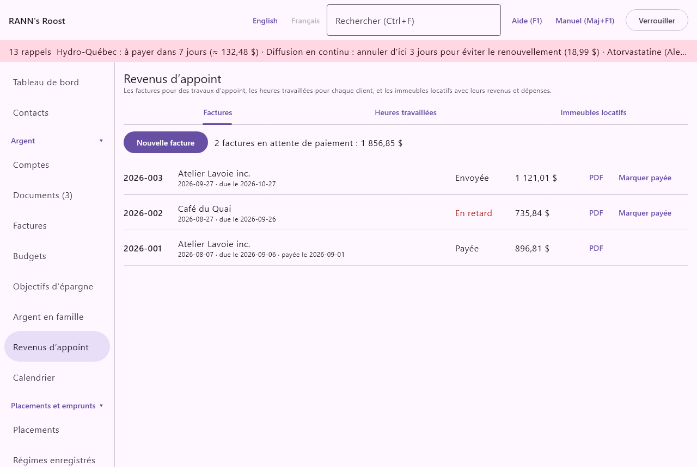
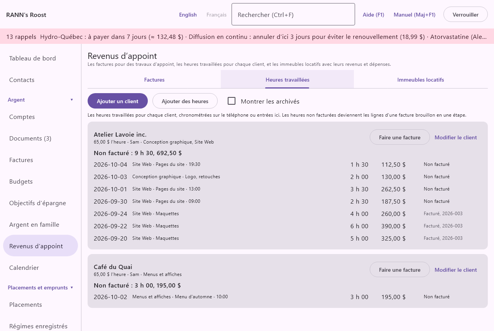

# Revenus d’appoint

Les revenus d’appoint sont l’argent que le ménage gagne en dehors d’un emploi régulier : du tutorat, des cours de musique, de l’artisanat vendu au marché, de petits contrats, ou un logement que vous louez. L’écran se trouve dans le groupe **Argent** du menu, sous **Revenus d’appoint**.

@index: travail autonome; pigiste; petite entreprise; revenu supplémentaire; travail à la demande

## L’écran Revenus d’appoint {#screen}

L’écran présente une courte explication en haut et trois onglets :

- **Factures** : les factures que vous envoyez à vos clients, enregistrées en PDF, et si elles sont payées.
- **Heures travaillées** : les heures travaillées pour chaque client, et les heures non facturées transformées en facture (voyez [Heures travaillées](#hours)).
- **Immeubles locatifs** : chaque immeuble que vous louez, avec ses revenus, ses dépenses et son net pour une année, tirés de vos opérations.

L’écran s’ouvre sur **Factures**.

### Où les données sont gardées {#where-kept}

Les nouvelles factures et les nouveaux immeubles sont enregistrés dans le groupe de comptes partagé où vous pouvez ajouter des données (ou, s’il n’y en a pas, le premier groupe où vous le pouvez), et les listes montrent ceux de tous les groupes que vous voyez. Enregistrer, modifier ou supprimer demande la permission de modifier les données de ce groupe ; un utilisateur en lecture seule voit les onglets mais reçoit une erreur en enregistrant. Voir [Utilisateurs](users).

> Remarque : RANN’s Roost ne prépare pas de formulaire T2125 (revenus d’entreprise) ni T776 (revenus de location) et ne donne pas de conseils fiscaux. Les totaux vous aident, vous ou la personne qui prépare votre déclaration, à les remplir.

## Factures {#invoices}

@index: facture; facturer un client; comptes clients; inscrit à la TPS/TVH; TVQ; TVP; facture en retard

Une facture est une demande de paiement que vous envoyez à un client. RANN’s Roost la numérote, ajoute les taxes de vente si vous les percevez, en fait un PDF à envoyer par courriel ou à imprimer et, quand le client paie, peut inscrire le dépôt dans votre compte bancaire comme revenu de travail autonome.

### La liste des factures {#invoice-list}

En haut :

- **Nouvelle facture** : ouvre la [boîte de la facture](#invoice-dialog) avec le prochain numéro de l’année déjà rempli.
- Quand des factures attendent leur paiement, une ligne comme « 2 factures en attente de paiement : 1 250,00 $ ». Elle compte les factures à l’état **Envoyée** et donne un total par devise, la devise de base en premier, par exemple « 3 factures en attente de paiement : 1 250,00 $ + 400,00 $ US ».

Chaque facture est listée, de la plus récente à la plus ancienne, avec :

- son numéro ;
- le client, et dessous la date d’émission, « due le » et la date d’échéance s’il y en a une, et « payée le » et la date du paiement ;
- son état : **Brouillon**, **Envoyée**, **Payée** ou **Annulée**, ou **En retard** en rouge quand elle est **Envoyée** et que sa date d’échéance est passée ;
- son total, taxes comprises ;
- **PDF** : enregistre la facture en PDF (voir [Le PDF de la facture](#invoice-pdf)) ;
- **Marquer payée** : affiché pour une facture **Brouillon** ou **Envoyée** ; ouvre la [boîte Marquer payée](#mark-paid).

Cliquez ailleurs sur la ligne d’une facture pour l’ouvrir dans la boîte de la facture.

### Boîte Nouvelle facture {#invoice-dialog}

La même boîte crée une facture (**Nouvelle facture**) ou la modifie (**Modifier la facture**).

- **Numéro** : le numéro de la facture. Une nouvelle facture reçoit l’année et le numéro suivant, par exemple 2026-001, puis 2026-002 : le plus grand numéro déjà utilisé sous cette forme pour l’année, plus un. Vous pouvez saisir un autre numéro, mais chaque numéro ne peut servir qu’une fois.
- **Client** : à qui s’adresse la facture, une personne ou une entreprise. Obligatoire. Il est imprimé sous **Facturer à** dans le PDF et devient le bénéficiaire du dépôt.
- **Adresse et coordonnées du client** : l’adresse du client et tout ce qui doit être imprimé sous son nom, comme un courriel ou un numéro de bon de commande. Plusieurs lignes sont permises ; chacune est imprimée sur sa propre ligne.
- **Émise le** : la date de la facture, au format AAAA-MM-JJ. Aujourd’hui par défaut. Pour une nouvelle facture, le numéro suit l’année de cette date : mettez un jour de l’an dernier, et le numéro proposé devient le suivant de l’an dernier (par exemple 2025-014). Un numéro que vous avez tapé vous-même est laissé tel quel.
- **Due le** : la date d’échéance du paiement, facultative. Elle ne peut pas précéder **Émise le**. Une facture **Envoyée** dont cette date est passée affiche **En retard** dans la liste.
- **État** :
  - **Brouillon** : en préparation ; pas comptée parmi les factures en attente de paiement.
  - **Envoyée** : envoyée au client ; comptée dans la ligne des factures en attente et peut devenir **En retard**.
  - **Payée** : le client a payé. Habituellement réglé avec **Marquer payée**, qui inscrit aussi la date et peut inscrire le dépôt.
  - **Annulée** : gardée pour vos dossiers, mais plus attendue.
- **De** : de qui vient la facture : un membre du ménage, ou **Ménage**. Le PDF imprime en haut le nom du membre, ou le nom du ménage pour **Ménage**. Le dépôt inscrit avec **Marquer payée** est aussi attribué à ce membre.
- **Lignes** : ce que vous facturez, une ligne par élément :
  - **Pour quoi** : la description, par exemple « Tutorat en mathématiques, 4 séances ». Une ligne sans description est retirée à l’enregistrement.
  - **Quantité** : un nombre comme 1, 4 ou 2,5 (le point fonctionne aussi). 1 par défaut.
  - **Prix** : le prix d’une unité, par exemple 45,00. Les symboles monétaires et les espaces sont ignorés.
  - **✕** : retire la ligne. La dernière ligne ne peut pas être retirée.
  Le montant de chaque ligne est la quantité fois le prix, arrondi au cent ; le sous-total est la somme des lignes. Chaque ligne gardée demande une description, une quantité et un prix.
- **Ajouter une ligne** : ajoute une ligne vide avec une quantité de 1.
- **Taxe de vente** : la taxe fédérale que vous facturez, **TPS** ou **TVH**.
- **Taux (%)**, à côté : le taux de cette taxe en pour cent, par exemple 5 pour la TPS ou 13 pour la TVH en Ontario. Laissez vide si vous ne la facturez pas.
- **Taxe provinciale** : la taxe de vente provinciale que vous facturez : **TVQ** au Québec, **TVP** en Colombie-Britannique et en Saskatchewan, **TVD** (taxe de vente au détail) au Manitoba. Elle part de la taxe de la province de la personne choisie dans **De**.
- **Taux (%)**, à côté : le taux de cette taxe en pour cent, par exemple 9,975 pour la TVQ, 7 pour la TVP en Colombie-Britannique ou la TVD au Manitoba. Laissez vide si vous ne la facturez pas. Les taux sont gardés exactement comme vous les tapez, décimales comprises : 9,975 reste 9,975.
- La ligne sous les taxes affiche les taux en vigueur à la date **Émise le** dans la province de la personne choisie dans **De** (sa propre province, ou celle du ménage si elle n’en a pas ou si **Ménage** est choisi), par exemple « Québec, en vigueur le 2026-10-05 : TPS 5 %, TVQ 9,975 % ». Ces taux viennent de [Taux et règles](rates-rules), où chaque taux a sa date d’entrée en vigueur, de sorte qu’une facture datée d’avant un changement reçoit le taux de son jour (par exemple 15 % de TVH en Nouvelle-Écosse jusqu’au 31 mars 2025, et 14 % à partir du 1er avril 2025).
- **Prendre les taux en vigueur** : remplit les deux taxes et leurs taux avec ceux affichés. Ensuite, changer **Émise le** ou **De** les remplit de nouveau, jusqu’à ce que vous tapiez un taux vous-même. Vous pouvez toujours changer les taux avant d’enregistrer.

Une nouvelle facture part des taux en vigueur quand la dernière facture de la même personne facturait des taxes de vente ; sinon, les taux sont vides au départ. Laissez les deux taux vides sauf si vous êtes inscrit pour percevoir les taxes de vente. Chaque taxe est le taux appliqué au sous-total, arrondi au cent, et le total est le sous-total plus les taxes. Pour une facture datée au Québec avant 2013, la TVQ se calcule sur le sous-total plus la TPS, comme à l’époque.

- **Notes sur la facture** : imprimées au bas du PDF, comme les modalités de paiement (« Virement Interac à … ») ou un remerciement.
- **Supprimer** : affiché en modification. Demande d’abord « Supprimer la facture numéro à client? ». Quand le dépôt inscrit avec **Marquer payée** est encore dans les livres, la question offre aussi **Supprimer aussi son dépôt de montant du date dans compte**, décoché par défaut : laissez-le décoché si l’argent a bien été reçu, et le dépôt reste dans le compte ; cochez-le pour retirer aussi le dépôt, par exemple quand la facture a été marquée payée par erreur. Un dépôt rapproché n’est supprimé qu’après une nouvelle confirmation. Une fois confirmée, la suppression est sans retour.
- **Enregistrer** enregistre la facture ; **Annuler** ferme sans enregistrer.

La devise de la facture est la devise de base du ménage au moment de sa création.

@index: numéro de facture; petit fournisseur; taxes de vente sur les factures

> Conseil : Au Canada, vous n’êtes généralement pas tenu de vous inscrire à la TPS/TVH tant que vous êtes un petit fournisseur (ventes taxables de 30 000 $ ou moins sur quatre trimestres civils). Vérifiez les règles de l’ARC, et celles de Revenu Québec pour la TVQ.

### Le PDF de la facture {#invoice-pdf}

**PDF**, sur la ligne d’une facture, demande où enregistrer le fichier en proposant un nom comme « Facture 2026-001.pdf » (« .pdf » est ajouté si vous l’omettez), l’écrit, puis l’ouvre avec votre lecteur PDF. Rien n’est enregistré si vous annulez.

Le PDF est une page au format lettre, dans la langue que vous utilisez dans RANN’s Roost, avec :

- « Facture » et son numéro en titre, puis le nom choisi dans **De** ;
- **Facturer à**, le client et ses coordonnées ;
- la date d’émission et, s’il y en a une, la date d’échéance ;
- un tableau des lignes : description, quantité, prix et montant ;
- le sous-total, une ligne par taxe de vente avec son taux et son montant (par exemple « TPS (5 %) »), et le total ;
- les notes sur la facture.

Refaites le PDF après tout changement ; il n’est pas gardé dans RANN’s Roost.

### Boîte Marquer payée {#mark-paid}

**Marquer payée** ouvre une petite boîte qui affiche le numéro, le client et le total de la facture.

- **Payée le** : le jour où le paiement a été reçu, au format AAAA-MM-JJ. Aujourd’hui par défaut.
- **Inscrire le dépôt** : affiché quand vous avez au moins un compte bancaire dans la devise de la facture ; coché par défaut. Coché, l’enregistrement inscrit aussi le paiement dans ce compte.
- **Déposée dans** : le compte bancaire où le paiement a été déposé.

L’enregistrement met la facture à **Payée** avec cette date. Avec **Inscrire le dépôt**, il ajoute aussi au compte, à cette date, un dépôt du total de la facture :

- le bénéficiaire est le client ;
- la catégorie est **Revenus de travail autonome**, et le numéro de la facture y est noté ;
- la personne est celle choisie dans **De** ;
- les taxes de vente perçues (TPS, TVH, TVQ ou TVP) sont inscrites sur le dépôt, et ses détails **Taxes de vente…** dans le registre les montrent.

Le dépôt est une opération ordinaire : il change le solde du compte et paraît dans le registre et dans les rapports comme toute autre. Voir [Comptes](accounts). Si vous avez déjà inscrit le paiement vous-même, décochez **Inscrire le dépôt** pour ne pas l’inscrire deux fois.

## Heures travaillées {#hours}

@index: feuille de temps; heures facturables; taux horaire; chronomètre; clients

L’onglet **Heures travaillées** garde les heures travaillées pour chaque client, chronométrées sur le téléphone ou entrées ici, et transforme en une étape les heures pas encore facturées en lignes de facture.

### La liste des clients {#hours-list}

- **Ajouter un client** : ouvre la [boîte du client](#client-dialog).
- **Ajouter des heures** : ouvre la [boîte des heures](#hours-dialog) ; offert dès qu’il y a un client.
- **Montrer les archivés** : montre aussi les clients marqués archivés.

Chaque client est une carte : son nom, son taux horaire, qui fait le travail et ses tâches. **Non facturé** donne les heures pas encore sur une facture et ce qu’elles donnent à leurs taux, ou **Tout est facturé.** Dessous, les dernières heures du client, des plus récentes aux plus anciennes : la date, la tâche, la description, l’heure de début, **du téléphone**, la durée, le montant et **Non facturé** ou **Facturé** avec le numéro de la facture. Cliquez sur une ligne pour la modifier ou la supprimer. **Faire une facture** ouvre [l’étape de facturation](#hours-invoice) ; **Modifier le client** ouvre la boîte du client.

Les heures dont la facture a été supprimée comptent de nouveau comme non facturées.

### Boîte Ajouter un client {#client-dialog}

- **Client** : le nom, tel qu’il doit paraître sur la facture. Obligatoire.
- **Adresse et coordonnées du client** : l’adresse et les autres renseignements imprimés sur la facture.
- **Taux horaire** : dans la devise de base du ménage ; facultatif, mais des heures sans aucun taux ne peuvent être facturées.
- **Qui fait le travail** : le membre du ménage, ou **Ménage**. Il devient la personne qui facture.
- **Tâches** : les genres de travail pour ce client, chacun avec un nom de **Tâche** et, s’il diffère de celui du client, son propre **Taux**. **Ajouter une tâche** ajoute une ligne ; ✕ la retire. Une tâche retirée après que des heures y ont été inscrites est gardée, archivée, pour que ces heures gardent son nom.
- **Notes**, **Enregistrer dans** (pour un nouveau client, si vous pouvez modifier plusieurs groupes de comptes), **Archivé** et **Supprimer**. Supprimer un client supprime ses tâches et ses heures ; les factures déjà faites restent.

### Boîte Ajouter des heures {#hours-dialog}

- **Client** : pour de nouvelles heures.
- **Tâche** : une des tâches du client, ou —.
- **Date**, **Début (HH:MM)** (facultatif) et **Durée (h:mm)** : la durée en heures et minutes (1:30) ou en heures (1,5), de 1 minute à 24 heures.
- **Description** : ce qui a été fait ; elle nomme la ligne de facture quand il n’y a pas de tâche.
- **Taux pour ces heures** : seulement si ces heures ont leur propre taux. Vide : le taux de la tâche, sinon celui du client.
- **Supprimer** : demande d’abord.

Modifier des heures déjà sur une facture ne change pas la facture.

### Faire une facture {#hours-invoice}

**Faire une facture** liste les heures du client pas encore facturées, toutes cochées ; décochez celles à garder pour plus tard. Choisissez la date **Émise le** et cliquez sur **Faire une facture**. RANN's Roost fait une facture brouillon au client, numérotée comme la suivante de l’année, avec une ligne par tâche et par taux : la tâche (ou la description) avec les dates, les heures comme quantité (à deux décimales) et le taux comme prix. Ses taxes de vente suivent la dernière facture de la personne. Les heures y sont marquées facturées. Ouvrez la facture à l’onglet [Factures](#invoices) pour la vérifier, changer ses taxes et l’envoyer.

## Immeubles locatifs {#rentals}

@index: revenus de location; propriétaire; T776; duplex; loyer; dépenses de location; immeuble en copropriété

Cet onglet additionne les revenus et les dépenses de chaque immeuble que vous louez, pour une année civile. Il ne vous demande pas de saisir les montants de nouveau : il se sert des opérations déjà inscrites dans vos comptes, grâce à une étiquette.

Le fonctionnement :

1. Ajoutez l’immeuble ici. Une étiquette portant le nom de l’immeuble est créée.
2. Dans les registres des comptes, mettez cette étiquette sur les loyers reçus et sur les dépenses de l’immeuble (assurance, réparations, impôt foncier, intérêts hypothécaires, services que vous payez).
3. Choisissez l’année ici : la carte de l’immeuble additionne ces opérations par catégorie.

### La liste des immeubles {#rental-list}

- **Année d’imposition** : l’année civile à additionner, de cette année jusqu’à six ans en arrière. De janvier à mars, elle commence à l’année dernière, celle de la déclaration à produire ; à partir d’avril, à cette année.
- **Ajouter un immeuble** : ouvre la [boîte de l’immeuble](#rental-dialog).

Chaque immeuble a sa carte, par ordre de nom, avec :

- son nom, son adresse et « étiquette : » avec le nom de son étiquette ;
- **Modifier** : ouvre la boîte de l’immeuble ;
- **Revenus** : le total des opérations portant son étiquette dans les catégories de revenus, pour l’année ;
- une ligne par catégorie de dépenses, avec le total dépensé, puis **Dépenses** : le total de toutes les catégories de dépenses ;
- **Net** : les revenus moins les dépenses ;
- **La part du ménage (… %)** : affichée quand le ménage possède moins que l’immeuble entier : sa part du net.

Les chiffres suivent vos catégories : une opération ventilée entre plusieurs catégories compte dans chacune. Les opérations sans l’étiquette ne sont pas comptées, même si elles concernent l’immeuble.

### Boîte Ajouter un immeuble {#rental-dialog}

- **Nom** : le nom de l’immeuble, par exemple « Duplex rue Cartier ». Obligatoire. À l’ajout d’un immeuble, une étiquette de ce nom est créée pour ses opérations ; si une étiquette de ce nom existe déjà, c’est elle qui est utilisée. Renommer l’immeuble plus tard renomme aussi son étiquette (« L’étiquette de l’immeuble est renommée avec lui. »), et les opérations étiquetées continuent de compter. Si une autre étiquette porte déjà le nouveau nom, l’application dit « Une autre étiquette s’appelle déjà « nom ». Choisissez un autre nom. » et rien n’est enregistré.
- **Adresse** : l’adresse de l’immeuble, affichée sur sa carte.
- **La part du ménage (%)** : la part de l’immeuble que possède le ménage, de 0,01 à 100. 100 par défaut. Pour un immeuble détenu à moitié avec quelqu’un d’autre, saisissez 50 : la carte montre alors la part du ménage dans le net.
- **Notes** : ce qu’il faut retenir sur l’immeuble.
- **Supprimer** : affiché en modification. Demande « Supprimer nom? Ses opérations sont conservées. » avec une case **Retirer aussi l’étiquette « étiquette » de la liste et des opérations qui l’ont**, décochée par défaut. Décochée, l’étiquette reste sur les opérations et dans la liste des étiquettes. Cochée, l’étiquette est retirée de la liste et de toutes les opérations qui l’avaient, sauf si un autre immeuble utilise la même étiquette ; les opérations elles-mêmes restent. C’est sans retour.

> Conseil : Quand vous possédez un immeuble avec quelqu’un hors du ménage, inscrivez seulement les paiements et les encaissements du ménage dans vos comptes et laissez la part à 100, ou inscrivez les montants de l’immeuble entier et saisissez votre part. Choisissez une façon et tenez-vous-y.
