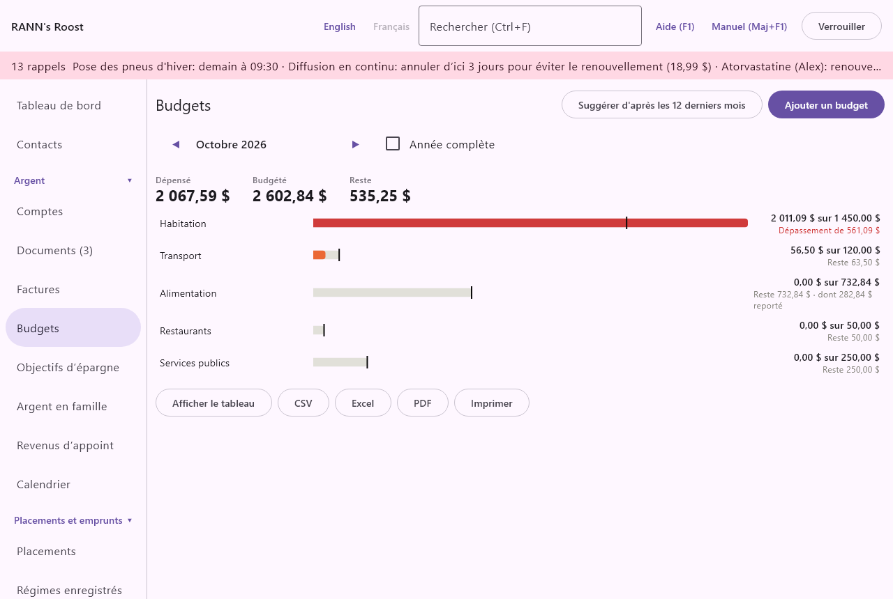

# Premiers pas avec les factures et les budgets

Ce chapitre vous guide dans une première mise en place des factures, des budgets et des objectifs d’épargne, en une demi-heure environ. Chaque étape renvoie à la description complète de l’écran.

## Avant de commencer {#before-you-begin}

- Ajoutez d’abord vos comptes (chèques, épargne, cartes de crédit), avec leur solde actuel. Les factures sont payées à partir d’un compte, et les objectifs sont gardés dans un compte. Voir [Premiers pas avec votre argent](start-money).
- Ayez sous la main un relevé bancaire récent, ou ouvrez vos services bancaires en ligne : on y trouve la plupart de vos paiements réguliers.
- Les budgets fonctionnent mieux avec quelques mois d’opérations catégorisées. Si vous commencez tout juste, créez les factures maintenant et revenez aux budgets plus tard.

## Ajouter vos factures {#add-bills}
@index: premières factures; créer des factures

1. Ouvrez **Factures** dans le groupe Argent du menu et cliquez sur **Ajouter une facture**.
2. Laissez **Type** à Facture. Entrez un **Nom**, comme Loyer ou Hydro.
3. Choisissez le compte sous **Payée à partir de** et une **Catégorie**, comme Logement : Loyer.
4. Entrez le **Montant**. Pour une facture qui change chaque fois, comme l’électricité, entrez un montant typique et mettez **Le montant est** à Variable.
5. Réglez **Répétition** (Chaque mois pour la plupart des factures) et la **Première échéance** : la prochaine date où elle est due.
6. Gardez **Me le rappeler (jours avant)** à 7, 1, ou changez-le.
7. Pour un service de diffusion en continu ou un autre abonnement, cochez **Abonnement**.
8. Cliquez sur **Enregistrer**. Recommencez pour chaque facture régulière.

Ajoutez ensuite votre paie : cliquez sur **Ajouter une facture**, mettez **Type** à Revenu, choisissez le compte où elle est déposée et réglez **Répétition** selon votre paie (souvent Aux deux semaines), avec votre prochain jour de paie comme première échéance.

Ajoutez de la même façon un virement régulier vers l’épargne, avec **Type** à Virement et le compte d’épargne sous **Vers le compte**.

Le détail de chaque champ se trouve dans [Ajouter ou modifier une facture](bills#bill-form).

## Payer les factures à leur échéance {#pay-bills}

1. Ouvrez l’onglet **À payer** de Factures. Il énumère ce qui est en retard, à payer aujourd’hui et à payer dans les 30 prochains jours. Des rappels apparaissent aussi en haut de chaque écran.
2. Quand une facture variable arrive, cliquez sur **Entrer le montant** et tapez son montant.
3. Après l’avoir payée par votre banque, cliquez sur **Marquer payée**, vérifiez la date et le montant, et cliquez sur **Enregistrer**. Le paiement est inscrit dans le compte et sera jumelé au relevé bancaire lors de son importation.
4. Pour passer par-dessus une échéance, cliquez sur **Sauter** ; **Rétablir** sous Sautées la fait revenir. Un paiement marqué par erreur peut être défait avec **Annuler** sous Payées récemment.

Jetez un œil de temps en temps à l’onglet **Prévision de trésorerie** : il vous avertit quand un paiement ferait passer un compte sous zéro. Voir [L’onglet Prévision de trésorerie](bills#forecast-tab).

## Mettre en place les budgets {#set-up-budgets}
@index: premier budget

1. Ouvrez **Budgets** dans le groupe Argent du menu.
2. Si vous avez plusieurs mois d’opérations, cliquez sur **Suggérer d’après les 12 derniers mois**, décochez les catégories que vous ne voulez pas budgéter et cliquez sur **Créer les budgets**.
3. Sinon, cliquez sur **Ajouter un budget**, choisissez une catégorie comme Épicerie, cliquez sur **Continuer**, entrez le montant mensuel et cliquez sur **Enregistrer**.
4. Pour les frais qui reviennent une ou deux fois par année, comme les assurances ou les taxes foncières, mettez **Le budget est** à Annuel et entrez le montant de l’année.
5. Cliquez sur n’importe quelle barre pour ajuster son budget. Cochez **Reporter au mois suivant ce qui n’est pas dépensé ou ce qui est dépassé** pour les catégories où vous voulez que les restes soient reportés.

Le détail se trouve dans [Budgets](budgets).

## Commencer un objectif d’épargne {#start-goal}
@index: premier objectif d’épargne

1. Ouvrez **Objectifs d’épargne** dans le groupe Argent du menu et cliquez sur **Ajouter un objectif**.
2. Sous **Pour quoi épargnez-vous?**, entrez par exemple Fonds d’urgence, et choisissez le compte d’épargne sous **Gardé dans le compte**.
3. Entrez le **Montant visé** et, si vous le voulez, une **Date cible (facultative)**.
4. Gardez **Mettre un montant de côté selon un calendrier** cochée, et entrez le **Montant chaque fois** et le calendrier, selon le virement que vous faites vers l’épargne.
5. Cliquez sur **Enregistrer**. L’objectif se remplit tout seul aux dates prévues et vous dit si vous êtes dans les temps.

Aucun argent ne bouge : l’objectif réserve une partie du solde du compte. Le détail se trouve dans [Objectifs d’épargne](goals).

## Faire le point chaque semaine {#weekly-routine}

Quelques minutes par semaine gardent tout à jour :

1. Importez vos derniers relevés bancaires et de carte dans l’écran Comptes.
2. Dans **Factures**, marquez ce que vous avez payé et entrez le montant des factures arrivées.
3. Dans **Budgets**, regardez les barres proches ou au-delà de leur budget.
4. Dans **Objectifs d’épargne**, vérifiez qu’aucun compte n’indique des objectifs supérieurs à son solde.

## Ensuite {#next}

- [Premiers pas avec les documents](start-documents) : gardez les factures et les reçus avec leurs paiements.
- [Premiers pas avec le calendrier](start-calendar) : voyez les factures avec vos rendez-vous.
- [Rapports](reports) : le rapport de budget et les dépenses par catégorie.
