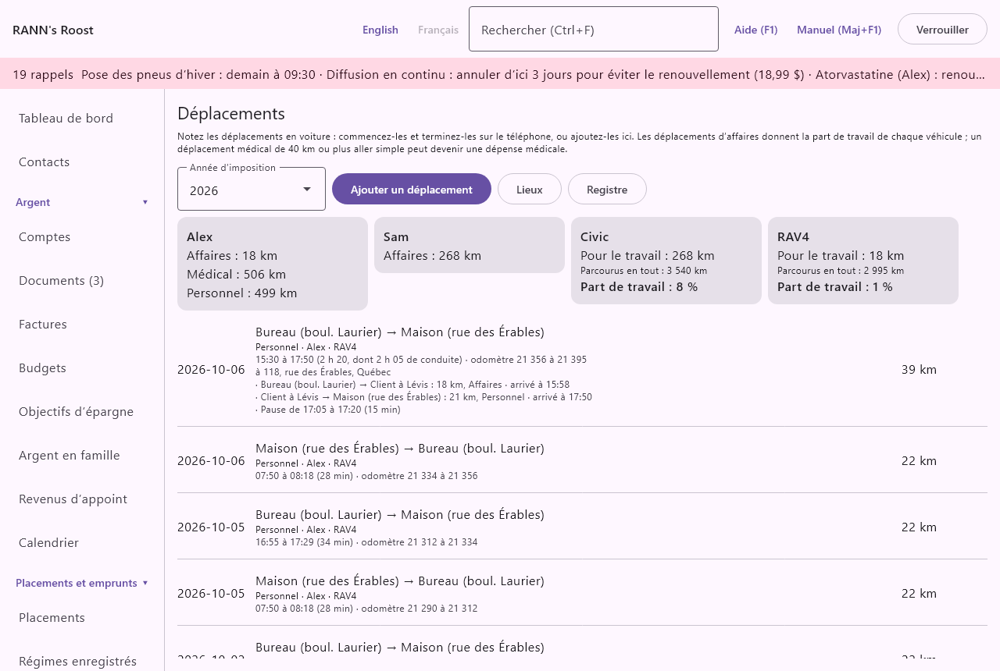
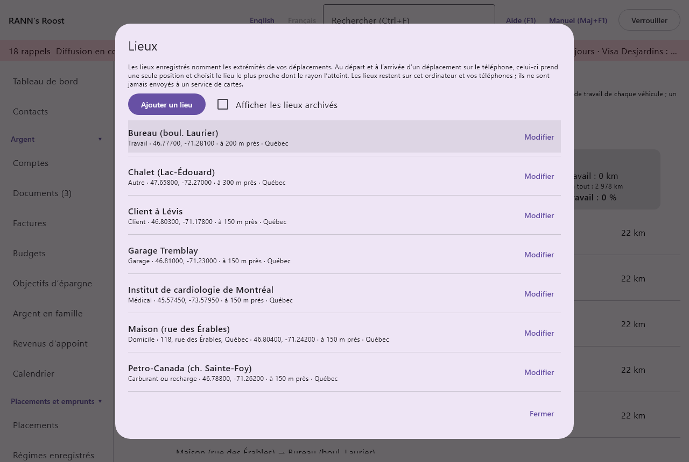
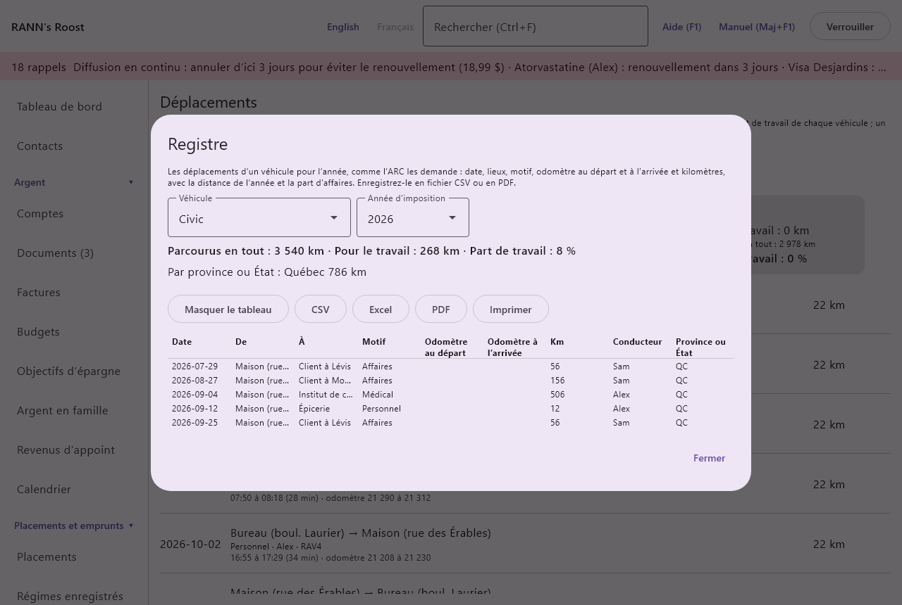

# Déplacements

Le registre des déplacements garde les trajets que vous faites en voiture : pour le travail, pour des soins, ou tout déplacement commencé et terminé sur le téléphone. À partir de lui, RANN's Roost additionne les kilomètres de chaque personne par motif, calcule la part de la conduite de chaque véhicule qui était pour le travail, imprime le registre que l’ARC demande, compte les kilomètres dans chaque province ou État, et transforme un long déplacement médical en dépense médicale. Les déplacements faits avec le téléphone donnent aussi au véhicule ses lectures d’odomètre et montrent comment une remorque change la consommation. Il se trouve dans le groupe **Maison et famille** du menu, sous **Déplacements**.

@index: registre de kilométrage; carnet de route; kilomètres; usage d’un véhicule pour le travail; kilomètres de travail; frais de véhicule

> Remarque : L’ARC s’attend à un carnet de route des déplacements d’affaires ou d’emploi (date, destination, motif et distance) pour appuyer une déduction de frais de véhicule, avec le total des kilomètres parcourus dans l’année. RANN's Roost ne donne pas de conseils fiscaux ; vérifiez les règles de l’ARC avant de déduire quoi que ce soit.

## L’écran Déplacements {#screen}

En haut de l’écran :

- **Année d’imposition** : l’année civile affichée, de cette année jusqu’à six ans en arrière. Les cartes et la liste montrent seulement les déplacements datés de cette année.
- **Ajouter un déplacement** : ouvre la [boîte du déplacement](#trip-dialog) pour un nouveau déplacement.
- **Lieux** : ouvre les [lieux](#places) enregistrés.
- **Registre** : ouvre le [registre](#logbook) d’un véhicule pour l’année, à enregistrer en CSV ou en PDF.

Les nouveaux déplacements sont enregistrés dans le groupe de comptes partagé où vous pouvez ajouter des données (ou le premier groupe où vous le pouvez). Enregistrer, modifier ou supprimer demande la permission de modifier les données de ce groupe.

### Les cartes de résumé {#cards}

Quand l’année compte des déplacements ou des lectures de véhicule, des cartes apparaissent au-dessus de la liste.

Une carte par personne (ou **Ménage** pour les déplacements qui ne sont liés à personne) donne ses kilomètres de l’année par motif, par exemple « Affaires : 1 240 km » et « Médical : 392 km ». Un aller-retour compte deux fois la distance aller simple.

Une carte par véhicule qui a des déplacements de travail ou des lectures d’odomètre dans l’année montre :

- **Pour le travail** : les kilomètres des déplacements **Affaires** et **Emploi** de l’année faits avec ce véhicule.
- **Parcourus en tout** : les kilomètres parcourus dans l’année, d’après les lectures d’odomètre du véhicule : la dernière lecture de l’année moins la première. Il faut au moins deux lectures dans l’année ; sinon, la carte vous demande d’ajouter une lecture au début et à la fin de l’année.
- **Part de travail** : les kilomètres de travail en pourcentage de tous les kilomètres parcourus, arrondis et jamais au-dessus de 100 %. C’est la part d’usage pour le travail demandée quand on déduit des frais de véhicule.

Les lectures d’odomètre se saisissent dans l’écran [Véhicules](vehicles), ou s’envoient du téléphone avec **Odomètre ou heures** (voir [RANN's Roost Mobile](phone-app#odometer-form)) ; les déplacements avec lectures d’odomètre comptent aussi comme lectures. Les véhicules inactifs gardent leurs cartes pour les années où ils ont servi.

Quand les déplacements de l’année ont été faits dans plus d’une province ou d’un État, une carte **Par province ou État** donne les kilomètres de chacun, par exemple « Québec : 1 240 km » et « ON : 64 km » : les chiffres que demandent les déclarations de taxe sur les carburants comme l’IFTA. Chaque déplacement compte là où il a été fait, comme choisi sur le déplacement (voir **Province ou État** plus bas) ; par défaut, là où il a commencé.

@index: part de travail; odomètre; pourcentage d’usage pour le travail

### La liste des déplacements {#trip-list}

Les déplacements de l’année sont listés du plus récent au plus ancien, sous les en-têtes **Date**, **Déplacement**, **Distance** et **Actions**. Chaque ligne montre :

- la date ;
- le point de départ et la destination (« Maison → Bureau du client »), avec **↺** pour un aller-retour ;
- le motif, la personne, le véhicule et les notes ;
- quand elles sont connues, une deuxième ligne : les heures (« 16:30 à 18:45 (2 h 15) », ou avec des pauses « 15:30 à 17:50 (2 h 20, dont 2 h 05 de conduite) »), l’odomètre à chaque bout, ce qui a été remorqué ou transporté (« remorquage : Remorque utilitaire 5 x 8 » ou « Charge lourde »), les passagers, et « du téléphone » avec le nom du téléphone pour un déplacement fait avec le téléphone ;
- les adresses à chaque bout, quand elles sont connues (« de 118, rue des Érables, Québec · à … ») ;
- pour un déplacement avec des arrêts, une ligne par trajet : « Bureau → Client à Lévis : 18 km, Affaires · arrivé à 15:58 », puis le trajet suivant ; et chaque pause, « Pause de 17:05 à 17:20 (15 min) » ;
- **Du téléphone :** et un bouton pour chaque photo ou note prise en route (**Photo**, **Note**, ou « Photo à » l’arrêt) ; un clic l’ouvre dans [Documents](documents), où une note vocale peut être écoutée ;
- **Ajouter aux frais médicaux**, pour un déplacement **Médical** de 40 km ou plus aller simple (voir [Déplacements pour des soins](#medical-travel)) ; une fois le déplacement ajouté, le bouton devient **Ajouté aux frais médicaux** et ne se clique plus ;
- la distance, doublée pour un aller-retour.

Cliquez sur un déplacement pour le modifier ou le supprimer. S’il n’y a aucun déplacement dans l’année, la liste le dit.

## Boîte Ajouter un déplacement {#trip-dialog}

La même boîte ajoute un déplacement (**Ajouter un déplacement**) ou le modifie (**Modifier le déplacement**).

- **Date** : le jour du déplacement, au format AAAA-MM-JJ. Aujourd’hui par défaut. Elle décide de l’année où le déplacement compte.
- **Départ à** et **Arrivée à** : les heures, au format HH:MM, par exemple 07:50. Facultatives. Une arrivée plus tôt que le départ est prise comme le lendemain. La liste affiche le temps de trajet.
- **Motif** : pourquoi vous avez conduit. Il décide des totaux où le déplacement compte :
  - **Affaires** : conduire pour une entreprise que vous exploitez, comme visiter des clients pour votre travail d’appoint. Compte comme kilomètres de travail pour le véhicule.
  - **Emploi** : conduire parce que votre employeur l’exige, autrement que pour aller au travail et en revenir. Compte comme kilomètres de travail pour le véhicule.
  - **Médical** : aller recevoir des soins. Peut devenir une dépense médicale à 40 km ou plus aller simple.
  - **Personnel** : tout le reste. Compté seulement dans les totaux de la personne.
  Un nouveau déplacement commence à **Affaires**.
- **Du lieu** et **Au lieu** : un [lieu](#places) enregistré, ou « (aucun lieu enregistré) ». En choisir un remplit **De** ou **À** avec son nom. Un déplacement qui part d’un lieu compte dans la province ou l’État de ce lieu.
- **De** : d’où vous êtes parti, par exemple « Maison ». Facultatif.
- **À** : où vous êtes allé, comme l’adresse d’un client ou un hôpital. Obligatoire, sauf si **Au lieu** est choisi.
- **Odomètre au départ** et **Odomètre à l’arrivée** : les lectures, en kilomètres entiers. Avec les deux, la distance est leur différence, affichée à côté, et le déplacement est un aller simple : « Avec les deux lectures de l’odomètre, la distance est leur différence, aller simple ; les lectures comptent aussi comme lectures de l’odomètre du véhicule. » L’arrivée doit dépasser le départ, de moins de 10 000 km.
  Un nouveau déplacement propose au départ la dernière lecture du véhicule. Un départ inférieur à la dernière lecture du véhicule à la date du déplacement ou avant affiche « Inférieur au dernier relevé du véhicule, 61 480 km. Vérifiez-le; pour le garder quand même, choisissez de nouveau Enregistrer. » : une faute de frappe est repérée, et une lecture que vous savez juste est gardée par un deuxième **Enregistrer**.
- **Kilomètres aller simple** : affiché sans les deux lectures de l’odomètre : la distance aller simple, par exemple 23,5 (le point fonctionne aussi). Obligatoire, plus grande que zéro et sous 10 000. Elle est gardée avec une décimale.
- **Aller-retour** : affiché sans les deux lectures de l’odomètre : coché quand vous êtes revenu par le même chemin ; le déplacement compte alors deux fois la distance. Coché par défaut.
- **Personne** : qui a fait le déplacement, ou **Ménage**. Elle décide de la carte où le déplacement compte et est proposée comme patient quand on l’ajoute aux frais médicaux.
- **Véhicule** : le véhicule utilisé, ou **Aucun véhicule**. Seuls les déplacements avec un véhicule comptent dans la part de travail de ce véhicule. Un nouveau déplacement propose le premier véhicule en service. Un déplacement enregistré garde son propre choix : **Aucun véhicule** reste **Aucun véhicule**, et un véhicule vendu ou retiré depuis reste dans la liste pour ce déplacement.
- **Remorque ou charge** : **Normal**, **Avec une remorque** ou **Charge lourde**. Il décide du type de conduite où comptent les kilomètres du déplacement dans la consommation de l’écran [Véhicules](vehicles#consumption) et dans ses [prévisions](vehicles#forecast-tab).
- **Remorque** : avec une remorque, laquelle, parmi les biens du type remorque de [Maison et biens](assets), ou « (aucun) ».
- **Passagers** : qui était à bord, comme vous voulez l’écrire, par exemple « Sam, Léa ».
- **Province ou État** : deux lettres, comme QC, ON ou NY. Vide : la province du lieu de départ, sinon celle de la personne (ou du ménage).
- **Notes** : ce qu’il faut retenir, comme le client ou le motif de la visite.
- « du téléphone » : pour un déplacement fait avec le téléphone, le téléphone d’où il vient.
- Pour un déplacement avec des arrêts ou des pauses venus du téléphone, une ligne dit combien il y en a : ils sont gardés tels quels à l’enregistrement, et l’odomètre de chaque arrêt doit rester entre le départ et l’arrivée (« L’odomètre de chaque arrêt doit dépasser celui d’avant et rester sous celui de l’arrivée. »).
- Quand **Médical** est choisi, un rappel explique qu’un déplacement médical compte comme dépense médicale quand les soins sont à 40 km ou plus, aller simple, et ne sont pas offerts plus près. Les 40 km sont un chiffre de [Taux et règles](rates-rules) (Déplacement médical : distance minimale), lu pour la date du déplacement.
- **Supprimer** : affiché en modification. Demande « Supprimer le déplacement du date vers destination? » et, une fois confirmé, le supprime. C’est sans retour. Une dépense médicale faite à partir du déplacement reste dans l’écran Réclamations médicales.

## Les déplacements du téléphone {#from-phone}
@index: GPS; position; déplacement sur le téléphone; Partir; Arrivée; arrêts; trajets; déplacement à plusieurs arrêts; pauses; photos de déplacement

Sur le téléphone, **Déplacement** dans l’onglet Capturer commence un déplacement et, plus tard, le termine (voir [RANN's Roost Mobile](phone-app#trip-form)). Le téléphone prend une seule position au départ, à chaque arrêt et pause, et à l’arrivée, jamais entre les deux, et nomme chaque endroit d’après le lieu enregistré le plus proche dans son rayon. À l’arrivée, il envoie le déplacement comme une saisie ; l’ordinateur l’ajoute aux déplacements avec :

- la date et les heures, le véhicule, le conducteur et les passagers ;
- les lieux aux deux bouts, ou le nom tapé, ou l’adresse ou les coordonnées quand le lieu n’a pas été nommé ; l’adresse et la position de chaque bout ;
- chaque arrêt, avec son heure, son odomètre, son lieu, son adresse, sa position et le motif du trajet qui y finit, et chaque pause avec ses heures et sa position ; les pauses sont exclues du temps de conduite ;
- l’odomètre aux deux bouts, la distance étant leur différence ;
- le motif confirmé, ce qui a été remorqué ou transporté, et les notes ;
- la province du lieu de départ (ou celle du ménage) ;
- le téléphone d’où il vient.

Le déplacement va dans le groupe de comptes où le téléphone envoie (voir [Téléphones](phones)), ses lectures d’odomètre deviennent celles du véhicule, et les lieux enregistrés sur le téléphone (dont les stations) s’ajoutent aux lieux, avec leur adresse. Un déplacement reçu deux fois est gardé une fois. Un déplacement dont l’odomètre à l’arrivée ne dépasse pas celui du départ, ou dont les odomètres des arrêts sont dans le désordre, est refusé, et le téléphone dit pourquoi.

Les photos et notes prises en route arrivent d’abord, comme documents. Elles attendent dans les documents à revoir jusqu’à l’arrivée du déplacement, puis sont classées avec lui ; une photo ou une note prise après l’arrivée est classée aussitôt. Un déplacement abandonné sur le téléphone les laisse dans les documents à revoir.

Un déplacement avec des arrêts compte trajet par trajet : du départ au premier arrêt, d’un arrêt au suivant, et du dernier arrêt à l’arrivée, chacun avec sa distance tirée de l’odomètre et son propre motif (le dernier trajet a celui du déplacement). Les totaux de la personne, les kilomètres de travail du véhicule et le [carnet de route](#logbook) suivent les trajets : un appel d’affaires sur le chemin du retour compte comme affaires, et le reste comme personnel.

## Lieux {#places}
@index: lieux enregistrés; position; domicile; travail; client; rayon

**Lieux** liste les lieux enregistrés : nom, type, adresse, coordonnées et rayon, province ou État, et « enregistré sur le téléphone » pour un lieu fait là. Cliquez sur un lieu, ou **Modifier**, pour le changer. **Ajouter un lieu** en ajoute un. **Afficher les lieux archivés** inclut ceux qui sont archivés.

Le téléphone reçoit les lieux de chaque groupe de comptes que vous voyez, leur compare sa position au départ, aux arrêts et à l’arrivée d’un déplacement, et vous laisse ajouter le lieu où vous êtes, ajouter une station ou en renommer un. Les lieux restent sur cet ordinateur et vos téléphones, dans les fichiers chiffrés du ménage ; ils ne sont jamais envoyés à un service de cartes. Sur le téléphone, deux recherches peuvent être activées : une adresse trouvée d’après une position par le géocodeur d’Android (Google), et les stations à proximité d’après OpenStreetMap (voir [RANN's Roost Mobile](phone-app#trip-lookups)).

### Ajouter ou modifier un lieu {#place-dialog}

- **Nom** : par exemple « Maison », « Bureau (boul. Laurier) » ou « Institut de cardiologie de Montréal ». Obligatoire. C’est ce que montrent les déplacements et le téléphone.
- **Type de lieu** : **Domicile**, **Travail**, **Client**, **Commerce**, **Station-service**, **Borne de recharge**, **Garage**, **Médical** ou **Autre**. Le formulaire de plein du téléphone montre d’abord les stations-service et les bornes. Sur le téléphone, le motif d’un déplacement en est tiré : vers ou depuis un **Client**, c’est **Affaires** ; vers un lieu **Médical**, ou le retour à la maison depuis un tel lieu, c’est **Médical** ; les autres déplacements dans un véhicule commercial sont **Affaires**, et tout le reste est **Personnel**. Le trajet entre la maison et votre lieu de travail habituel est personnel pour l’ARC.
- **Adresse** : pour mémoire ; un lieu enregistré sur le téléphone peut apporter son adresse, tapée ou trouvée là.
- **Latitude** et **Longitude** : « La latitude et la longitude viennent du téléphone quand un lieu y est enregistré. Pour les entrer ici, copiez-les d’une application de cartes en qui vous avez confiance, par exemple 46.81388 et -71.20798. Sans elles, le téléphone ne peut pas reconnaître le lieu. » Les deux ou aucune.
- **Rayon (m)** : à quelle distance une position doit être pour compter comme ce lieu, de 10 à 5 000 mètres ; 150 par défaut. Prenez un plus grand rayon pour un grand site, comme un hôpital ou un terrain de chalet.
- **Province ou État** : deux lettres. Les déplacements qui partent d’ici comptent dans cette province ou cet État.
- **Notes**.
- **Enregistrer dans** : le groupe de comptes où le lieu est gardé, choisi à l’ajout.
- **Archivé (n’est plus proposé sur le téléphone)** : en modification ; le lieu reste sur les déplacements qui l’ont utilisé.
- **Supprimer** : en modification ; demande « Supprimer le lieu nom? Les déplacements gardent son nom. » C’est sans retour.

## Registre {#logbook}
@index: registre de l’ARC; carnet de route; exporter le kilométrage; IFTA; kilomètres par province; CSV; PDF

« Les déplacements d’un véhicule pour l’année, comme l’ARC les demande : date, lieux, motif, odomètre au départ et à l’arrivée et kilomètres, avec la distance de l’année et la part d’affaires. Enregistrez-le en fichier CSV ou en PDF. »

- **Véhicule** et **Année d’imposition** : le registre affiché. Le premier véhicule dont l’usage n’est pas personnel est proposé.
- Une ligne avec les kilomètres parcourus dans l’année d’après l’odomètre, les kilomètres de travail et la part de travail, comme sur la carte du véhicule.
- **Par province ou État** : les kilomètres de l’année avec ce véhicule dans chaque province ou État.
- **CSV**, **Excel** et **PDF**, au-dessus du tableau : demandent où enregistrer le fichier, dans ce format. Le fichier contient le tableau et, en dessous, la distance de l’année et la part de travail. **Imprimer** l’imprime ; **Masquer le tableau** le replie.
- Le tableau : **Date**, **De**, **À**, **Motif**, **Odomètre au départ**, **Odomètre à l’arrivée**, **Km**, **Conducteur** et **Province ou État**, du plus ancien au plus récent. Un déplacement avec des arrêts donne une ligne par trajet, chacune avec sa destination, son motif, ses odomètres et ses kilomètres : l’ARC demande la destination et le motif de chaque déplacement d’affaires, et un arrêt en route en est un.

> Remarque : L’ARC demande qu’un registre indique, pour chaque déplacement d’affaires, la date, la destination, le motif et les kilomètres, ainsi que l’odomètre au début et à la fin de l’année. Les déplacements faits avec le téléphone donnent tout cela. Gardez les fichiers avec vos documents fiscaux.

## Déplacements pour des soins {#medical-travel}

@index: déplacements pour des soins; frais de déplacement pour soins médicaux; 40 km; 80 km; crédit d’impôt pour frais médicaux; CIFM; taux par kilomètre

Quand des soins ne sont pas offerts près de chez vous et que vous parcourez 40 km ou plus aller simple pour les recevoir, le coût du trajet peut compter comme dépense médicale pour le crédit d’impôt pour frais médicaux. La méthode simplifiée de l’ARC permet de demander un taux fixe par kilomètre au lieu de garder chaque reçu ; l’ARC publie ce taux pour chaque province chaque année. (Les trajets de 80 km ou plus aller simple peuvent aussi permettre d’autres frais, comme les repas et l’hébergement ; inscrivez-les dans l’écran [Réclamations médicales](medical).)

Un déplacement **Médical** dont la distance aller simple est de 40 km ou plus affiche **Ajouter aux frais médicaux** dans la liste.

### Boîte Ajouter aux frais médicaux {#to-medical-dialog}

- La première ligne montre la date et la destination du déplacement, suivie d’un rappel que l’ARC publie chaque année un taux par kilomètre pour chaque province et territoire, et que le taux affiché vient de [Taux et règles](rates-rules).
- **Personne** : le patient, dont ce sera la dépense médicale. La personne du déplacement par défaut, sinon le premier membre du ménage. Le taux suit la province ou le territoire de cette personne (celui du ménage, sauf si la personne a le sien), puisque le déplacement commence là où elle habite.
- Sous la personne, une ligne indique d’où vient le taux : le taux de la province en vigueur depuis une date, intégré (avec la source de l’ARC) ou propre au ménage ; ou qu’il n’y a pas encore de taux pour la province.
- **Taux par kilomètre** : en dollars, par exemple 0,62 ou 0,605 (les taux de l’ARC peuvent avoir un demi-cent). Il est rempli avec le Déplacement médical : taux par kilomètre de Taux et règles pour la date du déplacement et la province de la personne : l’ARC publie les taux d’une année au début de l’année suivante ; d’ici là, le taux de la dernière année est affiché. Vous pouvez le changer pour ce déplacement. Un taux saisi pour une année dans une version antérieure de l’application sert encore pour cette année.
- **Garder ce taux pour province à partir du 1er janvier année, dans Taux et règles** : pour un administrateur seulement. Coché, quand le taux a été changé, le taux est aussi ajouté à Taux et règles comme valeur propre au ménage pour cette province à partir du 1er janvier de l’année du déplacement ; il est alors rempli pour les prochains déplacements.

**Enregistrer** est offert dès qu’une personne et un taux sont choisis. Il :

1. garde le taux dans Taux et règles, quand la case ci-dessus est cochée ;
2. ajoute pour la personne, dans l’écran [Réclamations médicales](medical), une dépense médicale du type **Déplacements pour des soins**, datée et payée à la date du déplacement, égale au taux fois les kilomètres du déplacement (doublés pour un aller-retour), avec comme description la destination et la distance.

La dépense compte ensuite dans la réclamation médicale comme toute autre. Un déplacement n’est ajouté qu’une fois : son bouton devient alors **Ajouté aux frais médicaux**. Pour l’ajouter de nouveau, par exemple à un autre taux, supprimez d’abord la dépense dans l’écran Réclamations médicales ; le bouton revient.
