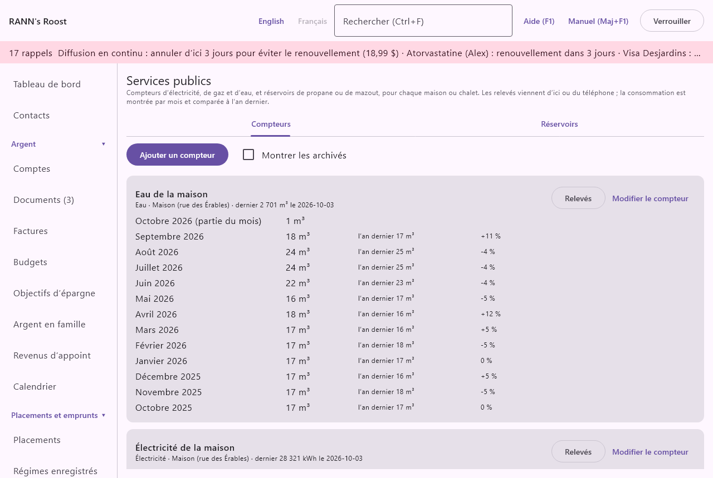
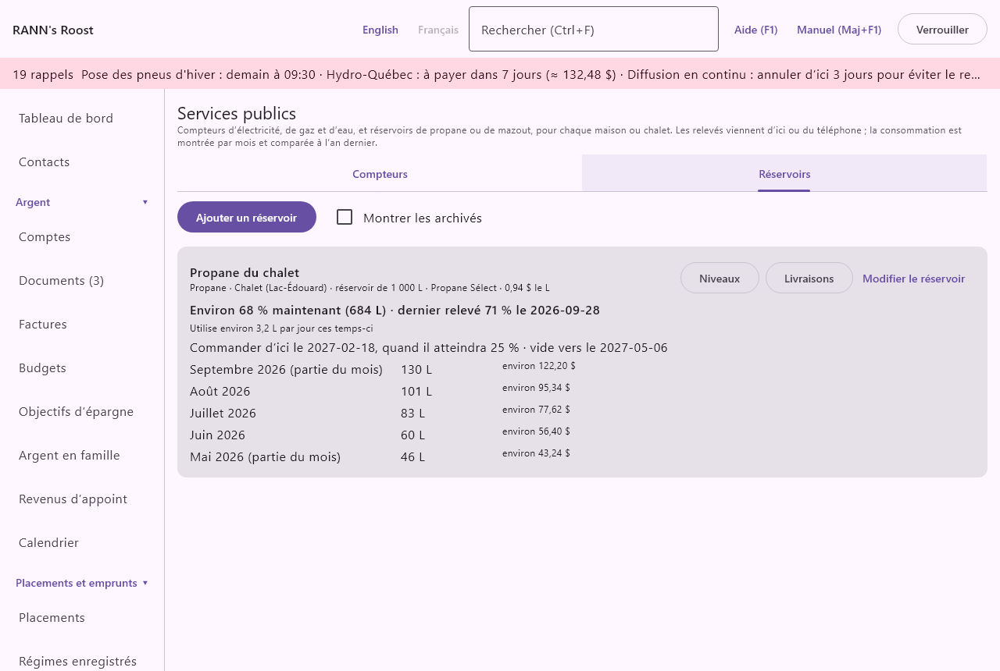

# Services publics

Services publics suit les compteurs d’électricité, de gaz naturel et d’eau et les réservoirs de propane ou de mazout de chaque maison ou chalet, ou du ménage dans son ensemble. À partir des relevés, RANN's Roost calcule la consommation de chaque mois, la compare au même mois l’an dernier, signale un mois qui a consommé beaucoup plus que d’habitude, estime le coût d’une unité et vous dit quand commander un réservoir. L’écran se trouve dans le groupe **Maison et famille** du menu, sous **Services publics**.

@index: hydro; électricité; gaz naturel; compteur d’eau; kWh; mètres cubes; propane; mazout; huile à chauffage; relevé de compteur; consommation

## L’écran Services publics {#screen}

L’écran compte deux onglets : [Compteurs](#meters) et [Réservoirs](#tanks). Sur chacun :

- **Montrer les archivés** : montre aussi les compteurs ou réservoirs marqués archivés, comme le compteur d’une maison vendue.

Les nouveaux compteurs et réservoirs sont gardés dans le premier groupe de comptes partagé que vous pouvez modifier ; si vous pouvez en modifier plusieurs, la boîte demande où (**Enregistrer dans**). Leurs relevés et livraisons restent avec eux. Ajouter ou modifier un compteur ou un réservoir exige la permission de modifier les données de son groupe ; ajouter un relevé exige seulement la permission d’ajouter des données, de sorte qu’une personne qui capture des reçus peut aussi envoyer des relevés du téléphone. Les boutons que les livres refuseraient sont grisés ou cachés : **Ajouter un compteur** et **Ajouter un réservoir** pour qui ne peut modifier aucun groupe, **Modifier** sur un compteur ou un réservoir d’un groupe qu’on peut seulement consulter, et le ✕ des relevés et des livraisons pour qui ne peut pas les modifier.

## Compteurs {#meters}

Chaque compteur est une carte. Sa première ligne le nomme ; dessous viennent ce qu’il mesure, la maison ou le chalet (ou **Ménage**), **Relevés selon l’heure** s’il y a lieu, le dernier relevé avec sa date et, si le compteur a une facture, le coût unitaire, par exemple « 0,0742 $ le kWh ».

Dessous, une ligne par mois, du plus récent au plus ancien, pour les treize derniers mois qui ont des relevés :

- le mois, avec **(partie du mois)** quand les relevés ne couvrent pas tous ses jours (le premier et le mois en cours) ;
- la consommation, en kWh pour l’électricité et en mètres cubes (m³) pour le gaz et l’eau ;
- **l’an dernier** : le même mois un an plus tôt, s’il était complet, et la variation en pourcentage ;
- **environ** : le coût du mois au coût unitaire, s’il y en a un ;
- **Inhabituel**, en rouge, pour un mois complet qui a consommé plus de 130 % du même mois l’an dernier ou, sans ce mois, de la moyenne des trois mois complets précédents (au moins deux). Le pourcentage est **Consommation inhabituelle (pourcentage)** dans [Taux et règles](rates-rules).

Le dernier mois complet, s’il est inhabituel et qu’il est le mois dernier ou celui d’avant, paraît aussi avec les autres rappels, au [Tableau de bord](dashboard#needs-attention) sous **À vérifier**, dans la notification de l’ordinateur et dans le Résumé du téléphone, par exemple « Chalet électricité : consommation inhabituelle en septembre 2026 (+35 % par rapport au même mois l’an dernier) », ou « au-dessus des mois précédents » quand il n’y a pas de mois de l’an dernier à comparer. Un clic ouvre Services publics. Un mois inhabituel plus ancien ne paraît qu’ici.

@index: consommation inhabituelle; même mois l’an dernier

### Comment la consommation est calculée {#use}

Un compteur monte. La consommation entre deux relevés est la différence, répartie également sur les jours qui les séparent : un relevé le 21 janvier et le suivant le 2 mars en donnent 11 jours à janvier, 28 à février et 1 à mars. Plusieurs relevés le même jour comptent comme le dernier. Un relevé plus bas que le précédent est pris comme un compteur neuf ou remis à zéro : cette période ne compte rien, et le calcul repart de lui.

Le coût unitaire est le total de la facture du compteur sur les 12 derniers mois (les montants payés, et les estimations des factures pas encore payées) divisé par la consommation des 12 mois précédant le mois en cours. C’est une moyenne qui comprend les frais fixes, la livraison et les taxes ; ce n’est pas le tarif imprimé sur la facture.

### Boîte Ajouter un compteur {#meter-dialog}

**Ajouter un compteur** l’ouvre ; **Modifier le compteur** sur une carte l’ouvre pour ce compteur.

- **Nom** : obligatoire ; par exemple « Électricité de la maison ».
- **Mesure** : **Électricité** (kWh), **Gaz naturel** (m³) ou **Eau** (m³). Il fixe l’unité affichée.
- **Maison ou chalet** : la maison ou le chalet parmi vos [biens](assets) (maisons et chalets seulement), ou **Ménage** s’il n’appartient à aucun.
- **Relevés selon l’heure** : pour l’électricité seulement. Cochez-le quand le compteur garde des totaux en période de pointe, intermédiaire et creuse, comme en Ontario ; chaque relevé peut alors donner les trois registres.
- **Facture pour le coût unitaire** : une de vos [factures](bills), comme celle d’électricité, ou **Aucune**. Sans facture, aucun coût n’est montré.
- **Notes** : ce qu’il faut retenir, comme l’endroit où se trouve le compteur.
- **Enregistrer dans** : pour un nouveau compteur, si vous pouvez modifier plusieurs groupes de comptes.
- **Archivé (n’est plus relevé)** : sur un compteur existant ; il quitte la liste sauf si **Montrer les archivés** est coché, et le téléphone ne l’offre plus. Ses relevés restent.
- **Supprimer** : demande d’abord, puis supprime le compteur et tous ses relevés. On ne peut pas l’annuler.

### Fenêtre Relevés {#readings}

**Relevés** sur une carte liste les relevés du compteur, du plus récent au plus ancien : la date, le relevé, les trois registres selon l’heure, **du téléphone** s’il en vient, et les notes. Le ✕ d’une ligne supprime ce relevé, après avoir demandé.

Sous la liste, **Nouveau relevé** :

- **Date** : le jour du relevé, comme 2026-10-05.
- **Relevé (kWh)** ou **Relevé (m³)** : le chiffre du compteur, avec ou sans décimales.
- **Pointe**, **Intermédiaire**, **Creuse** : selon l’heure seulement. Laissez **Relevé** vide pour prendre le total des trois.
- **Notes** : facultatif.

**Ajouter le relevé** l’enregistre ; **Fermer** quitte sans ajouter.

@index: tarification selon l’heure; pointe; creuse; intermédiaire

## Réservoirs {#tanks}

Chaque réservoir est une carte : son nom, le combustible, la maison ou le chalet, sa capacité, le fournisseur et, si les livraisons ont un coût, le prix d’un litre sur les 12 derniers mois. Puis :

- **Environ 64 % maintenant (640 L)** : le niveau estimé aujourd’hui, à partir du dernier relevé de niveau, des livraisons depuis et de la consommation par jour, et le dernier relevé lui-même.
- **Utilise environ 4,8 L par jour ces temps-ci** : la consommation moyenne par jour des relevés des 90 derniers jours.
- **Commander d’ici le** une date, **quand il atteindra 25 %**, et quand il serait vide à ce rythme. La date est en rouge quand elle tombe dans les jours du rappel.
- une ligne par mois avec les litres utilisés, et leur coût au prix récent.

Deux relevés de niveau sont nécessaires avant de montrer une consommation ou une date.

@index: commande de propane; livraison de combustible; niveau du réservoir; jauge

### Comment la consommation et la date de commande sont calculées {#tank-use}

La consommation entre deux relevés de niveau est le niveau au premier, plus ce qui a été livré après lui jusqu’au second, moins le niveau au second. Un relevé fait le jour d’une livraison est pris comme fait après la livraison. Si la jauge indique plus que ce calcul donnerait, la période ne compte rien.

Le niveau d’aujourd’hui est le dernier relevé plus les livraisons depuis, moins la consommation par jour pour chaque jour depuis, jamais sous vide ni au-dessus de la capacité. La date de commande est celle où il devrait atteindre le niveau de commande ; quatorze jours avant (**Rappel de commande de combustible (jours d’avance)** dans [Taux et règles](rates-rules)), un rappel « commander du combustible » paraît avec les autres rappels au [tableau de bord](dashboard) et parmi les renouvellements dans le [calendrier](calendar), et le téléphone affiche une notification et le réservoir sous **Services publics** dans son Résumé. Tant que deux relevés ne donnent pas une consommation par jour, il n’y a pas de date de commande, sauf qu’un relevé au niveau de commande ou en dessous rappelle aussitôt. La consommation change avec les saisons ; la date est donc une estimation : relevez la jauge toutes les quelques semaines.

### Boîte Ajouter un réservoir {#tank-dialog}

- **Nom** : obligatoire ; par exemple « Propane du chalet ».
- **Combustible** : **Propane** ou **Mazout**.
- **Maison ou chalet** : comme pour un compteur.
- **Capacité (litres)** : obligatoire, plus que zéro. Les niveaux entrés en litres sont gardés en pourcentage de celle-ci.
- **Commander à (%)** : de 1 à 90. Vide prend **Commander le combustible à (pourcentage du réservoir)** de Taux et règles, 25 % sauf changement.
- **Fournisseur** : qui livre ; il devient le bénéficiaire des paiements inscrits avec les livraisons.
- **Notes**, **Enregistrer dans**, **Archivé (n’est plus relevé)** et **Supprimer** comme pour un compteur. Supprimer un réservoir supprime ses relevés et ses livraisons ; les paiements inscrits restent dans les comptes.

### Fenêtre Niveaux {#tank-readings}

**Niveaux** liste les relevés de la jauge, du plus récent au plus ancien, en pourcentage et en litres. Sous **Nouveau relevé de niveau**, entrez la **Date** et soit **Niveau (%)** (0 à 100), soit **Litres** (jusqu’à la capacité), et les notes. **Ajouter le relevé** l’enregistre.

### Fenêtre Livraisons {#deliveries}

**Livraisons** liste les livraisons, de la plus récente à la plus ancienne : litres, coût et **paiement inscrit** si un paiement a été inscrit avec elle. Sous **Nouvelle livraison** :

- **Date** et **Litres** : obligatoires.
- **Coût** : facultatif ; il donne le prix d’un litre.
- **Inscrire le paiement dans un compte** : avec un coût, inscrit aussi le paiement dans le compte choisi (comptes bancaires et cartes de crédit), au fournisseur, dans la catégorie **Chauffage (gaz, mazout)**, avec les litres en mémo.
- **Notes** : facultatif.

Supprimer une livraison demande d’abord et offre de supprimer aussi le paiement inscrit avec elle.

## Sur le téléphone {#phone}

**Relevé de compteur ou de réservoir** à l’onglet Capturer du téléphone envoie un relevé de compteur (avec les registres selon l’heure) ou un niveau de réservoir, en pourcentage ou en litres ; voyez [RANN's Roost Mobile](phone-app#log-forms). Les relevés venus du téléphone affichent **du téléphone**.

Le téléphone est aussi averti des réservoirs à commander : une notification « Commander du combustible » qui nomme le réservoir (sans niveau ni montant, puisqu’un téléphone verrouillé peut l’afficher), une fois quand la date de commande arrive dans les jours du rappel et une fois le jour même, et le réservoir avec « à commander d’ici le » une date sous **Services publics** dans son Résumé. Les compteurs qui ont un mois inhabituel y sont aussi. Voir [Notifications](phone-app#notifications).
