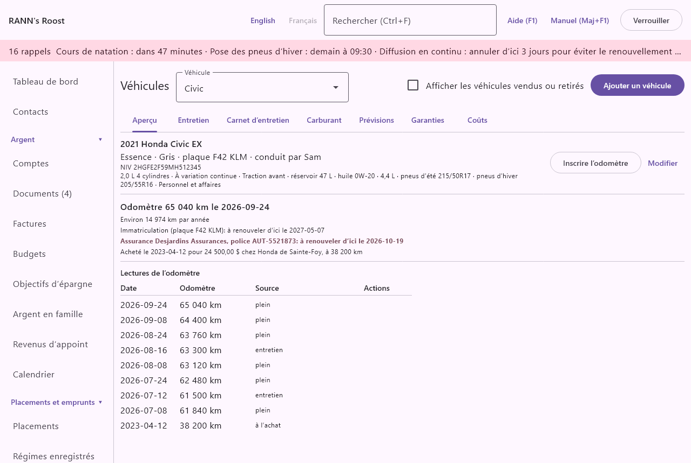
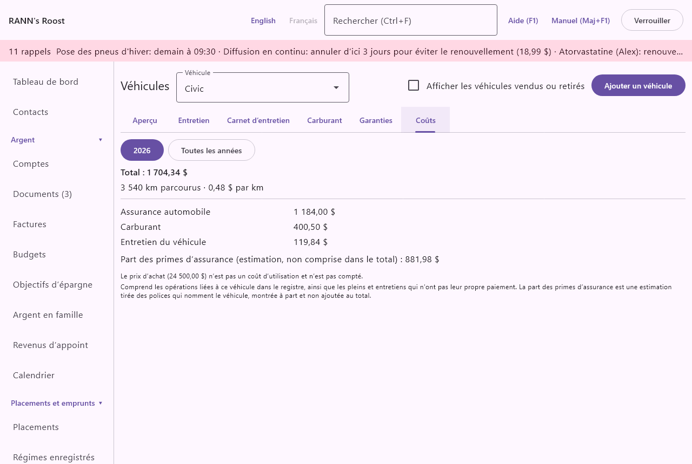

# Véhicules

L’écran **Véhicules** suit chaque auto, camion, moto ou autre véhicule routier : ses papiers, son odomètre, son calendrier d’entretien, son carnet d’entretien, ses pleins ou recharges, ses garanties et ce qu’il coûte à utiliser. Il se trouve dans le groupe **Maison et famille** du menu. Les autres choses à moteur, comme un bateau, un VR ou une remorque, vont dans [Maison et biens](assets).

## L’écran en bref {#overview}
@index: auto; voiture; camion; automobile; moto

En haut :

- **Véhicule** : le véhicule affiché. Un véhicule vendu ou retiré affiche son statut entre parenthèses.
- **Afficher les véhicules vendus ou retirés** : décoché par défaut. Cochez-le pour inclure les véhicules qui ne sont plus en service dans la liste **Véhicule**.
- **Ajouter un véhicule** : ouvre un formulaire vierge. Voir [Ajouter ou modifier un véhicule](vehicles#vehicle-form).

Quand il n’y a aucun véhicule, l’écran indique « Aucun véhicule pour l’instant. » Sinon, six onglets montrent le véhicule choisi : **Aperçu**, **Entretien**, **Carnet d’entretien**, **Carburant**, **Garanties** et **Coûts**.

## Ajouter ou modifier un véhicule {#vehicle-form}

**Ajouter un véhicule**, ou **Modifier** à l’onglet **Aperçu**, ouvre le formulaire, intitulé **Ajouter un véhicule** ou **Modifier le véhicule**. Seul le nom est obligatoire ; **Enregistrer** reste inaccessible tant qu’il est vide. Après l’enregistrement d’un nouveau véhicule, l’écran l’affiche.

### Renseignements {#details}

- **Nom** : « Comment vous l’appelez, par exemple « Civic » ou « l’auto de Sam » ». Obligatoire. C’est ainsi que le véhicule paraît partout : listes, rappels, registre.
- **Marque**, **Modèle** et **Année** : par exemple Honda, Civic, 2021. L’année doit être entre 1900 et 2100. Le titre de l’aperçu est formé de l’année, la marque, le modèle et la version.
- **Version** : par exemple « EX » ou « Sport ».
- **Couleur**.
- **Énergie** : **Essence** (par défaut), **Diesel**, **Hybride**, **Hybride rechargeable**, **Électrique** ou **Autre**. **Électrique** change l’onglet **Carburant** en recharges en kWh et omet les tâches du moteur (vidange d’huile, filtre à air du moteur) quand on ajoute les tâches habituelles.
- **Plaque d’immatriculation** : enregistrée en majuscules. Affichée dans l’aperçu et avec le rappel d’immatriculation.
- **Numéro d’identification du véhicule (NIV)** : le numéro de 17 caractères inscrit sur le certificat d’immatriculation et le tableau de bord ; enregistré en majuscules. On peut le chercher à l’onglet **Est-ce couvert ?** de [Maison et biens](assets#covered-tab).
- **Conducteur principal** : un membre du ménage, ou « (aucun) ». Pour mémoire ; affiché dans l’aperçu.

### Achat {#purchase}

Sous **Achat** :

- **Date** : quand le véhicule a été acheté. Si une tâche d’entretien n’a jamais été faite, son calendrier part de cette date.
- **Prix** : le prix d’achat, dans la devise du véhicule (la devise de base du ménage à la création du véhicule). Il est affiché dans l’aperçu mais n’est pas compté dans les coûts d’utilisation.
- **Odomètre (km)** : la lecture à l’achat. Avec la date, elle compte comme première lecture de l’odomètre, et comme point de départ des tâches au kilométrage jamais faites.
- **Vendeur** : le concessionnaire ou la personne.

### Immatriculation et assurance {#registration-insurance}
@index: renouvellement de l’immatriculation; SAAQ; ServiceOntario; plaque; assurance auto

Sous **Immatriculation et assurance** :

- **Renouvellement de l’immatriculation** : quand l’immatriculation (la plaque) doit être renouvelée.
- **Renouvellement de l’assurance** : quand la police d’assurance auto se renouvelle.
- **Assureur** et **Numéro de police** : affichés dans l’aperçu avec le renouvellement de l’assurance.

Chaque date donne une ligne dans l’aperçu, en gras dans les 30 jours qui précèdent et en rouge une fois passée, et un rappel à partir de 30 jours avant (délai de renouvellement par défaut, réglable dans [Taux et règles](rates-rules)). Voir [Rappels et calendrier](vehicles#reminders).

> Conseil : Pour voir si le véhicule est couvert par une police, et pour garder les primes et les réclamations de la police, ajoutez la police auto à l’onglet **Assurances** de [Maison et biens](assets#insurance-tab) et cochez le véhicule sous **Ce qu’elle couvre**.

### Statut, vente et retrait {#status}

En modifiant un véhicule enregistré :

- **État** : **En service** (par défaut), **Vendu** ou **Retiré**. Un véhicule vendu ou retiré est caché de la liste **Véhicule** (à moins que **Afficher les véhicules vendus ou retirés** soit coché), des rappels, des listes d’entretien et de la recherche **Est-ce couvert ?**. Ses données sont conservées.
- **Date** et **Prix de vente** : affichés quand l’état n’est pas **En service** : quand il a été vendu ou retiré, et pour combien. L’aperçu affiche alors une ligne comme « Vendu le date pour prix » et, pour une vente avec un prix d’achat, le gain ou la perte sur la vente (le prix de vente moins le prix d’achat), à titre indicatif.

### Enregistrer dans et supprimer {#store-delete}

- **Notes** : tout ce qui concerne le véhicule.
- **Enregistrer dans** : le groupe de comptes où le véhicule et toutes ses données sont gardés. Pour un nouveau véhicule, le premier groupe partagé est proposé. Il ne peut pas être changé ensuite.
- **Supprimer** (en modification) : demande « Supprimer nom avec ses tâches, entretiens et pleins? Les opérations qui y sont liées sont conservées. » Une fois confirmé, c’est définitif. Changer l’état à **Vendu** ou **Retiré** est habituellement préférable, puisque l’historique est conservé.

Ajouter ou changer un véhicule demande la permission **Modification** sur son groupe. Un utilisateur avec la permission **Saisie seulement** peut tout de même inscrire des lectures d’odomètre, des entretiens et des pleins.

## Onglet Aperçu {#overview-tab}

L’onglet **Aperçu** affiche :

- le titre (année, marque, modèle, version), l’énergie, la couleur, la plaque et le conducteur principal, et le NIV ;
- les boutons **Inscrire l’odomètre** et **Modifier** ;
- « Odomètre distance le date » : la plus haute lecture inscrite, ou « Aucune lecture de l’odomètre pour l’instant. » ;
- « Environ distance par année » : votre distance habituelle, d’après les lectures de la dernière année, dès qu’il y a des lectures à au moins deux semaines d’intervalle ;
- les lignes d’immatriculation et d’assurance, colorées à l’approche de leurs dates ;
- la ligne d’achat, « Acheté le date pour prix chez vendeur, à distance », quand une date ou un prix d’achat est entré ;
- pour un véhicule qui n’est plus en service, son état, sa date et son prix de vente ;
- les notes ;
- **Lectures de l’odomètre** : les 12 dernières lectures.

### Lectures de l’odomètre {#odometer}
@index: kilométrage; kilomètres; odomètre

L’application rassemble les lectures de quatre sources, affichées dans la liste avec leur provenance :

- **à l’achat** : la date et l’odomètre d’achat ;
- **inscrite** : les lectures tapées avec **Inscrire l’odomètre** ;
- **plein** : l’odomètre d’un plein ou d’une recharge ;
- **entretien** : l’odomètre d’un entretien.

Seules les lectures entrées avec **Inscrire l’odomètre** ont un bouton **Supprimer**, qui demande d’abord « Supprimer la lecture de 52 300 km du date? » ; les autres se changent dans leur propre fiche.

Les lectures servent à :

- l’odomètre actuel, qui décide quand l’entretien au kilométrage est dû ;
- la distance habituelle par jour, qui prévoit quand une distance sera atteinte ;
- la distance parcourue et le coût par kilomètre de l’onglet **Coûts** ;
- les garanties limitées en kilomètres ;
- la part de travail du véhicule dans les [Déplacements](trips), qui demande une lecture près du début et près de la fin de l’année.

### Inscrire l’odomètre {#enter-odometer}

**Inscrire l’odomètre** ouvre une petite boîte qui porte le nom du véhicule :

- **Date** : aujourd’hui par défaut.
- **Odomètre (km)** : la lecture, en kilomètres entiers. Les espaces et séparateurs de milliers sont ignorés. Obligatoire.

Inscrivez une lecture tous les mois ou deux, ou laissez les pleins et les entretiens le faire, pour que les prévisions restent justes.

## Onglet Entretien {#maintenance-tab}
@index: calendrier d’entretien; vidange d’huile; permutation des pneus; pneus d’hiver

« Chaque tâche revient après un nombre de mois, une distance, ou ce qui arrive en premier. La prévision utilise votre distance habituelle par jour. »

Chaque tâche active a une carte avec :

- son nom, son intervalle (« aux 6 mois ou aux 8 000 km ») et quand elle a été faite la dernière fois, avec l’odomètre ;
- son état : **Prochaine**, **Bientôt** (en gras) ou **À faire** (en rouge), avec la date et la distance d’échéance ;
- « à votre distance habituelle, vers le date » : quand la distance d’échéance devrait être atteinte, pour une tâche au kilométrage ;
- **Inscrire comme faite** et **Modifier**.

Les tâches sont triées par prochaine date. Les tâches en pause suivent, marquées « (en pause) », avec **Modifier**. Quand il n’y a pas de tâche : « Aucune tâche d’entretien. Ajoutez les tâches habituelles pour commencer. »

### Tâches habituelles {#usual-tasks}

**Ajouter les tâches habituelles** ajoute un calendrier courant, en sautant celles que le véhicule a déjà :

- **Vidange d’huile et filtre** : aux 6 mois ou aux 8 000 km (pas pour un véhicule électrique).
- **Permutation des pneus** : aux 12 mois ou aux 10 000 km.
- **Pose des pneus d’hiver** : chaque année, le 15 novembre, ou le 1er décembre au Québec (la province du conducteur, ou celle du ménage).
- **Retrait des pneus d’hiver** : chaque année, le 15 avril.
- **Inspection des freins** : aux 12 mois ou aux 20 000 km.
- **Filtre à air de l’habitacle** : aux 12 mois ou aux 20 000 km.
- **Filtre à air du moteur** : aux 24 mois ou aux 30 000 km (pas pour un véhicule électrique).
- **Inspection annuelle** : aux 12 mois.

Elles partent d’aujourd’hui et de l’odomètre actuel, sauf les pneus d’hiver, qui reviennent à leur date. Modifiez chaque tâche selon le manuel du propriétaire, ou mettez en pause celles dont vous n’avez pas besoin.

> Remarque : Au Québec, les pneus d’hiver sont obligatoires du 1er décembre au 15 mars (du 15 décembre avant 2019). Ailleurs, les dates sont des suggestions. Les deux dates, par province, sont dans [Taux et règles](rates-rules).

### Ajouter ou modifier une tâche {#task-form}

**Ajouter une tâche** ouvre le formulaire **Ajouter une tâche** ; **Modifier** ouvre **Modifier la tâche**.

- **Tâche** : son nom, par exemple « Huile de transmission ». Obligatoire.
- « Remplissez l’un ou les deux : la tâche revient à ce qui arrive en premier. »
- **Aux (mois)** : de 1 à 240. Une nouvelle tâche propose 12.
- **Aux (km)** : de 1 à 1 000 000. Au moins un des deux intervalles est obligatoire.
- **Faite la dernière fois le** : quand la tâche a été faite la dernière fois avant que vous inscriviez les entretiens, ou la date à partir de laquelle compter. Une nouvelle tâche propose aujourd’hui. Dès qu’un entretien inscrit la tâche, le plus récent de ces entretiens sert plutôt.
- **Faite la dernière fois à (km)** : l’odomètre à la dernière fois. Une nouvelle tâche propose l’odomètre actuel. Il ne sert que pour une tâche au kilométrage.
- **Me le rappeler (jours avant)** : combien de jours avant la date d’échéance la tâche passe à **Bientôt** ; 14 par défaut pour une nouvelle tâche ([Taux et règles](rates-rules)).
- **Me le rappeler (km avant)** : combien de kilomètres avant la distance d’échéance la tâche passe à **Bientôt** ; 500 par défaut.
- **Notes** : numéro de pièce, type d’huile, tout ce qui est utile.
- **Active** (en modification) : décochez-la pour mettre en pause une tâche inutile pour l’instant. Une tâche en pause n’est jamais due et ne donne pas de rappel. Cochez-la de nouveau pour la reprendre.
- **Supprimer** (en modification) : demande « Supprimer la tâche « nom »? Les entretiens déjà inscrits sont conservés. » et, une fois confirmé, supprime la tâche. Les entretiens qui l’ont inscrite sont conservés.

### Quand une tâche est due {#task-due}

Pour chaque tâche, l’application prend la dernière fois qu’elle a été faite : le plus récent entretien qui l’a cochée, sinon **Faite la dernière fois le** et **Faite la dernière fois à (km)**, sinon la date et l’odomètre d’achat. Ensuite :

- la date d’échéance est cette date plus **Aux (mois)** ;
- la distance d’échéance est cet odomètre plus **Aux (km)** ;
- **À faire** : la date d’échéance est arrivée, ou le dernier odomètre a atteint la distance d’échéance ;
- **Bientôt** : à moins de **Me le rappeler (jours avant)** de la date d’échéance, à moins de **Me le rappeler (km avant)** de la distance d’échéance, ou quand la date prévue pour la distance tombe dans les jours de rappel ;
- **Prochaine** : autrement.

La prévision divise les kilomètres qui restent par votre distance habituelle par jour, d’après les lectures de la dernière année.

Les tâches **Bientôt** ou **À faire** paraissent dans les rappels en haut de la fenêtre et dans la notification du système, par exemple « Civic : Vidange d’huile et filtre bientôt : 2026-11-03 ou 55 700 km », et mènent à cet écran. Elles paraissent aussi à l’onglet **Entretien** de [Maison et biens](assets#maintenance-tab), qui réunit les véhicules et les autres biens, et les prochaines échéances paraissent au [Calendrier](calendar).

### Inscrire comme faite {#record-done}

**Inscrire comme faite** ouvre **Ajouter un entretien** avec la date du jour, l’odomètre actuel et la tâche déjà cochée. Complétez-le et enregistrez : le calendrier de la tâche repart de cet entretien. Voir [Ajouter ou modifier un entretien](vehicles#service-form).

## Onglet Carnet d’entretien {#service-tab}
@index: historique d’entretien; réparations; garage

L’onglet **Carnet d’entretien** liste chaque entretien, le plus récent d’abord : la date, l’odomètre, les tâches faites (ou les notes, ou « Entretien »), le garage ou « Fait moi-même », « paiement inscrit » quand un paiement est lié, et le coût. **Ajouter un entretien** en ajoute un ; **Modifier** en ouvre un. Quand il est vide : « Aucun entretien inscrit. »

### Ajouter ou modifier un entretien {#service-form}

Le formulaire s’intitule **Ajouter un entretien** ou **Modifier l’entretien**, avec le nom du véhicule.

- **Date** : quand le travail a été fait. Obligatoire ; aujourd’hui par défaut.
- **Odomètre (km)** : la lecture à l’entretien ; l’odomètre actuel est proposé. Elle compte comme lecture de l’odomètre.
- **Tâches faites** : une case par tâche active. Cochez chaque tâche faite lors de cet entretien : son calendrier repart de cette date et de cet odomètre.
- **Garage ou fournisseur** : qui a fait le travail. Inaccessible quand **Fait moi-même** est coché.
- **Fait moi-même** : cochez-le pour un travail fait par vous-même.
- **Coût** : ce qu’il a coûté, dans la devise du véhicule.
- **Notes** : le travail fait, les pièces, le numéro de facture.
- Paiement : voir [Inscrire aussi le paiement](vehicles#payment).
- **Supprimer** (en modification) : demande « Supprimer l’entretien du date? Un paiement inscrit avec lui reste dans son compte. » et, une fois confirmé, supprime l’entretien. Le paiement reste dans son compte.

### Inscrire aussi le paiement {#payment}
@index: lier une opération; payer avec un compte

Quand l’entretien n’a pas encore de paiement lié, le formulaire offre :

- **Inscrire aussi le paiement dans un compte** : cochez-le pour inscrire le paiement au registre en même temps.
- **Payé avec** : le compte qui a servi à payer, parmi les comptes dans la devise du véhicule ; une carte de crédit est proposée d’abord.
- **Catégorie** : la catégorie du paiement ; la catégorie d’entretien du véhicule est proposée (carburant ou recharge électrique pour un plein ou une recharge).

À l’**Enregistrer**, un paiement du **Coût** est inscrit dans ce compte à la date de l’entretien, avec le garage (ou le nom du véhicule) comme bénéficiaire et les notes comme note, lié au véhicule. Le **Coût** doit alors être plus grand que zéro. Ensuite, le formulaire affiche plutôt « paiement inscrit », et l’entretien compte dans les coûts par ce paiement.

Sans paiement, le coût de l’entretien compte tout de même seul à l’onglet **Coûts**. Si vous inscrivez le paiement à part dans le registre en y choisissant le véhicule, laissez le coût vide ici, ou ne cochez pas le paiement, pour ne pas le compter deux fois.

## Onglet Carburant {#fuel-tab}
@index: essence; plein; recharge; consommation; L/100 km; kWh

En haut, la consommation de la dernière année et le coût du carburant par kilomètre, avec **Ajouter un plein** (ou **Ajouter une recharge** pour un véhicule électrique). En dessous, chaque plein, le plus récent d’abord : date, odomètre, quantité en L ou en kWh (« partiel » quand le plein n’a pas été fait), station, « paiement inscrit », coût, et **Modifier**.

### Ajouter un plein ou une recharge {#fuel-form}

- **Date** : obligatoire ; aujourd’hui par défaut.
- **Odomètre (km)** : l’odomètre actuel est proposé. Nécessaire pour la consommation ; il compte comme lecture de l’odomètre.
- **Litres** (ou **kWh** pour un véhicule électrique) : la quantité, plus grande que zéro. Obligatoire.
- **Coût** : ce que vous avez payé.
- **Plein fait** (ou **Recharge complète**) : coché par défaut. « La consommation se calcule d’un plein à l’autre. » Décochez-le pour un plein partiel.
- **Station**.
- Paiement : comme pour un entretien, avec la catégorie carburant ou recharge électrique proposée. Voir [Inscrire aussi le paiement](vehicles#payment).
- **Supprimer** (en modification) : demande « Supprimer l’inscription du date? Un paiement inscrit avec elle reste dans son compte. » et, une fois confirmé, supprime l’inscription.

### Consommation {#consumption}

« Depuis un an : 7,4 L/100 km » (ou kWh/100 km) se mesure d’un plein à l’autre, à partir du premier jour du même mois l’an dernier : le carburant acheté après un plein, jusqu’au plein suivant inclusivement, a servi pour la distance entre les deux. Tant qu’il n’y a pas deux pleins avec lecture de l’odomètre, l’écran indique « La consommation s’affiche après deux pleins avec lecture de l’odomètre. » « Carburant : montant par km » est affiché quand chaque plein de ces intervalles a un coût.

## Onglet Garanties {#warranties-tab}
@index: garantie du véhicule; groupe motopropulseur; garantie prolongée; corrosion; garantie de la batterie

« Un rappel arrive 60 jours avant la fin d’une garantie, pour signaler les problèmes pendant qu’ils sont couverts. » Une garantie se termine à sa date de fin ou, quand elle a une limite de kilométrage, le jour où l’odomètre devrait l’atteindre au kilométrage habituel par jour (d’après des lectures à au moins deux semaines d’écart dans la dernière année), selon ce qui arrive en premier. Une garantie limitée seulement en kilomètres donne ainsi un rappel elle aussi.

Chaque garantie affiche son type et son fournisseur, sa date de fin, sa limite de kilométrage et son téléphone, avec **Toujours couvert** ou **Terminée**. Une garantie couvre encore tant que la date du jour ne dépasse pas sa date de fin et que l’odomètre n’a pas dépassé sa limite de kilométrage. **Ajouter une garantie** en ajoute une ; **Modifier** en ouvre une.

### Ajouter ou modifier une garantie {#warranty-form}

- **Type** : **Fabricant (de base)** (par défaut), **Groupe motopropulseur**, **Garantie prolongée**, **Corrosion**, **Batterie** ou **Autre**.
- **Garage ou fournisseur** : qui l’honore ; la marque est proposée.
- **Début** : la date d’achat est proposée.
- **Fin** : la date de fin.
- **Jusqu’à (km)** : la limite de kilométrage, par exemple 100 000. Dès que l’odomètre la dépasse, la garantie est **Terminée** et ne donne plus de rappel.
- Au moins l’un de **Fin** et **Jusqu’à (km)** est obligatoire, et la fin ne peut pas précéder le début.
- **Téléphone pour les réclamations**.
- **Notes** : ce qu’elle couvre, la franchise.
- **Supprimer** (en modification) : demande « Supprimer cette garantie (type)? » et, une fois confirmé, la supprime.

Le rappel arrive à partir de 60 jours avant la date de **Fin** et jusqu’à cette date ; une garantie limitée seulement en kilomètres ne donne pas de rappel, alors surveillez l’odomètre.

## Onglet Coûts {#costs-tab}
@index: coût de possession; coût par km; coûts d’utilisation

Deux boutons choisissent la période : l’année en cours, ou **Toutes les années**. L’onglet affiche :

- **Total** : les coûts d’utilisation de la période ;
- « distance parcourus » et « montant par km », d’après les lectures de l’odomètre de la période (il en faut au moins deux) ;
- le total de chaque catégorie, du plus grand au plus petit ;
- « Part des primes d’assurance (estimation, non comprise dans le total) » : quand une police d’assurance nomme le véhicule (voir [Maison et biens](assets)), sa prime annuelle répartie également entre les biens que la police nomme, pour les jours de la période où le véhicule était à vous (depuis sa date d’achat, ou sa première lecture de l’odomètre) et où la police était en vigueur. C’est une estimation montrée à côté des coûts d’utilisation, sans y être ajoutée, puisque les paiements de prime peuvent aussi être liés au véhicule dans le registre ;
- avec **Toutes les années**, les coûts par année et par catégorie : un graphique à barres avec un groupe de barres par année, une barre pour chacune des quatre plus grandes catégories et une pour les autres ensemble, puis le tableau **Année**, **Catégorie**, **Montant**, avec le total de chaque année et sa part d’assurance, que vous pouvez exporter ou imprimer ;
- « Le prix d’achat (prix) n’est pas un coût d’utilisation et n’est pas compté. » ;
- une remarque quand des montants dans une autre devise n’ont pas de taux de change ;
- « Comprend les opérations liées à ce véhicule dans le registre, ainsi que les pleins et entretiens qui n’ont pas leur propre paiement. La part des primes d’assurance est une estimation tirée des polices qui nomment le véhicule, montrée à part et non ajoutée au total. »

Une opération est liée au véhicule quand elle a été inscrite depuis un entretien ou un plein avec **Inscrire aussi le paiement dans un compte**, ou quand le véhicule est choisi dans son champ « Véhicule » au registre : assurance, immatriculation, stationnement, péages, réparations. Les montants sont convertis dans la devise de base au taux de leur date.

Le rapport **Entretien et coût de possession** sous [Rapports](reports) réunit les véhicules et les autres biens, avec la part d’assurance de chacun.

## Rappels et calendrier {#reminders}
@index: rappel; renouvellement; notification

Pour chaque véhicule en service :

- **Renouvellement de l’immatriculation** et **Renouvellement de l’assurance** : un rappel à partir de 30 jours avant la date (par défaut), qui reste une fois la date passée jusqu’à ce que vous entriez la nouvelle date, par exemple « Civic : immatriculation (ABC 123) dans 12 jours ».
- Garanties : un rappel à partir de 60 jours avant la date de fin (par défaut, réglable dans [Taux et règles](rates-rules)), ou avant le jour où l’odomètre devrait atteindre la limite de kilométrage, selon ce qui arrive en premier, par exemple « Civic : fin de garantie (Honda · 100000 km) dans 40 jours ». Une garantie déjà passée sa date ou son kilométrage ne donne pas de rappel.
- Entretien : les tâches **Bientôt** et **À faire**.

Les rappels paraissent en haut de la fenêtre et dans une notification du système, et mènent à cet écran. Les dates de renouvellement, les fins de garantie et les échéances d’entretien paraissent aussi au [Calendrier](calendar).

## Contacts {#linked-contacts}

@index: contact; contact lié; Lier un contact

Le formulaire d’un véhicule enregistré se termine par Contacts : le garage, d’autres services et l’assureur.

Cliquez sur un contact pour ouvrir sa page dans [Contacts](contacts) ; **Retirer le lien** enlève le lien, et **Lier un contact…** en choisit un, dans son rôle, ou crée un **Nouveau contact…** et le lie. Voir [Les contacts dans les autres écrans](contacts#on-other-screens).
